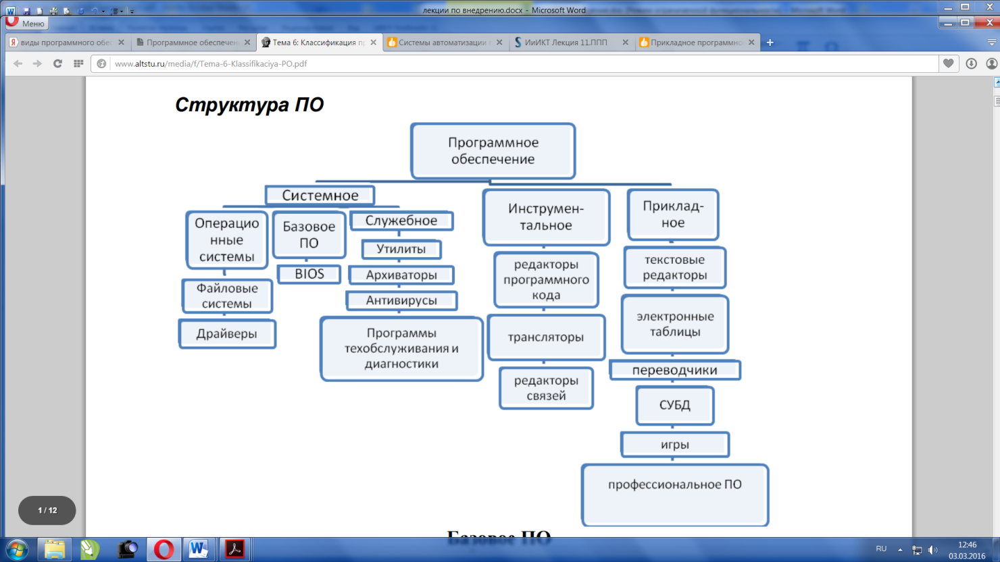

## **Типология программного обеспечения (системное, прикладное, специализированное и отраслевое и пр.).**

` `**Классификация программного обеспечения. Виды программного обеспечения и их характеристики.** 

Программное обеспечение (ПО)– *неотъемлемая часть компьютерной системы*. Оно является логическим продолжением технических средств. 

Уровни ПО (cнизу вверх): 

\1. Базовое ПО – базовый уровень 

\2. Системное ПО – системный уровень 

\3. Служебное (сервисное) ПО 

\4. Прикладное ПО 

Каждый вышележащий уровень повышает функциональность всей системы 

**Базовое ПО** 

**Базовое ПО** – самый низкий уровень ПО. Базовое ПО отвечает за взаимодействие с базовыми аппаратными средствами. Как правило, базовые программные средства непосредственно входят в состав базового оборудования и хранятся в специальных микросхемах, называемых постоянными запоминающими устройствами (ПЗУ). 

Базовое ПО в архитектуре компьютера занимает особое положение. С одной стороны, его можно рассматривать как составную часть аппаратных средств, с другой стороны, оно является одним из программных модулей операционной системы. 

Базовое ПО, или BIOS, представляет программа, которая отвечает за управление всеми компонентами, установленными на материнской плате. Фактически BIOS является неотъемлемой составляющей системной платы и поэтому может быть отнесена к особой категории компьютерных компонентов, занимающих промежуточное положение между аппаратурой и программным обеспечением. 

Функцией базового программного обеспечения является проверка состава и работоспособности вычислительной системы 

` `**Системное ПО** 

.Совокупность программ системного уровня образуют ядро операционной системы (ОС) компьютера. Эти программы обеспечивают взаимодействие всех программ с программами базового уровня и непосредственно с аппаратным обеспечением, отвечают за взаимодействие с пользователем. 

**Служебное (сервисное) ПО** 

Основное назначение служебных программ (утилит) состоит в автоматизации работ по проверке, наладке и настройке компьютерной системы. Некоторые служебные программы (как правило, это программы обслуживания) изначально включаются в состав ОС, но большинство служебных программ являются для ОС внешними и служат для расширения и ее функций. 

Это различные сервисные программы, используемые при работе или техническом обслуживании компьютера, — редакторы, отладчики, диагностические программы, архиваторы, программы для борьбы с вирусами и другие вспомогательные программы. Данные программы облегчают пользователю взаимодействие с компьютером. К ним примыкают программы, обеспечивающие работу компьютеров в сети. Они реализуют сетевые протоколы обмена информацией между машинами, работу с распределенными базами данных, телеобработку информации. 

Классификация служебных программных средств 

\1. **Средства диагностики** Предназначены для автоматизации процесса **диагностики** аппаратного и программного обеспечения. Используются не только для устранения неполадок, но и для оптимизации работы компьютерной системы. Например, Утилита «Дефрагментация диска» позволяет данные, принадлежащие одному файлу, объединить в одной непрерывной области данных 

\2. **Средства сжатия данных (архиваторы**) 

Предназначены для создания архивов. Архивирование данных упрощает их хранение за счет того, что большая группа файлов и каталогов сводятся в один архивный файл 

Наиболее известными архиваторами являются WinZip, WinRAR, WinAce. 

\3. **Средства обеспечения компьютерной безопасности** 

Это средства пассивной и активной защиты данных от повреждения, а также средства от несанкционированного доступа, просмотра и изменения данных. 

Средства пассивной защиты – служебные программы, предназначенные для резервного копирования (нередко они обладают базовыми свойствами архиваторов). 

Средства активной защиты – антивирусное программное обеспечение. 

Для защиты данных от несанкционированного доступа, их просмотра и изменения служат специальные системы, основанные на криптографии. 

\4. **Средства контроля (мониторинга)** 

Они позволяют следить за процессами. происходящими в компьютерной системе. 

\5. **Диспетчеры файлов** 

Программы для выполнения большинства операций, связанных с обслуживанием файловой системы: копирование, перемещение и переименование файлов, создание каталогов (папок), удаление файлов и каталогов, поиск файлов, навигация в файловой структуре. 

Наиболее популярными являются Total Commander (бывший Windows Commander) и FAR Manager. 

\6. **Мониторы установки** 

Предназначены для контроля над установкой ПО. 

\7. **Средства коммуникаций.** 

Они позволяют устанавливать соединение с удаленными компьютерами, обслуживают передачу сообщений электронной почты, работу с телеконференциями и др 

**Прикладное ПО** 

Это комплекс прикладных программ, с помощью которых на данном рабочем месте выполняются конкретные задания Это **программы конечного пользователя**, **общего и специализированного назначения.** Они предназначены для решения задач в конкретной предметной области 

Классификация прикладных программных средств 

\1. Текстовые редакторы 

\2. Текстовые процессоры 

\3. Графические редакторы 

\4. Системы управления базами данных 

\5. Электронные таблицы 

\6. Системы автоматизированного проектирования 

\7. Настольные издательские системы 

\8. Экспертные системы 

\9. WEB-редакторы 

\10. Браузеры 

\11. Бухгалтерские системы 

\12. Геоинформационные системы 

\13. Интегрированные системы делопроизводства 

\14. Финансовые аналитические системы 

\15. Системы видеомонтажа 

**Инструментальное ПО** 

Инструментальное программное обеспечение представляет комплексы программ для создания других программ. Программы инструментального программного обеспечения управляются системными программами, поэтому они относятся к более высокому уровню. К инструментальному ПО относятся: компиляторы, редакторы связей, отладчики, интегрированные системы разработки ПО, например, интегрированная система Delphi. 
## **Операционные системы и их характеристики.**

**Понятие системного программного обеспечения. Операционные системы** 

Основу системного программного обеспечения составляют программы, входящие в операционные системы компьютеров. 

ОС представляет собой комплекс системных и служебных программных средств. 

С одной стороны она опирается на базовое ПО компьютера, входящее в состав BIOS (базовая система ввода-вывода), с другой стороны, она сама является опорой для ПО более высоких уровней – прикладных и большинства служебных приложений. 

Все ОС обеспечивают свой автоматический запуск. 

После включения компьютера производится самотестирование компьютера и затем загрузка операционной системы с системного диска в оперативную память. Загрузка должна выполняться в соответствии с программой загрузки. Однако для того чтобы компьютер выполнял какую-нибудь программу, эта программа должна уже находиться в оперативной памяти, а в момент включения компьютера в его оперативной памяти нет ничего, поскольку оперативная память не может ничего хранить без подзарядки ячеек. Разрешение этого противоречия состоит в последовательной, поэтапной загрузке операционной системы. 

Самотестирование компьютера. В состав компьютера входит постоянное запоминающее устройство (ПЗУ), содержащее программы тестирования компьютера и первого этапа загрузки операционной системы, – это BIOS (Basic Input/Output System – базовая система ввода/вывода). 

После включения питания компьютера процессор начинает выполнение программы самотестирования компьютера POST (Power-ON Self Test). Производится тестирование работоспособности процессора, памяти и других аппаратных средств компьютера. 

Загрузка операционной системы. После проведения самотестирования специальная программа, содержащаяся в BIOS, начинает поиск загрузчика операционной системы. Происходит поочередное обращение к имеющимся в компьютере дискам (гибким, жестким, CD-ROM) и поиск на определенном месте (в первом, так называемом загрузочном, секторе диска) наличия специальной программы Master Boot (загрузчика операционной системы). 

Если установлен системный диск и программа-загрузчик оказывается на месте, то она загружается в оперативную память и ей передается управление работой компьютера. Программа ищет файлы операционной системы на системном диске и загружает их в оперативную память в качестве программных модулей. Если системные диски в компьютере отсутствуют, на экране монитора появляется сообщение «Non system disk», и компьютер «зависает», то есть загрузка операционной системы прекращается и компьютер остается неработоспособным. После окончания загрузки операционной системы управление передается командному процессору. 

ОС предназначены для обеспечения нескольких видов интерфейса: 

\- интерфейса между пользователем и программно-аппратными средствами компьютера (интерфейс пользователя); 

\- интерфейса между программным и аппратным обеспечением (аппаратно-программный интерфейс); 

\- интерфейса между разными видами программного обеспечения (программный интерфейс). 

**Основные функции ОС:** 

\- выполнение по запросу программ тех достаточно элементарных (низкоуровневых) действий, которые являются общими для большинства программ и часто встречаются почти во всех программах (ввод и вывод данных, запуск и остановка других программ, выделение и освобождение дополнительной памяти и др.); 

\- загрузка программ в оперативную память и их выполнение; 

\- стандартизованный доступ к периферийным устройствам (устройства ввода-вывода); 

\- управление оперативной памятью (распределение между процессами, организация виртуальной памяти); 

\- управление доступом к данным на энергонезависимых носителях (таких как жесткий диск, оптические диски и др.), организованным в той или иной файловой системе; 

\- обеспечение пользовательского интерфейса; 

\- сетевые операции, поддержка стека сетевых протоколов. 

Дополнительные функции ОС: 

\- параллельное или псевдопараллельное выполнение задач (многозадачность); 

\- эффективное распределение ресурсов вычислительной системы между процессами; 

\- разграничение доступа различных процессов к ресурсам; 

\- организация надежных вычислений (невозможности одного вычислительного процесса намеренно или по ошибке повлиять на вычисления в другом процессе), основанная на разграничении доступа к ресурсам; 

\- взаимодействие между процессами: обмен данными, взаимная синхронизация; 

\- защита самой системы, а также пользовательских данных и программ от действий пользователей (злонамеренных или по незнанию) или приложений; 

\- многопользовательский режим работы и разграничение прав. 

**Современные ОС**: 

\1. **ОС семейства Windows** - продукт корпорации Microsoft. 

Свою «родословную» Windows начинают от операционной системы **DOS** и первоначально представляли собой надстраиваемые над ней оболочки (Windows запускался из под DOS), увеличивающие возможности DOS и облегчающие неподготовленному пользователю работу с компьютером. Уже более поздние версии (начиная с Windows NT) представляли собой полноценные операционные системы. Преимуществом Windows считается дружественный для пользователя интерфейс. Из недостатков отмечают ненадежность системы. 

\2. **Unix-подобные ОС** 

Операционная система UNIX оказала большое влияние на развитие мира операционных систем, заложив основы работы современных ОС. Изначально UNIX был системой для разработки ПО. Несмотря на то, 

что Unix-подобные системы уступают по популярности Windows, они работают на больших типах компьютеров. 

\- **Linux** - представляет собой множество Unix-подобных операционных систем (дистрибутивов), которые чаще всего являются свободно распространяемыми? 

\- **MAC OS** - также создавалась на основе ядра UNIX. Является продукт компании Apple для ее же компьютеров Macintosh. Считается надежной и удобной. Но в отличие от Windows не так популярна 

Пример. 

Из программных средств Microcoft: MS DOS, MS Office, MS SQL, MS Visual Studio операционной системой является **MS DOS**
