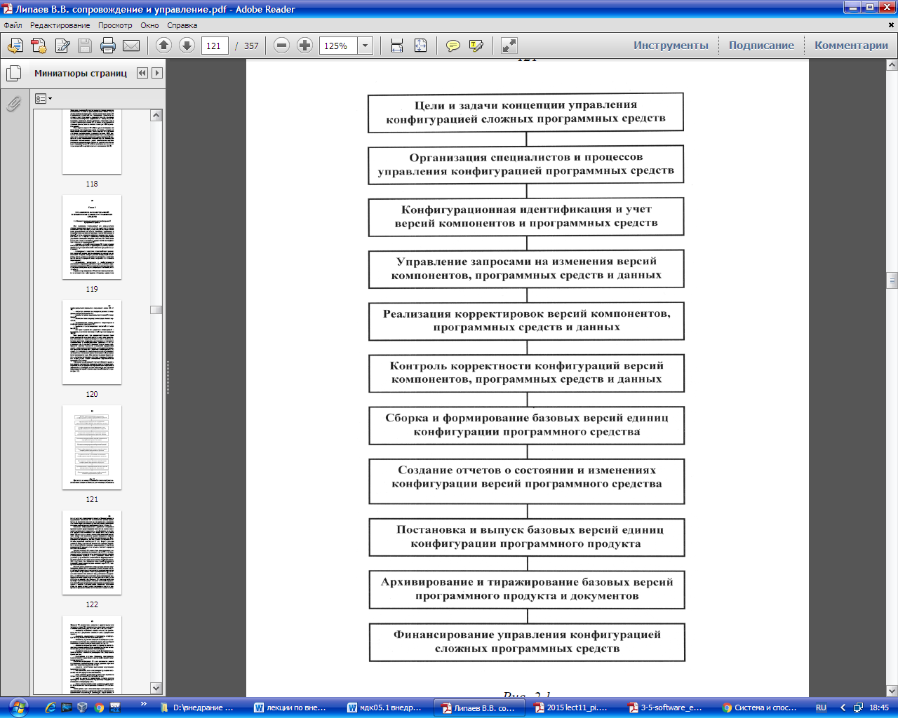
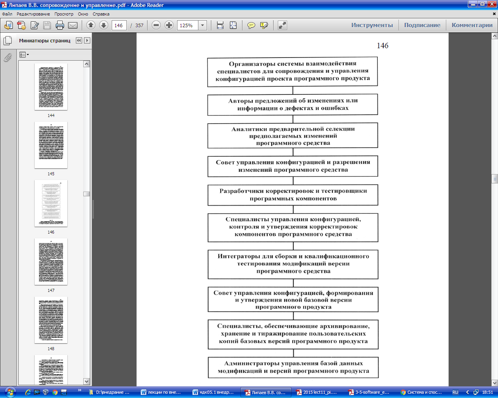
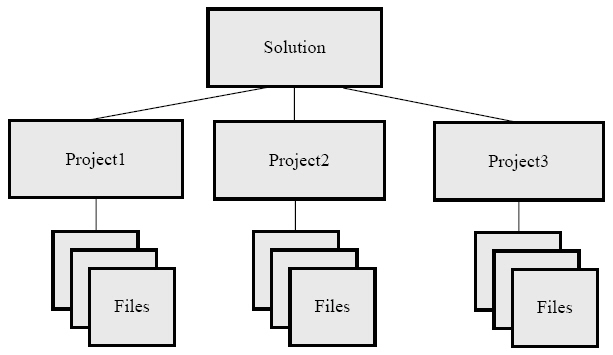
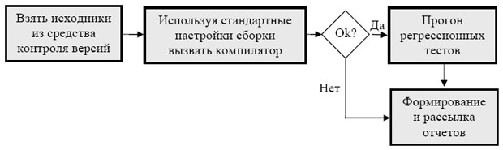
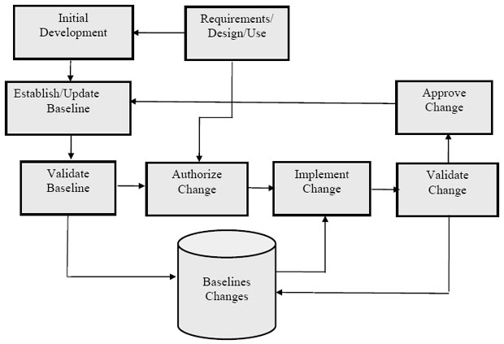

## **Настройка  и конфигурирование установленного программного обеспечения компьютерных систем**
**2.1. Методы и процессы управления конфигурацией**

**программных средств**

Цель управления конфигурацией при сопровождении сложных программных средств и систем, состоящих из многих компонентов (единиц конфигурации), каждый из которых может иметь разновидности или версии, обеспечить управляемое и контролируемое развитие их структуры, состава компонентов и функций, а также сокращение дефектов в течение всего жизненного цикла ПС. В процессе организации конфигурационного

управления необходимо построить и использовать компактные и наглядные схемы однозначной иерархической идентификации и изменения компонентов ПС:

- объектов модулей и компонентов ПС, разного уровня интеграции, подвергающихся корректировкам (систему идентификации и адресации изменений в комплексе программ и в документах);
- корректировок содержания и взаимодействия проводимых изменений, которая должна обеспечивать возможность однозначного контроля, истории развития модификаций компонентов любого уровня, во времени и в пространстве элементов версий комплекса программ (типы, содержание и взаимосвязь корректировок);
- специалистов, участвующих в конфигурационном управлении и сокращении дефектов, их права на доступ к определенным компонентам ПС и документам на конкретных стадиях сопровождения, реализации и утверждения изменений (см. п.1.2 табл. 2).

В процессе проектирования ПС должна быть формализована и документально зафиксирована Концепция организации конфигурационного управления, содержащая в основе:

- ожидаемую длительность поддержки развития и модификации конкретного проекта ПС;
- масштаб и уровень предполагаемых изменений и модификаций;
- возможное число и периодичность выпуска базовых версий ПС;
- организационные основы процессов сопровождения и конфигурационного управления ПС;
- требования к документированию изменений и базовых версий ПС;
- кто будет осуществлять управление конфигурацией покупатель, разработчик или специальный персонал поддержки ЖЦ ПС.

Если предполагается, что программный продукт будет иметь длительный жизненный цикл или ожидаются значительные изменения, то следует рассмотреть и учесть наиболее детальные требования к методике организации и к коллективу, ответственному за конфигурационное управление и его документирование. В стратегии управления следует учесть характеристики системы: количество компонентов программного средства, типы, размер и критичность создаваемых и применяемых программных продуктов. Управление конфигурацией (УК)

следует организовать так, чтобы персонал знал свои обязанности и имел достаточно независимости и полномочий для выполнения поставленных задач. Для описания политики фирмы, видов ее деятельности и правил, связанных с процессом управления конфигураций, следует использовать формализованные процедуры и документы.

***Управление конфигурацией*** включает действия и средства, позволяющие устанавливать категории, статус и личности руководителей, которые правомочны определять целесообразность и эффективность изменений, а также техническую реализуемость

корректируемых версий с учетом ограничений бюджетов и сроков (рис. 2.1).

*Рис. 2.1*

**Средства управления конфигурацией ПО — PVCS (Merant), ClearCase (Rational Software)** 

**PVCS**  - Пакет для разработки управления конфигурацией. Он включает в себя менеджер версий, конструкций и релизов; менеджер несоответствий и изменений; менеджер исполнения в интегрированной системе, обеспечивающие динамическое представление процессов разработки и выпуска. При помощи PVCS разработчики могут легко моделировать жизненные циклы продукта, приспосабливая его под нужды предприятия, и ускорять процесс выпуска готового продукта, обеспечивая его своевременность и предсказуемость.

**ClearCase**

Рекомендованный как средство контроля для командной разработки ClearCase превосходно справляется с возложенной на него задачей. Являясь, по сути, высоко масштабируемым приложением клиент-сервер ClearCase объединяет всех участников проекта единой средой, хранящей всю возможную информацию, относящуюся к проекту, позволяя получать последние версии, редактируемых файлов.

Продукт совмещает полный SCM, включая контроль над версиями, управление рабочим пространством, с помощью уникального инвариантного подхода. Посредством ClearCase команда разработчиков может ускорить циклы разработки, убедиться в точности релизов, создавая новые, надежные в эксплуатации продукты, а также дорабатывать и поддерживать ранее реализованные продукты, организовывать эффективный процесс разработки - и все это без изменения среды, инструментальных средств и подхода к работе.

Продукт обеспечивает продвинутое управление версиями исходных текстов, библиотек и исходников на протяжении всего жизненного цикла проекта, позволяя тем самым разработчику вернуться к любой версии редактируемого файла и откорректировать его, создав новую версию.

Каждый участник проекта может иметь доступ как ко всем файлам проекта, так и к только определенной его части. Для достижения подобного эффекта ClearCase использует мощную систему настраиваемых фильтров, скрывающих ненужную информацию. Система видов разительно отличает ClearCase от продуктов конкурирующих фирм, поскольку позволяет осуществить параллельную разработку, а также позволяет отдельному участнику проекта выходить из общего состава разработки, забирая работу "на дом", а после всех внесенных изменений вернуть версии снова в проект. При этом ClearCase осуществит автоматическое слияние версий.

В дополнение к описанным возможностям, ClearCase позволяет объединять географически удаленные команды разработчиков посредством MultiSite - специального модуля, осуществляющего репликацию (передачу) текущего состояния проекта на указанный сайт.

В условиях бурно развивающейся и подверженной изменениям, IT индустрии, ставится все сложнее и сложнее давать оценку программному продукту как чему-то независимому, вырванному его из общего контекста разработки. Поэтому принимается во внимание степень поддержки данного продукта теми или иными средствами компаний, создающими средства разработки. В частности, продукт версионного контроля не может быть функционально полным без определенных механизмов интеграции со средствами разработки, с различными дополнительными генераторами отчетов, и пр.

ClearCase обеспечивает наиболее тесную интеграцию как с продуктами самой Rational (Rose, SoDA, ClearQuest, Requisite PRO) так и с продукцией компании Microsoft (Visual C++, Visual Basic).

#### **!!!Конфигурационное управление**
<http://www.pcweek.ru/infrastructure/article/detail.php?ID=56131>

<http://www.intuit.ru/studies/courses/945/353/lecture/8412>
###### *Проблема*
Всем известно, что на крупных промышленных предприятиях, в магазинах, книжных издательствах и пр. существуют склады. Основная задача склада – обеспечить хранение и *доступ* к материальным *активам*: *товарам*, изделиям, книгам и пр. То есть различных материальных *активов* становится так много, что необходима специальная *служба* *по* их учету. Оказывается, что не достаточно складывать, например, все, имеющиеся в книгоиздательстве книги в специальную комнату и выдавать их владельцам тиража, когда они за ними придут. Книг оказывается очень много, а процедура выдачи тиража – не совсем тривиальной. Нужно, чтобы владелец принес большое количество сопроводительных документов, и все они должны быть проверены перед выдачей книг. А на самом складе необходимо поддерживать порядок, чтобы было возможно быстро найти нужные книги (как показывает*опыт*, они могут там довольно долго находиться). Еще более сложная процедура работы с книгами в библиотеке – там добавляются еще каталоги, распределенные книжные хранилища, необходимость поддерживать хорошее состояние книг, а также контролировать возврат их в библиотеку после определенного срока. Аналогичным образом работает склад на любом заводе, фабрике и т.д.

Рассмотрим теперь проект *по* *разработке программного обеспечения*. Что в нем является аналогом материальных *активов* на обычном производстве? Определенно, не столы и стулья, которыми пользуются разработчики. И даже не компьютеры, запчасти к ним и прочее оборудование. Учета и контроля, сродни складскому, требуют **файлы** проекта. В программном проекте их очень много – сотни и тысячи даже для относительно небольших проектов. Ведь создать новый *файл* очень легко. Многие технологии программирования поддерживают стиль, когда, например, для каждого класса создается свой отдельный *файл*.

*Файл* – это виртуальная информационная *единица*. В чем главное отличие файла от материальных единиц учета? В том, что у файла может быть **версия**, и не одна, и породить эти версии очень легко – достаточно скопировать данный *файл* в другое *место*на диске. В то время как материальные предметы существуют на складе сами *по* себе, и для них нет понятия версии. Да, может быть несколько однотипных предметов, разных заготовок изделия различной степени готовности. Но все это не то….. А версия файла – это очень непростой *объект*. Чем одна версия отличается от другой? Несколькими строчками текста или полностью обновленным содержанием? И какая из двух и более версий главнее, лучше? К этому добавляется еще и то, что многие *рабочие продукты* могут состоять из набора файлов, и каждый из них может иметь *по* несколько версий. Как собрать *корректную версию продукта*?

В итоге в программном проекте начинают происходить мистические и загадочные события.

- Тщательно оттестированная программа на показательных *испытаниях* не работает
- Функциональность, о которой долго просил заказчик и которая была, наконец, добавлена в продукт, и новая версия торжественно отослана заказчику, таинственным образом исчезла из продукта.
- На компьютере разработчика программа работает, а у заказчика – нет….

Разгадка проста – все дело в версиях файлов. Там, где все хорошо, присутствуют файлы одной версии, а там, где все плохо – другой. Но беда в том, что "версия всего продукта" – это абстрактное понятие. На деле есть версии отдельных файлов. Один или несколько файлов в поставке продукта имеют не ту версию – все, дело плохо. Необходимо управлять версиями файлов, а то подобная мистика может стать огромной проблемой.

Она серьезно тормозит внутреннюю работу. То разработчики и тестеры работают с разными версиями системы, то итоговая*сборка* системы требует специальных усилий всего коллектива. Более того, возможны неприятности на уровне управления. Различные курьезные ситуации, когда заявленная функциональность отсутствует или не работает (опять не те файлы послали!), могут сильно *портить* отношения с заказчиком. Недовольный заказчик может потребовать даже денежной компенсации за то, что возникающие ошибки слишком подолгу исправляются. А будет тут не долго, когда разработчики не могут воспроизвести и исправить ошибку, так как не могут точно определить, из каких же исходных текстов была собрана данная версия!

Итак, становится понятно, что в программных проектах необходима специальная *деятельность* *по* поддержанию файловых*активов* проекта в порядке. Она и называется **конфигурационным управлением**.

Выделим две основные задачи в *конфигурационном управлении* – **управление версиями** и **управление сборками**. Первое отвечает за управление версиями файлов и выполняется в проекте на основе специальных программных пакетов – **средств версионного контроля**. Существует большое количество таких средств – *Microsoft* *Visual* SourceSafe, *IBM* ClearCase, cvn, subversion и др. Управление *сборками* – это автоматизированный процесс трансформации исходных текстов *ПО* в пакет исполняемых модулей, учитывающий многочисленные настройки проекта, настройки *компиляции*, и интегрируемый с процессом*автоматического тестирования*. Эта процедура является мощным средством *интеграции* проекта, основой *итеративной* разработки.
###### *Единицы конфигурационного управления*
Так чем же мы управляем в рамках этой *деятельности*? Любыми ли файлами, которые имеются в проекте? Нет, не любыми, а только теми, которые изменяются. Например, файлы с используемым в проекте покупным *ПО* должны себе спокойненько покоиться на *CD*-*дисках* или в *локальной сети*. Книги, документы с внешними стандартами, используемыми в проекте (например, в*телекоммуникациях* очень много разных стандартов на *сетевые интерфейсы*) и пр. также должны просто храниться там, где каждый желающий их может взять. Как правило, такой информации в проекте немного, но, разумеется, она должна быть в порядке. Однако ради этого специальный вид *деятельности* в проекте не нужен.

Итак, *конфигурационное управление* имеет дело с меняющимися в процессе продуктами, состоящими из наборов файлов. Такие продукты принято называть **единицами конфигурационного управления** (*configuration management* *items*). Вот примеры:

1. пользовательская документация;
1. проектная документация;
1. исходные тексты ПО;
1. пакеты тестов;
1. инсталляционные пакеты ПО;
1. *тестовые отчеты*.

У каждой единицы конфигурационного управления должно быть следующее.

1. Структура – набор файлов. Например, пользовательская документация в *html* должна включать индекс-файл и набор *html*-файлов, а также набор вынесенных картинок (*gif* или *jpeg*-файлы). Эта структура должна быть хорошо определена и отслеживаться при *конфигурационном управлении* – что все файлы не потеряны и присутствуют, имеют одинаковую версию, корректные ссылки друг на друга и т.д.
1. Ответственное лицо и, возможно, группу тех, кто их разрабатывает, а также более широкую и менее ответственную группу тех, кто пользуется этой информацией. Например, определенной *программной компонентой* могут в проекте пользоваться многие разработчики, но отвечать за ее разработку, исправление ошибок и пр. должен кто-то один.
1. Практика конфигурационного управления – кто и в каком режиме, а также в какое место выкладывает новую версию элемента конфигурационного управления в средство управления версиями, правила именования и комментирования элемента в этой версии, дальнейшие манипуляции с ним там и пр. Более высокоуровневые правила, связанные, например, с правилами изменения тестов и тестовых пакетов при изменении кода. Однако, где-то здесь лежит водораздел между *конфигурационным управлением* и иными видами *деятельности* в проекте
1. Автоматическая процедура *контроля целостности* элемента – например, сборка для исходных текстов программ. Есть не у всех элементов, например, может не быть у документации, тестовых пакетов.

Элементы конфигурационного управления могут образовывать *иерархию*. Пример представлен на [рис. 6.1](http://www.intuit.ru/studies/professional_retraining/945/courses/353/lecture/8412?page=1#image.6.1).

**Рис. 6.1.**
###### *Управление версиями*
**Управление версиями файлов**. Поскольку программисты имеют дело с огромным количеством файлов, многие файлы в один момент могут быть необходимы нескольким людям и важно, чтобы все они постоянно составляли единую, как *минимум*, компилирующуюся версию продукта, необходимо, чтобы была налажена работа с файлами с исходным кодом. Также может быть налажена работа и с другими *типами файлов*. В этой ситуации файлы оказываются самыми младшими (*по* иерархии включения) элементами конфигурационного управления.

**Управление версиями составных конфигурационных объектов. Понятие "ветки" проекта**. Одновременно может существовать несколько версий системы – и в смысле для разных заказчиков и пр. (так сказать, в большом, настоящем смысле), и в смысле одного проекта, одного заказчика, но как разный набор исходных текстов. И в том и в другом случае в средстве управления версиями образуются разные **ветки**. Остановимся чуть подробнее на втором случае.

Каждая *ветка* содержит полный образ исходного кода и других *артефактов*, находящихся в *системе контроля версий*. Каждая*ветвь* может развиваться независимо, а может в определенных точках интегрироваться с другими ветвями. В процессе *интеграции*изменения, *произведенные* в одной из ветвей, полуавтоматически переносятся в другую. В качестве примера можно рассмотреть следующую структуру разделения проекта на ветки.

- V1.0 – ветвь, соответствующая выпущенному *релизу*. Внесение изменений в такие ветви запрещены и они хранят образ кода системы на момент выпуска релиза.
- Fix V1.0.1 – ветвь, соответствующая выпущенному пакету исправлений к определенной версии. Подобные ветви ответвляются от исходной версии, а не от основной ветви и замораживаются сразу после выхода пакета исправлений.
- Upcoming (V1.1) – ветвь, соответствующая *релизу*, готовящемуся к выпуску и находящемуся в стадии стабилизации. Для таких ветвей, как правило, действуют более строгие правила и работа в них ведется более формально.
- Mainline – ветвь, соответствующая основному направлению развития проекта. По мере созревания именно от этой ветви отходят ветви готовящихся релизов.
- WCF *Experiment* – ветвь, созданная для проверки некоторого технического решения, перехода на новую технологию, или внесения большого пакета изменений, потенциально нарушающих работоспособность кода на длительное время. Такие ветви, как правило, делаются доступными только для определенного круга разработчиков и убиваются по *завершению работ* после*интеграции* с основной веткой.
###### *Управление сборками*
Итак, почему же процедура *компиляции* и создания exe *dll* файлов *по* исходникам проекта – такая важная процедура? Потому что она многократно в день выполняется каждым разработчиком на его собственном компьютере, с его собственной версией проекта. При этом отличается:

- набор подпроектов, собираемых разработчиком; он может собирать не весь проект, а только какую-то его часть; другая часть либо им не используется вовсе, либо не пересобирается очень давно, а по факту она давно изменилась;
- отличаются параметры *компиляции*.

При этом если не собирать регулярно итоговую версию проекта, то общая *интеграция* может выявить много разных проблем:

- несоответствие друг другу различных частей проекта;
- наличие специфических ошибок, возникших из-за того, что отдельные проекты разрабатывались без учета параметров*компиляции* (в частности, переход в *Visual Studio* c *debug* на *release* версию часто сопровождается появлением многочисленных проблем).

В связи с этим процедуру сборки проекта часто автоматизируют, то есть выполняют не из *среды разработки*, а из специального скирпта – *build*-*скрипта*. Этот *скрипт* используется тогда, когда разработчику требуется полная *сборка* всего проекта. А также он используется в процедуре непрерывной *интеграции* (*continues* *integration*) – то есть регулярной сборке всего проекта (как правило – каждую ночь). Как правило, процедура непрерывной *интеграции* включает в себя и *регрессионное тестирование*, и часто – создание инсталляционных пакетов. Общая схема автоматизированной сборки представлена на [рис. 6.2](http://www.intuit.ru/studies/professional_retraining/945/courses/353/lecture/8412?page=1#image.6.2).

**Рис. 6.2.**

Тестировщики должны тестировать *по* возможности итоговую и целостную версию продукта, так что результаты регулярной сборки оказываются очень востребованы. Кроме того, наличие базовой, актуальной, целостной версии продукта позволяет организовать разработку в итеративно-инкрементальном стиле, то есть на основе внесения изменений. Такой стиль разработки называется *baseline*-метод.
###### *Понятие baseline*
*Baseline* – это *базовая*, последняя целостная версия некоторого продукта разработки, например, документации, программного кода и т.д. Подразумевается, что разработка идет не сплошным потоком, а с фиксацией промежуточных результатов в виде текущей официальной версии разрабатываемого актива. Принятие такой версии сопровождается дополнительными действиями *по*оформлению, сглаживанию, тестированию, включению только законченных фрагментов и т.д. Этот результат можно посмотреть, отдать тестировщикам, передать заказчику и т.д. *Baseline* служит хорошим средством синхронизации групповой работы.

*Baseline* может быть совсем простой – веткой в средстве управления версиями, где разработчики хранят текущую версию своих исходных кодов. Единственным требованием в этом случае может быть лишь общая компилируемость проекта. Но *поддержкаbaseline* может быть сложной формальной процедурой, как показано на [рис. 6.3](http://www.intuit.ru/studies/professional_retraining/945/courses/353/lecture/8412?page=1#image.6.3).

**Рис. 6.3.**

*Baseline* может также поддерживаться непрерывной интеграцией.

Важно, что *Baseline* (особенно в случае с программными активами) не должна устанавливаться слишком рано. Сначала нужно написать какое-то количество кода, чтобы было что интегрировать. Кроме того, вначале много внимания уделяется разработке основных архитектурных решений, и целостная версия оказывается не востребованной. Но начиная с какого-то момента она просто необходима. Какой этот момент – решать членам команды. Наконец, существуют проекты, где автоматическая *сборка* не нужна вовсе – это простые проекты, разрабатываемые небольшим количеством участников, где нет большого количество исходных текстов программ, проектов, сложных параметров *компиляции*.

