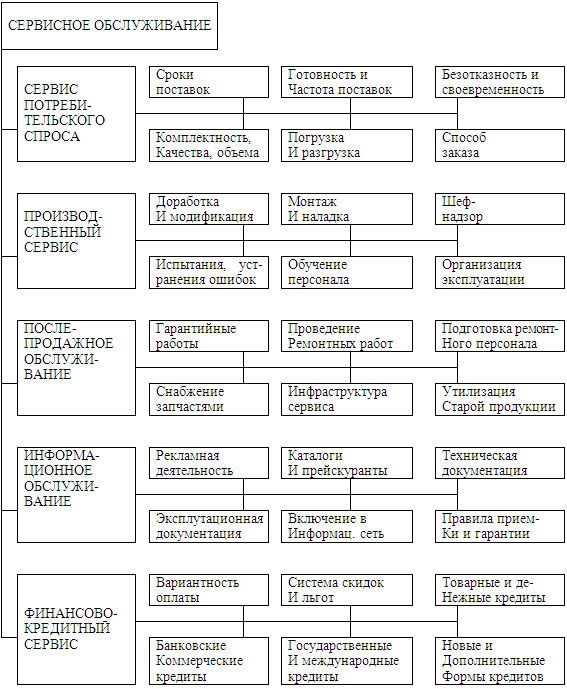

## **Условия поддержки программных продуктов**
## **Гарантийное  и сервисное обслуживание  программного обеспечения компьютерных систем.**
**На ранних стадиях эксплуатации существует гарантийный период**, когда разработчик сохраняет ответственность за исправление ошибок в программном продукте.

**Окончание гарантийного периода** фиксируется окончательной приемкой, критерием которой служит успешное выполнение всех приемных тестов и подтверждение выполнения всех требований пользователя

Гарантийное обслуживание — это безвозмездное устранение изготовителем или продавцом неисправностей путем диагностики, настройки и ремонта его составных частей или Устройства в целом в течение гаран- тийного срока, либо замену на аналогичные отремонтированные при соблюдении пользователем условий гарантии и при условии, что дефект возник по вине производителя данного устройства. Гарантийное обслу- живание распространяется на все Устройства, легально произведенные и проданные, вне зависимости от реального (конечного) пользователя (далее – Потребитель)

**Гарантия — это обязательство производителя в течение определенного периода времени устранять возможные производственные дефекты,**

Заказчики разработки программного обеспечения часто сталкиваются с проблемой обслуживания готового продукта. С одной стороны, статья 470 ГК РФ предусматривает гарантию на программное обеспечение, с другой, — размер гарантийных обязательств, распространяющихся на продукт по закону, не всегда в полной мере удовлетворяет потребности покупателей.

### **Гарантийные обязательства**

В соответствии с действующим законодательством РФ, изготовитель (исполнитель) вправе устанавливать гарантийный срок на программное обеспечение — период, в течение которого он обязуется удовлетворить требования потребителя в отношении некачественного товара (работы, услуги). Гарантия — обязательство устранить возникшие по вине производителя неполадки в работе или конструкции. Когда речь идет о программном комплексе, гарантия распространяется на него целиком, включая серверное оборудование и другие компоненты системы. Другими словами, в течение гарантийного срока на программное обеспечение разработчик обязан в оговоренный срок предоставить исправно работающую версию ПО, но при соблюдении следующих требований:

- документально подтвержденное свидетельство наличия сбоя;
- подтверждение того, что сбой произошел по вине разработчика;
- корректная эксплуатация программного обеспечения в соответствии с инструкцией;
- отсутствие самостоятельного вмешательства заказчика в устройство программного обеспечения;
- соответствие претензии заказчика требованиям технического задания.

Согласно законодательству, разработчик должен в рамках гарантийного обязательства устранять лишь те недоработки, которые были допущены по его вине. Экспертиза может длиться некоторое время, и все это время ПО работать не будет. Если же выяснится, что в неполадках виноват пользователь, разработчик не обязан устранять ошибки либо предоставлять новую версию программы.

### **Техническая поддержка**

Очевидно, обслуживание по гарантии не подходит для непрерывно работающих сервисов, поскольку требует временных затрат, что может привести к потере клиентов. Гарантия также не подходит для программного обеспечения, когда требуется избыточная надежность. Не в качестве замены гарантии, но для более полного удовлетворения потребностей клиентов **EDISON** предлагает техническую поддержку. Ее главное отличие от гарантийного обязательства в том, что разработчик обязуется устранять любые недочеты, в том числе возникшие по вине пользователя и выходящие за рамки технического задания. Причем делать это максимально быстро. Техническая поддержка может включать обучение персонала работе с продуктом, конфигурирование, предоставление горячей линии, наблюдение за работоспособностью и т.д.

Для большей наглядности представим особенности гарантийного обязательства и технической поддержки в виде сравнительной таблицы.

||**Гарантия**|**Техническая поддержка**|
| :-: | :-: | :-: |
|Стоимость услуги|Гарантия на год составляет в среднем 15% стоимости разработки.|Оплачивается дополнительно исходя из фактически затраченных часов.|
|Устранение недочетов|Возникших только по вине разработчика в соответствии с техническим заданием.|Любых.|
|Сроки реагирования на заявку клиента|От одной до нескольких недель после получения претензии и проведения экспертизы.|Моментальная реакция. Максимально быстрое исправление. Возможна круглосуточная работа.|
|Персонализация продукта|Предоставляется продукт с характеристиками, соответствующими заданию.|Продукт дорабатывается для оптимального выполнения конкретных задач по ходу эксплуатации.|
|Консультации|В соответствии с заданием.|Предоставляются.|
|Возможность модернизации продукта, расширение его функциональности|Не предусмотрена.|Выполняется по дополнительному соглашению. Предусмотрена.|
Гарантийное обслуживание производиться бесплатно в случае поломки так же если будет установлено что поломка произошла не по вине покупателя в гарантийный период времени 
Существует гарантия от изготовителя и от продавца.
Сервисное обслуживание чистка, плановая замена деталей производиться в в определенных местах указанных производителем, сервисных центрах.
В случае если в период гарантийного срока обслуживание проводилось не в сервисном центре изготовителя, покупатель теряет право на гарантийное обслуживание.

Сервис можно разделить на следующие разновидности, классификация которых приведена на рисунке.

Все приведенные разновидности сервисных услуг можно разделить на три группы в зависимости от этапа, на котором они представлены покупателю:

- предпродажные услуги
- услуги, сопутствующие процессу продажи продукции;
- послепродажные услуги.

Рассмотрим более детально виды сервисного обслуживания, характерные для производственной логистики. Такое сервисное обслуживание несколько отличается от сервиса в торговой логистике (т.е. сервиса в системе торгового посредничества).

Классификация видов сервисного обслуживания в производственной логистике:

*Классификация видов сервисного обслуживания*

Договор сервисного обслуживания - договор, по которому одна сторона (исполнитель) принимает на себя завознаграждение обязанности по обслуживанию, ремонту и профилактике проданных другой стороной(производителем) машин, оборудования и устройств в течение гарантийного или другого установленногосоглашением периода.
## **Услуги по обслуживанию  программного обеспечения компьютерных систем:  удаленной поддержки,  поддержки на месте,  планирования и проектирования,  инсталляции и миграции.**
http://xproga.ru/servises/podderjka-program-solution

http://nasda.ru/index.php/it-out/serv-comp/serv-soft

http://www.goatbabe.com/ru/services/software/default.htm

Услуги по поддержке программного обеспечения повышают надежность и производительность информационных систем, увеличивают их жизненный цикл и сохраняют вложенные в них инвестиции. За фиксированную цену Вы существенно снижаете Ваши технологические риски.

**Сервисное обслуживание программного обеспечения**

Техническое обслуживание программного обеспечения предполагает комплекс услуг, обеспечивающий всестороннюю поддержку эксплуатации программных продуктов IBM.

**Услуги удаленной поддержки**

Сервисный Центр IBM обеспечит высококвалифицированную помощь в локализации и разрешении проблем в Вашей сложной, многоплатформенной среде. Это оптимизирует усилия Вашего персонала по устранению проблем эксплуатации ПО, минимизирует потери рабочего времени пользователей, повысит общую эффективность использования информационно-компьютерной системы.

**Услуги поддержки на месте**

В комбинации с услугами удаленной поддержки специалисты IBM обеспечат экспертный уровень разрешения проблем на месте в случае реального или потенциального ущерба для бизнеса, а также поддержку во время инсталляций и настройки ПО на месте.

**Услуги планирования и проектирования**

Комплекс услуг по планированию и проектированию призван помочь подготовить информационные системы к работе в Вашей производственной среде в соответствии с требованиями бизнеса и с учетом развития и расширения Ваших требований.

Услуги доступны для всех аппаратно-программных платформ IBM и операционных систем, системного программного обеспечения и кросс-платформенных продуктов других производителей.

**Создание систем высокой надежности**
**High Availability Services**

Плановые и неожиданные простои компьютерных систем могут оказывать значительное влияние на бизнес и вызывать дополнительные издержки, связанные с потерей продаж, снижением уровня обслуживания, потерей доверия клиентов, производственными потерями. Набор услуг IBM по созданию систем высокой надежности поможет активно предотвращать простои и минимизировать последствия, если остановка системы все же произошла.

Системы высокой надежности IBM основаны на программно-аппаратных кластерных решениях, которые существуют для всех предлагаемых IBM платформ — от S/390 Parallel Sysplex до PC.

Работая в тесном взаимодействии с Вашими сотрудниками, инженеры IBM проанализируют специфические требования и условия бизнеса, процессы и процедуры управления Вашей информационной системой для достижения ее оптимальной производительности и надежности.

Услуги IBM по созданию систем высокой надежности позволят:

- Повысить уровень надежности Вашей компьютерной системы до 99,999%
- Проанализировать требования Вашего бизнеса к информационной системе
- Внедрять решение поэтапно, в соответствии с ростом Ваших потребностей
- Предотвратить простои системы и повысить эффективность управления имеющимися ресурсами
- Получить сбалансированное по затратам и эффективности решение, отвечающее требованиям Вашего бизнеса.

**Услуги инсталляции и миграции**

Услуги инсталляции и миграции — это пакет сервисных предложений, обеспечивающих получение максимума возможного от Ваших компьютерных систем.

С помощью услуг инсталляции «под ключ» IBM SmoothStart, специалисты сервиса IBM обеспечат установку и подключение систем на месте, что поможет ускорить ввод в эксплуатацию оборудования и программного обеспечения. Услуги IBM SmoothStart спроектированы таким образом, чтобы помочь управлять следующими фазами жизненного цикла Вашей компьютерной системы:

- Планирование Программного обеспечения
  Анализируя Ваши требования, специалист IBM Global Services разработает план инсталляции и/или миграции программного обеспечения, особо обращая внимание на требования, связанные с прикладным ПО, производительностью системы, требованиями сетевого взаимодействия.
- Установка оборудования
  Наши сертифицированные специалисты установят, подключат и проверят Ваше компьютерное оборудование.
- Установка ПО
  Мы встроим и установим ПО на Вашу систему (централизованную или распределенную) и обеспечим интеграцию с другими необходимыми компонентами. По окончании инсталляции Вы получите полностью сконфигурированную, протестированную, готовую к работе систему, снабженную подробной документацией, отражающей параметры настройки и сделанных модификаций операционной системы и системного ПО.
- Услуги Миграции
  Профессионалы IBM помогут Вам осуществить миграцию приложений и данных на другие платформы, обеспечив различные виды тестирования и резервирования в случае необходимости.

## **Создание систем высокой надежности**
Системы высокой надежности - это комплекс программных и технических средств, предназначенных для обеспечения непрерывной безотказной работы критичных программных систем (таких как бизнес-системы управления предприятием, АБС, корпоративные БД, WEB-сервера, процессинговые системы и др.). Системы высокой надежности позволяют избежать аварийного разрушения информации, отказов и остановки критичных программных систем, от которых может зависеть успешная работа организации.

По материалам независимого агентства **Gartner Group** основными причинами внеплановых остановок (отказов), влияющими на работу программных систем являются:

|||Программное обеспечение|30%|
| :-: | :-: | :- | :- |
|||Технические средства|40%|
|||Люди|20%|
|||Среда|10%|

Любая система высокой надежности включает в себя целый комплекс элементов, каждый из которых требует пристального внимания.

Выбор и реализация систем высокой надежности, как правило, является составной частью политики автоматизации многих крупных промышленных организаций и финансовых учреждений.

