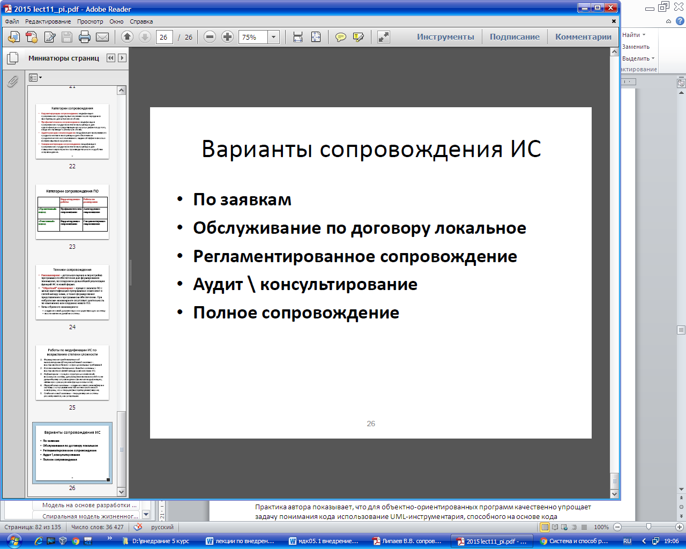

## **Задачи сопровождения программного обеспечения компьютерных систем.**
2 Задачи службы сопровождения программного изделия

В процессе эксплуатации программного изделия пользователи взаимодействуют с организацией (группой), ответственной за сопровождение. **Задачи службы сопровождения:**

1. Сбор и анализ поступающих от пользователей сведений об обнаруженных ошибках, замечаний и предложений по совершенствованию и изменению программного изделия.
1. Исправление ошибок в программах, выдающих результаты, не отвечающие установленным требованиям, и внесение соответствующих изменений в документацию.
1. Модернизация программного изделия путем расширения функциональных возможностей или улучшения эксплуатационных характеристик программного изделия.
1. Внесение изменений в программы с целью их приспособления к условиям работы конкретного пользователя.
1. Контроль правильности всех корректировок, вносимых в изделие, и проверка качества измененных программ.
1. Доведение до пользователя информации о внесенных изменениях.
1. Обучение и постоянные консультации пользователя с целью повышения эффективности использования программного изделия.

Порядок внесения изменений строго регламентирован. Обычно в службе сопровождения хранится подлинник программного изделия с тестовыми данными, на основе которых проводились его испытания. С подлинника копируется дубликат, а пользователям направляется копия с дубликата.

Все претензии пользователей к программному изделию рассматриваются как ошибки, которые регистрируются, и после анализа сопровождающих материалов (обычно это данные, при которых произошла ошибка, распечатка результатов и т.д.) определяется уровень серьезности ошибки. Изменения, связанные с ошибками могут привести к серьезным финансовым или юридическим последствиям для организации-разработчика, поэтому решения об изменениях могут приниматься на уровне руководства организации.

Часть претензий может возникать из-за неправильной эксплуатации изделия, низкой квалификации пользователя, из-за ошибок в пользовательской копии. Поэтому, прежде всего, проверяется достоверность появления такой ошибки на эталонном варианте изделия с данными, представленными пользователем. При отсутствии ошибки тестируется копия пользователя, и, если ошибка не появляется, она снимается с учета в группе сопровождения, о чем делается сообщение пользователю. Для принятых предложений по корректировке составляется план работ по внесению изменений и определяются ресурсы для их выполнения.

