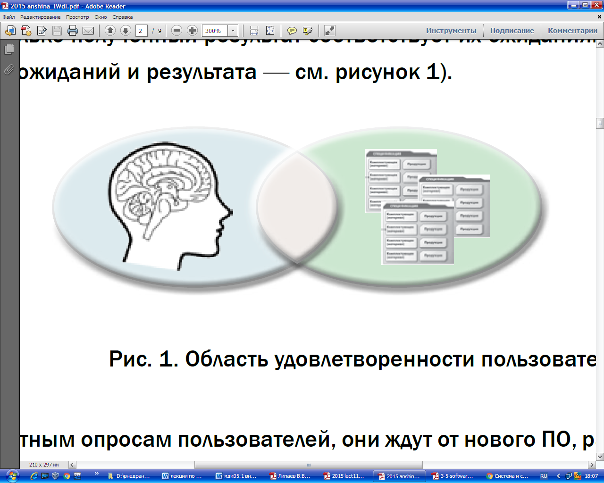
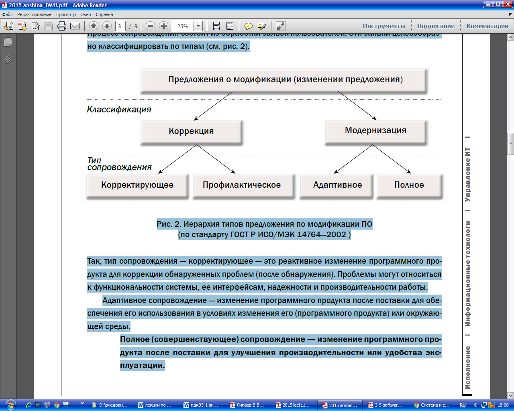
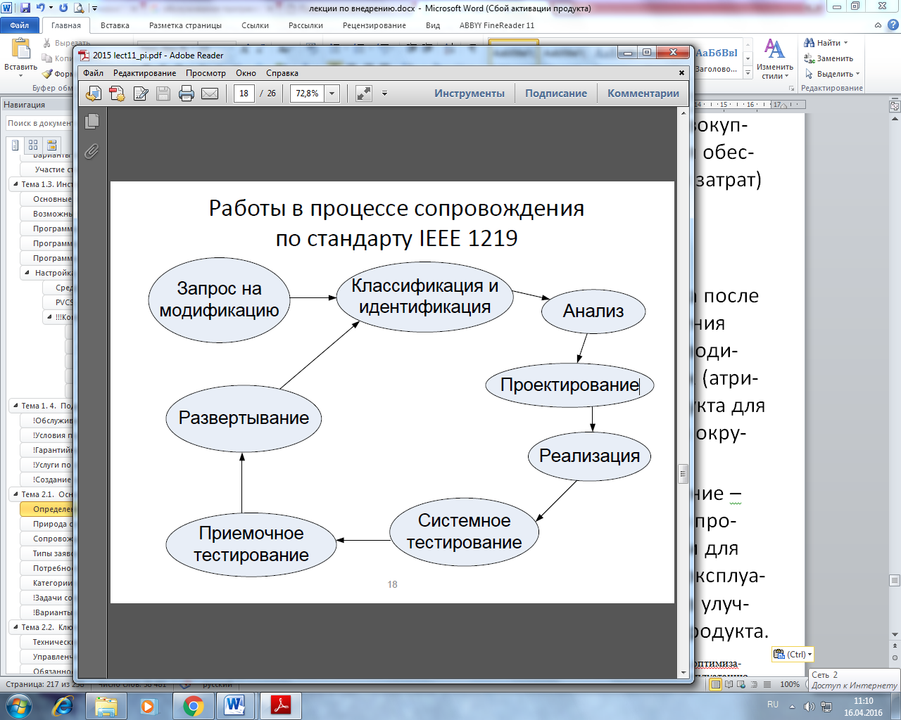

## **Определения и терминология сопровождения  программного обеспечения компьютерных систем.**
гост р исо мэк 14764-2002

http://old.tusur.ru/export/sites/ru.tusur.new/ru/informatization/documents/standards/20090902\_0859.pdf

Согласно ГОСТ 34.601-90 «Государственный стандарт Союза СССР. Информационная технология. Комплекс стандартов на автоматизированные системы. Автоматизированные системы. Стадии создания» (переиздание — июнь 1997 года) стадия создания автоматизированной системы «сопровождение автоматизированной системы» включает два этапа работ: 1) «выполнение работ в соответствии с гарантийными обязательствами», 2)"послегарантийное обслуживание".

**Сопровождение (поддержка) программного обеспечения** — процесс улучшения, оптимизации и устранения дефектов программного обеспечения (ПО) после передачи в эксплуатацию. Сопровождение ПО — это одна из фаз жизненного цикла программного обеспечения, следующая за фазой передачи ПО в эксплуатацию. В ходе сопровождения в программу вносятся изменения, с тем, чтобы исправить обнаруженные в процессе использования дефекты и недоработки, а также для добавления новой функциональности, с целью повысить удобство использования (юзабилити) и применимость ПО.

Сопровождение программного обеспечения стандартизовано, имеются национальные стандарты Российской Федерации, идентичные международным (ISO/IEC 12207:2008 System and software engineering — Software life cycle processes, ГОСТ Р ИСО/МЭК 12207-2010 «Национальный стандарт Российской Федерации. Информационная технология. Системная и программная инженерия. Процессы жизненного цикла программных средств»; ISO/IEC 14764:99 Information tehnology — Software maintenance, ГОСТ Р ИСО/МЭК 14764-2002 «Государственный стандарт Российской Федерации. Информационная технология. Сопровождение программных средств»; IEEE 1219).

**Определение процесса сопровождения**

Стадия сопровождения ИС

•**Software Engineering Body of Knowledge (SWEBOK)** –Свод знаний по программной инженерии

•**SWEBOK:** Сопровождение ПО –вся совокупность деятельности, необходимой для обеспечения эффективной (с точки зрения затрат) поддержки программных систем. 

•**IEEE 1219 (Standard for Software Maintenance):** Сопровождение ПО –модификация программного продукта после передачи в эксплуатацию для устранения сбоев, улучшения показателей производительности и/или других характеристик (атрибутов) продукта, или адаптации продукта для использования в модифицированном окружении. 

•**ГОСТ Р ИСО/МЭК 12207:**Сопровождение –процесс модификации программного продукта в части его кода и документации для решения возникающих проблем при эксплуатации или реализации потребностей в улучшениях тех или иных характеристик продукта. 

Под сопровождением программного обеспечения понимают процесс улучшения, оптимизации и устранения дефектов программного обеспечения (ПО) после передачи в эксплуатацию.

К счастью, этот процесс достаточно хорошо стандартизован, и открывать Америку для того, что-

бы его разработать и внедрить не придется. Упомянем только некоторые основные стандарты:

• ISO/IEC 14764 (2006, русский перевод стандарта 1999 г. — 2002 г.);

• ISO/IEC 12207 (2008, русский перевод стандарта 2010 г.);

• ISO 20000;

• SWEBOK (2004 г.);

• ITIL v3 (2007 г, обновление — 2011 г.);

• COBIT v5 (2012 г.).

Процесс сопровождения является одной из фаз жизненного цикла программного обеспечения,

следующей за передачей ПО в эксплуатацию, и завершается выводом его из эксплуатации

В ходе сопровождения в программу вносятся изменения с тем, чтобы исправить обнаруженные в процессе использования дефекты и недоработки, для добавления новой функциональности, повышения удобства использования (юзабилити) и роста уровня использования ПО. По

стандарту ISO/IEC 12207, этот процесс входит в 5 основных процессов жизненного цикла (ЖЦ)

ПО: приобретение, поставка, разработка, эксплуатация, сопровождение.

В общем случае процесс сопровождения состоит из следующих задач:

1. устранение сбоев;
1. улучшение дизайна;
1. расширение функциональных возможностей;
1. создание интерфейсов взаимодействия с другими (внешними) системами;
1. адаптация (например, портирование) для возможности работы на другой (или обновленной) аппаратной платформе, применение новых системных возможностей, функционирование в среде обновленной телекоммуникационной инфраструктуры и т.п.;
1. миграция унаследованного (legacy) программного обеспечения;
1. вывод программного обеспечения из эксплуатации.

Сопровождение программного обеспечения определяется стандартом IEEE Standard for Software Maintenance (IEEE 1219) как модификация программного продукта после передачи в эксплуатацию для устранения сбоев, улучшения показателей производительности и/или других характеристик

(атрибутов) продукта, или адаптации продукта для использования в модифицированном окружении.

Интересно, что данный стандарт также касается вопросов подготовки к сопровождению до передачи системы в эксплуатацию, однако, структурно это сделано на уровне соответствующего

информационного приложения, включенного в стандарт.

В свою очередь, стандарт жизненного цикла 12207 (IEEE, ISO/IEC, ГОСТ Р ИСО/МЭК) позиционирует сопровождение как один из главных процессов жизненного цикла. Этот стандарт описывает сопровождение как процесс модификации программного продукта в части его кода и документации для решения возникающих проблем <при эксплуатации> или реализации потребностей в улучшениях <тех или иных характеристик продукта>. Задача состоит в модификации продукта при условии сохранения его целостности. Международный стандарт ISO/IEC 14764 (Standard for Software Engineering - Software Maintenance) определяет сопровождение программного обеспечения в тех же терминах, что и стандарт 12207, придавая особое значение работам по подготовке к деятельности по сопровождению до передачи системы в реальную эксплуатацию, например, вопросам планирования регламентов и операций по сопровождению.
##
## **Природа сопровождения программного обеспечения компьютерных систем.** 
Сопровождение поддерживает функционирование программного продукта на протяжении всего операционного жизненного цикла, то есть периода его эксплуатации. В процессе сопровождения

фиксируются и отслеживаются запросы на модификацию (также называемые “запросами на

изменения” – change requests, в частности, в контексте конфигурационного управления),

оценивается влияние предлагаемых изменений, модифицируется код и другие активы (артефакты) продукта, проводится необходимое тестирование и, наконец, выпускается обновленная версия продукта. Кроме того, проводится обучение пользователей и обеспечивается их ежедневная

поддержка при работе с текущей версией продукта. В SWEBOK отмечается, что сопровождение, с точки зрения операций отслеживания и контроля, обладает большим содержанием, чем разработка

(в общем понимании). С точки зрения автора, объем и активность операций по контролю разработки в большой степени зависит от сложившихся практик, внутрикорпоративных регламентов и требований, а также применяемых методологий и концепции управления (в частности – проектного менеджмента). Так или иначе, отслеживание и контроль – ключевые элементы деятельности по сопровождению программного обеспечения (как и других ИТ-активов предприятия).

Стандарт 12207 определяет понятие “maintainer” - в соответствующем ГОСТ он именуется как

“персонал сопровождения”, подразумевая организацию, выполняющая работы по сопровождению.

SWEBOK использует данный термин, также, и в отношении лиц (individuals), проводящих

определенные работы по сопровождению, в отличие, например, от разработчиков, занимающихся реализацией системы в программном коде.

Стандарт жизненного цикла 12207 также идентифицирует основные работы по сопровождению:

реализация процесса <сопровождения>, анализ проблем и модификаций (изменений), реализаций модификаций, обзор (оценка)/принятие <решений> по сопровождению, миграция (с одной версии программного продукта на другую, с одного продукта на другой) и вывод системы из эксплуатации.

Эти работы описываются далее в теме 3.2 “Работы по сопровождению” (Maintenance Activities).

Специалисты по сопровождению (персонал сопровождения) могут получать знания о программном продукте непосредственно от разработчиков. Взаимодействие с разработчиками и раннее привлечение этих специалистов помогает уменьшить усилия, необходимые для адекватного

сопровождения программной системы. По мнению автора, передача знаний персоналу

сопровождения, его обучение, должно начинаться не позднее начала опытной эксплуатации

продукта. В противном случае, усилия на одновременную поддержку прикладной системы и

обучение соответствующих специалистов не только превысит реально допустимые нормы загрузки персонала (как группы или службы сопровождения и техподдержки, так и разработчиков системы), но снизит эффективность поддержки пользователей на критически важном этапе первоначального использования новой системы. По опыту автора и результатам обсуждения этого вопроса с сотрудниками внутрикорпоративных ИТ-департаментов, обычно, в зависимости от сложности системы, пик нагрузки на службу сопровождения приходится в течении первых 2 - 6 недель, с момента передачи системы в реальную эксплуатацию, тем более, при отказе от использования старой системы или ее предыдущей версии. SWEBOK отмечает, что, в некоторых случаях, инженеры (создававшие систему) не могут быть привлечены к обучению и поддержке персонала сопровождения. Особенно часто это касается тиражируемых или “коробочных” систем. Это создает дополнительные трудности для специалистов, обеспечивающих сопровождение. В то же время, инженеры, занимающиеся технической поддержкой (несколько боле узкий круг в команде сопровождения, включающей менеджеров, администраторов и других специалистов), должны (в зависимости от типа продукта) иметь доступ к активам проекта (например, описанию его внутренней архитектуры), включая код, документацию и т.п. Именно таким образом начинает формироваться информационная инфраструктура службы технической поддержки и сопровождения у производителей программных продуктов.

Практика показывает, что инженеры по технической поддержке производителя программного

обеспечения (не только “коробочного”, но и создаваемого и настраиваемого интеграторами,

обладающими собственными программными решениями) должны не просто иметь доступ ко всем ключевым активам проекта (код, документация, спецификации требований, внутренние модели и т.п.), но в их обязанности входит создание “патчей” (patch – “заплата”), исправлений ошибок и, в особых случаях, такие изменения, до выпуска новой версии продукта, создаются с привлечением непосредственно разработчиков продукта(групп и подразделений R&D – Research and Development).

При этом, разработчики продукта информируются о найденных ошибках и, в случае нахождения

соответствующих решений специалистами технической поддержки, такие решения передаются

разработчикам с тем, чтобы те либо включили такие изменения в новую версию программного

продукта (безусловно, в случае успешного прохождения всех необходимых тестов), либо нашли

более адекватное решение в контексте новой функциональности либо тех изменений, которые

включены в новую версию продукта. 

**В обязанности инженеров службы сопровождения, в общем случае, входит:** 

1. проверка пользовательского сценария, приводящего к сбою; 
1. идентификация причин сбоя, т.е локализация ошибки/причин ее появления; 
1. предоставление соответствующих исправлений или, при невозможности создания таковых на данном этапе либо в заданные сроки –предоставление обходного пути решения проблемы для достижения требуемых бизнес-задач (такие обходные пути, обычно, называют “workaround”); 
1. журналирование всех работ и операций;
1. помещение описания проблемы и ее решения в базу знаний службы сопровождения; 
1. передача всейинформации разработчикам; 
1. своевременное информирование пользователя о статусе запроса и некоторые другие работы, содержание которых может варьироваться, в зависимости от регламентови корпоративных стандартов в конкретной организации, либо параметров контракта на сопровождение и техническую поддержку, если таковой есть.
## **Сопровождение и удовлетворенность пользователей.** 
`	`Именно процесс сопровождения позволяет улучшить удовлетворенность пользователей внедренным ПО. Действительно, общеизвестно, что удовлетворенность пользователей зависит

от того, насколько полученный результат соответствует их ожиданиям (т.е. от площади области

пересечения ожиданий и результата — см. рисунок 1).

Рис. 1. Область удовлетворенности пользователей

По неоднократным опросам пользователей, они ждут от нового ПО, разработанного и внедренного, в частности, на платформе «1С:Предприятие» следующего:

• эффективного решения стоящих перед ними задач;

• удобного и интуитивно понятного интерфейса;

• помощи по всем возникающим вопросам использования ПО;

• выполнения их заявок в требуемые сроки.

Все эти задачи можно и нужно выполнять на этапе сопровождения. Кроме того, присущий

человечеству консерватизм определяет негативное отношение большинства пользователей к

новому ПО. Именно и только стадия сопровождения позволяет примирить с ним пользователей

и приучить их с удовольствием и с пользой применять его в своей деятельности. По статистике,

удовлетворенность пользователей через год использования ПО в несколько раз выше, чем

сразу после внедрения.

Но, чтобы достичь таких результатов, сопровождение должно осуществляться на должном

уровне. Ведь в противном случае эту удовлетворенность можно даже уменьшить.
## **Типы заявок предложений о модификации**
Процесс сопровождения состоит из обработки заявок пользователей. Эти заявки целесообраз-

но классифицировать по типам (см. рис. 2).

Рис. 2. Иерархия типов предложения по модификации ПО

(по стандарту ГОСТ Р ИСО/МЭК 14764—2002 )

**Так, тип сопровождения — корректирующее** — это реактивное изменение программного продукта для коррекции обнаруженных проблем (после обнаружения). Проблемы могут относиться

к функциональности системы, ее интерфейсам, надежности и производительности работы.

**Адаптивное сопровождение** — изменение программного продукта после поставки для обеспечения его использования в условиях изменения его (программного продукта) или окружающей среды.

**Полное (совершенствующее) сопровождение** — изменение программного продукта после поставки для улучшения производительности или удобства эксплуатации.

**Профилактическое сопровождение** — это изменение программного продукта после поставки для выявления и исправления скрытых дефектов в ПО до того, как они станут явными ошибками.

Следует также отметить, что профилактическое и полное (совершенствующее) сопровождение

относятся к проактивному подходу к сопровождению, при котором инициатива исходит от обслуживающего персонала, а корректирующее и адаптивное — к реактивному подходу, инициатива которого находится у пользователей. Проактивному сопровождению необходимо уделять достаточно внимания, поскольку именно оно в наибольшей степени способствует повышению удовлетворенности пользователей и эффективному развитию программной системы.
## **Потребность в сопровождении   программного обеспечения компьютерных систем**

Сопровождение необходимо для обеспечения того, чтобы программный продукт на протяжении всего периода эксплуатации удовлетворяет требованиям пользователей. Деятельность по сопровождению применима для программного обеспечения, созданного с использованием любой модели жизненного цикла и методологии разработки. На первый взгляд, это утверждение SWEBOK может показаться тривиальным. Однако, обратитесь к своему опыту разработки и использования различного программного обеспечения. Наверняка, Вы найдете случаи из собственной практики или практики коллег, когда столь очевидное утверждение хорошо бы донести до разработчика того или иного программного продукта. Изменения программной системы могут быть обусловлены как действиями по корректировке ее поведения или несвязанные с необходимостью корректировки (подразумевая уже не исправление ошибок, а, например, повышение производительности или расширение функциональности).

**В общем случае, работы по сопровождению должны проводиться для решения следующих задач:**

• устранение сбоев

• улучшение дизайна

• реализация расширений <функциональных возможностей>

• создание интерфейсов взаимодействия с другими (внешними) системами

• адаптация (например, портирование) для возможности работы на другой аппаратной

платформе (или обновленной платформе), применения новых системных возможностей,

функционирования в среде обновленной телекоммуникационной инфраструктуры и т.п.

• миграции унаследованного (legacy) программного обеспечения

• вывода программного обеспечения из эксплуатации

**Деятельность персонала сопровождения включает четыре ключевых аспекта:**

• поддержка контроля (управляемости) программного обеспечения в течение всего цикла

эксплуатации:

• поддержка модификаций программных систем

• совершенствование существующих функций\*

• предотвращение падения производительности программной системы до неприемлемого уровня

Автор убежден, что говоря о предотвращении деградации производительности, мы должны понимать, что это, при всем желании совершенствования системы, может делаться и за счет обновления мощности аппаратной части и/или соответствующей телекоммуникационной инфраструктуры, если это более обосновано, чем модификация самой программной системы. На самом деле это вопрос того, что окажется дешевле (и менее рискованно), т.е. связано с затратами/ стоимостью соответствующих работ, оборудования и поддержки обновленного системного окружения (что, к сожалению, часто также не учитывается даже при более-менее сложившейся практике сопровождения).
## Категории сопровождения программного обеспечения компьютерных систем: корректирующее сопровождение; профилактическое сопровождение; адаптирующее сопровождение; совершенствующее сопровождение**.**
Многие источники, в частности, стандарт IEEE 1216, определяют три категории работ по сопровождению: корректировка, адаптация и совершенствование. Такая классификация была обновлена в стандарте ISO/IEC 14764 Standard for Software Engineering - Software Maintenance введением четвертой составляющей. **Таким образом, сегодня говорят о четырех категориях сопровождения:**

• Корректирующее сопровождение (corrective maintenance): “реактивная” модификация

программного продукта, выполняемая уже после передачи в эксплуатацию для устранения сбоев;

• Адаптирующее сопровождение (adaptive maintenance): модификация программного продукта на этапе эксплуатации для обеспечения продолжения его использования с заданной эффективностью (с точки зрения удовлетворения потребностей пользователей) в

изменившемся или находящемся в процессе изменения окружении; в первую очередь,

подразумевается изменение бизнес-окружения, порождающее новые требования к системе;

• Совершенствующее сопровождение (perfective maintenance): модификация программного продукта на этапе эксплуатации для повышения характеристик производительности и удобства сопровождения;

• Профилактическое сопровождение (preventive maintenance): модификация программного продукта на этапе эксплуатации для идентификации и предотвращения скрытых дефектов до того, когда они приведут к реальным сбоям.

ISO/IEC 14764 (StandardforSoftwareEngineering - SoftwareMaintenance) классифицирует адаптивное и совершенствующее сопровождение как работы по расширению <функциональности> продукта. Этот стандарт также объединяет корректирующую и профилактическую деятельность в общую категорию работ по корректировке системы. Профилактическое сопровождение (новейшая категория работ по сопровождению) наиболее часто проводится для программных систем, связанных с вопросами безопасности <людей>.

||Корректирующие работы|Работы по расширение|
| - | - | - |
|“ Проактивный” подход|Профилактическое сопровождение|Совершенствующее сопровождение|
|“Реактивный” подход|Корректирующее сопровождение|Адаптирующее сопровождение|
Таблица 1. Категории сопровождения программного обеспечения.

