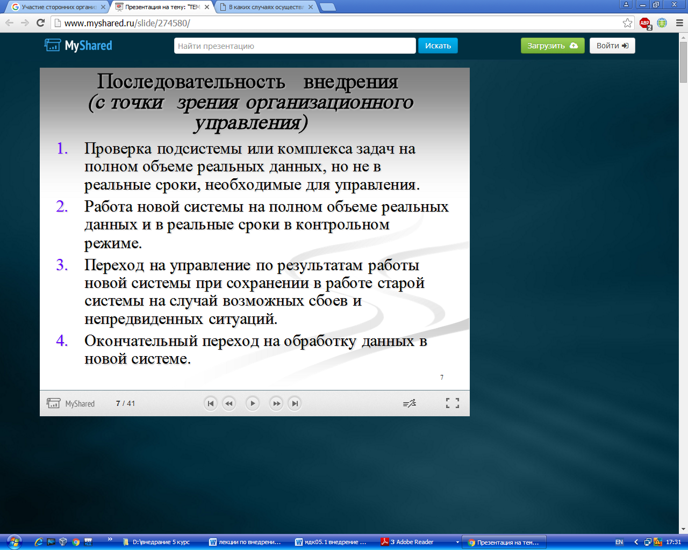
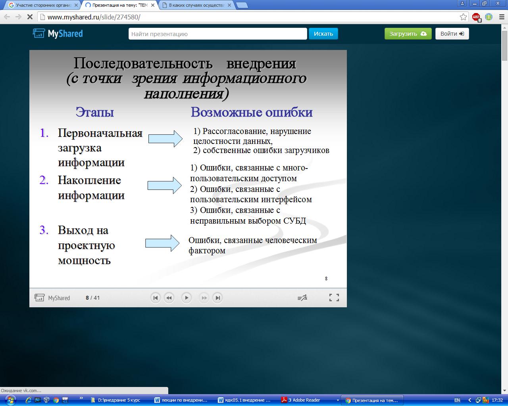
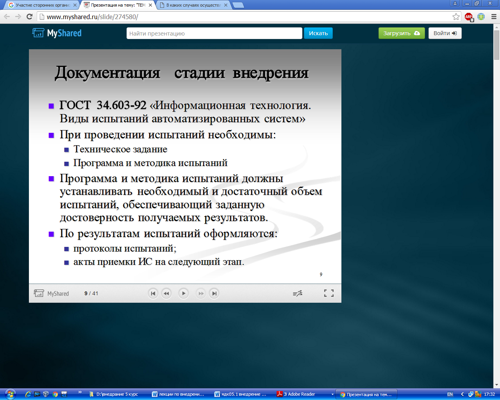
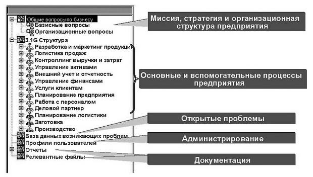
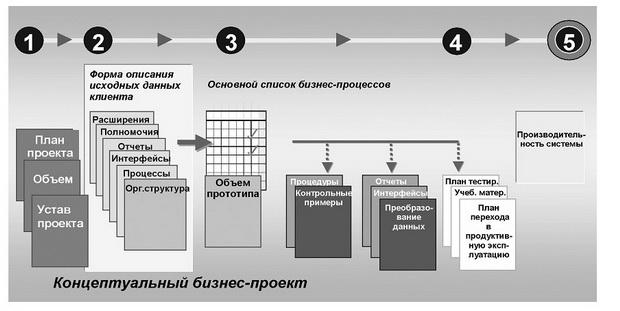
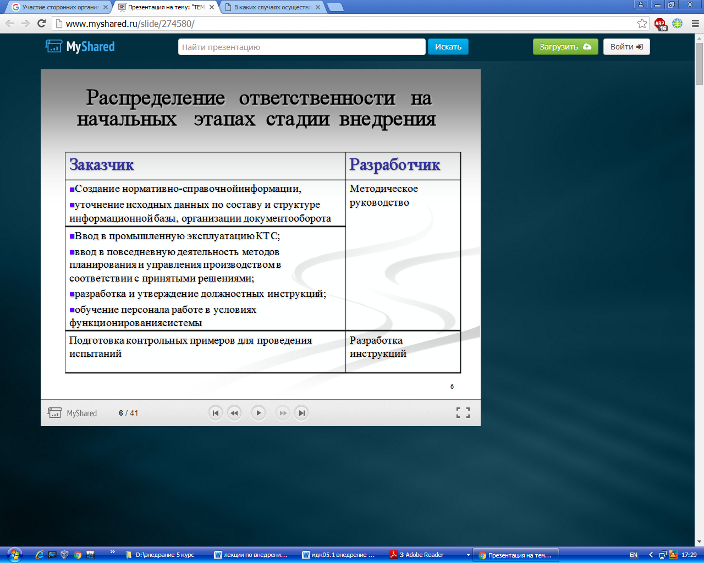
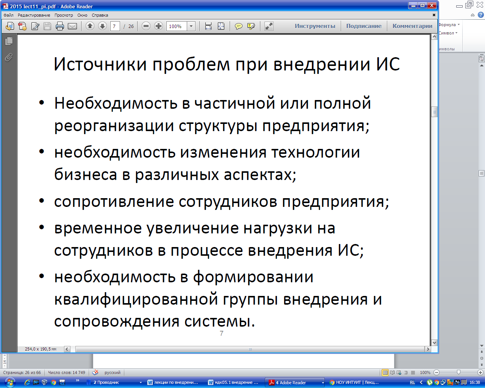
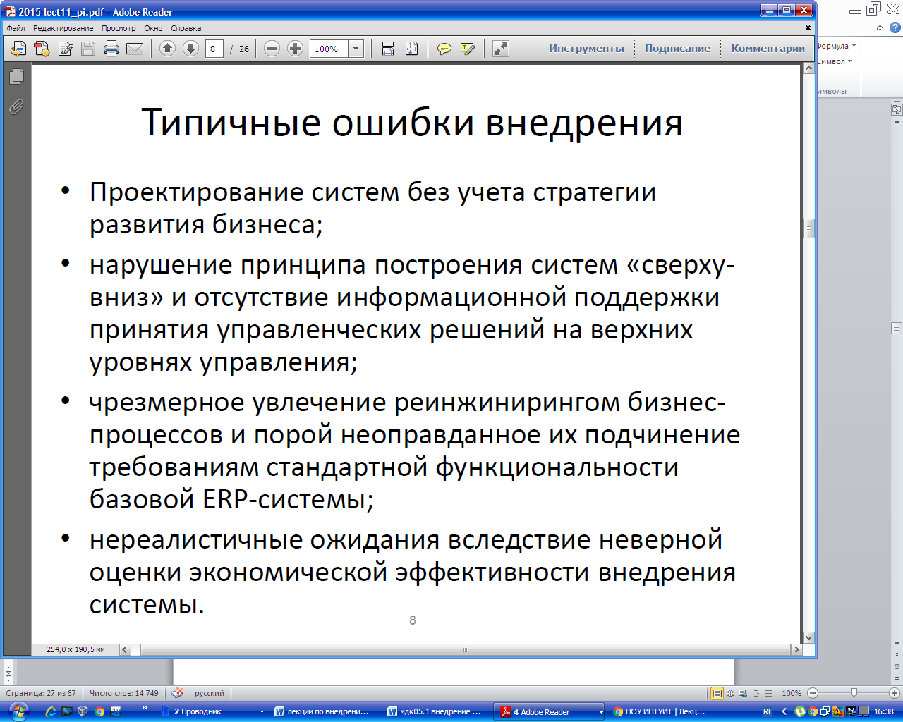

## **Этапы внедрения:  обследование, разработка технического задания, настройка системы (программного продукта), тестирование системы, опытная эксплуатация, промышленная эксплуатация.**

**Основные этапы внедрения программных продуктов**

`     `В данном разделе мы обозначим ключевые моменты проекта по внедрению программного продукта на предприятии. Это информация позволит Вам оценить реальные объемы работ, необходимое количество специалистов для реализации данного проекта и его продолжительность. На основании полученных данных можно объективно оценить ориентировочную стоимость проекта внедрения программного продукта. Затраты человеческих ресурсов (кол-во специалистов и времени внедрения) обычно прямо пропорционально стоимости программного продукта, поэтому зная стоимость определенного софта и стоимость его внедрения, Вы сможете самостоятельно рассчитать ориентировочную стоимость внедрения альтернативного программного продукта.
`     `Стоимость внедрения складывается исходя из количества привлекаемых специалистов их ставки и времени работы. Объемы работ удобней определять поэтапно, чтобы можно было эффективно управлять стоимостью проекта. 

**Основные этапы внедрения программного продукта:**

`     `1. Обследование

`     `2. Разработка технического задания

`     `3. Настройка системы (программного продукта)

`     `4. Тестирование системы

`     `5. Опытная эксплуатация

`     `6. Промышленная эксплуатация

`     `**Первый этап проекта** – диагностика предприятия или его обследование. Под обследованием подразумевается диагностика на предприятии всех бизнес-процессов, которые будет охватывать будущая система. Количество дней для обследования может быть разным в зависимости от масштаба и функциональности создаваемой системы на основе выбранного программного продукта. Если автоматизируются большое количество филиалов и программный продукт охватывает большое количество пользователей или большое количество бизнес-процессов, то время, отведенное на обследование, будет существенно увеличено. Обычно на обследование отводится от 1 недели до 1 месяца ( средняя продолжительность этапа «обследование» – 2 недели).

`     `**Второй этап проекта** внедрения программного продукта – разработка технического задания. Техническое задание (ТЗ) включает в себя описание всех справочников системы, всех алгоритмов расчета, отчетных форм, АРМ (Автоматизированных рабочих мест) пользователей и описание разграничения прав доступа пользователей.
Разработка технического задания занимает от 1 до 3 месяцев (средняя продолжительность этапа «разработка технического задания» - 1,5-2 месяца).

**Работы при разработке технического задания на внедрение программного продукта**

Ключевым документом, определяющим взаимодействие сторон при внедрении программных решений является техническое задание, в котором содержится совокупность требований к функциональности программного решения и критериев проверки и приемки. Основной вопрос, на который должно отвечать техническое задание: что должна делать будущая система? Процесс подготовки технического задания состоит из разработки, оформления, согласования и утверждения документа. Как правило, он представляет собой совместную работу специалистов организации-заказчика и организации-исполнителя. В этих работах принимают участие продуктовые ИТ- консультанты.

Техническое задание выдается организацией-заказчиком организации-исполнителю (системному *интегратору*) работ по внедрению программных решений, в его содержательную часть включаются разработанные ранее требования к ИС.

Методической поддержкой для подготовки технического задания является ГОСТ 34.602-89 "Информационная технология. Комплекс стандартов на автоматизированные системы. Автоматизированные системы. Техническое задание на создание автоматизированной системы", в котором определен перечень требований к содержанию документа и проведению испытаний.

В соответствии с указанным стандартом техническое задание включает следующие разделы, которые могут быть разделены на подразделы:

1. общие сведения;
1. назначение и цели создания (развития) системы;
1. характеристика объектов автоматизации;
1. требования к системе;
1. состав и содержание работ по созданию системы;
1. порядок контроля и приемки системы;
1. требования к составу и содержанию работ по подготовке объекта автоматизации к вводу системы в действие;
1. требования к документированию;
1. источники разработки.

Содержание перечисленных разделов подробно рассмотрено ранее.

`     `**Третий этап проекта** – настройка системы (автоматизация). Настройка системы включает в себя формирование в программе всех справочников системы, настройка всех алгоритмов расчета, форм ввода и отчетных форм, ввод пользователей системы и настройка прав доступа. Продолжительность данного этапа напрямую зависит от квалификации специалистов и от уровня сложности поставленной задачи. Среднее время, отводимое на настойку системы, составляет 1 -1,5 месяца.

`     `**Четвертый этап проекта** – тестирование программного продукта (системы). Тестирование системы включает в себя подготовку демонстрационного примера, внесение тестовых данных, проверку алгоритмов расчета и исправление обнаруженных ошибок. В среднем на этап тестирование отводится 2 недели.

`     `**Пятый этап проекта** – опытная эксплуатация системы. Опытная эксплуатация системы включает в себя работу с реальными данными, но при этом параллельно используется прежняя старая система либо те электронные таблицы, в которых предприятия до настоящего момента осуществляла свою работу. Этот этап необходим для того, чтобы можно было сопоставить результаты работы в новой системе с результатами, которые получены были прежним способом (вручную или с применением старых программных продуктов или электронных таблиц). В среднем на этап опытной эксплуатации занимает отчетный период равный 1-му месяцу.

`     `После окончания вышеописанных этапов работ, мы можем говорить о том, что внедрение программного продукта завершено и идет его эксплуатация. Однако часто, на этапе промышленной эксплуатации, когда пользователь работает с реальными данными и в «боевом» режиме, все же приходится производить работы по доработке системы и исправлению найденных ошибок.

`     `**Шестой этап проекта** – промышленная эксплуатация системы. Промышленная эксплуатация системы подразумевает переход предприятия на новый программный продукт и отказ от всех альтернативных способов работы за рамками данной системы. Этап промышленной эксплуатации системы подразумевает организацию службы технической поддержки системы либо получение данных услуг от сторонних организаций. В рамках проекта этап промышленной эксплуатации системы обычно занимает около 1 месяца. 

\* Все указанные сроки распространяются на программные продукты имеющие четко-выраженную направленность (например, учетные системы) либо могут также быть приравнены к внедрению одного модуля ERP-системы (например, логистика, производственный учет, бюджетирование и т.д.). 

##### **Основные фазы внедрения информационной системы**
Фаза "Предварительные работы по подготовке проекта внедрения ИС". В ходе предпроектного обследования предприятия (рис. 4.1.4) собирается подробная информация о структурном построении организации, функциональных связях, системе управления, об основных бизнес-процессах, о потоках внутри предприятия (Control Flow, Doc Flow, Data Flow, Work Flow, Cash Flow), необходимая для построения соответствующих моделей и выбора объектов для автоматизации. Оцениваются сроки, ресурсы, виды и объемы работ, номенклатура и стоимость программно-аппаратных и телекоммуникационных средств, стоимость обучения персонала и т. д.

Фаза "Подготовка проекта". После завершения первой фазы осуществляется предварительное планирование и формирование процедур запуска проекта:

- формирование проектной и экспертной групп;
- распределение полномочий и ответственности;
- определение организационно-технических требований к процессу внедрения;
- уточнение спецификаций и ожиданий заказчика;
- обучение группы внедрения, состоящей из специалистов предприятия-заказчика.

Последний очень важный момент почему-то часто пропускается при составлении плана внедрения. А ведь от него в огромной степени зависит успех всего проекта! После начала финансирования проект считается запущенным к исполнению.

Фаза "Концептуальная проработка проекта". В течение этой фазы:

- формируется и утверждается концептуальный проект;
- достигается обязательное однозначное понимание намерений всех участников проекта относительно внедряемой ИС;
- уточняются и конкретизируются цели и задачи проекта;
- определяются размеры прототипа системы;
- согласуются укрупненный план работы, последовательность этапов и условия опытной эксплуатации, планово-финансовые и отчетные показатели.

При этом все указанные действия в обязательном порядке документируются, согласуются и утверждаются всеми заинтересованными и ответственными сторонами.

Фаза "Реализация проекта". Во время проведения основных работ по внедрению создается, устанавливается и конфигурируется системная среда, определяются процедуры системного администрирования, устанавливаются основные программно-аппаратные комплексы и приложения. В системе настраиваются организационно-штатные и организационно-функциональные структуры предприятия с использованием таких организационных единиц, как филиал, департамент, отдел, рабочая группа и т. д.

Осуществляется установка, конфигурирование и настройка сетевых и телекоммуникационных средств, производится перенос данных из прежних локальных систем и формирование интерфейсов с унаследованными и внешними системами. При этом все создаваемые модели, планы, рабочие программные продукты, документация помещаются в сквозной репозиторий проекта внедрения ([рис. 4.17](http://www.intuit.ru/studies/courses/13862/1259/lecture/24014?page=1#image.4.17)). Важной частью этого репозитория является система документации, формируемая в рамках проекта ([рис. 4.18](http://www.intuit.ru/studies/courses/13862/1259/lecture/24014?page=1#image.4.18)).

**Рис. 4.17.** Примерное содержание репозитория проекта внедрения

**Рис. 4.18.** Примерный состав документации по процессу внедрения ИС

Отрабатываются системные вопросы безопасности работы системы в многопользовательском режиме. Создаются приложения, шаблоны, отчеты, клиентские формы доступа, распределятся полномочия пользователей. Проводится "прогонка" всех систем в "боевом режиме" с участием всех заинтересованных сторон. После окончания фазы реализации проект внедрения считается законченным. Информационная система передается в эксплуатацию.

**Примеры проектных документов  [**http://www.intuit.ru/studies/professional_retraining/963/courses/502/lecture/24690](http://www.intuit.ru/studies/professional_retraining/963/courses/502/lecture/24690)**

## **Распределение ответственности на этапах внедрения.** 

Следует чётко разделять ответственность за исполнительные и контрольные функции. Исполнительные функции, как правило, выполняет производственный персонал, контрольные функции обычно принято поручать руководящей должности, которая зачастую ответственна и за весь выполняемый бизнес-процесс в целом. Не следует одному и тому же исполнителю назначать множество контролирующих, ведь это может привести к конфликту: «Вася мне сказал делать так, а Петя пришёл и сказал всё переделывать».

При распределении ролей и ответственности, необходимых для выполнения проекта, следует учитывать следующие моменты.

Роль в проекте ( *проектная роль* ) - определенный набор функций и *полномочий* в проекте, созданный с целью *распределения обязанностей* между членами команды проекта. *Проектную роль*можно рассматривать как временную должность в организации (компании).

*Полномочия* - право задействовать ресурсы проекта, принимать решения и утверждать одобрение действий или результатов. Примеры *полномочий*: выбор способа завершения *операции*, приемка качества и порядок реагирования на отклонения в проекте.

Ответственность - работа, которую член команды проекта должен выполнить для завершения операций проекта.

*Квалификация* - навыки и способности, необходимые для выполнения операций проекта. Отсутствие нужной *квалификации* у членов команды влияет на *расписание проекта*, качество выполнения*работ*, ставит под угрозу *цели проекта*. Для повышения *квалификации* планируют проведение обучения членов команды.

Формируя команду управления проектом, необходимо определить ключевых лиц проекта, принимающих решения.

Со стороны заказчика ключевые роли играют *спонсор проекта* и *менеджер* проекта со стороны заказчика. *Спонсор проекта* обеспечивает организационную сторону проекта и подтверждает правильность целей проекта. В его ведении находится *бюджет проекта*. Спонсором проекта может быть отдельный человек или *целый* комитет, в зависимости от масштабов и сложности проекта.*Менеджер* проекта со стороны заказчика назначается и в том случае, если осуществление проекта организацией заказчика требует ежедневного управления. В его обязанности входит предоставление ресурсов заказчиков, разрешение проблем и отслеживание состояния проекта.

Ключевые роли со стороны исполнителя - *руководитель проекта* (*менеджер* проекта) со стороны исполнителя и бизнес-*менеджер*.

Бизнес-*менеджер* отвечает за успешное выполнение проекта и представляет исполнителя в его договорных отношениях с заказчиком. *Менеджер* проекта (*руководитель проекта*) отвечает как за успехи, так и за неудачи проекта. В его задачи входит управление сроками, стоимостью, качеством *работ* с целью удовлетворения ожиданий заказчика и достижения бизнес-целей исполнителя.

*Команда* управления проектом включает координатора проекта, администратора проекта, менеджера по конфигурации. Для крупных проектов к выполнению каждой из этих ролей могут быть привлечено нескольких человек. На небольших проектах *менеджер* проекта может совмещать несколько ролей. Масштабные проекты предполагают наличие менеджера по качеству, который ответственен перед бизнес-менеджером исполнителя.

В крупных проектах могут быть организованы комитет по управлению, комитет по контролю за изменениями, комитет по анализу спорных вопросов [[8](http://www.intuit.ru/studies/professional_retraining/963/courses/502/literature#literature.8)].

Приведенный *список* ключевых ролей команды управления проектом является необходимым для управления работами при внедрении информационной системы. Возможны некоторые модификации состава команды в зависимости от сложности и масштабности проекта, например, при необходимости можно включать в нее заместителя руководителя проекта, руководителей функциональных направлений (финансы, логистика, персонал и т. д.).

Состав команды управления должен быть достаточным, чтобы осуществлять [[11](http://www.intuit.ru/studies/professional_retraining/963/courses/502/literature#literature.11)]:

- управление ресурсами проекта, в том числе:
  - определение требуемых для достижения целей проекта ресурсов;
  - подготовка предложений по изменению состава группы управления проектом;
  - утверждение персональных изменений в составе рабочих групп проекта;
  - оценка стоимости проекта, подготовка бюджетов проекта и отчетов об исполнении бюджетов;
- управление сроками выполнения проекта, в том числе:
  - подготовка плана работ проекта;
  - контроль над выполнением проекта;
  - подготовка отчетов о ходе работ проекта;
- управление качеством проекта, в том числе:
  - контроль соответствия разрабатываемых проектных решений техническому заданию;
  - организация экспертизы проектных решений;
- управление рисками проекта, в том числе:
  - анализ рисков проекта;
  - разработка планов мероприятий по снижению рисков;
  - реализация мероприятий по снижению рисков;
- управление проблемами проекта, в том числе:
  - анализ проблем проекта;
  - разработка мероприятий по разрешению проблем проекта;
  - реализация мероприятий по разрешению проблем проекта;
- контроль над организацией работ в проектных группах, в том числе:
  - согласование отчетов о ходе работ;
  - контроль над функционированием системы сбора и распределения информации;
  - контроль документирования проектных результатов.

В состав команды проекта входят не только *команда* управления проектом, но и исполнители проекта. Примеры *проектных ролей* исполнителей, характерных для IT-проектов: функциональный*архитектор*, функциональный консультант, разработчик, *администратор* ИС, *тестировщик*, *менеджер* по качеству, системный *аналитик*. В проекте один член команды может выступать одновременно в нескольких ролях. *Совмещение ролей* часто встречается в небольших проектах, что позволяет снизить накладные *расходы* проекта. Но не все роли можно совмещать, поскольку подобное совмещение может затруднить *контроль* и оценку результатов проекта. Допускается совмещение таких *проектных ролей*, как *руководитель проекта* и *администратор* проекта, функциональный*архитектор* и функциональный консультант, функциональный консультант и *аналитик*, *менеджер* разработки и разработчик, *менеджер* по качеству и *тестировщик*. Но не следует совмещать роли менеджера по качеству и разработчика, руководителя проекта и разработчика, тестировщика и разработчика.

На стадии планирования в рамках процесса управления человеческими ресурсами не предусматривается долгосрочное планирование, а составляется план для реализации первого этапа проекта. Основными задачами являются разработка организационной структуры проекта и подбор персонала.

Работа по планированию организационной структуры проводится менеджером проекта со стороны исполнителя совместно с менеджером со стороны заказчика. Путем переговоров достигается соглашение об уровне, на котором должно производиться утверждение выделяемых ресурсов заказчика и обсуждение требований к членам команды исполнителя. *Администратор* проекта фиксирует результаты переговоров.

Иерархические организационные диаграммы являются простым и наглядным инструментом для определения иерархии подотчетности, начиная с нижнего уровня организации до руководителя проекта.

[увеличить изображение](http://www.intuit.ru/EDI/29_06_15_4/1435529976-29105/tutorial/907/objects/6/files/06_01.gif)
**Рис. 6.1.** Пример организационной структуры проекта

Существуют различные форматы документирования распределения ролей и ответственности членов команды проекта, например, иерархический, матричный или текстовый. Независимо от формата документирования организационные диаграммы позволяют для каждого пакета *работ* назначить ответственного за его *исполнение*, а также обеспечивают понимание своей роли и ответственности каждым членом команды.

На [рис. 6.1](http://www.intuit.ru/studies/professional_retraining/963/courses/502/lecture/11398?page=1#image.6.1) представлен пример организационной структуры проекта, документирования распределения ролей и ответственности членов команды проекта, выполненного в виде организационной структуры. Организационная структура является иерархической организационной схемой существующих подразделений организации (отделов, групп или команд). Под каждым отделом указывается*список операций* проекта или пакета *работ*. Таким образом можно увидеть закрепление ответственности в проекте для данного функционального отдела (например, отдела информационных технологий или отдела закупок) в одном месте рядом с названием отдела.
### **Матрица ответственности проекта**
Для отражения иерархии подотчетности на проекте и указания обязанностей каждой из групп, входящих в проектную команду, в документ описания содержания проекта рекомендуется включить*матрицу ответственности*, наиболее распространенный вариант которой известен как RACI-матрица. Использование данного инструмента особенно актуально в ситуации, когда проектная *команда*состоит из представителей различных юридических лиц (например, типичная *команда* на проекте внедрения КИС включает в себя сотрудников заказчика, генерального подрядчика и субподрядчиков). *Матрица ответственности* решает задачу демонстрации межорганизационного или *межгруппового взаимодействия* и, как следствие, позволяет избежать недоразумений, которые время от времени возникают в проектах между подразделениями и организациями из-за неясности, к кому следует обращаться по тем или иным вопросам и кто должен принимать по ним решение, а кто - непосредственно реализовать принятую резолюцию.

Важно как можно раньше произвести размежевание всех формальных *полномочий*, прав и обязанностей, пока *команда* проекта еще не приступила к активной работе. В противном случае, когда у сотрудников сложится собственное *представление* о своем месте в проекте, расхождения во мнениях по этим вопросам могут перерасти в затяжные конфликты и оказать значительное негативное влияние на *график* выполнения проекта.
#### **Построение матрицы ответственности**
1. Перечислить основные работы проекта.

По вертикали в матрице отражаются только основные работы проекта (не ниже уровня 2-3 *ИСР*), но с достаточной степенью детализации для обеспечения возможности указывать разные роли, необходимые для выполнения этих работ. Когда речь идет о крупных проектах и программах, может возникнуть необходимость разработать несколько *матриц ответственности* с различной степенью детализации.

1. Перечислить группы/роли внутри проектной команды.

По горизонтали в матрице перечисляются группы/ роли внутри проектной команды. Обратите внимание на то, что в *матрице ответственности* группы/роли, а не имена и фамилии отдельных членов коллектива. Персональное закрепление проектных работ производится позднее, на этапе разработки *расписания проекта*.

1. Закодировать *матрицу ответственности*.

С помощью кодов в ячейках на пересечении соответствующих столбцов с ролями и строк с работами проекта указать степень участия, формальные *полномочия* и распределение ответственности за выполнение каждой операции. Четкое указание разных уровней формальных *полномочий* бывает особенно полезно в ситуации, когда множество членов проектной команды желает предъявить особые требования к проекту.

|Таблица 6.1. Условные обозначения *матрицы ответственности* (RACI)|
| :- |
|**Обозначение**|**Расшифровка**|**Описание**|
|Исп. (R)|Исполнитель (Responsible)|Несет ответственность за непосредственное исполнение задачи. К каждой задаче должно быть приписано не менее одного исполнителя|
|Утв. (A)|Утверждающий (Accountable)|Отвечает за конечный результат перед вышестоящим руководством. На каждую работу должен быть назначен строго один подотчетный|
|Cогл. (C)|Согласующий (Consulted)|Согласует принимаемые решения, взаимодействие с ним носит двусторонний характер|
|Н. (I)|Наблюдатель (Informed)|Его информируют об уже принятом решении, взаимодействие с ним носит односторонний характер|
|Таблица 6.2. Распределение функциональных обязанностей команды управления проектом|
|**Функциональные обязанности**|**Куратор проекта (Спонсор)**|**Руководитель проекта**|**Архитектор системы**|**Администратор проекта**|
|**Планирование**|||||
|Разработка и периодическая актуализация плана||+|+||
|Утверждение плана|+||||
|**Управление командой проекта**|||||
|Назначение сотрудника на роль Руководителя проекта|+||||
|Формирование команды проекта||+|||
|Определение квалификационных требова ний и состава рабочих групп специалистов по функциональности ИС|||+||
|Обеспечение выделения необходимых ресурсов для выполнения проекта|+||||
|Непосредственное руководство Командой проекта||+|||
|Формирование предложений по стимулированию Команды проекта|+||||
|Обеспечение стимулирования Команды проекта|+||||
|**Организация выполнения работ**|||||
|Организация взаимодействия с Заказчиком и обеспечение всех необходимых коммуникационных связей с другими участниками проекта||+|||
|Организация подготовки, согласования и утверждения всей технической документации, необходимой для создания ИС в рамках проекта|||+||
|Организация, проведение и документирование процедур передачи Заказчику разработанной ИС||+|+||
|Рассмотрение и утверждение регламентирующих документов, необходимых для организации и выполнения проекта|+||||
|Ведение организационно-распорядительной и отчетной документации. Поддержание в актуальном состоянии списка команды проекта||||+|
|Обеспечение команды проекта необходимыми информационными материалами||||+|
|Материально-техническое и хозяйственное обеспечение команды проекта||||+|
|**Контроль хода выполнения проекта**|||||
|Организация и проведение совещаний по обсуждению хода работ проекта||+|||
|Подготовка и предоставление Куратору отчетов о ходе работ проекта||+|||
|Получение и анализ сводной отчетности о ходе реализации проекта|+||||
|Контроль соответствия результатов проекта Техническому заданию на разработку ИС|||+||
|Согласование фактических трудозатрат специалистов при исполнении проекта||+|+||
На коды, используемые в *матрице ответственности*, каких-либо ограничений не существует, но наибольшее распространение получил метод RACI (Responsible (R), Accountable (A), Consulted (C), Informed(I)), в котором приведено описание соответствующих кодов.

1. Инициировать использование матрицы и включить процедуру использования *матрицы ответственности* в документ "*План управления проектом*".

После утверждения *матрицы ответственности* все дальнейшие изменения в ней должны проходить через процедуру интегрированного управления изменениями при участии авторов первоначальной версии.

Преимущество использования структурированного подхода к изменению *матрицы ответственности* состоит в том, что руководитель проекта получает актуальный документ, на который он может ссылаться при возникновении тех или иных спорных ситуаций, касающихся распределения *полномочий* в проекте.

В частности, *матрица ответственности* может быть использована для распределения основных функциональных обязанностей. Так, в [табл. 6.2](http://www.intuit.ru/studies/professional_retraining/963/courses/502/lecture/11398?page=1#table.6.2) в левом столбце перечислены функциональные обязанности, соответствующие проектным работам, список которых составлен на основе используемой методологии и накопленного проектного опыта, а в правую часть таблицы вносится отметка о степени ответственности и участия каждого из члена группы управления проектом в исполнении соответствующей функции.

## **Источники проблем при внедрении программного обеспечения.** 

## **Типовые ошибки при внедрении программных продуктов.** 

**Ошибки при внедрении.**

Избегайте спешки. Даже если клиент пытается давить и торопить. Никогда не берите на себя жесткие обязательства по срокам в начале по проекту в целом. Очень часто в процессе внедрения выявляется потребность в каких-то дополнительных действиях и доработках в программе. Кроме того, аппетит приходит во время еды, и достаточно часто в процессе работы сам клиент начинает ставить дополнительные задачи. Если вы будете ограничены строгими временными рамками, это может привести к спешке. А в результате – к большому числу ошибок и недоработок. 

Цель должна быть обозначена «в общем». Не нужно загонять себя в какие-то жесткие рамки, не нужно указывать жестко перечень доработок от и до. Вы – бизнес-консультант, ваша задача – решить проблемы в бизнесе. Программное обеспечение – это только один из инструментов, необходимых для реализации поставленной цели. При этом вы пока что знаете работу этого конкретного бизнеса достаточно слабо, вы еще не успели вникнуть во все нюансы. А потому уже в процессе внедрения программного продукта вы можете сами понять, что нужно воплотить дополнительные решения или запланированные реализовать несколько иначе. В общем, оставляйте себе максимум пространства для маневра.

***Для того чтобы избежать перечисленных ошибок, вам обязательно нужно донести до клиента простую мысль:** 
**Здесь и сейчас вы выполняете уникальную работу, в уникальном окружении с уникальным результатом. А потому точно спрогнозировать все нюансы – просто невозможно!***

Вы никогда до этого не работали с этой компанией, а потому не можете предсказать все нюансы.
Сотрудники компании в большинстве случаев также никогда раньше не проходили обучение работе с данным программным продуктом. 
И никто никогда не использовал результаты той работы, которую вы собираетесь провести. Конечно, вы умеете работать с малым и средним бизнесом, у вас имеется опыт успешной реализации других проектов. Также вы знаете предложенный вами программный продукт и, скорей всего, можете похвастаться успешным опытом его внедрения.

Но все это было – для других клиентов, у которых другие потребности, особенности построения бизнеса, у них работают другие люди и т.д. А здесь и сейчас реализуется индивидуальный проект. А потому и предсказать точно, к чему вы с клиентом придете в финале, и сколько времени займет работа, невозможно.

В зависимости от сложности и объема предстоящей работы я чаще всего называю какие-то примерные сроки. Это могут быть 2 – 4 месяца или от полугода до 1,5 лет. Да, я не знаю точных сроков реализации проекта, как и не могу заранее точно сказать, как именно будет выглядеть результат моей работы. Но я точно знаю самое главное – это основную цель, а также, как именно реализовать каждый этап работы.
Т.е. я использую тот самый принцип, о котором уже упоминал в связи с японской стрельбой из лука Юми: сосредоточьтесь на каждом действии, на каждом этапе, качественно выполняйте каждое действие. И тогда вы обязательно придете к цели!
С чего начинается внедрение?

Прежде чем начинать саму работу, очень важно донести до клиента ту философию, о которой я говорил выше. Вы можете использовать для этого разные слова, делать акцент на тех моментах, которые, по вашему мнению, будут лучше приняты вашим клиентом. В каких-то определенных моментах можно взять на себя даже достаточно жесткие обязательства. Но это – частности. А, в общем, клиент обязательно должен понимать: работа может длиться достаточно долго, и в процессе могут быть какие-то перемены. Это нормальный рабочий процесс, все идет по плану и обязательно будет нужный результат. Если вы все правильно донесли до клиента, то в будущем с его стороны не возникнет никакого негатива или претензий в отношении сроков или каких-то этапов внедрения программы. Он предупрежден обо всех нюансах работы.

Также очень важно помнить, что ваш клиент – не айтишник, не продавец ПО, не консультант и не внедренец. Более того, скорей всего, для него внедрение программного продукта — это незнакомый или малознакомый процесс. 

Ваш клиент хорошо знает свою работу, в этом он – эксперт. А большая часть ваших пояснений, техническая терминология и перечень необходимых шагов для него все равно не понятны. А потому и не нужны. Поясняйте цели, поясняйте, какую задачу вы решите в результате. А о самом процессе нужно говорить как можно меньше и акцентировать внимание, прежде всего, на тех действиях, для реализации которых потребуется участие клиента. 

Кроме того, помните, что внедрение нового программного продукта, скорей всего, в его компании проводилось достаточно давно. Малый и средний бизнес очень часто пользуется одним программным обеспечением 7 – 10 лет. А потому к моменту начала вашей работы сотрудники компании либо уже забыли, как происходит внедрение программ, либо никогда не участвовали в этом процессе. А потому нужно понимать, что вы можете столкнуться со страхами, с неприятием, с другими сложностями.

Приведу пример. Когда-то я и сам слишком углублялся в технические нюансы и пытался пояснять чем, скажем, MailChimp отличается от 1С рассылки. Я рассказывал об API, о статистике, о числе отказов, а также о других технических параметрах. При этом клиенту, на самом деле, нужны были совсем другие данные. Ему было достаточно продемонстрировать пример письма и показать пример статистики, чтобы мы поняли друг друга и клиент понял выгоду для себя.

**Говорите с клиентом с его точки зрения и на его языке!**

Если вы не будете перегружать свои пояснения лишними терминами, а поясните клиенту то, что ему действительно нужно знать, причем, поясните ему это простым и понятным языком, поверьте, вы добьетесь больше, чем при помощи длительной лекции, насыщенной техническими характеристиками. 

Также не нужно пытаться при помощи красивой терминологии произвести на клиента впечатление. Если вы действительно знаете предмет, то сумеете пояснить все нюансы простым и понятным языком. Помните, что ваш клиент также эксперт в определенной области, также общается периодически с неспециалистами, поясняет им какие-то нюансы. И он также понимает эту простую истину. 

На уровне руководства обычно достаточно сообщить: да, этот продукт сможет решить поставленную задачу. И решит ее эффективно.
А когда вы будете общаться с сотрудником, который будет, например, отвечать за выгрузку и отправку почты в том же самом MailChimp, ему не только можно, но и нужно, пояснить, где смотреть какие данные, где находится статистика, и как это все вообще работает.

