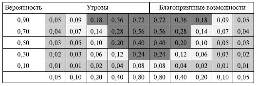

## **Управление внедрением: методологии внедрения, управление сроками, управление стоимостью, управление рисками.**

**Назначение и состав методологий внедрения**
### ***Методологии внедрения*** 
обычно разрабатываются ведущими производителями информационных систем с учетом особенностей их программных продуктов, а также сферы внедрения. Положительная сторона таких стандартов - их практическая направленность. Они представляют собой глубоко проработанные, проверенные, многократно апробированные рабочие инструкции и шаблоны проектных документов. Такие стандарты обычно далеки от теоретических абстракций, ориентированы на особенности конкретных систем, содержат наилучший *опыт*. Но у стандартов есть и отрицательные стороны: даже методологии, предназначенные для систем, близких по классу, не взаимозаменяемы. Например, *методология внедрения* системы Microsoft Axapta направлена во многом на управление настройками модулей и доработками; а при внедрении функционально подобных модулей *SAP* или *ORACLEEBS* превалирует идеология бизнес-реинжиниринга, при котором организации предлагается изменять свои *бизнес-процессы*, адаптируя их под "лучший *опыт*", зафиксированный в системе. В качестве наиболее известных примеров методологий можно привести следующий, далеко не исчерпывающий перечень:

- разработкикомпании Microsoft - методологии "OnTarget", "MSF (*Microsoft Solutions Framework*)", "Business Solutions Partner*Methodology*";
- разработки компании *SAP* - методологии "*Процедурная модель* *SAP*", "*ASAP* (*Accelerated* *SAP*)";
- разработки *компании Oracle* - комплекс методологий "Oracle Method".

Как уже отмечалось выше, *методологии внедрения* информационных систем являются источником информации для разработки иерархической структуры проекта внедрения и *иерархической структуры работ*проекта. Состав *работ* (процессов) и последовательность их исполнения в значительной мере определяются целями проекта внедрения, используемым программным обеспечением, особенностями автоматизируемой сферы деятельности, организационной структурой объекта автоматизации, принятой у разработчика организацией работы и пр.

В настоящем разделе мы рассмотрим особенности отдельных *методологий внедрения*: их цели, предусмотренные этапы, состав и взаимосвязи *работ*.

**Методологии внедрения компании Microsoft**

Для поддержки внедрения систем группы Microsoft Business Solutions (Microsoft *Dynamics* *NAV*, Microsoft *Dynamics* AX, Microsoft *CRM*) компанией Microsoft разработан ряд методологий: On *Target*, Microsoft Business Solutions Partner *Methodology*, Microsoft *Dynamics* Sure *Step*. Все они поддерживаются специализированными программными средствами и шаблонами проектной документации, которые не являются общедоступными и предоставляются только официальным партнерам Microsoft.

Наиболее старая версия - методология On *Target* - ориентирована главным образом на удовлетворение требований, сформулированных Заказчиком. Процесс внедрения делится на шесть этапов: *подготовка проекта*, *анализ*, *дизайн*, *разработка* и *тестирование*, *развертывание*, *опытная эксплуатация*. Задачи этапов и выполняемые работы приведены в [таблице 2.1](http://www.intuit.ru/studies/courses/2196/267/lecture/6796?page=1#table.2.1).

|Таблица 2.1. Характеристика этапов внедрения по методологии On Target|
| :- |
|***Этап проекта***|**Цели этапа**|**Выполняемые работы (пакеты работ)**|
|*Подготовка проекта*|Разработать проектную документацию. Сформировать *команду проекта*|Предварительное планирование проекта. Разработка *проектных процедур*. Формирование Рабочей группы Проекта. Разработка и утверждение Устава Проекта. Разработка спецификации на следующую стадию|
|Анализ|Подготовить *команду проекта*. Разработать функциональные требования к системе|Обучение Рабочей группы Заказчика (ключевые пользователи, разработчики и администраторы). Анализ бизнес-процессов Заказчика. Подготовка и утверждение функциональных требований к системе. Подготовка Плана и*Бюджета Проекта*. Разработка спецификации на следующую стадию|
|Дизайн|Разработать технические требования к системе. Разработать принципы*реализации требований*|Подготовка и утверждение Технического задания. Разработка и согласование Дизайна решения (реализация функциональных требований в системе). Детальное описание системных модификаций и интерфейсов с внешними программами. Уточнение Плана и *Бюджета Проекта*. Разработка спецификации на следующую стадию|
|Разработка и тестирование|Создать программный продукт Проверить работоспособность продукта|Разработка и тестирование дополнительной функциональности. Разработка и утверждение дополнительных интерфейсов. Разработка программы тестирования модификаций и интерфейсов. Выполнение процедур тестирования модификаций и интерфейсов. Разработка спецификации на следующую стадию|
|Развертывание|Установить систему у Заказчика|Развертывание (инсталляция) системы на рабочие места конечных пользователей. Настройка прав и уровней доступа пользователей. Разработка процедур переноса сальдо и операций. Разработка процедур верификации начальных данных и операций. Подготовка пользовательских инструкций. Обучение конечных пользователей. Разработка спецификации на следующую стадию|
|*Опытная эксплуатация*|Запустить систему в эксплуатацию. Осуществить сдачу-приемку проекта|Перенос начальных сальдо и операций. Выполнение процедур верификации начальных данных. Запуск системы в эксплуатацию. *Опытная эксплуатация*. Приемка|
В последующих версиях методологии - **Microsoft Business Solutions Partner Methodology, Microsoft Dynamics Sure Step** - основной акцент делается на нуждах бизнеса Заказчика, которому, в конечном итоге, необходимо решение для эффективной работы бизнеса: система управления предприятием, обеспечивающая достижение его целей. Результат проекта, согласно *MBS* Partner *Methodology*, - это работающее решение для бизнеса Заказчика, а не простая настройка программного продукта. Использование в процессе внедрения этой методологии позволяет обеспечить высокую эффективность проекта для Заказчика и реальное достижение тех целей внедрения, ради которых Заказчик и начал проект. Методология обеспечивает регулярный *контроль* хода проекта на всех этапах, что направлено на снижение проектных рисков.

Таким образом, цели *MBS* Partner *Methodology* оказываются значительно шире, чем в предыдущей методологии, и включают в себя:

- создание решения, оптимально соответствующего бизнес-потребностям клиента;
- максимально эффективное использование ресурсов;
- минимизацию сроков и затрат на внедрение;
- *уменьшение рисков* компании клиента.

Состав *этапов проекта внедрения* отличается от предыдущей версии методологии, как по названиям, так и по выполняемым работам.

|***MBS*** **Partner** ***Methodology***|**On Target**|
| :- | :- |
|1. Диагностика|1. *Подготовка проекта*|
|2. Анализ|2. Анализ|
|3. Дизайн|3. Дизайн|
|4. Разработка и тестирование|4. Разработка и тестирование|
|5. Развертывание|5. Развертывание|
|6. Начальное сопровождение|6. *Опытная эксплуатация*|
Содержание *этапов проекта* представлено в [таблице 2.2](http://www.intuit.ru/studies/courses/2196/267/lecture/6796?page=1#table.2.2).

В рамках данной методологии вводятся понятия концептуального (ориентированного на бизнес-пользователя) и детального (ориентированного на разработчика) дизайна системы, что обеспечивает последовательность и преемственность в формировании пользовательских и системных требований к решению.

Появляются требования о выделении отдельной среды для разработки программного продукта, среды для тестирования, рабочей среды для интеграции результатов в рабочую систему.

|Таблица 2.2. Характеристика этапов внедрения по методологии *MBS* Partner *Methodology*|
| :- |
|***Этап проекта***|**Цели этапа**|**Выполняемые работы (пакеты работ)**|
|Диагностика|Анализ и описание бизнес-процессов. Выявление основных потребностей бизнеса. Оценка функциональной применимости базового программного продукта. Определение ожидаемых результатов, сроков, границ и*бюджета проекта*|Организация рабочей группы сотрудников Заказчика для проведения диагностики. Сбор предварительной информации. Обследование и описание структуры предприятия, бизнес-процессов, основных целей, потребностей и ожиданий Заказчика. Согласование результатов обследования, установка критериев оценки результатов проекта. Подготовка отчета о Диагностике. Предложения по разработке и внедрению решения|
|Анализ|Организация проекта. Детальное обследование и описание предприятия Заказчика. Изучение требований к внедряемому решению. Документирование функциональных требований, создание полного перечня требуемых модификаций и доработок функциональности|Открытие проекта, формирование Управляющего комитета и *проектной группы*. Подготовка плана проекта, Устава проекта, порядка отчетности, управления изменениями и рисками, сдачи-приемки проекта. Проведение тренинга для сотрудников клиента по базовой функциональности продукта. Уточнение и детализация требований к решению бизнес-процессов Заказчика. Выработка решений относительно изменения существующих бизнес-процессов, модификации функциональности продукта, построения интерфейсов с внешними системами. Подготовка Спецификации функциональных требований. Согласование и утверждение функциональных требований, уточнение параметров проекта|
|Дизайн|Описание создаваемого решения, детальное проектирование модификаций и доработок функциональности. Планирование изменений бизнес-процессов. Уточнение подходов к разработке и испытаниям проектируемого решения|Разработка Концептуального дизайна (Технического задания), описывающего в терминах предметной области концепцию реализации решения, изменения функциональности и бизнес-процессов, требования к отчетности. Согласование и утверждение Концептуального дизайна Заказчиком проекта. Разработка Детального дизайна (Программного дизайна), описывающего в терминах системы предполагаемые модификации функциональности, интерфейсы с внешними системами, порядок тестирования разработки, порядок приемки работ. Согласование и утверждение Детального дизайна. Планирование порядка, сроков и ресурсов для разработки и контроля качества. Уточнение параметров последующих стадий|
|Разработка и тестирование|Реализация и первичное тестирование модификаций и доработок функциональности. Установка и настройка системы. Планирование и проведение испытаний. Доработка решения по результатам испытаний|Настройка среды для разработки, среды для тестирования, рабочей среды для интеграции результатов в рабочую систему. Реализация модификаций и интерфейсов, первоначальное тестирование разработчиками. Передача результатов разработки Заказчику для тестирования, исправление обнаруженных ошибок, корректировка требований, повторная реализация и тестирование. Комплексное тестирование Заказчиком, исправление ошибок и корректировка требований. Установка результатов разработки в рабочую среду, настройка системы, перенос основных справочников и сальдо. Проведение финальных испытаний и подготовка к сдаче-приемке|
|Развертывание|Подготовка и настройка рабочей системы. Разработка пользовательской документации. Тренинг конечных пользователей. Планирование и запуск в рабочую эксплуатацию. Сдача-приемка проекта|Проведение официальной сдачи проекта Заказчику. Оценка достижения целей проекта и критериев успеха. Планирование запуска в промышленную эксплуатацию. Подготовка системы к запуску, контроль готовности, заведение актуальных данных. Организация и проведение тренинга для конечных пользователей. Запуск ежедневной обработки в новой системе операций. Осуществление первоначальной поддержки специалистами партнера промышленной эксплуатации системы. Официальное завершение проекта, оценка проекта Заказчиком|
|Начальное сопровождение|Сопровождение функционирования системы в режиме рабочей эксплуатации. Устранение выявленных несоответствий. Переход к режиму работы Заказчика в рамках контракта на регулярное сопровождение|Осуществление ежедневной поддержки работы Заказчика с системой (по телефону, электронной почте, с выездом специалистов на место). Периодические обновления системы, связанные с выходом новых версий, изменениями законодательства, развитием технологий. Проведение периодической оценки соответствия решения требованиям Заказчика, наличия потребностей в изменении и развитии решения. Планирование и организация новых проектов|
**Методология внедрения OneMethodology**

*Методология* **OneMethodology** разработана компанией PeopleSoft (теперь входящей в состав *Oracle*) для внедрения информационных систем линейки J.D. Edwards.

Методология направлена на достижение следующих целей:

- Обеспечить согласованность иерархии целей и *задач проекта*, его временных границ и ожидаемых результатов.
- Определить требования к проектным командам с обеих сторон, а также порядок их взаимодействия.
- Учесть приоритетность проводимых работ и разделение рисков/ ответственности с фиксацией ролей Исполнителя и Заказчика.
- Обеспечить *реализацию требований* к системе согласно составу задач и описанию бизнес-процедур.
- Обеспечить безболезненный переход к работе в новом информационном окружении.

Состав *этапов проекта* внедрения существенно отличается от рассмотренных методологий.

|***MBS*** **Partner** ***Methodology***|**On Target**|**OneMethodology**|
| :- | :- | :- |
|1. Диагностика|1. *Подготовка проекта*|1. Рамки внедрения|
|2. Анализ|2. Анализ|2. Модель|
|3. Дизайн|3. Дизайн|3. Конфигурирование|
|4. Разработка и тестирование|4. Разработка и тестирование|4. Запуск в эксплуатацию|
|5. Развертывание|5. Развертывание|5. Развитие|
|6. Начальное сопровождение|6. *Опытная эксплуатация*||
Содержание *работ* по *этапам проекта* внедрения представлено в [таблице 2.3](http://www.intuit.ru/studies/courses/2196/267/lecture/6796?page=2#table.2.3).

|Таблица 2.3. Характеристика этапов внедрения по методологии OneMethodology|
| :- |
|***Этап проекта***|**Цели этапа**|**Выполняемые работы (пакеты работ)**|
|Рамки внедрения|Определение целей и рамок проекта|
**Определение функциональных целей**:

- определение целей внедрения системы управления и преимуществ, которые получит Заказчик в результате внедрения, предварительная оценка эффективности внедрения системы;

- определение и описание автоматизируемых бизнес-процессов и последовательности автоматизации;

- определение организационных рамок проекта (подразделений, которые будут участвовать в автоматизируемых бизнес-процессах) формирование *проектной группы* Заказчика и описание ее задач.
|
|||
**Разработка технологической архитектуры**:

- архитектуры приложения,

- конфигурации сети,

- конфигурации оборудования.
|
|||
**Конвертация данных**:

- определение перечня данных, которые должны быть в системе,

- определение формата ввода этих данных,

- определение возможности автоматической конвертации.
|
|||
**Интерфейсы с внешними программами**:

- определение состава программ, с которыми будет производиться обмен данными,

- определение механизмов взаимодействия
|
|Модель|Проектирование будущей системы и будущих бизнес-процессов|
**Общий обзор и планирование**:

- описание текущего состояния компании с ее бизнес-процессами и планирование мероприятий по моделированию будущих бизнес-процессов, сбору и подготовке исходных данных.
|
|||
**Моделирование бизнес-процессов**:

- описание бизнес-процессов и согласование разработанных моделей,

- определение требований бизнес-процессов к информационной системе.
|
|||
**Анализ недостающей функциональности**:

- анализ соответствия приложений потребностям бизнеса,

- определение набора требований, которые необходимо реализовать с помощью дополнительной разработки либо вообще невозможно реализовать.
|
|||
**Планирование доработок ПО**:

- составляется план разработки дополнительного программного обеспечения, оценивается объем и длительность этих работ, затраты;

- анализ альтернативных вариантов
|
|Конфигурирование|Выполнение *пилотного проекта*и развертывание системы|**Обучение проектной группы**: Обучение участников проектной команды Заказчика функциям и процедурам информационной системы и базовым навыкам работы с ней.|
|||**Прогонка по системе (Solution Walk-trough)**: настройка *пилотного проекта*, тестирование на ограниченном массиве исходных данных компании Заказчика.|
|||**Ввод исходных данных**: ввод исходных данных по подразделениям компании согласно выбранным бизнес-процессам.|
|||*Конфигурирование* **программного обеспечения**: развертывание информационной системы для всех пользователей.|
|||**Разработка пользовательской документации**: формирование *инструкций пользователей* и описаний системы.|
|||**Формирование прав доступа**: настройка прав доступа групп пользователей к информации и обеспечение безопасности данных системы|
|||**Интеграция**: объединение модулей *пилотного проекта* с внешними программами, которые мы определили на этапе планирования|
|Запуск в эксплуатацию|Запуск системы в *опытную эксплуатацию*|**Тестирование рабочей конфигурации**: тестирование настроенной версии с введенными в нее данными и сравнение их с данными текущих систем.|
|||**Тренинг (обучение) конечных пользователей**.|
|||**Настройка производительности** системы и распределение задач по серверам.|
|||**Запуск системы в опытную эксплуатацию**|
|Развитие|Оптимизация, совершенствование системы|**Оценка работоспособности недостающей функциональности (Gap analysis workshop)**: оценка работоспособности доработанного функционала и соответствия достижению целей, поставленных перед проектом.|
|||**Оптимизация бизнес-процессов**: изменение бизнес-процессов для обеспечения достижения поставленных целей.|
|||**Передача системы**: передача ИС в промышленную эксплуатацию|
**Методология внедрения компании Oracle**

Методика *компании Oracle* внедрения готовых приложений пакета *Oracle* E-Business *Suite*, называемая **Application Implementation Method (AIM)**, является составной частью методического комплекса *OracleMethod*, который охватывает различные аспекты развития ИТ-инфраструктуры компании. Методология *Oracle* *AIM* представляет собой детальное описание задач, выполняемых в ходе проекта, с указанием последовательности их выполнения и ответственных ролей *проектной группы* [\[ 7 \] ](http://www.intuit.ru/studies/courses/2196/267/literature#literature.7).

Общая схема исполнения проекта согласно *AIM* описывается следующей последовательностью действий:

- Строится грубая модель явления.
- Выявляются детальные требования к разным аспектам явления.
- Модель и детальные требования отображаются в приложении (приложение настраивается и демонстрируется).
- Если какие-то аспекты модели или требований не реализуются приложением, то формируется подход к их реализации.
- Стоимость реализации новых возможностей приложения оценивается, и если она "слишком" велика, то происходит возврат к перестройке модели или изменение требований.
- Если стоимость реализации новых возможностей оправдана, то новые компоненты приложения разрабатываются (и интегрируются в приложение).
- Составляются инструкции по использованию приложения, объединяющие стандартные и новые возможности приложения и базирующиеся на модели явления и на детальных требованиях к нему.
- Новая модель внедряется в жизнь.

Работы, выполняемые для решения этих задач, по принципу общности результатов сгруппированы в процессы. Проект делится на шесть фаз (см. [рис. 2.1](http://www.intuit.ru/studies/courses/2196/267/lecture/6796?page=3#image.2.1)).

**Основные цели, которые должны быть достигнуты в соответствующих фазах проекта**

- В фазе **Определение** сформулированы совокупные бизнес-требования Заказчика. Впоследствии они могут уточняться и видоизменяться в ходе отображения на функциональность Oracle E-Business Suite, но появления новых бизнес-требований не происходит.
- В фазе **Анализ операций** зафиксированы будущие бизнес-процессы и определено, как они будут реализованы с помощью Oracle E-Business Suite; установлено, какие бизнес-требования не могут быть удовлетворены с помощью стандартной функциональности и какая дополнительная разработка необходима.
- В фазе **Дизайн решения** получены детальные спецификации для дополнительной разработки (функциональный и технический дизайн) и разработаны сценарии тестирования.
- В фазе **Разработка** завершены все дополнительные разработки, проведены приемочные тесты, разработана пользовательская документация для эксплуатации решения.
- В фазе **Переход** завершено обучение конечных пользователей, проведена конвертация данных, система введена в эксплуатацию.
- В фазе **Эксплуатация** - обеспечение поддержки Заказчика в работе с системой; устранение выявленных недостатков в работе системы.

**Рис. 2.1.** Организация проекта внедрения согласно AIM

Каждый из выделенных процессов подразумевает выполнение определенного комплекса *работ*.

- **Определение бизнес-требований (RD)**. Результатом выполнения задач, входящих в данный процесс, является описание требований Заказчика к развертываемой системе. В ходе этого процесса создаются детальные описания выполнения бизнес-процессов Заказчика в заданной области автоматизации (модели "как есть"). Затем разрабатываются модели бизнес-процессов Заказчика, которые будут реализованы после развертывания системы (модели "как должно быть"). Последние затем детализируются до уровня конкретных функций, выполняемых системой для каждого элементарного шага бизнес-процесса.
- **Отображение бизнес-требований (BR)**. В ходе выполнения задач этого процесса выясняется, какая функциональность Oracle E-Business Suite и каким образом может применяться для реализации необходимых Заказчику функциональных возможностей информационной системы. Окончательно определяются бизнес-процессы "как должно быть" и состав используемой в системе информации. Фиксируются значения параметров настройки программных модулей Oracle E-Business Suite и перечень необходимых доработок.
- **Разработка архитектуры (TA)**. В ходе этого процесса происходит построение технической архитектуры, необходимой для работы системы, а также определяются значения *ключевых параметров*настройки Oracle E-Business Suite, касающихся архитектуры.
- **Разработка дополнительной функциональности (MD)**. В рамках этого процесса разрабатывается программное обеспечение, которое необходимо для реализации функциональности, отсутствующей в Oracle E-Business Suit.
- **Конвертация данных (CV)**. Процесс охватывает задачи, связанные с переносом данных из унаследованных систем в новую. Выявляются объекты, содержащие необходимые данные, определяются методы преобразования и загрузки этих данных в систему. Разрабатывается вспомогательное программное обеспечение.
- **Документирование (DO)**. В этом процессе создается документация на систему.
- **Тестирование функциональности (TE)**. На основе бизнес-требований разрабатываются сценарии тестирования и проводится проверка реализации этих требований в системе.
- **Тестирование производительности (PT)**. Проверяется работоспособность системы в условиях реальной нагрузки (по количеству пользователей, документов, транзакций и пр.).
- **Обучение (TR)**. Процесс включает в себя две основные задачи: обучение *проектной группы* (с него начинается проект по внедрению) и обучение конечных пользователей (им проект заканчивается).
- **Ввод в эксплуатацию (PM)**. В ходе этого процесса рассматриваются все вопросы, связанные с организацией промышленной эксплуатации системы и ее сопровождением.

Процессы в *AIM* формируются из задач. Задача - элементарный (неделимый) объем *работ*, который обязательно заканчивается формально фиксируемым (документируемым) результатом. Если результат естественным образом в ходе выполнения задачи сформирован в электронной форме (например, выполнены настройки программного модуля), то он должен быть оформлен соответствующим документом, согласован и утвержден (обычно в бумажной форме). Если результатом задачи является выполненная работа, то он документируется в виде акта. Выполнение задачи дает результат либо полезный для целей проекта сам по себе, либо используемый для выполнения (в качестве входа) другой задачи. Задачи в *AIM* обозначаются двумя буквами (обозначение процесса) и двумя-тремя цифрами через точку.

В методологии приводится описание типовых ролей, которые исполняются участниками проекта при выполнении задач.

Описание выполняемых *работ* заключается в формировании цепочек задач, которые необходимо выполнить для достижения целей проекта.

Внедрение готового приложения заключается в одновременном согласовании возможностей приложения и организации исполнения автоматизируемых бизнес-процессов. Это приводит к необходимости настройки (доработки) приложения и модификации бизнес-процессов. Рекомендуемая последовательность действий определяется следующей цепочкой задач:

*RD.020 - RD.030 - RD.070 - BR.020 - BR.080 - MD.020 - MD.060 - DO.070 - TE.110 - PM.050 - CV.140 - PM.080*, где

- RD.020 - изучение существующих бизнес-процессов;
- RD.030 - моделирование будущих бизнес-процессов;
- RD.070 - выявление детальных требований к будущим бизнес-процессам;
- BR.020 - отображение бизнес-процессов в функциональность приложения;
- BR.080 - тестирование принятых решений;
- *MD*.020 - оценка решений по доработке функциональности приложения;
- *MD*.060 - дизайн расширений функциональности приложения;
- DO.070 - разработка инструкций для пользователя;
- *TE*.110 - тестирование приложения;
- PM.050 - установка приложения на систему периода эксплуатации;
- CV.140 - ввод начальных данных;
- PM.080 - запуск новой системы.

**Пример корпоративной методологии внедрения**

В настоящем разделе рассмотрен ряд примеров достаточно интенсивно применяемых *методологий внедрения* информационных систем. Следует учитывать, что в "чистом" виде эти методологии используются весьма редко. Обычно на их основе компаниями создаются свои внутренние, корпоративные методики, которые концентрируют *опыт* и особенности работы компании. Поэтому корпоративные методики рассматриваются как разновидность коммерческого продукта компании, и *доступ* к их содержанию ограничен.

В качестве примера можно привести краткое описание одной из корпоративных методик внедрения информационных систем.

Проекты внедрения включают в себя шесть этапов:

- *Подготовка проекта*.
- Анализ операций.
- Дизайн системы.
- Построение системы.
- Переход.
- Эксплуатация.

Цели и задачи этапов приведены в [таблице 2.4](http://www.intuit.ru/studies/courses/2196/267/lecture/6796?page=4#table.2.4).

|Таблица 2.4. Характеристика этапов внедрения корпоративной методологии|
| :- |
|***Этап проекта***|**Цели этапа**|**Выполняемые работы (пакеты работ)**|
|*Подготовка проекта*|Формирование проектных документов и *команды проекта*|
- Организовать проект

&emsp;- Сформулировать ожидаемые результаты проекта

&emsp;- Создать инфраструктуру проекта

&emsp;- Построить команду внедрения

- Создать модель автоматизации

&emsp;- Определить финансовую и операционную структуры компании

&emsp;- Определить текущие бизнес-процессы и учетные процедуры

- Создать детальный план проекта

Результаты:

- Общее описание деятельности

- Анализ текущих бизнес-процессов

- Модель управленческого планирования и учета

- Предварительный концептуальный дизайн системы

- Обученная команда внедрения

- Детальный план проекта внедрения
|
|Анализ операций|Оценка специфики и создание детального рабочего плана проекта|
- Анализ бизнес-процессов

&emsp;- Сбор информации о бизнес-процессах

&emsp;- Разработка модели для каждого бизнес-процесса

&emsp;- Внесение в существующие бизнес-процессы изменений и дополнений, необходимых для соответствия модели системы

- Разработка требований к оборудованию, программному обеспечению и коммуникациям

- Определение задания на дополнительные разработки в системе

- Разработка дополнительных моделей

&emsp;- Разработка моделей тестирования

&emsp;- Разработка модели перехода на новую систему

Результаты:

- Утвержденная модель будущих процессов

- Анализ реализации процессов в системе

- Анализ достаточности структуры базы данных

- Концептуальный дизайн системы

- Требования к изменению или расширению функциональности системы
|
|Дизайн системы|Проектирование системы|
- Преобразование бизнес-процессов

&emsp;- Определение сценариев работы в системе

&emsp;- Проектирование параметров системы

&emsp;- Подготовка первой версии рабочих инструкций

- Разработка детальных схем дополнительных разработок

- Разработка материалов для обучения

- "Техническое" проектирование системы

&emsp;- Проектирование архитектуры ПО,

&emsp;- Проектирование системы безопасности,

&emsp;- Определение требований к оборудованию,

&emsp;- Проектирование организации базы данных

- Разработка средств конвертации данных

- Подготовка инфраструктуры тестирования системы

Результаты:

- Описание настройки системы

- Техническое задание на разработку модулей системы

- Описание соответствия данных существующей системы с данными системы

- Сценарии бизнес-тестирования системы

- Сценарии тестирования интеграции с другими системами

- План обучения пользователей
|
|Построение системы|Создание рабочей версии системы|
- Разработка дополнительного программного обеспечения

&emsp;- Функциональное расширение модулей и базы данных

&emsp;- Разработка интерфейсов с существующими системами

&emsp;- Разработка программ конвертации данных

- Тестирование

&emsp;- Работоспособности модулей и системы в целом в соответствии с требованиями

&emsp;- Средств конвертации данных

&emsp;- Интерфейсов

&emsp;- Производительности системы

- Разработка документации для пользователей, системных администраторов и технической поддержки

- Разработка и тестирование процедур инсталляции

Результаты:

- Установлена рабочая версия системы

- Настроены параметры системы

- Проведена тестовая конвертация данных

- Созданы инструкции для пользователей

- Проведено бизнес-тестирование системы

- Проведено тестирование интеграции системы с другими системами

- План перехода на новую систему
|
|Переход|Запуск системы в эксплуатацию|
- Установка системы конвертации данных, загрузка и проверка данных в системе

- Обучение пользователей

- Подготовка рабочего пространства в системе

- Окончательная настройка системы

- Организация поддержки системы

- Обеспечение нормальной работы пользователей

- Определение статуса готовности системы

- Переход к эксплуатации системы

Результаты:

- Конвертированные и проверенные данные

- Результаты окончательного тестирования

- Подготовленные пользователи

- Рабочая система

- Инфраструктура поддержки системы
|
|Эксплуатация|Поддержка и развитие системы|
- Начало эксплуатации системы

- Аудит системы

- Измерение производительности

- Прекращение использования старой системы

- Поддержка системы

- Определение новых направлений

Результаты:

- Работающая система

- Результаты проверки эффективности использования системы

- Рекомендации по дальнейшему развитию системы
|
Дополнительно следует отметить, что в рассмотренных методологиях процедуры управления проектом присутствуют в усеченном варианте. Полная технология управления проектами рассматривается в последующих разделах книги.

Для упрощения управления проектом, организации и координации проектных *работ* все действия, направленные на достижение целей проекта, разбивают на отдельные составляющие - процессы управления проектом. *Управление проектом* *по* *стандарту PMBOK* выполняется с помощью 44 процессов, которые объединены в пять групп, называемых *"группы процессов управления проектом"* [\[ 9 \] ](http://www.intuit.ru/studies/courses/2196/267/literature#literature.9):

1. Группа *процессов инициации*.
1. *Группа процессов* планирования.
1. Группа *процессов исполнения*.
1. *Группа процессов* мониторинга и управления.
1. Группа завершающих процессов.

Все пять *групп процессов* имеют четкие зависимости, они выполняются в одной и той же последовательности в каждом проекте с определенным наложением. Степень наложения определяется условиями выполнения конкретного проекта.

Процессы, входящие в группу процессов, могут иметь взаимосвязи как в рамках данной *группы процессов*, так и с процессами других групп.

Для успешного достижения целей проекта необходимо не только управлять каждым процессом в отдельности, но и обеспечить*комплексный подход* к управлению с учетом взаимосвязей, взаимозависимостей как отдельных процессов, так и *групп процессов*.

С целью структуризации управления проектом процессы управления проектом распределены *по* девяти областям знаний [\[ 9 \] ](http://www.intuit.ru/studies/courses/2196/267/literature#literature.9):

1. Управление интеграцией.
1. Управление содержанием.
1. Управление временем.
1. *Управление стоимостью*.
1. Управление персоналом.
1. Управление коммуникациями.
1. Управление качеством.
1. Управление рисками.
1. Управление снабжением.

Распределение 44 процессов *по* областям знаний и *группам процессов* представлено в [таблице 4.1](http://www.intuit.ru/studies/courses/2196/267/lecture/6800?page=1#table.4.1).

|Таблица 4.1. Распределение процессов по областям знаний и *группам процессов*|
| :- |
|**Процессы и области знаний**|***Группы процессов управления проектом***|
||**Группа** ***процессов инициации***|***Группа процессов*** **планирования**|**Группа *процессов исполнения***|***Группа процессов* мониторинга и управления**|**Группа завершающих процессов**|
|**Интеграция управления проектом**|Разработка Устава проекта. Разработка предварительного содержания проекта|Разработка *плана управления проектом*|Руководство и управление исполнением проекта|Мониторинг и управление работами проекта|Закрытие проекта|
|**Управление содержанием проекта**||Планирование содержания. Определение содержания. Создание*ИСР*||Подтверждение содержания. Управление содержанием||
|**Управление сроками проекта**||Определение состава операций. Определение *взаимосвязей операций*. Оценка *ресурсов операций*. Оценка *длительности операций*. Разработка расписания||Управление расписанием||
|***Управление стоимостью* проекта**||*Стоимостная оценка*. *Разработка бюджета расходов*||*Управление стоимостью*||
|**Управление качеством проекта**||Планирование качества|Обеспечение качества|Контроль качества||
|**Управление человеческими *ресурсами проекта***||Планирование человеческих ресурсов|Набор *команды проекта*. Развитие *команды проекта*|Управление *командой проекта*||
|**Управление коммуникациями проекта**||Планирование коммуникаций|Распространение информации|Отчетность по исполнению. Управление участниками проекта||
|**Управление рисками проекта**||Планирование управления рисками. Идентификация рисков. *Качественный анализ рисков*. Количественный анализ рисков.Планирование реагирования на риски||Мониторинг и управление рисками||
|**Управление поставками проекта**|||| ||

### **УПРАВЛЕНИЕ сроками**
**Процессы управления сроками проекта**

Согласно РMBOК, **управление сроками проекта** ( *time management* ) - *это процесс, используемый для обеспечения своевременного завершения проекта*.

Управления сроками проекта состоит *из шести процессов* [\[ 9 \] ](http://www.intuit.ru/studies/courses/2196/267/literature#literature.9).

**Определение состава операций** - процесс определения конкретных плановых операций, которые необходимо выполнить для получения результатов проекта - внедрения ИС.

**Определение взаимосвязей операций** - процесс выявления и документирования последовательности выполнения плановых операций.

**Определение** *ресурсов операции* - процесс определения необходимых для выполнения каждой плановой *операции* ресурсов и их количества.

**Определение длительности операций** - процесс определения продолжительности выполнения каждой плановой *операции*.

**Разработка расписания** - процесс составления *расписания проекта* с учетом последовательностей операций, их длительности, требований к ресурсам и ограничений на сроки выполнения проекта в целом.

**Управление расписанием** - *процесс управления* изменениями *расписания проекта*.

Первые пять процессов относятся к *группе процессов* планирования, шестой - к *группе процессов* мониторинга и управления. Процессы взаимодействуют как между собой, так и с процессами из других областей знаний.

Процессам управления сроками проекта предшествует *процесс планирования*, определяющий формат и критерии разработки и контроля *расписания проекта*, управления проектом, в ходе которого разрабатывается план управления расписанием. План управления расписанием входит в *план управления проектом*, либо является его вспомогательным планом.

На [рис. 5.1](http://www.intuit.ru/studies/courses/2196/267/lecture/6802?page=1#image.5.1) показана последовательность процессов, приводящая к разработке *расписания проекта* и затем к управлению расписанием. Разработка *расписания проекта* начинается с определения состава операций. После того как *операции* определены, между ними устанавливаются взаимосвязи. Чтобы определить длительность операций, следует назначить специалистов, которые будут выполнять *операции*, - уровень их квалификации имеет определяющее *значение*. Рассмотрим подробнее, каким образом определяются *операции* проекта, их взаимосвязи, требуемые ресурсы, длительность операций, как составляется *расписание проекта* и осуществляется управление им.

**Рис. 5.1.** Связь процессов управления сроками проекта
#### **Определение состава операций**
*Определение* состава операций предполагает *определение* и *документирование* *работ*, запланированных для выполнения. Инструментальным средством для определения состава операций, а также для оценки их взаимосвязи и длительности, служит *ИСР*. В предыдущем разделе был рассмотрен вопрос создания *иерархической структуры работ* путем декомпозиции. Напомним, что результатом процесса декомпозиции является нижний уровень *работ*, необходимых для завершения проекта. В процессе декомпозиции определяется нижний уровень управления, с которым работает *руководитель проекта*, - уровень *пакетов работ*. Пакеты *работ*, как правило, определяются Методологией внедрения ИС. **Пакет работ** *состоит из операций, имеющих общие функции или конечный результат*.

Пакеты *работ* разбивают на *операции*. **Операция** - *это единица работ, в результате которой имеется конкретный результат по внедрению информационной системы*.

Перед началом определения состава операций рекомендуется еще раз проанализировать описание содержания проекта, ограничения и допущения с точки зрения полноты списка операций, который будет основой для составления *смет*, планирования сроков выполнения и контроля проектных *работ*.

Состав операций может определяться последовательно, *методом набегающей волны*. Этот метод применяется в крупных или долгосрочных проектах, когда имеется неопределенность относительно выполнения некоторых *работ*. При использовании метода набегающей волны пакеты *работ*, расположенные в отдаленном будущем, планируются только на высоком уровне, в то время как пакеты *работ*, расположенные ближе по оси времени, планируются детально.
###### *Входная информация для процесса определения состава операций*
Входом для процесса определения состава операций являются [\[ 9 \] ](http://www.intuit.ru/studies/courses/2196/267/literature#literature.9):

- *методология внедрения* ИС;
- контракт;
- описание содержания проекта;
- иерархическая структура работ (*ИСР*);
- словарь *ИСР*.
###### *Инструменты и методы*
Для определения состава операций используют следующие **инструменты и методы**:

- декомпозиция;
- шаблоны;
- планирование *методом набегающей волны*;
- экспертная оценка.
###### *Выходы процесса определения состава операций*
Процесс определения состава операций завершается формированием нижеследующих документов.

*Список операций* - перечень работ, запланированных для выполнения.

*Параметры операций* - могут включать в себя идентификатор операции, коды операции, длительность, начало, окончание, исполнителя операции, перечни предшествующих и последующих операций, логические взаимосвязи, опережения и задержки, плановую трудоемкость работ и другие необходимые для управления проектом *параметры операций*.

**Список** *контрольных событий (вех проекта)* - определяет все *контрольные события* расписания, необходимые для мониторинга хода выполнения и для управления проектом. Список *контрольных событий*является элементом *плана управления проектом*. Веха проекта определяет момент перехода проекта из одного состояния в другое. Важным отличием вех от операций проекта является то, что они не имеют длительности.

**Запрошенные изменения** - изменения в составе работ, которые могут появиться в ходе выполнения работ по внедрению ИС и повлиять на описание содержания проекта.

Примеры состава операций и *контрольных событий* (*вех проекта*) представлены в таблицах [5.1](http://www.intuit.ru/studies/courses/2196/267/lecture/6802?page=1#table.5.1) и [5.2](http://www.intuit.ru/studies/courses/2196/267/lecture/6802?page=1#table.5.2).

|Таблица 5.1. Пример списка состава операций|
| :- |
|**Наименование пакета работ**|**Наименование операций**|
|Обследование|Формирование и согласование плана проведения интервью|
||Подготовка и рассылка опросных листов для интервью|
||Проведение интервью для описания бизнес-процессов|
|Описание бизнес-процессов|Описание бизнес-процессов по функциональной области *Финансы*|
||Описание бизнес-процессов по функциональной области *Логистика*|
||Описание бизнес-процессов по функциональной области *Персонал*|
|Разработка системы|Разработка решений по функциональной архитектуре|
||Подготовка функционального дизайна расширений|
||Настройка системы|
||Техническое проектирование расширений|
||Разработка расширений|
||Техническое проектирование программ конвертации данных|
||Разработка программ конвертации данных|
||Планирование тестирования приложения и *интеграционного тестирования*|
|Тестирование системы|Разработка сценариев тестирования|
||Подготовка тестовых данных|
||Проведение тестирования по функциональным областям *Финансы, Логистика, Персонал*|
||Проведение *интеграционного тестирования*|
||Проведение тестирования конвертации данных|
|Таблица 5.2. Пример списка *вех проекта*|
|***Вехи проекта***|
|
Входящие *вехи проекта*:

- Начало работ акцептовано Заказчиком

- Рабочие места подготовлены

- *Команда проекта* сформирована

- Подготовлено и проведено стартовое совещание

- Утверждено *расписание проекта*
|
|
*Вехи проекта*:

- Завершен сбор информации для описания бизнес-процессов

- Обследование завершено

- Завершена разработка системы

- Завершено приемочное тестирование

- Завершено *тестирование производительности*

- Готовность к конвертации данных

- Готовность к развертыванию системы
|
Планирование сроков проекта может быть выполнено с помощью специализированных программных средств. Пример планирования сроков работ в специализированной системе MS Project приведен на [рис. 5.2](http://www.intuit.ru/studies/courses/2196/267/lecture/6802?page=1#image.5.2).

**Рис. 5.2.** Планирование работ в MS Project
#### **Определение взаимосвязи операций**
Процесс определения *взаимосвязей операций* включает в себя идентификацию и *документирование* логических взаимосвязей между плановыми операциями. *Взаимосвязи операций* могут быть**последовательными**, с собственными **отношениями предшествования**, а также **опережениями** и **задержками**. В этом случае каждый выходной элемент *операции* используется как *входной* элемент другой *операции* или является частью поставки. *Взаимосвязи операций* могут быть **с перекрытиями**, когда еще незавершенная операция имеет достаточно выходных элементов для начала зависящей от нее*операции*, или **с параллельным** выполнением операций.
###### *Входная информация для процесса определения взаимосвязи операций*
**Входами** для процесса определения *взаимосвязи операций* могут быть:

1. Описание содержания проекта - содержит определение содержания продукта, включающее в себя характеристики продукта, которые могут повлиять на определение *взаимосвязей операций*, поэтому во избежание ошибок следует повторно проанализировать определение содержания продукта;
1. *Методология внедрения* ИС;
1. *Список операций* - выход процесса определения состава операций;
1. *Параметры операций* - выход процесса определения состава операций;
1. Список *контрольных событий* - выход процесса определения состава операций;
1. Одобренные запросы на изменение - выход процесса определения состава операций.
###### *Методы и инструменты*
При определении взаимосвязи используются нижеследующие **инструменты и методы**.

**Метод предшествования** - это метод построения *сетевых диаграмм* *расписания проекта*, в котором операции изображаются в виде прямоугольников (называемых "узлами"), а зависимости - соединяющими их дугами. Этот метод еще называется "операции в узлах", он используется в большинстве пакетов программного обеспечения для управления проектами. В этом методе существует четыре типа отношений предшествования:

- **Финиш-старт**. *Инициация* последующей операции зависит от завершения предшествующей операции (работа В не может начаться до завершения работы А);
- **Финиш-финиш**. Завершение последующей операции зависит от завершения предшествующей операции (работа В должна окончиться не раньше завершения работы А);
- **Старт-старт**. *Инициация* последующей операции зависит от *инициации* предшествующей операции (работа В начинается не раньше работы А);
- **Старт-финиш**. Завершение последующей операции зависит от *инициации* предшествующей операции (работа В должна продолжаться, пока не начнется работа А);
- **Гамак** - работа В начинается с окончания работы А и продолжается до начала работы С.

Для более полного понимания и практического применения *Метода предшествования* проанализируем отдельные операции, представленные на [рис. 5.2](http://www.intuit.ru/studies/courses/2196/267/lecture/6802?page=1#image.5.2). Так, например, операции № 11 и № 9 относятся к типу**Финиш-старт**. Операция № 11 "Проведение интервью для описания бизнес-процессов" не может начаться до завершения операции №9 "Формирование и согласование плана проведения интервью". К этому же типу относятся операции № 14 и № 11. Действительно, операция № 14 "Описание бизнес-процессов" не может начаться до того, как будут проведены интервью: интервью являются источником информации для описания бизнес-процессов. Примером операций типа **Старт-старт** могут служить операции 28 и 29 ([ рис. 5.2](http://www.intuit.ru/studies/courses/2196/267/lecture/6802?page=1#image.5.2)). Операция 29 "Подготовка тестовых данных" должна начинаться не раньше операции 28 "Разработка сценариев тестирования".

На [рис. 5.3](http://www.intuit.ru/studies/courses/2196/267/lecture/6802?page=2#image.5.3) в графической форме представлены все *типы связей*.

В методе предшествования чаще всего используется отношение предшествования типа **Финиш-старт** и редко применяются отношения **Старт-финиш**.

**Рис. 5.3.** Типы связей операций

**Метод стрелочных диаграмм**. Метод стрелочных диаграмм - это метод построения *сетевых диаграмм* *расписания проекта*, где операции представляются в виде дуг, которые соединяются в узлах, показывающих их зависимости. Этот метод еще называется "операции на дугах".

**Шаблоны расписания сети**. Стандартизированные шаблоны *сетевых диаграмм* *расписания проекта* могут использоваться для ускорения подготовки сетей плановых операций проекта. Они могут включать в себя как весь проект в целом, так и его часть.

**Определение зависимостей**. Для определения последовательности операций используется три типа зависимостей.

- Жесткая или обязательная зависимость - зависимость, при которой последовательность работ не может изменяться. Обязательные зависимости являются неотъемлемым свойством выполняемой работы и часто подразумевают физические ограничения на последовательность выполнения операций.
- Нежесткая или произвольная зависимость - последовательность определяется *командой проекта* и может изменяться.
- Внешняя зависимость - последовательность работ определяется внешними по отношению к проекту воздействиями. Внешние зависимости включают взаимоотношения операций проекта с непроектными операциями. Например, в проекте по разработке программного обеспечения сроки операции тестирования могут зависеть от поставки аппаратного обеспечения сторонней организацией.

Применение опережений и задержек. Опережения и задержки представляют собой интервалы времени, которые модифицируют взаимосвязи между предшествующими и последующими операциями. Опережения и задержки обозначаются знаками плюс (для задержки) и минус (для опережения) перед количеством периодов времени. На [рис. 5.4](http://www.intuit.ru/studies/courses/2196/267/lecture/6802?page=2#image.5.4) представлено графическое изображение операции с задержкой - работа Б начнется через 5 дней после окончания работы A.

**Рис. 5.4.** Изображение операции Финиш-старт с задержкой на 5 дней

Команда управления проектом определяет зависимости, для которых корректное определение логических взаимосвязей может вызвать опережение или задержку выполнения операции. Опережение позволяет ускорить последующую операцию. Например, системный архитектор проекта и программисты могут приступить к разработке функциональности системы по *Логистике*, не дожидаясь окончания описания бизнес-процессов по функциональности *Финансы, Персонал*.

Примером операции типа **Финиш-старт** с опережением могут служить операции "Разработка сценариев тестирования" и "Подготовка тестовых данных". Целесообразно приступить к подготовке тестовых данных до момента полного завершения разработки сценариев тестирования, т. е. начать работу с опережением. Например, за 5 дней до завершения разработки сценариев тестирования уже будет достаточно материала, чтобы начать подготовку тестовых данных.
###### *Выходы процесса определения взаимосвязи операций*
**Сетевые диаграммы расписания проекта** - схематическое отображение плановых операций проекта и логических взаимосвязей (зависимостей) между ними. Сетевая диаграмма *расписания проекта* может быть построена вручную или при помощи программного обеспечения для управления проектом, например, *Spider* или MS Project. Она может включать в себя полную детализацию проекта или одну или несколько суммарных операций ( *пакет операций* ). На [рис. 5.5](http://www.intuit.ru/studies/courses/2196/267/lecture/6802?page=2#image.5.5) приведен пример представления *расписания проекта* в виде диаграммы Гантта MS Project.

*Список операций (обновления)*. Если одобренные запросы на изменения являются результатом процесса определения *взаимосвязей операций*, то создается обновленный *список операций*, включающий в себя эти изменения.

**Параметры операции (обновления)**. Если одобренные запросы на изменения, являющиеся результатом процесса определения взаимосвязей между операциями, оказывают влияние на *список операций*, то в соответствующие элементы параметров операций включаются эти одобренные изменения (логические взаимосвязи и соответствующие опережения и задержки).

**Запрошенные изменения**. При разработке логических взаимосвязей, опережений и задержек проекта могут быть выявлены моменты, которые повлекут за собой запрос на изменение списка операций или параметров операций. Запрошенные изменения рассматриваются и утверждаются в рамках процесса общего управления изменениями.

**Рис. 5.5.** Фрагмент расписания проекта в виде диаграммы Гантта MS Project
#### **Оценка ресурсов операций**
Оценка ресурсов плановой *операции* призвана определить, какие ресурсы (человеческие ресурсы, оборудование) будут использоваться и в каком количестве и когда каждый из ресурсов будет доступен для выполнения *проектных операций*. Процесс оценки *ресурсов операций* тесно координируется с процессом *оценки стоимости*, который будет рассмотрен в следующей лекции.
###### *Входы процесса оценки ресурсов операций*
**Входами** для данного процесса являются:

- *Список операций*. *Список операций* определяет плановые операции для оцениваемых ресурсов;
- *Параметры операций*. *Параметры операций*, разработанные при определении состава операций, дают вход первичных данных для использования в оценке ресурсов, необходимых для каждой плановой операции в списке операций;
- **Наличие ресурсов**. Для оценки типов ресурсов используется информация о том, какие ресурсы (функциональные консультанты, бизнес-аналитики, серверы и т. п.) потенциально доступны;
- **План управления проектом**. План управления расписанием является составляющей частью *плана управления проектом* и используется в оценке *ресурсов операций*.
###### *Инструменты и методы*
**Инструменты и методы**, используемые при оценке *ресурсов операций*:

- **Экспертная оценка** - часто необходима для того, чтобы оценить ресурсные входы этого процесса. Такую оценку может дать экспертная группа, имеющая специальную подготовку в области планирования и оценки ресурсов;
- **Программное обеспечение для управления проектами** - помогает планировать, организовывать фонды ресурсов и управлять ими, а также разрабатывать оценки ресурсов. В зависимости от сложности программного обеспечения можно определять иерархические структуры ресурсов, наличие ресурсов и их *текущую стоимость*, а также различные календари ресурсов;

**Оценка "снизу вверх"**.

Когда плановую операцию нельзя оценить с достаточной степенью уверенности, то работы в пределах такой операции разбиваются на более мелкие элементы. Ресурсные потребности каждого более детализированного элемента работ оцениваются, и эти оценки объединяются в общее количество по каждому ресурсу плановой операции. Плановые операции могут быть связаны отношениями зависимости, которые могут влиять на привлечение и использование ресурсов, но могут и не иметь такой связи. Если отношений зависимости нет, то эта специфика применения ресурсов отражается в оценочных требованиях плановой операции и фиксируется документально.
###### *Выходы процесса оценки ресурсов операций*
Результатом процесса оценки *ресурсов операций* является следующая информация.

**Требования к** *ресурсам операции*. Выход процесса оценки *ресурсов операций* представляет собой определение и описание типов и количества ресурсов, необходимых для каждой плановой операции в пакете работ. Эти требования можно затем собрать в единое целое для определения оценочных ресурсов по каждому пакету работ. Детализация и уровень специфичности требований к ресурсам могут варьироваться в зависимости от области приложения. В документацию по требованиям к ресурсам для каждой плановой операции может входить оценочная база для каждого ресурса, а также допущения по типам ресурсов, их наличию и количеству. Процесс разработки расписания определяет потребность в тех или иных ресурсах. На [рис. 5.6](http://www.intuit.ru/studies/courses/2196/267/lecture/6802?page=3#image.5.6) представлен фрагмент таблицы "Ресурсы", содержащей следующие параметры: название ресурса, его код, количество, *стоимостную оценку* (фактическую и плановую), длительность и др.

**Рис. 5.6.** Фрагмент таблицы "Ресурсы", выполненной в системе управления проектом Spider

**Параметры операции (обновления)**. Виды и количество ресурсов, необходимых для каждой плановой операции, включаются в *параметры операций*. Если одобренные запросы на изменения являются результатом процесса оценки *ресурсов операций*, то создается обновленная версия списка операций и параметров операций, куда включаются эти изменения.

**Иерархическая структура ресурсов**. Иерархическая структура ресурсов представляет собой иерархическую структуру идентифицированных ресурсов по категориям и типам ресурсов.

**Календарь ресурсов (обновления)**. Сводный *календарь ресурсов проекта* документирует рабочие и нерабочие дни, определяющие даты, на которые данный ресурс (персонал, сервер и т. п.) может быть активным или не задействован. *Календарь ресурсов проекта*, в частности, отмечает выходные для данного ресурса дни и периоды доступности ресурса. *Календарь ресурсов проекта* назначает количество каждого доступного ресурса по каждому периоду доступности.

**Рис. 5.7.** Календарь проекта

**Запрошенные изменения**. Результатом процесса оценки ресурсов операции могут стать добавление в списке операций новых плановых операций или удаление из него старых; эти изменения оформляются как запрошенные изменения. Запрошенные изменения рассматриваются и утверждаются в рамках процесса общего управления изменениями.
#### **Оценка длительности операций**
*Длительность операции* - это продолжительность времени, необходимого для выполнения операции. Длительность может измеряться количеством дней, в течение которых человек (или несколько человек) трудился над данной операцией. Процесс оценки длительности плановых операций использует информацию о содержании *работ* *операции*, требуемых ресурсов, календарях ресурсов с указанием их доступности. Оценка длительности может уточняться в ходе выполнения проекта.

Процесс оценки *длительности операций* требует, чтобы были оценены объем работы, расчетное количество ресурсов и определено количество рабочих. Оценка длительности *операции* проводится с помощью *ИСР*.

**Рис. 5.8.** Диаграмма Гантта с привязкой к ресурсам

Общая длительность проекта рассчитывается как *выход* процесса разработки расписания.
###### *Входы процесса определения длительности операций*
**Описание содержания проекта**. При оценке длительности плановых операций учитываются ограничения и допущения, взятые из описания содержания проекта. Примером ограничения могут служить операции по сдаче документов, проверки, редактирования и аналогичные непродуктивные плановые операции, частота и продолжительность которых, как правило, указывается в контракте или в корпоративных правилах исполняющей организации.

*Список операций* - выход процесса определения *взаимосвязи операций*.

*Параметры операций* - выход процесса определения *взаимосвязи операций*.

**Требования к ресурсам операции**. Расчетные требования к *ресурсам операции* влияют на длительность плановой операции, так как привлеченные для плановой операции ресурсы и их наличие будет в значительной мере влиять на длительность большинства операций. Например, продолжительность разработки сценариев тестирования разрабатываемой ИС будет зависеть от количества консультантов-аналитиков, длительность тестирования разрабатываемой информационной системы будет зависеть от количества *тестировщиков* и т. д. Можно распределить разработку сценариев тестирования между консультантами-аналитиками по группам автоматизируемых бизнес-процессов, и тогда длительность плановой операции будет меньше той, где тот же объем работы выполнял бы один человек. Аналогично, за тестировщиками можно закрепить отдельные модули системы или группы бизнес-процессов и тем самым сократить время плановых операций по тестированию.

**Календарь ресурсов** - выход процесса оценки *ресурсов операций*.

**План управления проектом** включает в себя *реестр рисков* и проектные *сметы*. *Реестр рисков* содержит информацию об идентифицированных рисках проекта, рассматриваемых *командой проекта* при подготовке оценок *длительности операций* и ее корректировке с учетом рисков. *Оценка стоимости* *проектных операций* показывает расчетные объемы ресурсов по каждой плановой операции.
###### *Инструменты и методы*
**Оценка по аналогам** подразумевает оценку фактической длительности аналогичной предыдущей плановой операции в качестве основы для оценки длительности будущей плановой операции и использует историческую информацию и экспертную оценку.

**Параметрическая оценка**. Оценочную величину *длительности операций* можно вычислить путем умножения количества работы на производительность труда. Для определения *длительности операций* по рабочим периодам общее количество ресурсов умножается на количество рабочего времени или производительность за рабочий период и делится на количество привлеченных ресурсов.

**Оценка по трем точкам**. Точность оценки *длительности операций* можно увеличить, если в исходной оценке учитывать размер рисков. Оценка по трем точкам основана на определении трех типов оценок:

- *Наиболее вероятная* - длительность плановой операции с учетом предварительного выделения ресурсов, их производительности, реалистичной оценки их доступности для выполнения данной плановой*операции, отношений* зависимости с другими участниками, задержек.
- *Оптимистичная*. *Длительность операции* основывается на оптимистичном сценарии, представленном в наиболее вероятной оценке.
- *Пессимистичная*. *Длительность операции* основывается на пессимистичном сценарии, представленном в наиболее вероятной оценке.

Оценка длительности операции может быть выведена с использованием средней из трех оценок длительности.

*Длительность операции* = (наиболее вероятная оценка + оптимистичная + пессимистичная)/3

**Анализ резервов**. *Команда проекта* может принять решение о добавлении дополнительного времени в общее *расписание проекта*, называемого резервом на непредвиденные обстоятельства, временным резервом или буфером, в качестве учета рисков нарушения графика. Резерв на непредвиденные обстоятельства можно использовать полностью или частично, его можно впоследствии сократить или убрать вовсе по мере появления более точной информации.
###### *Выходы процесса оценки длительности операций*
**Оценка длительности операций**. Количественные оценки вероятного числа рабочих периодов, которые потребуются для выполнения операции, всегда включает оценки диапазонов возможных значений. Например, оценка "2 недели  2 дня" означает, что плановая операция будет выполняться не менее 8 дней и не более 12 (при 5-дневной рабочей неделе).

**Параметры операции (обновления)**. *Параметры операции* обновляются каждый раз, когда изменяются длительность плановых операций, допущения, сделанные при оценке *длительности операций*, и различные резервы на непредвиденные обстоятельства.
#### **Разработка расписания**
**Разработка** *расписания проекта* - *итеративный процесс, определяющий плановые даты начала и завершения операций проекта*. Разработка расписания производится непрерывно по мере выполнения *работ*проекта. При этом может потребоваться проверять и редактировать оценки длительности и ресурсов, чтобы в итоге получить одобренное *расписание проекта*. Согласованное расписание используется как базовое, по которому будет оцениваться прогресс рисков.
###### *Входы процесса разработки расписания*
Исходной информацией для процесса разработки расписания является:

**Описание содержания проекта**. Включает допущения (документированные факторы, относящиеся к расписанию, которые при разработке расписания считаются достоверными) и ограничения (факторы, ограничивающие свободу выбора команды управления проектом при проведении анализа сети расписания и влияющие на составление *расписания проекта*). При разработке расписания учитываются **два основных типа ограничений по времени**:

- *Требуемые даты для начала* или завершения операции, которые можно использовать для ограничения начала или завершения операции.
- *Контрольные события*, вследствие чего получение определенных результатов работ привязывается к определенным датам, изменить которые можно только посредством одобренных изменений.

*Список операций* - выход процесса определения *взаимосвязи операций*.

*Параметры операций* - выходы процесса оценки *длительности операций*.

**Сетевые диаграммы расписания проекта** - выходы процесса определения *взаимосвязи операций*.

**Требования к ресурсам операции** - выход процесса оценки *ресурсов операций*.

**Календари ресурсов** - выход процесса оценки *ресурсов операций*.

**Оценка длительности операций** - выходы процесса оценки *длительности операций*.

**План управления проектом** содержит План управления расписанием, План *управления стоимостью*, План управления содержанием проекта и План управления рисками. В соответствии с этими Планами выполняется разработка расписания и вспомогательных элементов, необходимых в процессе разработки расписания, одним из которых является *реестр рисков*. *Реестр рисков* содержит риски проекта и соответствующие мероприятия по реагированию на риски, необходимые для обслуживания процесса разработки расписания.
###### *Инструменты и методы*
**Анализ сети расписания** представляет собой технологию создания *расписания проекта* и выполняется с помощью модели расписания. Существуют различные методы анализа: метод *критического пути*, метод критической цепи, анализ возможных сценариев и *выравнивание ресурсов* для расчета дат раннего и позднего старта и финиша и расчетных дат начала и завершения для незавершенных частей плановых операций проекта.

**Метод критического пути** - *метод анализа сети расписания, проводимого при помощи модели расписания*. При методе *критического пути* рассчитываются теоретические *даты раннего старта и раннего финиша* и *позднего старта и позднего финиша* для всех плановых операций без учета ограничений по ресурсам. Этот расчет производится путем проведения анализа прямого и обратного проходов по путям сети *расписания проекта*. Полученные даты раннего и позднего старта и финиша показывают периоды времени, в пределах которых следует планировать данную операцию, исходя из ее длительности, логических взаимосвязей, опережений, задержек и прочих ограничений.

**Ранний старт** (в методе *критического пути*) - самый ранний из возможных моментов времени, в который могут начаться плановые операции проекта. **Ранний финиш** - самый ранний из возможных моментов времени, в который могут завершиться плановые операции проекта. Ранний старт и ранний финиш вычисляются на основании логики сети расписания, отчетной даты и любых ограничений на расписание и могут меняться по ходу исполнения проекта и внесения изменений в *план управления проектом*.

**Поздний старт** - самый поздний момент времени, в который может быть начата плановая операция, определяемый на основании логики сети расписания, даты завершения проекта и любых ограничений в отношении плановых операций без нарушения ограничений на график или отсрочки даты завершения проекта. **Поздний финиш** - самый поздний момент времени, в который может быть завершена плановая операция. Поздний старт и поздний финиш определяются с помощью Обратного прохода в сети *расписания проекта*.

**Прямой проход** - *вычисление ранних сроков начала и завершения невыполненных частей всех операций*. **Обратный проход** - *определение позднего финиша и позднего старта незавершенных частей всех плановых операций*. Определяется в результате расчета проекта от даты завершения проекта к началу на основании логики сети расписания. Дата завершения определяется в результате прямого прохода или задается Заказчиком или *Спонсором проекта*.

Даты раннего старта и раннего финиша и позднего старта и позднего финиша могут не совпадать. *Разность между ранними и поздними датами называется* **временным резервом**. У *критических путей* общий временной резерв равен нулю, а плановые операции на *критическом пути* называются "критическими операциями". Если временной резерв имеет отрицательное значение, то могут потребоваться корректировки *длительности операций*, логических взаимосвязей, опережений, задержек и прочих ограничений. Гибкость расписания определяет **"свободный временной резерв"** - *количество времени, на которое плановая операция может быть отложена, не вызывая задержки раннего старта непосредственно примыкающей последующей операции на данном сетевом пути*.

**Критический путь** - *это группа операций, которые не могут быть задержаны без задержки даты завершения всего проекта, или последовательность операций, имеющих нулевой временной резерв* [\[ 10 \] ](http://www.intuit.ru/studies/courses/2196/267/literature#literature.10).

Рассмотрим пример построения *сетевой модели* и определения *критического пути*.

Требуется составить *сетевую модель* по заданной технологии выполнения работ проекта, приведенных в [таблице 5.3](http://www.intuit.ru/studies/courses/2196/267/lecture/6802?page=5#table.5.3). Необходимо определить резервы работ и *критический путь проекта*. Работы выполняются каждый день, без учета выходных, с возможностью привлечения необходимых ресурсов. Считаем датой начала проекта 1.01.08.

|Таблица 5.3. Технология выполнения работ|
| :- |
|**№ работы**|**Предыдущая работа**|**Последующая работа**|**Продолжительность работы, дн.**|
|1|-|3, 4|2|
|2|-|5|3|
|3|1|6|4|
|4|1|6|6|
|5|2|7|7|
|6|3,4|8|10|
|7|5|8|12|
|8|7,6|-|5|
В [таблице 5.3](http://www.intuit.ru/studies/courses/2196/267/lecture/6802?page=5#table.5.3) указано, что у работ 1 и 2 нет предшествующих работ, после работы № 1 должны следовать работы 3 и 4, за работой № 2 должна следовать работа 5 и т. д. Работа 8 является завершающей, по данным [таблицы 5.2](http://www.intuit.ru/studies/courses/2196/267/lecture/6802?page=1#table.5.2) у нее нет последующих работ. Сетевая модель, соответствующая рассматриваемой технологии выполнения работ, представлена на [рис. 5.9](http://www.intuit.ru/studies/courses/2196/267/lecture/6802?page=5#image.5.9).

**Рис. 5.9.** Сетевая модель технологии выполнения работ

Построим таблицу, в которой для каждой операции отведены по две строки. Первые строчки каждой операции отмечают интервал выполнения операции при прямом проходе, вторые - при обратном. Даты начала и завершения каждой операции при прямом проходе определяются на основании логики сети расписания ([ рис. 5.9](http://www.intuit.ru/studies/courses/2196/267/lecture/6802?page=5#image.5.9)) и данных о продолжительности операций ([таблица 5.3](http://www.intuit.ru/studies/courses/2196/267/lecture/6802?page=5#table.5.3)). Дата завершения получается в результате прямого прохода. При обратном проходе даты начала и конца операций определяются в результате расчета проекта от даты завершения проекта к началу также с использованием логики сети расписания и данных о продолжительности операций ([таблица 5.3](http://www.intuit.ru/studies/courses/2196/267/lecture/6802?page=5#table.5.3)).

|Таблица 5.4. Временные интервалы выполнения операций при прямом и обратном проходах|
| :- |
|**№ операции**|**Даты выполнения операций**|
||**1**|**2**|**3**|**4**|**5**|**6**|**7**|**8**|**9**|**10**|**11**|**12**|**13**|**14**|**15**|**16**|**17**|**18**|**19**|**20**|**21**|**22**|
|**1**|||||||||||||||||||||||
||||||||||||||||||||||||
|**2**|||||||||||||||||||||||
||||||||||||||||||||||||
|**3**|||||||||||||||||||||||
||||||||||||||||||||||||
|**4**|||||||||||||||||||||||
||||||||||||||||||||||||
|**5**|||||||||||||||||||||||
||||||||||||||||||||||||
|**6**|||||||||||||||||||||||
||||||||||||||||||||||||
|**7**|||||||||||||||||||||||
||||||||||||||||||||||||
|**8**|||||||||||||||||||||||
||||||||||||||||||||||||
Используя даты прямого и обратного проходов [таблицы 5.4](http://www.intuit.ru/studies/courses/2196/267/lecture/6802?page=6#table.5.4), построим следующую таблицу для вычисления временного резерва операции ([таблица 5.5](http://www.intuit.ru/studies/courses/2196/267/lecture/6802?page=6#table.5.5)).

|Таблица 5.5. Временный резерв операции|
| :- |
|**Операция**|**РН**|**РО**|**ПН**|**ПО**|**Резерв**|
|1|1|2|6|7|5|
|2|1|3|1|3|0|
|3|3|6|10|13|7|
|4|3|8|8|13|5|
|5|4|10|4|10|0|
|6|9|12|14|17|5|
|7|11|17|11|17|0|
|8|18|22|18|22|0|
где:

- РН - дата раннего начала;
- РО - дата раннего окончания;
- ПН - дата позднего начала;
- ПО - дата позднего окончания;
- Резерв=ПО-РО.

Видно, что операции 2, 5, 7, 8 имеют временной резерв, равный нулю, и представляют критический путь данного примера.

**Сжатие расписания**. При составлении расписания могут возникнуть ситуации, когда дата окончания проекта по расписанию будет более поздней, чем дата завершения проекта, утвержденная Заказчиком, или, наоборот, более ранней. В этом случае применяют сжатие расписания. Сжатие расписания укорачивает *расписание проекта* без изменения содержания проекта, с сохранением ограничения на сроки, требуемые даты или иные цели, указанные в расписании. Методы сжатия расписания: **сжатие и быстрый проход**.

При методе сжатия выполняется анализ компромиссов стоимости и сроков для определения возможности максимально сжать сроки при минимальных дополнительных затратах. Сжатие не всегда позволяет получить приемлемое решение и может привести к увеличению стоимости проекта. Быстрый проход - частный случай сжатия расписания. При быстром проходе операции, обычно выполняемые последовательно, проводятся с некоторым перекрытием или параллельно. Быстрый проход может привести к доработкам и возрастанию риска.

**Анализ возможных сценариев** - анализ, в основе которого лежит рассмотрение вопросов типа "Что произойдет, если ситуация будет развиваться по сценарию Х?" В этом случае выполняется анализ сети расписания, при котором с помощью модели расписания просчитываются различные сценарии (например, задержка поставки или увеличение длительности отдельных операций) или моделируется воздействие непредвиденных внешних факторов. Результаты анализа возможных сценариев могут использоваться для оценки выполнимости расписания при неблагоприятных условиях и для составления резервных планов.

**Выравнивание ресурсов** - метод анализа сети расписания, который применяется к модели расписания, проанализированной методом *критического пути* [\[ 10 \] ](http://www.intuit.ru/studies/courses/2196/267/literature#literature.10). *Выравнивание ресурсов* используется для выявления плановых операций, которые необходимо выполнить, чтобы уложиться в указанные сроки. *Выравнивание ресурсов* удобно проводить с помощью компьютерных программ составления расписаний, используя гистограммы ресурсов. Гистограмма ресурсов создается на разделенном экране - в верхней части отображается диаграмма Гантта, где изображены операции, использующие ресурсы, представленные в нижней части экрана в виде столбиковой диаграммы. Диаграммы используют одинаковую шкалу времени.

**Рис. 5.10.** Превышение доступности ресурсов

**Рис. 5.11.** Перераспределение ресурсов

На [рис. 5.10](http://www.intuit.ru/studies/courses/2196/267/lecture/6802?page=6#image.5.10) видно, что в течение двух первых недель использованы не все ресурсы, а на пятой и шестой неделе наблюдается их перерасход, то есть люди должны будут работать сверхурочно по 20 часов в неделю в течение 2-х недель.

После анализа внесем в расписание следующее изменение: прервем на третьей неделе выполнение задачи 2 и возобновим его на шестой неделе. Это позволит выравнивать нагрузку и избежать сверхурочных работ ([ рис. 5.11](http://www.intuit.ru/studies/courses/2196/267/lecture/6802?page=6#image.5.11)).

В результате метода *выравнивания ресурсов* получается расписание с ограниченными ресурсами и с расчетными датами начала и завершения проекта.

**Программное обеспечение для управления проектами** автоматизирует расчет математического анализа *критического пути* с прямым и обратным проходом и *выравнивание ресурсов*, позволяет оперативно рассмотреть множество альтернативных вариантов расписания.

**Применение календарей**. Календари проекта и календари ресурсов определяют периоды, когда разрешена работа.

**Модель расписания** создается на основе данных и информации расписания и используется для выполнения анализа сети расписания.
###### *Выходы процесса разработки расписания*
Результатами процесса разработки расписания являются:

*Расписание проекта*. *Расписание проекта* может быть разработано детально или укрупнено как расписание *контрольных событий*. Расписание может быть представлено в табличном виде или иметь графическое представление в виде *сетевых диаграмм*, столбиковых горизонтальных диаграмм или диаграмм *контрольных событий*. На столбиковых диаграммах столбики обозначают операции, показывают даты начала и завершения операций и их ожидаемую длительность. Они легко читаются и часто используются для представления информации руководству организации. *Диаграммы контрольных событий* показывают только запланированные даты начала или завершения получения основных результатов внедрения ИС и ключевых внешних событий.

**Данные для модели расписания**. Обязательные данные для *расписания проекта* включают в себя *контрольные события* расписания, плановые операции, *параметры операции* и документацию всех имеющихся допущений и ограничений, а дополнительные - требования к ресурсам по периодам времени, альтернативные расписания, резервы на непредвиденные обстоятельства.

*Базовый план расписания* - это особый вариант *расписания проекта*, разрабатываемый посредством анализа сети расписания модели расписания, принимается и утверждается командой управления проектом в качестве первоначального (базового) плана расписания с указанными базовым стартом и базовым финишем. *Базовый план расписания* используют для выявления отклонений фактических сроков выполнения операций от плановых.

**Требования к ресурсам (обновления)**.

**Параметры операции (обновления)**.

**Календарь проекта (обновления)**. Запрошенные изменения. В процессе разработки расписания могут появиться запрошенные изменения, которые обрабатываются в процессе общего управления изменениями.

**План управления проектом (обновления)**. *План управления проектом* обновляется с отражением всех одобренных изменений в способах управления расписанием проекта.

При разработке расписания рекомендуется соблюдать следующую последовательность работ [\[ 10 \] ](http://www.intuit.ru/studies/courses/2196/267/literature#literature.10):

- определить перечень операций, которые должны быть включены в расписание;
- определить взаимосвязь операций;
- определить длительность каждой операции;
- рассчитать с помощью прямого прохода раннее расписание для каждой операции;
- рассчитать с помощью обратного прохода позднее расписание для каждой операции;
- вычислить временной резерв для каждой операции;
- определить критический путь;
- сравнить дату предполагаемого завершения проекта с датой завершения проекта по обязательству;
- подкорректировать расписание или дату завершения проекта по обязательству, если завершение проекта по расписанию предполагается раньше этой даты;
- определить ограничения на ресурсы;
- откорректировать расписание в соответствии с ограничениями на ресурсы;
- проверить, не планируется ли завершение проекта по откорректированному расписанию раньше даты обязательства;
- подкорректировать расписание или дату завершения проекта по обязательству, если завершение проекта по расписанию предполагается раньше этой даты;
- согласовать расписание.
#### **Управление расписанием**
Управление расписанием связано с определением текущего состояния *расписания проекта*, влиянием на факторы, создающие изменения в расписании, выявлением фактов изменения *расписания проекта*, управлением изменениями. Управление расписанием рассматривается как часть процесса общего управления изменениями.
###### *Входные данные для процесса управления расписанием*
**План управления расписанием** определяет, как будет осуществляться контроль и управление расписанием проекта.

**Базовый план расписания** является составляющей *плана управления проектом* и основой для измерения исполнения расписания и отчетности по ней в рамках базового плана исполнения.

**Отчеты об исполнении задач** дают информацию об исполнении расписания.

**Одобренные запросы на изменение** используются для обновления базового плана расписания и прочих компонентов плана.
###### *Инструменты и методы управления расписанием*
Отчетность о прогрессе проекта включает в себя фактические даты начала и завершения и оставшуюся длительность незавершенных плановых операций. При использовании методики освоенного объема отчетность может содержать процент выполнения текущих плановых операций. Для упрощения подготовки периодической отчетности о прогрессе проекта удобно использовать типовые формы - шаблоны. Пример шаблона отчетной формы представлен на [рис. 5.12](http://www.intuit.ru/studies/courses/2196/267/lecture/6802?page=7#image.5.12).

**Рис. 5.12.** Шаблон формы отчета о прогрессе проекта

**Система управления изменениями расписания** определяет порядок изменения *расписания проекта*; включает в себя работу с документами, системы отслеживания и уровни авторизации, необходимые для авторизации изменений; является частью процесса общего управления изменениями.

**Измерение эффективности**. Методы измерения эффективности выдают отклонение по срокам и индекс выполнения сроков, используемые для оценки величины любых возникающих отклонений от расписания.

**Анализ отклонений**. Ключевой функцией управления расписанием является проведение анализа отклонений по срокам. Сравнение директивных дат начала и выполнения с фактическими/прогнозируемыми дает информацию для осуществления корректирующих действий в случае задержек.

**Сравнительные диаграммы расписания**. Для упрощения анализа исполнения расписания удобно пользоваться сравнительной столбиковой диаграммой, имеющей по два столбика для каждой плановой операции - текущее состояние и состояние одобренного базового плана расписания. На диаграмме наглядно отображаются места, где расписание обгоняет плановое и где отстает от него.
###### *Выходы процесса управления расписанием*
**Данные для модели расписания (обновления)**. Одобренные изменения информации о расписании приводят к построению новых *сетевых диаграмм* *расписания проекта*. В некоторых случаях отставания*расписания проекта* бывают столь серьезными, что делает необходимой разработку нового расписания с пересмотренными директивными датами начала и завершения проекта.

**Базовый план расписания (обновления)**. Корректировка базового плана расписания может быть произведена в результате одобренных изменений. Перед созданием нового базового плана расписания во избежание потери исторических данных сохраняются исходные базовый план расписания и модель расписания.

**Измерения эффективности** - значения отклонения по срокам и индекса выполнения сроков, рассчитанные для отдельных элементов *ИСР*; документально фиксируются и сообщаются участникам проекта.

**Запрошенные изменения** в базовом плане проекта могут быть вызваны анализом отклонений по срокам, проверкой отчетов об исполнении, результатами измерения эффективности и изменений в модели*расписания проекта*. Запрошенные изменения обрабатываются для рассмотрения и утверждения в рамках процесса общего управления изменениями.

**Рекомендуемые корректирующие действия** - это любые действия, осуществляемые для приведения ожидаемого будущего исполнения *расписания проекта* в соответствие с одобренным базовым расписанием. Корректирующие действия часто требуют предварительного анализа первопричины отклонений для выявления плановых операций, которые на самом деле вызывают отклонение.

**Активы организационного процесса (обновления)** - накопленные знания о причинах возникновения отклонений, обоснованиях выбранных корректирующих действий и другие типы накопленных знаний.

**Список операций (обновления)**.

**Параметры операций (обновления)**.

**План управления проектом (обновления)**.
### **УПРАВЛЕНИЕ СТОИМОСТЬЮ,**
Проект считается успешным, если он завершен в установленные сроки, выполнен в рамках бюджета и в соответствии с ожиданиями заказчика. *Управление стоимостью* заключается в обеспечении выполнения тройного ограничения на управление проектами - по стоимости, срокам и содержанию [\[ 10 \] ](http://www.intuit.ru/studies/courses/2196/267/literature#literature.10). *Управление стоимостью* проекта объединяет процессы, выполняемые в ходе планирования, разработки бюджета и контролирования затрат и обеспечивающие завершение проекта в рамках утвержденного бюджета. К процессам *управления стоимостью* относятся:

*стоимостная оценка* - *определение* примерной стоимости ресурсов, необходимых для выполнения операций проекта;

*разработка бюджета расходов* - суммирование *оценок стоимости* отдельных операций или пакетов *работ* с целью формирования *базового плана по стоимости* ;

*управление стоимостью* - воздействие на факторы, вызывающие отклонения по стоимости, и управление изменениями *бюджета проекта*.

Взаимодействие процессов представлено на [рис. 6.1](http://www.intuit.ru/studies/courses/2196/267/lecture/6804?page=1#image.6.1).

**Рис. 6.1.** Связь процессов управления стоимостью проекта

При отсутствии *управления стоимостью* проект, как правило, выходит из-под контроля, и его *стоимость* возрастает. Рассмотрим подробнее каждый из процессов.
#### **Стоимостная оценка**
*Стоимостная оценка* - это процесс установления стоимости *ресурсов проекта*, основанный на определенных фактах и допущениях. Для определения стоимостной оценки прежде всего необходимо определить*операции* (*пакет операций*), *длительность операций* и требуемые ресурсы. Процесс оценки и его результат в значительной степени зависят от точности описания содержания, качества доступной информации, от стадии проекта. На процесс стоимостной оценки оказывают влияние: время, отведенное для проведения оцениваемой *операции*, *опыт* менеджера, инструменты *оценивания*, заданная *точность*. *Оценка стоимости* проекта начинается на предпроектной стадии (до заключения контракта) и выполняется в течение всего времени выполнения проекта. Выделяют следующие *оценки стоимости*:

- оценка порядка величины;
- концептуальная оценка;
- предварительная оценка;
- окончательная оценка;
- контрольная оценка.

На предпроектной стадии первоначально может определяться только порядок величины стоимости. *Точность* оценки порядка величины стоимости проекта может колебаться от (-50%) до (+100%). *Точность*концептуальной оценки находится в интервале (-30%) - (+50%). *Точность* предварительной оценки проекта колеблется от (-20%) до (+30%). На этапе окончательной оценки *точность* колеблется от (-15%) до (+20%). Контрольная оценка имеет *точность* от -10% до +15%. Таким образом, каждая последующая стадия *жизненного цикла проекта* имеет более точную стоимостную оценку ([ рис. 6.2](http://www.intuit.ru/studies/courses/2196/267/lecture/6804?page=1#image.6.2)).

**Рис. 6.2.** Классификация оценок стоимости проекта

*Стоимостная оценка* обычно выражается в единицах валюты (доллары, рубли и т. д.) для облегчения сравнения проектов и операций внутри проекта.

*Стоимость* плановых операций оценивается для всех ресурсов, задействованных в проекте. К ресурсам относятся, в частности, специалисты, оборудование, телефонная *связь*, *Интернет*, арендованные помещения, а также особые статьи расходов, например учет уровня инфляции или *расходы* на непредвиденные обстоятельства.
###### *Входная информация для процесса оценки стоимости [9]*
**Факторы внешней среды предприятия**. К факторам внешней среды относятся конъюнктура рынка, коммерческие базы данных и прайс-листы. Конъюнктура рынка - это рынок информационных систем, их конкурентная функциональность, стоимость, услуги на внедрение, сопровождение. Коммерческие базы данных и прайс-листы содержат сведения о квалификации и стоимости трудовых ресурсов, стоимости внедрения информационных систем.

**Активы организационного процесса** - официальные и неофициальные правила, процедуры и руководства по стоимостной оценке, шаблоны стоимостной оценки, информация о стоимости ранее выполненных проектов.

**Описание содержания проекта** содержит важную информацию о требованиях, ограничениях и допущениях проекта, которую необходимо учитывать при стоимостной оценке.

**Иерархическая структура работ** определяет взаимоотношения между всеми элементами проекта и результатами проекта.

**Словарь ИСР** содержит подробное описание работы для каждого элемента *ИСР*.

**План управления проектом** - общий план мероприятий по исполнению, мониторингу и контролю над проектом, содержащий указания и руководства по составлению плана *управления стоимостью* и контролю за его исполнением, а также дополнительные планы:

- *план управления расписанием* ;
- *план управления обеспечением проекта персоналом* содержит характеристики кадрового обеспечения и тарифные ставки персонала проекта и являются необходимыми элементами при составлении стоимостной оценки расписания;
- *реестр рисков* - при определении стоимостной оценки учитывается информация, касающаяся реагирования на риски. Риски могут приводить к негативным или благоприятным последствиям, поэтому они оказывают влияние как на плановые операции, так и на стоимость проекта. В случае возникновения негативного риска стоимость проекта может увеличиться.
###### *Инструменты и методы, используемые для оценки стоимости*
В зависимости от стадии проекта, необходимой степени точности, возможных расходов и трудозатрат применяются различные типы *оценок стоимости*.

**Оценка сверху-вниз** применяется на ранних стадиях в условиях недостаточной информации о проекте. Производится только одна *оценка стоимости* всего проекта на самом верхнем уровне. Такая оценка не требует много усилий, но имеет низкую точность.

**Оценка по аналогам** представляет вид оценки сверху-вниз. При этом используется *фактическая стоимость* ранее выполненных проектов для оценки текущего проекта. При наличии очень похожего проекта оценка может быть довольно точной. Такой тип оценки применяется на любом этапе *жизненного цикла проекта*. Оценка по аналогам не требует много усилий при гарантированной точности, однако не всегда удается найти и определить схожие проекты. Точность оценки по аналогии колеблется от -30% до +50%. Стоимость подготовки такой оценки составляет 0,04%-0,15% от общей стоимости проекта.

**Оценка снизу-вверх** применяется на этапе подготовки базового плана проекта и формировании контрольной оценки. Процесс начинается с оценки деталей проекта с последующим суммированием деталей на итоговых уровнях. Степень точности оценки зависит от уровня детализации *ИСР*. Оценка снизу-вверх обеспечивает точность от +0,15/-10% до +5%/-5%, но имеет высокую стоимость (от 0,45% до 2% от общей стоимости проекта) и продолжительность.

**Параметрическая оценка** применяется на ранних *этапах проекта*. Процесс параметрической оценки состоит в определении параметров оцениваемого проекта, которые изменяются пропорционально стоимости проекта. На основании одного или нескольких параметров создается математическая модель. Например, в качестве параметра разработки программного обеспечения может быть выбрана стоимость разработки строки кода. Для *оценки стоимости* обследования может быть выбрано количество автоматизируемых бизнес-процессов. Наиболее распространенным параметром *оценки стоимости* IT-проектов является количество требуемого рабочего времени на выполнение операций (пакета операций). При тесной связи между стоимостью и параметрами проекта и при возможности точного измерения параметров можно увеличить точность расчетов. Преимущество данного метода: для *оценки стоимости* проекта достаточно знать "ставки" привлекаемых ресурсов: недостатком является низкая точность (-30%-+50%). Стоимость подготовки параметрической оценки составляет 0,04%-0,45% от общей стоимости проекта.

Контрольные оценки представляют собой разновидность оценок снизу-вверх [\[ 10 \] ](http://www.intuit.ru/studies/courses/2196/267/literature#literature.10). В качестве уровня детализации для выполнения *оценки стоимости* используется *ИСР*. Контрольная оценка основана на принципе более детальной оценки снизу-вверх. При оценке затрат на работы проекта, как правило, определяют наиболее вероятное значение затрат, затраты при благоприятных и неблагоприятных обстоятельствах, то есть оптимистическую, пессимистическую и наиболее вероятную оценку. Для расчета математического ожидания и среднеквадратичного отклонения применяют формулы, которые используются в методике *PERT*:

Математическое ожидание = [оптимистическое + пессимистическое + (4x наиболее вероятное)]/6

*Среднеквадратичное отклонение* = (пессимистическое - оптимистическое)/ 61

Контрольные оценки обладают высокой точностью, применяются для формирования базового плана проекта, но их выполнение продолжительно и стоит довольно дорого.
###### *Выходы процесса стоимостной оценки*
**Оценка стоимости операции** - количественная оценка примерной стоимости ресурсов, необходимых для выполнения плановых операций. Она может предоставляться в сжатой форме или развернуто. Затраты оцениваются по всем ресурсам, использованным в оценке стоимости операции.

*Вспомогательные данные*, на основании которых была произведена *стоимостная оценка*, должны содержать описание содержания работ проекта для плановой операции:

- документацию того, как оценка получена;
- документацию обо всех допущениях, сделанных для оценки;
- документацию обо всех ограничениях.

**Запрошенные изменения**. При составлении стоимостной оценки может возникнуть необходимость *запроса изменения* на требования к *ресурсам операции* и на другие элементы *плана управления проектом*. Запрошенные изменения обрабатываются установленным образом, и в процессе общего управления изменениями вносятся соответствующие коррективы в план.

**План управления стоимостью (обновления)**. Если в процессе составления стоимостной оценки появляются одобренные запросы на изменение и если эти одобренные изменения влияют на *управление стоимостью*, то происходит обновление элемента плана *управления стоимостью*.
#### **Разработка бюджета расходов**
*Бюджет проекта* 2 представляет собой распределение статей расходов и доходов по периодам времени (например по дням, месяцам, кварталам). Процесс формирования, учета и контроля выполнения бюджетов называется бюджетированием. Элементами процесса бюджетирования являются: структура расходов и доходов; распределение расходов и доходов во времени; структура центров ответственности и распределение ответственности между ними за статьи доходов и расходов; *процессы планирования*, учета и контроля, которые предусматривают сбор и интеграцию плановой и фактической информации по центрам ответственности. Распределение ответственности за статьи доходов и расходов выполняется путем построения *матрицы ответственности* за статьи затрат ([таблица 6.1](http://www.intuit.ru/studies/courses/2196/267/lecture/6804?page=2#table.6.1)). Статьи затрат определяются по классификации доходов и расходов, принятой в компании; центры ответственности определены на основании организационной структуры проекта. Каждый проект имеет свои статьи доходов и расходов, некоторые проекты имеют только расходные статьи бюджета. Структура статей расходов включает прямые *затраты*, структурируемые по *ИСР*, и *затраты* на накладные *расходы* проекта.

*Разработка бюджета расходов* - процесс назначения *оценок стоимости* всем операциям проекта, результатом которого является создание базового плана по стоимости проекта [\[ 12 \] ](http://www.intuit.ru/studies/courses/2196/267/literature#literature.12). Бюджет расходов содержит объединенные *оценки стоимости* отдельных плановых операций или пакетов *работ*. Процесс *разработки бюджета расходов* включает в себя процесс разработки бюджета для непредвиденных обстоятельств, куда закладывают *ожидаемые значения* воздействия всех идентифицированных рисков. *Ожидаемое значение* рассчитывается на основе оптимистичной, пессимистичной и наиболее вероятной оценок *величины риска*. В бюджет расходов следует включить управленческий резерв - деньги, предусмотренные в *бюджете проекта* на неидентифицированные риски.

|Таблица 6.1. Шаблон *матрицы ответственности* за статьи затрат|
| :- |
|Статья затрат|Центр ответственности (подразделения)|
||1000|1100|1110|1120|1200|1210|1220|\_\_\_\_|\_\_\_\_|\_\_\_\_|
|Заработная плата персонала проекта|||||||||||
|Оплата услуг связи|||||||||||
|Командировочные расходы|||||||||||
|Аренда помещения|||||||||||
|Амортизация оборудования|||||||||||
###### *Входы процесса разработки бюджета расходов*
Бюджет расходов строится на основе следующей информации [\[ 9 \] ](http://www.intuit.ru/studies/courses/2196/267/literature#literature.9).

**Описание содержания проекта** содержит ограничения по расходованию средств в рамках *сметы* расходов.

**Иерархическая структура работ** определяет взаимоотношения между всеми элементами проекта и результатами проекта.

**Словарь ИСР** содержит подробное описание работы для каждого элемента *ИСР*.

**Оценка стоимости операции** является результатом процесса *оценки стоимости* и представляет количественную оценку примерной стоимости ресурсов, необходимых для выполнения плановых операций.

**Расписание проекта** содержит плановые даты начала и окончания плановых операций, *контрольных событий* расписания, пакетов работ, планируемых пакетов работ и контрольных счетов проекта, что позволяет суммировать затраты за календарные периоды при выставлении счетов за эти расходы.

**Календари ресурсов**. Сводный *календарь ресурсов проекта* документирует рабочие и нерабочие дни, определяющие даты, на которые данный ресурс может быть активным или не задействован.

**План управления стоимостью**, входящий в *план управления проектом*, и другие вспомогательные планы используются при *разработке бюджета расходов*.
###### *Инструменты и методы, используемые для разработки бюджета расходов*
**Суммирование стоимости** - процесс объединения *стоимостных оценок* отдельных плановых операций в группы по пакетам работ в соответствии с *ИСР*, с последующим объединением в элементы более высоких уровней также согласно *ИСР* до получения *оценки стоимости* всего проекта.

**Анализ резервов** - процесс определения размеров резерва на непредвиденные обстоятельства и управленческого резерва. Управленческие резервы на непредвиденные обстоятельства не входят в базовый план по стоимости проекта, а включаются в *бюджет проекта*. Они не распределяются по проекту, как бюджет, и поэтому не учитываются при расчете освоенного объема.

**Параметрическая оценка** (описана выше).

Согласование объемов финансирования. Резкие колебания объемов периодических расходов нежелательны для деятельности любой организации. В связи с этим возникает необходимость в согласовании объемов расходуемых средств по проекту с объемами финансирования, установленными Заказчиком или Исполняющей организацией. Расписание выполнения работ и порядок выплат должны быть согласованы. Изменение расписания может повлиять на порядок распределения ресурсов. Если при разработке расписания расходуемые средства выступали в качестве ограничивающего ресурса, то необходим повторный анализ расписания и внесение в него необходимой корректировки. Результатом плановых итераций является *базовый план по стоимости*.
###### *Разработка бюджета расходов: выходы*
*Базовый план по стоимости* - распределенный по времени бюджет, используемый для мониторинга и контроля исполнения стоимости проекта. Он разрабатывается путем суммирования *оценок стоимости*расходов по периодам времени и обычно имеет вид S-кривой. Базовый план по стоимости является элементом *плана управления проектом*. Проекты, особенно крупные, могут иметь несколько базовых планов по стоимости, отражающих разные аспекты *процесса исполнения* стоимости: расходы, входящие платежи, выполненную стоимость. Разработка базового плана по стоимости может быть выполнена по следующим шагам:

1. Сбор исходной информации, к которой относится *оценка стоимости*, *ИСР*, *расписание проекта*.
1. Определение типа *базового плана стоимости* и статей расходов. Определяющим фактором при выборе типа является характер и размер проекта. Список статей расходов зависит от типа базового плана. В[таблице 6.2](http://www.intuit.ru/studies/courses/2196/267/lecture/6804?page=2#table.6.2) приведен список статей доходов и расходов в зависимости от типа плана.

|Таблица 6.2. Определение статей расходов и доходов для различных типов базового плана|
| :- |
|**№№**|**Тип базового плана**|**Статьи расходов и доходов**|
|1|Базовый план для измерения *исходящего* потока денежной наличности|
o Заработная плата персонала проекта.

&emsp;o Выплаты подрядчикам.

&emsp;o Закупка оборудования.

&emsp;o Аренда помещения под проектный офис.

&emsp;o Транспортные расходы.

&emsp;o Оплата за услуги связи (телефон, Интернет)
|
|2|Базовый план для измерения *входящего* потока денежной наличности|
Поступления от Заказчиков за поставленные услуги:

o разработка технического задания;

&emsp;o реализация проектных решений;

&emsp;o тестирование интеграционных сценариев тестирования;

&emsp;o разработка документов Системы;

&emsp;o разработка Материалов Обучения;

Централизованное обучение IT-специалистов Заказчика
|
|3|Базовый план для управления потоком денежной наличности|Статьи расходов и доходов, перечисленных в пунктах № 1 и № 2|
1. Установление критериев формирования базового плана - установление отношений между *оценкой стоимости* и параметрами времени. Критерии определяют события проекта, инициирующие выплаты по статьям расходов базового плана, и интервал времени между инициирующим событием и датой выплаты ([таблица 6.3](http://www.intuit.ru/studies/courses/2196/267/lecture/6804?page=2#table.6.3)).

|Таблица 6.3. Критерии *базового плана стоимости*|
| :- |
|**Критерии** ***базового плана стоимости***|
|**Статьи расходов**|**Событие, инициирующее выплаты**|**Интервал времени между событием и выплатой**|**Примечание**|
|Зарплата управленческого персонала|Согласно рабочему расписанию|1 месяц|Политика компании|
|Зарплата консультантов|Согласно рабочему расписанию|1 месяц|Политика компании|
|Оплата услуг связи|Согласно договору на услуги связи|1 неделя||
|Аренда помещения|Согласно договору об аренде|1 неделя||
1. Распределение статей доходов по временным периодам.
1. Суммирование оценочных значений расходов по временным периодам.
1. Графическое изображение *базового плана стоимости* ([ рис. 6.3](http://www.intuit.ru/studies/courses/2196/267/lecture/6804?page=2#image.6.3)).

**Рис. 6.3.** Графическое изображение базового плана

**Требования к финансированию проекта** формируются на основании *базового плана стоимости* и представляют сумму средств, указанных в базовом плане по стоимости, и резерва на непредвиденные обстоятельства.
#### **Управление стоимостью**
*Управление стоимостью* - процесс контролирования затрат проекта и выполнения корректирующих действий, который является частью общего управления изменениями. *Управление стоимостью* проекта включает в себя следующие действия [\[ 9 \] ](http://www.intuit.ru/studies/courses/2196/267/literature#literature.9):

- Воздействие на факторы, вызывающие изменения базового плана по стоимости.
- Проверка одобрения на запрошенные изменения.
- Управление изменениями стоимости.
- Обеспечение сохранения расходов (периодических и всего проекта) в рамках, определенных пределами финансирования проекта.
- Осуществление мониторинга выполнения стоимости с целью обнаружения и анализа отклонений от базового плана по стоимости.
- Фиксирование всех отклонений от базового плана по стоимости.
- Информирование соответствующих участников проекта об утвержденных изменениях.
- Выполнение действий, необходимых для того, чтобы превышения стоимости затрат оставались в допустимых пределах.
###### *Входы процесса управления стоимостью*
Исходной информацией для *управления стоимостью* являются:

- **Базовый план по стоимости**.
- **Требования к финансированию проекта**.
- **Отчеты об исполнении** - содержат информацию о расходовании ресурсов в процессе выполнения фактических работ.
- **Информация об исполнении работ** - содержит данные, относящиеся к статусу и стоимости выполненных операций проекта, и включает следующее:
  - завершенные и незавершенные результаты поставки;
  - одобренные и произведенные расходы;
  - прогноз времени завершения плановых операций;
  - процент фактически выполненных плановых операций.
- **Одобренные запросы на изменения**.
- **План управления проектом**. В процессе *управления стоимостью* учитываются данные *плана управления проектом* (плана *управления стоимостью* и других вспомогательных планов).
###### *Инструменты и методы для управления стоимостью*
**Система управления изменениями стоимости** содержит описания процедур внесения изменений в базовый план по стоимости и включает в себя формы, документацию, системы отслеживания и определения уровня уполномоченных одобрять внесение изменений.

**Метод освоенного объема** - интегрированный анализ исполнения календарного плана проекта и бюджета по стоимостным оценкам, наиболее распространенный метод измерения исполнения проекта и его управления. (Освоенный объем задачи - это утвержденный бюджет, выделенный на ее решение.) Данный метод позволяет в одном отчете - отчете по освоенному объему - представить сведения об исполнении расходов и расписания, причем и расписание и расходы измеряются в валюте, в которой ведется *бюджет проекта*. Измерение и расходов, и расписания проекта в денежных единицах является наиболее информативным описанием состояния проекта. Метод использует систему отчетности с нарастающим итогом, которая основана на отслеживании **трех показателей** проекта:

- **Плановая стоимость** запланированных работ или плановый объем - **PV** (Planned Value). Плановый объем рассчитывается на основании базового плана по стоимости и базового расписания, где каждая операция имеет свои сроки и оценку стоимости. Плановый объем представляет бюджет с нарастающим итогом и отображающий во времени, когда предполагается делать затраты согласно плану проекта ([рис. 6.4](http://www.intuit.ru/studies/courses/2196/267/lecture/6804?page=3#image.6.4));
- **Фактическая стоимость** выполненных работ - **AC** (Actual Cost). *Фактическая стоимость* с нарастающим итогом отображается во времени для каждого отчетного периода ([ рис. 6.4](http://www.intuit.ru/studies/courses/2196/267/lecture/6804?page=3#image.6.4));
- **Плановая стоимость выполненных работ или освоенный объем** - **EV** (Earned Value). Объем работы эквивалентен бюджету, установленному для данной работы. Освоенный объем изображается на графике в конце каждого отчетного периода на основании информации о фактической выполненной работе.

Если проект выполняется в соответствии с планом, все три показателя будут иметь одинаковое значение. Отклонения между показателями могут стать сигналом об отставании проекта по срокам или перерасходе бюджетных средств.

**Рис. 6.4.** Управление стоимостью методом освоенного объема

Трудными задачами методики освоенного объема является сбор данных и составление отчетности о выполнении работ.

**Ключевыми показателями методики освоенного объема** являются:

- **отклонение по стоимости - CV (Cost Variance)**. Равно разнице между плановой стоимостью выполненной работы и ее фактической стоимостью. **CV = EV - AC**.
- **отклонение по срокам - SV (Schedule Variance)**. Равно разнице между плановой стоимостью выполненной работы и плановой стоимостью запланированных работ. **SV = EV - PV**.
- **коэффициент выполнения бюджета (или индекс выполнения стоимости) - CPI (Cost Performance Index). CPI = EV/AC**.
- **коэффициент выполнения календарного плана (или индекс выполнения сроков) - SPI (Schedule Performance Index). SPI = EV/PV**.

Индексы - относительные показатели, используемые для сравнения хода выполнения проектов разной величины, когда сравнение абсолютных показателей проектов невозможно.

На [рис. 6.5](http://www.intuit.ru/studies/courses/2196/267/lecture/6804?page=3#image.6.5) представлены различные варианты состояния проекта и соответствующие им значения показателей.

**Рис. 6.5.** Анализ показателей

*Метод освоенного объема* объединяет параметры содержания проекта, стоимости (или ресурсов) и сроков, которые помогают команде управления проектом оценить эффективность исполнения проекта.

**Прогнозирование** включает в себя оценку или описание условий, которые возникнут в будущем проекта, на основании информации и знаний, доступных на момент прогнозирования. По мере выполнения проекта прогнозы создаются, обновляются и переиздаются на основе поступающей информации об исполнении работ.

**Анализ эффективности исполнения проекта** предусматривает сравнение эффективности затрат по времени для плановых операций или пакетов работ, выполнение которых отличается от предусмотренных бюджетом значений как в сторону увеличения, так и в сторону уменьшения. Анализ предназначен для оценки выполнения и оценки состояния плановых операций или пакетов работ. Для проведения анализа используется один или несколько представленных ниже методов составления отчетов об эффективности исполнения проекта:

- **анализ отклонений** включает в себя сравнение данных фактической эффективности проекта с запланированными или ожидаемыми;
- **анализ тенденций** предполагает изучение данных эффективности проекта во времени для определения, происходит ли улучшение или ухудшение исполнения проекта;
- **метод освоенного объема** предусматривает сравнение плановых показателей эффективности с фактическими.
###### *Выходы процесса управления стоимостью*
**Стоимостная оценка (обновления)** содержит уточнения *оценки стоимости* и может вызвать необходимость внесения изменений в другие аспекты *плана управления проектом*.

**Базовый план по стоимости (обновления)**. Изменение утвержденного базового плана по стоимости производится только в ответ на одобренные изменения в содержании проекта или при существенных отклонениях по стоимости.

**Измерение эффективности** - показатели, рассчитанные по методике освоенного объема: отклонение по стоимости, отклонение по срокам, индекс выполнения стоимости и индекс выполнения сроков для элементов *ИСР*. Перечисленные показатели документально оформляются и направляются участникам проекта.

**Запрошенные изменения** - обрабатываются, и в процессе общего управления изменениями вносятся соответствующие коррективы в план.

**Рекомендованные корректирующие действия**. Корректирующим действием в области *управления стоимостью* часто является внесение изменений в бюджеты плановых операций.

**Активы организационного процесса (обновления)**. Документы накопленных знаний включают в себя информацию об основных источниках отклонений, критерии, по которым было выбрано то или иное корректирующее действие, и другие виды накопленных знаний, относящихся к стоимости.

**План управления проектом (обновления)**. Документы, относящиеся к базовому плану по стоимости, плану *управления стоимостью* и бюджету проекта, являются составными элементами *плана управления проектом*. Все одобренные запросы на изменения, влияющие на содержание этих документов, оформляются в виде обновлений и включаются в состав документов.
### **УПРАВЛЕНИЕ РИСКАМИ**
В первые десятилетия современного управления проектами основное внимание было уделено планированию и контролю проекта. Но повторяющиеся неудачи в достижении целей проекта, связанные с неучтенными рисками, привели к пониманию необходимости управления рисками на протяжении всего жизненного *цикла*. Несмотря на то, что ИТ-проекты могут быть связаны с большим или меньшим числом рисков, нет ни одного проекта, где бы риски полностью отсутствовали.

Проекты в области информационных технологий имеют специфические характеристики. Рыночная конкуренция, *эволюция* технических стандартов, другие факторы могут поставить перед командой проекта задачи по модифицированию утвержденных планов в середине проекта. Изменяющиеся *требования Заказчика*, новые технологии, растущие проблемы информационной безопасности, текучесть кадров - все это дополнительные факторы, способные повлечь за собой изменения в IT-проекте и заставить команду проекта принимать решения в условиях риска.

*Процесс управления* рисками тесно связан с общим жизненным циклом проекта. На ранних этапах преобладают риски, связанные с бизнесом, рамками проекта, требованиями к конечному продукту и проектированием этого продукта. На стадии реализации доминируют технологические риски, далее возрастает роль рисков, связанных с поддержкой и сопровождением системы. На протяжении всего жизненного *цикла* проекта возникают новые риски, что требует проведения дополнительных операций анализа и планирования.

Целью управления рисками проекта является повышение вероятности реализации и значимости позитивных событий и снижение вероятности реализации событий, негативных для целей проекта.
#### **Основные понятия и определения**
Установим основные понятия и определения, относящиеся к рискам.

*Риск проекта* - это *кумулятивный эффект* вероятностей наступления неопределенных событий, способных оказать отрицательное или положительное влияние на цели проекта. Риски подразделяются на известные и неизвестные. Известные риски идентифицируются и подлежат управлению - создаются планы реагирования на риски и резервы на возможные потери. Неизвестные риски нельзя определить, и, следовательно, невозможно спланировать действия по реагированию на такой риск.

**Событие риска** - *потенциально возможное событие, которое может нанести ущерб или принести выгоды проекту*.

**Вероятность возникновения риска** - *вероятность того, что событие риска наступит*. Все риски имеют *вероятность* больше нуля и меньше 100%. Риск с вероятностью 0 не может произойти и не считается риском. Риск с вероятностью 100% также не является риском, поскольку это достоверное событие, которое должно быть предусмотрено планом проекта.

**Последствия риска**, если он случится, *выражаются через дни расписания, трудозатраты, деньги и определяют степень воздействия на цели проекта*.

*Величина риска* - показатель, объединяющий вероятность возникновения риска и его последствия. *Величина риска* рассчитывается путем умножения вероятности возникновения риска на соответствующие последствия.

*Резерв для непредвиденных обстоятельств (или резерв для покрытия неопределенности)* - сумма денег или промежуток времени, которые необходимы сверх расчетных величин для снижения риска перерасхода, связанного с достижением целей проекта, до приемлемого для организации уровня; обычно включаются в *базовый план стоимости* или *расписания проекта*.

**Управленческий резерв** - **сумма денег или промежуток времени, не включаемые в базовый план стоимости или расписания проекта и используемый руководством для предотвращения негативных последствий ситуаций, которые невозможно спрогнозировать**.

**Толерантность к риску** - **это готовность или неготовность лица или организации рисковать**. Некоторые организации берут на себя риск, в то время как другие его избегают. Одни компании рискуют потерять очень много денег ради шанса получить их еще больше. Другие компании не идут на риски, связанные с финансовыми потерями.

*Управление рисками* включает в себя шесть процессов: планирование управления рисками, *идентификация* рисков, *качественный анализ рисков*, количественный *анализ рисков*, планирование реагирования на риски, *мониторинг* и *управление рисками*. Взаимодействие процессов управления рисками представлено на [рис. 7.1](http://www.intuit.ru/studies/courses/2196/267/lecture/6806?page=1#image.7.1).
#### **Планирование управления рисками**
К планированию управления рисками следует относиться так же серьезно, как к планированию стоимости и *расписания проекта*. Качественное планирование повышает *вероятность* получения положительных результатов остальных процессов управления рисками. **Планирование управления рисками** - *это процесс определения подходов и планирования операций по управлению рисками проекта*. Формирование стратегии компании по управлению рисками, основных правил, позволяющих управлять рисками проекта, является целью процесса планирования рисков.
###### *Исходная информация для планирования рисков*
Источниками входной информации для процессов планирования рисков являются:

**Факторы внешней среды предприятия**. Отношение к риску и толерантность к риску организаций и лиц, участвующих в проекте, оказывает влияние на *план управления проектом* и может проявляться в конкретных действиях.

**Активы организационного процесса**. Организации могут иметь заранее разработанные подходы к управлению рисками, например категории рисков, общие определения понятий и терминов, стандартные шаблоны, схемы распределения ролей и ответственности, а также определенные уровни полномочий для принятия решений.

**Описание содержания проекта** 

**План управления проектом** 

**Рис. 7.1.** Взаимосвязь процессов управления рисками
###### *Методы и инструменты планирования рисков*
В качестве инструментов и методов планирования управлением рисками используют **совещания по планированию и анализу**. *Команда проекта* проводит совещания для разработки плана управления рисками, в которых могут принимать участие менеджер проекта, отдельные члены *команды проекта* и участники проекта, представители организации, отвечающие за операции по планированию рисков и реагированию на них. На совещаниях составляются базовые планы по проведению операций управления рисками. Также разрабатываются элементы стоимости рисков и плановые операции, которые включаются соответственно в *бюджет проекта* и расписание. Утверждается распределение ответственности в случае наступления риска. Имеющиеся в организации общие шаблоны, касающиеся категорий рисков и определения терминов (например, уровни рисков, вероятность возникновения рисков по типам, последствия рисков для целей проекта по типам целей, а также *матрица вероятности и последствий*), приспосабливаются для каждого конкретного проекта с учетом его специфики. Выходы этих операций сводятся в план управления рисками.
###### *Результаты процесса планирования рисков*
**План управления рисками** - документ, разрабатываемый в начале проекта и содержащий описания структуры управления рисками проекта и порядок его выполнения в рамках проекта; включается в состав*плана управления проектом*. План управления рисками содержит следующие элементы:

- **Методология** - определение подходов, инструментов и источников данных, которые могут использоваться для управления рисками в данном проекте.
- **Распределение ролей и ответственности** - список позиций выполнения, поддержки и управления рисками для каждого вида *операций, включенных* в план управления рисками, назначение сотрудников на эти позиции и разъяснение их ответственности.
- **Определение операций по управлению рисками**, которые необходимо включить в расписание проекта.
- **Определение сроков и частоты выполнения операций** по управлению рисками на протяжении всего жизненного цикла проекта.
- **Выделение ресурсов и оценка стоимости мероприятий**, необходимых для управления рисками. Эти данные включаются в базовый план по стоимости проекта.
- **Классификации рисков** (или категории рисков) - структура, на основании которой производится систематическая и всесторонняя идентификация рисков с нужной степенью детализации. Классификации рисков предназначены для нескольких целей. Во время выявления рисков они стимулируют видение *проектной группой* всех возможных рисков, возникающих из различных составляющих проекта. При проведении мозгового штурма классификации рисков облегчают одновременную работу с большим числом рисков, предоставляя подходящий способ группирования схожих рисков. Классификации помогают в разработке единой терминологии, используемой участниками проекта для мониторинга и отчетности о состоянии рисков, а также они совершенно необходимы для составления баз знаний о рисках. Классифицировать риски можно с помощью составления иерархической структуры или составив перечень различных аспектов проекта. В процессе идентификации категории рисков могут пересматриваться. На [рис. 7.2](http://www.intuit.ru/studies/courses/2196/267/lecture/6806?page=2#image.7.2) приведен пример иерархической структуры рисков, содержащей категории и подкатегории, которые могут появиться на типовом проекте. На [рис. 7.3](http://www.intuit.ru/studies/courses/2196/267/lecture/6806?page=2#image.7.3) представлена высокоуровневая классификация источников рисков проектов, используемая *Microsoft Solutions Framework*  (MSF).

![Пример иерархической структуры рисков [9]](Aspose.Words.417d7815-20a7-4d00-b20d-ebff0d984a2c.023.jpeg)

**Рис. 7.2.** Пример иерархической структуры рисков [9]

**Рис. 7.3.** Классификация источников риска

- Определение вероятности возникновения рисков и их последствий. Общие определения уровней вероятности и уровней воздействия адаптируются отдельно для каждого проекта в ходе процесса планирования управления рисками и используются в процессе *качественного анализа рисков*. Можно применить относительную шкалу, на которой вероятность обозначена описательно, со значениями от "крайне маловероятно" до "почти наверное", или шкалу, на которой вероятности соответствует цифровое значение, например: 0,1 - 0,3 - 0,5 - 0,7 - 0,9. В [таблице 7.1](http://www.intuit.ru/studies/courses/2196/267/lecture/6806?page=2#table.7.1) представлено семиуровневое разделение вероятности. Для каждого интервала вероятностей выполнена относительная и числовая оценка.

|Таблица 7.1. Семиуровневая оценка вероятности возникновения риска|
| :- |
|**Интервал вероятностей**|**Значение вероятности, используемое для вычислений**|**Словесная формулировка**|**Числовая оценка**|
|От 1% до 14%|7%|крайне маловероятно|1|
|От 15% до 28%|21%|низкая вероятность|2|
|От 29% до 42%|35%|скорее нет|3|
|От 43% до 57%|50%|50-50|4|
|От 58% до 72%|65%|возможно|5|
|От 73% до 86%|79%|весьма правдоподобно|6|
|От 87% до 99%|93%|почти наверняка|7|
При оценке воздействия риска определяется потенциальный эффект, который он может оказать на цель проекта (например время, стоимость, содержание или качество). В [таблице 7.2](http://www.intuit.ru/studies/courses/2196/267/lecture/6806?page=2#table.7.2) представлена шкала для оценки угрозы риска, определенного в денежном выражении.

|Таблица 7.2. Шкала для оценки*последствий риска*, измеряемого в деньгах|
| :- |
|**Оценка**|**Денежное выражение**|
|1|до $100|
|2|$100-$1000|
|3|$1000-$10,000|
|4|$10,000-$100,000|
|5|$100,000-$1,000,000|
|6|$1,000,000-$10 миллионов|
|7|$10 миллионов-$100 миллионов|
|8|$100 миллионов-$1 миллиард|
|9|$1 миллиард-$10 миллиардов|
|10|свыше $10 миллиардов|
Когда денежные единицы не могут быть применены, проектная группа может использовать другие шкалы оценки *последствий риска* ([таблица 7.3](http://www.intuit.ru/studies/courses/2196/267/lecture/6806?page=2#table.7.3)). Система оценки воздействий должна отражать политику и ценности организации и *проектной группы*.

|Таблица 7.3. Шкала для оценки *последствий риска*, измеряемого *отклонениями в стоимости*, сроках и технических условиях проекта|
| :- |
|**Оценка**|**Перерасход средств**|**Календарный график**|**Технические условия**|
|1 (низкая)|до 1%|сдвиг на 1 неделю|небольшая потеря производительности|
|2 (средняя)|до 5%|сдвиг на 2 недели|умеренное снижение производительности|
|3 (высокая)|до 10%|сдвиг на 1 месяц|серьезный ущерб для производительности|
|4 (критическая)|от 10%|сдвиг более 1 мес.|задача не может быть выполнена|
Относительная шкала последствий разрабатывается каждой организацией самостоятельно. Шкала содержит только описательные обозначения, например "очень низкий", "низкий", "средний", "высокий" и "очень высокий", расположенные в порядке возрастания максимальной силы воздействия риска согласно определению данной организации. То же самое можно сделать иначе, путем присвоения данным последствиям цифровых значений, которые могут быть линейными и нелинейными, например 0,1 - 0,3 - 0,5 - 0,7 - 0,9 или 0,05 - 0,1- 0,2 - 0,4 - 0,8. В [таблице 7.4](http://www.intuit.ru/studies/courses/2196/267/lecture/6806?page=2#table.7.4) представлены как относительный, так и цифровой (в данном случае нелинейный) способы обозначения *последствий риска* для четырех целей проекта.

|Таблица 7.4. Определение шкалы оценки воздействия для четырех целей проекта|
| :- |
|**Определенные условия для шкалы оценки степени возможного влияния риска (показаны только примеры негативных воздействий)**|
|**Цель проекта**|**Показаны значения по относительной и числовой шкалам**|
||**Очень низкое**|**Низкое**|**Умеренное**|**Высокое**|**Очень высокое**|
||**0,05**|**0,10**|**0,20**|**0,40**|**0,80**|
|Стоимость|Незначительное увеличение|Увеличение < 5%|Увеличение 5-10%|Увеличение 10-20%|Увеличение > 20%|
|Сроки|Незначительное увеличение|Увеличение < 5%|Увеличение 5-10%|Увеличение 10-20%|Увеличение > 20%|
|Содержание (объем)|Изменения незаметны|Незначительные изменения|Значительные изменения|Неприемлемое для клиента изменение|Достижение конечных результатов невозможно|
|Качество|Изменения незаметны|Незначительные изменения|Изменение требует согласия клиента|Неприемлемое для клиента изменение|Достижение конечных результатов невозможно|
- *Матрица вероятности и последствий* содержит комбинации вероятности и воздействия, при помощи которых рискам присваивается определенный ранг: низкий, средний или высший. Матрица может содержать описательные термины или цифровые обозначения ([ рис. 7.4](http://www.intuit.ru/studies/courses/2196/267/lecture/6806?page=2#image.7.4)) и строится на основании шкал оценки вероятности и оценки степени влияния возможного риска. Левый столбец матрицы содержит значения вероятности возникновения риска, в первой строке расположена шкала со значениями возможных последствий. Ячейки заполняется результатами перемножения значений этих шкал. Сопоставляя значение ячейки матрицы со шкалой оценки воздействия ([таблица 7.4](http://www.intuit.ru/studies/courses/2196/267/lecture/6806?page=2#table.7.4)), риски можно разделить по категориям - малые, средние и большие. Рассмотрим матрицу вероятности и последствий, представленную на [рис. 7.4](http://www.intuit.ru/studies/courses/2196/267/lecture/6806?page=2#image.7.4). Риски, имеющие очень высокие вероятности, но незначительные последствия, а также риски, имеющие низкие вероятности и незначительные последствия, считаются рисками, не оказывающими воздействия (клетки таблицы серого цвета). Риски с очень большими последствиями, но малой вероятностью, как и риски с незначительными последствиями и высокой вероятностью (клетки светло-серого цвета) имеют среднее воздействие на проект. Риски, которым необходимо уделять особое внимание, имеют достаточно высокую вероятность и существенные последствия (клетки таблицы, окрашенные темно-серым цветом).

**Рис. 7.4.** Матрица вероятности и последствий

- **Уточненная толерантность к рискам участников проекта**.
- **Формы отчетности**. Определяет формат *реестра рисков* и его содержание, а также любых других требуемых отчетов по рискам. Определяет, каким образом производится документирование, анализ и обмен информацией о результатах процесса управления рисками.
- **Отслеживание**. Документирует порядок регистрации всех аспектов операций по рискам в интересах данного проекта, а также для будущих проектов и для включения в документы по накопленным знаниям. Документирует, в каких случаях и как будет проводиться аудит процессов управления рисками.

В приложении 8 приводятся примеры формы для общего анализа проектных рисков, описание процедуры для управления рисками, форма запроса на регистрацию риска, описание процедуры управления рисками проекта.
#### **Идентификация рисков**
**Идентификация рисков** - *процесс определения рисков, способных повлиять на проект, и документирование их характеристик*. Идентификацию рисков выполняют члены *команды проекта* и эксперты по вопросам управления рисками, в ней могут принимать участие заказчики, участники проекта и эксперты в определенных областях. Это итеративный процесс, поскольку по мере развития проекта в рамках его жизненного *цикла* могут обнаруживаться новые риски. Частота итерации и состав участников выполнения каждого *цикла* в каждом случае могут быть разными. В процессе идентификации должны принимать участие члены *команды проекта*, чтобы у них вырабатывалось чувство "собственности" и ответственности за риски и за действия по реагированию на них.
###### *Исходная информация для процесса идентификации*
**Входной информацией** для процесса идентификации рисков служит нижеследующая информация.

**Факторы внешней среды предприятия** - информация из открытых источников, в том числе коммерческие базы данных, научные работы, *бенчмаркинг* и другие исследовательские работы в области управления рисками.

**Активы организационного процесса** - информация о выполнении прежних проектов.

**Описание содержания проекта**. Допущения проекта приводятся в описании содержания проекта. Неопределенность в допущениях проекта следует рассматривать в качестве потенциального источника возникновения рисков проекта.

**План управления рисками**. Входами для процесса идентификации рисков из плана управления рисками являются схема распределения ролей и ответственности, резерв на операции по управлению рисками в бюджете и в расписании, а также категории рисков.

**План управления проектом**. Для идентификации рисков необходимо понимание планов управления расписанием, стоимостью и качеством, которые входят в *план управления проектом*, и анализ выходов этих процессов.
###### *Методы и инструменты идентификации рисков*
**Анализ документации** заключается в просмотре материалов проекта, разработанных до проведения данного анализа. Анализируется качество планов, согласованность планов, соответствие требованиям Заказчика, допущения проекта, базовые планы по содержанию срокам, стоимости, - все, что может служить показателями возможности риска в проекте.

**Методы сбора информации**

- **Мозговой штурм**. Целью мозгового штурма является создание подробного списка рисков проекта. Список рисков разрабатывается на собрании, в котором принимает участие 10-15 человек - члены*команды проекта*, часто совместно с участием экспертов из разных областей, не являющихся членами команды. Участники собрания называют риски, которые считают важными для проекта, при этом не допускается обсуждение выдвинутых рисков. Далее риски сортируют по категориям и уточняют.
- **Метод Дельфи** аналогичен методу мозгового штурма, но его участники не знают друг друга. Ведущий, с помощью списка вопросов для получения идей, касающихся рисков проекта, собирает ответы экспертов. Далее ответы экспертов анализируются, распределяются по категориям и возвращаются экспертам для дальнейших комментариев. Консенсус и список рисков получается через несколько циклов этого процесса. В методе Дельфи исключается давление со стороны коллег и боязнь неловкого положения при высказывании идеи.
- **Метод номинальных групп** позволяет идентифицировать и расположить риски в порядке их важности. Данный метод предполагает формирование группы из 7-10 экспертов. Каждый участник индивидуально и без обсуждений перечисляет видимые им риски проекта. Далее происходит совместное обсуждение всех выделенных рисков и повторное индивидуальное составление списка рисков в порядке их важности.
- **Карточки Кроуфорда**. Обычно собирается группа из 7-10 экспертов. Ведущий сообщает, что задаст группе 10 вопросов, на каждый из которых участник письменно, на отдельном листе бумаги, должен дать ответы. Вопрос о том, какой из рисков является наиболее важным для проекта, ведущий задает несколько раз. Каждый участник вынужден обдумать десять различных рисков проекта.
- **Опросы экспертов** с большим опытом работы над проектами.
- **Идентификация основной причины**. Цель этого процесса: выявить наиболее существенные причины возникновения рисков проекта и сгруппировать риски по причинам, их вызывающим.
- **Анализ сильных и слабых сторон, возможностей и угроз (анализ SWOT)**. Цель проведения анализа - оценить потенциал и окружение проекта. Потенциал проекта, выраженный в виде его сильных и слабых сторон, позволяет оценить разрывы между содержанием проекта и возможностями его выполнения. Оценка окружения проекта показывает, какие благоприятные возможности предоставляет и какими опасностями угрожает внешняя среда.
- **Анализ контрольных списков**. *Контрольные списки* представляют собой перечни рисков, составленные на основе информации и знаний, которые были накоплены в ходе исполнения прежних аналогичных проектов.
- **Метод аналогии**. Для идентификации рисков этот метод использует накопленные знания и планы по управлению рисками других аналогичных проектов.
- **Методы с использованием диаграмм**. К методам отображения рисков в виде диаграмм относятся диаграммы причинно-следственных связей и блок-схемы процессов, которые позволяют проследить последовательность событий, происходящих в данном процессе.

Сравнение методов идентификации рисков проекта представлено в [таблице 7.5](http://www.intuit.ru/studies/courses/2196/267/lecture/6806?page=3#table.7.5).

|Таблица 7.5. Сравнение методов идентификации рисков|
| :- |
|**Метод идентификации**|**Преимущества**|**Недостатки**|
|Мозговой штурм|Способствует взаимодействию членов группы. Быстрый. Недорогой|Может проявиться преобладание одной личности. Можно сосредоточиваться только в конкретных областях. Требует сильного ведущего. Для оценки необходимо контролировать склонности группы|
|Метод *Delphi*|Нет доминирования одной личности. Может проводиться дистанционно через электронную почту. Исключается проблема ранней оценки. Требует участия каждого члена группы|Занимает много времени. Высокая загрузка ведущего|
|*Метод номинальных групп*|Уменьшается эффект доминирующей личности. Обеспечивает взаимодействие участников. Дает упорядоченный список рисков|Требует много времени. Высокая загрузка ведущего|
|Карточки Кроуфорда|Быстрый. Легко реализуется. Должен участвовать каждый член группы. Вырабатывается большое количество идей. Можно проводить с группами больше обычного размера. Уменьшает эффект доминирующей личности|Меньшее взаимодействие между участниками|
|Опрос экспертов|Используется прошлый опыт|Эксперт может быть предвзятым. Требует много времени|
|*Контрольные списки*|Конкретный и упорядоченный. Легко использовать|Предвзятость. Может не содержать конкретных элементов для данного проекта|
|Метод аналогии|Использует прошлый опыт для исключения проблем в будущем. Подобные проекты содержат много сходных черт|Требует много времени. Легко получить результаты, не подходящие для данного случая. Аналогия может быть некорректной|
|Методы с использованием диаграмм|Ясное представление участвующих процессов. Легкость построения. Для них имеется много компьютерных инструментов|Иногда вводит в заблуждение. Может занимать много времени|
###### *Выходы процесса идентификации рисков*
Результатом процесса идентификации рисков является *Реестр рисков*, содержащий:

- список идентифицированных рисков;
- список потенциальных действий по реагированию;
- основные причины возникновения риска;
- уточнение категорий рисков.

В процессе идентификации список категорий рисков может пополняться новыми категориями, что может привести к расширению иерархической структуры рисков, разработанной в процессе планирования управления рисками.

Примеры форм *Реестра рисков* [ ](http://www.intuit.ru/studies/courses/2196/267/literature#literature.5)приведены в таблицах [7.6](http://www.intuit.ru/studies/courses/2196/267/lecture/6806?page=3#table.7.6) и [7.7](http://www.intuit.ru/studies/courses/2196/267/lecture/6806?page=3#table.7.7).

|Таблица 7.6. Форма *Реестра рисков*|
| :- |
|**Идентификация риска**|
|№|Дата возникновения риска|Дата регистрации риска|Наименование риска|Описание риска|Инициатор|Причины, вызвавшие риск|Последствия|Владелец риска|Дата окончания действия риска|
|Таблица 7.7. Пример *Реестра рисков*|
|**Первопричина**|**Условие**|**Последствие**|
|Необеспеченность кадрами|Могут быть объединены *проектные роли*. Несовместимые роли: Менеджер по качеству и разработчик, *Тестировщик* и разработчик|*Совмещение ролей* может затруднить контроль и оценку результатов, что снизит *качество программного продукта*|
|Изменения в технологии|Разработчикам придется осваивать новые технологии и использовать их впервые|Увеличится время на разработку программного продукта. Возможно снижение качества|
|Организация работы|Участники проекта территориально удалены|Обмен информацией внутри группы затрудняется. Время на достижение целей проекта увеличивается|
#### **Качественный анализ рисков**
Основная проблема управления рисками заключается в размере перечня рисков, полученного на этапе идентификации. Управлять всеми выявленными рисками невозможно, так как это требует больших финансовых и кадровых затрат. Основные задачи качественного анализа состоят в разделении рисков на группы и расположении в порядке их приоритетов. Классифицировать риски можно, например, по их временной близости. Так, близкие риски должны иметь более высокий приоритет, чем риски, которые могут случиться в отдаленном будущем. Расположения рисков по степени их важности для дальнейшего анализа или планирования реагирования на риски может быть выполнено путем оценки вероятности их возникновения и воздействия на проект. *Качественный анализ рисков* - быстрый и недорогой способ установки приоритетов - выполняется на протяжении всего жизненного *цикла* проекта и должен отражать все изменения, относящиеся к рискам проекта.
###### *Входная информация для процесса качественной оценки*
Качественный анализ выполняется на основании следующей информации:

**Активы организационного процесса** - данные о рисках в предыдущих проектах и база накопленных знаний.

**Описание содержания проекта**.

**План управления рисками, содержащий следующие элементы**:

- распределение ролей и ответственности в управлении рисками, бюджетом и плановыми операциями по управлению рисками;
- категории рисков;
- определение вероятности возникновения и возможных последствий;
- *матрица вероятности и последствий*;
- уточненная толерантность к риску участников проекта.

*Реестр рисков*, который содержит список идентифицированных рисков.
###### *Инструменты и методы, используемые для качественного анализа рисков*
**Определение вероятности и воздействия рисков**. Вероятность и воздействие оцениваются для каждого идентифицированного риска на основании экспертных оценок и ранжируются в соответствии с определениями, представленными в *плане управления проектом*. В некоторых случаях риски с явно низкой степенью вероятности возникновения и воздействия в рейтинг не включаются, но включаются в список рисков, за которыми в дальнейшем ведется наблюдение.

*Матрица вероятности и последствий* - инструмент, позволяющий определять ранг риска отдельно для каждой цели, например для стоимости, времени или содержания. Ранг риска помогает управлять реагированием на риски. Например, для рисков, расположенных в зоне высокого риска (область красного цвета) матрицы необходимы предупредительные операции и агрессивная стратегия реагирования ([рис. 7.4](http://www.intuit.ru/studies/courses/2196/267/lecture/6806?page=2#image.7.4)). Для угроз, расположенных в зоне низкого риска (зеленый цвет), осуществление предупредительных операций может не потребоваться.

Матрица вероятностей и последствий позволяет отслеживать миграцию рисков. На рис. [7.5](http://www.intuit.ru/studies/courses/2196/267/lecture/6806?page=4#image.7.5) и [7.6](http://www.intuit.ru/studies/courses/2196/267/lecture/6806?page=4#image.7.6) показано изменение ранга риска А с течением времени. В апреле риск находился в зоне низкого риска, в мае переместился в область умеренного, а в апреле попал в зону высокого риска.

**Рис. 7.5.** Отображение миграции риска А в матрице вероятности и последствий

**Рис. 7.6.** Динамика изменения ранга риска А

**Классификация рисков** - инструментарий категоризации всей новой информации о рисках проекта и удобного поиска существующих рисков. С помощью данного инструмента возможно разделение рисков на группы, которые затем могли бы управляться лицами, которые лучше других знают их особенности.
###### *Качественный анализ рисков: выходы*
**Реестр рисков (обновления)**. Обновление *реестра рисков* происходит на основании информации, получаемой от *качественного анализа рисков*:

- список приоритетов рисков проекта;
- риски, сгруппированные по категориям;
- список рисков, требующих немедленного реагирования;
- список рисков для дополнительного анализа и реагирования;
- список рисков с низким приоритетом, нуждающихся в наблюдении;
- *тренды* результатов *качественного анализа рисков*.
#### **Количественный анализ рисков**
**Количественный анализ рисков** - *это количественный анализ потенциального воздействия идентифицированных рисков на общие цели проекта*.

Количественный *анализ рисков* обычно выполняется для рисков, которые были квалифицированы в результате качественного анализа. При количественном анализе также оцениваются вероятности возникновения рисков и *размеры ущерба*/выгоды; здесь анализируются риски, имеющие высокие и умеренные ранги. Выбор методов анализа определяется для каждого проекта и зависит от наличия времени и от бюджета.
###### *Количественный анализ рисков: входы*
Исходной информацией для количественного анализа рисков служат:

- **Активы организационного процесса**.
- **Описание содержания проекта**.
- **План управления рисками**.
- **Реестр рисков**.
- **План управления проектом**.
###### *Количественный анализ рисков: инструменты и методы*
Наиболее распространенными методами количественного анализа являются:

**Методы сбора и представления данных**, к которым относятся опросы и экспертная оценка, были описаны в разделе идентификации рисков.

**Анализ чувствительности** помогает определить, какие риски обладают наибольшим потенциальным влиянием на проект. Идея метода состоит в отслеживании параметров, которые оказывают влияние на исследуемую ситуацию проекта. Фиксируя все параметры и изменяя только один из них, можно определить его воздействие на исследуемую ситуацию. Скажем, исследуя вопрос об ожидаемой прибыли Исполнителя проекта, выделяем влияющие на нее параметры, например такие: отсутствие квалифицированного персонала и необходимость в его привлечении, отсутствие помещения под проектный офис и необходимость аренды проектного офиса, отсутствие необходимых технических средств для оборудования рабочих мест и необходимость в закупке требуемых средств. Затем выполняем анализ чувствительности для выделенного параметра, обладающего наибольшим потенциальным риском.

**Анализ дерева решений**. В сложных ситуациях, когда трудно вычислить результат проекта с учетом возможных рисков, используют метод анализа *дерева решений*.

**Дерево решений** - *это графический инструмент для анализа проектных ситуаций, находящихся под воздействием риска*. *Дерево решений* описывает рассматриваемую ситуацию с учетом каждой из имеющихся возможностей выбора и возможного сценария. *Дерево решений* имеет пять элементов ([ рис. 7.7](http://www.intuit.ru/studies/courses/2196/267/lecture/6806?page=5#image.7.7)).

**Точки принятия решений** - *это моменты времени, когда происходит выбор альтернатив*.

**Точка случайного события (точка возникновения последствий)** - *момент времени, когда с тем или иным результатом наступает случайное событие*.

**Ветви** - **линии, соединяющие точки принятия решений с точками случайного события**. Ветви, исходящие из точки принятия решений, показывают возможные решения, а линии, исходящие из узлов случайных событий, представляют возможные результаты случайного события.

**Вероятности** - *числовые значения, расположенные на ветвях дерева и обозначающие вероятность наступления этих событий*. Сумма вероятностей в каждой точке принятия решений равна 1.

**Ожидаемое значение (последствия)** - *это расположенное в конце ветви количественное выражение каждой альтернативы*.

Модель создается слева направо. Построение начинается с отображения точки принятия решения, имеющей вид квадрата. Из этой точки рисуют количество ветвей, равное числу проектных альтернативных решений. В конце каждой ветви рисуют кружок, обозначающий возникновение допустимого случайного события, из которого выходят две ветви - возможные результаты вероятностного события. Ветви дерева берут свое начало в точке принятия решений и разрастаются до получения конечных результатов. Путь вдоль ветвей дерева состоит из последовательности отдельных решений и случайных событий. Рассмотрим пример. Торговая компания открывает новый магазин, который должен быть укомплектован новейшим оборудованием. Оборудование производят два конкурирующих поставщика (П1 и П2), объявивших одну и ту же дату появления на рынке нового оборудования. Для увеличения эффективности работы компания планирует осуществить внедрение ИС класса ERP. Разработаны три варианта расписания внедрения информационной системы: (Вариант 1, Вариант 2, Вариант 3). Длительность проекта рассматривается как параметр первостепенной важности. Расписание внедрения ИС зависит от поставки и монтажа оборудования. *Команда проекта* оценила вероятность того, что поставщик 1 (П1) или поставщик 2 (П2) поставит нужное оборудование первым. Анализ информации о прежних разработках поставщиков позволил предположить, что поставщик 1 поставит на рынок новое оборудование с вероятностью 60%, соответственно для поставщика 2 эта вероятность будет равна 40%.

*Команда проекта* разработала *сетевые графики* трех альтернативных вариантов расписания внедрения ИС при условии, что оборудование уже поставлено, и оценила возможные значения продолжительности проекта.

**Рис. 7.7.** Дерево решений для проектной ситуации, находящейся под воздействием риска

Рассчитаем возможную длительность проекта для каждого точки случайного события:

ожидаемая длительность для случайного узла А: (80дней\* 0,6) + (70дней \*0,4) = 76дней

ожидаемая длительность для случайного узла Б: (70дней \* 0,6) + (75дней \*0,4) = 72дней

ожидаемая длительность для случайного узла В: (75дней \* 0,6) + (80дней \*0,4) = 78дней

Результат *дерева решений* - вариант расписания с наименьшей продолжительностью, равной 72 дням.

*Дерево решений* - инструмент, который позволяет наглядно провести анализ проектных решений, содержащих несколько путей решения.
###### *Результаты количественного анализа рисков*
**Реестр рисков (обновления)**

В процессе идентификации рисков начинается формирование *реестра рисков*, в процессе *качественного анализа рисков* выполняется его обновление, во время количественного анализа рисков происходит повторное обновление реестра. *Реестр рисков* является составной частью плана управления проектами, поэтому обновлению подлежат следующие основные элементы плана:

- **Вероятностный анализ проекта**, который выполняет оценку потенциальных выходов расписания и стоимости проекта и составляется перечень контрольных дат завершения и стоимости. Результат анализа, в виде распределения кумулятивных вероятностей, с учетом толерантности к риску участников проекта, позволяет корректировать стоимостную и временную составляющие резерва на непредвиденные обстоятельства.
- **Вероятность достижения целей по стоимости и времени**. При помощи результатов количественного анализа рисков можно оценить вероятность достижения целей проекта на фоне текущих плановых показателей.
- **Список приоритетных оцененных рисков**, куда включены риски, которые представляют наибольшую угрозу или наилучшие благоприятные возможности проекту.
- **Тренды результатов количественного анализа рисков** могут способствовать принятию решений, влияющих на реагирование на риски.
#### **Планирование реагирования на риски**
*Процесс планирования* реагирования на риски начинается после проведения качественного и количественного анализа рисков. На этом этапе следует назначить ответственных за реагирование и разработать предупреждающие действия для каждого риска. **Планирование реагирования на риски** - *это процесс разработки методов и процедур, способствующих повышению благоприятных возможностей и снижению угроз для достижения целей проекта*. Способы реагирования рассматриваются для каждого риска отдельно.
###### *Входы процесса планирования реагирования на риски*
Входной информацией для планирования реагирования на риски является:

- **план управления рисками** - результат процесса планирования рисков;
- **реестр рисков** - результат процесса количественного анализа рисков.
###### *Инструменты и методы процесса планирования реагирования на риски*
Планирование реагирования на риски осуществляется с помощью стратегий реагирования на риски. **Стратегия реагирования на риски** - *это методы, которые будут использованы для снижения последствий или вероятности идентифицированных рисков*. Для каждого риска необходимо выбрать свою стратегию (или комбинацию из различных стратегий), которая обеспечит наиболее эффективную работу с ним. Выбор стратегии осуществляется на основании результатов количественной и качественной оценок, позволяющих определить, сколько времени, денег и усилий потребуется затратить для ограничения риска. Существует четыре типовые стратегии реагирования на появление негативных рисков: уклонение, передача, принятие и снижение.

**Уклонение от риска**. Эта стратегия состоит в полном исключении воздействия риска на проект за счет изменений характера проекта или *плана управления проектом*. Некоторые риски, возникающие на ранних стадиях проекта, например из-за отсутствия четкого определения требований Заказчика, можно избежать, затратив дополнительное время и увеличив трудозатраты на их выявление. Однако стратегия уклонения не может полностью исключить риск.

**Передача риска**. Стратегия передачи также исключает угрозу риска путем передачи негативных последствий с ответственностью за реагирование на третью сторону. Передача риска обычно сопровождается выплатой премии за риск стороне, принимающей на себя риск и ответственность за его управление. Сам риск при этом не устраняется. Условия передачи ответственности за определенные риски третьей стороне могут определяться в контракте. Для IT-проектов третьей стороной может выступать консалтинговая компания, на которую возлагается ответственность по управлению рисками.

**Принятие риска**. Стратегия означает решение команды не уклоняться от риска. При пассивном принятии команда ничего не предпринимает в отношении риска и в случае его возникновения разрабатывает способ его обхода или исправления последствий. При активном принятии план действий разрабатывается до того, как риск может произойти, и называется планом действий в непредвиденных обстоятельствах.

**Снижение риска**. Стратегия предполагает усилие, направленное на понижение вероятности и/или *последствий риска* до приемлемых пределов. В стратегии снижения используется включение в план проекта дополнительной работы, которая будет выполняться независимо от возникновения риска, как, например, проведение дополнительного тестирования функциональности информационной системы, разработка прототипа системы, дополнительное подключение к работе опытных сотрудников.
###### *Планирование реагирования на риски: выходы*
**Реестр рисков (обновления)**. Способы реагирования на риски, разработанные и утвержденные в процессе планирования реагирования, включаются в *Реестр рисков*.

**План управления проектом (обновления)**. Обновление *плана управления проектом* происходит за счет добавления операций реагирования на риски в процессе общего управления изменениями проекта.

**Контрактные соглашения, касающиеся рисков**. Контрактные соглашения составляются для того, чтобы юридически определить ответственность каждой из сторон на случай возникновения каждого отдельного риска. Это могут быть договоры страхования или оказания услуг.
#### **Мониторинг и управление рисками**
**Мониторинг и управление рисками** - *процесс отслеживания идентифицированных рисков, мониторинга остаточных рисков, идентификации новых рисков, исполнения планов реагирования на риски и оценки их эффективности на протяжении жизненного цикла проекта*.

*Мониторинг* рисков является последним этапом процесса управления рисками. Он важен для эффективной реализации действий, запланированных на предыдущих этапах. *Мониторинг* - это наблюдательная*деятельность*, предусмотренная ранее составленным планом управления рисками. *Мониторинг* обеспечивает своевременное *исполнение* превентивных мер и планов по смягчению последствий и выполняется с помощью индикаторов - триггеров (другое название - "признаки рисков", "симптомы риска"), указывающих на возможность то, что события риска произошли или произойдут в ближайшее время. Симптомы рисков определяются на этапе идентификации рисков и фиксируются в *Плане управления проектом* в разделе "План управления рисками".

Примеры параметров, к которым могут быть привязаны признаки рисков и за которыми может проводиться регулярное наблюдение:

- количество "открытых" (найденных и неисправленных) ошибок на один модуль или компонент;
- среднее за неделю количество сверхурочных часов работы на одного сотрудника;
- еженедельное количество изменений в требованиях к разрабатываемой системе;
- изменения бизнес-процессов Заказчика;
- своевременность выделения требуемых ресурсов;
- техническое обеспечение работ.

**Цель мониторинга** состоит в наблюдении за прогрессом выполнения принятых планов (предотвращения рисков и смягчения их последствий), количественными параметрами, условиями, определяющими применения плана реагирования на риски, и в информировании команды в случае наступления риска.

Во время мониторинга *команда проекта* выполняет планы по предотвращению рисков. За прогрессом этой деятельности ведется наблюдение. Отслеживаются изменения значений триггеров рисков. Для удобства выполнения мониторинга применяют специальные формы, пример которой приведен в [таблице 7.8](http://www.intuit.ru/studies/courses/2196/267/lecture/6806?page=6#table.7.8)

|Таблица 7.8. Пример формы для мониторинга рисков|
| :- |
|**Тип риска**|**Описание риска**|**Проактивные мероприятия**|**Реактивные мероприятия**|**Пороговые состояния**|**Вероятность**|**Влияние**|**Фактор риска**|
|Политический|Заказчик решил не внедрять систему|Плана нивелирования риска не существует. Заказчик решает либо внедрять систему, либо не внедрять|Если Заказчик не представляет стратегической ценности для OXS, не начинать проект||6|9|54|
|Политический|Ввиду того, что выбор системы (и подрядчика) проводился холдинговым руководством Заказчика, сам Заказчик на текущий момент не заинтересован в проекте и внедрении системы|
1. Проведение ряда заблаговременных семинаров, повышающих уровень заинтересованности Заказчика во внедрении системы

2. Организация референс-визитов к успешным клиентам

3. Определение реальных лидеров в организации, Точечное повышение уровня их заинтересованности в успешном внедрении

4. ...
|n/a||8|4|32|
||||||||0|
###### *Исходные данные для процесса мониторинга*
- **План управления рисками**.
- **Реестр рисков**.
- **Одобренные запросы на изменение**, которые могут содержать изменения методов работы, условий контрактов, содержания и расписания.
- **Информация об исполнении работ**.
- **Отчеты об исполнении**. Отчеты об исполнении содержат информацию о выполнении работ проекта, способных повлиять на процесс управления рисками.
###### *Мониторинг и управление рисками: инструменты и методы*
**Пересмотр рисков** должен проводиться регулярно, согласно расписанию, составленному на этапе планирования. В процессе мониторинга и управления рисками может возникать необходимость в проведении идентификации новых рисков, пересмотре состояния известных рисков и планировании дополнительных мероприятий по реагированию на риски.

**Аудит рисков** предполагает анализ и документирование результатов оценки эффективности мероприятий по реагированию на риски, изучение причин их возникновения, оценку эффективности процесса управления рисками.

**Анализ отклонений и трендов**. *Тренды* в процессе выполнения проекта подлежат проверке с использованием данных о выполнении. Для мониторинга выполнения всего проекта используют методику освоенного объема. Отклонения от базового плана могут указывать на вызванные рисками последствия.

**Анализ резервов**. При анализе резервов производится сравнение объема оставшихся резервов на непредвиденные обстоятельства с количеством оставшихся рисков.

**Совещания по текущему состоянию**. Периодические совещания *команды проекта* по вопросам управления рисками являются инструментом для отслеживания состояния рисков проекта.
###### *Мониторинг и управление рисками: выходы*
**Реестр рисков (обновления)**. Обновленный *реестр рисков* включает в себя результаты пересмотра рисков, аудита и периодической проверки рисков, фактические результаты рисков проектов и результаты реагирования на риски. *Реестр рисков* становится частью документации по закрытию проекта.

**Запрошенные изменения**. Запрошенные изменения возникают в результате необходимости изменения *плана управления проектом* в ответ на риск. Одобренные запросы на изменения оформляются документально.

**Рекомендованные корректирующие действия**. К рекомендованным корректирующим действиям относятся работы, внесенные в планы на непредвиденные обстоятельства.

**Рекомендованные предупреждающие действия** используются для приведения проекта в соответствие с *планом управления проектом*.

**Активы организационного процесса (обновления)**. Результаты управления рисками выполняемого проекта могут быть использованы в будущих проектах и должны войти в состав активов организационного процесса.

**План управления проектом (обновления)**. Если одобренные запросы на изменения затрагивают процессы управления рисками, то необходимо обновить соответствующие части *плана управления проектом*.
#### **Приложение 7**
##### 7.1. Форма 1

|**Общий анализ проектных рисков**|
| :- |
|||||
|**Информация о клиенте**||||
|Название клиента||||
|Основное контактное лицо||||
|||||
|**Внутренняя информация о клиенте**||||
|Код проекта||||
|Ответственный за проект||||
|Руководитель проекта||||
|||||
||||||||||||||||||||||||||||||||||||||||||||||||||||||||||||||||
##### 7.2. Форма 2 для общего анализа проектных рисков

|**Фаза**|**Анализ рисков провел**|**Анализ рисков одобрил**|**Дата одобрения**|
| :- | :- | :- | :- |
|Выбор системы||||
|Позиционирование||||
|Определение объема работ||||
|Разработка дизайна||||
|Построение системы||||
|Тестирование системы||||
|Внедрение||||
|Ввод в эксплуатацию||||
|||||
##### 7.3. Форма 3 для общего анализа проектных рисков

|**Итог по фазе**|**Высокие риски**|**Средние риски**|**Низкие риски**|**Кол-во рисков**|
| :- | :- | :- | :- | :- |
|Выбор системы|2|1|0|3|
|Позиционирование|0|1|2|3|
|Определение объема работ|0|2|3|5|
|Разработка дизайна|0|9|7|16|
|Построение системы|1|3|1|5|
|Тестирование системы|2|3|2|7|
|Внедрение|2|1|1|4|
|Ввод в эксплуатацию|4|3|3|10|
|**Всего**|**11**|**23**|**19**|**53**|
##### 7.4. Форма запроса на регистрацию риска

|
**Запрос на регистрацию риска**

**Номер в журнале рисков: <>**
|
| :- |
|
**ФИО автора запроса**: <>

**Роль на проекте**: <>

**Наименование проекта**: <>

**Фаза проекта**: <>
|
<Заполняется автором запроса>

**Приоритет**:< Высокий, Средний, Низкий >

**Дата запроса**: <дд.мм.гггг>

**Желаемая дата разрешения**: <дд.мм.гггг>
|
|
**Описание риска**: <Заполняется автором запроса>

<Детальное описание риска, контрольная точка (дата) наступления рискового события>

**Предпосылки**:

<Описание причин возникновения риска>

**Последствия**:

<Описание влияния на проект рисковых событий>

**Варианты решения**:

<Описание предложений по вариантам решения>
|
##### 7.5. Форма контроля рисков:

|Проект|Риск|Наименование и описание рисков|**Предлагаемое действие**|**Отв.**|**Срок**|
| :- | :- | :- | :- | :- | :- |
||
|<Название проекта >|<Р или П>|<Короткое наименование и детальное описание риска>. <Владелец риска >|<Проект решения (описание действия)>|<Ответственный>|<дд.мм.гггг>|
||||<Проект решения (описание действия)>|<Ответственный>|<дд.мм.гггг>|
||||<Проект решения (описание действия)>|<Ответственный>|<дд.мм.гггг>|
||

