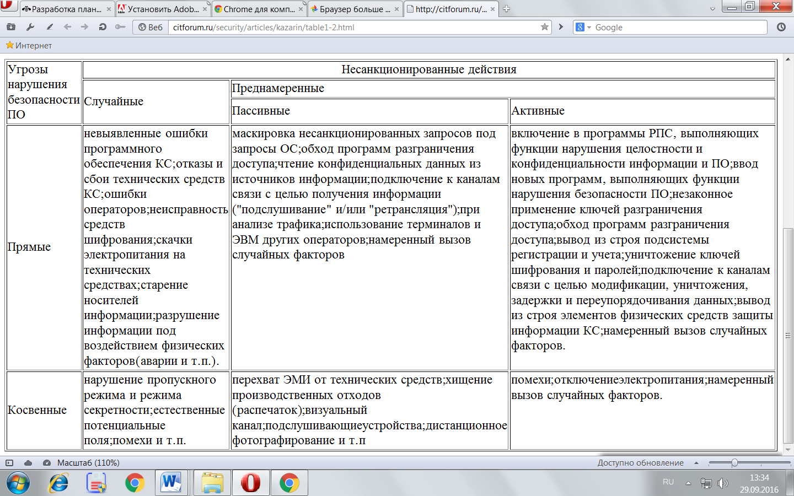

## **Модель угроз и принципы обеспечения безопасности программного обеспечения.**
Использование при создании программного обеспечения КС сложных операционных систем, инструментальных средств разработки ПО импортного производства увеличивают потенциальную возможность внедрения в программы преднамеренных дефектов диверсионного типа. Помимо этого, при создании целевого программного обеспечения всегда необходимо исходить из возможности наличия в коллективе разработчиков программистов - злоумышленников, которые в силу тех или иных причин могут внести в разрабатываемые программы РПС.

Характерным свойством РПС в данном случае является возможность внезапного и незаметного нарушения или полного вывода из строя КС. Функционирование РПС реализуется в рамках модели угроз безопасности ПО, основные элементы которой рассматриваются в следующем разделе.
###### *1.5.1. Подход к созданию модели угроз технологической безопасности ПО*
Один из возможных подходов к созданию модели технологической безопасности ПО АСУ может основываться на обобщенной концепции технологической безопасности компьютерной инфосферы [\[19\]](http://citforum.ru/security/articles/kazarin/4.shtml#19), которая определяет методологический базис, направленный на решение, в том числе, следующих основных задач:

- создания теоретических основ для практического решения проблемы технологической безопасности ПО;
- создания безопасных информационных технологий;
- развертывания системы контроля технологической безопасности компьютерной инфосферы.

Модель угроз технологической безопасности ПО должна представлять собой официально принятый нормативный документ, которым должен руководствоваться заказчики и разработчики программных комплексов.

Модель угроз должна включать:

- полный реестр типов возможных программных закладок;
- описание наиболее технологически уязвимых мест компьютерных систем (с точки зрения важности и наличия условий для скрытого внедрения программных закладок);
- описание мест и технологические карты разработки программных средств, а также критических этапов, при которых наиболее вероятно скрытое внедрение программных закладок;
- реконструкцию замысла структур, имеющих своей целью внедрение в ПО заданного типа (класса, вида) программных закладок диверсионного типа;
- психологический портрет потенциального диверсанта в компьютерных системах

.

В указанной Концепции также оговариваются необходимость содержания в качестве приложения банка данных о выявленных программных закладках и описания связанных с их обнаружением обстоятельств, а также необходимость периодического уточнения и совершенствования модели на основе анализа статистических данных и результатов теоретических исследований.

На базе утвержденной модели угроз технологической безопасности компьютерной инфосферы, как обобщенного, типового документа должна разрабатываться прикладная модель угроз безопасности для каждого конкретного компонента защищаемого комплекса средств автоматизации КС. В основе этой разработки должна лежать схема угроз, типовой вид которой применительно к ПО КС представлен на рис.1.2.

Наполнение модели технологической безопасности ПО должно включать в себя следующие элементы: матрицу чувствительности КС к "вариациям" ПО (то есть к появлению искажений), энтропийный портрет ПО (то есть описание "темных" запутанных участков ПО), реестр камуфлирующих условий для конкретного ПО, справочные данные о разработчиках и реальный (либо реконструированный) замысел злоумышленников по поражению этого ПО. На рис.1.3 приведен пример указанной типовой модели для сложных программных комплексов.

[Рис.1.2. Схема угроз технологической безопасности ПО](http://citforum.ru/security/articles/kazarin/3big.gif)
###### *ПРОЕКТИРОВАНИЕ*
**Проектные решения**

Злоумышленный выбор нерациональных алгоритмов работы Облегчение внесения закладок и затруднение их обнаружения.

Внедрение злоумышленников в коллективы, разрабатывающие наиболее ответственные части ПО.

**Используемые информационные технологии**

Внедрение злоумышленников, в совершенстве знающих "слабые" места и особенности используемых технологий. Внедрение информационных технологий или их элементов, содержащих программные закладки.

Внедрение неоптимальных информационных технологий.

**Используемые аппаратно-технические средства**

Поставка вычислительных средств, содержащих программные, аппаратные или программно-аппаратные закладки.

Поставка вычислительных средств с низкими реальными характеристиками.

Поставка вычислительных средств, имеющих высокий уровень экологической опасности.

Задачи коллективов разработчиков и их персональный состав.

Внедрение злоумышленников в коллективы разработчиков программных и аппаратных средств.

Вербовка сотрудников путем подкупа, шантажа и т.п.

###### *КОДИРОВАНИЕ*
***Архитектура программной системы, взаимодействие ее с внешней средой и взаимодействие подпрограмм программной системы***

Доступ к "чужим" подпрограммам и данным.
Нерациональная организация вычислительного процесса.
Организация динамически формируемых команд или параллельных вычислительных процессов.
Организация переадресации команд, запись злоумышленной информации в используемые программной системой или другими программами ячейки памяти.

***Функции и назначение кодируемой части программной системы, взаимодействие этой части с другими подпрограммами***

Формирование программной закладки, воздействующей на другие части программной системы.
Организация замаскированного спускового механизма программной закладки.
Формирование программной закладки, изменяющей структуру программной системы.

**Технология записи программного обеспечения и исходных данных**

Поставка программного обеспечения и технических средств со встроенными дефектами.

###### *ОТЛАДКА И ИСПЫТАНИЯ*
***Назначение, функционирование, архитектура программной системы***

Встраивание программной закладки как в отдельные подпрограммы, так и в управляющую программу программной системы.
Формирование программной закладки с динамически формируемыми командами.
Организация переадресации отдельных команд программной системы.

***Сведения о процессе испытаний (набор тестовых данных, используемые вычислительные средства, подразделения и лица, проводящие испытания, используемые модели***

Формирование набора тестовых данных, не позволяющих выявить программную закладку.
Поставка вычислительных средств, содержащих программные, аппаратные или программно-аппаратные закладки.
Формирование программной закладки, не обнаруживаемой с помощью используемой модели объекта в силу ее неадекватности описываемому объекту.
Вербовка сотрудников коллектива, проводящих испытания.

###### *КОНТРОЛЬ*
***Используемые процедуры и методы контроля***

Формирование спускового механизма программной закладки, не включающего ее при контроле на безопасность.
Маскировка программной закладки путем внесения в программную систему ложных "непреднамеренных" дефектов.
Формирование программной закладки в ветвях программной системы, не проверяемых при контроле.
Формирование "вирусных" программ, не позволяющих выявить их внедрение в программную систему путем контрольного суммирования.
Поставка программного обеспечения и вычислительной техники, содержащих программные, аппаратные и программно-аппаратные закладки.

###### *ЭКСПЛУАТАЦИЯ*
***Сведения о персональном составе контролирующего подразделения и испытываемых программных системах***

Внедрение злоумышленников в контролирующее подразделение.
Вербовка сотрудников контролирующего подразделения.
Сбор информации о испытываемой программной системе.

***Сведения об обнаруженных при контроле программных закладках***

Разработка новых программных закладок при доработке программной системы.

***Сведения об обнаруженных незлоумышленных дефектах и программных закладках***

***Сведения о доработках программной системы и подразделениях, их осуществляющих***

***Сведения о среде функционирования программной системы и ее изменениях***

***Сведения о функционировании программной системы, доступе к ее загрузочному модулю и исходным данным, алгоритмах проверки сохранности программной системы и данных***

Рис.1.3. Пример типовой модели угроз технологической безопасности информации и ПО
###### *1.5.2. Элементы модели угроз эксплуатационной безопасности ПО*
Анализ угроз эксплуатационной безопасности ПО КС позволяет, разделить их на два типа: случайные и преднамеренные, причем последние подразделяются на активные и пассивные. Активные угрозы направлены на изменение технологически обусловленных алгоритмов, программ функциональных преобразований или информации, над которой эти преобразования осуществляются. Пассивные угрозы ориентированы на нарушение безопасности информационных технологий без реализации таких модификаций.

Вариант общей структуры набора потенциальных угроз безопасности информации и ПО на этапе эксплуатации КС приведен в табл.1.2.

[Таблица 1.2](http://citforum.ru/security/articles/kazarin/table1-2.html)

Рассмотрим основное содержание данной таблицы. Угрозы, носящие случайный характер и связанные с отказами, сбоями аппаратуры, ошибками операторов и т.п. предполагают нарушение заданного собственником информации алгоритма, программы ее обработки или искажение содержания этой информации. Субъективный фактор появления таких угроз обусловлен ограниченной надежностью работы человека и проявляется в виде ошибок (дефектов) в выполнении операций формализации алгоритма функциональных преобразований или описания алгоритма на некотором языке, понятном вычислительной системе.

Угрозы, носящие злоумышленный характер вызваны, как правило, преднамеренным желанием субъекта осуществить несанкционированные изменения с целью нарушения корректного выполнения преобразований, достоверности и целостности данных, которое проявляется в искажениях их содержания или структуры, а также с целью нарушения функционирования технических средств в процессе реализации функциональных преобразований и изменения конструктива вычислительных систем и систем телекоммуникаций.

На основании анализа уязвимых мест и после составления полного перечня угроз для данного конкретного объекта информационной защиты, например, в виде указанной таблицы, необходимо осуществить переход к неформализованному или формализованному описанию модели угроз эксплуатационной безопасности ПО КС. Такая модель, в свою очередь, должна соотноситься (или даже являться составной частью) обобщенной модели обеспечения безопасности информации и ПО объекта защиты.

К неформализованному описанию модели угроз приходится прибегать в том случае, когда структура, состав и функциональная наполненность компьютерных системы управления носят многоуровневый, сложный, распределенный характер, а действия потенциального нарушителя информационных и функциональных ресурсов трудно поддаются формализации. Пример описания модели угроз при исследовании попыток несанкционированных действий в отношении защищаемой КС приведен на рис.1.4.

После окончательного синтеза модели угроз разрабатываются практические рекомендации и методики по ее использованию для конкретного объекта информационной защиты, а также механизмы оценки адекватности модели и реальной информационной ситуации и оценки эффективности ее применения при эксплуатации КС.

Таким образом, разработка моделей угроз безопасности программного обеспечения КС, являясь одним из важных этапов комплексного решения проблемы обеспечения безопасности информационных технологий, на этапе создания КС отличается от разработки таких моделей для этапа их эксплуатации.

[Рис.1.4. Неформализованное описание модели угроз безопасности ПО на этапе исследований попыток несанкционированных действий в отношении информационных ресурсов КС.](http://citforum.ru/security/articles/kazarin/1-4.gif)

Принципиальное различие подходов к синтезу моделей угроз технологической и эксплуатационной безопасности ПО заключается в различных мотивах поведения потенциального нарушителя информационных ресурсов, принципах, методах и средствах воздействия на ПО на различных этапах его жизненного цикла.
###### *1.5.3. Основные принципы обеспечения безопасности ПО*
В качестве объекта обеспечения технологической и эксплуатационной безопасности ПО рассматривается вся совокупность его компонентов в рамках конкретной КС. В качестве доминирующей должна использоваться стратегия сквозного тотального контроля технологического и эксплуатационного этапов жизненного цикла компонентов ПО. Совокупность мероприятий по обеспечению технологической и эксплуатационной безопасности компонентов ПО должна носить конфиденциальный характер. Необходимо обеспечить постоянный, комплексный и действенный контроль за деятельностью разработчиков и пользователей компонентов. Кроме общих принципов, обычно необходимо конкретизировать принципы обеспечения безопасности ПО на каждом этапе его жизненного цикла. Далее приводятся один из вариантов разработки таких принципов.

*Принципы обеспечения технологической безопасности при обосновании, планировании работ и проектном анализе ПО*

Принципы обеспечения безопасности ПО на данном этапе включают принципы:

*Комплексности обеспечения безопасности ПО*, предполагающей рассмотрение проблемы безопасности информационно - вычислительных процессов с учетом всех структур КС, возможных каналов утечки информации и несанкционированного доступа к ней, времени и условий их возникновения, комплексного применения организационных и технических мероприятий.

*Планируемости применения средств безопасности программ*, предполагающей перенос акцента на совместное системное проектирование ПО и средств его безопасности, планирование их использования в предполагаемых условиях эксплуатации.

*Обоснованности средств обеспечения безопасности ПО*, заключающейся в глубоком научно-обоснованном подходе к принятию проектных решений по оценке степени безопасности, прогнозированию угроз безопасности, всесторонней априорной оценке показателей средств защиты.

*Достаточности безопасности программ*, отражающей необходимость поиска наиболее эффективных и надежных мер безопасности при одновременной минимизации их стоимости.

*Гибкости управления защитой программ*, требующей от системы контроля и управления обеспечением информационной безопасности ПО способности к диагностированию, опережающей нейтрализации, оперативному и эффективному устранению возникающих угроз в условиях резких изменений обстановки информационной борьбы.

*Заблаговременности разработки средств обеспечения безопасности и контроля производства ПО*, заключающейся в предупредительном характере мер обеспечения технологической безопасности работ в интересах недопущения снижения эффективности системы безопасности процесса создания ПО.

*Документируемости технологии создания программ*, подразумевающей разработку пакета нормативно-технических документов по контролю программных средств на наличие преднамеренных дефектов.

*Принципы достижения технологической безопасности ПО в процессе его разработки*

Принципы обеспечения безопасности ПО на данном этапе включают принципы:

*Регламентации технологических этапов разработки ПО*, включающей упорядоченные фазы промежуточного контроля, спецификацию программных модулей и стандартизацию функций и формата представления данных.

*Автоматизации средств контроля управляющих и вычислительных программ* на наличие дефектов, создания типовой общей информационной базы алгоритмов, исходных текстов и программных средств, позволяющих выявлять преднамеренные программные дефекты.

*Последовательной многоуровневой фильтрации программных модулей* в процессе их создания с применением функционального дублирования разработок и поэтапного контроля.

*Типизации алгоритмов*, программ и средств информационной безопасности, обеспечивающей информационную, технологическую и программную совместимость, на основе максимальной их унификации по всем компонентам и интерфейсам.

*Централизованного управления базами данных проектов ПО* и администрирование технологии их разработки с жестким разграничением функций, ограничением доступа в соответствии со средствами диагностики, контроля и защиты.

*Блокирования несанкционированного доступа* соисполнителей и абонентов государственных сетей связи, подключенных к стендам для разработки программ.

*Статистического учета и ведения системных журналов* о всех процессах разработки ПО с целью контроля технологической безопасности.

*Использования только сертифицированных и выбранных в качестве единых инструментальных средств разработки программ* для новых технологий обработки информации и перспективных архитектур вычислительных систем.

*Принципы обеспечения технологической безопасности на этапах стендовых и приемо-сдаточных испытаний*

Принципы обеспечения безопасности ПО на данном этапе включают принципы:

*Тестирования ПО* на основе разработки комплексов тестов, параметризуемых на конкретные классы программ с возможностью функционального и статистического контроля в широком диапазоне изменения входных и выходных данных.

*Проведения натурных испытаний программ* при экстремальных нагрузках с имитацией воздействия активных дефектов.

*Осуществления "фильтрации"* программных комплексов с целью выявления возможных преднамеренных дефектов определенного назначения на базе создания моделей угроз и соответствующих сканирующих программных средств.

*Разработки и экспериментальной отработки средств верификации* программных изделий.

*Проведения стендовых испытаний ПО* для определения непреднамеренных программных ошибок проектирования и ошибок разработчика, приводящих к невыполнению целевых функций программ, а также выявление потенциально "узких" мест в программных средствах для разрушительного воздействия.

*Отработки средств защиты от несанкционированного воздействия* нарушителей на ПО.

*Сертификации программных изделий АСУ по требованиям безопасности* с выпуском сертификата соответствия этого изделия требованиям технического задания.

*Принципы обеспечения безопасности при эксплуатации программного обеспечения*

Принципы обеспечения безопасности ПО на данном этапе включают принципы:

*Сохранения и ограничения доступа* к эталонам программных средств, недопущение внесения изменений в них.

*Профилактического выборочного тестирования и полного сканирования* программных средств на наличие преднамеренных дефектов.

*Идентификации ПО* на момент ввода его в эксплуатацию в соответствии с предполагаемыми угрозами безопасности ПО и его контроль.

*Обеспечения модификации программных изделий* во время их эксплуатации путем замены отдельных модулей без изменения общей структуры и связей с другими модулями.

*Строгого учета и каталогизации* всех сопровождаемых программных средств, а также собираемой, обрабатываемой и хранимой информации.

*Статистического анализа информации* обо всех процессах, рабочих операциях, отступлениях от режимов штатного функционирования ПО.

*Гибкого применения дополнительных средств защиты ПО* в случае выявления новых, непрогнозируемых угроз информационной безопасности.

Что же такое **модель угроз безопасности персональных данных**?! Для чего она нужна и как ее разработать?! Ответы на эти вопросы Вы найдете в этой статье. 

В соответствии с [Методическими рекомендациями по обеспечению с помощью криптосредств безопасности персональных данных при их обработке в информационных системах персональных данных с использованием средств автоматизации (от 21 февраля 2008 года)](http://pdsec.ru/upload/docs/metod_fsb.zip): 

**Модель угроз** – это перечень возможных угроз. 

Все просто и ясно. Хотя в ГОСТ Р 50922-2006 – «Защита информации. Основные термины и определения» дано более емкое определение: 

**Модель угроз (безопасности информации)** – физическое, математическое, описательное представление свойств или характеристик угроз безопасности информации. 

Итак, **модель угроз** – это документ, тем или иным способом описывающий возможные угрозы безопасности персональных данных. 

Модель угроз формируется и утверждается оператором в соответствии с методическими документами, разработанными в соответствии с пунктом 2 Постановления Правительства Российской Федерации от 17 ноября 2007 г. N 781 "Об утверждении Положения об обеспечении безопасности персональных данных при их обработке в информационных системах персональных данных" <34>.

Различают модель угроз верхнего уровня и детализированную модель угроз.

Модель угроз верхнего уровня предназначена для определения характеристик безопасности защищаемых персональных данных и других объектов защиты (принципы 2 и 3). Эта модель также определяет исходные данные для детализированной модели угроз.

Детализированная модель угроз предназначена для определения требуемого уровня криптографической защиты.

` `Методология формирования модели угроз верхнего уровня

Формирование модели угроз верхнего уровня осуществляется на этапе сбора и анализа исходных данных по информационной системе в соответствии с установленным Порядком.

Для правильного определения криптосредств, необходимых для обеспечения безопасности персональных данных, дополнительно к данному этапу предъявляются следующие требования.

- Определение условий создания и использования персональных данных

Должны быть описаны условия создания и использования персональных данных. Для этого определяются:

\- субъекты, создающие персональные данные (в качестве такого субъекта может выступать лицо или его представитель в виде программного или технического средства);

\- субъекты, которым персональные данные предназначены;

\- правила доступа к защищаемой информации;

\- информационные технологии, базы данных, технические средства, используемые для создания и обработки персональных данных;

\- используемые в процессе создания и использования персональных данных объекты, которые могут быть объектами угроз, создающими условия для появления угроз персональным данным. Такого рода объектами могут быть, например, технические и программные средства.

Степень детализации описания должна быть достаточной для выполнения остальных требований к этапу сбора и анализа исходных данных по информационной системе.

- Описание форм представления персональных данных

Персональные данные имеют различные формы представления (формы фиксации) с учетом используемых в информационной системе информационных технологий и технических средств.

Необходимо дать описание этих форм представления (форм фиксации) персональных данных. К таким формам относятся области оперативной памяти, файлы, записи баз данных, почтовые отправления и т.д.

- Описание информации, сопутствующей процессам создания и использования персональных данных

На основе анализа условий создания и использования персональных данных должна быть определена информация, сопутствующая процессам создания и использования персональных данных. При этом представляет интерес только та информация, которая может быть объектом угроз и потребует защиты.

К указанной информации, в частности, относится:

\- ключевая, аутентифицирующая и парольная информация криптосредства;

\- криптографически опасная информация (КОИ);

\- конфигурационная информация;

\- управляющая информация;

\- информация в электронных журналах регистрации;

\- побочные сигналы, которые возникают в процессе функционирования технических средств и в которых полностью или частично отражаются персональные данные или другая защищаемая информация;

\- резервные копии файлов с защищаемой информацией, которые могут создаваться в процессе обработки этих файлов;

\- остаточная информация на носителях информации.

В тех случаях, когда модель угроз разрабатывается лицами, не являющимися специалистами в области защиты информации, рекомендуется ограничиться приведенными выше примерами информации, сопутствующей процессам создания и использования персональных данных.

Разработчики модели угроз - специалисты в области защиты информации могут уточнить указанный выше перечень информации, сопутствующей процессам создания и использования персональных данных, с приведением соответствующих обоснований. Рекомендуется указанное уточнение делать только в случае необходимости разработки нового типа криптосредства.

Уточнение перечня информации, сопутствующей процессам создания и использования персональных данных, должно осуществляться путем:

\- исключения типов рассматриваемой информации из указанного выше перечня, которые являются избыточными в силу специфики конкретной информационной системы;

\- конкретизации и детализации не исключенных типов рассматриваемой информации с учетом конкретных условий эксплуатации информационной системы;

\- описания типов рассматриваемой информации, не указанных в приведенном выше перечне.

- Определение характеристик безопасности

Необходимо определить характеристики безопасности не только персональных данных, но и характеристики безопасности всех объектов, которые были определены как возможные объекты угроз.

Основными (классическими) характеристиками безопасности являются конфиденциальность, целостность и доступность.

В дополнение к перечисленным выше основным характеристикам безопасности могут рассматриваться также и другие характеристики безопасности. В частности, к таким характеристикам относятся неотказуемость <35>, учетность <36> (иногда в качестве синонима используется термин "подконтрольность"), аутентичность <37> (иногда в качестве синонима используется термин "достоверность") и адекватность <38>.

\--------------------------------

<35> Неотказуемость - способность доказать, что действие или событие произошло таким образом, что факт действия или события не может быть опровергнут (ИСО 7498-2:99 и ИСО 13888-1:2004).

<36> Учетность

\- свойство, обеспечивающее однозначное отслеживание собственных действий любого логического объекта (ИСО 7498-2:99);

\- обеспечение того, что действия субъекта по отношению к объекту могут быть прослежены уникально по отношению к субъекту.

<37> Аутентичность

\- свойство обеспечения идентичности субъекта или ресурса заявленной идентичности. Аутентичность применяется к таким субъектам как пользователи, процессы, системы и информация (ISO/IEC 13335-1:2004);

\- идентичность объекта тому, что заявлено.

<38> Адекватность - свойство соответствия преднамеренному поведению и результатам (ISO/IEC 13335-1:2004).

Приведенный список характеристик безопасности не является исчерпывающим. Возможность большого числа характеристик безопасности кроется в определении понятия "характеристика безопасности объекта":

"характеристика безопасности объекта - требование к объекту или к условиям его создания и существования, или к информации об объекте и условиях его создания и существования, выполнение которого необходимо для обеспечения защищенности жизненно важных интересов личности, общества или государства".

Как правило, условия создания и существования реальных объектов достаточно сложны и, как следствие, к ним можно предъявить достаточно много самых различных требований.

Так как угроза безопасности объекта - возможное нарушение характеристики безопасности объекта, то перечень всех характеристик безопасности для всех возможных объектов угроз, по сути, определяет модель угроз верхнего уровня.

Например, если в информационной системе требуется обеспечить только защиту от уничтожения, целостность и доступность защищаемой информации (в качестве возможного примера такой информационной системы можно привести информационную систему школьного учителя, содержащую общедоступные персональные данные учащихся), то модель угроз верхнего уровня содержит следующий перечень угроз:

\- угроза уничтожения защищаемой информации;

\- угроза нарушения целостности защищаемой информации;

\- угроза нарушения доступности защищаемой информации.

` `Методология формирования детализированной модели угроз

Согласно приведенному в Законе Российской Федерации "О безопасности" определению понятия "угроза безопасности" необходимо определить совокупность условий и факторов, создающих опасность нарушения характеристик безопасности возможных объектов угроз. Это и есть содержание работ по созданию детализированной модели угроз.

Можно привести примеры, когда целесообразно создание моделей угроз нескольких уровней детализации.

Очевидным примером может служить объект угроз, представляющий сложную территориально распределенную автоматизированную систему, для которой условия функционирования различных составных частей системы могут существенно различаться. При анализе такой системы, как правило, используется принцип декомпозиции сложного объекта. Если же составные части системы также весьма сложны, то их анализ снова потребует использование принципа декомпозиции сложного объекта. В рассматриваемом случае целесообразно создание моделей угроз для каждого объекта, получающегося в процессе декомпозиции.

При определении угроз безопасности объекта следует различать:

\- угрозы, не являющиеся атакой;

\- атаки.

Рекомендуется использовать следующую структуру угроз, не являющихся атаками:

\- угрозы, не связанные с деятельностью человека: стихийные бедствия и природные явления (землетрясения, наводнения, ураганы и т.д.);

\- угрозы социально-политического характера: забастовки, саботаж, локальные конфликты и т.д.;

\- ошибочные действия и (или) нарушения тех или иных требований лицами, санкционировано взаимодействующими с возможными объектами угроз. Если, например, в качестве объекта угроз выступает автоматизированная система в защищенном исполнении (АСЗИ), то к таким действиям и нарушениям, в частности, относятся:

\- непредумышленное искажение или удаление программных компонентов АСЗИ;

\- внедрение и использование неучтенных программ;

\- игнорирование организационных ограничений (установленных правил) при работе с ресурсами АСЗИ, включая средства защиты информации. В частности:

\- нарушение правил хранения информации ограниченного доступа, используемой при эксплуатации средств защиты информации (в частности, ключевой, парольной и аутентифицирующей информации);

\- предоставление посторонним лицам возможности доступа к средствам защиты информации, а также к техническим и программным средствам, способным повлиять на выполнение предъявляемых к средствам защиты информации требований;

\- настройка и конфигурирование средств защиты информации, а также технических и программных средств, способных повлиять на выполнение предъявляемых к средствам защиты информации требований, в нарушение нормативных и технических документов;

\- несообщение о фактах утраты, компрометации ключевой, парольной и аутентифицирующей информации, а также любой другой информации ограниченного доступа;

\- угрозы техногенного характера, основными из которых являются:

\- аварии (отключение электропитания, системы заземления, разрушение инженерных сооружений и т.д.);

\- неисправности, сбои аппаратных средств, нестабильность параметров системы электропитания, заземления и т.д.;

\- помехи и наводки, приводящие к сбоям в работе аппаратных средств.

Следует отметить, что, как правило, защита от угроз, не являющихся атаками, в основном регламентируется инструкциями, разработанными и утвержденными операторами с учетом особенностей эксплуатации информационных систем и действующей нормативной базы.

Как показал мировой и отечественный опыт, атаки являются наиболее опасными угрозами (что обусловлено их тщательной подготовкой, скрытностью проведения, целенаправленным выбором объектов и целей атак).

Атаки готовятся и проводятся нарушителем, причем возможности проведения атак обусловлены возможностями нарушителя. Иными словами, конкретные возможности нарушителя определяют конкретные атаки, которые может провести нарушитель.

Но тогда с учетом определения понятия "модель нарушителя" все возможные атаки определяются моделью нарушителя.

Модель нарушителя тесно связана с моделью угроз и, по сути, является ее частью. Смысловые отношения между ними следующие. В модели угроз содержится максимально полное описание угроз безопасности объекта. Модель нарушителя содержит описание предположения о возможностях нарушителя, которые он может использовать для разработки и проведения атак, а также об ограничениях на эти возможности.

` `Методология формирования модели нарушителя

Согласно последнему из определенных в п. 3.1 Методических рекомендаций принципу (принцип 7) нарушитель может действовать на различных этапах жизненного цикла криптосредства и СФК (под этими этапами в настоящем документе понимаются разработка, производство, хранение, транспортировка, ввод в эксплуатацию, эксплуатация программных и технических средств криптосредств и СФК).

Этапы разработки, производства, хранения, транспортировки, ввода в эксплуатацию технических и программных средств криптосредства и СФК

На этапах разработки, производства, хранения, транспортировки, ввода в эксплуатацию технических и программных средств криптосредства и СФК обработка персональных данных не производится. Поэтому объектами атак могут быть только сами эти средства и документация на них.

В связи с изложенным на указанных этапах возможны следующие атаки:

\- внесение негативных функциональных возможностей в технические и программные компоненты криптосредства и СФК, в том числе с использованием вредоносных программ (компьютерные вирусы, "троянские кони" и т.д.);

\- внесение несанкционированных изменений в документацию на криптосредство и технические и программные компоненты СФК.

Необходимо отметить, что указанные атаки:

\- на этапах разработки, производства и транспортировки технических и программных средств криптосредства и СФК могут проводиться только вне зоны ответственности оператора;

\- на этапе хранения технических и программных средств криптосредства и СФК могут проводиться как в зоне, так и вне зоны ответственности оператора;

\- на этапе ввода в эксплуатацию технических и программных средств криптосредства и СФК могут проводиться в зоне ответственности оператора.

В связи с изложенным операторы должны предусмотреть меры контроля:

\- соответствия технических и программных средств криптосредства и СФК и документациина эти средства, поступающих в зону ответственности оператора, эталонным образцам (например, оператор должен требовать от поставщиков гарантий соответствия технических и программных средств криптосредства и СФК и документации на эти средства, поступающих в зону ответственности оператора, эталонным образцам или механизмы контроля, позволяющие оператору установить самостоятельно такое соответствие);

\- целостности технических и программных средств криптосредства и СФК и документации на эти средства в процессе хранения и ввода в эксплуатацию этих средств (с использованием как механизмов контроля, описанных в документации, например, на криптосредство, так и с использованием организационных и организационно-технических мер, разработанных оператором с учетом требований соответствующих нормативных и методических документов, - см. п. 2.1 Методических рекомендаций).

Этап эксплуатации технических и программных средств криптосредства и СФК

Атака как любое целенаправленное действие характеризуется рядом существенных признаков. К этим существенным признакам на этапе эксплуатации технических и программных средств криптосредства и СФК вполне естественно можно отнести:

\- нарушителя - субъекта атаки;

\- объект атаки;

\- цель атаки;

\- имеющуюся у нарушителя информацию об объекте атаки;

\- имеющиеся у нарушителя средства атаки;

\- канал атаки.

Возможные объекты атак и цели атак определяются на этапе формирования модели угроз верхнего уровня.

При определении объектов атак, в частности, должны быть рассмотрены как возможные объекты атак и при необходимости конкретизированы с учетом используемых в информационной системе информационных технологий и технических средств следующие объекты:

\- документация на криптосредство и на технические и программные компоненты СФК;

\- защищаемые персональные данные;

\- ключевая, аутентифицирующая и парольная информация;

\- криптографически опасная информация (КОИ);

\- криптосредство (программные и аппаратные компоненты криптосредства);

\- технические и программные компоненты СФК;

\- данные, передаваемые по каналам связи;

\- помещения, в которых находятся защищаемые ресурсы информационной системы.

В тех случаях, когда модель угроз разрабатывается лицами, не являющимися специалистами в области защиты информации, рекомендуется ограничиться приведенными выше примерами возможных объектов атак.

Разработчики модели угроз - специалисты в области защиты информации могут уточнить указанный выше перечень возможных объектов атак с приведением соответствующих обоснований. Рекомендуется указанное уточнение делать только в случае необходимости разработки нового типа криптосредства.

Уточнение перечня возможных объектов атак должно осуществляться путем:

исключения объектов атак из указанного выше перечня, которые являются избыточными в силу специфики конкретной информационной системы;

конкретизации и детализации не исключенных объектов атак с учетом конкретных условий эксплуатации информационной системы;

описания объектов атак, не указанных в приведенном выше перечне.

С учетом изложенного модель нарушителя для этапа эксплуатации технических и программных средств криптосредства и СФК должна иметь следующую структуру:

\- описание нарушителей (субъектов атак);

\- предположения об имеющейся у нарушителя информации об объектах атак;

\- предположения об имеющихся у нарушителя средствах атак;

\- описание каналов атак.

Описание нарушителей (субъектов атак)

`    `1) Различают шесть основных типов нарушителей: Н , Н ,..., Н .

`                                                    `1   2       6

`    `Предполагается,  что  нарушители  типа  Н  и Н  могут ставить работы по

`                                             `5    6

созданию  способов  и  средств  атак  в  научно-исследовательских  центрах,

специализирующихся в области разработки и анализа криптосредств и СФК.

`    `Возможности нарушителя типа Н    включают в себя возможности нарушителя

`                                 `i+1

типа Н  (1 <= i <= 5).

`      `i

`    `Если  внешний  нарушитель  обладает  возможностями по созданию способов

подготовки  атак, аналогичными соответствующим возможностям нарушителя типа

Н  (за исключением возможностей, предоставляемых пребыванием в момент атаки

` `i

в  контролируемой  зоне),  то  этот нарушитель также будет обозначаться как

нарушитель типа Н  (2 <= i <= 6).

`                 `i

\2) Данный раздел модели нарушителя должен содержать:

\- перечень лиц, которые не рассматриваются в качестве потенциальных нарушителей, и обоснование этого перечня (при необходимости);

`    `-  предположение  о  невозможности  сговора нарушителей (для всех типов

нарушителей)   или  предположения  о  возможном  сговоре  нарушителей  и  о

характере   сговора,   включая  перечисление  дополнительных  возможностей,

которые  могут использовать находящиеся в сговоре нарушители для подготовки

и проведения атак (для нарушителей типа Н  - Н ).

`                                         `4    6

Примечание.

Данный раздел модели нарушителя имеет следующее типовое содержание.

Сначала все физические лица, имеющие доступ к техническим и программным средствам информационной системы, разделяются на следующие категории:

\- категория I - лица, не имеющие права доступа в контролируемую зону информационной системы;

\- категория II - лица, имеющие право постоянного или разового доступа в контролируемую зону информационной системы.

Далее все потенциальные нарушители подразделяются на:

\- внешних нарушителей, осуществляющих атаки из-за пределов контролируемой зоны информационной системы;

\- внутренних нарушителей, осуществляющих атаки, находясь в пределах контролируемой зоны информационной системы.

Констатируется, что:

\- внешними нарушителями могут быть как лица категории I, так и лица категории II;

\- внутренними нарушителями могут быть только лица категории II.

Дается описание привилегированных пользователей информационной системы (членов группы администраторов), которые назначаются из числа особо доверенных лиц и осуществляют техническое обслуживание технических и программных средств криптосредства и СФК, включая их настройку, конфигурирование и распределение ключевой документации между непривилегированными пользователями.

Далее следует обоснование исключения тех или иных типов лиц категории II из числа потенциальных нарушителей. Как правило, привилегированные пользователи информационной системы исключаются из числа потенциальных нарушителей.

И, наконец, рассматривается вопрос о возможном сговоре нарушителей.

Предположения об имеющейся у нарушителя информации об объектах атак

Данный раздел модели нарушителя должен содержать:

\- предположение о том, что потенциальные нарушители обладают всей информацией, необходимой для подготовки и проведения атак, за исключением информации, доступ к которой со стороны нарушителя исключается системой защиты информации. К такой информации, например, относится парольная, аутентифицирующая и ключевая информация;

\- обоснованные ограничения на степень информированности нарушителя (перечень сведений, в отношении которых предполагается, что они нарушителю недоступны).

Примечание.

Обоснованные ограничения на степень информированности нарушителя могут существенно снизить требования к криптосредству при его разработке.

При определении ограничений на степень информированности нарушителя, в частности, должны быть рассмотрены следующие сведения:

\- содержание технической документации на технические и программные компоненты СФК;

\- долговременные ключи криптосредства;

\- все возможные данные, передаваемые в открытом виде по каналам связи, не защищенным от несанкционированного доступа (НСД) к информации организационно-техническими мерами (фазовые пуски, синхропосылки, незашифрованные адреса, команды управления и т.п.);

\- сведения о линиях связи, по которым передается защищаемая информация;

\- все сети связи, работающие на едином ключе;

\- все проявляющиеся в каналах связи, не защищенных от НСД к информации организационно-техническими мерами, нарушения правил эксплуатации криптосредства и СФК;

\- все проявляющиеся в каналах связи, не защищенных от НСД к информации организационно-техническими мерами, неисправности и сбои технических средств криптосредства и СФК;

\- сведения, получаемые в результате анализа любых сигналов от технических средств криптосредства и СФК, которые может перехватить нарушитель.

`    `Только  нарушителям  типа  Н   - Н  могут быть известны все сети связи,

`                                `3     6

работающие на едином ключе.

`    `Только  нарушители  типа  Н   -  Н   располагают  наряду с доступными в

`                               `5      6

свободной  продаже документацией на криптосредство и СФК исходными текстами

прикладного программного обеспечения.

`    `Только   нарушители   типа   Н    располагают   всей  документацией  на

`                                  `6

криптосредство и СФК.

В тех случаях, когда модель угроз разрабатывается лицами, не являющимися специалистами в области защиты информации, рекомендуется ограничиться приведенным выше предположением о том, что потенциальные нарушители обладают всей информацией, необходимой для подготовки и проведения атак.

Разработчики модели угроз - специалисты в области защиты информации могут подготовить обоснованные ограничения на степень информированности нарушителя. Рекомендуется указанное ограничение делать только в случае необходимости разработки нового типа криптосредства.

Предположения об имеющихся у нарушителя средствах атак

Данный раздел модели нарушителя должен содержать:

\- предположение о том, что нарушитель имеет все необходимые для проведения атак по доступным ему каналам атак средства, возможности которых не превосходят возможности аналогичных средств атак на информацию, содержащую сведения, составляющие государственную тайну;

\- обоснованные ограничения на имеющиеся у нарушителя средства атак.

Примечание.

Обоснованные ограничения на имеющиеся у нарушителя средства атак могут существенно снизить требования к криптосредству при его разработке.

При определении ограничений на имеющиеся у нарушителя средства атак, в частности, должны быть рассмотрены:

\- аппаратные компоненты криптосредства и СФК;

\- доступные в свободной продаже технические средства и программное обеспечение;

\- специально разработанные технические средства и программное обеспечение;

\- штатные средства.

`    `Нарушители  типа  Н   и  Н   располагают  только доступными в свободной

`                       `1      2

продаже аппаратными компонентами криптосредства и СФК.

`    `Дополнительные  возможности  нарушителей  типа  Н   -  Н   по получению

`                                                     `3      5

аппаратных  компонент  криптосредства  и  СФК  зависят  от  реализованных в

информационной системе организационных мер.

`    `Нарушители   типа   Н    располагают  любыми  аппаратными  компонентами

`                         `6

криптосредства и СФК.

`    `Нарушители  типа  Н   могут  использовать штатные средства только в том

`                       `1

случае, если они расположены за пределами контролируемой зоны.

`    `Возможности  нарушителей  типа Н  - Н  по использованию штатных средств

`                                    `2    6

зависят от реализованных в информационной системе организационных мер.

`    `Нарушители  типа  Н   -  Н   могут  проводить лабораторные исследования

`                       `4      6

криптосредств, используемых за пределами контролируемой зоны информационной

системы.

В тех случаях, когда модель угроз разрабатывается лицами, не являющимися специалистами в области защиты информации, рекомендуется ограничиться только приведенными выше средствами атак.

Разработчики модели угроз - специалисты в области защиты информации могут уточнить приведенный выше перечень средств атак. Рекомендуется указанное уточнение делать только в случае необходимости разработки нового типа криптосредства.

Описание каналов атак

С практической точки зрения этот раздел является одним из важнейших в модели нарушителя. Его содержание по существу определяется качеством формирования модели угроз верхнего уровня.

Основными каналами атак являются:

\- каналы связи (как внутри, так и вне контролируемой зоны), не защищенные от НСД к информации организационно-техническими мерами;

\- штатные средства.

Возможными каналами атак, в частности, могут быть:

\- каналы непосредственного доступа к объекту атаки (акустический, визуальный, физический);

\- машинные носители информации;

\- носители информации, выведенные из употребления;

\- технические каналы утечки;

\- сигнальные цепи;

\- цепи электропитания;

\- цепи заземления;

\- канал утечки за счет электронных устройств негласного получения информации;

\- информационные и управляющие интерфейсы СВТ.

В тех случаях, когда модель угроз разрабатывается лицами, не являющимися специалистами в области защиты информации, рекомендуется ограничиться только приведенными выше основными каналами атак.

Разработчики модели угроз - специалисты в области защиты информации могут уточнить приведенный выше перечень каналов атак. Рекомендуется указанное уточнение делать только в случае необходимости разработки нового типа криптосредства.

Определение типа нарушителя

`    `Нарушитель   относится  к  типу  Н   если  среди  предположений  о  его

`                                      `i

возможностях  есть  предположение, относящееся к нарушителям типа Н , и нет

`                                                                   `i

предположений, относящихся только к нарушителям типа Н  (j > i).

`                                                      `j

`    `Нарушитель  относится  к  типу  Н  в информационных системах, в которых

`                                     `6

обрабатываются наиболее важные персональные данные, нарушение характеристик

безопасности которых может привести к особо тяжелым последствиям.

`    `Рекомендуется   при   отнесении   оператором   нарушителя   к  типу  Н

`                                                                          `6

согласовывать модель нарушителя с ФСБ России.

Теперь разберемся что такое **угроза безопасности информации (персональных данных)**. 

В документе [«Базовая модель угроз безопасности персональных данных при их обработке в информационных системах персональных данных»](http://pdsec.ru/upload/docs/baz_model.zip) дано следующее определение: 

**Угрозы безопасности персональных данных** - совокупность условий и факторов, создающих опасность несанкционированного, в том числе случайного, доступа к персональным данным, результатом которого может стать уничтожение, изменение, блокирование, копирование, распространение персональных данных, а также иных несанкционированных действий при их обработке в информационной системе персональных данных. 

Проще говоря, угроза – это «дыра» в системе защиты. 

Угроза может привести к утечке (уничтожению, модификации), а может и нет. Наличие угрозы свидетельствует лишь о наличии возможности несанкционированного доступа к данным. 

**Зачем нужна модель угроз** 

Модель угроз безопасности персональных данных необходима для определения требований к системе защиты. Без модели угроз невозможно построить адекватную (с точки зрения денежных затрат) систему защиты информации, обеспечивающую безопасность персональных данных. 

В систему защиты включаются только те средства защиты информации, которые нейтрализуют актуальные угрозы. 

В соответствии с пунктом 2 статьи 19 [ФЗ «О персональных данных»](http://pdsec.ru/upload/docs/fz152.rtf) обеспечение безопасности персональных данных достигается, в частности определением угроз безопасности персональных данных при их обработке в информационных системах персональных данных, т.е. разработкой модели угроз. 

**Разработка модели угроз безопасности персональных данных** 

Модель угроз (или как ее еще называют "Частная модель угроз") может разрабатываться ответственными за защиту персональных данных в организации. Также могут привлекаться сторонние эксперты. Разработчики модели угроз должны владеть полной информацией об информационной системе персональных данных, знать нормативную базу по защите информации. 

При отсутствии экспертов разработку модели угроз лучше доверить сторонней организации. 

Порядок разработки модели угроз определен в документах ФСТЭК: 
\- [«Базовая модель угроз безопасности персональных данных при их обработке в информационных системах персональных данных», Федеральная служба по техническому и экспортному контролю, 2008 год ](http://pdsec.ru/upload/docs/baz_model.zip)
\- [«Методика определения актуальных угроз безопасности персональных данных при их обработке в информационных системах персональных данных», Федеральная служба по техническому и экспортному контролю, 2008 год. ](http://pdsec.ru/upload/docs/metod_act.zip)

**«Базовая модель»** содержит систематизированный перечень угроз безопасности персональных данных при их обработке в информационных системах персональных данных. Многие эксперты по защите информации весьма скептически относятся к этому документу. Угрозы, приведенные в базовой модели, устарели и далеко не всеобъемлющи. Однако за неимением лучшего приходится довольствоваться текущей редакцией документа. 

Документ **«Методика определения актуальных угроз»** содержит алгоритм оценки угрозы. Путем несложных расчетов определяется статус каждой вероятной угрозы.

Если Вы решили разрабатывать модель угроз самостоятельно, мы рекомендуем Вам воспользоваться нашим [онлайн сервисом для подготовки пакета документов по защите персональных данных](http://pdsec.ru/servic_podgotovki_dokumentov/). Это позволит избежать ошибок и сократить время подготовки документов.

Наш сервис уже содержит все угрозы безопасности из "Базовой модели". Вам достаточно просто проставить их характеристики и общие характеристики Вашей ИСПДн. Алгоритм расчета актуальности угроз полностью автоматизирован. В результате Вы получите **готовый документ в формате RTF**.

