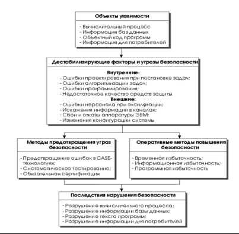
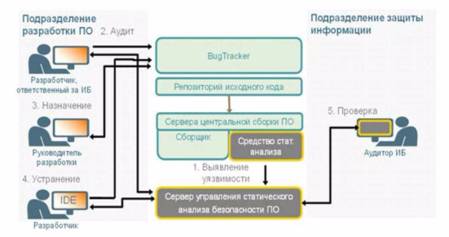

***Практическая работа № 13***

**Проведение анализа безопасности программного обеспечения**

*Цель работы:* приобретение умений проводить анализ безопасности программного обеспечения

*Теоретическое обоснование*

Работа по анализу программы включает в себя три основных этапа.

1. Подготовительный этап.
1. Восстановление алгоритмов функционирования программы.
1. Проверка полученных результатов.

Рис. 2. Модель анализа безопасности информационных систем при отсутствии злоумышленных угроз.

В настоящее время сформировались следующие подходы к восстановлению алгоритмов, реализуемых программой:

- метод экспериментов — программа рассматривается как «черный ящик», осуществляющий определенные преобразования в зависимости от поступающего на него входа. Аналитик проводит многократные эксперименты, манипулируя входными данными, анализируя и сравнивая получаемые результаты. На основе этих экспериментов он восстанавливает, а точнее, угадывает алгоритмы преобразований.
- статический метод — по файлам программного обеспечения восстанавливаются основные элементы исходной программы, которая анализируется с целью получения описания собственно алгоритмов защиты. Основным инструментом статического метода служат программы дизассемблирования, восстанавливающие по исполняемым файлам листинги программы на языке ассемблер. Одним из наиболее удачных дизассемблеров в настоящее время считается пакет IDA.

Процесс использования средства статического анализа безопасности ПО представлен на рис. 3. Примерами систем, которые реализуют метод  статистического анализа, являются HP Fortify и IBM AppScan

Рис.3. Процесс использования средства статического анализа безопасности ПО

- динамический метод — анализируемая программа запускается под контролем других специализированных программных средств. Наличие этих средств позволяет прогонять программу в пошаговом режиме, останавливать ее работу при осуществлении тех или иных событий, что значительно облегчает поиск и анализ фрагментов программы, реализующие преобразования, связанные с защитой информации. В качестве примеров продуктов, можно привести решения Max Patrol (компании Positive Technologies) и Qualis (компании Qualys, Inc.).

Основным инструментом динамического метода являются так называемые программы-отладчики. Вместе с тем могут использоваться и другие программные средства. Перечисленные методы имеют свои достоинства и недостатки и во многом дополняют друг друга. Порой между ними трудно провести четкую грань. Так, при реализации динамического метода нередко проводится «прозванивание» отдельных функций анализируемой программы, как и в методе экспериментов с «черным ящиком». Некоторые методы автоматизации статического метода предполагают эмуляцию выполнения отдельных процедур процессором в режиме интерпретатора в целях идентификации алгоритмов по результатам их реализации. При восстановлении алгоритмов защиты аналитик, как правило, использует все три подхода в комбинации. Какой из подходов играет ведущую роль, определяется спецификой конкретной задачи и предпочтениями аналитика. Многие аналитики отдают предпочтение динамическому методу, считая его наиболее эффективным.

Поиск уязвимостей в ПО может осуществляться:

- в ручном режиме,
- с использованием средств автоматизации.

*Методические указания*

Для выполнения практической работы вам понадобиться доступ в  Интернет. В качестве опорной информации для выполнения задания 3 воспользуйтесь материалами:

- IBM Security AppScan 
- IBM Security AppScan Standard 
- IBM Security AppScan Source 
- Безопасность приложений. Решения по обеспечению безопасности программного обеспечения от HPE Security Fortify 
- IBM Rational AppScan даст хакерам достойный отпор 
- Не совсем известные решения по защите ИТ-инфраструктуры бизнеса 
- Контроль уязвимостей в программных приложениях 

Конспект выполняйте кратко, можно в виде таблиц или схем.

*Задания*

1. Повторите теоретический материал.
1. Изучите материал на сайтах:
- Практические аспекты выявления уязвимостей программного обеспечения — http://dialognauka.ru/press-center/article/10023/

Хорошо известно, что любая информационная атака реализуется злоумышленником на основе той или иной уязвимости, которая присутствует в атакуемой системе. Согласно ГОСТ Р 50922-2006 под уязвимостью понимается свойство информационной системы, обусловливающее возможность реализации угроз безопасности обрабатываемой в ней информации. На сегодняшний день можно выделить различные виды уязвимостей, но в данной статье речь пойдет о тех из них, которые относятся к программному обеспечению.

Ни для кого не секрет, что с каждым годом увеличивается количество уязвимостей, которые обнаруживаются в прикладном программном обеспечении (ПО). При этом растет не только их количество, но и их разновидность. Так, например, по данным компании Hewlett Packard на сегодняшний день можно выделить более 500 классов различных уязвимостей в ПО. Примерами таких уязвимостей являются «переполнение буфера» (buffer overflow), SQL injection, Cross Site Scripting и многие другие.

Крайне важно также отметить, что чем раньше удастся выявить уязвимость в ПО, тем меньше финансовых средств понадобится для её устранения. Данный факт наглядно иллюстрирует таблица, приведенная ниже.

|**№**|**Наименование этапа разработки ПО**|**Стоимость устранения уязвимости**|
| - | - | - |
|1|Разработка технического задания|$ 139|
|2|Проектирование ПО|$ 455|
|3|Разработка ПО (программирование)|$ 977|
|4|Тестирование ПО|$ 7 136|
|5|Техническое сопровождение ПО|$ 14 102|
||||
Стоимость устранения уязвимостей на различных этапах разработки ПО

Поиск уязвимостей в ПО может осуществляться в ручном режиме либо с использованием средств автоматизации. В настоящее время для выявления уязвимостей ПО могут использоваться средства статического или динамического анализа, которые будут более подробно рассмотрены ниже.

**Средства статического анализа**

Статический анализ предполагает поиск потенциально опасных конструкций в исходном коде программного обеспечения. Данный вид анализа потенциально позволяет выявлять технологические уязвимости, которые возникают на этапе разработки ПО вследствие халатности или злого умысла разработчика.

Процесс внедрения средств статического анализа требует вовлечения не только подразделения по защите информации, но и подразделения, которое отвечает за разработку программного обеспечения. Это обусловлено тем, что только разработчики смогут провести анализ результатов сканирования исходного кода и внести в исходный код приложения необходимые корректировки.

Ниже на рисунке показан обобщенный процесс использования средства статического анализа безопасности. В рамках данного процесса средство для статического анализа запускает процесс сканирования исходного кода в момент централизованной сборки всего приложения. Как правило, этот процесс осуществляется в конце рабочего дня. Информация о выявленных в процессе сканирования уязвимостях поступает в сервер управления, к которому имеет доступ представитель отдела разработки, ответственный за обеспечение информационной безопасности ПО. Проанализировав результаты сканирования, он выделяет актуальные уязвимости и создает по ним соответствующие заявки в системе отслеживания ошибок (Bug Tracker). На следующем этапе руководитель всего процесса разработки ПО назначает ответственных разработчиков за устранение выявленных уязвимостей на основе созданных заявок. После этого эти разработчики вносят изменения в исходный код с целью устранения выявленных уязвимостей. Далее этот процесс повторяется на регулярной основе до завершения процесса разработки приложения. При этом с заданной периодичностью представитель подразделения по защите информации осуществляет мониторинг того, что все уязвимости, выявляемые системой статического анализа, успешно устраняются командой разработчиков.

Процесс использования средства статического анализа безопасности ПО

Примерами систем, которые реализуют данный метод анализа, являются HP Fortify и IBM AppScan. Данные решения позволяют полностью автоматизировать процесс анализа исходного кода, интегрируются во все наиболее распространенные среды разработки ПО, а также позволяют идентифицировать конкретные участки кода, содержащие уязвимость, и предложить рекомендации по её устранению. В качестве рекомендаций приводятся примеры фрагментов исходного кода, в котором показано, как исправить ту или иную уязвимость. Как правило, решения подобного класса поддерживают возможность анализа исходного кода, написанного на различных языках программирования. Так, например, решение HP Fortify поддерживает более 20-ти различных видов языков программирования, начиная от COBOL, заканчивая C#.

**Средства динамического анализа**

Динамический анализ предполагает проведение тестирования уже скомпилированного ПО и функционирующего в определенной среде. Для решения данной задачи, в частности, могут использоваться специализированные сканеры безопасности, которые моделируют возможные атаки злоумышленников, а также анализируют конфигурационные файлы ПО. Динамический анализ позволяет выявлять не только технологические, но и эксплуатационные уязвимости, связанные с неправильной настройкой ПО. К таким уязвимостям можно отнести: использование слабых и нестойких к угадыванию паролей доступа, наличие неиспользуемых учетных записей, неправильно настроенные функции безопасности ПО и др. В качестве примеров продуктов, реализующих функционал динамического анализа, можно привести решения Max Patrol (компании Positive Technologies) и Qualis (компании Qualys, Inc.).

Еще одной разновидностью динамического анализа является фаззинг (от английского термина fuzzing). Фаззинг представляет собой процесс передачи на вход программе намеренно некорректных данных с целью вызова ситуации сбоя или ошибки. Таким образом, эта технология позволяет обнаруживать уязвимости в анализируемом приложении.

Использование средств динамического анализа не требует наличия исходного кода ПО, а также вовлечения разработчиков для проведения анализа безопасности приложения.

**Комплексный подход**

Для обеспечения максимально эффективной оценки уровня безопасности ПО необходимо использование средств как статического, так и динамического анализа, поскольку они позволяют дополнить друг друга. Так, статический анализ позволяет обнаружить до 80% имеющихся уязвимостей, которые можно идентифицировать на основе исходного кода. В то же время динамический анализ позволяет дополнительно выявить оставшиеся 20% уязвимостей, которые связаны с настройкой ПО и тем окружением, в котором оно работает. Необходимо также отметить, что данные решения по анализу безопасности ПО могут использоваться как в виде специализированных продуктов, установленных в ЛВС компании, так и в виде облачных сервисов.

При этом анализ безопасности ПО, безусловно, должен стать частью комплексного подхода к обеспечению информационной безопасности компании в целом. Требования о необходимости проведения такого рода анализа уже прописаны в ряде стандартов по защите информации, в частности в PCI DSS и СТО БР ИББС. Это означает, что помимо использования инструментальных средств статического или динамического анализа необходимо также наличие документированных процедур, которые описывают процессы, связанные с разработкой безопасного ПО. За основу таких процедур можно взять рекомендации ведущих компаний-разработчиков ПО, таких как Microsoft или EMC, которые внедрили у себя и создали специальные рекомендации по организации процесса разработки безопасного ПО – SDL (Security Development Lifecycle). Эти рекомендации в том числе включают в себя процедуры повышения осведомленности разработчиков о проблемах, связанных с созданием небезопасного кода. Конечным результатом внедрения всех этих процедур должно являться повышение качества разрабатываемого кода, в том числе и с точки зрения информационной безопасности.

**Заключение**

На сегодняшний день более 80% атак злоумышленников базируются на использовании уязвимостей в прикладном ПО. Своевременное выявление и устранение этих уязвимостей позволит предотвратить возможные атаки нарушителей. Для эффективного решения данной задачи рекомендуется использовать современные инструментальные средства анализа безопасности ПО, которые могут значительно автоматизировать процесс поиска и устранения слабых мест в ПО организации.

- Методы обеспечения технологической безопасности информационных систем <http://unix1.jinr.ru/faq_guide/sec/jet/prgtech/article1.6-7.1997153.html>

**Непредумышленные дестабилизирующие факторы, влияющие на безопасность функционирования программных средств и баз данных** 

При любом виде деятельности людям свойственно непредумышленно ошибаться, результаты чего проявляются в процессе создания или применения изделий или систем. В общем случае под ошибкой подразумевается дефект, погрешность или неумышленное искажение объекта или процесса. При этом предполагается, что известно правильное, эталонное состояние объекта, по отношению к которому может быть определено наличие отклонения — ошибки. При любых фиксированных исходных данных программы исполняются по определенным маршрутам и выдают совершенно определенные результаты, однако многочисленные варианты исполнения программ при разнообразных исходных данных представляются для внешнего наблюдателя как случайные. В связи с этим дефекты функционирования информационных систем, не имеющие злоумышленных источников, проявляются внешне как случайные, имеют разную природу и последствия. В частности, они могут приводить к катастрофическим последствиям, соответствующим нарушению безопасности использования ИС. 

**Рисунок 1. Модель анализа безопасности информационных систем при отсутствии злоумышленных угроз.** 

Последующий анализ безопасности ИС при отсутствии злоумышленных дестабилизирующих факторов базируется на модели взаимодействия основных компонент, представленных на Рис. 1 . В качестве объектов уязвимости рассматриваются:

- динамический вычислительный процесс обработки данных, автоматизированной подготовки решений и выработки управляющих воздействий; 
- информация, накопленная в базах данных; 
- объектный код программ, исполняемых вычислительными средствами в процессе функционирования ИС; 
- информация, выдаваемая потребителям и на исполнительные механизмы.

На эти объекты воздействуют различные непредумышленные дестабилизирующие факторы, которые можно разделить на внутренние, присущие самим объектам уязвимости, и внешние, обусловленные средой, в которой эти объекты функционируют. Внутренними источниками угроз безопасности функционирования сложных ИС являются:

- системные ошибки при постановке целей и задач проектирования ИС, формулировке требований к функциям и характеристикам решения задач, определении условий и параметров внешней среды, в которой предстоит применять ИС; 
- алгоритмическая ошибки проектирования при непосредственной алгоритмизации функций программных средств и баз данных, при определении структуры и взаимодействия компонент комплексов программ, а также при использовании информации баз данных; 
- ошибки программирования в текстах программ и описаниях данных, а также в исходной и результирующей документации на компоненты ИС; 
- недостаточная эффективность используемых методов и средств оперативной защиты программ и данных и обеспечения безопасности функционирования ИС в условиях случайных негативных воздействий.

Внешними дестабилизирующими факторами, создающими угрозы безопасности функционирования перечисленных объектов уязвимости ИС являются:

- ошибки оперативного и обслуживающего персонала в процессе эксплуатации ИС; 
- искажения в каналах телекоммуникации информации, поступающей от внешних источников и передаваемой потребителям, а также недопустимые изменения характеристик потоков информации; 
- сбои и отказы аппаратуры; 
- изменения состава и конфигурации ИС за пределы, проверенные при испытаниях или сертификации.

Полное устранение перечисленных угроз принципиально невозможно. Задача состоит в выявлении факторов, от которых они зависят, в создании методов и средств уменьшения их влияния на безопасность ИС, а также в эффективном распределении ресурсов для обеспечения защиты, равнопрочной по отношению ко всем негативным воздействиям. 

Современные достижения микроэлектроники значительно снизили влияние сбоев и отказов вычислительных средств на безопасность ИС. Однако ошибки персонала, искажения данных в каналах телекоммуникации, а также случайные (при отказах части аппаратуры) и необходимые изменения конфигурации вычислительных средств остаются существенными угрозами безопасности ИС. Негативное влияние этих факторов может быть значительно снижено соответствующими методами и средствами защиты в программах и данных. 

Поскольку внешние дестабилизирующие факторы рассматриваются во многих публикациях . мы уделим основное внимание внутренним дестабилизирующим факторам, различного рода ошибкам проектирования и эксплуатации, которые при отсутствии злоумышленных воздействий оказывают наибольшее влияние на безопасность функционирования ИС. 

Различия между ожидаемыми и полученными результатами функционирования программ и баз данных могут быть следствием ошибок не только в созданных программах и данных, но и системных ошибок в первичных требованиях спецификаций, явившихся основой при создании ИС. Тем самым проявляется объективная реальность, заключающаяся в невозможности абсолютной корректности и полноты исходных спецификаций сложных критических ИС. На практике в процессе разработки ПС и БД исходные требования уточняются и детализируются по согласованию между заказчиком и разработчиком. Базой таких уточнений являются неформализованные представления и знания специалистов, а также результаты промежуточных этапов проектирования. Однако установить ошибочность исходных эталонов еще труднее, чем обнаружить ошибки в созданных программах и данных, так как принципиально отсутствуют формализованные данные, которые можно использовать как эталонные, и их заменяют неформализуемые представления заказчиков и разработчиков. 

В результате важной особенностью процесса выявления ошибок в программах и данных сложных, критических ИС является отсутствие полностью определенного эталона, которому должны соответствовать текст и результаты функционирования разработанной программы  . Поэтому установить наличие и локализовать ошибку непосредственным сравнением с программой или данными без дефектов в большинстве случаев невозможно. При отладке и тестировании обычно сначала обнаруживаются вторичные ошибки, то есть последствия и результаты проявления некоторых дефектов, которые следует квалифицировать как первичные ошибки или причины обнаруженных аномалий. Локализация и корректировка таких первичных ошибок приводит к устранению ошибок, первоначально обнаруживаемых в результатах функционирования программ. 

Проявления ошибок в разной степени влияют на работоспособность программ и их нельзя целиком квалифицировать как отказы. В худшем случае вторичная ошибка проявляется как полный отказ — потеря работоспособности ПС и БД на длительное время, угрожающая безопасности. Значительное искажение программ, данных или вычислительного процесса может вызвать также отказовую ситуацию, которая или превращается в отказ, или может быть быстро, автоматизированно исправлена так, что нормальное функционирование программ почти не нарушится. Кроме того, первичные ошибки могут вызывать обнаруживаемые искажения выходных данных, не влияющие на работоспособность и безопасность ИС. 

Характеристики и конкретные реализации первичных ошибок не позволяют однозначно предсказать проявления вторичных ошибок и их влияние на надежность и безопасность ИС. Только в общем виде можно утверждать, что обобщенные показатели надежности и безопасности коррелированы с количеством невыявленных первичных ошибок. На практике простейшие, элементарные ошибки программ и данных могут приводить к катастрофическим последствиям при функционировании ИС. В то же время, крупные системные дефекты могут только несколько ухудшать эксплуатационные характеристики и не отражаться на безопасности ИС. 

Изучение характеристик первичных и вторичных ошибок, а также их взаимосвязи важно для выработки стратегий проектирования безопасных ИС. Статистика ошибок в комплексах программ и их характеристики могут служить ориентирами для разработчиков при распределении усилий на отладку и предохранять их от излишнего оптимизма при оценке достигнутого качества и безопасности собственных изделий. Кроме того, эти характеристики в процессе проектирования программ и баз данных помогают:

- оценивать реальное состояние проекта и планировать трудоемкость и длительность его завершения; 
- выбирать методы и средства автоматизации тестирования программ, адекватные текущему состоянию разработки ПС и наиболее эффективные для устранения определенных видов ошибок; 
- прогнозировать эффективность средств оперативной защиты от невыявленных первичных ошибок; 
- оценивать требующиеся дополнительные ресурсы ЭВМ с учетом затрат на устранение ошибок.

Детальный анализ проявления ошибок показывает их глубокую связь с методами системного проектирования и структурного построения программ, типом языка программирования, уровнем автоматизации технологии разработки и многими другими факторами. Точное определение полного числа невыявленных ошибок в комплексе программ прямыми методами измерения невозможно, однако имеются косвенные пути для приближенной статистической оценки их полного числа или вероятности ошибки в каждой команде программы. Такие оценки базируются на построении математических моделей в предположении о сильной корреляции между общим количеством и интенсивностью проявления ошибок в некотором комплексе программ после его тестирования и испытаний в течение заданного времени. 

Путем анализа и обобщения ряда экспериментальных данных реальных разработок предложено несколько математических моделей, описывающих основные закономерности изменения суммарного количества вторичных ошибок в программах. Эти модели предназначены для оценки:

- надежности и безопасности функционирования программ в процессе испытаний и эксплуатации; 
- числа ошибок, оставшихся невыявленными в анализируемых программах; 
- времени, требующегося для обнаружения следующей ошибки в программе; 
- времени, необходимого для выявления всех ошибок с заданной вероятностью.

Убывание числа ошибок в ИС и интенсивности их обнаружения в процессе разработки не беспредельно. После отладки в течение некоторого времени интенсивность обнаружения ошибок при самых жестких условиях тестирования снижается настолько, что коллектив, ведущий разработку, попадает в зону нечувствительности к ошибкам и отказам. При такой низкой интенсивности отказов трудно прогнозировать затраты времени, необходимые для обнаружения очередной ошибки. Создается представление о полном отсутствии ошибок, о невозможности и бесцельности их поиска, вследствие чего усилия на отладку сокращаются и интенсивность обнаружения ошибок еще больше снижается. Этой предельной интенсивности обнаружения отказов соответствует наработка на обнаруженную ошибку, при которой прекращается улучшение характеристик ПС на этапах отладки или испытаний. 

При серийном выпуске ИС, благодаря значительному расширению вариантов исходных данных и условий эксплуатации, возможно в течение некоторого времени возрастание суммарной (по всем экземплярам системы) интенсивности обнаружения ошибок. Это позволяет дополнительно устранить ряд дефектов и увеличить длительность между проявлениями ошибок в процессе эксплуатации. Для оценки этих показателей качества необходимы объективные данные динамики выявления ошибок, а также усилий, затрачиваемых на их обнаружение и устранение с учетом объема, тиража и других параметров разрабатываемой системы. 

**Методы снижения угроз безопасности ИС, вызванных дефектами программных средств и баз данных** 

Уровень и влияние внутренних дестабилизирующих факторов, а также некоторых внешних угроз на безопасность применения ИС определяется в наибольшей степени качеством технологий проектирования, разработки, сопровождения и документирования ИС и их основных компонент — программных средств и баз данных. При ограниченных ресурсах на разработку ПС и БД для достижения заданных требований по безопасности необходимо управление обеспечением качества в течение всего цикла создания программ и данных. Такое управление предполагает высокую дисциплину и проектировочную культуру всего коллектива специалистов, поддержанную методиками, типовыми документами и средствами автоматизации разработки. Кроме того, управление обеспечением качества ПС и БД предполагает формализацию и сертификацию технологии разработки, а также выделение в специальный процесс поэтапное измерение и анализ текущего качества создаваемых и применяемых компонент. Попытки создания критических, распределенных ИС без использования эффективных технологий и средств автоматизации проектирования ПС и БД связаны с высоким риском провала вследствие трудностей обеспечения заданной безопасности функционирования таких систем. 

В современных автоматизированных технологиях создания и развития ПС и БД с позиции обеспечения их потенциальной технологической безопасности можно выделить методы и средства, позволяющие:

- предотвращать дефекты проектирования за счет эффективных технологий обеспечения всего жизненного цикла комплексов программ и данных; 
- обнаруживать и устранять ошибки проектирования путем систематического тестирования на всех этапах жизненного цикла ПС и БД; 
- удостоверять достигнутые качество и безопасность применения ПС и БД в процессе их сертификации перед передачей в эксплуатацию.

Комплексное, скоординированное применение таких методов и средств в процессе создания и развития ПС и БД позволяет исключить некоторые виды угроз или значительно ослабить их влияние. Тем самым уровень достигаемой безопасности ИС становится предсказуемым и управляемым, непосредственно зависящим от ресурсов, выделяемых на его достижение, а, главное, от качества и эффективности технологии, используемой на всех этапах жизненного цикла ИС. 

При создании критических ИС высокой сложности важная проблема состоит в правильном системотехническом и информационно-технологическом проекте, обеспечивающем высокие потребительские свойства и безопасность ИС. Одновременно в силу высокого качества проработки и документирования проекта создается основа для снижения трудоемкости отладки, испытаний и особенно сопровождения и развития прикладной ИС. Совместное применение современных CASE-технологий и языков четвертого поколения способно снизить трудоемкость разработки сложных программных средств до 10 раз и сократить длительность их проектирования с 2-3 лет до нескольких месяцев. 

Базовым принципом современных методов и технологий создания прикладных программных средств и баз данных является многократное использование отработанных технических решений на различных аппаратных и операционных платформах. В настоящее время по некоторым оценкам только 10-15% прикладных программ создается вновь, в то время как основная часть программных средств переносится с других платформ, комплексируется и собирается из готовых, испытанных, повторно используемых компонент гарантированного качества. Это обеспечивает многократное повышение производительности труда разработчиков информационных систем, сокращение сроков их создания, высокое качество и безопасность проектов. 

Предотвращению дефектов в сложных, распределенных ИС способствует развитие и применение концепции и стандартов открытых систем. При этом следует учитывать, что их использование сопряжено с некоторыми противоречивыми тенденциями в номенклатуре и величинах угроз, отражающихся на технологической безопасности ПС и БД. Массовый перенос программ и данных на различные аппаратные и операционные платформы способствует распространению дефектов и невыявленных ошибок, остающихся в переносимых компонентах. Однако переносимые компоненты, как правило, тщательнее тестируются и испытываются и тем самым имеют более высокое качество, чем те, которые созданы без ориентации на переносимость. Стандартизация и глубокий формализованный контроль интерфейсов и протоколов взаимодействия компонент ИС позволяют создавать сложные, распределенные ИС высокой надежности и безопасности. Строгое соблюдение и контроль соответствия стандартам открытых систем (зачастую автоматически осуществляемые CASE-средствами) является высокоэффективным методом предотвращения ряда классов ошибок и повышения технологической безопасности ИС. 

Тестирование является основным методом измерения качества и определения реальной безопасности применения программ и информации баз данных на любых этапах разработки. Результаты тестирования и измерения показателей качества сравниваются с требованиями технического задания или спецификаций для определения степени соответствия предъявлявшимся требованиям, полученным разработчиком от заказчика. Наличие таких достаточно полных эталонов, как совокупность требований технического задания и поэтапная их декомпозиция в спецификациях, является необходимой базой тестирования при промежуточных и завершающих испытаниях. 

Непосредственной целью тестирования является обнаружение, локализация и устранение ошибок в программах и данных. Важной особенностью тестирования сложных критических ИС является необходимость достаточно полной их проверки при ограниченной длительности испытаний. Это определяет целесообразность тщательного планирования тестирования с учетом всех результатов, полученных на предыдущих этапах разработки. При планировании основная задача состоит в достижении максимальной достоверности испытаний, определении качества и безопасности ИС при ограниченных затратах ресурсов всех видов на проведение тестирования . 

За ограниченный, относительно короткий период испытаний трудно провести достаточно обширное тестирование, достоверно демонстрирующее достигнутые показатели качества и безопасности, и гарантировать выполнение всех технических требований к сложной ИС. Поэтому для обеспечения высокого качества целесообразно проводить испытания не только завершенной ИС, но на ряде промежуточных этапов разработки проверять состояние и характеристики компонент проекта. Для этого до начала разработки в процессе формирования технического задания формулируются план и основные положения методики обеспечения качества, поэтапных испытаний компонент и определения характеристик, допустимых для продолжения разработки на следующем этапе. Одновременно происходит поэтапное уточнение технического задания и методики испытаний ИС. 

Из-за высокой сложности критических ИС систематическому тестированию их программ и баз данных приходится уделять зачастую столько же времени и сил, сколько непосредственной разработке. Недооценка необходимости планомерного тестирования в процессе разработки проекта приводит к резкому возрастанию затрат на выявление и исправление ошибок в процессе эксплуатации, а также к снижению безопасности использования таких ИС. Систематическое, скоординированное тестирование реализации функций ИС во всем доступном разнообразии возможных ситуаций и условий внешней среды способствует обнаружению внутренних дефектов, угрожающих катастрофическими последствиями для безопасности ИС. 

К сожалению, планомерному, систематическому тестированию и методам создания генераторов тестов нигде не учат, что отрицательно сказывается на качестве и безопасности отечественных ИС. Низкая культура и технология сопровождения ПС и БД, отсутствие систематического взаимодействия с многочисленными пользователями и учета их требований определяют бесперспективность и неконкурентоспособность многих проектов сложных критических ИС. 

Для удостоверения качества и безопасности применения сложных критических ИС используемые в них ПС и БД следует подвергать обязательной сертификации. Однако сертификация удостоверяет качество и безопасность применения ИС только в условиях, ограниченных конкретными стандартами и нормативно-техническими документами, с некоторой конечной вероятностью. В реальных условиях эксплуатации принципиально возможны отклонения характеристик внешней среды функционирования ИС за пределы, ограниченные сертификатом, и ситуации, не проверенные при сертификационных испытаниях. Эти обстоятельства способны вызывать последствия, угрожающие безопасности функционирования ИС. Наличие сертификата у ПС и БД для критических систем является необходимым условием их допуска к эксплуатации, однако любой сертификат на сложные системы не может гарантировать абсолютную безопасность их применения и всегда остается некоторый риск возникновения катастрофических ситуаций. 

**Оперативные методы повышения безопасности функционирования программных средств и баз данных** 

Невозможность обеспечить в процессе создания ИС ее абсолютную защищенность даже при отсутствии злоумышленных воздействий заставляет искать дополнительные методы и средства повышения безопасности функционирования ПС и БД на этапе эксплуатации. Для этого разрабатываются и применяются методы оперативного обнаружения дефектов при исполнении программ и искажений данных путем введения в них временной, информационной и программной избыточности. Эти же виды избыточности используются для оперативного восстановления искаженных программ и данных и предотвращения возможности развития угроз до уровня, нарушающего безопасность функционирования ИС. 

Для обеспечения высокой надежности и безопасности функционирования ПС и БД необходимы вычислительные ресурсы для максимально быстрого обнаружения проявления дефектов, возможно точной классификации типа уже имеющихся и вероятных последствий искажений, а также для автоматизированных мероприятий, обеспечивающих быстрое восстановление нормального функционирования ИС. Неизбежность ошибок в сложных ИС, искажений исходных данных и других аномалий приводит к необходимости регулярной проверки состояния и процесса исполнения программ, а также сохранности данных. В процессе проектирования требуется разрабатывать надежные и безопасные программы и базы данных, устойчивые к различным возмущениям и способные сохранять достаточное качество результатов во всех реальных условиях функционирования. В любых ситуациях прежде всего должны исключаться катастрофические последствия дефектов и длительные отказы или в максимальной степени смягчаться их влияние на результаты, выдаваемые пользователю. 

Временная избыточность состоит в использовании некоторой части производительности ЭВМ для контроля исполнения программ и восстановления (рестарта) вычислительного процесса. Для этого при проектировании ИС должен предусматриваться запас производительности, который будет затем использоваться на контроль и повышение надежности и безопасности функционирования. Величина временной избыточности зависит от требований к безопасности функционирования критических систем управления или обработки информации и находится в пределах от 5-10% производительности до трех-четырехкратного дублирования в мажоритарных вычислительных комплексах. 

Информационная избыточность состоит в дублировании накопленных исходных и промежуточных данных, обрабатываемых программами. Избыточность используется для сохранения достоверности данных, которые в наибольшей степени влияют на нормальное функционирование ИС и требуют значительного времени для восстановления. Такие данные обычно характеризуют некоторые интегральные сведения о внешнем управляемом процессе и в случае их разрушения может прерваться процесс управления внешними объектами или обработки их информации, отражающийся на безопасности ИС. 

Программная избыточность используется для контроля и обеспечения достоверности наиболее важных решений по управлению и обработке информации. Она заключается в сопоставлении результатов обработки одинаковых исходных данных разными программами и исключении искажения результатов, обусловленных различными аномалиями. Программная избыточность необходима также для реализации средств автоматического контроля и восстановления данных с использованием информационной избыточности и для функционирования всех средств защиты, использующих временную избыточность. 

**Рисунок 2. Организация оперативного контроля и обеспечения безопасности вычислительного процесса.** 

Последовательный характер исполнения программ процессором ЭВМ приводит к тому, что средства оперативного программного контроля включаются после исполнения прикладных и сервисных программ ( Рис. 2 ). Поэтому средства программного контроля обычно не могут обнаруживать возникновение искажения вычислительного процесса или данных (первичную ошибку) и фиксируют, как правило, только последствия первичного искажения (вторичную ошибку). Результаты первичного искажения в ряде случаев могут развиваться во времени и принимать катастрофический характер отказа при увеличении запаздывания в обнаружении последствий первичной ошибки. 

Факт наличия искажения желательно обнаруживать при минимальных затратах ресурсов ЭВМ и с минимальным запаздыванием. Это приводит к использованию иерархических схем контроля, при которых несколько методов применяются последовательно в порядке углубления контроля и увеличения затрат до достоверного выявления искажения. Программы анализа проявлений дефектов и восстановления вычислительного процесса, программ и данных подготавливают и реализуют необходимые процедуры по ликвидации последствий обнаруженных дефектов. При этом целесообразно концентрировать ресурсы на потенциально наиболее опасных дефектах и достаточно частых режимах восстановления:

- при искажениях программ и данных в памяти ЭВМ; 
- при перегрузках по производительности.

В зависимости от степени проявления и причин обнаружения искажений возможны следующие оперативные меры для ликвидации их последствий, восстановления информации и сохранения безопасности процессов обработки данных и управления (см. Рис. 2 ):

- игнорирование обнаруженного искажения вследствие слабого влияния на весь процесс функционирования и выходные результаты; 
- исключение сообщения из обработки вследствие его искажения или трудности предстоящего восстановления вычислительного процесса; 
- повторение функциональной группы программ при тех же исходных данных или восстановление данных в процессе последующей обработки; 
- кратковременное прекращение решения задач данной группы прикладных программ до обновления исходных данных; 
- перестройка режима работы или структуры ИС для снижения влияния перегрузки или в связи с потерей информации о ходе процесса обработки данных и управления; 
- переход на резервную ЭВМ с накопленной информацией о ходе процесса управления или восстановление информации за счет ее дублирования; 
- восстановление процесса управления или обработки информации с режима начального пуска всей ИС с оперативным вмешательством обслуживающего персонала.

Последний метод не всегда гарантирует целостность, непрерывность и полную безопасность процесса взаимодействия ЭВМ с объектами внешней среды, а при остальных типах оперативной реакции на выявленные дефекты обязательно проявляются более или менее длительные отклонения от нормального хода процесса обработки информации. 

Выбор метода оперативного восстановления происходит в условиях значительной неопределенности сведений о характере предотказовой ситуации и степени ее возможного влияния на работоспособность и безопасность ИС. Восстановление работоспособности желательно производить настолько быстро, чтобы отказовую ситуацию можно было свести до уровня сбоя. Оперативная индикация отклонений от нормы при функционировании ИС позволяет пользователям контролировать аномалии в процессе обработки данных и в особых случаях оперативно корректировать реакцию системы защиты на выявление искажений. 

Наряду с оперативной реакцией на искажения в ИС должно вестись накопление информации о всех проявлениях дефектов с тем, чтобы использовать эти данные для локализации первичного источника ошибок и исправления соответствующих программ, данных или компонент аппаратуры. Подготовку, статистическую обработку и накопление данных по проявлениям искажений целесообразно проводить автоматически с выдачей периодически или по запросу сводных данных на индикацию для подготовки специалистами решений о корректировке программ или восстановлении аппаратуры. 

Таким образом, введение избыточности в программы и данные способствует повышению качества функционирования ИС. Особенно большое влияние избыточность может оказывать на надежность и безопасность решения задач в критических системах реального времени. При этом возможно снижение затрат на отладку и частичное обеспечение необходимой надежности и безопасности ИС за счет средств повышения помехоустойчивости, оперативного контроля и восстановления функционирования программ и данных. Средства оперативной защиты вычислительного процесса, программ и данных, в свою очередь, являются сложными системами и не застрахованы от ошибок, способных привести к нарушению безопасности функционирования ИС. Поэтому необходим комплексный анализ, распределение ресурсов и видов избыточности для максимизации безопасности применения критических ИС. 

**Особенности обеспечения технологической безопасности импортных программных средств и баз данных** 

При использовании зарубежных ПС и БД, в принципе, возможны как злоумышленные, так и случайные, непредумышленные искажения вычислительного процесса, программ и данных, отражающиеся на безопасности их применения . Злоумышленные вирусы и "закладки", хотя и маловероятные в серийных, широко тиражируемых в мире ПС и БД, тем не менее требуют особых методов и средств целенаправленного их обнаружения и устранения, которые в данной работе не рассматриваются. Внимание акцентируется на случайных воздействиях на программы и данные и методах снижения их влияния на безопасность ИС. 

Зарубежным специалистам так же свойственно ошибаться, как и отечественным, однако более высокое качество используемых технологий разработки и современная проектировочная культура позволяют значительно снижать уровень дефектов в изделиях, поступающих на рынок и в эксплуатацию. Тем не менее, любые сложные импортные ПС и БД всегда не гарантированы от полного, абсолютного отсутствия случайных ошибок, которые остаются важнейшими дестабилизирующими факторами. Их применение в критических отечественных ИС требует соответствующего дополнительного контроля качества и специальных работ по повышению безопасности эксплуатации. 

Комплексирование готовых прикладных ПС и БД в конкретной ИС создает условия функционирования, не всегда адекватные предусмотренным разработчиками и проверенным при испытаниях, хотя и не выходящие за пределы требований документации. Это способствует проявлению ранее скрытых ошибок проектирования и необходимости их устранения. Для этого ответственные и квалифицированные поставщики зарубежных ПС и БД имеют службы сопровождения, регистрации и накопления претензий пользователей и быстрого реагирования для устранения реальных аномалий функционирования. Легальная закупка и использование лицензионно чистых ПС и БД, обеспеченных сопровождением солидной фирмы-поставщика, позволяет в значительной степени снижать влияние на безопасность ИС дефектов, не предотвращенных в процессе проектирования. 

Систематическое тестирование импортных ПС и БД в процессе проектирования производится самими разработчиками. Однако в ряде случаев при разработке критических ИС целесообразно создание или закупка комплектов и генераторов тестов для тестирования конкретных ПС и БД в составе ИС или автономно. Такое дополнительное тестирование повышает уверенность в качестве и безопасности применяемых продуктов, а также может приводить к обнаружению некоторых ошибок проектирования. Их устранение в большинстве случаев целесообразно проводить силами фирмы-разработчика с использованием организационно и юридически оформленного механизма сопровождения изделий поставщиком. 

Оперативные методы повышения безопасности функционирования ПС и БД предусматриваются в некоторых зарубежных изделиях и, прежде всего, в реляционных СУБД в механизмах обеспечения целостности информации баз данных. Однако разнообразие условий функционирования ПС и БД в отечественных, критических ИС не позволяет удовлетвориться только штатными методами оперативного обнаружения аномалий и восстановления вычислительного процесса, программ и данных. Методы и средства для этого могут быть в ряде случаев достаточно автономными и ориентированными на оперативное повышение безопасности конкретной ИС в целом, а не только отдельных используемых ПС и БД. Эти специализированные методы и средства могут разрабатываться отечественными специалистами на базе концепции обеспечения комплексной безопасности и всех используемых для конкретной ИС импортных компонентов. Такой подход позволяет обеспечить комплексирование разнородных ПС и БД различных зарубежных поставщиков и специализированной отечественной системы оперативной защиты в единой ИС. При этом важно использовать концепцию и стандарты открытых систем  при взаимодействии между как закупаемыми, так и вновь разрабатываемыми компонентами ИС, а также при их взаимодействии с внешней средой. 

Таким образом, для обеспечения безопасности функционирования зарубежных ПС и БД в отечественных ИС прежде всего следует полностью отказаться от применения нелегальных импортных программ и баз данных. Процессы закупки, контроля и применения импортных ПС и БД для отечественных крититических ИС должны быть организованы и поддержаны дополнительными испытаниями. Использование лицензионно чистых ПС и БД и тесное взаимодействие с зарубежными фирмами-поставщиками позволяет эффективно продолжать тестирование изделий при их комплексировании в отечественных ИС, оценивать и повышать безопасность применения. 

Четкое экономическое и юридическое взаимодействие с определенными фирмами-поставщиками ПС и БД позволяет держать под контролем не только алгоритмическую и программно-технологическую безопасность ИС, но и значительно снижает вероятность злоумышленных аномалий в поставляемых ими изделиях. Так как каждая фирма дорожит своей репутацией, обнаружение и публикация сведений о предумышленных негативных компонентах в их изделиях способны нанести значительный ущерб репутации и бизнесу этой фирмы. 

3. Проанализируйте средства статистического анализа на примерах HP Fortify и IBM AppScan.
3. Выясните и законспектируйте назначения этих программ, их версии, области применения, отзывы на специализированных сайтах.
3. Установите (по возможности) какой-либо из продуктов и используйте их в своей работе в соответствии с этапами анализа программы.

*Контрольные вопросы*

1. Что такое анализ безопасности ПО?
1. Для чего он нужен?
1. Назовите методы и средства проведения анализа безопасности ПО
1. Что такое контрольно-испытательные методы? Приведите примеры
1. Что такое логико-аналитические методы? Приведите примеры

*Форма отчёта*

Конспект, проведённый анализ ПО. Ответы на вопросы.

