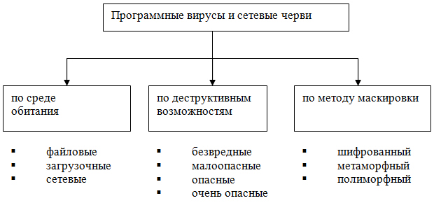

**Тема 22 Вредоносные программы: классификация, методы обнаружения**

1 Компьютерный вирус

2 Проникновение на чужой компьютер

3 Активация

4 Поиск объектов для заражения

5 Подготовка копий

6 Внедрение копий

7 Шифрование

8 Метаморфизм

**1 Компьютерный вирус**

К *вредоносным программам* (иначе называемым *разрушающими программными воздействиями*, malware) относятся компьютерные вирусы и программные закладки.

Впервые термин *компьютерный вирус* ввел в употребление специалист из США Ф.Коэн в 1984 г.

Компьютерный вирус - автономно функционирующая программа, обладающая одновременно тремя свойствами:

\- способностью к включению своего кода в тела других файлов и системных областей памяти компьютера;

\-  последующему самостоятельному выполнению;

\-  самостоятельному распространению в компьютерных системах.

**Вирус (компьютерный, программный)** - исполняемый программный код или интерпретируемый набор инструкций, обладающий свойствами несанкционированного распространения и самовоспроизведения. Созданные дубликаты компьютерного вируса не всегда совпадают с оригиналом, но сохраняют способность к дальнейшему распространению и самовоспроизведению. Таким образом, **обязательным свойством программного вируса является способность создавать свои копии** и внедрять их в вычислительные сети и/или файлы, системные области компьютера и прочие выполняемые объекты. При этом дубликаты сохраняют способность к дальнейшему распространению.

Хронологически наиболее раннее определение от Евгения Касперского (книга "Компьютерные вирусы"):

**Определение 1а.** ОБЯЗАТЕЛЬНЫМ (НЕОБХОДИМЫМ) СВОЙСТВОМ КОМПЬЮТЕРНОГО ВИРУСА является возможность создавать свои дубликаты (не обязательно совпадающие с оригиналом) и внедрять их в вычислительные сети и/или файлы, системные области компьютера и прочие выполняемые объекты. При этом дубликаты сохраняют способность к дальнейшему распространению.

*Определение по ГОСТ Р 51188-98:*

**Определение 1б.** Вирус — программа, способная создавать свои копии (необязательно совпадающие с оригиналом) и внедрять их в файлы, системные области компьютера, компьютерных сетей, а также осуществлять иные деструктивные действия. При этом копии сохраняют способность дальнейшего распространения. Компьютерный вирус относится к вредоносным программам.

Легко заметить, что определение в ГОСТ практически полностью повторяет определение Е. Касперского.

Определения 1а и 1б в большой степени повторяют определение Ф. Коэна или уточнение, предложенное Д. Чессом и С. Вайтом, что позволяет распространить на них (определения) вывод о невозможности создать алгоритм, обнаруживающий все такие программы или даже все "инкарнации" одного из вирусов. Тем не менее, на практике оказывается, что все известные вирусы могут быть обнаружены антивирусными программами. Результат достигается, в частности, еще и за счет того, что поврежденные или неудачные экземпляры вирусов, неспособные к созданию и внедрению своих копий, обнаруживаются и классифицируются наравне со всеми остальными "полноценными" вирусами. Следовательно, с практической точки зрения, т. е. с точки зрения алгоритмов поиска, способность к размножению вовсе не является обязательной для причисления программы к вирусам.

Другая проблема, связанная с определением компьютерного вируса, кроется в том, что сегодня под вирусом чаще всего понимается не "традиционный" вирус, а практически любая вредоносная программа. Это приводит к путанице в терминологии, осложненной еще и тем, что практически все современные антивирусы способны выявлять указанные типы вредоносных программ, таким образом ассоциация "вредоносная программа-вирус" становится все более устойчивой.

Программная закладка - внешняя или внутренняя по отношению к атакуемой компьютерной системе программа, обладающая определенными разрушительными функциями по отношению к этой системе.

**Классификация компьютерных вирусов**

1. По способу распространения в компьютерной системе:

\- файловые вирусы, заражающие файлы одного или нескольких типов;

\- загрузочные вирусы, заражающие загрузочные сектора жестких дисков и дискет;

\- комбинированные вирусы, способные заражать и файлы, и загрузочные сектора дисков.

1. По способу заражения других объектов компьютерной системы:

\- резидентные вирусы, часть кода которых постоянно находится в оперативной памяти компьютера и заражает другие объекты;

\- нерезидентные вирусы, которые заражают другие объекты в момент открытия уже зараженных ими объектов.

1. По деструктивным возможностям:

\- безвредные вирусы, созданные в целях «обучения», однако снижающие эффективность работы компьютерной системы за счет потребления ее ресурсов;

\- неопасные вирусы, создающие различные звуковые и видеоэффекты;

\- опасные и очень опасные вирусы, вызывающие сбои в работе программного и (или) аппаратного обеспечения компьютера, потерю программ и данных, а потенциально – вывод из строя аппаратуры КС и нанесение вреда здоровью пользователей.

1. По особенностям реализуемого алгоритма:

\- вирусы-спутники, создающие для заражаемых файлов одноименные файлы с кодом вируса и переименовывающие исходные файлы (при открытии зараженного файла фактически открывается файл с кодом вируса, в котором после выполнения предусмотренных автором действий открывается исходный файл);

\- паразитические вирусы, которые обязательно изменяют содержимое заражаемых объектов;

\- вирусы-невидимки («стелс»-вирусы), в которых путем перехвата обращений операционной системы к зараженным объектам скрывается факт присутствия вируса в компьютерной системе (при собственном обращении к дисковой памяти вирусы-невидимки также используют нестандартные средства для обхода средств антивирусной защиты);

\- вирусы-призраки (полиморфные вирусы), каждая следующая копия которых в зараженных объектах отличается от предыдущих (не содержит одинаковых цепочек команд за счет применения шифрования на различных ключах базового кода вируса).

**Вредоносная программа** - *программа*, предназначенная для осуществления несанкционированного доступа к информации и (или) воздействия на информацию или ресурсы информационной системы. Иными словами, вредоносной программой называют некоторый самостоятельный набор инструкций, который способен выполнять следующее:

1. скрывать свое присутствие в компьютере;
1. обладать способностью к самоуничтожению, маскировкой под легальные программы и копирования себя в другие области оперативной или внешней памяти;
1. модифицировать (разрушать, искажать) код других программ;
1. самостоятельно выполнять деструктивные функции - копирование, модификацию, уничтожение, блокирование и т.п.
1. искажать, блокировать или подменять выводимую во внешний канал связи или на внешний носитель информацию.

Основными путями проникновения вредоносных программ в *АС*, в частности, на *компьютер*, являются сетевое взаимодействие и съемные носители информации (флешки, диски и т.п.). При этом внедрение в систему может носить случайный характер.

Основными видами вредоносных программ являются:

- программные закладки;
- программные вирусы;
- сетевые черви;
- другие вредоносные программы, предназначенные для осуществления НСД.

К программным закладкам относятся программы и фрагменты программного кода, предназначенные для формирования недекларированных возможностей легального программного обеспечения.

Недекларированные возможности программного обеспечения - функциональные возможности программного обеспечения, не описанные в документации. Программная закладка часто служит проводником для других вирусов и, как правило, не обнаруживаются стандартными средствами антивирусного контроля.

Закладки иногда делят на программные и аппаратные, но фактически все закладки - программные, так как под аппаратными закладками подразумеваются так называемые прошивки.

Программные закладки различают в зависимости от метода их внедрения в систему:

- программно-аппаратные. Это закладки, интегрированные в программно-аппаратные средства ПК (BIOS, прошивки периферийного оборудования);
- загрузочные. Это закладки, интегрированные в программы начальной загрузки (программы-загрузчики), располагающиеся в загрузочных секторах;
- драйверные. Это закладки, интегрированные в драйверы (файлами, необходимые операционной системе для управления подключенными к компьютеру периферийными устройствами);
- прикладные. Это закладки, интегрированные в прикладное программное обеспечение (текстовые редакторы, графические редакторы, различные утилиты и т.п.);
- исполняемые. Это закладки, интегрированные в исполняемые программные модули. Программные модули чаще всего представляют собой пакетные файлы, которые состоят из команд операционной системы, выполняемых одна за другой, как если бы их набирали на клавиатуре компьютера;
- закладки-имитаторы. Это закладки, которые с помощью похожего интерфейса имитируют программы, в ходе работы которых требуется вводить конфиденциальную информацию;

Для выявления программных закладок часто используется качественный подход, заключающийся в наблюдении за функционированием системы, а именно:

1. снижение быстродействия;
1. изменение состава и длины файлов;
1. частичное или полное блокирование работы системы и ее компонентов;
1. имитация физических (аппаратных) сбоев работы вычислительных средств и периферийных устройств;
1. переадресация сообщений;
1. обход программно-аппаратных средств криптографического преобразования информации;
1. обеспечение доступа в систему с несанкционированных устройств.

Существуют также диагностические методы обнаружения закладок. Так, например, антивирусы успешно находят загрузочные закладки. С инициированием статической ошибки на дисках хорошо справляется *Disk* Doctor, входящий в распространенный комплекс утилит Norton Utilities. К наиболее распространенным программным закладкам относится "*троянский конь*".

**Троянским конем** называется:

- программа, которая, являясь частью другой программы с известными пользователю функциями, способна втайне от него выполнять некоторые дополнительные действия с целью причинения ему определенного ущерба;
- программа с известными ее пользователю функциями, в которую были внесены изменения, чтобы, помимо этих функций, она могла втайне от него выполнять некоторые другие (разрушительные) действия.

*Перечислим основные виды троянских программ и их возможности:*

- Trojan-Notifier - Оповещение об успешной атаке. Троянцы данного типа предназначены для сообщения своему "хозяину" о зараженном компьютере. При этом на адрес "хозяина" отправляется информация о компьютере, например, IP-адрес компьютера, номер открытого порта, адрес электронной почты и т. п.
- Trojan-PSW - Воровство паролей. Они похищают конфиденциальные данные с компьютера и передают их хозяину по электронной почте.
- Trojan-Clicker - интернет-кликеры - Семейство троянских программ, основная функция которых - организация несанкционированных обращений к интернет-ресурсам (обычно к веб-страницам). Методы для этого используются разные, например установка злонамеренной страницы в качестве домашней в браузере.
- Trojan-DDoS - Trojan-DDoS превращают зараженный компьютер в так называемый бот, который используется для организации атак отказа в доступе на определенный сайт. Далее от владельца сайта требуют заплатить деньги за прекращение атаки.
- Trojan-Proxy - Троянские прокси-сервера. Семейство троянских программ, скрытно осуществляющих анонимный доступ к различным Интернет-ресурсам. Обычно используются для рассылки спама.
- Trojan-Spy - Шпионские программы. Они способны отслеживать все ваши действия на зараженном компьютере и передавать данные своему хозяину. В число этих данных могут попасть пароли, аудио и видео файлы с микрофона и видеокамеры, подключенных к компьютеру.
- Backdoor - Способны выполнять удаленное управление зараженным компьютером. Его возможности безграничны, весь ваш компьютер будет в распоряжении хозяина программы. Он сможет рассылать от вашего имени сообщения, знакомиться со всей информацией на компьютере, или просто разрушить систему и данные без вашего ведома.
- Trojan-Dropper - Инсталляторы прочих вредоносных программ. Очень похожи на Trojan-Downloader, но они устанавливают злонамеренные программы, которые содержатся в них самих.
- Rootkit - способны прятаться в системе путем подмены собой различных объектов. Такие трояны весьма неприятны, поскольку способны заменить своим программным кодом исходный код операционной системы, что не дает антивирусу возможности выявить наличие вируса.

Абсолютно все программные закладки, независимо от метода их внедрения в компьютерную систему, срока их пребывания в оперативной памяти и назначении, имеют одну общую черту: обязательное выполнение *операции* записи в оперативную или внешнюю *память* системы. При отсутствии данной *операции* никакого негативного влияния программная закладка оказать не может.

**Жизненный цикл** вируса состоит из следующих этапов:

- Проникновение на компьютер
- Активация вируса
- Поиск объектов для заражения
- Подготовка вирусных копий
- Внедрение вирусных копий

Классификация вирусов и сетевых червей представлена на рисунке 1.

Вирусный код загрузочного типа позволяет взять управление компьютером на этапе инициализации, еще до запуска самой системы. **Загрузочные вирусы** записывают себя либо в в *boot*-сектор, либо в сектор, содержащий системный *загрузчик* винчестера, либо меняют *указатель* на *активный* *boot*-сектор. Принцип действия загрузочных вирусов основан на алгоритмах запуска ОС при включении или перезагрузке компьютера: после необходимых тестов установленного оборудования (памяти, дисков и т. д.) *программа* системной загрузки считывает первый физический сектор загрузочного диска и передает управление на А:, С: или *CD-ROM*, в зависимости от параметров, установленных в *BIOS* *Setup*.

В случае дискеты или CD-диска управление получает *boot*-сектор диска, который анализирует таблицу параметров диска (ВРВ - *BIOSParameter* *Block*), высчитывает адреса системных файлов ОС, считывает их в *память* и запускает на выполнение. Системными файлами обычно являются MSDOS.SYS и IO.SYS, либо IBMDOS.*COM* и IBMBIO.*COM*, либо другие в зависимости от установленной версии *DOS*, и/или *Windows*, или других ОС. Если же на загрузочном диске отсутствуют файлы операционной системы, *программа*, расположенная в *boot*-секторе диска, выдает *сообщение об ошибке* и предлагает заменить загрузочный *диск*.

В случае винчестера управление получает *программа*, расположенная в *MBR* винчестера. Она анализирует таблицу разбиения диска (*Disk* *Partition Table*), вычисляет *адрес* активного *boot*-сектора (обычно этим сектором является *boot*-сектор диска С:), загружает его в *память* и передает на него управление. Получив управление, *активный* *boot*-сектор винчестера проделывает те же действия, что и *boot*-сектор дискеты.

При заражении дисков загрузочные вирусы подставляют свой код вместо какой-либо программы, получающей управление при загрузке системы. Принцип заражения, таким образом, одинаков во всех описанных выше способах: *вирус* "заставляет" систему при ее перезапуске считать в *память* и отдать управление не оригинальному коду загрузчика, а коду вируса.

Пример: Вредоносная *программа* *Virus*.*Boot*.*Snow*.a записывает свой код в *MBR* жесткого диска или в загрузочные сектора дискет. При этом оригинальные загрузочные сектора шифруются вирусом. После получения управления *вирус* остается в памяти компьютера (резидентность) и перехватывает прерывания *INT* 10h, 1Ch и 13h. Иногда *вирус* проявляет себя визуальным эффектом - на экране компьютера начинает падать снег.

**Рис. 1.** Классификация программных вирусов и сетевых червей

**Файловые вирусы** - вирусы, которые заражают непосредственно файлы. Файловые вирусы можно разделить на три группы в зависимости от среды, в которой распространяется *вирус*:

1. файловые вирусы - работают непосредственно с ресурсами операционной системы. Пример: один из самых известных вирусов получил название "Чернобыль". Благодаря своему небольшому размеру (1 Кб) вирус заражал PE-файлы таким образом, что их размер не менялся. Для достижения этого эффекта вирус ищет в файлах "пустые" участки, возникающие из-за выравнивания начала каждой секции файла под кратные значения байт. После получения управления вирус перехватывает IFS API, отслеживая вызовы функции обращения к файлам и заражая исполняемые файлы. 26 апреля срабатывает деструктивная функция вируса, которая заключается в стирании Flash BIOS и начальных секторов жестких дисков. Результатом является неспособность компьютера загружаться вообще (в случае успешной попытки стереть Flash BIOS) либо потеря данных на всех жестких дисках компьютера.
1. **Макровирусы** - вирусы, написанные на макроязыках, встроенных в некоторые системы обработки данных (текстовые редакторы, электронные таблицы и т.п.). Самыми распространенными являются вирусы для программ Microsoft Office. Для своего размножения такие вирусы используют возможности макроязыков и при их помощи переносят себя (свои копии) из одного документа в другой.

Для существования макровирсуов в конкретном редакторе встроенный в него макроязык должен обладать следующими возможностями:

1. привязка программы на макроязыке к конкретному файлу;
1. копирование макропрограмм из одного файла в другой;
1. получение управления макропрограммой без вмешательства пользователя (автоматические или стандартные макросы).

Данным условиям удовлетворяют прикладные программы Microsoft Word, Excel и Microsoft Access. Они содержат в себе макроязыки: Word Basic, Visual Basic for Applications. Современные макроязыки обладают вышеперечисленными особенностями с целью предоставления возможности автоматической обработки данных.

Большинство макровирусов активны не только в момент открытия (закрытия) файла, но до тех пор, пока активен сам редактор. Они содержат все свои функции в виде стандартных макросов Word/Excel/Office. Существуют, однако, вирусы, использующие приемы скрытия своего кода и хранящие свой код в виде не макросов. Известно три подобных приема, все они используют возможность макросов создавать, редактировать и исполнять другие макросы. Как правило, подобные вирусы имеют небольшой макрос-загрузчик вируса, который вызывает встроенный редактор макросов, создает новый макрос, заполняет его основным кодом вируса, выполняет и затем, как правило, уничтожает (чтобы скрыть следы присутствия вируса). Основной код таких вирусов присутствует либо в самом макросе вируса в виде текстовых строк (иногда - зашифрованных), либо хранится в области переменных документа.

1. **Сетевые вирусы** - вирусы, которые для своего распространения используют протоколы и возможности локальных и глобальных сетей. Основным свойством сетевого вируса является возможность самостоятельно тиражировать себя по сети. При этом существуют сетевые вирусы, способные запустить себя на удаленной станции или сервере.

Основные деструктивные действия, выполняемые вирусами и червями:

1. перезагрузка каналов связи
1. атаки "отказ в обслуживании"
1. потеря данных
1. нарушение работы ПО
1. загрузка ресурсов компьютера
1. хищение информации.

Помимо всего вышеописанного, существуют вирусы комбинированного типа, которые объединяют в себе свойства разных типов вирусов, например, файлового и загрузочного. В виде примера приведем популярный в минувшие годы файловый *загрузочный вирус*под названием "OneHalf". Этот вирусный код, оказавшись в компьютерной среде операционной системы "MS-*DOS*" заражал основную *запись* загрузки. В процессе инициализации компьютера он шифровал секторы основного диска, начиная с конечных. Когда *вирус* оказывается в памяти, он начинает контролировать любые обращения к шифровальным секторам и может расшифровать их таким образом, что все программы будут работать в штатном режиме. Если *вирус* "OneHalf" просто стереть из памяти и сектора загрузки, то *информация*, записанная в шифровальном секторе диска, станет недоступной. Когда *вирус* зашифровывает часть диска, он предупреждает об этом следующей надписью: "*Dis* is *one* *half*, Press any key to *continue*...". После этих действий он ждет, когда вы нажмете на любую кнопку и продолжите работать. В вирусе "OneHalf" использованы разные маскировочные *механизмы*. Он считается невидимым вирусом и выполняет полиморфные алгоритмические функции. Обнаружить и удалить вирусный код "OneHalf" весьма проблематично, потому что, его могут увидеть не все антивирусные программы.

**Червь** (*сетевой червь*) - тип вредоносных программ, распространяющихся *по* сетевым каналам, способных к автономному преодолению систем защиты автоматизированных и компьютерных сетей, а также к созданию и дальнейшему распространению своих копий, не всегда совпадающих с оригиналом, и осуществлению иного вредоносного воздействия.

Самым знаменитым червем является червь Moriss, *механизмы* работы которого подробно описаны в литературе. Червь появился в 1988 году и в течение короткого промежутка времени парализовал работу многих компьютеров в Интернете. Данный червь является "классикой" вредоносных программ, а *механизмы* нападения, разработанные автором при его написании, до сих пор используются злоумышленниками. Moriss являлся самораспространяющейся программой, которая распространяла свои копии *по* сети, получая привилегированные *права* доступа на хостах сети за счет использования уязвимостей в операционной системе. Одной из уязвимостей, использованных червем, была уязвимая версия программы sendmail (*функция* "*debug*" программы sendmail, которая устанавливала отладочный режим для текущего сеанса связи), а другой - *программа* fingerd (в ней содержалась ошибка переполнения буфера). Для поражения систем червь использовал также *уязвимость* команд rexec и rsh, а также неверно выбранные пользовательские пароли.

На этапе проникновения в систему черви делятся преимущественно *по* типам используемых протоколов:

- Сетевые черви - черви, использующие для распространения протоколы Интернет и локальных сетей. Обычно этот тип червей распространяется с использованием неправильной обработки некоторыми приложениями базовых пакетов стека протоколов tcp/ip
- Почтовые черви - черви, распространяющиеся в формате сообщений электронной почты. Как правило, в письме содержится тело кода или ссылка на зараженный ресурс. Когда вы запускаете прикрепленный файл, червь активизируется; когда вы щелкаете на ссылке, загружаете, а затем открываете файл, червь также начинает выполнять свое вредоносное действие. После этого он продолжает распространять свои копии, разыскивая другие электронные адреса и отправляя по ним зараженные сообщения. Для отправки сообщений червями используются следующие способы: прямое подключение к SMTP-серверу, используя встроенную в код червя почтовую библиотеку; использование сервисов MS Outlook; использование функций Windows MAPI.

Для поиска адресов жертв чаще всего используется адресная книга MS Outlook, но может использоваться также адресная база WAB. Червь может просканировать файлы, хранящиеся на дисках, и выделить из них строки, относящиеся к адресам электронной почты. Черви могут отсылать свои копии по всем адресам, обнаруженным в почтовом ящике (некоторые обладают способностью отвечать на письма в ящике). Встречаются экземпляры, которые могут комбинировать способы.

- IRC-черви - черви, распространяющиеся по каналам IRC (Internet Relay Chat). Черви этого класса используют два вида распространения: посылание пользователю URL-ссылки на файл-тело; отсылку пользователю файла (при этом пользователь должен подтвердить прием).
- P2P-черви - черви, распространяющиеся при помощи пиринговых (peer-to-peer) файлообменных сетей. Механизм работы большинства подобных червей достаточно прост: для внедрения в P2P-сеть червю достаточно скопировать себя в каталог обмена файлами, который обычно расположен на локальной машине. Всю остальную работу по его распространению P2P-сеть берет на себя - при поиске файлов в сети она сообщит удаленным пользователям о данном файле и предоставит весь необходимый сервис для его скачивания с зараженного компьютера.

Существуют более сложные P2P-черви, которые имитируют сетевой протокол конкретной файлообменной системы и положительно отвечают на поисковые запросы (при этом червь предлагает для скачивания свою копию).

- IM-черви - черви, использующие для распространения системы мгновенного обмена сообщениями (IM, Instant Messenger - ICQ, MSN Messenger, AIM и др.). Известные компьютерные черви данного типа используют единственный способ распространения - рассылку на обнаруженные контакты (из контакт-листа) сообщений, содержащих URL на файл, расположенный на каком-либо веб - сервере. Данный прием практически полностью повторяет аналогичный способ рассылки, использующийся почтовыми червями.

Были перечислены наиболее распространенные категории сетевых червей, на практике их значительно больше. Например, в настоящее время всё большую "популярность" приобретают мобильные черви и черви, распространяющие свои копии через общие сетевые ресурсы. Последние используют функции операционной системы, в частности, перебирают доступные сетевые папки, подключаются к компьютерам в глобальной сети и пытаются открыть их диски на полный *доступ*. Отличаются от стандартных сетевых червей тем, что пользователю нужно открыть *файл* с копией червя, чтобы активизировать его.

*По* деструктивным возможностям вирусы и *сетевые черви* можно разделить на:

- безвредные, т. е. никак не влияющие на работу компьютера (кроме уменьшения свободной памяти на диске в результате своего распространения);
- неопасные, влияние которых ограничивается уменьшением свободной памяти на диске и графическими, звуковыми и прочими эффектами;
- опасные вирусы, которые могут привести к серьезным сбоям в работе компьютера;
- очень опасные - в алгоритм их работы заведомо заложены процедуры, которые могут вызвать потерю программ, уничтожить данные, стереть необходимую для работы компьютера информацию, записанную в системных областях памяти, и даже, как гласит одна из непроверенных компьютерных легенд, способствовать быстрому износу движущихся частей механизмов - вводить в резонанс и разрушать головки некоторых типов винчестеров.

Но даже если в алгоритме вируса не найдено ветвей, наносящих *ущерб* системе, этот *вирус* нельзя с полной уверенностью назвать безвредным, так как проникновение его в *компьютер* может вызвать непредсказуемые и порой катастрофические последствия. Ведь *вирус*, как и всякая *программа*, имеет ошибки, в результате которых могут быть испорчены как файлы, так и сектора дисков (например, вполне безобидный на первый взгляд *вирус* DenZuk довольно корректно работает с 360-килобайтовыми дискетами, но может уничтожить информацию на дискетах большего объема). До сих пор попадаются вирусы, определяющие СОМ или ЕХЕ не *по*внутреннему формату файла, а *по* его расширению. Естественно, что при несовпадении формата и расширения имени *файл* после заражения оказывается неработоспособным. Возможно также "заклинивание" резидентного вируса и системы при использовании новых версий *DOS*, при работе в *Windows* или с другими мощными программными системами. И так далее.

Если проанализировать всё вышесказанное, то можно заметить схожесть сетевых червей и компьютерных вирусов, в частности, полное совпадение жизненного *цикла* и самотиражирование. Основным отличием червей от программных вирусов является способность к распространению *по* сети без участия человека. Иногда сетевых червей относят к подклассу компьютерных вирусов.

В связи с бурным развитием Интернета и информационных технологий количество вредоносных программ и вариантов их внедрения в информационную систему неустанно растет. Наибольшую опасность представляют новые формы вирусов и сетевых червей, сигнатуры которых не известны производителям средств защиты информации. В настоящее время всё большую популярность получают такие методы борьбы, как *анализ* аномального поведения системы и искусственные иммунные системы, позволяющие обнаруживать новые формы вирусов.

**Методы обнаружения компьютерных вирусов**

1. Просмотр (сканирование) проверяемых объектов (системных областей дисковой и оперативной памяти, а также файлов заданных типов) в поиске сигнатур (уникальных последовательностей байтов) известных вирусов. Недостатки: необходимость постоянного обновления баз данных сигнатур известных вирусов, неспособность обнаружить новые компьютерные вирусы.
1. Инспекция (обнаружение изменений в объектах компьютерной системы) путем сравнения их вычисленных при проверке хеш-значений с эталонными (или проверки ЭЦП для этих объектов). Недостатки: не все изменения проверяемых объектов вызываются вирусным заражением, не может помочь при записи на жесткий диск компьютера пользователя уже зараженного файла.
1. Эвристический анализ – проверка системных областей памяти и файлов с целью обнаружения фрагментов исполнимого кода, характерного для компьютерных вирусов. Анализируются тысячи различных характеристик каждого файла. Недостатки: длительность процедуры проверки, возможность ложных сообщений о найденных вирусах.
1. Мониторинг − постоянное присутствие в оперативной памяти компьютера с целью сканирования всех открываемых или получаемых извне файлов и контроля всех «подозрительных» действий других программ (например, обнаружение и блокирование потенциально опасных результатов web-поиска, ссылок на URL). Недостатки: снижение эффективности работы системы, возможность выполнения контролируемых действий незараженными программами.
1. Вакцинирование – присоединение к защищаемому файлу специального модуля контроля, следящего за целостностью данного файла с помощью вычисления его хеш-значения и сравнения с эталоном. Недостатки: возможность обхода вирусами-невидимками , неприменимость для защиты файлов документов.
1. Блокирование потенциально опасных действий пользователя:
   1. Установка параметров безопасности и конфиденциальности в обозревателе Интернета.
   1. Установка защиты от записи в загрузочные сектора с помощью программы BIOS Setup.
   1. Определение недоступных для изменения областей дисковой памяти с помощью драйвера PCI-контроллера.

**Удаление обнаруженных вирусов**

1. Автоматическое − с помощью заранее разработанного алгоритма «лечения» зараженных известным вирусом объектов.
1. Автоматическое или «ручное» удаление зараженного объекта (с его последующим восстановлением по сохраненной незараженной резервной копии). Иногда возможно автоматическое восстановление объекта соответствующей программой (например, файла normal.dot программой Microsoft Office Word).
1. Полная переустановка системы, включая форматирование дисковой памяти, восстановление главного загрузочного сектора, установку операционной системы и прикладного программного обеспечения, восстановление файлов данных с резервных носителей информации.

Поскольку отличительной особенностью вирусов в традиционном смысле является способность к размножению в рамках одного компьютера, деление вирусов на типы происходит в соответствии со способами размножения.

**Сам процесс размножения может быть условно разделен на несколько стадий:**

1. Проникновение на компьютер
1. Активация вируса
1. Поиск объектов для заражения
1. Подготовка вирусных копий
1. Внедрение вирусных копий

Особенности реализации каждой стадии порождают атрибуты, набор которых фактически и определяет класс вируса.

**2 Проникновение**

Вирусы проникают на компьютер вместе с зараженными файлами или другими объектами (загрузочными секторами дискет), никак, в отличие от червей, не влияя на процесс проникновения. Следовательно, возможности проникновения полностью определяются возможностями заражения и классифицировать вирусы по этим стадиям жизненного цикла отдельно смысла нет.

**3 Активация**

Для активации вируса необходимо, чтобы зараженный объект получил управление. На данной стадии деление вирусов происходит по типам объектов, которые могут быть заражены:

\1. Загрузочные вирусы - вирусы, заражающие загрузочные сектора постоянных и сменных носителей.

**Примеры.** Вредоносная программа Virus.Boot.Snow.a записывает свой код в MBR жесткого диска или в загрузочные сектора дискет. При этом оригинальные загрузочные сектора шифруются вирусом. После получения управления вирус остается в памяти компьютера (резидентность) и перехватывает прерывания INT 10h, 1Ch и 13h. Иногда вирус проявляет себя визуальным эффектом - на экране компьютера начинает падать снег.

Другой загрузочный вирус Virus.Boot.DiskFiller также заражает MBR винчестера или загрузочные сектора дискет, остается в памяти и перехватывает прерывания - INT 13h, 1Ch и 21h. При этом, заражая дискеты, вирус форматирует дополнительную дорожку с номером 40 или 80 (в зависимости от объема дискеты он может иметь 40 либо 80 дорожек с номерами 0-39 или 0-79 соответственно). Именно на эту нестандартную дорожку вне поля обычной видимости вирус записывает свой код, добавляя в загрузочный сектор лишь небольшой фрагмент - головную часть вируса.

При заражении винчестера Virus.Boot.DiskFiller располагает свой код непосредственно за MBR, а в самом MBR меняет ссылку на активный загрузочный сектор, указывая адрес сектора где он расположен.

\2. Файловые вирусы —вирусы, заражающие файлы. Эта группа дополнительно делится на три, в зависимости от среды в которой выполняется код:

` `Собственно файловые вирусы — те, которые непосредственно работают с ресурсами операционной системы.

**Примеры.** Самый известный файловый вирус всех времен и народов — Virus.Win9x.CIH, известный также как "Чернобыль". Имея небольшой размер - около 1 кб - вирус заражает PE-файлы (Portable Executable) на компьютерах под управлением операционных систем Windows 95/98 таким образом, что размер зараженных файлов не меняется. Для достижения этого эффекта вирус ищет в файлах "пустые" участки, возникающие из-за выравнивания начала каждой секции файла под кратные значения байт. После получения управления вирус перехватывает IFS API, отслеживая вызовы функции обращения к файлам и заражая исполняемые файлы. 26 апреля срабатывает деструктивная функция вируса, которая заключается в стирании Flash BIOS и начальных секторов жестких дисков. Результатом является неспособность компьютера загружаться вообще (в случае успешной попытки стереть Flash BIOS) либо потеря данных на всех жестких дисках компьютера.

Из последних вредоносных программ, обладающих вирусной функциональностью, можно отметить Email-Worm.Win32.Bagle.p (а также его модификации .q и .r). Являясь в первую очередь червем с основным каналом распространения через электронную почту, Bagle.p содержит также функцию заражения EXE-файлов путем дописывания в их конец полиморфного кода вируса

` `Макровирусы — вирусы, написанные на языке макрокоманд и исполняемые в среде какого-либо приложения. В подавляющем большинстве случаев речь идет о макросах в документах Microsoft Office.

**Примеры.** Одними из наиболее разрушительных макровирусов являются представители семейства Macro.Word97.Thus. Эти вирусы содержат три процедуры Document\_Open, Document\_Close и Document\_New, которыми подменяет стандартные макросы, выполняющиеся при открытии, закрытии и создании документа, тем самым обеспечивая заражение других документов. 13 декабря срабатывает деструктивная функция вируса - он удаляет все файлы на диске C:, включая каталоги и подкаталоги.

Модификация Macro.Word97.Thus.aa кроме указанных действий при открытии каждого зараженного документа выбирает на локальном диске случайный файл и шифрует первые 32 байта этого файла, постепенно приводя систему в неработоспособное состояние.

Макро-вирусы способны заражать не только документы Microsoft Word и Excel. Существуют вредоносные программы ориентированные и на другие типы документов: Macro.Visio.Radiant заражает файлы известной программы для построения диаграмм -Visio, Virus.Acad.Pobresito - документы AutoCAD, Macro.AmiPro.Green - документы популярного раньше текстового процессора Ami Pro.

Скрипт-вирусы — вирусы, исполняемые в среде определенной командной оболочки: раньше - bat-файлы в командной оболочке DOS, сейчас чаще VBS и JS - скрипты в командной оболочке Windows Scripting Host (WSH).

**Примеры.** Virus.VBS.Sling написан на языке VBScript (Visual Basic Script). При запуске он ищет файлы с расширениями .VBS или .VBE и заражает их. При наступлении 16-го июня или июля вирус при запуске удаляет все файлы с расширениями .VBS и .VBE, включая самого себя.

Virus.WinHLP.Pluma.a - вирус, заражающий файлы помощи Windows. При открытии зараженного файла помощи выполняется вирусный скрипт, который используя нетривиальный метод (по сути, уязвимость в обработке скриптов) запускает на выполнение уже как обычный файл Windows определенную строку кода, содержащеюся в скрипте. Запущенный код производит поиск файлов справки на диске и внедряет в их область System скрипт автозапуска.

В эпоху вирусов для DOS часто встречались гибридные файлово-загрузочные вирусы. После массового перехода на операционные системы семейства Windows практически исчезли как сами загрузочные вирусы, так и упомянутые гибриды.

Отдельно стоит отметить тот факт, что вирусы, рассчитанные для работы в среде определенной ОС или приложения, оказываются неработоспособными в среде других ОС и приложений. Поэтому как отдельный атрибут вируса выделяется среда, в которой он способен выполняться. Для файловых вирусов это DOS, Windows, Linux, MacOS, OS/2. Для макровирусов - Word, Excel, PowerPoint, Office. Иногда вирусу требуется для корректной работы какая-то определенная версия ОС или приложения, тогда атрибут указывается более узко: Win9x, Excel97.

**4 Поиск объектов для заражения**

На стадии поиска объектов для заражения встречается два способа поведения вирусов.

\1. Получив управление, вирус производит разовый поиск жертв, после чего передает управление ассоциированному с ним объекту (зараженному объекту).

**Пример.** Обычно при освоении новой платформы сначала появляются вирусы именно этого типа. Так было при появлении вирусов под DOS, под Windows 9x, под Windows NT, под Linux.

Например, таким вирусом является Virus.Multi.Pelf.2132 — один из немногих представителей мультиплатформенных вирусов. Этот вирус способен заражать как PE-файлы, так и файлы в формате ELF (формат исполняемых файлов под Linux). При запуске вирус производит в текущем (под обеими операционными системами) и вышестоящих каталогах (под Windows) файлов заражаемых форматов (PE и ELF), определяя действительный формат файла по его структуре. После заражения найденных файлов вирус завершает работу и возвращает управление запущенному файлу.

\2. Получив управление, вирус так или иначе остается в памяти и производит поиск жертв непрерывно, до завершения работы среды, в которой он выполняется

**Пример.** Virus.DOS.Anarchy.6093 также является мультиплатформенным в том смысле, что он способен заражать DOS COM- и EXE-файлы, а также документы Microsoft Word 6/7. При этом вирус может активироваться при запуске как в среде DOS, так и в среде Windows 95. После запуска вирус перехватывает прерывание INT 21h, а в среде Windows дополнительно вносит изменения в драйвер VMM32.VXD (Virtual Memory Manager) с целью перехвата обращений к файлам. При запуске или открытии COM-, EXE и DOC -файла вирус заражает его. Помимо этого, в файловом варианте вирус является полиморфным (см. ниже), и в любом варианте обладает stealth-функциональностью (см. ниже)

Вирусы второго типа во времена однозадачной DOS было принято называть резидентными. С переходом на Windows проблема остаться в памяти перестала быть актуальной: практически все вирусы, исполняемые в среде Windows, равно как и в среде приложений MS Office, являются вирусами второго типа. И напротив, скрипт-вирусы являются вирусами первого типа. Соответственно, атрибут резидентный применим только к файловым DOS вирусам. Существование нерезидентных Windows вирусов возможно, но на практике они являются редким исключением.

Отдельно имеет смысл рассмотреть так называемые stealth-вирусы - вирусы, которые находясь постоянно в памяти, перехватывают обращения к зараженному файлу и на ходу удаляют из него вирусный код, передавая в ответ на запрос неизмененную версию файла. Таким образом эти вирусы маскируют свое присутствие в системе. Для их обнаружения антивирусным средствам требуется возможность прямого обращения к диску в обход средств операционной системы. Наибольшее распространение Stealth-вирусы получили во времена DOS.

**5 Подготовка копий**

**Сигнатура вируса** — в широком смысле, информация, позволяющая однозначно определить наличие данного вируса в файле или ином коде. Примерами сигнатур являются: уникальная последовательность байт, присутствующая в данном вирусе и не встречающаяся в других программах; контрольная сумма такой последовательности.

Процесс подготовки копий для распространения может существенно отличаться от простого копирования. Авторы наиболее сложных в технологическом плане вирусов стараются сделать разные копии максимально непохожими для усложнения их обнаружения антивирусными средствами. Как следствие, составление сигнатуры для такого вируса крайне затруднено либо вовсе невозможно.

**При создании копий для маскировки могут применяться следующие технологии:**

- **Шифрование**— вирус состоит из двух функциональных кусков: собственно вирус и шифратор. Каждая копия вируса состоит из шифратора, случайного ключа и собственно вируса, зашифрованного этим ключом.
- **Метаморфизм**— создание различных копий вируса путем замены блоков команд на эквивалентные, перестановки местами кусков кода, вставки между значащими кусками кода "мусорных" команд, которые практически ничего не делают.

Сочетание этих двух технологий приводит к появлению следующих типов вирусов.

- Шифрованный вирус — вирус, использующий простое шифрование со случайным ключом и неизменный шифратор. Такие вирусы легко обнаруживаются по сигнатуре шифратора.
- Метаморфный вирус — вирус, применяющий метаморфизм ко всему своему телу для создания новых копий.
- Полиморфный вирус — вирус, использующий метаморфный шифратор для шифрования основного тела вируса со случайным ключом. При этом часть информации, используемой для получения новых копий шифратора также может быть зашифрована. Например, вирус может реализовывать несколько алгоритмов шифрования и при создании новой копии менять не только команды шифратора, но и сам алгоритм.

Полиморфные вирусы можно делить на классы по уровню полиморфизма, желающие подробнее познакомиться с этим вопросом могут найти полезную информацию в [1].

Пик популярности полиморфных вирусов пришелся на времена DOS, тем не менее, и позднее полиморфизм использовался во множестве вирусов, продолжает использоваться полиморфизм и сегодня.

**Примеры.** Упомянутый выше Email-Worm.Win32.Bagle.p является полиморфным вирусом.

Одним из наиболее сложных и относительно поздних полиморфных вирусов является Virus.Win32.Etap. При заражении файла вирус перестраивает и шифрует собственный код, записывает его в одну из секций заражаемого файла, после чего ищет в коде файла вызов функции ExitProcess и заменяет его на вызов вирусного кода. Таким образом, вирус получает управление не перед выполнением исходного кода зараженного файла, а после него.

**6 Внедрение копий**

Внедрение вирусных копий может осуществляться двумя принципиально разными методами:

- Внедрение вирусного кода непосредственно в заражаемый объект
- Замена объекта на вирусную копию. Замещаемый объект, как правило, переименовывается

Для вирусов характерным является преимущественно первый метод. Второй метод намного чаще используется червями и троянами, а точнее троянскими компонентами червей, поскольку трояны сами по себе не распространяются.

**Пример.** Один из немногих почтовых червей, распространяющихся по почтовой книге The Bat! - Email-Worm.Win32.Stator.a, помимо всего прочего заражает некоторые файлы Windows по принципу вируса-компаньона. В частности, к заражаемым файлам относятся: mplayer.exe, winhlp32.exe, notepad.exe, control.exe, scanregw.exe. При заражении файлы переименовываются в расширение .VXD, а вирус создает свои копии под оригинальными именами заражаемых файлов. После получения управления вирус запускает соответствующий переименованный оригинальный файл.

В качестве варианта второго метода, во времена DOS применялся следующий прием. При наборе имени исполняемого файла без указания расширения, DOS ищет по порядку сперва BAT, затем COM, и в конце концов EXE-файл. Соответственно, вирусная копия создавалась в одном каталоге с EXE-файлом, дублируя его имя и принимая расширение COM. Таким образом, при попытке запустить данный EXE-файл без явного указания расширения сначала запускался вирус.

Аналогичный прием может использоваться и в Windows-системах, но поскольку основная масса пользователей Windows редко пользуются запуском файлов из командной строки, эффективность этого метода будет низкой.

