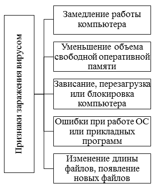
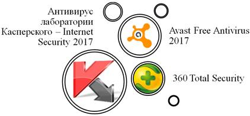

**Тема 23 Антивирусные программы: классификация, сравнительный анализ**

1 Понятие защиты информации

2 Виды угроз

3 Утечка конфиденциальной информации

4 Компрометация информации

5 Несанкционированное использование информационных ресурсов

6 Ошибочное использование информационных ресурсов

7 Несанкционированный обмен информацией между абонентами

8 Отказ от информации

9 Нарушение информационного обслуживания

10 Незаконное использование привилегий

**Классификация антивирусных программ**

Для удобной и безопасной работы за компьютером необходимо иметь минимальные представления о способах защиты личных данных, следует знать, что такое компьютерные вирусы, и с помощью какого программного обеспечения с ними необходимо бороться.

Компьютерный вирус – это вредоносное программное обеспечение, способное нанести непоправимый ущерб компьютеру и информации, хранящейся на его носителях. Его основной целью является нанесение вреда, хищение информации и многое другое. Определить наличие вируса на компьютере можно по признакам, представленным на рисунке 1.

***Рисунок 1. Признаки заражения вирусом***

Наличие одного или нескольких признаков заражения не дают 100 % гарантии, что компьютер заражен вирусом. Эту гарантию дает специальная программа – антивирус. Антивирусное программное обеспечение служит для выявления компьютерных вирусов, их удаления, лечения и профилактики.

Сегодня на рынке представлено огромное разнообразие антивирусных программ. Каждая из них имеет свои достоинства и недостатки, но все антивирусы должны отвечать следующим критериям:

- стабильность и надежность работы;
- регулярное обновление базы данных;
- определение разнообразных типов вирусов;
- умение работать с файлами разнообразных типов;
- осуществление проверки всех новых файлов автоматически;
- возможность восстанавливать зараженные файлы, не стирая их с жесткого диска.

Как было сказано ранее, антивирусное программное обеспечение служит для диагностики, лечения и профилактики компьютерных вирусов. Диагностика выявляет вирусы и уведомляет пользователя компьютера. Найдя вирус, антивирусное программное обеспечение может предложить пользователю вылечить инфицированный файл, поместить его в карантин или удалить. Профилактика заключается в том, что антивирусная программа запускается вместе с операционной системой и проверяет на наличие вируса каждую запускаемую программу или файл, т.е. зачищает компьютер постоянно.

Антивирусные программы предназначены для предотвращения заражения и ликвидации последствий заражения вирусом. Они могут контролировать обращения к жесткому диску и предупреждать пользователя о подозрительной активности, а также обеспечивают надежную защиту почтовых сообщений от вирусов.

По выполняемым функциям антивирусные программы подразделяют на следующие типы: детекторы; доктора; ревизоры; фильтры или сторожа; вакцины или иммунизаторы.

Программы-***ревизоры*** запоминают исходное состояние программ, каталогов и системных областей до заражения компьютера и периодически его сравнивают с текущим состоянием. При обнаружении несоответствия пользователю выдается предупреждение.

Программы-***фильтры*** представляют собой резидентные программы, которые обеспечивают обнаружение подозрительных действий при работе компьютера, например, попыток изменения исполняемых файлов, изменения атрибутов файлов, записи в загрузочный сектор диска и др.

Программы-***детекторы*** настроены на обнаружение заражения одним или несколькими известными вирусами. Большинство программ-детекторов выполняют также функцию «доктора», т.е. они пытаются вернуть зараженные файлы и области диска в исходное состояние, те файлы, которые не удалось восстановить, обычно делаются неработоспособными и удаляются.

Программы-***доктора*** обнаруживают и лечат зараженные объекты путем «выкусывания» тела вируса. Программы этого типа подразделяются на ***фаги*** и ***полифаги***(обнаружение и уничтожение большого количества разнообразных вирусов).

Программы-***вакцины*** выполняют модификацию файла или диска таким образом, чтобы это не отражалось на их работе, но вирус считал бы их уже зараженными. Вакцинация осуществляется только от известных вирусов.

Антивирусные программы имеют три режима проверки на наличие вредоносного программного обеспечения: минимальный, средний (оптимальный), максимальный (параноидальный).

Параноидальный уровень защиты обеспечивает максимальную степень защиты, но обычно при этом потребляет большое количество ресурсов компьютера. Оптимальный уровень обеспечивает достаточный уровень защиты, он рекомендуется для повседневной работы. Минимальный уровень защиты обычно включает в себя проверку по базе данных сигнатур, то есть антивирус выдаёт информацию, только если это действительно 100 % вирус.

Компьютерные вирусы опасны как для аппаратной части компьютера, так и для персональных данных. Чтобы защитить их, необходимо установить на компьютер антивирусную программу. Рассмотрим наиболее популярные на 2017 год антивирусные программы (рис. 2):

***Рисунок 2. Популярные антивирусные программы***

Антивирус лаборатории Касперского – Internet Security 2017. Самая известная антивирусная программа на территории Российской Федерации. Данный антивирус работает с операционными системами Windows, Mac, а также планшетными и мобильными устройствами на базе Android. Лаборатория Касперского предоставляет антивирусные программы для малого, среднего и крупного бизнеса, которые защищают Интернет-соединения, банковые операции, веб-камеру и имеют функцию родительского контроля. Антивирус предоставляет возможность поиска и установки обновлений программ и удаление неиспользуемых программ, имеется бесплатный тестовый период – 30 дней.

Avast Free Antivirus 2017 – интуитивно понятная и не требующая значительных ресурсов программа для защиты компьютера. Данное антивирусное программное обеспечение распространяется бесплатно, но можно приобрести расширенную или максимальную версии, которые содержат в себе дополнительные функции. Avast совместим с большинством современных операционных систем, а также смартфонов на базе Android и iPhone. Как и Антивирус лаборатории Касперского предоставляет антивирусные программы для бизнеса, защищает Интернет-соединения, банковые и финансовые операции и проверяет безопасность сети Wi-Fi.

360 Total Security. Данный антивирус быстр и прост в использовании, практически с каждым обновлением программы ее арсенал функций возрастает. Данная антивирусная программа совместима с теми же операционными системами, что и ее конкуренты. Этот продукт защищает веб-браузер, сжимает данные в памяти компьютера, проверяет и очищает системный реестр, защищает сеть Wi-Fi от внешних угроз. Для опытных пользователей имеются гибкие настройки приложения, возможность оптимизировать работу системы через антивирус и выбора темы оформления интерфейса на интересующую тематику. Данный антивирус также является бесплатным, но можно купить премиум версию, которая отличается расширенным функционалом.

В таблице 1 представлены результаты сравнительного анализа функционала рассмотренных антивирусных программ.

***Таблица 1.***

**Результаты сравнительного анализа антивирусных программ**

|Функционал антивирусной программы|Антивирус Касперского – Internet Security 2017|Avast Free Antivirus 2017|360 Total Security|
| :-: | :-: | :-: | :-: |
|**Антивирусный сканер и антивирусный монитор**|**+**|**+**|**+**|
|**Защита персональных данных**|**+**|**+**|**+**|
|**Система обновлений**|**+**|**+**|**+**|
|**Веб-защита**|**+**|**+**|**+**|
|**Поведенческий блокиратор**|**+**|**+**|**+**|
|**Эвристический анализ**|**+**|**+**|**+**|
|**Анти-фишинг**|**+**|**-**|**-**|
|**Анти-спам**|**+**|**-**|**-**|
|**Возможность работы в облаке**|**+**|**+**|**+**  |

Программа-полифаг **Doctor Web** (разработчик: *И. Данилов*) выполняет поиск и удаление известных ему вирусов из памяти и с дисков компьютера. Наличие интеллектуального эвристического анализатора позволяет обнаружить новые, ранее неизвестные вирусы и модификации известных. Антивирус Dr.Web проверяет почту, приходящую по протоколу POP3, до обработки ее почтовым клиентом, а также проверяет почту, исходящую по протоколу SMTP. Антивирусный сторож (***монитор***), работая автоматически, проверяет файлы «на лету» при обращении к ним из какой-либо программы, оповещает пользователя при обнаружении инфицированных и подозрительных файлов. В программе используется интеллектуальная технология контроля вирусной активности, заключающаяся в анализе действий, которые совершают программы. Анализ построен таким образом, что практически полностью исключает «ложную тревогу» и вместе с тем позволяет пресечь любые действия, которые может совершить вредоносная программа. Антивирусный ***сканер*** позволяет обнаруживать зараженные объекты на всех носителях и в оперативной памяти компьютера, а также обезвреживать вирусы.

**AVP** (AntiVirus Protect, разработчик – *Лаборатория Касперского*) позволяет лечить и проверять упакованные и архивные файлы, сетевые диски. Благодаря уникальной технологии сканирования она обнаруживает и удаляет вирусы в архивированных и сжатых файлах более чем 700 различных форматов. Кроме этого в архивах формата ZIP Антивирус Касперского способен удалять из зараженного сжатого файла вредоносные коды и лечить файлы. Интегрированный модуль Office Guard™ создает максимально защищенное пространство для приложений Microsoft Office. Благодаря этому Антивирус Касперского Personal Pro обеспечивает полный контроль над всеми офисными документами и гарантирует стопроцентную защиту даже от неизвестных макровирусов.

**Norton AntiVirus** автоматически защищает от вирусов, злонамеренных программ ActiveX, апплетов Java при пользовании Internet и работе с дискетами, CD или сетью, проверяет входящие приложения в самых распространенных программах электронной почты, обнаруживает вирусы и лечит сжатые файлы. Беспрепятственно пропускает незараженные файлы, но задерживает файлы с вирусами еще до того, как они могут войти в вашу систему и нанести ей вред. **Norton AntiVirus 2003**автоматически удаляет опасные программные коды, а также защищает от вирусов вложения в сообщениях и электронных письмах, гарантирует максимальный уровень безопасности благодаря возможности постоянного автоматического обновления антивирусных баз и созданию всесторонней защиты пользователей от проникновения опасных программных кодов. Уникальная эвристическая технология способна выявлять почтовых «червей», подобных Nimda и Badtrans, и останавливать их еще до того, как они получат возможность для дальнейшего распространения с исходящей почтой.

Профессиональная версия (**Pro**) помимо всех функциональных возможностей стандартного выпуска включает еще средства восстановления данных и очистки системы, предусмотренные специально для профессионалов в области информационных технологий и предприятий малого бизнеса. Эти инструменты позволяют пользователям защищать и восстанавливать критически важные файлы, а также сохранять должный уровень конфиденциальности путем фрагментирования ненужных более файлов.

**Panda Titanium Antivirus 2004** (разработчик *Panda Software*) – антивирусная программа последнего поколения с улучшенной технологией обнаружения и удаления вирусов любого типа, обеспечивает защиту от любой программы, документа или электронного письма, которые могут нанести вред системе компьютера. Благодаря эффективным эвристическим технологиям программное обеспечение Panda особенно эффективно в борьбе против новых неизвестных вирусов, которые могут появиться в будущем, автоматически обнаруживает и удаляет все типы вирусов во время получения/отправки электронной почты, загрузки файлов или работы в Internet, защищает от «дозвонщиков» – программ, которые незаметно подключают модем к платным номерам, утилит скрытого управления, опасных скрытых файлов, программ с опасными скрытыми файлами и других угроз безопасности. Программа выявляет и уничтожает ошибки в программном обеспечении, установленном на компьютере, и проводит самодиагностику, чтобы гарантировать бесперебойную и продуктивную работу антивируса.

**1 Понятие защиты информации**

В толковых словарях термин защита интерпретируется двояко: как процесс охраны, сбережения, спасения от кого, чего-нибудь неприятного, враждебного, опасного и как совокупность методов, средств и мер, принимаемых для предотвращения, предупреждения чего-то. Таким образом, **содержательная часть** в этих определениях по смыслу совпадает — это **предотвращение, предупреждение чего-то опасного, враждебного.** Если соотнести это положение с защитой информации, то самым опасным для собственника информации является **нарушение установленного статуса информации,** и поэтому содержательной частью защиты должно быть предотвращение такого нарушения.

Нарушение статуса любой информации заключается в нарушении ее физической сохранности вообще либо у данного собственника (в полном или частичном объеме), структурной целостности, доступности для правомочных пользователей. Нарушение статуса конфиденциальной информации, в том числе составляющей государственную тайну, дополнительно включает в себя нарушение ее конфиденциальности (закрытости для посторонних лиц).

**Защита информации -** деятельность по предотвращению утраты и утечки конфиденциальной информации и утраты защищаемой открытой информации.

Учитывая, что определение должно быть лаконичным, а термин утрата и утечка защищаемой информации поглощает все формы проявления уязвимости конфиденциальной и защищаемой части открытой информации, можно ограничиться более кратким определением при условии дифференцированного его преломления в практической работе:

**Защита информации -** деятельность по предотвращению утраты и утечки защищаемой информации.

А теперь проанализируем определение этого понятия, содержащееся в **ГОСТ Р50922-96 "Защита информации. Основные термины и определения",** поскольку это определение официальное, имеющее в смысловом значении обязательный характер. Оно сформулировано так: **Защита информации -** деятельность по предотвращению утечки защищаемой информации, несанкционированных и непреднамеренных воздействий на защищаемую информацию.

С понятием защиты информации тесно связано понятие безопасности информации. Термин безопасность информации имеет двойное смысловое значение, его можно толковать:

1. **и как безопасность самой информации.**

При этом безопасность самой информации не вписывается в однозначное понимание. С одной стороны, это может означать безопасность информации с точки зрения изначальной **полноты и надежности информации (т.е. безопасность с точки зрения содержания)**, с другой стороны, — **защищенность установленного статус-кво информации (безопасность с точки зрения формы информации).**

2. **и как отсутствие угроз со стороны информации субъектам информационных отношений.**

В нормативных документах и литературе безопасность информации рассматривается только в разрезе ее защищенности, и это, вероятно, оправдано при наличии термина информационная безопасность.

Существует несколько определений понятия **безопасность информации**. Общий подход: **безопасность информации** **как состоянию защищенности (или защиты) информации.** Это не вызывает возражений, ибо сам термин безопасность означает отсутствие опасностей, что определенным образом корреспондируется с термином состояние защищенности.

Часто цель и задачи защиты информации отождествляют, что неверно.

**Цель защиты информации** – это то, ради чего она должна защищаться (предполагаемый результат деятельности по защите информации).

**Задачи защиты информации** - это, что необходимо сделать для реализации цели (результата защиты информации).

**2 Виды угроз**

Основными видами угроз безопасности информационных систем являются:

• преднамеренные действия нарушителей и злоумышленников (обиженных лиц из числа персонала, преступников, шпионов, диверсантов и т. п.).

Угрозы безопасности можно классифицировать по различным признакам:

**1. По результатам акции:**

\1) угроза утечки;

\2) угроза модификации;

\3) угроза утраты.

**2. По мотивам:**

· Непреднамеренные;

· Умышленные.

Случайные (непреднамеренные) угрозы могут возникнуть в следствии:

• стихийных бедствий и аварий (наводнение, ураган, землетрясение, пожар и т.п.);

• сбоя и отказа оборудования (технических средств) АИТУ;

• последствий ошибок проектирования и разработки компонентов АИС (аппаратных средств, технологии обработки информации, программ, структур данных и т. п.);

• ошибок эксплуатации (пользователей, операторов и другого персонала).

**Основные причины *непреднамеренных, искусственных угроз*** АИС:

· Невнимательность;

· нарушение регламента и игнорирования ограничений, установленных в системе;

· Некомпетентность;

· Халатность.

Примеры угроз:

\1) неумышленные действия, приводящий к частичному или полному отказу системы или разрушению аппаратных, программных, информационных ресурсов системы (неумышленная порча оборудования, удаление, искажение файлов с важной информацией или программ, в том числе системных и т. п.);

\2) неправомерное включение оборудования или изменение режимов работы устройств и программ;

\3) неумышленная порча носителей информации;

\4) нелегальное внедрение и использование неучтенных программ (игровых, обучающих, технологических и др., не являющихся необходимыми для выполнения нарушителем своих служебных обязанностей) с последующим необоснованным расходованием ресурсов (загрузка процессора, захват оперативной памяти и памяти на внешних носителях);

\6) заражение компьютера вирусами;

\7) неосторожные действия, приводящие к разглашению конфиденциальной информации или делающие ее общедоступной;

\8) разглашение, передача или утрата атрибутов разграничения доступа (паролей, ключей шифрования, идентификационных карточек, пропусков и т. п.);

\9) игнорирование организационных ограничений (установленных правил) при ранге в системе;

\10) вход в систему в обход средств защиты (загрузка посторонней операционной системы со сменных магнитных носителей и т. п.);

\11) некомпетентное использование, настройка или неправомерное отключение средств защиты персоналом службы безопасности;

\12) пересылка данных по ошибочному адресу абонента (устройства);

\13) ввод ошибочных данных;

\14) неумышленное повреждение каналов связи.

**умышленные угрозы** *—* это угрозы АИС, вызванные деятельностью человека, связанные с корыстными устремлениями людей (злоумышленников).

Источники угроз по отношению к информационной системе могут быть внешними или внутренними.

К сожалению результатом реализации и тех и других угроз являются одни и те же последствия: потеря информации, нарушение ее конфиденциальности, ее модификация.

**Основные *преднамеренные умышленные угрозы*** как правило направлены на:

· умышленную дезорганизацию работы системы и вывод ее из строя,

· с целью проникновения в систему и несанкционированного доступа к информации и использования ее в корыстных целях.

Умышленные угрозы в свою очередь могут подразделяться на:

\1. **Активные и пассивные**.

**Пассивные угрозы**- направлены в основном на несанкционированное использование информационных ресурсов, не влекущее порчу и уничтожение информации.

**Для этого используются разнообразные способы реализации**:

а) применение подслушивающих устройств, дистанционная фото- и видеосъемка, хищение носителей и т. п.;

б) хищение носителей информации (магнитных дисков, лент, микросхем памяти, запоминающих устройств и персональных ЭВМ);

в) перехват данных, передаваемых по каналам связи, и их анализ с целью выяснения протоколов обмена, правил вхождения в связь и авторизации пользователя и последующих попыток их имитации для проникновения в систему;

г) чтение остатков информации из оперативной памяти и с внешних запоминающих устройств (буфер памяти принтера);

д) чтение информации из областей оперативной памяти, используемых операционной системой (в том числе подсистемой защиты) ;

е) незаконное получение паролей и других реквизитов разграничения доступа (агентурным путем, используя халатность пользователей, путем подбора, имитации интерфейса системы и т. п. с последующей маскировкой под зарегистрированного пользователя («маскарад»);

**Активные угрозы -** нарушение нормального функционирования системы путем целенаправленного воздействия на ее компоненты.

**3 Утечка конфиденциальной информации**

Термин «утечка конфиденциальной информации», вероятно, не самый благозвучный, однако он более емко, чем другие термины, отражает суть явления, к тому же он давно уже закрепился в научной литературе и нормативных документах. Утечка конфиденциальной информации представляет собой неправомерный, т. е. неразрешенный выход такой информации за пределы защищаемой зоны ее функционирования или установленного круга лиц, имеющих право работать с ней, если этот выход привел к получению информации (ознакомлению с ней) лицами, не имеющими к ней санкционированного доступа. Утечка конфиденциальной информации означает не только получение ее лицами, не работающими на предприятии, к утечке приводит и несанкционированное ознакомление с конфиденциальной информацией лиц данного предприятия.

Утрата и утечка конфиденциальной документированной информации обусловлены уязвимостью информации. Уязвимость информации следует понимать, как неспособность информации самостоятельно противостоять дестабилизирующим воздействиям, т. е. таким воздействиям, которые нарушают ее установленный статус. Нарушение статуса любой документированной информации заключается в нарушении ее физической сохранности (вообще либо у данного собственника в полном или частичном объеме), логической структуры и содержания, доступности для правомочных пользователей. Нарушение статуса конфиденциальной документированной информации дополнительно включает нарушение ее конфиденциальности (закрытости для посторонних лиц).

Уязвимость документированной информации — понятие собирательное. Она не существует вообще, а проявляется в различных формах. К таким формам, выражающим результаты дестабилизирующего воздействия на информацию, относятся (в скобках указаны существующие варианты названий форм):

- хищение носителя информации или отображенной в нем информации (кража);
- потеря носителя информации (утеря);
- несанкционированное уничтожение носителя информации или отображенной в нем информации (разрушение);
- искажение информации (несанкционированное изменение, несанкционированная модификация, подделка, фальсификация);
- блокирование информации;
- разглашение информации (распространение, раскрытие).

Термин «разрушение» употребляется главным образом применительно к информации на магнитных носителях.

Существующие варианты названий: модификация, подделка, фальсификация не совсем адекватны термину «искажение», они имеют нюансы, однако суть их одна и та же — несанкционированное частичное или полное изменение состава первоначальной информации.

Блокирование информации в данном контексте означает блокирование доступа к ней правомочных пользователей, а не злоумышленников.

Разглашение информации является формой проявления уязвимости только конфиденциальной информации.

Та или иная форма уязвимости документированной информации может реализоваться в результате преднамеренного или случайного дестабилизирующего воздействия различными способами на носитель информации или на саму информацию со стороны источников воздействия. Такими источниками могут быть люди, технические средства обработки и передачи информации, средства связи, стихийные бедствия и др. Способами дестабилизирующего воздействия на информацию являются ее копирование (фотографирование), записывание, передача, съем, заражение программ обработки информации вирусом, нарушение технологии обработки и хранения информации, вывод (или выход) из строя и нарушение режима работы технических средств обработки и передачи информации, физическое воздействие на информацию и др.

Реализация форм проявления уязвимости документированной информации приводит или может привести к двум видам уязвимости — утрате или утечке информации.

К утрате документированной информации приводят хищение и потеря носителей информации, несанкционированное уничтожение носителей информации или только отображенной в них информации, искажение и блокирование информации. Утрата может быть полной или частичной, безвозвратной или временной (при блокировании информации), но в любом случае она наносит ущерб собственнику информации.

К утечке конфиденциальной документированной информации приводит ее разглашение. В литературе и даже в нормативных документах термин «утечка конфиденциальной информации» нередко заменяется или отождествляется с терминами: «разглашение конфиденциальной информации», «распространение конфиденциальной информации». Такой подход не является правомерным. Разглашение или распространение конфиденциальной информации означают несанкционированное доведение ее до потребителей, не имеющих права доступа к ней. При этом такое доведение должно осуществляться кем-то, исходить от кого-то. Утечка происходит при разглашении (несанкционированном распространении) конфиденциальной информации, но не сводится только к нему. Утечка может произойти и в результате потери носителя конфиденциальной документированной информации, а также хищения носителя информации либо отображенной в нем информации при сохранности носителя у его собственника (владельца). «Может произойти» не означает, что произойдет. Потерянный носитель может попасть в чужие руки, а может быть, и «прихвачен» мусороуборочной машиной и уничтожен в установленном для мусора порядке. В последнем случае утечки конфиденциальной информации не происходит. Хищение конфиденциальной документированной информации также не всегда связано с получением ее лицами, не имеющими к ней доступа. Имелось немало случаев, когда хищение носителей конфиденциальной информации осуществлялось у коллег по работе допущенными к этой информации лицами с целью «подсидки», причинения вреда коллеге. Такие носители, как правило, уничтожались лицами, похитившими их. Но в любом случае потеря и хищение конфиденциальной информации если и не приводят к ее утечке, то всегда создают угрозу утечки. Поэтому можно сказать, что к утечке конфиденциальной информации приводит ее разглашение и могут привести хищение и потеря. Сложность состоит в том, что зачастую невозможно определить, во-первых, сам факт разглашения или хищения конфиденциальной информации при сохранности носителя информации у ее собственника (владельца), во-вторых, попала ли информация вследствие ее хищения или потери посторонним лицам.

**Конфиденциальная информация** — это информация, исключительное право на пользование которой принадлежит определенным лицам или группе лиц.

` `***Раскрытие конфиденциальной информации*** — это бесконтрольный выход конфиденциальной информации за пределы информационной технологии или круга лиц, которым она была доверена по службе или стала известна в процессе работы.

Раскрытие конфиденциальной информации может быть следствием:

• разглашения конфиденциальной информации;

• утечки информации по различным, главным образом техническим, каналам (по визуально-оптическим, акустическим, электромагнитным и др.);

• несанкционированного доступа к конфиденциальной информации различными способами.

Иногда выделяют разглашение информации ее владельцем или обладателем путем умышленных или неосторожных действий должностных лиц и пользователей, которым соответствующие сведения в установленном порядке были доверены по службе или по работе, приведшие к ознакомлению с ними лиц, не допущенных к этим сведениям.

` `Несанкционированный доступ к информации выражается в противоправном преднамеренном овладении конфиденциальной информацией лицом, не имеющим права доступа к охраняемым сведениям.

Наиболее распространенными путями несанкционированного доступа к информации являются:

• перехват электронных излучений;

• принудительное электромагнитное

облучение (подсветка) линий связи с целью получения паразитной модуляции несущей;

• применение подслушивающих устройств (закладок);

• дистанционное фотографирование;

• перехват акустических излучений и восстановление текста принтера;

• чтение остаточной информации в памяти системы после выполнения санкционированных запросов;

• копирование носителей информации с преодолением мер защиты;

• маскировка под зарегистрированного пользователя («маскарад»);

• использование недостатков языков программирования и операционных систем;

• маскировка под запросы системы;

• использование программных ловушек;

Несанкционированный доступ — это нарушение установленных правил разграничения доступа, последовавшее в результате случайных или преднамеренных действий пользователей или других субъектов системы разграничений.

• незаконное подключение к аппаратуре и линиям связи специально разработанных аппаратных средств, обеспечивающих доступ к информации;

• злоумышленный вывод из строя механизмов защиты;

• расшифровка специальными программами зашифрованной информации;

• информационные инфекции.

Перечисленные пути несанкционированного доступа требуют достаточно больших технических знаний и соответствующих аппаратных или программных разработок со стороны взломщика. Например, ***используются технические каналы утечки*** — это физические пути от источника конфиденциальной информации к злоумышленнику, посредством которых возможно получение охраняемых сведений. Причиной возникновения каналов утечки являются конструктивные и технологические несовершенства схемных решений либо эксплуатационный износ элементов. Все это позволяет взломщикам создавать действующие на определенных физических принципах преобразователи, образующие присущий этим принципам канал передачи информации — канал несанкционированного доступа.

Однако есть и достаточно примитивные пути несанкционированного доступа:

• хищение носителей информации и документальных отходов;

• инициативное сотрудничество;

• склонение к сотрудничеству со стороны взломщика;

• выпытывание;

• подслушивание;

• наблюдение и другие пути.

Любые способы утечки конфиденциальной информации могут привести к значительному материальному и моральному ущербу как для организации, где функционирует информационная технология, так и для ее пользователей.

` `***Компрометация информации*** (один из видов информационных инфекций). Реализуется, как правило, посредством несанкционированных изменений в базе данных, в результате чего ее потребитель вынужден либо отказаться от нее, либо предпринимать дополнительные усилия для выявления изменений и восстановления истинных сведений. При использовании скомпрометированной информации потребитель подвергается опасности принятия неверных решений.

***Несанкционированное использование информационных ресурсов***, с одной стороны, является последствиями ее утечки и средством ее компрометации. С другой стороны, оно имеет самостоятельное значение, так как может нанести большой ущерб управляемой системе (вплоть до полного выхода информационной технологии из строя) или ее абонентам.

***Отказ от информации*** состоит в непризнании получателем или отправителем

этой информации фактов ее получения или отправки. Это позволяет одной из сторон расторгать заключенные финансовые соглашения «техническим путем», формально не отказываясь от них, нанося тем самым второй стороне значительный ущерб.

` `***Нарушение информационного обслуживания*** представляет собой весьма существенную и распространенную угрозу, источником которой является сама автоматизированная информационная технология. Задержка с предоставлением информационных ресурсов абоненту может привести к тяжелым для него последствиям. Отсутствие у пользователя своевременных данных, необходимых для принятия решения, может вызвать его нерациональные действия.

` `***Незаконное использование привилегий***. Любая защищенная технология содержит средства, используемые в чрезвычайных ситуациях, или средства, которые способны функционировать с нарушением существующей политики безопасности. Например, на случай внезапной проверки пользователь должен иметь возможность доступа ко всем наборам системы. Обычно эти средства используются администраторами, операторами, системными программистами и другими пользователями, выполняющими специальные функции.

Большинство систем защиты в таких случаях используют наборы привилегий, т. е. для выполнения определенной функции требуется определенная привилегия. Обычно пользователи имеют минимальный набор привилегий, администраторы — максимальный.

Наборы привилегий охраняются системой защиты. Несанкционированный (незаконный) захват привилегий возможен при наличии ошибок в системе защиты, но чаще всего происходит в процессе управления системой защиты, в частности, при небрежном пользовании привилегиями.

Строгое соблюдение правил управления системой защиты, а также принципа минимума привилегий позволяет избежать таких нарушений. Большинство из перечисленных технических путей утечки информации поддаются надежной блокировке при правильно разработанной и реализуемой на практике системе обеспечения безопасности.

` `***«Взлом системы»*** — умышленное проникновение в информационную технологию, когда взломщик не имеет санкционированных параметров для входа. Способы взлома могут быть различными, и при некоторых из них происходит совпадение с ранее описанными угрозами. Например, использование пароля пользователя информационной технологии, который может быть вскрыт, например, путем перебора возможных паролей.

Следует отметить, что основную нагрузку защиты системы от взлома несет программа входа. Алгоритм ввода имени и пароля, их шифрование, правила хранения и смены паролей не должны содержать ошибок. Противостоять взлому системы поможет, например, ограничение попыток неправильного ввода пароля (т. е. исключить достаточно большой перебор) с последующей блокировкой персонального компьютера (рабочей станции) и уведомлением администратора в случае нарушения. Кроме того, администратор безопасности должен постоянно контролировать активных пользователей системы: их имена, характер работы, время входа и выхода и т. д. Такие действия помогут своевременно установить факт взлома и предпринять необходимые действия.

Реализация угроз безопасности информации в информационных технологиях приводит к различным видам прямых или косвенных потерь. Потери могут быть связаны с материальным ущербом:

• стоимость компенсации, возмещение другого косвенно утраченного имущества;

• стоимость ремонтно-восстановительных работ;

• расходы на анализ, исследование причин и величины ущерба;

• дополнительные расходы на восстановление информации, связанные с восстановлением работы и контролем данных и т. д.

Потери могут выражаться в ущемлении интересов экономического объекта, финансовых издержках или в потере клиентуры.

Специалистам информационных технологий следует помнить, что довольно большая часть причин и условий, создающих предпосылки и возможность неправомерного овладения конфиденциальной информацией, возникает из-за элементарных недоработок руководителей предприятий и организаций и их сотрудников. Например, к причинам и условиям, создающим предпосылки для утечки коммерческих секретов, могут относиться:

• недостаточное знание работниками организации правил защиты конфиденциальной информации и непонимание необходимости их тщательного соблюдения;

• использование неаттестованных технических средств обработки конфиденциальной информации;

• слабый контроль за соблюдением правил защиты информации правовыми, организационными и инженерно-техническими мерами;

• текучесть кадров, в том числе владеющих сведениями, составляющими коммерческую тайну;

• организационные недоработки, в результате которых виновниками утечки информации являются люди — сотрудники информационных технологий.

Необходимо отметить, что особую опасность в настоящее время представляет проблема компьютерных вирусов и вредоносных программ, т. к. эффективной защиты против них разработать не удалось.

Этот вид угроз может быть непосредственно связан с понятием «атака», который в настоящее время широко используется нарушителями против информационных технологий различных экономических объектов.

**Атака** *— злонамеренные действия взломщика, попытки реализации им любого вида угрозы.*

Например, атакой является применение любой из вредоносных программ. Среди атак на информационные технологии часто выделяют «маскарад» и «взлом системы», которые могут быть результатом реализации разнообразных угроз (или комплекса угроз).

В этой связи важно определить характеристику человека, который может реализовать угрозы безопасности информации в информационных технологиях.

Субъекты, совершившие противоправные действия по отношению к информации в информационных технологиях, называются нарушителями. Нарушителями в информационных технологиях экономического объекта являются, прежде всего, пользователи и работники ИТ, имеющие доступ к информации. По данным некоторых исследований, 81,7% нарушений совершается служащими организации, имеющими доступ к информационным технологиям, и только 17,3% — лицами со стороны (в том числе 1% приходится на случайных лиц).

***Для определения потенциального нарушителя следует определить:***

\1. Предполагаемую категорию лиц, к которым может принадлежать нарушитель.

\2. Мотивы действий нарушителей (цели, которые нарушители преследуют).

\3. Квалификацию нарушителей и их техническую оснащенность (методы и средства, используемые для совершения нарушений).

**1. Предполагаемая категория лиц**. По отношению к информационной технологии нарушители могут быть внутренними (из числа персонала информационной технологии) или внешними (посторонние лица).

Внутренними нарушителями могут быть лица из следующих категорий персонала:

• специалисты (пользователи) информационной технологии;

• сотрудники-программисты, сопровождающие системное, общее и прикладное программное обеспечение;

• персонал, обслуживающий технические средства (инженерные работники информационной технологии);

• другие сотрудники, имеющие санкционированный доступ к ресурсам информационной технологии (в том числе подсобные рабочие, уборщицы, электрики, сантехники и т. д.);

• сотрудники службы безопасности информационной технологии;

• руководители различного уровня управления.

Доступ к ресурсам информационной технологии других посторонних лиц, не принадлежащих к указанным категориям, может быть ограничен организационно-режимными мерами. Однако следует также учитывать следующие категории посторонних лиц:

• посетители (лица, приглашенные по какому-либо поводу);

• клиенты (представители сторонних организаций или граждане, с которыми работают специалисты организации);

• представители организаций, взаимодействующих по вопросам обеспечения жизнедеятельности экономического объекта (энерго-, водо-, теплоснабжения и т. д.);

• представители конкурирующих организаций, иностранных спецслужб, лиц, действующих по их заданию и т. д.;

• лица, случайно или умышленно нарушившие пропускной режим (даже без цели нарушения безопасности ИТ);

• любые лица за пределами контролируемой территории.

