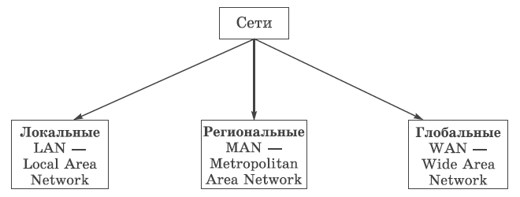
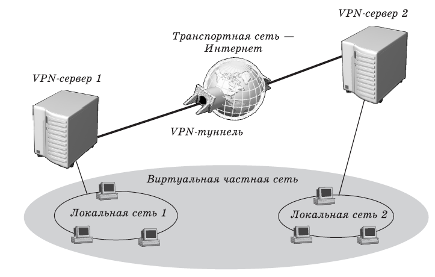
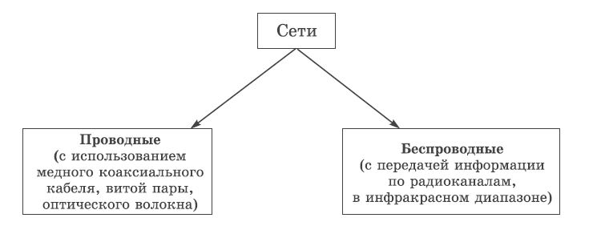
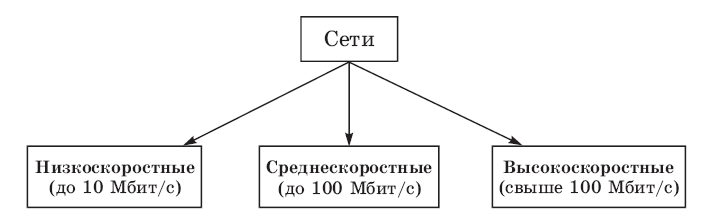
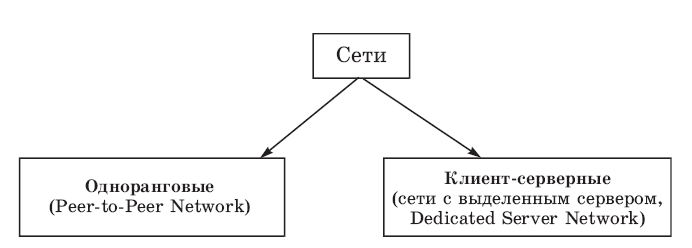
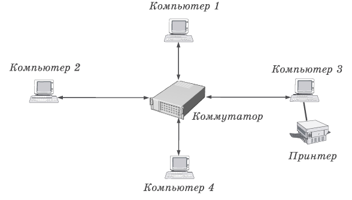
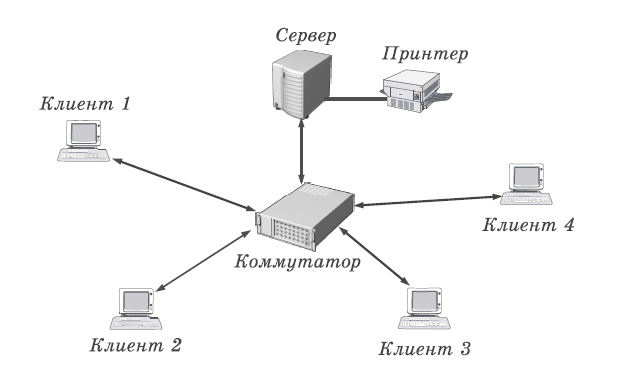

**Тема 21 Классификация антивирусных программ**

1 Фильтры

2 Детекторы

3 Ревизоры

4 Доктора

5 Вакцинаторы

6 Локальная вычислительная сеть

7 Региональная сеть

8 Глобальная сеть

**Антивирусная программа (антивирус)** - программа для выявления и удаления компьютерных вирусов и других вредоносных программ, предотвращения их распространения, а также восстановления программ, зараженных ими.

Основные задания современных антивирусных программ:

- ` `Сканирование файлов и программ в режиме реального времени.
- ` `Сканирование компьютера по требованию.
- ` `Сканирование интернет-трафика.
- ` `Сканирование электронной почты.
- ` `Защита от атак опасных веб-узлов.
- ` `Восстановление поврежденных файлов (лечение).

Классификация антивирусных программ:

- ` `**программы-детекторы** обеспечивают поиск и обнаружение вирусов в оперативной памяти и на внешних носителях, и при обнаружении выдают соответствующее сообщение. Различают детекторы:

\1. **универсальные** - используют в своей работе проверку неизменности файлов путем подсчета и сравнения с эталоном контрольной суммы

\2. **специализированные** - выполняют поиск известных вирусов по их сигнатуре (повторяющемуся участку кода). Недостаток таких детекторов состоит в том, что они неспособны обнаруживать все известные вирусы.

Детектор, позволяющий обнаруживать несколько вирусов, называют полидетектором. Недостатком таких антивирусных про грамм является то, что они могут находить только те вирусы, которые известны разработчикам таких программ.

- ` `**Программы-доктора (фаги)** не только находят зараженные вирусами файлы, но и "лечат" их, т.е. удаляют из файла тело программы вируса, возвращая файлы в исходное состояние. В начале своей работы фаги ищут вирусы в оперативной памяти, уничтожая их, и только затем переходят к "лечению" файлов. Среди фагов выделяют полифаги, т.е. программы-доктора, предназначенные для поиска и уничтожения большого количества вирусов. Учитывая, что постоянно появляются новые вирусы, программы-детекторы и программы-доктора быстро устаревают, и требуется регулярное обновление их версий.
- ` `**Программы-ревизоры** относятся к самым надежным средствам защиты от вирусов. Ревизоры запоминают исходное состояние программ, каталогов и системных областей диска тогда, когда компьютер не заражен вирусом, а затем периодически или по желанию пользователя сравнивают текущее состояние с исходным. Обнаруженные изменения выводятся на экран монитора. Как правило, сравнение состояний производят сразу после загрузки операционной системы. При сравнении проверяются длина файла, код циклического контроля (контрольная сумма файла), дата и время модификации, другие параметры.
- ` `**Программы-фильтры (сторожа)** представляют собой небольшие резидентные программы, предназначенные для обнаружения подозрительных действий при работе компьютера, характерных для вирусов. Такими действиями могут являться:

\1. попытки коррекции файлов с расширениями СОМ и ЕХЕ;

\2. изменение атрибутов файлов;

\3. прямая запись на диск по абсолютному адресу;

\4. запись в загрузочные сектора диска;

\5. загрузка резидентной программы.

**Программы-вакцины (иммунизаторы)** — это резидентные программы, предотвращающие заражение файлов. Вакцины применяют, если отсутствуют программы-доктора, "лечащие" этот вирус. Вакцинация возможна только от известных вирусов. Вакцина модифицирует программу или диск таким образом, чтобы это не отражалось на их работе, а вирус будет воспринимать их зараженными и поэтому не внедрится. Существенным недостатком таких программ является их ограниченные возможности по предотвращению заражения от большого числа разнообразных вирусов.

**Функции антивирусных программ**

Защита от вирусов в реальном времени

Большинство антивирусных программ предлагает защиту в режиме реального времени. Это означает, что антивирусная программа ежесекундно защищает ваш компьютер от всех поступающих угроз. Таким образом, даже если вирус не заразил ваш компьютер, вы должны рассмотреть установку антивирусной программы с режимом защиты в реальном времени с целью предотвращения дальнейшего распространения инфекции.

**Обнаружение угроз**

Антивирусные программы могут сканировать весь компьютер в поисках вирусов. Прежде всего сканируются наиболее уязвимые области, системные папки, оперативная память. Вы также можете сами выбирать сектора сканирования, или выбрать, например, проверку конкретного жесткого диска. Однако, не все антивирусы одинаковы в своих алгоритмах, и некоторые антивирусные программы имеют более высокий уровень обнаружения, чем другие.

**Автоматические обновления**

Новые вирусы создаются и появляются каждый день. Поэтому, крайне важным для антивирусных программ является возможность обновления антивирусных баз (списка всех известных вирусов, как старых, так и новых). Автоматическое обновление является необходимым, потому что устаревший антивирус не может обнаруживать новые вирусы и угрозы. Кроме того, если антивирусная программа предлагает только ручное обновление вы можете забывать обновлять антивирусные определения, а ваш компьютер может заразиться новым вирусом. Постарайтесь выбрать антивирус с автоматическим обновлением.

**Оповещения**

Антивирус предупредит вас, когда какая-либо программа попытается получить доступ к вашему компьютеру. Примером могут служить Интернет-приложения. Многие программы, которые пытаются получить доступ к вашему ПК, безвредны или же вы загрузили их добровольно и, таким образом, антивирусные программы дают вам возможность принять решение самим - разрешать или блокировать их установку или работу.

**6 Локальные компьютерные сети.**

Возможно множество различных способов классификации компьютерных сетей. Рассмотрим только основные из них.

В зависимости от расстояния между связываемыми узлами сети можно разделить на три основных класса: *локальные, региональные и глобальные* (рис. 1).

Рис. 1. Классификация сетей по расстоянию между узлами

***Локальная вычислительная сеть*** (ЛВС) —небольшая группа компьютеров, связанных друг с другом и расположенных обычно в пределах одного здания или организации.

***Региональная сеть***— сеть, соединяющая множество локальных сетей в рамках одного района, города или региона.

***Глобальная сеть*** — сеть, объединяющая компьютеры разных городов, регионов и государств.

Объединение глобальных, региональных и локальных вычислительных сетей позволяет создавать многоуровневые иерархии, которые предоставляют мощные средства для обработки огромных массивов данных и доступ к практически неограниченным информационным ресурсам.

Локальные вычислительные сети (ЛВС) могут входить в качестве компонентов в состав региональной сети; региональные сети — объединяться в составе глобальной сети; наконец, глобальные сети могут образовывать еще более крупные структуры. Самым большим объединением компьютерных сетей в масштабах планеты Земля на сегодня является «сеть сетей» — Интернет.

Интересным примером связи локальных и глобальных сетей является виртуальная частная сеть (Virtual Private Network, VPN). Так называется сеть организации, получающаяся в результате объединения двух или нескольких территориально разделенных ЛВС с помощью общедоступных каналов глобальных сетей, например, через Интернет (Рис. 2).

Рис. 2. Виртуальная частная сеть — несколько локальных сетей предприятия,

объединенных через Интернет

По типу *среды передачи* сети делятся на *проводные и беспроводные* (Рис. 3).

Рис. 3. Классификация сетей по типу среды передачи

По *скорости передачи* информации сети можно разделить на низко-, средне- и высокоскоростные (Рис. 4).

Рис. 4. Классификация сетей по скорости передачи информации

С точки зрения распределения ролей между компьютерами сети бывают *одноранговые* и *клиент-серверные* (рис. 5).

Рис. 5. Классификация сетей по распределению ролей между компьютерами

В **одноранговой сети** (Рис. 6) все компьютеры равноправны. Каждый из них может выступать как в роли сервера, т. е. предоставлять файлы и аппаратные ресурсы (накопители, принтеры и пр.) другим компьютерам, так и в роли клиента, пользующегося ресурсами других компьютеров. Например, если на вашем компьютере установлен принтер, то с его помощью смогут распечатывать свои документы все остальные пользователи сети, а вы, в свою очередь, сможете работать с Интернетом, подключение к которому осуществляется через соседний компьютер.

Рис. 6. Пример одноранговой сети

*Администрирование сети*— решение целого комплекса задач по управлению работой компьютеров, сетевого оборудования и пользователей, защите данных, обеспечению доступа к ресурсам, установке и модернизации системного и прикладного программного обеспечения.

*Преимущества одноранговых сетей:*

- легкость в установке и настройке;
- независимость отдельных компьютеров и их ресурсов друг от друга;
- возможность для пользователя контролировать ресурсы своего собственного компьютера;
- сравнительно низкая стоимость развертывания и поддержки;
- отсутствие необходимости в дополнительном программном обеспечении (кроме операционной системы);
- отсутствие необходимости в постоянном присутствии администратора сети

*Недостатки одноранговых сетей:*

- необходимость помнить столько паролей, сколько имеется разделенных ресурсов (для сетей на основе Windows 95/98), либо имен и паролей для входа (для сетей на основе Windows NT/2000/XP);
- необходимость производить резервное копирование отдельно на каждом компьютере, чтобы защитить все совместно используемые данные;
- отсутствие возможности централизованного управления сетью и доступом к данным;
- как результат — низкая общая защищенность сети и данных

Число компьютеров в одноранговых сетях обычно не превышает 10, отсюда их другое название — рабочая группа. Типичными примерами рабочих групп являются домашние сети или сети небольших офисов.

**Сети с выделенным сервером**(сети типа «клиент-сервер») Как правило, сети создаются в учреждениях или крупных организациях. В таких сетях (Рис. 7) выделяются один или несколько компьютеров, называемых серверами, задача которых состоит в быстрой и эффективной обработке большого числа запросов других компьютеров — клиентов. При этом клиентские запросы бывают самыми разными, начиная с простейшей проверки имени и пароля пользователя при входе в систему и заканчивая сложными поисковыми запросами к базам данных, на обработку которых даже современный многопроцессорный компьютер может потратить несколько часов.

Рис. 7. Пример сети с выделенным сервером

**Сервер**— специально выделенный высокопроизводительный компьютер, оснащенный соответствующим программным обеспечением, централизованно управляющий работой сети и/или предоставляющий другим компьютерам сети свои ресурсы (файлы данных, накопители, принтер и т. д.).

**Клиентский компьютер** (клиент, рабочая станция) — компьютер рядового пользователя сети, получающий доступ к ресурсам сервера (серверов).

Обычно в роли серверов выступают более мощные и надежные компьютеры, чем пользовательские рабочие станции. Серверы часто оснащают специализированным оборудованием, например емкими хранилищами данных (жесткими дисками и так называемыми «рейд-массивами» на их основе), накопителями на магнитной ленте для резервного копирования, высокоскоростными сетевыми адаптерами и т. д. Такие компьютеры работают постоянно, круглосуточно предоставляя пользователям свои ресурсы и обеспечивая доступ к своим службам.

*Преимущества клиент-серверных сетей:*

- использование мощного серверного оборудования обеспечивает быстрый доступ к ресурсам и эффективную обработку запросов клиентов: один сервер может обслуживать тысячи пользователей;
- централизация данных и ресурсов позволяет наладить четкое управление информацией и пользовательскими данными;
- размещение данных на сервере существенно упрощает процедуры резервного копирования;
- повышается общая защищенность сети и сохранность данных

*Недостатки*:

- неисправность сервера может сделать всю сеть практически неработоспособной, а ресурсы — недоступными;
- сложность развертывания и поддержки требует наличия квалифицированного персонала, что увеличивает общую стоимость сопровождения сети;
- стоимость сопровождения сети также увеличивается из-за потребности в выделенном оборудовании и специализированном программном обеспечении;
- требуется один (а чаще всего — несколько) постоянно присутствующих на рабочем месте администраторов

**Службы (services)**— работающие на серверах программы, выполняющие какие-либо действия по запросу клиента.

