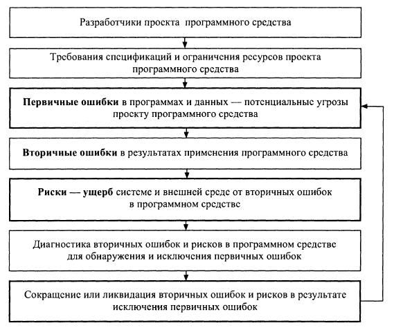

**Тема 18 Статистика ошибок и дефектов в комплексах программ и их характеристики в конкретных типах проектов ПС**

1 Общие особенности дефектов, ошибок и рисков в сложных программных средствах

2 Причины и свойства дефектов, ошибок и модификаций в сложных программных средствах

3 Риски в жизненном цикле сложных программных средств

4 Риски при формировании требований к характеристикам сложных программных средств

1. **Общие особенности дефектов, ошибок и рисков в сложных программных средствах**

*Статистика ошибок и дефектов в комплексах программ и их характеристики* в конкретных типах проектов ПС, могут служить *ориентирами* для разработчиков при распределении ресурсов в жизненном цикле ПС и предохранять их от излишнего оптимизма при оценке достигнутого качества программных продуктов. Источниками ошибок в ПС являются специалисты – конкретные люди с их индивидуальными особенностями, квалификацией, талантом и опытом. При этом можно выделить ***предсказуемые модификации, расширения и совершенствования ПС*** и изменения, обусловленные выявлением случайных, ***непредсказуемых дефектов и ошибок***. Вследствие этого, плотность потоков и размеры необходимых корректировок в модулях и компонентах при разработке и сопровождении ПС может различаться в десяток раз. Однако, в крупных комплексах программ статистика и распределение типов выполняемых изменений для коллективов разных специалистов нивелируются и проявляются достаточно общие закономерности, которые могут использоваться как ориентиры при их выявлении и систематизации. Этому могут помогать оценки типовых дефектов, модификаций и корректировок, путем их накопления и обобщения по опыту создания определенных классов ПС в конкретных предприятиях.

К ***понятию риски*** относятся негативные события и их величины, отражающие потери, убытки или ущерб от процессов или продуктов, ***вызванные дефектами*** при проектировании требований, недостатками обоснования проектов ПС, а также при последующих этапах разработки, реализации и всего жизненного цикла комплексов программ. В ЖЦ ПС не всегда удается достигнуть требуемого положительного эффекта и может проявляться некоторый ущерб – риск в создаваемых проектах, программных продуктах и их характеристиках. Риски проявляются, как ***негативные последствия дефектов функционирования и применения ПС***, которые способны вызвать ущерб системе, внешней среде или пользователю, в результате отклонения характеристик объектов или процессов, от заданных требованиями заказчика, согласованными с разработчиками.

Оценки качества программных средств могут проводиться с двух позиций: с ***позиции положительной*** эффективности и непосредственной адекватности их характеристик назначению, целям создания и применения, а также с ***негативной позиции*** возможного при этом ущерба – риска от использования ПС или системы. Показатели качества преимущественно отражают положительный эффект от применения системы или ПС и основная задача разработчиков проекта состоит в обеспечении высоких значений качества. Риски характеризуют возможные ***негативные последствия дефектов*** или ущерб пользователей при применении и функционировании ПС и системы, и задача разработчиков сводится к сокращению дефектов и ликвидации рисков. Поэтому методы и системы управления качеством в жизненном цикле ПС близки к методам анализа и управления рисками проектов комплексов программ, они должны их дополнять и совместно способствовать совершенствованию программных продуктов и систем на их основе.

Характеристики дефектов и рисков непосредственно связаны с достигаемой корректностью, безопасностью и надежностью функционирования программ и *помогают*:

\-  оценивать реальное состояние проекта и планировать необходимую трудоемкость и длительность для его положительного завершения;

\-  выбирать методы и средства автоматизации тестирования и отладки программ, адекватные текущему состоянию разработки и сопровождения ПС, наиболее эффективные для устранения определенных видов дефектов и рисков;

\-  рассчитывать необходимую эффективность контрмер и дополнительных средств оперативной защиты от потенциальных дефектов и не выявленных ошибок;

\-  оценивать требующиеся ресурсы ЭВМ по расширению памяти и производительности, с учетом затрат на реализацию контрмер при модификации и устранении ошибок и рисков.

*Понятие ошибки в программе* – в общем случае под ошибкой подразумевается неправильность, погрешность или неумышленное искажение объекта или процесса, что может быть *причиной ущерба – риска* при функционировании и применении программы. При этом предполагается, что *известно правильное, эталонное состояние объекта или процесса*, по отношению к которому может быть определено наличие отклонения – ошибки или дефекта. Исходным эталоном для любого ПС являются спецификация требований заказчика или потенциального пользователя, предъявляемых к программам. Подобные документы устанавливают состав, содержание и значения результатов, которые должен получать пользователь при определенных условиях и исходных данных. Любое отклонение результатов функционирования программы от предъявляемых к ней требований и сформированных по ним эталонов-тестов, следует квалифицировать как *ошибку – дефект в программе*, наносящий некоторый ущерб. Различие между ожидаемыми и полученными результатами функционирования программ могут быть следствием ошибок не только в созданных программах, но и ошибок в первичных требованиях спецификаций, явившихся базой при создании эталонов-тестов. Тем самым проявляется объективная реальность, заключающаяся в невозможности абсолютной корректности и полноты исходных спецификаций и эталонов для сложных проектов ПС.

На практике в процессе ЖЦ ПС исходные требования поэтапно уточняются, модифицируются, расширяются и детализируются по согласованию между заказчиком и разработчиком. Базой таких уточнений являются ***неформализованные представления и знания*** специалистов-заказчиков и разработчиков, а также результаты промежуточных этапов проектирования. Однако установить не корректность таких эталонов еще труднее, чем обнаружить дефекты в сопровождаемых программах, так как принципиально отсутствуют формализованные данные, которые можно использовать как исходные. В процессе декомпозиции и верификации исходной спецификации требований на ПС, возможно появление ошибок в спецификациях на группы программ и на отдельные модули. Это способствует расширению спектра возможных дефектов и вызывает необходимость создания гаммы методов и средств тестирования для выявления некорректностей в спецификациях на компоненты разных уровней.

Важной особенностью процесса выявления ошибок в программах является **отсутствие полностью определенной программы-эталона**, которой должны соответствовать текст и результаты функционирования разрабатываемой программы. Поэтому установить наличие и локализовать дефект непосредственным сравнением с программой без ошибок в большинстве случаев невозможно. При отладке и тестировании обычно сначала обнаруживаются **вторичные** ошибки и ***риски***, т. е. последствия и результаты проявления некоторых внутренних дефектов или некорректностей программ (рис 1). 

Рис 1.

Эти внутренние ***дефекты*** следует квалифицировать как **первичные** ошибки или причины обнаруженных аномалий результатов. Последующая локализация и корректировка таких первичных ошибок должна приводить к устранению ошибок, первоначально обнаруживаемых в результатах функционирования программ.

Потери эффективности и риски программ за счет неполной корректности в первом приближении можно считать прямо пропорциональными (с коэффициентом) вторичным ошибкам в выходных результатах. Типичным является случай, когда одинаковые по величине и виду вторичные ошибки в различных результирующих данных существенно различаются по своему воздействию на общую эффективность и риски применения комплекса программ. Это влияние вторичных ошибок, в лучшем случае, можно оценить методами экспертного анализа при условии предварительной, четкой классификации видов возможных первичных ошибок в программах и выходных величин. Таким образом, оценка последствий, отражающихся на вторичных ошибках и функционировании программ, может, в принципе, производиться ***по значениям ущерба – риска вследствие не устраненных их причин – первичных ошибок в программе***. Вторичные ошибки являются определяющими для эффективности функционирования программ, однако не каждая первичная ошибка вносит заметный вклад в выходные результаты. Вследствие этого ряд первичных ошибок может оставаться не обнаруженным и, по существу, не влияет на функциональные характеристики ПС.

Появление ошибок в программах, естественно, предшествует их обнаружению и устранению на основе вторичных проявлений. Наибольшее число первичных ошибок вносится на этапах системного анализа и разработки модификаций программ. При этом на долю системного анализа приходятся наиболее сложные для обнаружения и устранения дефекты. На последующих этапах разработки изменений ПС ошибки вносятся и устраняются в программах в процессе их корректировки по результатам тестирования. Общие тенденции состоят в быстром росте затрат на выполнение каждого изменения на последовательных этапах процессов модификации программ.

При системном анализе модификаций интенсивность обнаружения ошибок относительно не велика, и ее трудно выделить из процесса проектирования ПС. Интенсивность проявления и обнаружения вторичных ошибок наиболее велика на этапе активного тестирования и автономной отладки программных компонентов. Затем она снижается приблизительно экспоненциально. Различия интенсивностей ***устранения первичных ошибок, на основе их вторичных проявлений***, и внесения первичных ошибок при корректировках программ определяют скорость достижения заданного качества версий ПС. Уровень серьезности последствий ошибок варьирует от классов проектов и от предприятия, но, в общем, можно разделить ошибки на три уровня.

***Небольшими ошибками*** называют такие, на которые средний пользователь не обратит внимания при применении ПС, вследствие отсутствия их проявления, и последствия которых обычно так и не обнаруживаются. Небольшие ошибки могут включать орфографические ошибки на экране, пропущенные разделы в справочнике и другие мелкие проблемы. Такие ошибки никогда не помешают выпуску и применению версии системы и программного продукта. По десятибалльной шкале рисков небольшие ошибки находятся в пределах от 1 до 3 приоритета.

***Умеренными ошибками*** называют те, которые влияют на конечного пользователя, но имеются слабые последствия или обходные пути, позволяющие сохранить достаточную функциональность ПС. Это такие дефекты, как неверные ссылки на страницах, ошибочный текст на экране и даже сбои, если эти сбои трудно воспроизвести, и они не оказывают влияния на существенное число пользователей. Некоторые умеренные ошибки, возможно, проникают в конечный программный продукт. Ошибки, которые можно исправить на этом уровне, следует исправлять, если на это есть время и возможность. По десятибалльной шкале умеренные ошибки находятся в диапазоне от 4 до 7 приоритета.

***Критические ошибки*** останавливают выпуск версии программного продукта. Это могут быть ***ошибки с высоким влиянием***, которые вызывают сбой в системе или потерю данных, отражаются на надежности и безопасности применения ПС, с которыми никогда не передается комплекс программ пользователю. По десятибалльной шкале – от 8 до 10 приоритета.

Совокупность ошибок, дефектов и последствий модификаций проектов крупномасштабных комплексов программ можно упорядочить и условно представить в виде перевернутой пирамиды в зависимости от потенциальной опасности и возможной величины корректировок их последствий – рис. 2. 

Рис 2

В верхней части перечня расположены модификации, дефекты и ошибки, последствия которых обычно требуют наибольших затрат ресурсов для реализации изменений, и они постепенно сокращаются при снижении по перечню. Такое представление величины типов корректировок программ и данных полезно использовать ***как ориентир*** для учета необходимых ресурсов при разработке и сопровождении ПС, однако оно может содержать значительные отклонения при упорядочении статистических данных реальных проектов. Каждому типу корректировок соответствует более или менее определенная категория специалистов, являющихся источником изменений данного типа (таблица 1). Такую корреляцию целесообразно рассматривать и учитывать как общую качественную тенденцию при анализе и поиске их причин.

Таблица 1

|**Специалисты— источники дефектов и ошибок**|**Типы первичных дефектов и ошибок программного средства и документации**|
| - | - |
|Заказчики проекта|Дефекты организации проекта и исходных требований заказчика|
|Менеджер проекта|Дефекты, обусловленные реальной сложностью проекта|
|Менеджер-архитектор комплекса программ|Ошибки планирования и системного проектирования программного средства|
|Проблемно-ориентированные аналитики и системные архитекторы|Системные и алгоритмические дефекты и ошибки проекта|
|Спецификаторы компонентов проекта|Алгоритмические ошибки компонентов и документов программного средства|
|Разработчики программных компонентов — программисты|Программные дефекты и ошибки компонентов и документов программного средства|
|Системные интеграторы|Системные ошибки и дефекты реализации версий программного средства и документации|
|Тестировщики|Программные и алгоритмические ошибки программного средства и документации|
|Управляющие сопровождением и конфигурацией, инструкторы интерфейсов|Ошибки проектирования и реализации версий программного продукта|
|Документаторы|Дефекты и ошибки обобщающих документов|

1. **Причины и свойства дефектов, ошибок и модификаций в сложных программных средствах**

Одной из основных причин изменений комплексов программ являются ***организационные дефекты при модификации и расширении функций ПС**,* которые отличаются от остальных типов и условно могут быть выделены как самостоятельные (см. рис. 10.2). Ошибки и дефекты данного типа появляются из-за недостаточного понимания коллективом специалистов технологии процесса ЖЦ ПС, а также вследствие отсутствия четкой его организации и поэтапного контроля качества продуктов и изменений. Это порождается пренебрежением руководителей к организации всего технологического процесса ЖЦ сложных ПС и приводит к серьезной недооценке его дефектов, а также трудоемкости и сложности модификаций. При отсутствии планомерной и методичной разработки и тестирования изменений ПС, остается не выявленным значительное количество ошибок, и, прежде всего, дефекты взаимодействия отдельных функциональных компонентов между собой и с внешней средой. Для сокращения этого типа массовых ошибок, активную роль должны играть лидеры – менеджеры и системотехники, способные вести контроль и конфигурационное управление требованиями, изменениями и развитием версий и компонентов ПС.

***Изменения характеристик системы и внешней среды***, принятые в процессе разработки ПС за исходные, могут быть результатом аналитических расчетов, моделирования или исследования аналогичных систем. В ряде случаев может отсутствовать полная адекватность предполагаемых и реальных характеристик, что является ***причиной сложных и трудно обнаруживаемых системных ошибок и дефектов развития проекта***. Ситуация с такими ошибками дополнительно усложняется тем, что эксперименты по проверке взаимодействия ПС с реальной внешней средой во всей области изменения параметров зачастую сложны и дороги, а в отдельных случаях, при создании опасных ситуаций, недопустимы. В этих случаях приходится использовать моделирование и имитацию внешней среды с заведомым упрощением её отдельных элементов и характеристик, хотя степень упрощения не всегда удается оценить с необходимой точностью. Однако полной адекватности моделей внешней среды и реальной системы добиться трудно, а во многих случаях и невозможно, что может являться причиной значительного числа крупных дефектов.

Первичные ошибки в программах проектов можно анализировать с разной степенью детализации и в зависимости от различных факторов. Практический опыт показал, что ***наиболее существенными факторами, влияющими на характеристики обнаруживаемых ошибок являются***:

\-  методология, технология и уровень автоматизации системного и структурного проектирования ПС, а также непосредственного программирования компонентов;

\-  длительность с начала процесса тестирования и текущий этап разработки или сопровождения и модификации комплекса программ;

\-  класс ПС, масштаб (размер) и типы компонентов, в которых обнаруживаются ошибки;

\-  методы, виды и уровень автоматизации верификации и тестирования, их адекватность характеристикам компонентов и потенциально возможным в программах ошибкам;

\-  виды и достоверность эталонов-тестов, которые используются для обнаружения ошибок.

***Первичные ошибки в ПС в порядке уменьшения их влияния на*** сложность обнаружения и масштабы корректировок можно разделить на следующие группы:

\-  ошибки, обусловленные сложностью компонентов и ПС в целом и наиболее сильно влияющие на размеры модификаций;

\-  ошибки вследствие большого масштаба – размера комплекса программ, а также высоких требований к его качеству;

\-  ошибки планирования и корректности требований модификаций часто могут быть наиболее критичным для общего успеха ЖЦ ПС и системы;

\-  ошибки проектирования, разработки структуры и функций ПС в более полные и точные технические описания сценариев того, как комплекс программ и система будут функционировать;

\-  системные ошибки, обусловленные отклонением функционирования ПС в реальной системе, и характеристик внешних объектов от предполагавшихся при проектировании;

\-  алгоритмические ошибки, связанные с неполным формированием необходимых условий решения и некорректной постановкой целей функциональных задач;

\-  ошибки реализации спецификаций изменений – программные дефекты, возможно, ошибки нарушения требований или структуры компонентов ПС;

\-  программные ошибки, вследствие неправильной записи текстов программ на языке программирования и ошибок трансляции текстов изменений программ в объектный код;

\-  ошибки в документации, которые наиболее легко обнаруживаются и в наименьшей степени влияют на функционирование и применение версий ПС;

\-  технологические ошибки подготовки физических носителей и документации, а также ввода программ в память ЭВМ и вывода результатов на средства отображения.

***Сложность проявления, обнаружения и устранения ошибок*** значительно конкретизируются и становятся измеримой, когда устанавливается связь этого понятия с конкретными ресурсами, необходимыми для решения соответствующей задачи и возможными проявлениями дефектов. При разработке и сопровождении программ основным лимитирующим ресурсом обычно являются допустимые трудозатраты специалистов, а также ограничения на сроки разработки, параметры ЭВМ, технологию проектирования корректировок ПС. Показатели сложности при анализе можно разделить на ***две большие группы***:

\-  ***сложность ошибок при создании корректировок*** компонентов и комплекса программ - статическая сложность, когда реализуются его требуемые функции, вносятся основные дефекты и ошибки;

\-  ***сложность проявления ошибок функционирования*** программ и получения результатов - динамическая сложность, когда проявляются дефекты и ошибки, отражающиеся на функциональном назначении, рисках и качестве применения версии ПС.

К группе факторов, влияющих на ***сложность ошибок*** комплексов программ, относятся:

\-  величина – размер модифицируемой программы, выраженная числом строк текста, функциональных точек или количеством программных модулей в комплексе;

\-  количество обрабатываемых переменных или размер и структура памяти, используемой для размещения базы данных корректировок;

\-  трудоемкость разработки изменений комплекса программ;

\-  длительность разработки и реализации корректировок;

\-  число специалистов, участвующих в ЖЦ комплекса программ.

Некоторые из перечисленных параметров коррелированны между собой, причем, определяющими часто являются размер изменений программы и объем базы данных. Остальные характеристики можно рассматривать как вторичные, однако они могут представлять самостоятельный интерес при анализе сложности и прогнозировании вероятного числа дефектов в измененной программе. ***Сложность ошибок*** комплексов программ целесообразно анализировать на базе трех наиболее специфических компонентов:

\-  ***сложность ошибок изменяемых программных компонентов и модулей*** определяется конструктивной сложностью модификации оформленного компонента программы и может быть оценена с позиции сложности внутренней структуры и преобразования данных в каждом модуле, а также интегрально по некоторым внешним статистическим характеристикам размеров модулей;

\-  ***сложность ошибок корректировок структуры комплекса*** или компонентов и связей между модулями по передачам управления и по обмену информацией определяется глубиной взаимодействия модулей и регулярностью структуры межмодульных связей;

\-  ***сложность ошибок изменения структуры данных*** определяется количеством и структурой глобальных и обменных переменных в базе данных, регулярностью их размещения в массивах, а также сложностью доступа к этим данным.

***Масштаб – размер комплексов программ и их изменяемой части*** наиболее сильно влияет на количество ошибок, а также на требования к ***качеству*** ПС (см. лекцию 5). Качество откорректированного ПС характеризуется многими показателями, состав которых зависит от класса и конкретного назначения комплекса программ. Ниже предполагается, что всегда модификации ПС соответствуют заданному функциональному назначению и основным требованиям заказчика к их качеству. По мере увеличения размера и повышения требований к качеству ПС и его корректировкам, затраты на обнаружение и устранение ошибок ПС увеличиваются все более высокими темпами. Одновременно расширяется диапазон неопределенности достигаемого качества. В зоне высокого качества программ возрастают трудности измерения этих характеристик, что может приводить к необходимости изменения затрат в несколько раз в зависимости от применяемых методов и результатов оценки качества ПС. Вследствие этого в ЖЦ сложных и сверхсложных ПС всегда велики проявления не устраненных ошибок и недостаточна достоверность оценок достигнутого качества.

***Ошибки корректности формирования и планирования выполнения требований к ПС*** часто считаются наиболее критичным для общего успеха версий программного продукта и системы. Ошибки требований являются наиболее трудными для обнаружения и наиболее сложными для исправления. Вот почему исправление ошибок требований может быть в 15 – 70 раз дороже, чем ошибок их программирования. Требование к изменению может быть пропущено в спецификации к системе и ПС. Это ведет к неудовлетворенности пользователя, и программа считается заказчиком и пользователем ошибочной. Пропуск некоторых требования – это наиболее обычная проблема среди ошибок требований. Ошибка требований может представлять собой конфликтующие требования в спецификации модификаций. Например, два требования, которым необходимо следовать, имеют противоположный смысл. Может проявляться неопределенность требований – такой способ формулирования требования, что даже если и не конфликтует с другим требованием, оно выражено недостаточно ясно, чтобы привести к единственному, конструктивному решению при разработке изменения. Конечный пользователь часто называет это ошибкой, хотя на самом деле это выбор конструктивного решения на основе неполного или неопределенного требования. Многочисленные исследования показали, что ошибки требований дороже всего исправить и труднее всего обнаружить.

***Ошибки проектирования и разработки структуры ПС*** определяются процессами перевода неопределенных и общих положений, сделанных на стадии спецификаций требований, в более точные технические описания сценариев того, как измененные ПС и система должны работать. Ошибки структуры легче обнаружить, чем ошибки требований, но они в конечном итоге могут оказаться при корректировках такими же дорогостоящими. Главная причина того, что ошибки структуры дорого исправлять, состоит в том, что они могут влиять на систему в целом. Исправление изменений всей системы сложнее, и при этом возникает большая опасность занести новые ошибки, чем при исправлении нескольких нарушенных строк кода или при замене одного модуля.

Ошибки структуры можно разделить на три категории: пропуски, конфликты и ошибки перевода. Пропуски означают неспособность включить изменения одного или более требований в окончательную структуру ПС. Когда пропуск новой функции или компонента попадает в окончательную структуру, он станет ошибкой в конечном программном продукте. Конфликты возникают, когда модификация двух различных, конструктивных свойств имеют конфликтующую структуру. Это может происходить в случае явного конфликта, когда в структуре установлено, что файл может быть открыт двумя разными людьми в одно и то же время, тогда как в базовом классе определяется только однопользовательский доступ. Ошибки, которые основаны на конфликтах на этом уровне, часто невозможно исправить без полного переписывания модулей версии ПС.

Ошибки перевода – наиболее коварные среди всех ошибок структурного уровня. Они проявляются, когда требования заказчика интерпретируются неправильно, по крайней мере, с точки зрения конечного пользователя. Если разработчик структуры либо неверно прочитает требования, либо не увидит содержание требования также как конечный пользователь, появится ошибка разработки структуры данного компонента или ПС.

***Системные ошибки в ПС*** определяются, прежде всего, неполной информацией о реальных процессах, происходящих в источниках и потребителях информации. Кроме того, эти процессы зачастую зависят от самих алгоритмов и поэтому не могут быть достаточно определены и описаны заранее без исследования изменений функционирования ПС во взаимодействии с внешней средой. На начальных этапах не всегда удается точно и полно сформулировать целевую задачу всей системы, а также целевые задачи основных групп программ, и эти задачи уточняются в процессе проектирования. В соответствии с этим уточняются и конкретизируются спецификации на отдельные компоненты и выявляются отклонения от уточненного задания, которые могут квалифицироваться как системные ошибки.

Характеристики внешних объектов, принятые в качестве исходных данных в процессе разработки алгоритмов, могут являться результатом аналитических расчетов, моделирования или исследования аналогичных систем. Во всех случаях может отсутствовать полная адекватность условий получения предполагаемых и реальных характеристик внешней среды, что является причиной сложных и трудно обнаруживаемых ошибок. Это усугубляется тем, что очень часто невозможно заранее предусмотреть все разнообразие возможных внешних условий и реальных сценариев функционирования и применения версий программного продукта.

При автономной и в начале комплексной отладки версий ПС, относительная доля системных ошибок может быть невелика (около 10%), но она существенно возрастает (до 35–40%) на завершающих этапах комплексной отладки новых базовых версий ПС. В процессе сопровождения системные ошибки являются преобладающими (около 60 – 80% от всех ошибок). Следует также отметить большое количество команд, корректируемых при исправлении каждой такой ошибки (около 20 – 50 команд на одну ошибку).

***Алгоритмические ошибки*** программ трудно поддаются обнаружению методами статического автоматического контроля. Трудность их обнаружения и локализация определяется, прежде всего, отсутствием для многих логических программ строго формализованной постановки задачи, полной и точной спецификации, которую можно использовать в качестве эталона для сравнения результатов функционирования программ. К алгоритмическим ошибкам следует отнести, прежде всего, ошибки, обусловленные некорректной постановкой требований к функциональным задачам, когда в спецификациях не полностью оговорены все условия, необходимые для получения правильного результата. Эти условия формируются и уточняются в значительной части в процессе тестирования и выявления ошибок в результатах функционирования программ. Ошибки, обусловленные не полным учетом всех условий решения задач, являются наиболее частыми в этой группе и составляют до 50 – 70% всех алгоритмических ошибок.

К алгоритмическим ошибкам следует отнести также ошибки интерфейса модулей и функциональных групп программ, когда информация, необходимая для функционирования некоторой части программы, оказывается не полностью подготовленной программами, предшествующими по времени включения, или неправильно передается информация и управление между взаимодействующими модулями. Этот вид ошибок составляет около 10% от общего количества, и можно квалифицировать как ошибки некорректной постановки задач. Алгоритмические ошибки проявляются в неполном учете диапазонов изменения переменных, в неправильной оценке точности используемых и получаемых величин, в неправильном учете корреляции между различными переменными, в неадекватном представлении формализованных условий решения задачи в виде частных спецификаций или блок-схем, подлежащих программированию. Эти обстоятельства являются причиной того, что для исправления каждой алгоритмической ошибки приходится изменять в среднем около 20 команд (строк текста), т. е. существенно больше, чем при программных ошибках.

Особую, весьма существенную, часть алгоритмических ошибок в системах реального времени, при сопровождении составляют просчеты в использовании доступных ресурсов вычислительной системы. Получающиеся при модификации программ попытки превышения использования выделенных ресурсов, следует квалифицировать как ошибку, так как затем всегда следует корректировка с целью удовлетворения имеющимся ограничениям. Одновременная разработка множества модулей различными специалистами затрудняет оптимальное и сбалансированное распределение ограниченных ресурсов ЭВМ по всем задачам, так как отсутствуют достоверные данные потребных ресурсов для решения каждой из них. В результате возникает либо не достаточное использование, либо, в подавляющем большинстве случаев, нехватка каких-то ресурсов ЭВМ для решения задач в первоначальном варианте. Наиболее крупные просчеты обычно допускаются при оценке времени реализации различных групп программ реального времени, и при распределении производительности ЭВМ. Алгоритмические ошибки этого типа обусловлены технической сложностью расчета времени реализации программ и сравнительно невысокой достоверностью, определения вероятности различных маршрутов обработки информации.

***Ошибки реализации спецификаций компонентов*** – это программные дефекты, возможно, ошибки требований, структуры или программные ошибки компонентов. Ошибки реализации наиболее обычны, и, в общем, наиболее легки для исправления в системе, что не делает проблему легче для программистов (см. таблицу 10.1). В отличие от ошибок требований и структурных ошибок, которые обычно специфичны для приложения, программисты часто совершают при кодировании одни и те же виды ошибок.

Первую категорию составляют дефекты, которые приводят к отображению для пользователя сообщений об ошибках при точном следовании порядку выполнения требуемых функций. Хотя эти сообщения могут быть вполне законны, пользователи могут посчитать это ошибкой, поскольку они делали все правильно и, тем не менее, получили сообщение об ошибке. Часто ошибки этого типа вызваны либо проблемами с ресурсами, либо специфическими зависимостями от данных.

Вторая категория модификаций может содержать ошибки, связанные с дефектами в графическом интерфейсе пользователя. Такие ошибки могут являться либо нестандартными модификациями пользовательского интерфейса, которые приводят к тому, что пользователь совершает неверные действия, либо они могут быть стандартными компонентами пользовательского интерфейса, используемыми иначе, чем ожидает конечный пользователь.

Третья категория может содержать пропущенные на стадии реализации функции, что всегда считается ошибкой, возможно, с большим риском. Многие тестировщики и пользователи бета-версий сообщают об ошибках, которые на самом деле являются желательными улучшениями. В данном случае можно не замечать обнаруженные таким образом отсутствия функций, которых не было в спецификациях.

***Программные ошибки модифицированных компонентов*** по количеству и типам в первую очередь определяются степенью автоматизации программирования и глубиной статического контроля текстов программ. Количество программных ошибок зависит от квалификаций программистов, от общего размера комплекса программ, от глубины информационного взаимодействия модулей и от ряда других факторов. При разработке ПС программные ошибки можно классифицировать по видам используемых операций на следующие крупные группы: ошибки типов операций; ошибки переменных; ошибки управления и циклов. В логических компонентах ПС, эти виды ошибок близки по удельному весу, однако для автоматизации их обнаружения применяются различные методы. На начальных этапах разработки и автономной отладки модулей, программные ошибки составляют около одной трети всех ошибок. Каждая программная ошибка влечет за собой необходимость изменения около 10 команд, что существенно меньше, чем при алгоритмических и системных ошибках.

***Ошибки в документации модификаций*** состоят в том, что система делает что-то одним образом, а документация отражает сценарий, что она должна работать иначе. Во многих случаях права должна быть документация, поскольку она написана на основе оригинальной спецификации требований системы. Иногда документация пишется и включает допущения и комментарии о том, как, по мнению авторов документации, система должна работать. В других случаях ошибку можно проследить не до кода, а до документации конечных пользователей, внутренних технологических документов, характеризующих систему, и даже до экранных подсказок и файлов помощи. Ошибки документации можно разделить на три категории – ***неясность, неполнота и неточность***. Неясность – это когда пользователю не дается достаточно информации, чтобы определить, как сделать процедуру должным образом. Неполная документация оставляет пользователя без информации о том, как правильно реализовать и завершить задачу. Пользователь считает, что задача выполнена, хотя на самом деле это не так. Такие ошибки ведут к тому, что пользователь неудовлетворен версией ПС, даже если программа в действительности может сделать все, что хочет пользователь. Неточная документация – это худший вид ошибок документации. Такие ошибки часто возникают, когда при сопровождении в систему позже вносятся изменения и об этих изменениях не сообщают лицу, пишущему документацию.

***Технологические ошибки*** документации и фиксирования программ в памяти ЭВМ составляют иногда до 10% от общего числа ошибок обнаруживаемых при тестировании. Большинство технологических ошибок выявляется автоматически статическими методами. При ручной подготовке текстов машинных носителей при однократном фиксировании исходные данные имеют вероятность искажения около–на символ. Дублированной подготовкой и логическим контролем вероятность технологической ошибки может быть снижена до уровня–на символ. Непосредственное участие человека в подготовке данных для ввода в ЭВМ и при анализе результатов функционирования программ по данным на дисплеях определяет в значительной степени их уровень достоверности и не позволяет полностью пренебрегать этим типом ошибок в программах.

В ***примере анализа ошибок конкретного крупного проекта***, было принято, что завершилась инспекция начального запрограммированного кода крупного ПС на предмет его соответствия рабочей проектной спецификации, в ходе которой было обнаружено 3,48 ошибок на тысячу строк кода. Наибольшее совпадение аппроксимации рэлеевской кривой распределения ошибок с фактическими данными установлено для момента получения этих данных, ему соответствует значение, равное также 3,48. Значения числа ошибок на тысячу строк получены, при пересчетах на более ранние этапы соответственно эскизного – (3,3) и рабочего – (7,8) проектирования программ. При прогнозировании в соответствии с рэлеевской кривой распределения вероятности проявления дефектов программ, на следующем этапе квалификационного тестирования компонентов следовало ожидать обнаружения около 2,12 ошибок на тысячу строк исходного кода. В случае сохранения той же закономерности, в момент поставки клиенту на испытания, программный продукт мог содержать менее 0,07 ошибок на тысячу строк кода. Отмечается также, что частость проявления 0,1 – 0,05 ошибок на тысячу строк кода, можно считать допустимыми для ответственных систем реального времени.

В исследованиях 20 крупных поставляемых программных продуктов, созданных в 13 различных организациях коллективы специалистов добились среднего уровня 0,06 дефекта на тысячу строк нового и измененного программного кода. При использовании структурного метода в пяти проектах достигнуто 0,04 – 0,075 ошибок на тысячу строк. Таким образом, ***уровень ошибок около 0,05 на тысячу строк кода*** в разных публикациях считается близким к предельному, для высококачественных программных продуктов.

Другим примером оценок уровня ошибок критического ПС особенно высокого качества может служить программный продукт бортовых систем Шатла, созданный NASA. По оценке авторов в нем содержится менее одной ошибки на 10000 строк кода. Однако стоимость программного продукта достигает 1000 $ за строку кода, что в среднем в сто раз больше, чем для административных систем и в десять раз больше, чем – для ряда ординарных критических управляющих систем реально времени.

Приведенные характеристики типов дефектов и количественные данные могут служить ***ориентирами*** ***при прогнозировании возможного наличия не выявленных ошибок*** в ЖЦ различных сложных ПС высокого качества. Следующим логическим шагом процесса их оценивания может быть усреднение для большого числа проектов фактических данных о количестве ошибок на конкретном предприятии, приходящихся на тысячу строк кода, которые обнаружены в различных ПС. Тогда в следующем проекте будет иметься возможность использования этих данных, в качестве меры количества ошибок, обнаружение которых следует ожидать при выполнении проекта с таким же уровнем качества ПС, или с целью повышения производительности при разработке для оценки момента прекращения дальнейшего тестирования. Подобные оценки гарантируют ***от избыточного оптимизма*** при определении сроков и при разработке графиков разработки, сопровождения и реализации модификаций программ с заданным качеством. Непредсказуемость конкретных ошибок в программах приводит к целесообразности последовательного, методичного фиксирования и анализа возможности проявления любого типа дефектов и необходимости их исключения на наиболее ранних этапах ЖЦ ПС при минимальных затратах.

1. **Риски в жизненном цикле сложных программных средств**

Причинами возникновения и проявления рисков могут быть: ***злоумышленные, активные воздействия заинтересованных лиц*** или ***случайные негативные проявления дефектов*** внешней среды, системы или пользователей. В первом случае риски могут быть обусловлены искажениями программ и информационных ресурсов и их уязвимостью от предумышленных, внешних воздействий (атак) с целью незаконного использования или искажения информации и программ, которые по своему содержанию предназначены для применения ограниченным кругом лиц. Для решения этой проблемы созданы и активно развиваются методы, средства и стандарты обеспечения защиты программ и данных от ***предумышленных негативных внешних воздействий***. Специфические факторы обеспечения информационной безопасности и риски, характерные для сложных информационных систем – целостность, доступность и конфиденциальность информационных ресурсов, а также ряд типовых процедур систем защиты – криптографическая поддержка, идентификация и аутентификация, защита и сохранность данных пользователей ***при предумышленных атаках из внешней среды,*** ***далее не рассматриваются.***

***Риски при случайных, дестабилизирующих воздействиях*** дефектов программных средств и отсутствии предумышленного негативного влияния на системы, ПС или информацию баз данных существенно отличаются от предшествующих задач. Эти риски объектов и систем зависят от отказовых ситуаций, отрицательно отражающихся на работоспособности и реализации их основных функций, причинами которых могут быть дефекты и аномалии в аппаратуре, программах, данных или вычислительных процессах. При этом катастрофически, критически или существенно искажается процесс функционирования систем, что может наносить значительный ущерб при их применении. Основными источниками отказовых ситуаций могут быть некорректные исходные требования, сбои и отказы в аппаратуре, дефекты или ошибки в программах и данных функциональных задач, проявляющиеся при их исполнении в соответствии с назначением. При таких воздействиях, внешняя, функциональная работоспособность систем может разрушаться не полностью, однако невозможно полноценное выполнение заданных функций и требований к качеству информации для потребителей. Вредные и катастрофические последствия таких отказов в ряде областей применения систем могут превышать по результатам, последствия злоумышленных воздействий, имеют свою природу, особенности и характеристики.

Рассматриваемые риски могут быть обусловлены нарушениями технологий или ограничениями при использовании ресурсов – бюджета, планов, коллектива специалистов, инструментальных средств, выделенных на разработку ПС. Результирующий ***ущерб*** в совокупности зависит от величины и вероятности проявления каждого негативного воздействия. Этот ущерб – риск характеризуется разнообразными метриками, зависящими от объектов анализа, и в некоторых случаях может измеряться прямыми материальными, информационными, функциональными потерями применяемых ПС или систем. Одним из косвенных методов определения величины риска может быть ***оценка совокупных затрат***, необходимых для ликвидации негативных последствий в ПС, системе или внешней среде, проявившихся в результате конкретного рискового события.

Процессы анализа и сокращения рисков должны сопутствовать основным этапам разработки и обеспечения ЖЦ сложных программных средств в соответствии с международными стандартами, а также методам систем обеспечения качества ПС. Эти процессы могут быть отражены ***пятью этапами работ и процедур***, которые рекомендуется выполнять при поддержке базовых работ жизненного цикла проектов сложных программных средств, и могут служить основой для разработки соответствующих планов работ при управлении и сокращении рисков – рис. 10.3:

\-  анализ рисков следует начинать с подготовки детальных исходных требований и характеристик проекта ПС, системы и внешней среды, для которых должны отсутствовать риски функционирования и применения;

\-  для управления рисками и их сокращения в рассматриваемых проектах сложных комплексов программ рекомендуется выделять три класса рисков: функциональной пригодности ПС, конструктивных характеристик качества и нарушения ограничений ресурсов при реализации процессов ЖЦ ПС;

\-  в каждом классе предлагается анализировать несколько категорий наиболее важных рисков, которые упорядочивать по степени опасности, угроз для проекта, обусловленных ограничениями ресурсов, дефектами и/или недостаточным качеством разработки и жизненного цикла ПС;

\-  контрмеры для сокращения рисков рекомендуется анализировать и применять последовательно, начиная с ликвидации наиболее опасных исходных причин – угроз, затем проводить анализ и уменьшение уязвимости компонентов и ПС в целом, а при недостаточности этих контрмер воздействовать непосредственно на уменьшение итогового ущерба – риска в жизненном цикле ПС и системы;

Рис 3

\-  процессы устранения рисков должны завершаться процедурами мониторинга, сопровождения и конфигурационного управления изменениями версий комплексов программ высокого качества с минимальными допустимыми рисками.

Таким образом, в жизненном цикле программных средств ущерб – риски могут проявляться – рис 4:

Рис 4

\-  в искажениях или не полной реализации требуемого назначения, функций или взаимодействия ПС с компонентами системы или внешней среды – недостатками и дефектами ***функциональной пригодности комплексов программ***;

\-  в недостаточных и не соответствующих требованиям, ***конструктивных характеристиках*** качества ПС при его функционировании и применении по прямому назначению;

\-  в нарушениях ограничений на использование ***экономических, временных или технических ресурсов*** при создании и применении ПС.

Анализ и оценка рисков должны начинаться с исследования понятий, требований и функций, ***способствующих одобрению и применению*** заказчиком и пользователями конкретного программного продукта. При этом должны быть определены требования к характеристикам ПС и оценки возможного ущерба при их нарушении. Исследования процессов разработки проектов ПС показали, что во многих случаях стоимость и длительность их реализации значительно превышали предполагаемые, а характеристики качества не соответствовали требуемым, что наносило ущерб заказчикам, пользователям и разработчикам. Эти потери – ущерб проектов, могли бы быть значительно сокращены своевременным анализом, прогнозированием и корректированием рисков возможного нарушения требований контрактов, технических заданий и спецификаций на характеристики, выделяемые ресурсы и технологию создания комплексов программ.

***Управления рисками*** предполагает ясное понимание внутренних и внешних причин и реальных источников угроз, влияющих на качество проекта ПС, которые могут привести к его провалу или большому ущербу. В результате анализа следует создавать план ***отслеживания изменения рисков в жизненном цикле ПС***, который должен регулярно рассматриваться и корректироваться. Главной целью управления рисками является обнаружение, идентификация и контроль за редко встречающимися ситуациями и факторами, которые приводят к негативным – рисковым результатам проекта. Это должно отражаться на применении регламентированных процессов, в которых факторы и угрозы рисков систематически идентифицируются, оцениваются и корректируются.

Одной из самых распространенных причин и опасных источников рисков, являются ***ошибки при оценке масштаба – размера*** проекта или программного продукта (см. лекцию 5). Эти ошибки, чаще всего, бывают случайными – непредумышленными, вследствие недостаточной компетентности заказчика или разработчика-поставщика. Однако в некоторых случаях в превышении значения согласованного масштаба заказанного продукта могут быть заинтересованы разработчики для получения больших ресурсов от заказчика, а уменьшенную оценку масштаба могут стремиться представить заказчики для сокращения выделяемых затрат на разработку проекта или программного продукта. Величина оцененного и согласованного между заказчиком и разработчиком масштаба ПС непосредственно отражается на:

\-  ***бюджете и трудоемкости*** разработки и обеспечения всего жизненного цикла программного продукта;

\-  ***затратах времени и сроках*** создания и всего жизненного цикла реализации и применения ПС;

\-  потребности в ***численности и квалификации*** специалистов-разработчиков для реализации проекта и создания программного продукта в соответствии с требованиями заказчика.

Эти три ключевых характеристик обычно тесно связаны и могут изменяться в процессах разработки проекта заказчиком или разработчиком в сторону увеличения или уменьшения в соответствии с их интересами, целями и возможностями. При стремлении заказчика сократить сроки реализации проекта может требоваться увеличить бюджет (трудоемкость) и численность специалистов. При объективно недостаточном числе и квалификации специалистов, естественно, возрастают сроки создания программного продукта и, возможно, бюджет проекта. Практически всегда основным фактором, определяющим значения и взаимосвязь этих важнейших характеристик и их рисков, при создании сложных ПС, является оценка и отслеживание масштаба проекта, а также его согласование между заказчиком и разработчиком.

Для снижения возможного ущерба – рисков применяются ***оценки, контроль и мониторинг рисков, а также различные контрмеры***. Уменьшение рисков должно производиться путем максимально возможного приближения проекта к требованиям заказчика и к выделенным ресурсам или путем снижения этих требований и увеличения заказчиком ресурсов на проект ПС. В крупных проектах систем, использующих комплексы программ, риски могут быть обусловлены дефектами функциональных характеристик самих ПС и их жизненного цикла, а также недостатками систем и внешней среды, в которой они используются. Основной ущерб от рисков ПС проявляется в последствиях их применения – ***в дефектах и недостатках функционирования систем и внешней среды***. Поэтому анализ и оценка рисков ПС должны быть тесно связаны с исследованием их проявления в системах, где они используются.

Риски ПС могут проявляться в процессах проектирования, разработки и сопровождения при изменении и развитии комплексов программ и при применении готового программного продукта по прямому назначению. Это приводит к необходимости анализа рисков функционирования ПС в условиях, различающихся:

\-  источниками и причинами ***угроз*** и опасного проявления рисков;

\-  классами, категориями, ***уязвимостью*** ПС и системы, вероятностью проявления и величиной последствий рисков;

\-  возможными и реализуемыми ***контрмерами*** для сокращения рисков и их эффективностью.

Оценка и измерение рисков во многих случаях характеризуется значительной неопределенностью и применением качественных метрик. Факторы и угрозы рисков могут быть распределены, и отличаться уязвимостью по этапам жизненного цикла ПС и системы. При анализе и управлении рисками целесообразно выделять, прежде всего, наиболее характерные этапы ЖЦ ПС: технико-экономического обоснование проекта ПС; разработку требований спецификаций; проектирование; кодирование; тестирование; и документирование.

***Неопределенность оценок*** масштаба комплексов и компонентов программ является одним из важнейших факторов, ***влияющим на риски всего жизненного цикла проекта ПС***. Точность оценки размера нового ПС значительно повышается после формулирования начальных требований и спецификаций заказчиков, проведения анализа требований, после завершения разработки предварительного проекта. На этапе концепции проекта, ошибки оценки размера ПС уменьшаются приблизительно до 40%. Это вполне объяснимо, поскольку еще не уточнены структура и многие детали проекта. Эти вопросы могут быть разрешены во время разработки структуры и спецификаций требований к ПС и тогда можно оценить размер ПС с точностью до 15 – 20% .

Как только структура ПС будет разбита с учетом выделения самых нижних, доступных уровней компонентов, может быть создан более точный показатель размера комплекса программ. При этом используются процессы измерения и суммирования. После завершения разработки и подтверждения проектных спецификаций при детальном проектировании комплекса программ может быть определена структура внутренних данных и функции программных компонентов. На этом этапе, ***оценка размера проекта ПС*** может составить около 10%. Уточнения размеров ПС и компонентов, могут быть решены к концу детального проектирования, однако при этом сохраняется неопределенность оценки размера комплекса программ около 5 – 10%, связанная с тем, насколько хорошо программисты понимают спецификации, в соответствии с которыми они должны кодировать программу.

В рассматриваемом ниже ***примере проекта ПС*** средние ошибки оценивания масштаба могут быть больше или меньше реальных значений, что по-разному отражается на ***характеристиках договора с заказчиком*** на проект, а также на факторах и типах рисков – рис. 10.5. Если масштаб проекта ПС в договоре ***завышен***, то следствием могут быть, прежде всего, ***риски – ущерб экономических категорий*** – превышения планируемых ресурсов: стоимости, трудоемкости, длительности разработки и числа необходимых специалистов. При этом заказчик терпит убытки, разработчик получает неоправданную прибыль. При реализации функциональной пригодности и конструктивных характеристик ПС разработчик может свободно использовать ресурсы и не предпринимать жестких мер для их экономии, что может отразиться на эффективности последующего применения комплекса программ.

Если при оценке масштаба проекта ПС его величина в договоре определена ***недостаточной – заниженной***, то основной ущерб – риски достаются разработчикам. Они вынуждены принимать жесткие меры для выполнения плановых сроков, выделенного бюджета работ при относительно малом числе специалистов, что угрожает рисками срыва сроков и нарушения стоимости проекта. Недооценка размера проекта комплекса программ и ресурсов для его реализации, может резко увеличивать число дефектов в программах. Кроме того, ***ограниченные ресурсы*** для реализации в полном объеме функциональной пригодности, могут отражаться на ее качестве и удобстве применения, а также на конструктивных характеристиках: на безопасности, надежности, качестве взаимодействия с внешней средой и с пользователями, качестве документации и других эксплуатационных факторах.

Рис 5

Оценки масштаба проекта ПС и рисков должны быть проанализированы и скорректированы для установления в договоре между заказчиками и разработчиками исходного компромиссного масштаба, допустимого для разработки первичных спецификаций требований с требуемым качеством. Некоторые требования могут потребовать изменения (обычно увеличения) масштаба, и соответственно ресурсов на этапах предварительного и детального проектирования для обеспечения возможности реализации требуемой функциональной пригодности с допустимыми рисками.

1. **Риски при формировании требований к характеристикам сложных программных средств**

Для продолжения разработки проекта после оценки рисков масштаба комплекса программ, необходимо выполнить цикл поэтапного определения и формирования ***совокупности спецификаций требований к проекту ПС***. Первым этапом является создание концепции проекта ПС и ***комплекса первичных требований*** к иерархическому набору функций, на которые могут быть разбиты предполагаемые фактические компоненты ПС. В дальнейшем разбиение может детализироваться, формируя упрощенный или более точный уровень абстракции и взаимодействия компонентов. Поэтапная разработка спецификаций требований проекта ПС выполняется итерационно после первичной оценки масштаба проекта ПС и обусловленных такими оценками рисков, вследствие ошибок размера в большую или меньшую сторону. Ограничения при прогнозировании требований, определяются, прежде всего, имеющимися данными, которые могут быть использованы в качестве исходных аналогов или обобщенных характеристик.

***Для устранения или снижения рисков*** до допустимых пределов может быть необходимо изменение требований к функциональной пригодности, к конструктивным характеристикам и доступным ресурсам. Поэтому на этапах проектирования ***последовательно должны определяться***:

\-  при проектировании концепции и первичной оценке масштаба проекта - предварительные требования к назначению, функциональной пригодности и к номенклатуре необходимых конструктивных характеристик качества ПС;

\-  при предварительном проектировании - уточненная оценка масштаба проекта, требования к функциональным и конструктивным характеристикам качества с учетом общих ограничений ресурсов, перечень источников угроз и величины возможных рисков;

\-  при детальном проектировании - подробные спецификации требований к функциональным и конструктивным характеристикам качества с детальным учетом и распределением реальных ограниченных ресурсов, а также интегральные риски при их оптимизация по критерию качество/затраты.

На ***этапе создания концепции и системного анализа*** формируются цели разработки проекта ПС, выбираются методы и алгоритмы решения основных, функциональных задач, а также формулируются предварительные критерии качества создаваемых программ. При этом, естественно, встает вопрос о ресурсах, которые потребуются для достижения целей, и о возможности их реализации. Целенаправленная и методичная экспертная оценка возможного масштаба и ресурсов проекта ***уменьшает величину риска***, однако, обычно она остается все-таки довольно большой.

До завершения разработки первичного технического задания на ПС могут быть сформулированы только ***приближенные исходные требования**,* отражающие объект разработки и условия его создания. После выбора технологии, средств автоматизации разработки и технологических ЭВМ появляется возможность достоверно учесть эти исходные данные для подготовки уточненного сценария разработки. Регистрация этих данных может служить дополнительным ориентиром для оценки полных ***ресурсов на разработку, и возможных рисков***.

Разработку и утверждение спецификаций требований к функциональным характеристикам и качеству ПС с учетом анализа рисков, целесообразно проводить ***итерационно на этапах предварительного и детального проектирования***. Чем крупнее и сложней проект ПС и соответственно выше его стоимость, тем тщательнее следует разрабатывать требования к его характеристикам и распределять ресурсы на их реализацию. Поэтому при средней и относительно невысокой сложности ПС во многих случаях можно удовлетвориться подготовкой требований к комплексу программ с подробностью анализа, соответствующего предварительному проектированию. Для крупных и особо сложных проектов необходим более ***детальный анализ факторов и рисков*** при разработке требований и их оптимизация по критерию качество/затраты.

При первоначальном определении требований к функциональной пригодности и к конструктивным характеристикам, заданные заказчиком ограничения ресурсов не всегда могут учитывать ряд особенностей и характеристик проекта, что обусловит недопустимое снижение (или завышение) требований к некоторым характеристикам или рискам ПС. Кроме того, возможно, что некоторые характеристики противоречивы или принципиально нереализуемы в данном проекте. В результате ***не сбалансированные требования*** и доступные ресурсы ***проявятся как риски*** – ущерб в виде потерь в качестве или в потребности дополнительных ресурсов (см. рис. 10.5).

В зависимости от сложности проекта окончательным результатом работ при предварительном или детальном проектировании должны быть детализированные и утвержденные требования к номенклатуре, свойствам и значениям качества и ***допустимым рискам проекта ПС***, которые достаточны для его полноценного рабочего проектирования и последующей, эффективной эксплуатации. Однако на последующих этапах жизненного цикла и при конфигурационном управлении, требования могут изменяться по согласованию между заказчиком и разработчиком, которые чаще всего приурочиваются к подготовке новой версии ПС. Для этого ***необходим мониторинг*** масштаба проекта, требований и реализаций характеристик и рисков в течение всего ЖЦ ПС. После определения назначения и функций ПС, подготовка исходных данных и концепции проекта должны завершаться ***выделением номенклатуры приоритетных конструктивных характеристик***, имеющих достаточно сильное влияние на функциональную пригодность и сокращающих риски ПС.

Принципиальные и технические возможности, точность реализации свойств и измерения значений характеристик ПС, а также общие ресурсы конкретного проекта всегда ограничены в соответствии с их содержанием и возможностями заказчика и разработчиков. Это определяет ***рациональные диапазоны значений каждого риска***, которые могут быть выбраны для проекта ПС на основе требований заказчика, здравого смысла, а также путем анализа пилотных проектов и прецедентов в спецификациях требований реализованных проектов. При ограниченности ресурсов проекта ПС распределение приоритетов должно становиться более строгим и могут снижаться приоритеты характеристик, для реализации которых ресурсов недостаточно. В результате формируется полный ***набор требуемых функциональных и конструктивных характеристик, свойств и допустимых рисков в ЖЦ ПС***.

Для разработчиков особенно важно формализовать требования к качеству и согласовать их риски с заказчиком при утверждении контракта и технического задания на проект ПС. Требования к функциональным характеристикам, качеству и допустимым рискам, утвержденные после предварительного проектирования, могут быть закреплены в техническом задании ***как обязательные для детального и рабочего проектирования***. Эти данные могут использоваться при последующем оценивании качества и реальных рисков, и при их сопоставлении с требованиями в процессе квалификационных испытаний или сертификации ПС. Однако для крупномасштабных и дорогих проектов может потребоваться уточнение требований к качеству при детальном проектировании с позиции улучшения соотношения значений качества и затрат ресурсов, которые необходимы или допустимы для их реализации в ЖЦ ПС.

Для заказчика и пользователей может иметь значение не только определение функциональной пригодности, но и оценка потенциального спроса на рынке конкретного программного продукта, а также его ***конкурентоспособности*** с другими аналогичными по функциям ПС с учетом его качества и стоимости. Это обстоятельство может определять необходимость уточнения требований к отдельным характеристикам не только для их реализации разработчиками в ЖЦ ПС, но также для оценивания интегрального качества готового программного продукта поставляемого на рынок. Для заказчиков и пользователей интегральное качество и риски сосредоточиваются на функциональной пригодности и метриках в использовании. Для разработчиков важны, прежде всего, внутренние метрики и затраты ресурсов, при которых они достигаются. Поэтому при оценивании интегральных характеристик особо сложных ПС необходимо детально учитывать это различие целей и интересов их потребителей.

Обычно заказчики и разработчики первоначально устанавливают требования к каждой характеристике ПС без учета относительных затрат на их достижение, а также без детального анализа их совместного влияния на полную функциональную пригодность и риски у потребителей. Это может приводить к значительным перекосам и ***несбалансированным значениям требований к отдельным, взаимосвязанным характеристикам***, на которые не рационально используются ограниченные ресурсы ЖЦ ПС, или к не адекватно низким их значениям. В проектах крупномасштабных ПС это может угрожать значительным повышением стоимости и рисков и/или снижением конкурентоспособности создаваемого программного продукта из-за недостаточного уровня отдельных показателей качества.

Атрибуты качества ПС имеют различные меры и шкалы, вследствие чего они в большинстве своем непосредственно ***не сопоставимы между собой***. Они предварительно выбираются и согласовываются с заказчиком при последовательном, почти независимом анализе каждого атрибута качества, для использования в контракте и техническом задании. Для обобщенного оценивания качества необходим учет относительного влияния и риска каждой конструктивной характеристики ПС, на функциональную пригодность. При этом не всегда учитываются ресурсы для их реализации в конкретном ПС. Это часто приводит к выдвижению ряда не рациональных требований, которые значительно отличаются: либо по степени влияния на функциональную пригодность, либо по величине ресурсов, необходимых для их реализации. Для целенаправленного эффективного управления рисками сложного ПС при проектировании целесообразно иметь механизм объединения разнородных характеристик в некоторый интегральный показатель, отражающий их совокупное влияние на его функциональную пригодность. Таким образом, при разработке требований к характеристикам проекта выявилась проблема анализа системной эффективности ПС и обобщения его характеристик, а также оценивания совместного влияния конструктивных характеристик на функциональную пригодность ПС с учетом затрат на их реализацию.

***Для управления рисками*** и детального сопоставительного оценивания выбранных характеристик качества целесообразно каждому из них присваивать коэффициент или приоритет влияния на функциональную пригодность. Группа квалифицированных экспертов из состава заказчиков, потенциальных пользователей и/или разработчиков должны оценивать и устанавливать значения таких ***коэффициентов – рисков (приоритетов) в пределах унифицированной шкалы***, например, от единицы до десяти, для конкретного проекта ПС. Точность определения коэффициентов вряд ли может превышать 10%, поэтому количество градаций шкалы целесообразно не больше десяти. Аналогично, по такой же шкале экспертами целесообразно оценивать относительные затраты ресурсов, которые следует выделять на реализацию сокращения рисков. Для каждого вида рисков отношение коэффициента влияния на функциональную пригодность к относительным затратам на его достижение можно рассматривать как ***обобщенный уровень приоритета требований к сокращению риска***.

Значения приоритетов – рисков** предназначены для указания относительной степени важности соответствующих свойств или атрибутов характеристик качества для функциональной пригодности проекта, или допустимых ресурсов при их реализации. Для конкретного проекта ПС состав и значения приоритетов следует ***поэтапно адаптировать и уточнять*** с учетом их назначения и функций. Наивысший приоритет (10) следует интерпретировать как обязательное выполнение разработчиком соответствующего требования к указанному свойству или атрибуту качества с отсутствием риска. Низшее значение приоритета (1) означает, что данный малый риск может не учитываться в данном проекте. Промежуточные значения приоритетов должны отражать относительное влияние соответствующих атрибутов на функциональную пригодность и ее свойства с учетом доступных ресурсов на их реализацию. При этом, возможно, что некоторые требования к атрибутам качества при их низких приоритетах могут не полностью реализоваться в реальном комплексе программ. Для проведения последовательного ***оценивания обобщенных приоритетов*** при управлении рисками и корректировке атрибутов качества ***конкретного проекта ПС***, целесообразно проводить:

\-  экспертную оценку коэффициента влияния, требуемой конструктивной характеристики качества на функциональную пригодность (в диапазоне 1 – 10);

\-  экспертную оценку относительных затрат ресурсов на реализацию требуемых значений качества без рисков (в диапазоне 1 – 10);

\-  оценку относительного коэффициента влияния каждой конструктивной характеристики, на функциональную пригодность с учетом затрат на ее реализацию – обобщенный уровень приоритета, требуемого значения атрибута качества с учетом рисков (0,1 – 10).

Для крупномасштабных проектов комплексов программ при уточнении требований к качеству при детальном проектировании целесообразно использовать ***обобщенный уровень приоритета – риска***. При этом набор значений обобщенных уровней приоритетов для выбранных атрибутов качества конкретного проекта ПС, можно разделить на ***три группы***:

\-  доминирующие характеристики и риски, оказывающие наибольшее влияние на функциональную пригодность при допустимых затратах (обобщенный приоритет > 8);

\-  показатели конструктивных характеристик и рисков, имеющие достаточное влияние на функциональную пригодность и значительные затраты на реализацию (обобщенный приоритет < 7, но > 4);

\-  характеристики качества, значения требований к которым не соответствуют их влиянию на функциональную пригодность и/или затратам на реализацию и могут не учитываться (обобщенный приоритет < 3).

Эти данные могут использоваться, прежде всего, ***как ориентиры*** для селекции и исключения из требований, конструктивных характеристик качества с особенно низкими обобщенными приоритетами рисков, в наименьшей степени влияющих на функциональную пригодность ПС и не оправдывающих больших затрат на реализацию. Анализ оставшихся характеристик качества и рисков может проводиться для выделения завышенных требований, а также, возможно, для снижения их значений и приближения их влияния к средним значениям. Кроме того, сравнительный анализ обобщенных приоритетов на основе отношения влияния на качество и затраты позволяет выделять атрибуты качества, отличающиеся большими затратами – рисками, не оправданными их степенью воздействия на функциональную пригодность. Подобные процедуры могут завершать разработку требований к свойствам, характеристикам качества и рискам при детальном проектировании крупномасштабных ПС.

Следует подчеркнуть, что выше анализировалось и оценивалось преимущественно ***изменение функциональной пригодности и снижение риска*** при совершенствовании конструктивных характеристик ПС. Однако для заказчика и пользователей доминирующее значение могут иметь номенклатура и особенности реализации некоторых основных функций комплекса программ, которые, как правило, требуют наибольших затрат и определяют основной эффект и риск от применения ПС, а также потенциальный уровень спроса на рынке. Если затраты на разработку ПС можно оценивать и прогнозировать с некоторой достоверностью, то эффективность применения и особенно будущий спрос на конкретный комплекс программ со стороны пользователей априориоценить трудно. Такие оценки могут проводиться на основе специальных маркетинговых исследований и опыта эксплуатации аналогичных комплексов программ или достаточно близких их прототипов. Это подтверждает целесообразность выделения для автономного анализа интегральных, конструктивных характеристик программного продукта и их влияния на функциональную пригодность.

На основе анализа и оценивания характеристик масштаба, набора требований, возможных затрат ресурсов и значений рисков в ЖЦ ПС ***следует определять***:

\-  целесообразно ли продолжать работы над конкретным проектом ПС или следует его прекратить, вследствие больших рисков, недостаточных ресурсов специалистов, времени или трудоемкости (бюджета) разработки;

\-  при наличии достаточных ресурсов, следует ли провести маркетинговые исследования для определения рентабельности полного выполнения проекта ПС и создания программного продукта для поставки на рынок;

\-  достаточно ли полно и корректно формализованы концепция и требования к проекту ПС, на основе которых проводились оценки затрат и рисков, или их следует откорректировать и выполнить повторный анализ с уточненными исходными данными;

\-  есть ли возможность применить готовые повторно используемые компоненты ПС, в каком относительном объеме комплекса программ и рентабельно ли их применять в конкретном проекте ПС или весь проект целесообразно разрабатывать как полностью новый.

