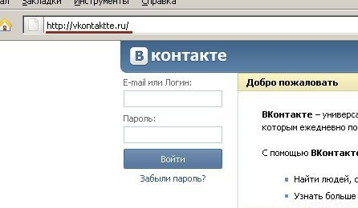
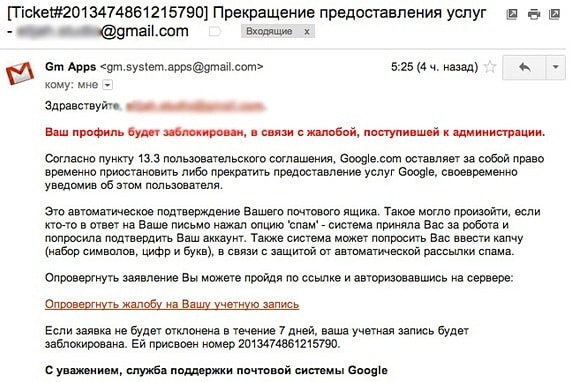

**Тема 19 Объекты уязвимости**

1 Безопасность операционных систем

2 Категории угроз

3 Серверы с вредоносным ПО и фишинговые сайты

4 Угрозы, связанные с электронной почтой

5 Атаки, связанные с автоматизированным внедрением кода SQL

6 Эксплойты в браузерах

7 Эксплойты, связанные с документами различных форматах

8 Применение обновлений системы безопасности при борьбе с уязвимостями

**1 Безопасность операционных систем**

Термины «безопасность» и «защита» иногда смешиваются. Тем не менее, часто бывает полезно провести границу между общими проблемами, связанными с гарантированием того, что файлы не читаются и не модифицируются неавторизованными лицами, с одной стороны, и специфическими механизмами операционной системы, используемыми для обеспечения безопасности, с другой стороны. Чтобы избежать путаницы, будем применять термин *безопасность* для обозначения общей проблемы и термин *механизмы защиты* при описании специфических механизмов операционной системы, используемых для обеспечения информационной безопасности в компьютерных системах. Однако граница между этими двумя терминами определена не четко.

При рассмотрении безопасности информационных систем выделяют две группы проблем: безопасность компьютера и сетевая безопасность. К безопасности компьютера относятся все проблемы защиты данных, хранящихся и обрабатывающихся компьютером, который рассматривается как автономная система. Эти проблемы решаются средствами операционных систем и приложений, таких как базы данных, а также встроенными аппаратными средствами компьютера. Под сетевой безопасностью понимают все вопросы, связанные с взаимодействием устройств в сети, это, прежде всего, защита данных в момент их передачи по каналу связи и защита от несанкционированного удаленного доступа в сеть.

Автономно работающий компьютер можно эффективно защитить от внешних покушений разнообразными способами. Компьютер, работающий в сети, не может полностью оградиться от окружающего мира, он должен общаться с другими компьютерами, возможно удаленными от него на значительное расстояние, поэтому в данном случае обеспечение безопасности значительно более сложная задача. Логический вход чужого пользователя в компьютер является штатной ситуацией при работе сети. Обеспечение безопасности в такой ситуации сводится к тому, чтобы сделать это проникновение контролируемым — каждому пользователю сети должны быть четко определены его права по доступу к информации, внешним устройствам и выполнению системных действий на каждом из компьютеров сети.

Помимо проблем, порождаемых возможностью удаленного доступа в сетевые компьютеры, сети по своей природе подвержены еще одному виду опасности — перехвату и анализу передаваемых сообщений, а также созданию «ложных» сообщений.

Вопросы сетевой безопасности приобретают особое значение в наше время, когда при построении корпоративных сетей часто используют не выделенные каналы, а Интернет и другие публичные сети.

Безопасной считается информационная система, которая удовлетворяет следующим требованиям:

1. *Конфиденциальность (confidentiality)*— гарантия того, что информация будет доступна только тем пользователям, которым этот доступ разрешен. Такие пользователи называются авторизованными. Доступ подобного рода включает в себя вывод на печать, на экран и другие формы предоставления информации, в том числе само обнаружение существования объекта.
1. *Доступность (availability)*— предположение того, что свойства и ресурсы системы (получение, изменение, поиск, обработка данных и т. п.) были всегда доступными*авторизованным пользователям*.
1. *Целостность (integrity)*— гарантия сохранности данными правильных значений, которая достигается запретом для неавторизованных пользователей каким-либо образом изменять, модифицировать, разрушать или создавать данные.
1. *Аутентичность* — возможность проверять идентичность пользователя, т.е. тот факт что входящий в систему пользователь действительно тот, за кого себя выдаёт.

Требования безопасности могут меняться в зависимости от назначения системы, характера используемых данных и типа возможных угроз. Трудно представить систему, для которой были бы не важны свойства целостности и доступности, но свойство конфиденциальности не всегда обязательно. Например, при публикации информации на Web-сервере цель публикатора сделать ее доступной для самого широкого круга людей.

Понятия конфиденциальности, доступности и целостности могут быть определены не только по отношению к информации, но и «другим ресурсам компьютерной системы, например внешним устройствам (принтерам, модемам и др.). Свойство конфиденциальности, примененное к устройству печати, можно интерпретировать так, что доступ к устройству имеют только те пользователи, которым этот доступ разрешен, причем они могут выполнять только те операции с устройством, которые для них определены. Свойство доступности устройства означает готовность его к использованию всякий раз, когда в этом возникает необходимость. А свойство целостности может быть определено как свойство неизменности параметров настройки данного устройства.

Точное соблюдение этих правил применительно к информационной системе со стороны ее пользователей обеспечивает операционную безопасность системы. Следует также отметить, что легальность использования устройств связана не только с безопасностью данных. Нужно помнить, что незаконное потребление таких услуг, как распечатка текстов, отправка факсов, электронных писем и т. п., наносит материальный ущерб предприятию, что также является нарушением безопасности системы.

Любое действие, которое направлено на нарушение конфиденциальности, целостности и/или доступности информации, а также нелегальное использование ресурсов информационной системы, называется *угрозой*. Реализованная угроза называется*атакой*.*Риск*— вероятностная оценка величины возможного ущерба, который может понести владелец информационного ресурса в результате успешно проведенной атаки. Значение риска тем выше, чем уязвимей существующая система безопасности и чем выше вероятность реализации атаки.

**2 Категории угроз**

**Под угрозой (в общем смысле)** обычно понимают потенциально возможное событие (воздействие, процесс или явление), которое может привести к нанесению ущерба чьим-либо интересам, в частности под угрозой безопасности автоматизированных систем (АС) обработки информации понимается возможность воздействия на АС, которое прямо или косвенно может нанести ущерб ее безопасности. АС является наиболее уязвимой частью информационной системы персональных данных (ИСПДн), поскольку предоставляет злоумышленнику самый быстрый доступ к информации, во отличии от базы данных (БД), хранящихся на бумажных носителях.

Перечень угроз, оценки вероятностей их реализации, а также модель нарушителя служат основой для анализа риска реализации угроз и формулирования требований к системе защиты АС. Кроме выявления возможных угроз, целесообразно проведение анализа этих угроз на основе их классификации по ряду признаков. Каждый из признаков классификации отражает одно из обобщенных требований к системе защиты. Угрозы, соответствующие каждому признаку классификации, позволяют детализировать отражаемое этим признаком требование.

Необходимость классификации угроз информационной безопасности АС обусловлена тем, что хранимая и обрабатываемая информация в современных АС подвержена воздействию чрезвычайно большого числа факторов, в силу чего становится невозможным формализовать задачу описания полного множества угроз. Поэтому для защищаемой системы обычно определяют не полный перечень угроз, а перечень классов угроз.

**Угроза информационной безопасности** — совокупность условий и факторов, создающих опасность нарушения информационной безопасности. 

Угрозы информационной безопасности могут быть классифицированы по различным признакам:

- По аспекту информационной безопасности, на который направлены угрозы:
  - *Угрозы конфиденциальности* (неправомерный доступ к информации). Угроза нарушения конфиденциальности заключается в том, что информация становится известной тому, кто не располагает полномочиями доступа к ней. Она имеет место, когда получен доступ к некоторой информации ограниченного доступа, хранящейся в вычислительной системе или передаваемой от одной системы к другой. В связи с угрозой нарушения конфиденциальности, используется термин «утечка». Подобные угрозы могут возникать вследствие «человеческого фактора» (например, случайное делегировании тому или иному пользователю привилегий другого пользователя), сбоев работе программных и аппаратных средств. К информации ограниченного доступа относится государственная тайна и конфиденциальная информация (коммерческая тайна, персональные данные, профессиональные виды тайна: врачебная, адвокатская, банковская, служебная, нотариальная, тайна страхования, следствия и судопроизводства, переписки, телефонных переговоров, почтовых отправлений, телеграфных или иных сообщений (тайна связи), сведения о сущности изобретения, полезной модели или промышленного образца до официальной публикации (ноу-хау) и др.).
  - *Угрозы целостности* (неправомерное изменение данных). Угрозы нарушения целостности – это угрозы, связанные с вероятностью модификации той или иной информации, хранящейся в информационной системе. Нарушение целостности может быть вызвано различными факторами – от умышленных действий персонала до выхода из строя оборудования.
  - *Угрозы доступности* (осуществление действий, делающих невозможным или затрудняющих доступ к ресурсам информационной системы). Нарушение доступности представляет собой создание таких условий, при которых доступ к услуге или информации будет либо заблокирован, либо возможен за время, которое не обеспечит выполнение тех или иных бизнес-целей.
- По расположению источника угроз:
  - *Внутренние* (источники угроз располагаются внутри системы);
  - *Внешние* (источники угроз находятся вне системы).
- По размерам наносимого ущерба:
  - *Общие* (нанесение ущерба объекту безопасности в целом, причинение значительного ущерба);
  - *Локальные* (причинение вреда отдельным частям объекта безопасности);
  - *Частные* (причинение вреда отдельным свойствам элементов объекта безопасности).
- По степени воздействия на информационную систему:
  - *Пассивные* (структура и содержание системы не изменяются);
  - *Активные* (структура и содержание системы подвергается изменениям).
- По природе возникновения:
  - *Естественные* (объективные) — вызванные воздействием на информационную среду объективных физических процессов или стихийных природных явлений, не зависящих от воли человека;
  - *Искусственные* (субъективные) — вызванные воздействием на информационную сферу человека. Среди искусственных угроз в свою очередь выделяют:
    - *Непреднамеренные* (случайные) угрозы — ошибки программного обеспечения, персонала, сбои в работе систем, отказы вычислительной и коммуникационной техники;
    - *Преднамеренные* (умышленные) угрозы — неправомерный доступ к информации, разработка специального программного обеспечения, используемого для осуществления неправомерного доступа, разработка и распространение вирусных программ и т.д. Преднамеренные угрозы обусловлены действиями людей. Основные проблемы информационной безопасности связаны прежде всего с умышленными угрозами, так как они являются главной причиной преступлений и правонарушений.

**3 Серверы с вредоносным ПО и фишинговые сайты**

Под вредоносной программой подразумевается любая программа, созданная для выполнения любого несанкционированного — и, как правило, вредоносного — действия на устройстве пользователя. Примеры вредоносных программ: Компьютерные вирусы

- вирусы;
- макровирусы для Word и Excel;
- загрузочные вирусы;
- скрипт-вирусы, включая batch-вирусы, заражающие оболочку ОС Windows, Java-приложения и т.д.;
- клавиатурные шпионы;
- программы для кражи паролей;
- троянцы-бэкдоры;
- crimeware — вредоносные программы, созданные для автоматизации совершения финансовых преступлений;
- шпионские программы;
- рекламные программы и другие типы вредоносных программ

**Угрозы безопасности компьютерных систем**, которые могут быть реализованы вследствие воздействия вредоносного программного обеспечения, в самом общем виде можно представить следующим образом:

• нарушение целостности, доступности и конфиденциальности информации, хранящейся и обрабатываемой в компьютерной системе;

• нештатное поведение аппаратных средств и программного обеспечения;

• использование компьютерной системы в интересах злоумышленников.

К вредоносному программному обеспечению относятся:

• классические компьютерные вирусы (Vuruses);

• сетевые черви (Worms);

• троянские программы (Trojans);

• программы-шпионы (Spy Ware);

• логические бомбы (Logic Bomb);

• архивные бомбы;

• почтовые (кластерные) бомбы;

• хакерские утилиты;

• другие программы, наносящие заведомый вред компьютеру, на котором они запускаются на выполнение, или другим компьютерам в сети.

**Фишинг** представляет собой сетевой вид мошенничества, при котором технически подкованные мошенники выманивают у людей конфиденциальную информацию. Это может осуществляться при помощи спама, почтовых и мгновенных сообщений, вредоносных интернет-сайтов.

**Главная задача фишинга** — получение логина и пароля пользователя для определённого сайта, с дальнейшим их использованием. Это могут быть идентификационные данные вашего банковского кабинета или ПИН-код с номером карточки для вывода на свой счёт ваших денег. Часто фишинг используют для доступа к аккаунтам в соцсетях. В любом случае, когда ваш логин и пароль становятся известны жуликам, последствия для вас будут весьма удручающие.

**Что такое фишинговый сайт**

Смысл создания подобных сайтов заключается в том, что фишеры создают страницу в интернете, которая внешне не отличается либо немного похожа на оригинальный сайт, где у пользователя запрашиваются конфиденциальные сведения.

Обычно ссылка на фишинговую страницу сопровождается каким-либо завлекающим описанием, например: «бесплатно только у нас…», «получи мгновенный бонус», «интернет взорван новостью об…», «шокирующая правда о…» и т.д.

Рис. Пример фишинг-сайта для воровства паролей от Вконтакте

Если в процессе обычного обсуждения выскакивают подобные сообщения, то следует сразу же насторожиться.

Существуют такие мошенники, которые просто воссоздают внешний вид интернет-портала и обещают «золотые горы». При этом просят просто ввести пароль, логин, желаемую сумму денег и т.п.

Чтобы убедиться в том, что перед вами фишинговый сайт, обратите внимание на название сайта в адресной строке браузера. Если оно отличается от оригинального названия сайта, то это фишинговый сайт. Также можно ввести любой вымышленный адрес электронной почты и случайный набор символов в качестве пароля. Если сайт ненастоящий, то он примет введенные данные как правдивые и произведёт переадресацию на настоящий сайт.

**Что такое фишинговое письмо**

Фишинговые письма используют в качестве основного способа распространения ссылок на фишинговые сайты. Такие письма выглядят как официальные, но в них указаны ссылки на поддельные сайты, которые похожие на оригинальные. В результате пользователь заходит на сайт-копию, вводит свои идентификационные данные и теряет доступ к своему счёту в банке.

К счастью, отличить фишинговое письмо от настоящего довольно просто, поскольку фишеры прибегают к одним и тем же уловкам, представляясь от имени десятков различных сервисов.

Рис 2. Пример фишинг-письма в почтовом сервисе Gmail

Вот основные признаки, по которым можно выявлять поддельные письма:

- Отсутствие цифровой подписи и наличие исполнимых файлов. В фишинговых письмах практически всегда имеются ссылки, предлагающие что-либо скачать (вирус), и вложения (документы с вирусами и исполняемые файлы);
- Фишинговые письма обозначают надуманную проблему как срочную и жизненно важную, чтобы пользователь напугался и быстро прислал всё, что нужно. Также в таких письмах может быть много восклицательных знаков;
- В них множество стилистических и грамматических ошибок. Разумеется, никто не может на 100% застраховаться от опечатки или лишней запятой, однако рассылки от фишеров просто напичканы всевозможными описками, двойными либо тройными пробелами, ошибочными названиями сервисов и т.д.
- Фишинговые письма рассылают сериями с одних и тех же электронных адресов, поэтому зачастую на их авторов сыпятся жалобы в интернете на различных форумах. Такие адреса — подставные, которые не существуют на самом деле. Часто они выглядят очень странно, например: money@yandiex.co.cc.
- Часто мошенники просят ввести логин, пароль, ПИН-код банковской карты, прислать код авторизации или перевести деньги для разморозки счёта. Это явный обман.

**Как защититься от фишинга**

Для защиты от фишеров следует учитывать следующие моменты:

- Помните, что пароль – только ваш, ни одна организация не станет требовать его от вас. Он необходим только для доступа к определённому сервису и только вы должны знать его.
- Внимательно проверяйте каждое полученное почтовое сообщение с неизвестного адреса на предмет наличия всевозможных просьб перейти по ссылке.
- Всегда проверяйте с помощью адресной строки, на том ли сайте вы вводите свои идентификационные данные. Обычно подделывается и домен, поэтому он бывает похожим на свой оригинал. Различие может заключаться лишь в одной букве (например, mail.ru легко превращается в meil.ru).
- Используйте последние версии интернет-браузеров и лицензионные антивирусные программы.
- При входе на банковские сайты следите за тем, чтобы было установлено защищённое соединение https.

Если вы подозреваете, что подверглись атаке фишеров, то сразу же поменяйте пароль своего аккаунта. После этого обратитесь в службу безопасности компании, данные от которой получили мошенники.

Во всемирной паутине развелось огромное число вирусов и хакеров, поэтому безопасность компьютера играет очень важную роль.

**4 Угрозы, связанные с электронной почтой**

Основные протоколы передачи почты (SMTP, POP3,IMAP4) обычно не осуществляют надежной аутентификации, что позволяет легко создать письма с фальшивыми адресами. Ни один из этих протоколов не использует криптографию, которая могла бы гарантировать конфиденциальность электронных писем. Хотя существуют расширения этих протоколов, решение использовать их должно быть явно принято как составная часть политики администрации почтового сервера. Некоторые такие расширения используют уже имеющиеся средства аутентификации, а другие позволяют клиенту и серверу согласовать тип аутентификации, который будет использоваться в данном соединении.

*Фальшивые адреса отправителя.* Адресу отправителя в электронной почте Интернета нельзя доверять, так как или отправитель может указать фальшивый обратный адрес, или заголовок может быть модифицирован в ходе передачи письма, или отправитель может сам соединиться с SMTP-портом на машине, от имени которой он хочет отправить письмо, и ввести текст письма.

*Перехват письма.* Заголовки и содержимое электронных писем передаются в чистом виде. В результате содержимое сообщения может быть прочитано или изменено в процессе передачи его по Интернету. Заголовок может быть модифицирован, чтобы скрыть или изменить отправителя или для того чтобы перенаправить сообщение.

*Почтовые бомбы.* Почтовая бомба - это атака с помощью электронной почты. Атакуемая система переполняется письмами до тех пор, пока она не выйдет из строя. Как это может случиться, зависит от типа почтового сервера и от того, как он сконфигурирован.

*Угрожающие письма.* Так как любой человек в мире может послать вам письмо, может оказаться трудным заставить его прекратить посылать их вам. Люди могут узнать ваш адрес из списка адресов организации, списка лиц, подписавшихся на список рассылки, или писем в Usenet. Если вы указали ваш почтовый адрес какому-нибудь веб-сайту, то он может продать ваш адрес "почтовым мусорщикам". Некоторые веб-браузеры сами указывают ваш почтовый адрес, когда вы посещаете веб-сайт, поэтому вы можете даже не понять, что именно вы его дали. Много почтовых систем имеют возможности фильтрации почты, то есть поиска указанных слов или словосочетаний в заголовке письма или его теле и последующего помещения писем в определенный почтовый ящик или удаления. Но большинство пользователей не знает, как использовать механизм фильтрации. Кроме того, фильтрация у клиента происходит после того, как письмо уже получено или загружено, поэтому таким образом тяжело удалить большие объемы писем.

Для безопасной атаки можно использовать анонимный ремэйлер. Когда кто-то хочет послать оскорбительное или угрожающее письмо и при этом скрыть свою личность, он может воспользоваться анонимным ремэйлером. Если человек хочет послать электронное письмо, не раскрывая свой домашний адрес тем, кто может угрожать ему, он может тоже использовать анонимный ремэйлер. Если он начнет вдруг получать нежелательные письма по своему текущему адресу, он может отказаться от него и взять новый.

Одним часто используемым средством защиты, применяемым некоторыми пользователями Usenet, является конфигурирование своих клиентов для чтения новостей таким образом, что в поле Reply-To (обратный адрес) письма, посылаемого ими в группу новостей, помещается фальшивый адрес, а реальный адрес помещается в сигнатуре или в теле сообщения. Таким образом, программы сбора почтовых адресов, собирающие адреса из поля Reply-To, окажутся бесполезными.

**Защита электронной почты**

*Защита от фальшивых адресов.* От этого можно защититься с помощью использования присоединения к письмам электронных подписей.

*Защита от перехвата.* От него можно защититься с помощью шифрования сообщения или канала, по которому он передается. Одним из самых популярных приложений является PGP. Коммерческая версия PGP включает в себя плагины для нескольких популярных почтовых программ, что делает ее особенно удобной для включения в письмо электронной подписи и шифрования письма клиентом. Последние версии PGP используют версию алгоритма шифрования RSA.

**Корректное использование электронной почты**

Все служащие должны использовать электронную почту так же, как и любое другое официальное средство организации. Из этого следует, что когда письмо посылается, то как отправитель, так и получатель должны гарантировать, что взаимодействие между ними осуществляется согласно принятым правилам взаимодействия. Взаимодействие с помощью почты не должны быть неэтичным, не должно восприниматься как конфликтная ситуация или содержать конфиденциальную информацию.

**Защита электронных писем и почтовых систем**

Защита писем, почтовых серверов и программ должна соответствовать важности информации, передаваемой по сетям. Как правило, должно осуществляться централизованное управление сервисами электронной почты и должна быть разработана политика, в которой указывался бы нужный уровень защиты.

**Примеры политик безопасности для электронной почты**

Низкий риск

*Пользователь.* Использование служб электронной почты для целей, явно противоречащих интересам организации или противоречащих политике безопасности организации, явно запрещено, так же как и чрезмерное использование их в личных целях.

Использование адресов организации в письмах-пирамидах запрещено.

Организация предоставляет своим сотрудникам электронную почту для выполнения ими своих обязанностей. Ограниченное использование ее в личных целях разрешается, если оно не угрожает организации.

Использование электронной почты для получения личной коммерческой выгоды запрещено.

*Менеджер.* Все сотрудники должны иметь адреса электронной почты.

Справочники электронных адресов должны быть доступны для общего доступа.

Если организация обеспечивает доступ к электронной почте внешних пользователей, таких как консультанты, контрактные служащие или партнеры, они должны прочитать правила доступа к электронной почте и расписаться за это.

Содержимое почтовых сообщений считается конфиденциальным, за исключением случая проведения расследований органами внутренних дел.

*Сотрудник отдела автоматизации.* POP-сервер должен быть сконфигурирован так, чтобы исключить использование незашифрованных паролей с локальных машин.

Средний риск

*Пользователь.* Электронная почта предоставляется сотрудникам организации только для выполнения ими своих служебных обязанностей. Использование ее в личных целях запрещено.

Конфиденциальная информация или информация, являющаяся собственностью организации, не может быть послана с помощью электронной почты.

Могут использоваться только утвержденные почтовые программы.

Нельзя устанавливать анонимные ремэйлеры.

Служащим запрещено использовать анонимные ремэйлеры

*Менеджер.* Конфиденциальная информация или информация, являющаяся собственностью организации, не может быть послана с помощью электронной почты.

Если будет установлено, что сотрудник в личных целях использует электронную почту, он будет наказан.

*Сотрудник отдела автоматизации.* Почтовая система должна обеспечивать только один внешний электронный адрес для каждого сотрудника. Этот адрес не должен содержать имени внутренней системы или должности.

Должен вестись локальный архив MIME-совместимых программ для просмотра специальных форматов, который был бы доступен для внутреннего использования.

Высокий риск

*Пользователь.* Электронная почта предоставляется сотрудникам организации только для выполнения своих служебных обязанностей. Использование ее в личных целях запрещено.

Все электронные письма, создаваемые и хранимые на компьютерах организации, являются собственностью организации и не считаются персональными.

Организация оставляет за собой право получить доступ к электронной почте сотрудников, если на то будут веские причины. Содержимое электронного письма не может быть раскрыто, кроме как в целях обеспечения безопасности или по требованию правоохранительных органов.

Пользователи не должны позволять кому-либо посылать письма, используя их идентификаторы. Это касается их начальников, секретарей, ассистентов или других сослуживцев.

Организация оставляет за собой право осуществлять наблюдение за почтовыми отправлениями сотрудников. Электронные письма могут быть прочитаны организацией, даже если они были удалены и отправителем и получателем. Такие сообщения могут использоваться для обоснования наказания.

*Менеджер.* Справочники электронных адресов сотрудников не могут быть сделаны доступными всем.

Если с помощью электронного письма должна быть послана конфиденциальная информация или информация, являющаяся собственностью организации, она должна быть зашифрована так, чтобы ее мог прочитать только тот, кому она предназначена, с использованием утвержденных в организации программ и алгоритмов.

Никто из посетителей, контрактников или временных служащих не имеет права использовать электронную почту организации.

Должно использоваться шифрование всей информации, классифицированной как критическая или коммерческая тайна, при передаче ее через открытые сети, такие как Интернет.

Выходящие сообщения могут быть выборочно проверены, чтобы гарантировать соблюдение политики.

*Сотрудник отдела автоматизации.* Входящие письма должны проверяться на вирусы или другие РПС.

Почтовые серверы должны быть сконфигурированы так, чтобы отвергать письма, адресованные не на компьютеры организации.

Журналы почтовых серверов должны проверяться на предмет выявления использования неутвержденных почтовых клиентов сотрудниками организации, и о таких случаях следует докладываться.

Почтовые клиенты должны быть сконфигурированы так, чтобы каждое сообщение подписывалось с помощью цифровой подписи отправителя.

**5 Атаки, связанные с автоматизированным внедрением кода SQL**

Атака путем внедрения кода SQL — это атака, при которой вредоносный код вставляется в строки, передающиеся затем в экземпляр SQL Server для синтаксического анализа и выполнения. Любая процедура, создающая инструкции SQL, должна рассматриваться на предмет уязвимости к внедрению кода, так как SQL Server выполняет все получаемые синтаксически правильные запросы. Даже параметризованные данные могут стать предметом манипуляций опытного злоумышленника.

**Принцип действия атаки путем внедрения кода SQL**

Основная форма атаки SQL Injection состоит в прямой вставке кода в пользовательские входные переменные, которые объединяются с командами SQL и выполняются. Менее явная атака внедряет небезопасный код в строки, предназначенные для хранения в таблице или в виде метаданных. Когда впоследствии сохраненные строки объединяются с динамической командой SQL, происходит выполнение небезопасного кода.

Атака осуществляется посредством преждевременного завершения текстовой строки и присоединения к ней новой команды. Поскольку к вставленной команде перед выполнением могут быть добавлены дополнительные строки, злоумышленник заканчивает внедряемую строку меткой комментария «--». Весь последующий текст во время выполнения не учитывается.

Следующий скрипт показывает простую атаку SQL Injection. Скрипт формирует SQL-запрос, выполняя объединение жестко запрограммированных строк со строкой, введенной пользователем:

var Shipcity;  

ShipCity = Request.form ("ShipCity");  

var sql = "select \* from OrdersTable where ShipCity = '" + ShipCity + "'";  

Пользователю выводится запрос на ввод названия города. Если пользователь вводит Redmond, то запрос, построенный с помощью скрипта, выглядит приблизительно так:

SELECT \* FROM OrdersTable WHERE ShipCity = 'Redmond'  

Предположим, однако, что пользователь вводит следующее:

Redmond'; drop table OrdersTable--  

В этом случае запрос, построенный скриптом, будет следующим:

SELECT \* FROM OrdersTable WHERE ShipCity = 'Redmond';drop table OrdersTable--'  

Точка с запятой «;» обозначает конец одного запроса и начало другого. А последовательность двух дефисов (--) означает, что остальная часть текущей строки является комментарием и не должна обрабатываться. Если измененный код будет синтаксически правилен, то он будет выполнен сервером. Когда SQL Server будет обрабатывать эту инструкцию, SQL Server прежде всего отберет все записи в OrdersTable , где ShipCity является Redmond. Затем SQL Server удалит OrdersTable.

Если вставленный код SQL синтаксически верен, искаженные данные нельзя выявить программно. Поэтому необходимо проверять правильность всех вводимых пользователями данных, а также внимательно просматривать код, выполняющий созданные с помощью SQL команды на сервере. Рекомендуемые приемы программирования описываются в следующих подразделах этого раздела.

**Проверка достоверности всех вводимых данных**

Всегда проверяйте все данные, вводимые пользователем, выполняя проверку типа, длины, формата и диапазона данных. При реализации мер предосторожности, направленных против злонамеренного ввода данных, учитывайте архитектуру и сценарии развертывания приложения. Помните, что программы, созданные для работы в безопасной среде, могут быть скопированы в небезопасную среду. Рекомендуется следующая стратегия:

- Не делайте никаких предположений о размере, типе или содержимом данных, получаемых приложением. Например, рекомендуется оценить следующее.
  - Как приложение будет вести себя, если пользователь по ошибке или по злому умыслу вставит MPEG-файл размером 10 МБ там, где приложение ожидает ввод почтового индекса?
  - Как приложение будет вести себя, если в текстовое поле будет внедрена инструкция DROP TABLE ?
- Проверьте размер и тип вводимых данных и установите соответствующие ограничения. Это поможет предотвратить преднамеренное переполнение буфера.
- Проверяйте содержимое строковых переменных и допускайте только ожидаемые значения. Отклоняйте записи, содержащие двоичные данные, управляющие последовательности и символы комментария. Это поможет предотвратить внедрение скрипта и защитит от некоторых приемов атаки, использующих переполнение буфера.
- При работе с XML-документами проверяйте все вводимые данные на соответствие схеме.
- Никогда не создавайте инструкции Transact-SQL непосредственно из данных, вводимых пользователем.
- Для проверки вводимых пользователем данных используйте хранимые процедуры.
- В многоуровневых средах перед передачей в доверенную зону должны проверяться все данные. Данные, не прошедшие процесс проверки, следует отклонять и возвращать ошибку на предыдущий уровень.
- Внедрите многоэтапную проверку достоверности. Меры предосторожности, предпринятые против случайных пользователей-злоумышленников, могут оказаться неэффективными против организаторов преднамеренных атак. Рекомендуется проверять данные, вводимые через пользовательский интерфейс, и далее во всех последующих точках пересечения границ доверенной зоны.
  Например, проверка данных в клиентском приложении может предотвратить простое внедрение скрипта. Однако если следующий уровень предполагает, что вводимые данные уже были проверены, то любой злоумышленник, которому удастся обойти клиентскую систему, сможет получить неограниченный доступ к системе.
- Никогда не объединяйте введенные пользователем данные без проверки. Объединение строк является основной точкой входа для внедрения скрипта.
- Не допускайте использование в полях следующих строк, из которых можно создать имена файлов: AUX, CLOCK$, COM1–COM8, CON, CONFIG$, LPT1–LPT8, NUL и PRN.

По возможности отклоняйте вводимые данные, содержащие следующие символы:

|**Входной символ**|**Значение в языке Transact-SQL**|
| - | - |
|**;**|Разделитель запросов.|
|**'**|Разделитель строк символьных данных.|
|**--**|Разделитель строк символьных данных. .|
|**/\*** ... **\*/**|Разделители комментариев. Сервер не обрабатывает текст между знаками **/\*** и **\*/**.|
|**xp\_**|Используется в начале имени расширенных хранимых процедур каталога, например xp\_cmdshell.|

**6 Эксплойты в браузерах**

**Экспл*о́*ит** (англ. *exploit*, эксплуатировать) — компьютерная программа, фрагмент программного кода или последовательность команд, использующие уязвимости в программном обеспечении и применяемые для проведения атаки на вычислительную систему. Целью атаки может быть как захват контроля над системой (повышение привилегий), так и нарушение её функционирования (DoS-атака).

**Классификация**

В зависимости от метода получения доступа к уязвимому программному обеспечению эксплоиты подразделяются на удалённые (англ. *remote*) и локальные (англ. *local*).

- *Удалённый эксплоит* работает через сеть и использует уязвимость в защите без какого-либо предварительного доступа к уязвимой системе;
- *Локальный эксплоит* запускается непосредственно в уязвимой системе, требуя предварительного доступа к ней. Обычно используется для получения взломщиком прав суперпользователя.

Атака эксплоита может быть нацелена на различные компоненты вычислительной системы — серверные приложения, клиентские приложения или модули операционной системы. Для использования серверной уязвимости эксплоиту достаточно сформировать и послать серверу запрос, содержащий вредоносный код. Использовать уязвимость клиента немного сложнее — требуется убедить пользователя в необходимости подключения к поддельному серверу (перехода по ссылке в случае если уязвимый клиент является браузером).

**Виды эксплойтов**

Эксплойты фактически предназначены для выполнения сторонних действий на уязвимой системе и могут быть разделены между собой следующим образом:

1. Эксплоиты для операционных систем
1. Эксплоиты для прикладного ПО (музыкальные проигрыватели, офисные пакеты и т. д.)
1. Эксплоиты для браузеров (Internet Explorer, Mozilla Firefox, Opera и другие)
1. Эксплоиты для интернет-продуктов (IPB, WordPress, VBulletin, phpBB)
1. Эксплоиты для интернет-сайтов (facebook.com, hi5.com, livejournal.com)
1. Другие эксплоиты

**Как выглядит эксплоит?**

Эксплоит может распространяться в виде исходных текстов, исполняемых модулей или словесного описания использования уязвимости. Он может быть написан на любом языке программирования (наиболее часто использующиеся: C/C++, Perl,Python, PHP, HTML+JavaScript).

Эксплоиты могут быть классифицированы также по типу используемой ими уязвимости, такой как: переполнение буфера, внедрение SQL-кода, межсайтовый скриптинг, подделка межсайтовых запросов и т. д.

**Актуальность**

Информация, полученная в результате обнаружения уязвимости, может быть использована как для написания эксплоита, так и для устранения уязвимости. Поэтому в ней одинаково заинтересованы обе стороны — и взломщик, и производитель взламываемого программного обеспечения. Характер распространения этой информации определяет время, которое требуется разработчику до выпуска заплатки.

После закрытия уязвимости производителем шанс успешного применения эксплоита начинает стремительно уменьшаться. Поэтому особой популярностью среди хакеров пользуются так называемые 0day эксплоиты, использующие недавно появившиеся уязвимости, которые еще не стали общеизвестны

**7 Эксплойты, связанные с документами различных форматах**

В качестве источников эксплойтов злоумышленники все более активно используют файлы стандартных форматов. Хотя сегодня большинство программ для работы с электронной почтой и обмена мгновенными сообщениями блокируют передачу потенциально опасных файлов, ориентируясь на их расширения, тем не менее они позволяют передавать файлы широко применяемых форматов, например Microsoft Office и Adobe PDF, — ведь подобные файлы широко используются в повседневной работе многими компаниями. То, что такие файлы, как правило, не блокируются почтовыми системами, и сделало их привлекательной мишенью для разработчиков эксплойтов.

**Файлы форматов Microsoft Office**

Как ни странно, наиболее часто применяемыми уязвимостями в ПО Microsoft Office являются самые старые из них. С одной-единственной уязвимостью, исправление безопасности для которой было выпущено более двух лет назад, связано 91,3% от общего количества проанализированных атак. Иными словами, в большинстве случаев атакованные приложения оказывались версиями приложений, для которых не были установлены текущие пакеты обновления, и для каждого из таких приложений подавляющее большинство атак пришлось на RTM-версию приложения, для которой не были установлены пакеты обновления. Например, 100% атак против приложений Office 2000 были направлены на RTM-версию этого пакета от 1999 года, несмотря на то что с 2000-го для него было выпущено множество пакетов обновления и обновлений для системы безопасности.

Достаточно странным, однако, представляется факт отсутствия упоминания о семействе продуктов Microsoft Office 2007 — ведь внедрений этой версии данного семейства продуктов даже в корпоративном секторе, традиционно более консервативном в плане обновления версий ПО, нежели сектор домашних пользователей, сегодня более чем достаточно. Если бы в данном продукте не было ни одной уязвимости, это, безусловно, было бы отражено в данном отчете.

Отметим, что, как и в случае с уязвимостями браузеров, языком приложений, наиболее часто становившихся жертвами атак (32,5% от общего количества атак), является английский. Русскоязычные офисные приложения составили 12% от атакованных систем.

**Файлы формата Adobe PDF**

Показатель использования файлов формата PDF в качестве вектора атаки резко возрос во втором полугодии 2008 года. Так, в июле количество подобных атак более чем вдвое превысило общее количество атак за все первое полугодие и почти удвоилось за оставшиеся месяцы указанного года. Объектом атак стали две уязвимости приложений Adobe для просмотра файлов этого формата. На данный момент компанией Adobe для них выпущены соответствующие обновления системы безопасности.

**8 Применение обновлений системы безопасности при борьбе с уязвимостями**

При правильном использовании обновлений для системы безопасности и других программных обновлений можно значительно уменьшить степень распространения и воздействия вредоносного программного обеспечения. Microsoft рекомендует использовать для этой цели Центр обновления Microsoft для своевременного обновления операционных систем Windows и программного обеспечения Microsoft.

Центр обновления Windows обеспечивает обновление компонентов Windows, драйверов устройств, выпускаемых корпорацией Microsoft и другими производителями аппаратного оборудования, а также распространяет обновления подписей для программ защиты от вредоносного ПО и ежемесячные выпуски утилиты для удаления вредоносных программ MSRT. Центр обновления Microsoft предоставляет те же обновления, что и Центр обновления Windows, а также обеспечивает обновление других программ Microsoft, например Microsoft Office. В течение последних нескольких лет использование Центра обновления Microsoft значительно увеличилось, в частности за счет пользователей Центра обновления Windows, которые перешли на использование Центра обновления Microsoft.

Автоматическое обновление является одним из наиболее эффективных средств борьбы с распространением вредоносного ПО, которое с равным успехом используют как пользователи, так и организации.
