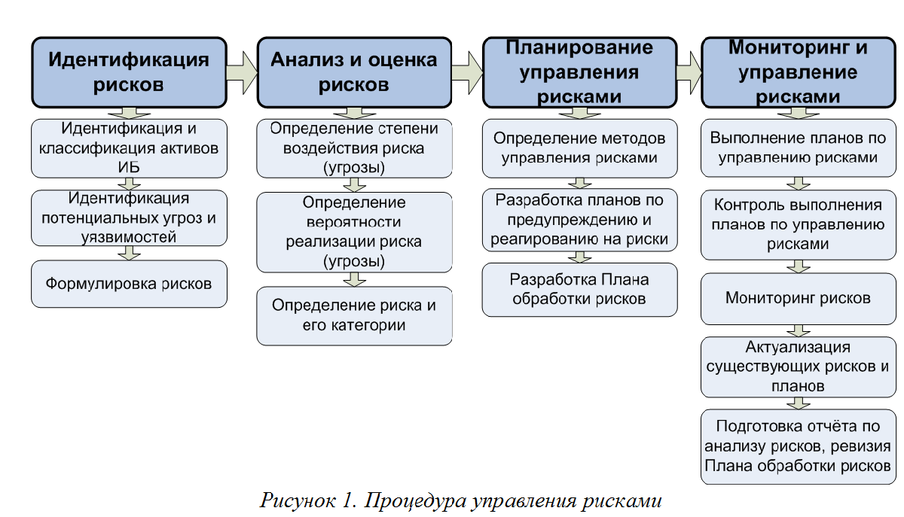
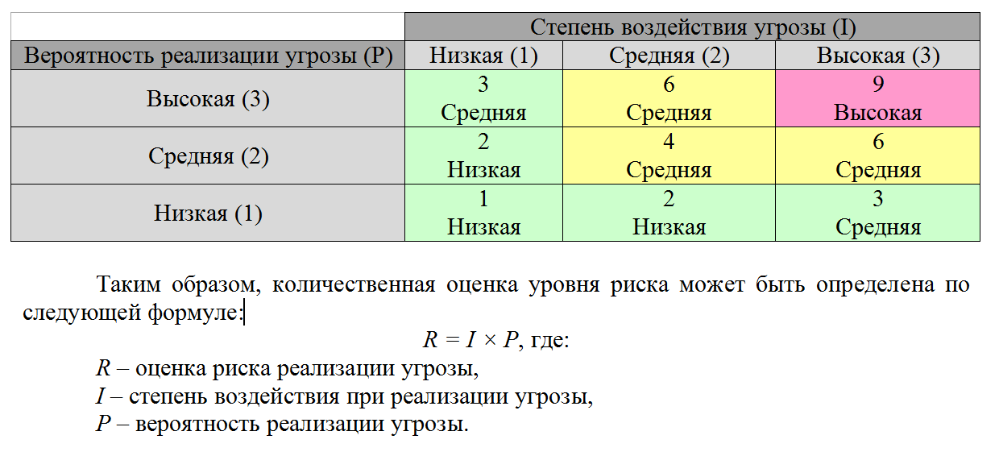

**Тема 20 Анализ рисков и характеристик качества программного обеспечения при внедрении**

1 Управления рисками

2 Процедуры управления рисками

3 Треугольник компромиссов

4 Матрица компромиссов

5 Таблица оценки рисков

6 Анализ и управление рисками проекта

7 Меры по минимизации

**Управление** **рисками** — процесс принятия и выполнения управленческих решений, направленных на снижение вероятности возникновения неблагоприятного результата и минимизацию возможных потерь проекта, вызванных его реализацией.

Типовая процедура управления рисками схематично представлена на рис. 1.

Целью управления рисками информационной безопасности является обеспечение целостности, доступности и конфиденциальности всех компонентов ИТ инфраструктуры путем уменьшения возможности реализации угроз и разработки действий по устранению последствий их реализации. Естественно, прежде всего, необходимо детально исследовать технологические процессы предприятия, чтобы учесть все факторы, влияющие на ИБ и выявить соответствующие риски. Поэтому нужно определить и классифицировать объекты, имеющие материальную ценность и подлежащие защите, так называемые активы информационной безопасности, а также угрозы, связанные с их жизненным циклом.

К активам ИБ относятся конфигурационные элементы информационной системы (оборудование, специализированные помещения, программное обеспечение, документация и др.), которые объединяются в группы, исходя из их назначения, функциональности и присущих угроз. Активы ИБ классифицируются по уровню критичности, характеризующему их приоритетность и необходимую степень защиты (соответствующий набор методов защиты). Принято устанавливать три уровня критичности: высокий, средний и низкий. Оценку рисков целесообразно проводить преимущественно для активов ИБ высокого и среднего уровня критичности, когда влияние на конфиденциальность, целостность и доступность таких активов может причинить предприятию значительный ущерб.

Далее применительно к каждому типу активов ИБ выявляются потенциальные угрозы, и определяется степень воздействия этих угроз на информационную безопасность предприятия. Источниками угроз могут являться внешнее окружение, используемые технологии и процессы, персонал. Результатом реализации угрозы становится раскрытие, изменение, потеря или разрушение актива ИБ, утрата или компрометация конфиденциальной информации и т.д. Степень воздействия угрозы, т.е. уровень возможного ущерба от ее реализации, оценивается по различным категориям (конкурентное преимущество, законы и регулятивные требования, операционная доступность, репутация на рынке, стоимость актива, ущерб от нарушения бизнес-процессов и т.д.) и выражается как высокая, низкая или средняя. Затем по аналогичной шкале определяется вероятность возникновения угрозы (наступления рискового события).

В результате формируется матрица оценки риска, на основании которой, риск можно ранжировать в зависимости от вероятности реализации и степени воздействия угрозы, табл. 1.

Таблица 1. Матрица оценки риска

Для построения эффективной системы управления информационной безопасностью идентифицированные и оцененные риски следует сгруппировать, разделив, например, на три категории: риски доступности, риски информационной безопасности и риски непрерывности по типу применяемых к ним мер защиты. Идентифицировав и оценив риски ИБ, можно переходить непосредственно к управлению рисками  и документальному оформлению  этой процедуры.

**1. Введение**

Существует множество определений риска как наличие неопределенности, связанной с наступлением нежелательного события, и ущерба, понесенного вследствие наступления этого события.

**Риск** (по определению SEI (Software Engineering Institute)) - это возможность понести потери.

**Риск проекта ПО** - это возможность:

\1) снижения качества конечного продукта,

\2) повышения стоимости его разработки,

\3) задержки окончания разработки или срыва проекта (то есть, отказа от проекта).

**Величина риска** представляет собой **R = V \* P** произведение величины потерь **V** от нежелательного события в проекте и вероятности **P** наступления этого события.

Величина потерь **V** рассматривается в контексте влияния нежелательного события на характеристики ПО, на сложность его последующего сопровождения, а также эффективность, стоимость и продолжительность процесса разработки ПО, а вероятность **P** - как степень определенности, с которой можно прогнозировать проявление риска в проекте, то есть перерастание данного риска в проблему для проекта.

Эффективное управление риском состоит в принятии (по каждому риску) компромиссных решений по:

· учету рисков и анализу старых проектов;

· оценке трудоемкости устранения определенного риска,

· величине потенциального отрицательного воздействия этого риска на проект,

· в правильной оценке взаимозависимости устраняемых рисков и возможного влияния принятых в определенный (текущий) момент времени решений на состояние проекта в будущем;

· резервировании в проекте времени на борьбу с рисками.

С ростом размера и сложности проектов ПО наметилась тенденция к переходу от эвристических методов управления риском, применяемых отдельными лицами, принимающими решение (ЛПР), исходя из собственных знаний и опыта управления разработкой ПО, к использованию систематизированных, гибких и легко адаптируемых методов управления риском, обеспечивающих ЛПР всей необходимой информацией для своевременной идентификации и устранения риска проекта.

**2. Концепция управления риском проекта ПО**

Базовыми конструкциями концепции управления риском являются:

функции управления риском,

таксономия (классификация) риска;

методология оценки и управления риском.

Представление концепции в виде круга подчеркивает ее суть, заключающуюся в непрерывности процесса управления риском. Ориентация стрелок указывает направление логического потока информации, связывающего отдельные виды деятельности. Центральной частью концепции является коммуникация, в эффективности средств и методов осуществления которой залог успешного выполнения всех остальных видов деятельности и управления риском в целом.

**2.1 Функции управления риском**

Таблица 1 Характеристика функций управления риском

||
| - |
|Функция|Определение функция|Цель функция||
|Идентификация|Процесс, в ходе которого неопределенности и проблемы проекта трансформируются в реальные риски, которые можно описать и измерить|Искать и найти риски проекта ПО до того, как они перерастут в проблемы||
|Анализ|Процесс, в ходе которого устанавливаются детали рисков - величины и источники рисков, их взаимосвязи и степени важности, серьезность последствий, вероятность и время возможного проявления|Преобразовать данные о рисках в информацию для принятия адекватных решений||
|Планирование|Процесс, в ходе которого принимаются решения о мерах по устранению рисков|Выработать решения и план действий по каждому риску. Интегрировать эти решения и планы в единый план управления риском проекта ПО.||
|Учет и контроль|Процесс, в ходе которого собираются, обобщаются и фиксируются данные о состоянии рисков и действий по их устранению|Контролировать соблюдение графика действий по риску и эффективность самого плана действий||
|Регулирование|Процесс, в ходе которого анализируются отчетные данные и принимаются решения о дальнейших действиях по риску|Своевременная и эффективная коррекция отклонений в запланированных действиях по риску||
|Коммуникация|
Организация взаимодействия по управлению риском стимулирует выполнение остальных функций и гарантирует, что:

· риски и планы их устранения интерпретируются однозначно,

· информация о риске является доступной для всех членов проекта;

· любой информации о риске уделяется надлежащее внимание;

· существует эффективный диалог между менеджером и командой проекта
|Обеспечение непрерывной эффективной передачи информации и обратной связи со всеми функциями и на всех уровнях управления риском (включая устраняемые, неустраняемые (находящиеся под наблюдением) и вновь появляющиеся риски). Учет как внутренних, так и внешних для проекта источников информации о риске.||
|||||
**2.2 Таксономия риска**

**Таксономия риска** обеспечивает базис для организации данных и изучения различных аспектов риска проекта ПО.

Таксономия риска разрабатывалась SEI в течение трех лет и была проверена на более чем 30 проектах ПО. Она составлена с учетом типовых процессов жизненного цикла (ЖЦ) ПО и охватывает наиболее общие области риска проекта, касающиеся характеристик ПО, среды и процессов разработки и ограничений проекта. Эта таксономия может частично видоизменяться с учетом специфики конкретного проекта.

Таксономия риска SEI имеет иерархическую структуру и систематизирует источники (области) риска по трем уровням:

класс,

элемент класса,

атрибут элемента

Класс определяет сферу деятельности по программной инженерии, с которой может быть связан тот или иной риск. Элемент класса указывает конкретную область риска в соответствующей сфере деятельности. Атрибут элемента определяет фактор риска в определенной области риска, с которым может быть связано нежелательное событие, действие или факт, являющиеся источником риска.

Таблица 2

||
| - |
|Класс источника (области) риска|Характеристика класса|Элемент класса|Атрибут элемента||
|1. Технические аспекты разработки (инженерия программного продукта)|Связан с процессами (работами) на стадиях ЖЦ ПО (разработка требований, проектирование, кодирование, тестирование и др.), а также характеристиками ПО (требований, проекта, кода и др.) на этих стадиях|Требования|Стабильность||
||||Полнота||
||||Однозначность||
||||Достоверность||
||||Реализуемость||
||||Новизна||
||||Масштабность||
|||Проект|Функциональность||
||||Сложность||
||||Интерфейсы||
||||Производительность||
||||Тестируемость||
||||Аппаратные ограничения||
||||Приобретаемое ПО||
|||Кодирование и автономное тестирование|Реализуемость||
||||Автономное тестирование||
||||Кодирование/реализация||
|||Интеграция и интеграционное тестирование|Среда||
||||Интеграция продукта||
||||Интеграция системы||
|||Нефункциональные характеристики ПО|Удобство сопровождения||
||||Надежность||
||||Защищенность||
||||Безопасность||
||||Человеческие факторы||
||||Спецификации||
|2. Среда и технология разработки|Связан с методами, процедурами и инструментами, используемыми в ходе разработки ПО|Процесс разработки|Формализованность||
||||Укомплектованность||
||||Контролируемость процесса||
||||Опыт применения||
||||Контролируемость продукта||
|||Система поддержки разработки|Мощность||
||||Укомплектованность||
||||Удобство применения||
||||Опыт применения||
||||Надежность||
||||Сопровождаемость||
||||Поставка||
|||Процесс управления|Планирование||
||||Организация проекта||
||||Опыт управления||
||||Организация взаимодействия||
|||Методы управления|Мониторинг||
||||Управление персоналом||
||||Обеспечение качества||
||||Управление конфигурацией||
|||Рабочая обстановка|Качество работы||
||||Кооперация||
||||Коммуникация||
||||Моральный климат||
|3. Внешние ограничения проекта|Связан с внешними для проекта факторами: наличие ресурсов разработки, условия заключаемых договоров, формы и особенности взаимодействия организаций-участников проекта ПО и др|Ресурсы|Сроки разработки||
||||Штат проекта||
||||Финансирование||
||||Средства разработки||
|||Условия договора|Тип договора||
||||Ограничения договора||
||||Договорные зависимости||
|||Интерфейсы проекта|Заказчик||
||||Смежники||
||||Соисполнители||
||||Головной исполнитель||
||||Высшее руководство||
||||Продавцы||
||||Политические принципы||
||||||
Таксономия риска обеспечивает систематизацию рисков по указанным в ней аспектам программной инженерии и служит основой для разработки методов идентификации источников риска путем интервьюирования членов проекта с использованием опросника, согласующегося с этой таксономией.

Опросник, основанный на таксономии риска (для краткости, TBQ, от Taxonomy-Based Questionnaire), является инструментом, применение которого гарантирует охват всех потенциальных областей риска благодаря наличию в нем вопросов, касающихся нижнего уровня таксономии риска - атрибутов. Количество и форма задаваемых вопросов может быть различной в зависимости от специфики проекта, выбранного метода интервьюирования и обработки его результатов. В любом случае она должна ориентироваться на максимально полное и эффективное извлечение знаний членов проекта (включая менеджеров, проектировщиков, технический персонал и др.) о рисках конкретного проекта ПО.

Таблица 3 - Список 10 главных программных рисков

||
| - |
|Программные риски|**Техника управления рисками**||
|1. Провалы персонала, плохой менеджмент|Поиск талантов; рабочее соревнование; построение команды; персональные договора; перекрестные тренировки; предопределение ключевых фигур.||
|2. Нереальные сроки и бюджеты, ошибки в планировании работ над проектом|Детализированный анализ стоимости и ожидаемых сроков; оценка стоимости; пошаговая разработка; повторное использование ПО; смягчение требований.||
|3. Разработка неправильных программных функций, ошибки проектирования системы|Организационный анализ; анализ задачи; формулирование условий; пользовательские обзоры; прототипирование; ранние пользовательские руководства.||
|4. Разработка ошибочного интерфейса пользователя, плохая связь с заказчиком|Прототипирование; сценарии; анализ задач; классификация пользователей (функциональная, стилевая, по загрузке).||
|5. Потеря прибыльности, неумение заключать договора, некачественное внедрение|Снижение требований; прототипирование; стоимостный анализ; оценка стоимости.||
|6. Неверно сформулированные требования или изменяющиеся требования|Высокий порог изменений; инкапсуляция информации; пошаговая разработка (откладывает изменения на дальнейшие шаги разработки).||
|7. Провалы во внешнем снабжении компонентами, неверный выбор коммерческого ПО|Тестирования; проверки; справочные проверки; анализ совместимости.||
|8. Провалы во внешне исполняемых задачах, недостаточное тестирование и плохая интеграция ПО|Справочные проверки; аудит; премиальные контракты; конкурентная разработка или прототипирование; построение команды.||
|9. Провалы производительности|Имитационное моделирование; тестирование; прототипирование; подгонка инструментария.||
|10. Превышение возможностей компьютерной науки|Технический анализ; анализ прибыльности; прототипирование; справочные проверки.||
||||
**2.3 Методология оценки и управления риском**

Исследования риска - это длительный (несколько месяцев) процесс, в ходе которого предпринимаются совместные усилия ведущей организацией по вопросам управления риском (в рамках страны, определенной отрасли или государственной структуры) и организацией-клиентом:

· по изучению существующей практики разработки конкретного проекта,

· оценке альтернативных приемов управления риском,

· выработке концепции управления риском клиента,

· обучению методам управления риском

· созданию необходимой инфраструктуры и плана управления риском ПО в организации-клиенте.

Поскольку управление риском, отнесено к уровню 3 модели технологической зрелости организаций-разработчиков, оценка и управление риском - это достаточно отдаленная перспектива для отечественной программной инженерии.

Процесс управления риском проекта ПО включает следующие четыре стадии:

· **согласование целей** - определение нужд и целей проекта, достижение соглашений по управлению риском,

· **подготовка работ** - планирование и координация предстоящих работ по оцениванию риска проекта ПО,

· **оценка риска** - выполнение функций управления риском и получение рекомендаций по управлению риском проекта ПО,

· **подготовка к устранению риска** - разработка рекомендаций по устранению рисков по всем областям устранения риска, разработка плана управления риском и приведение его в действие.

Процесс управления риском применяется независимо от стадии ЖЦ, на которой находится проект ПО, и независимо от конкретного сценария и форм организации взаимодействия заказчика, исполнителя, соисполнителей и др. при разработке проекта.

**Разработано 3 методологии**:

оценивание риска ПО - SRE (от Software Risk Evaluation),

непрерывное управление риском - CRM (от Continuous Risk Мanagement),

коллективное управление риском - TRM (от Team Risk Management).

**2.3.1 Оценивание риска ПО**

Методология SRE предлагает формальный метод идентификации, анализа, контроля и устранения риска ПО, который применяется первоначально на самой ранней стадии разработки проекта ПО (еще до заключения договора с разработчиком) и затем периодически в ходе всего ЖЦ проекта. Предлагаемые SRE функции управления риском подразделяются на основные и обеспечивающие.

К основным функциям управления риском относятся:

· обнаружение,

· спецификация,

· оценивание,

· структурирование (консолидация)

· устранение рисков.

Выполнение функции **обнаружения рисков** обеспечивает систематический и полный охват всех потенциальных областей риска с применением адекватных инструментов и технологий, в частности, опросника TBQ.

Выполнение функции **спецификации риска** касается фиксации всех аспектов идентифицированного риска ПО. Спецификация риска представляет собой структуру, которая упрощает решение задач приоритезации рисков, локализации источников и причин возникновения рисков, определения методов и усилий, предпринимаемых для устранения рисков в источниках их возникновения.

Существует много способов спецификации риска - от простого утверждения о риске до сложного высказывания с применением условных выражений вида “ЕСЛИ <условие> ТО <последствия>”, связок “И” и др. Выбор того или иного способа определяется эффективностью его практического применения для проекта и особенностями инструментальной поддержки обработки рисков.

Функция **оценивания риска** заключается в определении величины каждого риска ПО, что служит основанием для присваивания приоритета риску и выявления наиболее важных на текущий момент рисков проекта.

Существуют различные механизмы оценивания величины риска - от простых субъективных оценок по 3-бальной шкале до строгих статистических измерений. 

Функция **консолидации рисков** касается преобразования разрозненных данных о каждом риске в концентрированные информационные блоки для принятия решений по управлению риском. Преобразование данных основано на применении приемов объединения, структурирования и абстракции данных об отдельных рисках ПО (что, например, необходимо, в случае обнаружения идентичных рисков в разных сеансах интервьюирования, различных проявлений одного и того же риска, поглощающих рисков от одного источника, рисков, мало отличающихся по величине, и др.).

Функция **устранения рисков** состоит в определении областей проекта (областей устранения риска), на которых необходимо сосредоточить ресурсы, а также разработке стратегий и рекомендуемых действий, способных снизить и устранить угрозу успешного выполнения проекта. Область устранения риска представляет собой логическую группировку подобных рисков, удобную с точки зрения эффективного управления этими рисками. Результатом выполнения данной функции является план управления риском проекта ПО, а также элементы организационно-методической, технологической и инструментальной поддержки управления риском проекта ПО. Собственно устранение каждого риска осуществляется в соответствии с конкретным планом его устранения.

К **обеспечивающим функциям при оценивании риска** относятся функции согласования действий по управлению риском, их планирования и координации, верификации и валидации, а также обучения и создания условий для эффективного ведения (хранения, обновления, удаления) информации о риске.

Организации, в которых внедряется процесс управления риском проектов ПО, как правило разрабатывают собственный или адаптируют приведенный метод оценивания риска к потребностям и инфраструктуре собственных проектов.

**2.3.2 Непрерывное управление риском**

Эта методология основана на определенных принципах управления риском в ходе всего ЖЦ проекта и не зависит от конкретных применяемых методов и инструментов оценки и устранения риска. **Семь принципов управления риском** таковы:

Таблица 3

||
| - |
|Принцип управления риском|Характеристика принципа управления риском||
|1. Разностороннее (в разных проекциях) видение предмета|Формирование взгляда на предмет с разных позиций при сохранении общности целей, коллективной ответственности и распределении обязанностей; концентрация внимания на результатах||
|2. Коллективная работа|Совместная работа для достижения общей цели; оптимальные условия проявления таланта, знаний и опыта||
|3. Глобальные перспективы|Восприятие разработки ПО в контексте крупномасштабных работ по проекту системы; допущение как благоприятных, так и неблагоприяных перспектив реализации спецификаций продукта ПО (связанных с превышением сроков, стоимости, программными сбоями и др.)||
|4. Дальновидность|Опережение событий, идентификация неопределенностей, предупреждение потенциальных проблем; управление проектными ресурсами и действиями в режиме предвосхищения проблем;||
|5. Открытое взаимодействие|Поощрение свободного тока информации между всеми уровнями проекта; обеспечение возможности формального, неформального и импровизированного взаимодействия; обеспечение процесса достижения консенсуса с учетом мнений отдельных лиц (имеющих специальные знания и углубленный взгляд на проблему идентификации и управления конкретным риском)||
|6. Интегрированное управление|Признание управления риском в качестве интегральной и жизненно важной части управления проектом; адаптация методов и инструментов управления риском к инфраструктуре и культуре проекта;||
|7. Непрерывность процесса|Постоянство бдительности; непрерывное идентифицирование и управление рисками на всех стадиях ЖЦ проекта||
||||
**2.3.3 Коллективное управление риском**

Эта методология определяет дополнительные действия в деятельности по управлению риском, которые связаны с осуществлением совместного управления риском со стороны заказчика проекта ПО и его исполнителя. Ее применение обеспечивает формирование среды, содержащей множество процессов, методов и инструментов, необходимых для совместной работы заказчика и исполнителя над непрерывным управлением риском в ходе ЖЦ проекта.

Методология основана на семи принципах управление риском (п. 2.3.2.) и философии бригадной работы, к которым добавляет две функции - инициирование коллективной работы и собственно коллективное управление риском. Эти функции выполняются над каждым риском последовательно, но действия по управлению риском проекта в целом могут быть как последовательными, так и параллельными, и итеративными (например, планирование для одного риска может совмещаться с идентификацией другого).

Инициировать коллективную работу может либо заказчик, либо исполнитель. При этом оба коллектива должны осознавать необходимость соблюдения принципов коллективной работы и ответственность за ее результаты. Коллективное управление предполагает формализацию отношений заказчик-исполнитель и формирование обобщенных взглядов на риски ПО. Систематическое и периодическое совместное применение методов управления риском обеспечивает единообразие в понимании рисков проекта и их относительной важности и получение обобщенной информации о рисках, приоритетах, метриках и планах действий.

Основные положения трех методологий, представленных выше, послужили базисом для формирования подхода к управлению риском проектов ПО в терминах процесса управления риском, его оргструктуры и стадий выполнения, а также необходимой инструментальной поддержки модели принятия решений при оценивании риска.

**3. Организационная структура управления риском**

Процесс управления риском проекта ПО начинается с создания координационной группы (совета) по управлению риском проекта. Численность группы может колебаться от одного человека с частичной занятостью до нескольких человек с полной занятостью. Кандидатами в координационную группу могут быть члены бригады проекта, представители пользователей, исполнителей и соисполнителей. Лидером этой группы является представитель нанимаемой независимой группы экспертов, который несет ответственность за выполнение обеспечивающих функций планирования и координации в рамках метода SRE. Интерфейс организации-разработчика с независимой группой (в лице ее лидера) осуществляется координатором действий из организации-разработчика. Он несет ответственность за подбор (в среде проекта) специалистов для интервьюирования и проведение брифингов при посещении организации-разработчика независимой группой экспертов.

Собственно деятельность по управлению риском проекта ПО должна осуществляться квалифицированным персоналом, включенным в состав проекта (бригадой проекта), а распределение ролей и ответственности за управление риском - отражаться в плане управления риском. 

Лица, осуществляющие функции управление риском проекта ПО, должны обладать знаниями в области программной инженерии, проблемной области, для которой разрабатывается ПО, а также знать принципы управления риском и владеть методами и инструментами управления риском. Считается, что человек обладает необходимыми знаниями для управления риском, если:

· он принимал участие в управлении по крайней мере одним проектом,

· применял методологии управления риском по крайней мере для одного проекта и

· имеет опыт в соответствующей проблемной области проекта.

Если не выполняется хотя бы одно из перечисленных условий, член проекта должен иметь возможность пополнить свои знания путем обучения. Способы приобретения необходимых знаний таковы:

· формальное обучение. Занятия с членами проекта проводятся организацией-заказчиком или независимой организацией по соответствующей программе;

· неформальное обучение. Этот вид обучения предполагает самостоятельное посещение курсов или обучение по месту работы по соответствующей программе.

**4. Разработка плана управления риском**

Управление риском конкретного проекта ПО осуществляется в соответствии с планом управления риском, составленным с учетом рекомендаций, полученных от независимой группы экспертов и зафиксированных в итоговом отчете о проведении оценки риска проекта ПО.

**План управления риском проекта ПО** определяет, каким образом процесс управления риском будет выполняться в рамках конкретного проекта разработки ПО, и указывает процессы, действия, этапы работ, методы и инструменты, используемые членами бригады проекта, ответственными за управление риском проекта ПО. Этот план может быть частью плана управления риском системного уровня, частью плана управления проектом или самостоятельным планом. Выбор того или иного способа планирования зависит от объема и сложности проекта, состава и размеров бригады проекта, а также общих принципов планирования, которым следует организация, осуществляющая управление риском. План управления риском может подвергаться модификации при появлении новых инструментов, методов или других элементов управления риском, необходимых для управления риском конкретного проекта.

Текущий список рисков и планы по их устранению не рекомендуется включать в план управления риском проекта ПО, чтобы не пришлось непрерывно его корректировать.

Таблица 4 Рекомендации по содержанию плана управления риском

||
| - |
|Раздел плана управления риском|Описание||
|Введение|Определяет цели и сферу действий плана, его содержание. Здесь должны быть указаны любые предположения, ограничения и принципы реализации процессов, а также любые связанные с этим планы, документы и стандарты.||
|Обзор процессов|Краткое описание действий по управлению риском и их взаимосвязь. Определяются все потоки управления и данных, указывается, каким образом действия по управлению риском интегрируются с другими действиями по управлению проектом.||
|Организация|Включает информацию об организации работ по управлению риском проекта и распределении ответственности (обязанностей) в проекте между заказчиком, поставщиком ПО (головным исполнителем) и соисполнителями. Указывается оргструктура управления риском, которая проецирует действия по управлению риском на роли, исполняемые членами проекта по управлению риском. Определяется перечень лиц, ответственных за управление риском со стороны организации-заказчика, организации-разработчика и организаций-соисполнителей, а также перечень выполняемых ими действий (процедур) и описание конкретных ожидаемых результатов этих действий.||
|Детали процесса|
В этом разделе подробно описываются процессы и процедуры, необходимые для систематического управления риском. Эта часть плана также включает:

1) методы и инструменты, которые выбираются для поддержки каждой функции, а также критерии их выбора;

2) ссылки на другие планы, руководства и учебные материалы по любому методу или инструменту, который документирован в другом месте (например, в соответствующих документах проекта, документах уровня организации или документах заказчика);

3) все показатели (метрики) улучшения процесса, которые должны собираться и фиксироваться в отчетах (например, число открытых рисков, число рисков по классам, тренд (изменения) величины риска от момента его идентификации до закрытия, число успешных устранений, число неуспешных устранений и др.);

4) процесс, обеспечивающий оценивание и улучшение основного процесса управления риском (например, ежеквартальное оценивание эффективности применяемых методов, периодическая ревизия отчетов заказчика с целью определения их полезности и др.).
||
|Ресурсы и графики|Этот раздел документирует ресурсы (например, стоимость, трудоемкость, оборудование и расходные материалы, используемое ПО), необходимые для поддержки процесса управления риском. Специфицируется утвержденный бюджет, а также источники финансирования устранения риска. В этот раздел плана включается проекция действий по управлению риском на план-график и этапы разработки проекта ПО, а также перечень всех выпускаемые рабочих продуктов, касающиеся управления риском, включая итоговые отчеты по риску, планы устранения и др.||
|Документирование риска|В этом разделе должна быть специфицирована инструментальная поддержка управления риском, указаны структуры баз данных о рисках, методы, средства и процедуры ведения баз данных, перечень входных и отчетных форм и др. Здесь также должны быть определены все процедуры и требования по составлению, обработке, контролю и ведению (хранению) относящихся к риску документов и форм.||
||||
**5. Рекомендации по оценке риска проектов ПО**

Анализ методологий оценки риска, предлагаемых такими зарубежными организациями, как NASA Lewis Research Center, Defense Systems Management College, DSDC (Defense Logistics Agency Systems Design Center), BMPC (Best Manufacturing Practices Center), SEI и др. показал, что все они схожи в подходах к оцениванию риска, расходятся в принципах ранжирования рисков и в целом основываются на предложенной SEI таксономии риска, модифицируя перечень вопросов TBQ и меняя их форму.

Вопросник содержит несколько вопросов к одному атрибуту таксономии, способных прояснить угрозы качеству, стоимости и срокам разработки продукта, которые связаны с указанным атрибутом.

Каждому вопросу приписан максимальный вес, отражающий важность данного вопроса для снижения общего риска по соответствующему атрибуту. Чем выше вес, тем существеннее вопрос с точки зрения обнаружения риска.

Вопросы для проведения интервьюирования сформулированы в такой форме, чтобы на каждый из них можно было дать однозначный ответ: “Да”, “Нет”, “Частично”, “Не знаю”, или “Не применим”.

Ответ “Да” свидетельствует об отсутствии риска, суть которого сформулирована в вопросе.

Ответ “Нет” или “Не знаю” свидетельствует о наличии риска.

Ответ “Частично” также свидетельствует о наличии риска, но дает возможность эксперту, оценивающему риск, указать вес вопроса, отличный от предлагаемого максимального веса.

Ответ “Не применим” соответствует неправомерности задания вопроса для данного проекта и не учитывается при оценке риска.

Оценка риска выполняется снизу-вверх по каждому атрибуту таксономии с последующим вычислением комбинированного риска по элементам и классам.

Метод оценки риска BMPC включает следующие шаги:

\1. Вычисление ранга риска R по одному атрибуту. Ранг риска атрибута R вычисляется исходя из количества вопросов, на которые был дан ответ “Да” или “Частично”. Определяется сумма весов этих ответов. Затем вычисляется общая сумма весов всех вопросов для атрибута (вес атрибута), за исключением вопросов с ответами “Не применим”. После этого находится процентное соотношение этих сумм по следующей формуле

R = (i=1,k Vдi / (j=1,n Vi - j=1,t Vнi))\*100,

где Vдi - вес вопроса с ответом “Да” или “Частично”, к - количество таких ответов,

Vi - вес каждого вопроса, n - общее количество вопросов в атрибуте;

Vнi - вес вопроса с ответом “Не применим”, t - количество таких ответов.

\2. Вычисление уровня риска атрибута U.

Если ранг риска R = 100%-70%, то уровень риска U - низкий.

Если ранг риска R = 69%-30%, то уровень риска U - средний.

Если ранг риска R = 29%-0%, то уровень риска U - высокий.

\3. Вычисление ранга и уровня риска каждого атрибута.

Вычисление комбинированного риска элемента таксономии путем определения соотношения рисков атрибутов этого элемента и составление шкалы (или столбчатой диаграммы).

Например, элемент “Требования” состоит из 7 атрибутов (приложение.1). Если по пяти атрибутам был получен высокий риск, а по 2 - средний, то соотношение рисков на шкале будет 2/7 для среднего и 5/7 для высокого риска.

\4. Вычисление комбинированного риска по всем элементам.

Аналогичным образом может быть установлен комбинированный риск проекта в целом путем определения соотношения рисков всех атрибутов таксономии.

