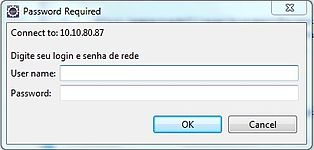
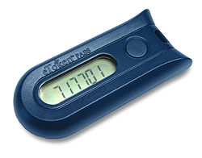
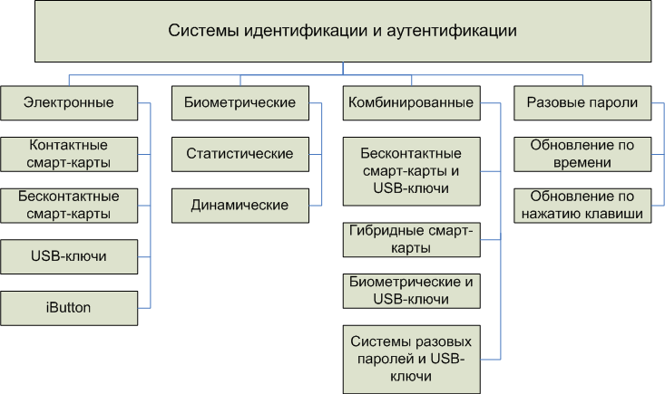
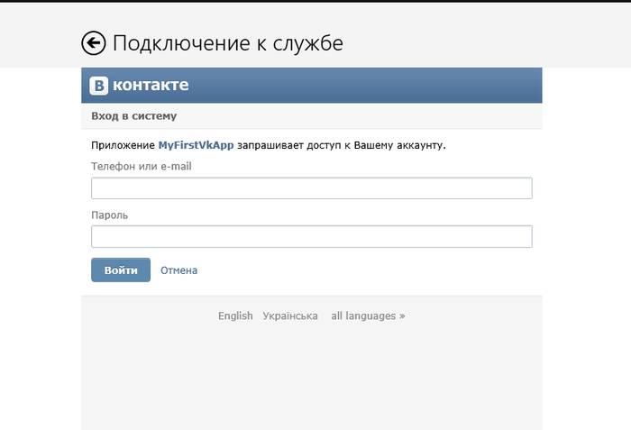
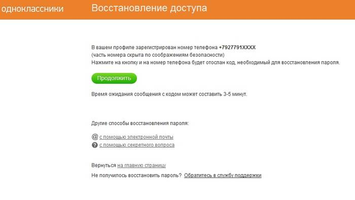
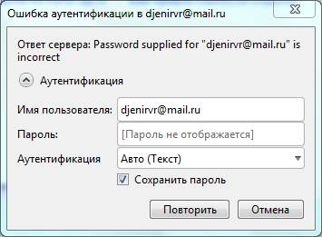
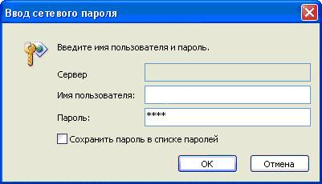
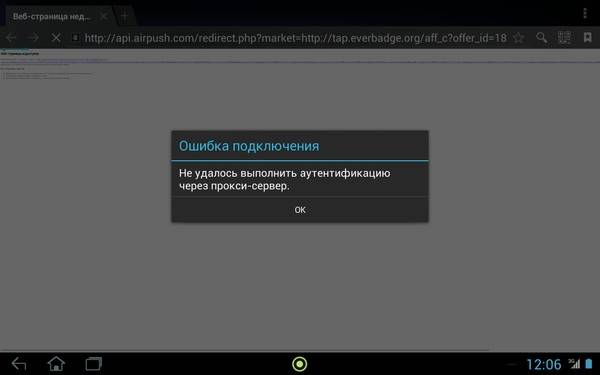
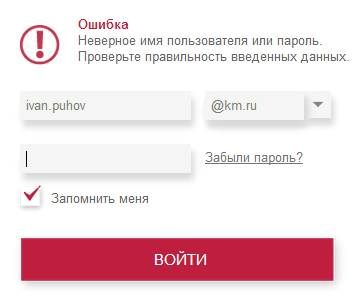

**Тема 25 Аутентификация**

1 Идентификация

2 Авторизация

3 Типы аутентификации

4 Парольная защита

5 Биометрика

6 Пользовательские данные

7 Технология и алгоритм аутентификации

8 Технология проверки подлинности почтовым сервером

9 Алгоритм аутентификации на примере авторизации в локальной сети

**Аутентификация**

**Аутентификация** (англ. *authentication* < греч. αὐθεντικός [authentikos] «реальный, подлинный» < αὐτός [autos] «сам; он самый») — процедура проверки подлинности, например:

- проверка подлинности пользователя путём сравнения введённого им пароля (для указанного логина) с паролем, сохранённым в базе данных пользовательских логинов;
- подтверждение подлинности электронного письма путём проверки цифровой подписи письма по открытому ключу отправителя;
- проверка контрольной суммы файла на соответствие сумме, заявленной автором этого файла.

В русском языке термин применяется, в основном, в области информационных технологий.

Учитывая степень доверия и политику безопасности систем, проводимая проверка подлинности может быть *односторонней* или *взаимной*. Обычно она проводится с помощью криптографических способов.

*Аутентификацию* не следует путать с *авторизацией* (процедурой предоставления субъекту определённых прав) и *идентификацией* (процедурой распознавания субъекта по его идентификатору).

**Стандарты:**

Документы, определяющие стандарты аутентификации

**ГОСТ Р ИСО/МЭК 9594-8-98 — Основы аутентификации** 

Настоящий стандарт:

- определяет формат информации аутентификации, хранимой справочником;
- описывает способ получения из справочника информации аутентификации;
- устанавливает предпосылки о способах формирования и размещения в справочнике информации аутентификации;
- определяет три способа, с помощью которых прикладные программы могут использовать такую информацию аутентификации для выполнения аутентификации, и описывает, каким образом с помощью аутентификации могут быть обеспечены другие услуги защиты.

В настоящем стандарте изложены два вида аутентификации: простая, использующая пароль как проверку заявленной идентичности, и строгая, использующая удостоверения личности, созданные с использованием криптографических методов

**FIPS 113 — COMPUTER DATA AUTHENTICATION** 

Настоящий стандарт устанавливает Data Authentication Algorithm(DAA), который может быть использован для обнаружения несанкционированных изменений данных, как преднамеренных, так и случайных, стандарт основан на алгоритме, указанном в Data Encryption Standard(DES) Federal Information Processing Standards Publication(FIPS PUB) 46, и совместим как с Department of the Treasury’s Electronic Funds and Security Transfer Policy and the American National Standards Institute(ANSI) так и с Standard for Financial Institution Message Authentication.

Данный стандарт используется для контроля над целостностью передаваемой информации средствами криптографической аутентификации.

**Элементы системы аутентификации**

В любой системе аутентификации обычно можно выделить несколько элементов:

- *субъект*, который будет проходить процедуру
- *характеристика* субъекта — отличительная черта
- *хозяин системы аутентификации*, несущий ответственность и контролирующий её работу
- сам *механизм аутентификации*, то есть принцип работы системы
- *механизм управления доступом*, предоставляющий определённые права доступа субъекту

|**Элемент аутентификации**|**Пещера 40 разбойников**|**Регистрация в системе**|**Банкомат**|
| - | - | - | - |
|**Субъект**|Человек, знающий пароль|Авторизованный пользователь|Держатель банковской карты|
|**Характеристика**|Пароль "Сим-Сим, откройся!"|Тайный пароль|Банковская карта и персональный идентификатор|
|**Хозяин системы**|40 разбойников|Предприятие, которому принадлежит система|Банк|
|**Механизм аутентификации**|Волшебное устройство, реагирующее на слова|Программное обеспечение, проверяющее пароль|Программное обеспечение, проверяющее карту и персональный идентификатор|
|**Механизм управления доступом**|Механизм, отодвигающий камень от входа в пещеру|Процесс регистрации, управления доступом|Разрешение на выполнение банковских действий|
**Факторы аутентификации**

Ещё до появления компьютеров использовались различные отличительные черты субъекта, его характеристики. Сейчас использование той или иной характеристики в системе зависит от требуемой надёжности, защищённости и стоимости внедрения. Выделяют 3 фактора аутентификации:

- **Нечто, что нам известно, например, какая-либо секретная информация**. Это тайные сведения, которыми должен обладать только авторизованный субъект. Секретом может быть некая фраза или пароль, например в виде устного сообщения, текстового представления, комбинации для замка или личного идентификационного номера (PIN). Парольный механизм может быть довольно легко воплощён и имеет низкую стоимость. Но имеет существенные недостатки: сохранить пароль в тайне зачастую бывает сложно, злоумышленники постоянно придумывают новые способы кражи, взлома и подбора пароля. Это делает парольный механизм слабозащищённым.
- **Нечто, чем мы обладаем, например, какой-либо уникальный физический объект**. Здесь важно обстоятельство обладания субъектом каким-то неповторимым предметом. Это может быть личная печать, ключ от замка, для компьютера это файл данных, содержащих характеристику. Характеристика часто встраивается в особое устройство аутентификации, например, пластиковая карта, смарт-карта. Для злоумышленника заполучить такое устройство становится более сложно, чем взломать пароль, а субъект может сразу же сообщить в случае кражи устройства. Это делает данный метод более защищённым, чем парольный механизм, однако стоимость такой системы более высокая.
- **Нечто, что является неотъемлемой частью нас самих — биометрика**. Характеристикой является физическая особенность субъекта. Это может быть портрет, отпечаток пальца или ладони, голос или особенность глаза. С точки зрения субъекта, данный способ является наиболее простым: не надо ни запоминать пароль, ни переносить с собой устройство аутентификации. Однако биометрическая система должна обладать высокой чувствительностью, чтобы подтверждать авторизованного пользователя, но отвергать злоумышленника со схожими биометрическими параметрами. Также стоимость такой системы довольно велика. Но, несмотря на свои недостатки, биометрика остается довольно перспективным фактором.

**Способы аутентификации**

**Аутентификация при помощи электронной подписи** 

Федеральный закон от 06.04.2011 N 63-ФЗ «Об электронной подписи» (с изменениями) предусматривает следующие виды электронной подписи:

- **Простая электронная подпись** — электронная подпись, которая посредством использования кодов, паролей или иных средств подтверждает факт формирования электронной подписи определенным лицом.
- **Неквалифицированная электронная подпись** — электронная подпись, которая:
1. получена в результате криптографического преобразования информации с использованием ключа электронной подписи;
1. позволяет определить лицо, подписавшее электронный документ;
1. позволяет обнаружить факт внесения изменений в электронный документ после момента его подписания;
1. создается с использованием средств электронной подписи.
- **Квалифицированная электронная подпись** — электронная подпись, которая соответствует всем признакам неквалифицированной электронной подписи и следующим дополнительным признакам:
1. ключ проверки электронной подписи указан в квалифицированном сертификате;
1. для создания и проверки электронной подписи используются средства электронной подписи, получившие подтверждение соответствия требованиям, установленным в соответствии с настоящим Федеральным законом.

**Аутентификация по паролям**

Аутентификация по многоразовым паролям

- Аутентификация по одноразовым паролям

**Аутентификация по многоразовым паролям** 

Форма ввода связки логин-пароля

Один из способов аутентификации в компьютерной системе состоит во вводе вашего пользовательского идентификатора, в просторечии называемого «логином» (англ. *login* — регистрационное имя пользователя, учётка) и пароля — неких конфиденциальных сведений. Достоверная (эталонная) пара логин-пароль хранится в специальной базе данных.

Простая аутентификация имеет следующий общий алгоритм:

1. Субъект запрашивает доступ в систему и вводит личный идентификатор и пароль.
1. Введённые неповторимые данные поступают на сервер аутентификации, где сравниваются с эталонными.
1. При совпадении данных с эталонными аутентификация признаётся успешной, при различии — субъект перемещается к 1-му шагу

Введённый субъектом пароль может передаваться в сети двумя способами:

- Незашифрованно, в открытом виде, на основе протокола парольной аутентификации (Password Authentication Protocol, PAP)
- С использованием шифрования SSL (криптографический протокол, который подразумевает более безопасную связь) или TLS (криптографические протоколы, обеспечивающие защищённую передачу данных между узлами в сети Интернет). В этом случае неповторимые данные, введённые субъектом, передаются по сети защищённо.

**Защищённость** 

С точки зрения наилучшей защищённости при хранении и передаче паролей следует использовать однонаправленные функции. Обычно для этих целей используются криптографически стойкие хеш-функции. В этом случае на сервере хранится только образ пароля. Получив пароль и проделав его хеш-преобразование, система сравнивает полученный результат с эталонным образом, хранящимся в ней. При их идентичности пароли совпадают. Для злоумышленника, получившего доступ к образу, вычислить сам пароль практически невозможно.

Использование многоразовых паролей имеет ряд существенных недостатков. Во-первых, сам эталонный пароль или его хешированный образ хранятся на сервере аутентификации. Зачастую хранение пароля производится без криптографических преобразований, в системных файлах. Получив доступ к ним, злоумышленник легко доберётся до конфиденциальных сведений. Во-вторых, субъект вынужден запоминать (или записывать) свой многоразовый пароль. Злоумышленник может заполучить его, просто применив навыки социальной инженерии, без всяких технических средств. Кроме того, сильно снижается защищенность системы в случае, когда субъект сам выбирает себе пароль. Зачастую им оказывается какое-то слово или сочетание слов, присутствующие в словаре. В ГОСТ 28147-89 длина ключа составляет 256 бит (32 байта). При использовании генератора псевдослучайных чисел ключ обладает хорошими статистическими свойствами. Пароль же, который является, например, словом из словаря, можно свести к псевдослучайному числу длиной 16 бит, что короче ГОСТ-ового ключа в 16 раз. При достаточном количестве времени злоумышленник может взломать пароль простым перебором. Решением этой проблемы является использование случайных паролей или ограниченность по времени действия пароля субъекта, по истечении которого пароль необходимо поменять.

**Базы учетных записей****  

На компьютерах с ОС семейства UNIX базой является файл /etc/master.passwd (в дистрибутивах Linux обычно файл /etc/shadow, доступный для чтения только root), в котором пароли пользователей хранятся в виде хеш-функций от открытых паролей, кроме этого, в этом же файле хранится информация о правах пользователя. Изначально в Unix-системах пароль (в зашифрованном виде) хранился в файле /etc/passwd, доступном для чтения всем пользователям, что было небезопасно.

На компьютерах с операционной системой Windows NT/2000/XP/2003 (не входящих в домен Windows) такая база данных называется SAM (Security Account Manager — Диспетчер защиты учётных записей). База SAM хранит учётные записи пользователей, включающие в себя все данные, необходимые системе защиты для функционирования. Находится в каталоге %windir%\system32\config\.

В доменах Windows Server 2000/2003 такой базой является Active Directory.

Однако более надёжным способом хранения аутентификационных данных признано использование особых аппаратных средств (компонентов).

При необходимости обеспечения работы сотрудников на разных компьютерах (с поддержкой системы безопасности) используют аппаратно-программные системы, позволяющие хранить аутентификационные данные и криптографические ключи на сервере организации. Пользователи свободно могут работать на любом компьютере (рабочей станции), имея доступ к своим аутентификационным данным и криптографическим ключам.

**Аутентификация по одноразовым паролям** 

Ключ-брелок eToken

Заполучив однажды многоразовый пароль субъекта, злоумышленник имеет постоянный доступ к взломанным конфиденциальным сведениям. Эта проблема решается применением одноразовых паролей (OTP — One Time Password). Суть этого метода — пароль действителен только для одного входа в систему, при каждом следующем запросе доступа — требуется новый пароль. Реализован механизм аутентификации по одноразовым паролям может быть как аппаратно, так и программно.

Технологии использования одноразовых паролей можно разделить на:

- Использование генератора псевдослучайных чисел, единого для субъекта и системы
- Использование временных меток вместе с системой единого времени
- Использование базы случайных паролей, единой для субъекта и для системы

В первом методе используется генератор псевдослучайных чисел с одинаковым значением для субъекта и для системы. Сгенерированный субъектом пароль может передаваться системе при последовательном использовании односторонней функции или при каждом новом запросе, основываясь на уникальной информации из предыдущего запроса.

Во втором методе используются временные метки. В качестве примера такой технологии можно привести SecurID. Она основана на использовании аппаратных ключей и синхронизации по времени. Аутентификация основана на генерации случайных чисел через определенные временные интервалы. Уникальный секретный ключ хранится только в базе системы и в аппаратном устройстве субъекта. Когда субъект запрашивает доступ в систему, ему предлагается ввести PIN-код, а также случайно генерируемое число, отображаемое в этот момент на аппаратном устройстве. Система сопоставляет введенный PIN-код и секретный ключ субъекта из своей базы и генерирует случайное число, основываясь на параметрах секретного ключа из базы и текущего времени. Далее проверяется идентичность сгенерированного числа и числа, введённого субъектом.

Третий метод основан на единой базе паролей для субъекта и системы и высокоточной синхронизации между ними. При этом каждый пароль из набора может быть использован только один раз. Благодаря этому, даже если злоумышленник перехватит используемый субъектом пароль, то он уже будет недействителен.

По сравнению с использованием многоразовых паролей одноразовые пароли предоставляют более высокую степень защиты.

**Аутентификация с помощью SMS** 

Актуальность обеспечения безопасности мобильных средств коммуникации, например, ip-phone, стимулирует новые разработки в этой области. Среди них можно назвать аутентификацию с помощью SMS-сообщений.

Процедура такой аутентификации включает в себя следующие шаги:

1. Ввод имени пользователя и пароля
1. Сразу после этого PhoneFactor (служба безопасности) присылает одноразовый аутентификационный ключ в виде текстового SMS-сообщения.
1. Полученный ключ используется для аутентификации

Привлекательность данного метода заключается в том, что ключ получается не по тому каналу, по которому производится аутентификация (out-of-band), что практически исключает атаку типа «человек посередине». Дополнительный уровень безопасности может дать требование ввода PIN-кода мобильного средства.

Данный метод получил широкое распространение в банковских операциях через интернет.

**Биометрическая аутентификация** 

**Биометрические системы аутентификации** — системы аутентификации, использующие для удостоверения личности людей их биометрические данные.

**Биометрическая аутентификация** — процесс доказательства и проверки подлинности заявленного пользователем имени, через предъявление пользователем своего биометрического образа и путём преобразования этого образа в соответствии с заранее определённым протоколом аутентификации.

Не следует путать данные системы с системами биометрической идентификации, каковыми являются, к примеру системы распознавания лиц водителей и биометрические средства учёта рабочего времени. Биометрические системы аутентификации работают в активном, а не пассивном режиме и почти всегда подразумевают авторизацию. Хотя данные системы не идентичны системам авторизации, они часто используются совместно (например, в дверных замках с проверкой отпечатка пальца).

**Методы аутентификации**

Различные системы контролируемого обеспечения доступа можно разделить на три группы в соответствии с тем, что человек собирается предъявлять системе:

1. Парольная защита. Пользователь предъявляет секретные данные (например, PIN-код или пароль).
1. Использование ключей. Пользователь предъявляет свой персональный идентификатор, являющийся физическим носителем секретного ключа. Обычно используются пластиковые карты с магнитной полосой и другие устройства.
1. Биометрия. Пользователь предъявляет параметр, который является частью его самого. Биометрический класс отличается тем, что идентификации подвергаются биологические особенности человека — его индивидуальные характеристики (рисунок папиллярного узора, отпечатки пальцев, термограмму лица и т. д.).

Биометрические системы доступа являются очень удобными для пользователей. В отличие от паролей и носителей информации, которые могут быть потеряны, украдены, скопированы, Биометрические системы доступа основаны на человеческих параметрах, которые всегда находятся вместе с ними, и проблема их сохранности не возникает. Потерять их почти невозможно. Также невозможна передача идентификатора третьим лицам. Впрочем можно насильственно изъять параметры. В кинофильмах и анимации было неоднократно показано, что глаза и руки можно ампутировать (или использовать пользователя как заложника-токен). Можно так же изготовить копии, в том числе и скрытно считав параметры. Однако многие методы имеют защиту от использования мертвого органа или копии. Так, многие сканеры радужной оболочки имеют так же инфракрасный сканер, определяющие теплый ли глаз/макет или нет (можно обойти, нагрев глаз или использовать линзы с рисунком). Проводятся исследования возможности использования кратковременной вспышки и сканирования моторной реакции зрачка, однако метод имеет потенциальные проблемы при использовании офтальмологических препаратов и наркотическом опьянении. Сканеры отпечатков пальцев могут комбинировать емкостное и ультразвуковое (защищает от копии распечатанной струйным принтером токопроводящими чернилами) сканирование (можно обмануть с помощью 3D принтера и токопроводящего материала). Надежнее всего здесь метод сканирования сетчатки глаза, изготовить макет очень сложно, после смерти же сосуды сетчатки перестают накачиваться кровью, и сканер способен это определить. Полностью насильственное использование заложника потенциально можно определить с помощью анализа поведения на видео, например, при помощи нейронных сетей.

**Обзор биометрических методов аутентификации**

В настоящее время широко используется большое количество методов биометрической аутентификации, которые делятся на два класса.

- *Статические методы* биометрической аутентификации основаны на физиологических характеристиках человека, присутствующих от рождения и до смерти, находящиеся при нём в течение всей его жизни, и которые не могут быть потеряны, украдены и скопированы.
- *Динамические методы* биометрической аутентификации основываются на поведенческих характеристиках людей, то есть основаны на характерных для подсознательных движений в процессе воспроизведения или повторения какого-либо обыденного действия. 

Критерии для биометрических параметров. Они обязаны соответствовать следующим пунктам:

1. **Всеобщность:** Данный признак должен присутствовать у всех людей без исключения.
1. **Уникальность**: Биометрия отрицает существование двух людей с одинаковыми физическими и поведенческими параметрами.
1. **Постоянство:** для корректной аутентификации необходимо постоянство во времени.
1. **Измеримость:** специалисты должны иметь возможность измерить признак каким-либо устройством для дальнейшего занесения в базу данных.
1. **Приемлемость:** общество не должно быть против сбора и измерения биометрического параметра.

**Статические методы** 

**Аутентификация по отпечатку пальца** 

Идентификация по отпечаткам пальцев — самая распространенная биометрическая технология аутентификации пользователей. Метод использует уникальность рисунка папиллярных узоров на пальцах людей. Отпечаток, полученный с помощью сканера, преобразовывается в цифровой код, а затем сравнивается с ранее введенными наборами эталонов. Преимущества использования аутентификации по отпечаткам пальцев — легкость в использовании, удобство и надежность. Универсальность этой технологии позволяет применять её в любых сферах и для решения любых и самых разнообразных задач, где необходима достоверная и достаточно точная идентификация пользователей.

Для получения сведений об отпечатках пальцев применяются специальные сканеры. Чтобы получить отчётливое электронное представление отпечатков пальцев, используют достаточно специфические методы, так как отпечаток пальца слишком мал, и очень трудно получить хорошо различимые папиллярные узоры.

Обычно применяются три основных типа сканеров отпечатков пальцев: ёмкостные, прокатные, оптические. Самые распространенные и широко используемые это оптические сканеры, но они имеют один серьёзный недостаток. Оптические сканеры неустойчивы к муляжам и мертвым пальцам, а это значит, что они не столь эффективны, как другие типы сканеров. Так же в некоторых источниках сканеры отпечатков пальцев делят на 3 класса по их физическим принципам: оптические, кремниевые, ультразвуковые.

**Аутентификация по радужной оболочке глаза** 

Данная технология биометрической аутентификации личности использует уникальность признаков и особенностей радужной оболочки человеческого глаза. Радужная оболочка — тонкая подвижная диафрагма глаза у позвоночных с отверстием (зрачком) в центре; расположена за роговицей, между передней и задней камерами глаза, перед хрусталиком. Радужная оболочка образовывается ещё до рождения человека, и не меняется на протяжении всей жизни. Радужная оболочка по текстуре напоминает сеть с большим количеством окружающих кругов и рисунков, которые могут быть измерены компьютером, рисунок радужки очень сложен, это позволяет отобрать порядка 200 точек, с помощью которых обеспечивается высокая степень надежности аутентификации. Для сравнения, лучшие системы идентификации по отпечаткам пальцев используют 60-70 точек.

Технология распознавания радужной оболочки глаза была разработана для того, чтобы свести на нет навязчивость сканирования сетчатки глаза, при котором используются инфракрасные лучи или яркий свет. Ученые также провели ряд исследований, которые показали, что сетчатка глаза человека может меняться со временем, в то время как радужная оболочка глаза остается неизменной. И самое главное, что невозможно найти два абсолютно идентичных рисунка радужной оболочки глаза, даже у близнецов. Для получения индивидуальной записи о радужной оболочке глаза черно-белая камера делает 30 записей в секунду. Еле различимый свет освещает радужную оболочку, и это позволяет видеокамере сфокусироваться на радужке. Одна из записей затем оцифровывается и сохраняется в базе данных зарегистрированных пользователей. Вся процедура занимает несколько секунд, и она может быть полностью компьютеризирована при помощи голосовых указаний и автофокусировки. Камера может быть установлена на расстоянии от 10 см до 1 метра, в зависимости от сканирующего оборудования. Термин «сканирование» может быть обманчивым, так как в процессе получения изображения проходит не сканирование, а простое фотографирование. Затем полученное изображение радужки преобразуется в упрощенную форму, записывается и хранится для последующего сравнения. Очки и контактные линзы, даже цветные, не воздействуют на качество аутентификации.

Стоимость всегда была самым большим сдерживающим моментом перед внедрением технологии, но сейчас системы идентификации по радужной оболочке становятся более доступными для различных компаний. Сторонники технологии заявляют о том, что распознавание радужной оболочки глаза очень скоро станет общепринятой технологией идентификации в различных областях.

**Аутентификация по сетчатке глаза** 

Метод аутентификации по сетчатке глаза получил практическое применение примерно в середине 50-х годов прошлого века. Именно тогда была установлена уникальность рисунка кровеносных сосудов глазного дна (даже у близнецов данные рисунки не совпадают). Для сканирования сетчатки используется инфракрасное излучение низкой интенсивности, направленное через зрачок к кровеносным сосудам на задней стенке глаза. Из полученного сигнала выделяется несколько сотен особых точек, информация о которых сохраняется в шаблоне.

К недостаткам подобных систем следует в первую очередь отнести психологический фактор: не всякому человеку приятно смотреть в непонятное темное отверстие, где что-то светит в глаз. К тому же, подобные системы требуют чёткого изображения и, как правило, чувствительны к неправильной ориентации сетчатки. Поэтому требуется смотреть очень аккуратно, а наличие некоторых заболеваний (например, катаракты) может препятствовать использованию данного метода. Сканеры для сетчатки глаза получили большое распространение для доступа к сверхсекретным объектам, поскольку обеспечивают одну из самых низких вероятностей ошибки первого рода (отказ в доступе для зарегистрированного пользователя) и почти нулевой процент ошибок второго рода.

**Аутентификация по геометрии руки** 

В этом биометрическом методе для аутентификации личности используется форма кисти руки. Из-за того, что отдельные параметры формы руки не являются уникальными, приходится использовать несколько характеристик. Сканируются такие параметры руки, как изгибы пальцев, их длина и толщина, ширина и толщина тыльной стороны руки, расстояние между суставами и структура кости. Также геометрия руки включает в себя мелкие детали (например, морщины на коже). Хотя структура суставов и костей являются относительно постоянными признаками, но распухание тканей или ушибы руки могут исказить исходную структуру. Проблема технологии: даже без учёта возможности ампутации, заболевание под названием «артрит» может сильно помешать применению сканеров.

С помощью сканера, который состоит из камеры и подсвечивающих диодов (при сканировании кисти руки, диоды включаются по очереди, это позволяет получить различные проекции руки), строится трёхмерный образ кисти руки. Надежность аутентификации по геометрии руки сравнима с аутентификацией по отпечатку пальца.

Системы аутентификации по геометрии руки широко распространены, что является доказательством их удобства для пользователей. Использование этого параметра привлекательно по ряду причин. Процедура получения образца достаточно проста и не предъявляет высоких требований к изображению. Размер полученного шаблона очень мал, несколько байт. На процесс аутентификации не влияют ни температура, ни влажность, ни загрязнённость. Подсчеты, производимые при сравнении с эталоном, очень просты и могут быть легко автоматизированы.

Системы аутентификации, основанные на геометрии руки, начали использоваться в мире в начале 70-х годов. 

**Аутентификация по геометрии лица** 

Биометрическая аутентификация человека по геометрии лица довольно распространенный способ идентификации и аутентификации. Техническая реализация представляет собой сложную математическую задачу. Обширное использование мультимедийных технологий, с помощью которых можно увидеть достаточное количество видеокамер на вокзалах, аэропортах, площадях, улицах, дорогах и других местах скопления людей, стало решающим в развитии этого направления. Для построения трёхмерной модели человеческого лица, выделяют контуры глаз, бровей, губ, носа, и других различных элементов лица, затем вычисляют расстояние между ними, и с помощью него строят трёхмерную модель. Для определения уникального шаблона, соответствующего определённому человеку, требуется от 12 до 40 характерных элементов. Шаблон должен учитывать множество вариаций изображения на случаи поворота лица, наклона, изменения освещённости, изменения выражения. Диапазон таких вариантов варьируется в зависимости от целей применения данного способа (для идентификации, аутентификации, удаленного поиска на больших территориях и т. д.). Некоторые алгоритмы позволяют компенсировать наличие у человека очков, шляпы, усов и бороды. 

**Аутентификация по термограмме лица** 

Способ основан на исследованиях, которые показали, что термограмма лица уникальна для каждого человека. Термограмма получается с помощью камер инфракрасного диапазона. В отличие от аутентификации по геометрии лица, данный метод различает близнецов. Использование специальных масок, проведение пластических операций, старение организма человека, температура тела, охлаждение кожи лица в морозную погоду не влияют на точность термограммы. Из-за невысокого качества аутентификации, метод на данный момент не имеет широкого распространения.

**Динамические методы** 

**Аутентификация по голосу** 

Биометрический метод аутентификации по голосу, характеризуется простотой в применении. Данному методу не требуется дорогостоящая аппаратура, достаточно микрофона и звуковой платы. В настоящее время данная технология быстро развивается, так как этот метод аутентификации широко используется в современных бизнес-центрах. Существует довольно много способов построения шаблона по голосу. Обычно, это разные комбинации частотных и статистических характеристик голоса. Могут рассматриваться такие параметры, как модуляция, интонация, высота тона, и т. п.

Основным и определяющим недостатком метода аутентификации по голосу — низкая точность метода. Например, человека с простудой система может не опознать. Важную проблему составляет многообразие проявлений голоса одного человека: голос способен изменяться в зависимости от состояния здоровья, возраста, настроения и т. д. Это многообразие представляет серьёзные трудности при выделении отличительных свойств голоса человека. Кроме того, учёт шумовой компоненты является ещё одной важной и не решенной проблемой в практическом использовании аутентификации по голосу. Так как вероятность ошибок второго рода при использовании данного метода велика (порядка одного процента), аутентификация по голосу применяется для управления доступом в помещениях среднего уровня безопасности, такие как компьютерные классы, лаборатории производственных компаний и т. д. 

**Аутентификация по рукописному почерку** 

Метод биометрической аутентификации по рукописному почерку основывается на специфическом движении человеческой руки во время подписания документов. Для сохранения подписи используют специальные ручки или восприимчивые к давлению поверхности. Этот вид аутентификации человека использует его подпись. Шаблон создается в зависимости от необходимого уровня защиты. Обычно выделяют два способа обработки данных о подписи:

- Анализ самой подписи, то есть используется просто степень совпадения двух картинок.
- Анализ динамических характеристик написания, то есть для аутентификации строится свертка, в которую входит информация по подписи, временными и статистическими характеристиками её написания.

**Комбинированная биометрическая система аутентификации**

Комбинированная (мультимодальная) биометрическая система аутентификации применяет различные дополнения для использования нескольких типов биометрических характеристик, что позволяет соединить несколько типов биометрических технологий в системах аутентификации в одной. Это позволяет удовлетворить самые строгие требования к эффективности системы аутентификации. Например, аутентификация по отпечаткам пальцев может легко сочетаться со сканированием руки. Такая структура может использовать все виды биометрических данных человека и может применяться там, где приходится форсировать ограничения одной биометрической характеристики. Комбинированные системы являются более надежными с точки зрения возможности имитации биометрических данных человека, так как труднее подделать целый ряд характеристик, чем фальсифицировать один биометрический признак.

**В то же время биометрическая аутентификация имеет ряд недостатков:**

1. Биометрический шаблон сравнивается не с результатом первоначальной обработки характеристик пользователя, а с тем, что пришло к месту сравнения. За время пути может много чего произойти.
1. База шаблонов может быть изменена злоумышленником.
1. Следует учитывать разницу между применением биометрии на контролируемой территории, под бдительным оком охраны, и в «полевых» условиях, когда, например, к устройству сканирования могут поднести муляж и т. п.
1. Некоторые биометрические данные человека меняются (как в результате старения, так и травм, ожогов, порезов, болезни, ампутации и т. д.), так что база шаблонов нуждается в постоянном сопровождении, а это создает определенные проблемы и для пользователей, и для администраторов.
1. Если у Вас крадут биометрические данные или их компрометируют, то это, как правило, на всю жизнь. Пароли, при всей их ненадежности, в крайнем случае можно сменить. Палец, глаз или голос сменить нельзя, по крайней мере быстро.
1. Биометрические характеристики являются уникальными идентификаторами, но их нельзя сохранить в секрете.

**Аутентификация через географическое местоположение** 

- Аутентификация посредством GPS
- Аутентификация, основанная на местоположении выхода в интернет

**Аутентификация посредством GPS** 

Новейшим направлением аутентификации является доказательство подлинности удаленного пользователя по его местонахождению. Данный защитный механизм основан на использовании системы космической навигации, типа GPS (Global Positioning System).

Пользователь, имеющий аппаратуру GPS, многократно посылает координаты заданных спутников, находящихся в зоне прямой видимости. Подсистема аутентификации, зная орбиты спутников, может с точностью до метра определить месторасположение пользователя. Высокая надежность аутентификации определяется тем, что орбиты спутников подвержены колебаниям, предсказать которые достаточно трудно. Кроме того, координаты постоянно меняются, что сводит на нет возможность их перехвата.

Сложность взлома системы состоит в том, что аппаратура передает оцифрованный сигнал спутника, не производя никаких вычислений. Все вычисления о местоположении производят на сервере аутентификации.

Аппаратура GPS проста и надежна в использовании и сравнительно недорога. Это позволяет её использовать в случаях, когда авторизованный удаленный пользователь должен находиться в нужном месте.

**Аутентификация, основанная на местоположении выхода в интернет** 

Данный механизм основан на использовании информации о местоположении серверов, точек доступа беспроводной связи, через которые осуществляется подключение к сети интернет.

Относительная простота взлома состоит в том, что информацию о местоположении можно изменить, используя так называемые прокси-серверы или системы анонимного доступа.

**Многофакторная аутентификация** 

В последнее время всё чаще применяется так называемая расширенная, или многофакторная, аутентификация. Она построена на совместном использовании нескольких факторов аутентификации. Это значительно повышает защищённость системы.

В качестве примера можно привести использование SIM-карт в мобильных телефонах. Субъект вставляет аппаратно свою карту (устройство аутентификации) в телефон и при включении вводит свой PIN-код (пароль).

Также, к примеру, в некоторых современных ноутбуках присутствует сканер отпечатка пальца. Таким образом, при входе в систему субъект должен пройти эту процедуру (биометрика), а потом ввести пароль.

Выбирая для системы тот или иной фактор или способ аутентификации, необходимо, прежде всего, отталкиваться от требуемой степени защищенности, стоимости построения системы, обеспечения мобильности субъекта.

Можно привести сравнительную таблицу:

|**Уровень риска**|**Требования к системе**|**Технология аутентификации**|**Примеры применения**|
| - | - | - | - |
|**Низкий**|Требуется осуществить аутентификацию для доступа к системе, причём кража, взлом, разглашение конфиденциальных сведений **не будут иметь значительных последствий**|Рекомендуется минимальное требование - использование многоразовых паролей|Регистрация на портале в сети Интернет|
|**Средний**|Требуется осуществить аутентификацию для доступа к системе, причём кража, взлом, разглашение конфиденциальных сведений причинят **небольшой ущерб**|Рекомендуется минимальное требование - использование одноразовых паролей|Произведение субъектом банковских операций|
|**Высокий**|Требуется осуществить аутентификацию для доступа к системе, причём кража, взлом, разглашение конфиденциальных сведений причинят **значительный ущерб**|Рекомендуется минимальное требование - использование многофакторной аутентификации|Проведение крупных межбанковских операций руководящим аппаратом|
**Протоколы аутентификации**

Процедура аутентификации используется при обмене информацией между компьютерами, при этом используются весьма сложные криптографические протоколы, обеспечивающие защиту линии связи от прослушивания или подмены одного из участников взаимодействия. А поскольку, как правило, аутентификация необходима обоим объектам, устанавливающим сетевое взаимодействие, то аутентификация может быть и взаимной.

Таким образом, можно выделить несколько семейств аутентификации:

Аутентификация пользователя на PC:

- Шифрованное имя (login)
- Password Authentication Protocol, PAP (связка логин-пароль)
- Карта доступа (USB с сертификатом, SSO)
- Биометрия (голос, отпечаток пальца/ладони/радужки глаза)

Аутентификация в сети:

- Secure SNMP с использованием цифровой подписи
- SAML (Security Assertion Markup Language)
- Cookie сессии
- Kerberos Tickets
- Сертификаты X.509
- OpenID Connect аутентификационная надстройка над протоколом OAuth 2.0

В операционных системах семейства Windows NT 4 используется протокол NTLM (NT LAN Manager — Диспетчер локальной сети NT). А в доменах Windows 2000/2003 применяется гораздо более совершенный протокол Kerberos.

**Аутентификация в Интернете**

Аутентификация требуется при доступе к таким сервисам как:

- электронная почта
- веб-форум
- социальные сети
- интернет-банкинг
- платежные системы
- корпоративные сайты
- интернет-магазины

Положительным результатом аутентификации (кроме установления доверительных отношений и выработки сессионного ключа) является авторизация пользователя, то есть предоставление ему прав доступа к ресурсам, определенным для выполнения его задач.

**Виды аутентификации по  признакам делят на несколько групп:**

- информационная составляющая (когда вы знаете то, что никому другому неизвестно, например, пароль);
- предмет или средство (в случае использования карточки, ключа-марки, жетона, специальной USB-флешки);
- биометрика (доступ по сетчатке глаза, отпечатку пальца, группе крови);
- пользовательская информация (доступ к определенной информации в зависимости от места нахождения, языка, информации из кэша браузера).

**Идентификация**

Идентификация требует, чтобы пользователь был так или иначе известен ИС. Она обычно основана на назначении пользователю идентификатора пользователя. С каждым объектом компьютерной системы (КС) связана некоторая информация, однозначно идентифицирующая его. Это может быть число, строка символов, алгоритм, определяющий данный объект. Эту информацию называют идентификатором объекта. Если объект имеет некоторый идентификатор, зарегистрированный в сети, он называется законным (легальным) объектом; остальные объекты относятся к незаконным (нелегальным). Однако ИС не может доверять заявленному идентификатору без подтверждения его подлинности. Установление подлинности возможно при наличии у пользователя уникальных особенностей и чем их больше, меньше риск подмены законного пользователя. Требование, определяющее необходимость аутентификации, должно учитываться (явно или неявно) в большинстве политик безопасности ИС.

Под **идентификацией** («кто это?) понимают присвоение субъектам доступа уникальных идентификаторов и сравнение этих идентификаторов с перечнем возможных, т.е. определение тождественности пользователя или пользовательского процесса, необходимое для управления доступом. Цель идентификации: отслеживание действий пользователя в системе. После идентификации обычно производится аутентификация. Под аутентификацией пользователя (субъекта) понимается установление его подлинности. **Аутентификация** – проверка принадлежности субъекту доступа предъявленного им идентификатора и подтверждение его подлинности. (он ли это на самом деле?)

Для того чтобы установить подлинность субъектов и объектов системы, все субъекты и объекты, зарегистрированные в системе, должны иметь уникальные имена – идентификатоpы. Когда какой-либо субъект обращается к ресурсам системы, необходимо установить его подлинность, опознать его (процесс авторизации или аутентификации). Установление подлинности субъекта (объекта) заключается в подтверждении того, что обратившийся субъект (вызываемый объект) является именно тем, которому разрешено участвовать в данном процессе (выполнять действия).

Для аутентификации субъекта чаще всего используются атрибутивные идентификаторы, которые делятся на следующие категории:

· пароли;

· съёмные носители информации;

· электронные жетоны;

· пластиковые карты;

· механические ключи.

В качестве идентификаторов могут использоваться, например, имя пользователя (логин), аппаратные устройства типа iButton (Touch Memory), бесконтактные радиочастотные карты proximity, отдельные виды пластиковых карт и т.д. Идентификаторы субъектов не являются секретной информацией и могут храниться в компьютерной системе в открытом виде.

В качестве аутентифицирующей информации может использоваться, например, пароль, секретный код, пин-код и т.д. Информация, используемая субъектом для аутентификации, должна сохраняться им в секрете. Хищение данной информации ведет к тому, что злоумышленник сможет пройти этап идентификации и аутентификации без обнаружения фальсификации.

В зависимости от сложности установления подлинности различают три основные группы операций:

Простое установление подлинности сводится к сравнению предъявленного кода (характеристики) с эталонным кодом, который хранится в памяти устройства, выполняющего установление подлинности.

Усложненное установление подлинности требует от пользователя ввода дополнительной информации и осуществляется в режиме диалога. Особое установление подлинности, кроме использования методов простого и усложненного установления подлинности, использует специальную совокупность опознавательных характеристик, которая выбирается для обеспечения надежного установления подлинности.

Установление подлинности по почерку производится, например, с помощью специальной ручки-датчика. При этом используются методы сопоставления контуров, анализа специфических штрихов и гистограмм.

При установлении подлинности по голосу используются следующие параметры: тембр, высота звука, акцент, интонация, сила звука и скорость речи, основано на спектральных методах и не зависит от содержания речи.

Установление подлинности по отпечаткам пальцев производится путем сличения предъявленных отпечатков пальцев с эталонными.

Некоторые производители реализуют система установления подлинности на базе пластиковых карт, на которые кодовая информация записывается и считывается лазерно- голографическими методами. Такие карты могут использоваться в двух режимах: ключа и персонального идентификационного кода (ПИК). В режиме ключа карта служит для открывания специальных голографических электронно-механических замков, устанавливаемых на защищаемых объектах. В режиме ПИК карта используется для ограничения доступа к терминалам вычислительной системы и хранящимся в ней данным. Для этого на карту заносится ПИК пользователя, занимающий от 64 до 256 бит.

Каждый пользователь, прежде чем получить право совершать какие-либо действия в системе, должен идентифицировать себя. Обычный способ идентификации – ввод имени пользователя при входе в систему. В свою очередь, система должна проверить подлинность личности пользователя, то есть что он является именно тем, за кого себя выдает. Стандартное средство проверки подлинности (аутентификации) – пароль, хотя в принципе могут использоваться также разного рода личные карточки, биометрические устройства (сканирование роговицы или отпечатков пальцев) или их комбинация. Идентификация и аутентификация – первый и важнейший программно-технический рубеж информационной безопасности. Если не составляет проблемы получить доступ к системе под любым именем, то другие механизмы безопасности, теряют смысл. Очевидно и то, что без идентификации пользователей невозможно протоколирование их действий.

Как выглядит последовательность действий при ходе пользователя в КС (под «С» понимается система, под «|П» — пользователь):

\1. С: запрос имени, под которым пользователь зарегистрирован в базе данных учетных записей КС (логического имени пользователя или так называемого логина).

\2. П: ввод логического имени (ID).

\3. С: проверка наличия ID в регистрационной базе данных. Если пользователь с таким именем зарегистрирован, то запрос его идентифицирующей информации, в противном случае — возврат к п. 1.

\4. П: ввод идентифицирующей информации (Р).

\5. С: проверка совпадения Р с идентифицирующей информацией для пользователя ID в регистрационной базе данных. Если совпадение есть, то допуск пользователя к работе в КС, в противном случае — возврат к п. 3.

Этапы идентификации и аутентификации пользователя объединяются в единой подсистеме. Эти процедуры в защищенной системе осуществляются специальными программными (программно-аппаратными) средствами, встроенных в ОС или СЗИ. В настоящее время аппаратура КС поддерживает ввод пароля до начала загрузки операционной системы. Такой пароль хранится в энергонезависимой памяти и обеспечивает предотвращение НСД до загрузки любых программных средств. Этот пароль считается эффективным средством, если злоумышленник не имеет доступа к аппаратуре КС, так как отключение внутреннего питания сбрасывает этот пароль. 

Аутентификация бывает односторонней (обычно клиент доказывает свою подлинность серверу) и двусторонней (взаимной). Пример односторонней аутентификации – процедура входа пользователя в систему. Односторонняя проверка подлинности (субъект доказывает владельцу системы свои права доступа к информационным ресурсам или интернет-сайту).

Двусторонняя аутентификация (обоюдная проверка и установление подлинности как субъекта, так и владельца системы).  **Защищенное соединение SSL**чаще всего применяется в электронной коммерции. В качестве примера можно рассмотреть покупку товаров через электронный магазин. Покупатель, указывая номера и коды кредитных карт, хочет быть уверенным, что они не попадут злоумышленнику. Поэтому сервер удостоверяет свою подлинность, предоставляя сертификат клиенту. Гарантом этой подлинности является удостоверяющий центр. Шифрование данных клиента будет производиться открытым ключом сервера. Эти данные могут быть расшифрованы только закрытым ключом, который находится на сервере. Поэтому клиент может не опасаться, что злоумышленник перехватит его данные, он все равно не сможет их расшифровать.

Клиентский **SSL сертификат** применяется в случаях, когда серверу необходимо подтверждение, что клиент именно тот за кого себя выдает. Например, банк предоставляет сетевой доступ для управления личным счетом. Он хочет обезопасить себя и быть уверенным, что к нему обращается владелец данного счета, а не злоумышленник, раздобывший логин и пароль. В данной ситуации клиент предоставляет свой открытый ключ серверу и все полученные данные от сервера могут быть расшифрованы только клиентом и никем другим, т.к. он является владельцем закрытого ключа.

Идея строгой аутентификации, реализуемая в криптографических протоколах, заключается в следующем. Проверяемая (доказывающая) сторона доказывает свою подлинность проверяющей стороне, демонстрируя знание некоторого секрета. Например, этот секрет может быть предварительно распределен безопасным способом между сторонами аутентификационного обмена. Доказательство знания секрета осуществляется с помощью последовательности запросов и ответов с использованием криптографических методов и средств.

Существенным является факт, что доказывающая сторона демонстрирует только знание секрета, но сам секрет в ходе аутентификационного обмена не раскрывается. Это обеспечивается посредством ответов доказывающей стороны на различные запросы проверяющей стороны. При этом результирующий запрос зависит только от пользовательского секрета и начального запроса, который обычно представляет произвольно выбранное в начале протокола большое число

Процедура идентификации производится при включении компьютера и заключается в том, что сотрудник «представляется» компьютерной системе. При этом АС может предложить сотруднику выбрать свое имя из списка зарегистрированных пользователей или правильно ввести свой идентификатор. Далее пользователь должен убедить АС в том, что он действительно тот, кем представился.

КЛАССИФИКАЦИЯ СРЕДСТВ ИДЕНТИФИКАЦИИ И АУТЕНТИФИКАЦИИ.

Современные программно-аппаратные средства идентификации и аутентификации по виду идентификационных признаков можно разделить на электронные, биометрические и комбинированные. В отдельную подгруппу в связи с их специфическим применением можно выделить системы одноразовых паролей, входящие в состав электронных(рис. 1.).

` `

Рис.1. Классификация программно-аппаратных систем идентификации и аутентификации.

**Авторизация**

**Авторизация** – это предоставление доступа к какому-либо ресурсу (например, к электронной почте).

Средства авторизации (authorization) контролируют доступ легальных пользователей к ресурсам системы, предоставляя каждому из них именно те права, которые ему были определены администратором. Кроме предоставления прав доступа пользователям к каталогам, файлам и принтерам система авторизации может контролировать возможность выполнения пользователями различных системных функций, таких как локальный доступ к серверу, установка системного времени, создание резервных копий данных, выключение сервера и т. п.

Система авторизации наделяет пользователя сети правами выполнять определенные действия над определенными ресурсами. Для этого могут быть использованы различные формы предоставления правил доступа, которые часто делят на два класса:

•  избирательный доступ;

•   мандатный доступ.

Избирательные права доступа реализуются в операционных системах универсального назначения. В наиболее распространенном варианте такого подхода определенные операции над определенным ресурсом разрешаются или запрещаются пользователям или группам пользователей, явно указанным своими идентификаторами. Например, пользователю, имеющему идентификатор User\_T, может быть разрешено выполнять операции чтения и записи по отношению к файлу Filet. Модификацией этого способа является использование для идентификации пользователей их должностей, или факта их принадлежности к персоналу того или иного производственного подразделения, или еще каких-либо других позиционирующих характеристик. Примером такого правила может служить следующее: файл бухгалтерской отчетности BUCH могут читать работники бухгалтерии и руководитель предприятия.

Мандатный подход к определению прав доступа заключается в том, что вся информация делится на уровни в зависимости от степени секретности, а все пользователи сети также делятся на группы, образующие иерархию в соответствии с уровнем допуска к этой информации. Такой подход используется в известном делении информации на информацию для служебного пользования, «секретно», «совершенно секретно». При этом пользователи этой информации в зависимости от определенного для них статуса получают различные формы допуска: первую, вторую или третью. В отличие от систем с избирательными правами доступа в системах с мандатным подходом пользователи в принципе не имеют возможности изменить уровень доступности информации. Например, пользователь более высокого уровня не может разрешить читать данные из своего файла пользователю, относящемуся к более низкому уровню. Отсюда видно, что мандатный подход является более строгим, он в корне пресекает всякий волюнтаризм со стороны пользователя. Именно поэтому он часто используется в системах военного назначения.

Процедуры авторизации реализуются программными средствами, которые могут быть встроены в операционную систему или в приложение, а также могут поставляться в виде отдельных программных продуктов. При этом программные системы авторизации могут строиться на базе двух схем:

•  централизованная схема авторизации, базирующаяся на сервере; 

•  децентрализованная схема, базирующаяся на рабочих станциях.

В первой схеме сервер управляет процессом предоставления ресурсов пользователю. Главная цель таких систем — реализовать «принцип единого входа». В соответствии с централизованной схемой пользователь один раз логически входит в сеть и получает на все время работы некоторый набор разрешений по доступу к ресурсам сети. Система Kerberos с ее сервером безопасности и архитектурой клиент-сервер является наиболее известной системой этого типа. Системы TACACS и RADIUS, часто применяемые совместно с системами удаленного доступа, также реализуют этот подход.

При втором подходе рабочая станция сама является защищенной — средства защиты работают на каждой машине, и сервер не требуется. Рассмотрим работу системы, в которой не предусмотрена процедура однократного логического входа. Теоретически доступ к каждому приложению должен контролироваться средствами безопасности самого приложения или же средствами, существующими в той операционной среде, в которой оно работает. В корпоративной сети администратору придется отслеживать работу механизмов безопасности, используемых всеми типами приложений — электронной почтой, службой каталогов локальной сети, базами данных хостов и т. п. Когда администратору приходится добавлять или удалять пользователей, то часто требуется вручную конфигурировать доступ к каждой программе или системе.

В крупных сетях часто применяется комбинированный подход предоставления пользователю прав доступа к ресурсам сети: сервер удаленного доступа ограничивает доступ пользователя к подсетям или серверам корпоративной сети, то есть к укрупненным элементам сети, а каждый отдельный сервер сети сам по себе ограничивает доступ пользователя к своим внутренним ресурсам: разделяемым каталогам, принтерам или приложениям. Сервер удаленного доступа предоставляет доступ на основании имеющегося у него списка прав доступа пользователя (Access Control List, ACL), а каждый отдельный сервер сети предоставляет доступ к своим ресурсам на основании хранящегося у него списка прав доступа, например ACL файловой системы.

Подчеркнем, что системы аутентификации и авторизации совместно выполняют одну задачу, поэтому необходимо предъявлять одинаковый уровень требований к системам авторизации и аутентификации. Ненадежность одного звена здесь не может быть компенсирована высоким качеством другого звена. Если при аутентификации используются пароли, то требуются чрезвычайные меры по их защите. Однажды украденный пароль открывает двери ко всем приложениям и данным, к которым пользователь с этим паролем имел легальный доступ.

**Взаимосвязь идентификации, аутентификации и авторизации**

Все три процедуры взаимосвязаны:

1. Сначала определяют имя (логин или номер) – идентификация
1. Затем проверяют пароль (ключ или отпечаток пальца) – аутентификация
1. И в конце предоставляют доступ – авторизация

**Парольная защита**

При всём многообразии существующих механизмов аутентификации, наиболее распространённым из них остаётся парольная защита. Для этого есть несколько причин, из которых мы отметим следующие:

\- Относительная простота реализации. Действительно, реализация механизма парольной защиты обычно не требует привлечения дополнительных аппаратных средств.

\- Традиционность. Механизмы парольной защиты являются привычными для большинства пользователей автоматизированных систем и не вызывают психологического отторжения – в отличие, например, от сканеров рисунка сетчатки глаза. В то же время для парольных систем защиты характерен парадокс, затрудняющий их эффективную реализацию: стойкие пароли мало пригодны для использования человеком. Действительно, стойкость пароля возникает по мере его усложнения; но чем сложнее пароль, тем труднее его запомнить, и у пользователя появляется искушение записать неудобный пароль, что создаёт дополнительные каналы для его дискредитации. Остановимся более подробно на основных угрозах безопасности парольных систем. В общем случае пароль может быть получен злоумышленником одним из трёх основных способов:

\1. За счёт использования слабостей человеческого фактора. Методы получения паролей здесь могут быть самыми разными: подглядывание, подслушивание, шантаж, угрозы, наконец, использование чужих учётных записей с разрешения их законных владельцев.

\2. Путём подбора. При этом используются следующие методы:

\- Полный перебор. Данный метод позволяет подобрать любой пароль вне зависимости от его сложности, однако для стойкого пароля время, необходимое для данной атаки, должно значительно превышать допустимые временные ресурсы злоумышленника.

\- Подбор по словарю. Значительная часть используемых на практике паролей представляет собой осмысленные слова или выражения. Существуют словари наиболее распространённых паролей, которые во многих случаях позволяют обойтись без полного перебора.

\- Подбор с использованием сведений о пользователе. Данный интеллектуальный метод подбора паролей основывается на том факте, что если политика безопасности системы предусматривает самостоятельное назначение паролей пользователями, то в подавляющем большинстве случаев в качестве пароля будет выбрана некая персональная информация, связанная с пользователем АС. И хотя в качестве такой информации может быть выбрано что угодно, от дня рождения тёщи и до прозвища любимой собачки, наличие информации о пользователе позволяет проверить наиболее распространённые варианты (дни рождения, имена детей и т.д.).

\3. За счёт использования недостатков реализации парольных систем. К таким недостаткам реализации относятся эксплуатируемые уязвимости сетевых сервисов, реализующих те или иные компоненты парольной системы защиты, или же недекларированные возможности соответствующего программного или аппаратного обеспечения.

Рекомендации по практической реализации парольных систем

При построении системы парольной защиты необходимо учитывать специфику АС и руководствоваться результатами проведённого анализа рисков. В то же время можно привести следующие практические рекомендации:

\- Установление минимальной длины пароля. Очевидно, что регламентация минимально допустимой длины пароля затрудняет для злоумышленника реализацию подбора пароля путём полного перебора.

\- Увеличение мощности алфавита паролей. За счёт увеличения мощности (которое достигается, например, путём обязательного использования спецсимволов) также можно усложнить полный перебор.

\- Установка максимального срока действия пароля. Срок действия пароля ограничивает промежуток времени, который злоумышленник может затратить на подбор пароля. Тем самым, сокращение срока действия пароля уменьшает вероятность его успешного подбора.

\- Установка минимального срока действия пароля. Данный механизм предотвращает попытки пользователя незамедлительно сменить новый пароль на предыдущий.

\- Отбраковка по журналу истории паролей. Механизм предотвращает повторное использование паролей – возможно, ранее скомпрометированных.

\- Ограничение числа попыток ввода пароля. Соответствующий механизм затрудняет интерактивный подбор паролей.

\- Принудительная смена пароля при первом входе пользователя в систему. В случае, если первичную генерацию паролей для всех пользователь осуществляет администратор, пользователю может быть предложено сменить первоначальный пароль при первом же входе в систему – в этом случае новый пароль не будет известен администратору.

В большинстве ИС используется механизм идентификации и аутентификации на основе схемы идентификатор пользователя/пароль. Аутентификация, которая полагается исключительно на пароли, часто не может обеспечить адекватную защиту. Пользователи часто выбирают пароли, легкие для запоминания и, следовательно, — для угадывания. С другой стороны, если пользователи вынуждены использовать пароли, сгенерированные из случайных символов, которые трудно угадать, то пользователям трудно их запомнить.

Программы проверки паролей — это программы, позволяющие определить, являются ли новые пароли легкими для угадывания и поэтому недопустимыми. Механизмы для использования только паролей, особенно те, которые передают по ИС пароль в открытом виде (в незашифрованной форме) уязвимы при наблюдении и перехвате. Это может стать серьезной проблемой, если ИС имеет неконтролируемые связи с внешними сетями.

Существует два вида паролей:

- постоянные;
- динамические.

Постоянный пароль выдается сервером при регистрации (в случае подключения для доступа к общей информации) или задается самим пользователем (в случае хранения личной информации).

Динамический пароль выдается сервером. И в зависимости от настроек прекращает свое существование, спустя некоторое время или сразу после выхода из системы.

Защита динамическим паролем более безопасная. Но взломщики умудряются обходить и её, используя основную уязвимость – человеческий фактор, потому как для авторизации пользователя существует необходимость передачи ему нового пароля.

**Пользовательские данные**

**Пользовательские данные могут быть абсолютно разные и уникальные, например:**

- год рождения;
- девичья фамилия матери;
- кличка любимого животного;
- мобильный номер;
- место жительства.

**Данная информация может использоваться в нескольких случаях и разных целях:**

1. для восстановления утерянной информации об авторизации (логина, пароля);

1. для сортировки информации, которая отображается пользователю (например, реклама предприятий в Москве не будет отображаться для жителей Киргизстана);
1. для прохождения усиленного вида защиты, который называется двухсторонняя аутентификация. Такой вид используется в крайне защищенных системах и выглядит как диалог пользователя с сервером. После того как вы прошли предварительный уровень и ввели правильный пароль, вам могут предложить выбрать одну из дат рождения.

**Технология и алгоритм аутентификации**

Разобрав виды аутентификации, можно понять, что ни одна из них не идеальная, и в каждой существуют свои погрешности. Поэтому чаще всего используется двухуровневая проверка подлинности.

**Это означает, что для того, чтобы получить полный доступ к информации, вам необходимо сначала пройти базовую проверку: к примеру, ввести логин и пароль в системе.** Вслед за этим нужно подтвердить личность более строгой идентификацией (предметом, вопросами, биометрикой, подписью).

Технология проверки подлинности почтовым сервером

**Самый простой способ рассмотреть работу пошагово и понять, что такое двухфакторная аутентификация – разобрать процесс получения почты:**

1. для доступа пользователя к полученным письмам используется smtp сервер. Первым фактором проверки подлинности является настоящее имя пользователя и пароль);

1. вторым фактором является ip адрес. В случае если вы впервые заходите с нового ip, вас могут попросить подтвердить личность при помощи номера мобильного телефона (sms сообщением) – это второй уровень защиты;
1. на почтовых серверах также существует сквозная проверка подлинности. В этом случае вам не нужно вводить пароль каждый раз, пока вы пользуетесь одним и тем же компьютером и IP адресом. Данные авторизации не просто сохраняются в браузере, они подгружаются в файлы cookie, и при каждом обращении к серверу он пропускает вас «на лету».

**Алгоритм аутентификации на примере авторизации в локальной сети**

Для идентификации компьютеров в рабочей локальной сети и разграничения доступа к ресурсам существуют доменные сети. Процесс авторизации может осуществляться одновременно на нескольких уровнях и с использованием разных факторов. В одной локальной сети можно увидеть практически все типы аутентификации.

Для выхода в сеть может использоваться имя компьютера или ip адрес, привязанный к домену. В то же время нужно ввести имя пользователя и пароль (это уже два фактора идентификации).

Следующим типом аутентификации тут является отношение пользователя, диапазона адресов или конкретно компьютера к группе с разграничением прав доступа.

**Чем интересно использование доменной сети, это возможностью администрировать и разграничивать доступ абсолютно к любой информации, как в локальной, так и глобальной сети за счет многофакторной проверки подлинности.**

Если возникли ошибки, что делать?

Больше всего ошибок возникает из-за неправильно введенных данных: логина, пароля, имени сервера или ip-адреса.

При использовании того или иного ресурса можно увидеть сообщение о том, что авторизация или аутентификация на сервере временно недоступна. Если это один из сервисов в интернете, то следует просто подождать или попробовать обратиться в службу технической поддержки.

**Если же возник сбой одного из серверов или сетевых аппаратов (маршрутизаторов), находящихся у вас дома, на работе или в одной локальной сети, можно в зависимости от ситуации:**

- проверить устройство самостоятельно;
- обратиться к провайдеру;
- позвонить системному администратору.

Если возникают ошибки во время авторизации, сервер обычно указывает, в чем состоит проблема при помощи протокола логирования. В нём указана причина сбоя или номер, по которому можно её определить.

Каждый пользуется проверкой подлинности незаметно для себя множество раз в день, авторизируясь в операционной системе, на сервере, в социальной сети или получая почту.

**Аутентификация пользователя в системе – задача несложная и повседневная.** Немного разобравшись в процессе и алгоритме действия самостоятельно, можно более точно указать на проблему при обращении в службу поддержки или к администратору сети, указав, на каком уровне возникает ошибка.

