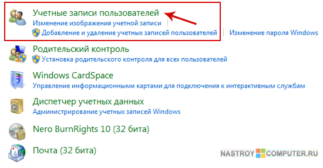

**Тема 26 Учетные записи**

1 Администратор

2 Стандартная учетная запись

3 Учетная запись Гость

4 Настройка учетной записи

5 Служебная программа Local Users and Groups

**Типы учетных записей**

***Учетная запись*** в *Active* *Directory* - это *список* атрибутов, определяющих участника системы безопасности (*security* *principal*), например пользователя или группу пользователей.

В *Active* *Directory* можно создать пять типов учетных записей , перечисленных ниже.

- **Компьютер**. Всякий раз, когда в *домен* добавляется компьютер под управлением Microsoft Windows NT, Windows 2000, Windows XP или Windows Server 2003, для него создается *учетная запись* компьютера. Учетные записи компьютеров служат для аутентификации компьютеров, которые обращаются к сети и ресурсам домена.
- **Пользователь**. *Учетная запись* пользователя - это набор атрибутов для пользователя. Объект-пользователь хранится в Active Directory и позволяет пользователю входить в сеть. Пользователь должен указать удостоверения (имя и пароль) только один раз, затем ему предоставляются соответствующие разрешения на доступ к сетевым ресурсам.
- **Группа**. Это набор пользователей, компьютеров или других групп, для которого можно задать разрешения. Задавая разрешения группам и добавляя члены в эти группы, можно сэкономить время, поскольку не приходится назначать разрешения каждому отдельно взятому члену группы.
- **InetOrgPerson**. *Учетная запись* InetOrgPerson работает во многом аналогично учетной записи пользователя за исключением того, что учетные записи InetOrgPerson совместимы с другими службами каталогов, основанными на *LDAP*. Это обеспечивает совместимость между Active Directory и другими системами.
- **Контакт**. Этот *объект* хранится в Active Directory, но для него не задаются разрешения. То есть контакт нельзя использовать для входа в сеть или доступа к ресурсам. Часто контакты связывают с пользователями, работающими вне сети, которым отправляет сообщения почтовая система.

**Планирование учетных записей компьютеров**

Учетные записи компьютеров позволяют применять к компьютерам, входящим в *домен*, во многом такие же средства защиты, как и для пользователей. Эти записи дают возможность выполнять аутентификацию компьютеров - членов домена прозрачным для пользователей образом, добавлять серверы приложений как рядовые серверы (*member* servers) в доверяемые домены и запрашивать аутентификацию пользователей или служб, которые обращаются к этим серверам ресурсов.

Так как разрешается помещать учетные записи компьютеров в OU и назначать им групповую политику, то можно управлять тем, как выполняется *аутентификация* и обеспечивается защита компьютеров различных типов. Например, для компьютеров, установленных в общедоступном информационном киоске, действуют другие требования безопасности, чем для рабочих станций, установленных в управляемой среде с ограниченным доступом.

Всякий раз, когда в *домен* добавляется новый *компьютер*, создается новая *учетная запись* компьютера. Таким образом, еще одна составляющая стратегии *управления учетными записями* - *определение* пользователей, которые вправе добавлять компьютеры в *домен*, создавая их учетные записи.

Кроме того, необходимо продумать соглашение об именовании компьютеров. Хорошее соглашение должно позволять без труда идентифицировать *компьютер* по владельцу, местонахождению, типу или любой комбинации этих данных.

**Планирование учетных записей пользователей**

Учетные записи пользователей позволяют идентифицировать пользователей, входящих в *сеть*, задавать, к каким ресурсам они вправе обращаться, и указывать о них всевозможную информацию. Администраторы - тоже пользователи, но с более широкими правами доступа к ресурсам, связанным с управлением сетью. Группы служат для того, чтобы формировать наборы пользователей, для которых нужно задать одни и те же требования к безопасности или *права доступа*.

Учетные записи пользователей предоставляют пользователям возможность входить в *домен* или на локальный *компьютер* и обращаться к ресурсам. Объекты учетных записей пользователей содержат информацию о пользователях и связывают с ними определенные привилегии или ограничения. Каждый *объект* *Active* *Directory* связан со списком управления доступом (Access *Control* *List*, *ACL*), который представляет собой *список* разрешений на *доступ* к объекту, заданных для пользователей и групп.

**Типы учетных записей пользователей**

В Windows Server 2003 существует два основных типа учетных записей пользователей :

- **Локальные учетные записи пользователей**. Создаются в базе данных защиты локального компьютера и управляют доступом к ресурсам этого компьютера. Локальные учетные записи пользователей предназначены для управления доступом к изолированным компьютерам или к компьютерам, входящим в рабочую группу.
- **Доменные учетные записи пользователей**. Создаются в Active Directory и дают возможность пользователям входить в *домен* и обращаться к любым ресурсам сети. Такие учетные записи пользователей реплицируются на все контроллеры в домене, поэтому после репликации любой контроллер домена сможет аутентифицировать пользователя.

Помимо этих учетных записей, Windows автоматически создает несколько таких учетных записей пользователей, которые называются встроенными. И на локальных компьютерах, и в доменах создается две ключевые учетные записи :

- **Администратор (Administrator)**. Данная *учетная запись* обладает наибольшими возможностями, поскольку она автоматически включается в группу "Администраторы" (Administrators). Члены этой группы имеют высший уровень прав по управлению компьютером, им предоставляются почти все пользовательские права. *Учетная запись* "Администратор уровня домена" дает максимум возможностей по управлению доменом в целом; по умолчанию она включается в группу "Администраторы домена" (Domain Admins) (а администратор корневого домена леса, кроме того, входит в группы "Администраторы предприятия" (Enterprise Admins) и "Администраторы схемы" (Schema Admins)]. Учетную запись "Администратор" нельзя удалить, но ее можно переименовать (и это следует сделать для большей безопасности). Также следует задать для этой учетной записи непустой пароль и не передавать его другим пользователям.
- **Гость (Guest)**. Данная *учетная запись* предназначена для того, чтобы администратор мог задать единый набор разрешений для любых пользователей, которые иногда входят в сеть, но не имеют обычной учетной записи. *Учетная запись* "Гость" позволяет это сделать, так как автоматически включается в локальную группу "Гости" (Guests). В среде, где есть *домен*, эта *учетная запись* также включается в группу "Гости домена" (Domain Guests). По умолчанию *учетная запись* "Гость" отключена. И действительно, ее следует использовать только в сетях, не требующих особой защиты. Эту учетную запись нельзя удалить, но можно отключить и/или переименовать.

**Правила именования учетных записей**

Тщательное планирование схемы именования учетных записей пользователей позволяет стандартизировать идентификацию пользователей домена. Единое соглашение также облегчает распознавание и запоминание имен пользователей.

Существует много разных соглашений, применимых при создании имен, и у каждого администратора или проектировщика сети есть свои предпочтения. Однако хорошее соглашение об именовании должно быть таким, чтобы имена для входа легко запоминались, а также чтобы можно было различать сотрудников с похожими именами.

Есть несколько правил, которые нужно соблюдать при планировании стратегии именования пользователей :

- Каждый пользователь должен иметь уникальное имя (логин) в домене.
- Длина имени не должна превышать 20 символов (для совместимости с предыдущими версиями Windows).
- Имена не чувствительны к регистру букв.
- Имена не должны содержать следующих символов: ", /, \, [, ], :, ;, =, ,, +, \*, ?, <, >.
- Должна поддерживаться гибкая система именования.
- Необходимо учитывать совместимость именования для других приложений (например, для электронной почты).

**Планирование политики сетевой безопасности**

Контроллеры домена должны проверять идентификацию пользователя или компьютера, прежде чем предоставить *доступ* к системным и сетевым ресурсам. Такая проверка называется аутентификацией и выполняется всякий раз при входе в *сеть*.

При планировании стратегии аутентификации рекомендуется соблюдать ряд правил:

- Политика блокировки учетных записей (рекомендуемое значение для пользователя - 5 попыток).
- Ограничение времени, в которое разрешен вход.
- Политика истечения сроков билетов (*tickets*) (значение по умолчанию - 10 часов).
- Не использовать административные учетные записи для обычной работы.
- Переименовать или отключить встроенные учетные записи.

Следующий наиболее важный аспект сетевой безопасности - пароли, поэтому политику определения паролей пользователей необходимо тщательно продумать. В *Windows* *Server* 2003 по умолчанию действуют более строгие ограничения на пароли, чем в предыдущих версиях. Например, в *Windows* *Server* 2003 имеется новое средство, проверяющее сложность пароля учетной записи "*Администратор*" (*Administrator*). Если *пароль* пустой или недостаточно сложный, *Windows* предупреждает, что использовать нестойкий *пароль* опасно; при этом *пользователь*, оставивший *поле* для пароля пустым, не сможет обращаться к учетной записи через *сеть*.

Надежная политика *управления паролями* гарантирует, что пользователи в полной мере соблюдают принципы задания паролей, установленные компанией. При планировании политики *управления паролями* рекомендуется соблюдать ряд правил :

- Политика сохранения последних паролей (рекомендуемое значение: 24).
- Смена пароля не чаще, чем 1 раз в сутки.
- Длина пароля не должна быть короче 7 символов.
- Использование сложной схемы для паролей (строчные, прописные буквы, цифры и другие символы).

**Планирование групп**

Группы упрощают предоставление разрешений пользователям. Например, назначить разрешения группе и добавить пользователей в эту группу гораздо проще, чем по отдельности назначать разрешения многочисленным пользователям и управлять этими разрешениями. Когда пользователи входят в группу, для изменения того или иного разрешения всех этих пользователей достаточно одной *операции*.

Как и в случае учетных записей пользователей, группы бывают локальные и уровня домена. Локальные группы хранятся в базе данных защиты локального компьютера и предназначены для управления доступом к ресурсам этого компьютера. Группы уровня домена хранятся в *Active* *Directory* и позволяют помещать в них пользователей и управлять доступом к ресурсам домена и его контроллеров.

**Типы групп** 

- Группы безопасности:
  - используются для объединения в одну административную единицу;
  - используются ОС.
- Группы распространения:
  - используются приложениями (не ОС) для задач, не связанных с защитой.

**Области действия групп** 

` `Глобальные группы:

- содержат учетные записи пользователей и компьютеров только того домена, в котором создана эта группа;
- им можно назначать разрешения или добавлять в локальные группы любого домена в данном лесу.
- Локальные группы домена:
  - существуют на контроллерах домена и используются для управления доступом к ресурсам локального домена;
  - могут включать пользователей и глобальные группы в пределах леса.
- Универсальные группы:
  - используются для назначения разрешений доступа к ресурсам нескольких доменов;
  - существуют вне границ доменов;
  - могут включать пользователей, глобальные группы и другие универсальные группы в пределах леса.

*Active* *Directory* позволяет вкладывать группы, то есть помещать одни группы в другие. Вложение групп - эффективный способ упорядочения пользователей. При вложении групп необходимо стремиться к тому, чтобы *уровень вложения* был минимальным; в сущности, лучше ограничиться одним уровнем. Чем глубже вложение, тем сложнее поддерживать структуру разрешений.

Группы пользователей помогают достичь наибольших успехов в стратегии *управления учетными записями* при выполнении следующих правил :

- Избегать выдачи разрешений учетным записям.
- Создавать локальные группы домена.
- Для упорядочивания пользователей использовать глобальные группы.
- Помещать глобальные группы в локальные группы домена.
- Не включать пользователей в универсальные группы.

**Планирование групповой политики**

*Групповая политика* - мощное и эффективное средство, позволяющее задать параметры сразу для нескольких пользователей и компьютеров. Кроме того, *групповая политика* применяется для распространения и обновления программного обеспечения в организации.

*Групповая политика* определяет набор параметров конфигурации пользователей и компьютеров, который можно связать с компьютерами, сайтами, доменами и OU в *Active* *Directory*. Такой набор параметров групповой политики называется *объектом групповой политики* (*Group* *Policy* *Object*, *GPO*).

Любой *компьютер* под управлением *Windows 2000*, *Windows* ХР или *Windows* *Server* 2003 (независимо от того, входит он в *ActiveDirectory* или нет) содержит один локальный *GPO*, в котором заданы политики, применяемые к этому компьютеру. Если *компьютер*входит в *Active* *Directory*, к нему можно применить несколько дополнительных *GPO*, не являющихся локальными.

Существует два основных типа групповой политики :

- **Конфигурация компьютера**. Используется для задания групповых политик, применяемых к определенным компьютерам.
- **Конфигурация пользователя**. Используется для задания групповых политик, применяемых к определенным пользователям.

Вне зависимости от типа параметров групповой политики имеется три следующие категории .

- **Параметры программ (Software Settings)**. Категория содержит параметры для установки программного обеспечения на клиентских компьютерах (поддерживаются ОС Windows 2000 и более новые), к которым применяется *групповая политика*. Используются два компонента:
  - **служба установки Windows**. Установка и обновление ПО в соответствии с инструкциями в установочных пакетах;
  - **установочные пакеты Windows**. Исполняемые файлы сценариев со всеми инструкциями (*msi*).
- **Параметры Windows (Windows Settings)**. Категория предназначена для изменения ряда параметров конфигурации, связанных со средой Windows:
  - **сценарии (Scripts)**. Настраивая конфигурацию компьютера, можно задать сценарии, которые выполняются при его включении или выключении. При настройке конфигурации для пользователя можно задать сценарии, выполняемые при входе или выходе пользователя;
  - **параметры безопасности (Security Settings)**. Это параметры безопасности, задаваемые для компьютеров и пользователей;
  - **настройка Internet Explorer (Internet Explorer Maintenance)**. Этот узел доступен только для пользователей и служит для управления работой Internet Explorer на клиентских компьютерах;
  - **службы удаленной установки (Remote Installation Services, RIS)**. RIS позволяет автоматически выполнять удаленную установку операционной системы на новые клиентские компьютеры. Эти параметры тоже доступны только для конфигураций пользователей. Они управляют удаленной установкой операционных систем;
  - **перенаправление папок (Folder Redirection)**. Эти параметры доступны только для конфигураций пользователей. Они позволяют переопределить специальные папки Windows, изменив их местонахождение по умолчанию на сетевой каталог. Благодаря этому можно централизованно управлять папками пользователей.
- **Административные шаблоны (Administrative Templates)**. Категория содержит все параметры групповой политики, хранящиеся в реестре, которые можно использовать для конфигураций компьютеров и пользователей.

**Разрешение GPO из нескольких источников**

Поскольку *GPO*, применяемые к пользователю или компьютеру, могут поступать из нескольких источников, нужен способ определения того, как эти *GPO* сочетаются друг с другом. *GPO* обрабатываются в следующем порядке :

- **локальный GPO**. Обрабатывается локальный *GPO* компьютера, и применяются все параметры защиты, заданные в этом *GPO*;
- **GPO сайта**. Обрабатываются *GPO*, связанные с сайтом, к которому относится компьютер. Параметры, заданные на этом уровне, переопределяют любые параметры предыдущего уровня, с которыми они конфликтуют. Если с сайтом связано несколько *GPO*, администратор сайта может задать, в каком порядке обрабатываются эти *GPO*;
- **GPO домена**. Обрабатываются *GPO*, связанные с доменом, к которому относится компьютер, и применяются содержащиеся в них параметры. Параметры, заданные на уровне домена, переопределяют параметры, примененные на локальном уровне или на уровне сайта, с которыми они конфликтуют. Если с доменом связано несколько *GPO*, администратор, как и в предыдущем случае, может задать порядок их обработки;
- **GPO OU**. Обрабатываются *GPO*, которые связаны с любыми OU, содержащими пользователя или компьютер. Параметры, заданные на уровне OU, переопределяют параметры, примененные на локальном уровне или уровне домена и/или сайта, с которыми они конфликтуют. Один и тот же *объект* может входить в несколько OU. В этом случае сначала обрабатываются *GPO*, связанные с OU, находящейся на самом высоком уровне иерархии Active Directory, затем - с OU, находящейся на следующем уровне, и т. д. Если с одной OU связано несколько *GPO*, администратор, как и в предыдущих случаях, может задать порядок их обработки.

**Наследование групповой политики**

По умолчанию дочерние контейнеры наследуют групповую политику от родительских контейнеров. Однако можно переопределить унаследованные параметры, задав для дочернего объекта другие значения параметров. Кроме того, в *GPO* можно задать, что тот или иной параметр активен, неактивен или не определен. Параметры, которые не определены для родительского контейнера, вообще не наследуются дочерними контейнерами, а параметры, которые активны или неактивны, наследуются.

Если *GPO* определены и для родителя, и для потомка и если заданные в них параметры совместимы, эти параметры комбинируются. Например, если в родительской OU задана определенная длина пароля, а в дочерней OU - некая политика блокировки учетных записей, будут использоваться оба этих параметра. Если параметры несовместимы, то по умолчанию с дочерним контейнером связывается значение, переопределяющее значение параметра, который связан с родительским контейнером.

Если необходимо не применять политику к пользователю или группе, можно запретить чтение или применение этой политики для данного пользователя или группы.

В большинстве политик задействована лишь часть доступных параметров, поэтому неиспользуемые параметры конфигурации компьютера или пользователя, содержащиеся в *GPO*, рекомендуется отключать. Если неиспользуемые параметры включены, они все равно обрабатываются, что приводит к лишнему расходу системных ресурсов. Отключив неиспользуемые параметры, мы снизим нагрузку на клиентские компьютеры, обрабатывающие политику.

Имеется еще два дополнительных механизма, применяемых при управлении наследованием групповых политик :

- **Не перекрывать (No Override)**. При связывании *GPO* с контейнером можно выбрать, чтобы параметры, заданные в этом *GPO*, не переопределялись параметрами в *GPO*, связанных с дочерними контейнерами. Это гарантирует, что для дочерних контейнеров будет применяться заданная политика.
- **Блокировать наследование политики (Block Policy Inheritance)**. При выборе этого параметра контейнер не наследует параметры *GPO*, заданные для родительского контейнера. Однако если для родительского контейнера указан параметр "Не перекрывать", дочерний контейнер не может заблокировать наследование от своего родителя.

**Планирование структуры GPO**

При реализации групповой политики сначала создаются *GPO*, затем эти объекты связываются с сайтами, доменами и OU. Может потребоваться применение некоторых *GPO* на уровне доменов или сайтов, но в большинстве случаев следует применять *GPO* на уровне OU .

**Связывание GPO с доменом**

*GPO*, связанный с доменом, применяется ко всем пользователям и компьютерам домена. Поскольку это мощная политика, следует свести к минимуму количество *GPO* этого уровня.

Типичное применение *GPO* уровня домена - реализация корпоративных стандартов. Например, в компании может действовать стандартное требование, состоящее в том, что ко всем компьютерам и пользователям должна применяться одна и та же политика *управления паролями* и аутентификацией. В этом случае применение *GPO* уровня домена было бы отличным решением.

**Связывание GPO с сайтом**

*GPO* связывают с сайтами очень редко, поскольку гораздо эффективнее связывать *GPO* с OU, структура которых основана на территориальном делении.

Но при определенных обстоятельствах связывание *GPO* с сайтом - приемлемое решение. Если параметры должны быть общими для всех компьютеров, физически находящихся в определенном месте, и для этого места создан *сайт*, есть смысл связать *GPO* с сайтом. Например, для компьютеров, расположенных в некоем филиале, нужно задать определенную сетевую конфигурацию с поддержкой подключения к Интернету. В этом случае идеально подходит *GPO*, связанный с сайтом.

**Связывание GPO с OU**

В большинстве случаев лучше связывать *GPO* с хорошо продуманной структурой OU, чем с сайтами или доменами. OU обеспечивают наибольшую гибкость, поскольку позволяют спроектировать структуру, хотя бы отчасти упрощающую применение групповой политики. Кроме того, OU более гибкие в администрировании: можно без проблем перемещать пользователей и компьютеры между OU, изменять структуру OU и даже переименовывать сами OU.

**Краткие итоги**

В *Active* *Directory* можно создать пять типов учетных записей:

- Компьютер;
- Пользователь;
- Группа;
- InetOrgPerson;
- Контакт.

В *Windows* *Server* 2003 существует два основных типа учетных записей пользователей:

- локальные;
- доменные.

И на локальных компьютерах, и в доменах создается две ключевые учетные записи:

- Администратор (Administrator);
- Гость (*Guest*).

Есть несколько правил, которые нужно соблюдать при планировании стратегии именования пользователей. При планировании стратегии аутентификации (в том числе, *управления паролями*) рекомендуется соблюдать ряд правил.

При планировании групп могут использоваться следующие их типы групп и области действия:

- группы безопасности;
- группы распространения;
- глобальные группы;
- локальные группы домена;
- универсальные группы:

Группы пользователей помогают достичь наибольших успехов в стратегии *управления учетными записями* при выполнении следующих правил:

- избегать выдачи разрешений учетным записям;
- создавать локальные группы домена;
- для упорядочивания пользователей использовать глобальные группы;
- помещать глобальные группы в локальные группы домена;
- не включать пользователей в универсальные группы.

При планировании групповой политики существует два основных ее типа:

- конфигурация компьютера;
- конфигурация пользователя.

Вне зависимости от типа групповой политики имеется три следующие категории:

- параметры программ (Software Settings);
- параметры Windows (Windows Settings);
- административные шаблоны (Administrative Templates).

Поскольку *GPO*, применяемые к пользователю или компьютеру, могут поступать из нескольких источников, нужен способ определения того, в каком порядке эти *GPO* обрабатываются.

- Локальный *GPO*.
- *GPO* сайта.
- *GPO* домена.
- *GPO* OU.

**Создание учетной записи.**

` `**Создание учетной записи в Windows 7**

Ну а теперь давайте научимся создавать учетные записи пользователей на компьютере. За это отвечает инструмент **Панели управления** – **Учетные записи пользователей**. Запустим его (рис. 72).

||
| - |
|**Рис. 72. Учетные записи пользователей**|
В данном окне мы можем изменить настройки текущей учетной записи, но мы этого делать не будем, а сразу создадим новую. Выбираем пункт **Управление другой учетной записью**.

В открывшемся окне (рис.73) мы можем выбрать любую из учетных записей, представленных в нем для редактирования, т.е. изменения ее параметров. Вы видите, что в окне отображаются три учетные записи: **Пользователь**, **Андрей** и **Гость**. Учетная запись **Гость** создается операционной системой по умолчанию и также по умолчанию она отключена. Если вы ее включите, то любой человек сможет зайти на ваш компьютер под этой учетной записью, но он будет существенно ограничен в правах, т.е. в тех действиях, которые он сможет производить на компьютере. Давайте создадим еще одну учетную запись и заодно разберемся с правами.

Выберем пункт **Создание учетной записи**. Мы перейдем на следующий шаг, на котором нам необходимо указать *имя учетной записи* и ее *тип* (рис.74). С именем все понятно. Здесь можно указать свое имя или имя человека, для которого вы создаете учетную запись. Теперь давайте разберемся с типом учетной записи.

||
| - |
|**Рис. 73. Окно выбора учетной записи**|
Для начала вспомним, что же такое *учетная запись*. Мы уже знаем, что на компьютере мы можем создать несколько учетных записей, индивидуально для каждого пользователя этого компьютера. При этом каждый пользователь получает свое личное пространство на компьютере и возможность настраивать внешний вид операционной системы по своему вкусу. Но кроме этого *учетная запись пользователя* определяет, к каким файлам и папкам пользователь имеет доступ, а также какие изменения в работу компьютера пользователь может вносить. Это и есть те самые права, о которых мы только что говорили.

В *Windows* существуют три типа учетных записей, которые дают пользователям разные возможности по управлению компьютером:

1. **Обычный доступ** – пользователь может запускать и работать в большинстве программ, а также изменять настройки операционной системы, которые не влияют на настройки других пользователей или безопасность компьютера. Это значит, что пользователям этой группы будут недоступны некоторые инструменты **Панели управления**, а также они не смогут работать в программах, которые могут влиять на работоспособность операционной системы *Windows*. Это идеальный тип учетной записи для начинающих, так как под этой учетной записью сложно что-либо испортить в *Windows* или в программах. Но тут есть и существенные ограничения. Например, не все программы вы сможете установить, находясь в учетной записи этого типа.
1. **Администратор** – пользователь, имеющий данный тип учетной записи, получает полный контроль над компьютером и может производить любые настройки, причем даже те, которые касаются других пользователей компьютера.
1. **Гость** – встроенная учетная запись, которую применяют для временного доступа к компьютеру. Это самая ограниченная в правах учетная запись.

||
| - |
|**Рис. 74. Создание учетной записи**|
Укажем имя и выберем тип учетной записи (рис.74). Далее нажимаем кнопку **Создание учетной записи**. Теперь выбираем из списка вновь нами созданную запись **Ольга**. Будем ее настраивать (рис.75).

||
| - |
|**Рис. 75. Окно выбора учетной записи**|
Основное мы уже настроили – это *имя* и *тип* учетной записи. Теперь можем что-то изменить, а что-то и добавить. Так первый пункт **Изменение имени учетной записи** говорит сам за себя (рис.76). Во втором пункте мы можем *задать пароль*. В этом случае на экране приветствия (рис.29), при попытки входа под учетной записью, будет запрашиваться пароль.

||
| - |
|**Рис. 76. Настройка учетной записи**|
Изображение, которое будет отображаться на экране приветствия и в меню **Пуск** (рис.29 и 30), можно установить с помощью пункта **Изменение рисунка**. Причем можно выбрать изображение из списка стандартных рисунков или загрузить свое, нажав на **Поиск других рисунков** (рис.77).

||
| - |
|**Рис. 77. Изображение учетной записи**|
Если за вашим компьютером работает ребенок, то вы можете создать для него отдельную учетную запись, а затем настроить параметры *родительского контроля*.

Выберем пункт **Установить родительский контроль** (рис.76). По умолчанию данная возможность отключена. Выберем **Включить, используя текущие параметры**, а затем установим разрешения для данной учетной записи (рис.78).

||
| - |
|**Рис. 78. Настройка родительского контроля**|
Мы можем указать временные интервалы, в которые доступ к компьютеру будет разрешен. Это делается в разделе **Ограничение по времени**. Все что нужно – это указать часы, в которые доступ к компьютеру будет заблокирован. Далее можно настроить доступ к играм, а также выбрать те программы, с которыми данный пользователь сможет работать.

Вернемся к общим настройкам учетной записи (рис.76). При необходимости вы всегда сможете изменить тип учетной записи (*Администратор* или *Обычная*). Делается это в пункте **Изменение типа учетной записи**, но для этого действия учетная запись, в которой вы находитесь в данный момент, должна иметь тип *Администратор*. Тоже самое касается и удаления учетной записи.

**Настройка учетной записи windows 7**

**Шаг 1**. Нажмите **Пуск** выберите **Панель управления** и нажмите на ссылку **Учетные записи пользователей и семейная безопасность**.

**Шаг 2**. В новом окне кликните по ссылке **Учетные записи пользователей**.

**Шаг 3**. В окне **Учетные записи пользователей** кликните по ссылке **Управление другой учетной записью** (Для выполнения этого действия необходимо иметь разрешения администратора)

**Шаг 4**. В открывшемся окне из *списка учетных записей*, имеющихся на компьютере, **выберите** ту учетную запись, которую нужно настроить. (В моем случае это учетная запись Иван)

**Шаг 5**. Откроется окно **Изменение учетной записи**, в котором можно настраивать учетную запись пользователя.

Сейчас более подробно о каждой виде изменений мы и поговорим.

|**Изменение имени учетной записи**|
| - |

Для того чтобы *изменить имя пользователя*  в окне **Изменение учетной записи** кликните один раз по ссылке **Изменение имени учетной записи**.
В поле *Новое имя учетной записи* напишете новое имя пользователя. После этого нажмите **Применить**.

|**Создание пароля учетной записи**|
| - |

Для того чтобы в вашу учетную запись никто не мог войти, можно *создать пароль для вашей учетной записи*. Для этого в окне **Изменение учетной записи** кликните по ссылке **Создание пароля**.

В новом окне вам потребуется ввести *Новый пароль, Подтверждение пароля* и *Подсказку для пароля*.

**Советы по созданию пароля.**

||
| - |

|` `|
| - |

|
 **-** Пароль должен быть секретным.

- Пароль должен быть длинным (Не менее 9 символов). - Пароль должен быть трудным для запоминания.(недопустимо совпадения с логином. *Логин* - это имя пользователя).  - Пароль должен быть сложным (случайная комбинация символов. *Например AHR5FD45D13FDF1*). - Пароль не должен содержать в себе *дату и год вашего рождения, номер мобильного телефона, название любимого фильма, песни,певца* и т.д. - Пароль должен меняться. - Пароль должен значительно отличаться от тех, что использовались ранее. - Подсказки к паролям не должны использоваться. - Пароль не должен передаваться по недостаточно защищенным каналам связи. - Пароль должен заменяться при подозрении в том, что он мог быть раскрыт.
|
| - |

Ознакомившись с перечисленными выше правилами, придумайте пароль для учетной записи и нажмите **Создать пароль**.

Теперь при входе в систему вам нужно будет пройти процесс аутентификации, т.е ввести логин (имя учетной записи) и пароль.

|**Изменение рисунка учетной записи**|
| - |

Если вам не нравиться созданная по умолчанию картинка к учетной записи вы с легкость можете ее изменить. Для этого в окне **Изменение учетной записи** кликните по ссылке **Изменение рисунка**.

В новом окне вы можете выбрать любую картинку из понравившихся вам миниатюр, а также можете задать свою, нажав на ссылку **Поиск других рисунков**... и указав путь к вашему изображению.

После того как вы выберите картинку нажмите на кнопку **Изменение рисунка**. Изображения рисунка учетной записи должно измениться мгновенно.

|**Изменение типа учетной записи**|
| - |

Для того чтобы изменить тип учетной записи вам необходимо в окне **Изменение учетной записи** перейти по ссылке **Изменение типа учетной записи**.

В открывшемся окне вам будет предложено выбрать один из *двух типов* доступа:

\- *Обычный доступ* (позволяет использовать большинство программ и приложений не влияющих на настройку других пользователей и безопасность компьютера)
\- *Администратор* (Имеет полный доступ ко всем компонентам администрирования системы)

Выбрав нужный для вас тип нажмите на кнопку **Изменение типа учетной записи**.

|**Удаление учетной записи**|
| - |

Если за компьютером больше не работает один из пользователей вы запросто можете *удалить его учетную запись*.
Для этого вам потребуется в окне **Изменение учетной записи** щелкнуть по ссылке **Удаление учетной записи**.

В открывшемся окне вас спросят *Сохранить файлы для пользователя*? Если вы хотите удалить все файлы принадлежащие к профилю пользователя, то нажмите **Удалить файлы** (учетная запись удалиться полностью). Если вы нажмете **Сохранение файлов**, то некоторые папки пользователя (Документы, Избранное, Музыка, Изображения и Видео) сохраняться.  

На этом все, настройка учетной записи завершена.

**Учетная запись в Windows 10: как создать учетную запись на Windows**

В этой инструкции рассмотрим создание учетной записи на примере операционной системы Windows 10. Создать учетную запись на Windows 10 можно из параметров системы.

Обязательное условие: для создания профиля необходимо наличие подключения к интернету, потому что в момент создания учетной записи происходит соединение с серверами Microsoft для сохранения и применения настроек.

Для создания учетной записи Microsoft выполните следующие шаги:

1. Войдите в меню «Пуск», запустите приложение «Параметры».
1. Откройте «Учетные записи», в разделе «Ваши данные» нажмите на ссылку «Войти вместо этого с учетной записью Майкрософт».

3. В окне «Учетная запись Майкрософт», если у вас уже имеется профиль в Microsoft, потребуется ввести адрес электронной почты, номер телефона или учетную запись Skype. Если учетной записи нет, нажмите на ссылку «Создайте ее!». Процесс создания профиля займет немного времени.

4. В следующем окне введите адрес своей электронной почты (подойдет любой почтовый ящик на Gmail, Яндекс Почта, Mail.Ru, Yahoo и т. д.), придумайте пароль для учетной записи, а затем выберите страну.

В качестве логина от учетной записи можно использовать новый почтовый ящик, вместо существующей электронной почты. Для этого, нажмите на ссылку «Получить новый адрес электронной почты». Вам предложат создать электронную почту [Outlook.com](https://vellisa.ru/outlook-com-oblachnaya-pochtovaya-sluzhba-microsoft).

5. Далее спрашивает ваше согласие на отображение материалов, наиболее соответствующих вашим интересам. Если это предложение вас не заинтересовало, снимите оба флажка в этом окне.

6. В открывшемся окне предлагают ввести текущий пароль для входа в операционную систему, чтобы убедиться в подлинности пользователя. При следующем входе в систему будет использоваться пароль от учетной записи Майкрософт. Оставьте поле пустым, если у вас в данный момент времени на компьютере не используется пароль для входа в Windows.

7. В окне «Создание ПИН-кода» предлагается создать ПИН-код для входа в систему, которым можно воспользоваться вместо ввода пароля от учетной записи Майкрософт. ПИН-код сохраняется на данном устройстве и не передается в Интернет.

8. В окне «Настройка ПИН-кода» введите символы нового ПИН-кода, а затем подтвердите ПИН-код. ПИН-код должен содержать не менее 4 символов.

9. После применения настроек, произойдет переход в раздел учетных записей в приложение «Параметры». Здесь вы увидите, что на компьютере произошел вход учетную запись Майкрософт.

Создание учетной записи Microsoft без использования операционной системы Windows происходит подобным образом. После создания своего профиля на сайте, пользователь может войти в учетную запись на компьютере, введя данные от своего аккаунта Майкрософт.

Для изменения параметров, или для применения нужных настроек, зайти в учетную запись на официальном сайте можно при помощи браузера с любого устройства.

***Оснастка Local Users and Groups***

Оснастка **Local Users and Groups** (Локальные пользователи и группы) – это инструмент ММС, с помощью которого выполняется управление локальными учетными записями пользователей и групп – как на локальном, так и на удаленном компьютере. Запускать оснастку может любой пользователь. Выполнять администрирование учетных записей могут только администраторы и члены группы **Power Users** (Опытные пользователи).

*Пример окна оснастки **Local Users and Groups** приведен на рис. 10.5.*

