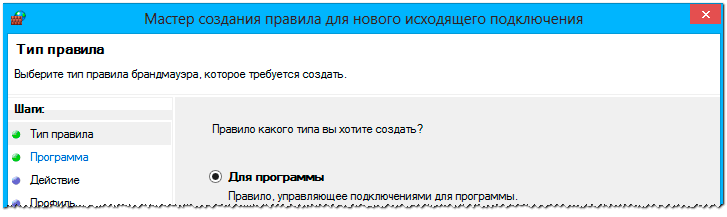
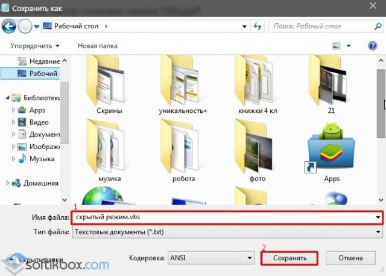
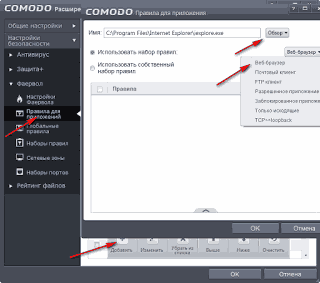

**Тема 24 Фаервол: задачи, сравнительный анализ, настройка**

1 Firewall

2 Основные типы межсетевых экранов

3 Ассистент для создания правил

4 Информация об активных портах и соединениях

5 Поддержка невидимого режима

**Межсетевой экран**, **сетевой экран** — программный или программно-аппаратный элемент компьютерной сети, осуществляющий контроль и фильтрацию проходящего через него сетевого трафика в соответствии с заданными правилами.

Другие названия:

- **Брандмауэр** (нем. *Brandmauer* — противопожарная стена) — заимствованный из немецкого языка термин;
- **Файрвол** (англ. *Firewall* — противопожарная стена) — заимствованный из английского языка термин.

Firewall (Межсетевой экран)

Файрвол (брандмауэр) – является межсетевым экраном в системе Windows, предотвращающим несанкционированный доступ к компьютеру из сети Интернет и локальных сетей, а также запрещающий или разрешающий приложениям соединение с сетью.

Межсетевой экран (Брандмауэр или Firewall) – это средство фильтрации пакетного трафика, поступающего из внешней сети по отношению к данной локальной сети или компьютеру. Рассмотрим причины появления и задачи выполняемые Firewall. Современная сеть передачи данных – это множество удаленных высокопроизводительных устройств, взаимодействующих друг с другом на значительном расстоянии. Одними из наиболее крупномасштабных сетей передачи данных являются компьютерные сети, такие как сеть Интернет. В ней одновременно работают миллионы источников и потребителей информации по всему миру. Широкое развитие данной сети позволяет использовать ее не только частным лицам, но и крупным компаниям для объединения своих разрозненных устройств по всему миру в единую сеть. Вместе с этим, общий доступ к единым физическим ресурсам открывает доступ мошенникам, вирусам и конкурентам возможность причинить вред конечным пользователям: похитить, исказить, подбросить или уничтожить хранимую информацию, нарушить целостность программного обеспечения и даже вывести аппаратную часть конечной станции. Для предотвращения данных нежелательных воздействий необходимо предотвратить несанкционированный доступ, для чего часто применяется Firewall. Само название Firewall (wall – от англ. стена) кроет в себе его назначение, т.е. он служит стеной между защищаемой локальной сетью и Интернетом либо любой другой внешней сетью и предотвращать любые угрозы. Кроме вышеуказанной межсетевой экран также может выполнять и другие функции, связанные с фильтрацией трафика от/к какому-либо ресурсу сети Интернет.

**Фаерволы:**

1 Comodo firewall free

На сегодняшний день это один из наиболее мощных брандмауэров, позволяющий блокировать загрузку рекламы и активное содержимое web-страниц. Также он контролирует вызывающую подозрения электронную почту. Эти способности файрвола реализуются с помощью специальных алгоритмов, которые фильтруют сетевой трафик и держат под контролем открытые соединения. Кроме того, эти алгоритмы способны обнаруживать и запрещать любые действия, вызвавшие подозрения, которые производятся как в вашем компьютере, так и вне его, на подходах.

2 Zone alarm firewall

Еще один хороший файрвол, обладающий необычными для брандмауэров способностями защиты вашего персонального компьютера от различных сетевых опасностей — вездесущих хакеров, программ-шпионов и многих других. Как он это делает? Zone Alarm Firewall запрещает доступ к защищенному компьютеру даже самым хитроумным хакерам, делая его как бы невидимым для кого-либо в Интернете. 

Также он способен блокировать возможную отправку какой угодно информации без разрешения, а также защищает все программы и основную операционную систему «подзащитного» ПК от любого рода вредоносных программ.

3 Windows firewall control

Это довольно удобный файрвол, способный контролировать все порты и интернет-трафик. Кроме того он может блокировать web-страницы, потенциально представляющие опасность, и рекламные всплывающие окна (так называемые pop-ups). Установка программы не представит сложности даже для начинающего пользователя
**Другие файрволы**

` `Это далеко не полный перечень существующих файрволов, их выбор достаточно большой: 

Kerio Personal Firewall – наиболее «продвинутый»;

` `Lavasoft Personal Firewall – более простой, но не менее эффективный; 

Tiny Firewall Pro – лучшая защита для небольших сетей; 

Webroot Desktop Firewall и др.

`   `Принцип действия Firewall основан на контроле поступающего извне трафика. Могут быть выбраны следующие методы контроля трафика между локальной и внешней сетью:

\1. **Фильтрация пакетов** – основан на настройке набора фильтров. В зависимости от того удовлетворяет ли поступающий пакет указанным в фильтрах условиям он пропускается в сеть либо отбрасывается.

\2. **Proxy-сервер** – между локальной и внешней сетями устанавливается дополнительное устройство proxy-сервер, который служит «воротами», через который должен проходить весь входящий и исходящий трафик.

\3. **Stateful inspection** – инспектирование входящего трафика – один из самых передовых способов реализации Firewall. Под инспекцией подразумевается анализ не всего пакета, а лишь его специальной ключевой части и сравнении с заранее известными значениями из базы данных разрешенных ресурсов. Данный метод обеспечивает наибольшую производительность работы Firewall и наименьшие задержки.

Принцип действия Firewall

Межсетевой экран может быть выполнен аппаратно или программно. Конкретная реализация зависит от масштаба сети, объема трафика и необходимых задач. Наиболее распространенным типом Брандмауэров является программный. В этом случае он реализован в виде программы, запущенной на конечном ПК, либо пограничном сетевом устройстве, например маршрутизаторе. В случае аппаратного исполнения Firewall представляет собой отдельный сетевой элемент, обладающий обычно большими производительными способностями, но выполняющий аналогичные задачи.

Firewall позволяет настраивать фильтры, отвечающие за пропуск трафика по следующим критериям:

\1. **IP-адрес**. Как известно, любое конечное устройство, работающее по протоколу IP должно иметь уникальный адрес. Задав какой-то адрес либо определенный диапазон можно запретить получать из них пакеты, либо наоборот разрешить доступ только с данных IP адресов.

\2. **Доменное имя**. Как известно, сайту в сети Интернет, точнее его IP-адресу может быть поставлено в соответств ие буквенно-цифровое имя, которое гораздо проще запомнить чем набор цифр. Таким образом, фильтр может быть настроен на пропуск трафика только к/от одного из ресурсов, либо запретить доступ к нему.

\3. **Порт**. Речь идет о программных портах, т.е. точках доступа приложений к услугам сети. Так, например, ftp использует порт 21, а приложения для просмотра web-страниц порт 80. Это позволяет запретить доступ с нежелательных сервисов и приложений сети, либо наоборот разрешить доступ только к ним.

\4. **Протокол**. Firewall может быть настроен на пропуск данных только какого-либо одного протокола, либо запретить доступ с его использованием. Обычно тип протокола может говорить о выполняемых задачах, используемого им приложения и о наборе параметров защиты. Таким образом, доступ может быть настроен только для работы какого-либо одного специфического приложения и предотвратить потенциально опасный доступ с использованием всех остальных протоколов.

Выше перечислены только основные параметры, по которым может быть произведена настройка. Также могут применяться другие параметры для фильтров, специфичные для данной конкретной сети, в зависимости от выполняемых в ней задач.

Таким образом, Firewall предоставляет комплексны набор задач по предотвращению несанкционированного доступа, повреждения или хищения данных, либо иного негативного воздействия, которое может повлиять на работоспособность сети. Обычно межсетевой экран используется в совокупности с другими средствами защиты, например, антивирусное ПО.

**Назначение**

Среди задач, которые решают межсетевые экраны, основной является защита сегментов сети или отдельных хостов от несанкционированного доступа с использованием уязвимых мест в протоколах сетевой модели OSI или в программном обеспечении, установленном на компьютерах сети. Межсетевые экраны пропускают или запрещают трафик, сравнивая его характеристики с заданными шаблонами[3].

Наиболее распространённое место для установки межсетевых экранов — граница периметра локальной сети для защиты внутренних хостов от атак извне. Однако атаки могут начинаться и с внутренних узлов — в этом случае, если атакуемый хост расположен в той же сети, трафик не пересечёт границу сетевого периметра, и межсетевой экран не будет задействован. Поэтому в настоящее время межсетевые экраны размещают не только на границе, но и между различными сегментами сети, что обеспечивает дополнительный уровень безопасности.

**История**

Первые устройства, выполняющие функцию фильтрации сетевого трафика, появились в конце 1980-х, когда Интернет был новшеством и не использовался в глобальных масштабах. Этими устройствами были маршрутизаторы, инспектирующие трафик на основании данных, содержащихся в заголовках протоколов сетевого уровня. Впоследствии, с развитием сетевых технологий, данные устройства получили возможность выполнять фильтрацию трафика, используя данные протоколов более высокого, транспортного уровня. Маршрутизаторы можно считать первой программно-аппаратной реализацией межсетевого экрана.

Программные межсетевые экраны появились существенно позже и были гораздо моложе, чем антивирусные программы. Например, проект Netfilter/iptables (один из первых программных межсетевых экранов, встраиваемых в ядро Linux с версии 2.4) был основан в 1998 году. Такое позднее появление вполне объяснимо, так как долгое время антивирус решал проблему защиты персональных компьютеров от вредоносных программ. Однако в конце 1990-х вирусы стали активно использовать отсутствие межсетевых экранов на компьютерах, что привело к повышению интереса пользователей к данному классу устройств.

**Фильтрация трафика**

Фильтрация трафика осуществляется на основе набора предварительно сконфигурированных правил, которые называются *ruleset*. Удобно представлять межсетевой экран как последовательность фильтров, обрабатывающих информационный поток. Каждый из фильтров предназначен для интерпретации отдельного правила. Последовательность правил в наборе существенно влияет на производительность межсетевого экрана. Например, многие межсетевые экраны последовательно сравнивают трафик с правилами до тех пор, пока не будет найдено соответствие. Для таких межсетевых экранов, правила, которые соответствуют наибольшему количеству трафика, следует располагать как можно выше в списке, увеличивая тем самым производительность.

Существует два принципа обработки поступающего трафика. Первый принцип гласит: «Что явно не запрещено, то разрешено». В данном случае, если межсетевой экран получил пакет, не попадающий ни под одно правило, то он передаётся далее. Противоположный принцип — «Что явно не разрешено, то запрещено» — гарантирует гораздо большую защищённость, так как он запрещает весь трафик, который явно не разрешён правилами. Однако, этот принцип оборачивается дополнительной нагрузкой на администратора.

В конечном счёте, межсетевые экраны выполняют над поступающим трафиком одну из двух операций: пропустить пакет далее (*allow*) или отбросить пакет (*deny*). Некоторые межсетевые экраны имеют ещё одну операцию — *reject*, при которой пакет отбрасывается, но отправителю сообщается о недоступности сервиса, доступ к которому он пытался получить. В противовес этому, при операции *deny* отправитель не информируется о недоступности сервиса, что является более безопасным

**Классификация межсетевых экранов**

Схематическое изображение классификации межсетевых экранов на основе сетевой модели OSI

До сих пор не существует единой и общепризнанной классификации межсетевых экранов. Однако в большинстве случаев поддерживаемый уровень сетевой модели OSI является основной характеристикой при их классификации. Учитывая данную модель, различают следующие типы межсетевых экранов:

1. Управляемые коммутаторы.
1. Пакетные фильтры.
1. Шлюзы сеансового уровня.
1. Посредники прикладного уровня.
1. Инспекторы состояния

**Реализация**

Существует два варианта исполнения межсетевых экранов — программный и программно-аппаратный. В свою очередь программно-аппаратный вариант имеет две разновидности — в виде отдельного модуля в коммутаторе или маршрутизаторе и в виде специализированного устройства.

В настоящее время чаще используется программное решение, которое на первый взгляд выглядит более привлекательным. Это вызвано тем, что для его применения достаточно, казалось бы, всего лишь приобрести программное обеспечение межсетевого экрана и установить на любой имеющийся в организации компьютер. Однако, как показывает практика, в организации далеко не всегда находится свободный компьютер, да ещё и удовлетворяющий достаточно высоким требованиям по системным ресурсам. После того, как компьютер всё-таки найден (чаще всего — куплен), следует процесс установки и настройки операционной системы, а также, непосредственно, программного обеспечения межсетевого экрана. Нетрудно заметить, что использование обычного персонального компьютера далеко не так просто, как может показаться. Именно поэтому всё большее распространение стали получать специализированные программно-аппаратные комплексы, называемые *security appliance*, на основе, как правило, FreeBSD или Linux, «урезанные» для выполнения только необходимых функций. Достоинствами данных решений являются:

- Простота внедрения: данные устройства имеют предустановленную и настроенную операционную систему и требуют минимум настроек после внедрения в сеть.
- Простота управления: данными устройствами можно управлять откуда угодно по стандартным протоколам, таким как SNMP или Telnet, либо посредством защищённых протоколов, таких как SSH или SSL.
- Производительность: данные устройства работают более эффективно, так как из их операционной системы исключены все неиспользуемые сервисы.
- Отказоустойчивость и высокая доступность: данные устройства созданы выполнять конкретные задачи с высокой доступностью..

**Ограниченность анализа межсетевого экрана**

Межсетевой экран позволяет осуществлять фильтрацию только того трафика, который он способен «понимать». В противном случае, он теряет свою эффективность, так как не способен осознанно принять решение о том, что делать с нераспознанным трафиком. Существуют протоколы, такие как TLS, SSH, IPsec и SRTP, использующие криптографию для того, чтобы скрыть содержимое, из-за чего их трафик не может быть проинтерпретирован. Также некоторые протоколы, такие как OpenPGP и S/MIME, шифруют данные прикладного уровня, из-за чего фильтровать трафик на основании информации, содержащейся на данном сетевом уровне, становится невозможно. Ещё одним примером ограниченности анализа межсетевых экранов является туннелированный трафик, так как его фильтрация является невозможной, если межсетевой экран «не понимает» используемый механизм туннелированния. Во всех этих случаях правила, сконфигурированные на межсетевом экране, должны явно определять, что делать с трафиком, который они не могут интерпретировать.

**Причины использования брандмауэра**

Брандмауэр должен блокировать разные виды нежелательных проникновений внутрь вашего компьютера через компьютерную сеть. Сейчас брандмауэр - необходимый элемент сетевой безопасности, в т. ч. безопасности пользователя, подключившегося к сети интернет Для того, чтобы фильтровать и контролировать сетевой трафик.

Большая часть функций брандмауэра дублирует функции межсетевого экрана, однако персональный брандмауэр так же может обеспечивать дополнительные возможности:

\- Контроль за приложениями, использующими порты. В отличие от обычных межсетевых экранов, персональный брандмауэр может определять не только используемый протокол и адреса, но и точное название приложения, запрашивающего соединение (или пытающегося слушать на каком-то порту). В частности, возможен контроль за неизменностью приложения (в случае изменения приложения вирусами или троянами, устанавливающимися в качестве плагинов, сетевая активность приложения блокируется).

\- Назначение раздельных правил разным пользователям без дополнительной сетевой авторизации.

\- Режим обучения, когда при первом обращении программы к сетевым ресурсам пользователю выдаётся запрос (обычно вида «запретить всегда, запретить однократно, всегда разрешить, разрешить однократно, создать правило»).

\- Режим смешанной фильтрации, при которой проверяются различные параметры на различных уровнях сетевых протоколов — от второго (проверка на фальсификацию MAC-адреса) до 4 (фильтрация портов), и даже вышестоящих уровней (фильтрация содержимого веб - сайтов, проверка почты, отсеивание спама).

**Соответствие категорий брандмауэров уровням модели osi**

Возможности брандмауэров и степень их интеллектуальности зависят от того, на каком уровне эталонной модели OSI они функционируют. Чем выше уровень OSI, на основе которой построен брандмауэр, тем выше обеспечиваемый им уровень защиты.

Модель OSI (Open System Interconnection) включает семь уровней сетевой архитектуры. Первый, самый нижний уровень — физический. За ним следуют канальный, сетевой, транспортный, сеансовый уровни, уровень представления и прикладной уровень, или уровень приложений.

Для того чтобы обеспечивать фильтрацию трафика, брандмауэр должен работать как минимум на третьем уровне модели OSI, то есть на сетевом уровне. На этом уровне происходит маршрутизация пакетов на основе преобразования MAC-адресов в сетевые адреса. С точки зрения протокола TCP/IP этот уровень соответствует уровню IP (Internet Protocol). Получая информацию сетевого уровня, брандмауэры способны определить адрес источника и получателя пакета и проверить, допустима ли передача трафика между данными адресатами. Однако информации сетевого уровня недостаточно для анализа содержимого пакета. Брандмауэры, функционирующие на транспортном уровне модели OSI, получают больше информации о пакетах и являются более интеллектуальными схемами защиты сетей. Если брандмауэры работают на уровне приложений, им доступна полная информация о сетевых пакетах, поэтому такие брандмауэры обеспечивают наиболее надежную сетевую защиту.

Профессиональные брандмауэры захватывают каждый входящий пакет, прежде чем он будет передан адресату и принят его операционной системой. Благодаря этому очень сложно получить контроль над компьютером, защищенным таким брандмауэром.

Все брандмауэры можно условно разделить на четыре категории в соответствии с теми уровнями модели OSI, на которых они работают:

• пакетный фильтр (packet filter);

• шлюз сеансового уровня (circuit-level gateway);

• шлюз прикладного уровня (application-level gateway);

• Stateful Packet Inspection.

**Различные виды архитектур брандмауэров**

Брандмауэры могут быть сконфигурированы в виде одной из нескольких архитектур, что обеспечивает различные уровни безопасности при различных затратах на установку и поддержание работоспособности. Организации должны проанализировать свой профиль риска и выбрать соответствующую архитектуру. Следующие разделы описывают типичные архитектуры брандмауэра и приводят примеры политик безопасности для них.

Хост, подключенный к двум сегментам сети

Это такой хост, который имеет более одного интерфейса с сетью, причем каждый интерфейс с сетью подключен физически к отдельному сегменту сети. Самым распространенным примером является хост, подключенный к двум сегментам.

Брандмауэр на основе хоста, подключенного к двум сегментам сети - это брандмауэр с двумя сетевыми платами, каждая из которых подключена к отдельной сети. Например, одна сетевая плата соединена с внешней или небезопасной сетью, а другая - с внутренней или безопасной сетью. В этой конфигурации ключевым принципом обеспечения безопасности является запрет прямой маршрутизации трафика из недоверенной сети в доверенную - брандмауэр всегда должен быть при этом промежуточным звеном.

Маршрутизация должна быть отключена на брандмауэре такого типа, чтобы IP-пакеты из одной сети не могли пройти в другую сеть.

Примечание переводчика. Такая конфигурация, наверное, является одной из самых дешевых и распространенных при коммутируемом подключении ЛВС организации к Интернету. Берется машина, на которую устанавливается FreeBSD, и на ней запрещается маршрутизация, кроме того соответствующим образом конфигурируется встроенный в ядро пакетный фильтр (ipfw).

Экранированный хост

При архитектуре типа экранированный хост используется хост (называемый хостом-бастионом), с которым может установить соединение любой внешний хост, но запрещен доступ ко всем другим внутренним, менее безопасным хостам. Для этого фильтрующий маршрутизатор конфигурируется так, что все соединения с внутренней сетью из внешних сетей направляются к хосту-бастиону.

Если шлюз с пакетной фильтрацией установлен, то хост-бастион должен быть сконфигурирован так, чтобы все соединения из внешних сетей проходили через него, чтобы предотвратить прямое соединение между сетью организации и Интернетом.

Экранированная подсеть

Архитектура экранированной сети по существу совпадает с архитектурой экранированного хоста, но добавляет еще одну линию защиты, с помощью создания сети, в которой находится хост-бастион, отделенной от внутренней сети.

Экранированная подсеть должна внедряться с помощью добавления сети-периметра для того, чтобы отделить внутреннюю сеть от внешней. Это гарантирует, что даже при успехе атаки на хост-бастион, атакующий не сможет пройти дальше сети-периметра из-за того, что между внутренней сетью и сетью-периметром находится еще один экранирующий маршрутизатор.

На практике, использование данной архитектуры брандмауэра, может быть представлено в следующем виде.

Рис.1. Представление на практике экранированной сети

В данном примере защищенная локальная вычислительная сеть (ЛВС) безопасности включает в себя:

\1.    зону подключения к глобальной сети − демилитаризованную зону; 2.    зону управления безопасностью и ресурсами сети; 3.    зону защищаемых данных, обрабатываемых в ЛВС.

Зона подключения к глобальной сети включает в себя пограничный маршрутизатор, внешний межсетевой экран (МЭ), почтовый сервер и сервер WEB. Пограничный маршрутизатор представляет собой первую линию защиты и обеспечивает защиту внешнего межсетевого экрана от трафика, направленного на IP-адреса межсетевого экрана. Внешний межсетевой экран обеспечивает защиту ЛВС от атак извне и разрешает ограниченный набор трафика в соответствии с принятой политикой безопасности. Для разделения зоны подключения к глобальной сети и зоны внутренних сетей используются внутренний межсетевой экран и коммутатор. Внутренний межсетевой экран служит для контроля информационных потоков между внутренними сетями и обеспечивает:

\1.   изоляцию зоны управления от остальной сети; 2.    защиту внутренней сети путем запрета трафика из менее защищенной зоны внешних подключений.

Зона управления безопасностью и ресурсами сети включает в себя сервер аутентификации и контроля доступа, сервер IDS, сервер СОБИ. Зона защищаемых данных включает в себя сервер БД, сервер приложений и терминалы.

**Классификация межсетевых экранов**

Устанавливается пять классов защищенности межсетевых экранов.

Каждый класс характеризуется определенной минимальной совокупностью требований по защите информации.

Самый низкий класс защищенности - пятый, применяемый для безопасного взаимодействия автоматизированных систем класса 1Д с внешней средой, четвертый - для 1Г, третий - 1В, второй - 1Б, самый высокий - первый, применяемый для безопасного взаимодействия автоматизированных систем класса 1А с внешней средой.

Требования, предъявляемые к межсетевым экранам, не исключают требований, предъявляемых к средствам вычислительной техники (СВТ) и автоматизированные системы в соответствии с руководящими документами Гостехкомиссии России “Средства вычислительной техники. Защита от несанкционированного доступа к информации. Показатели защищенности от несанкционированного доступа к информации” и “Автоматизированные системы. Защита от несанкционированного доступа к информации. Классификация автоматизированных систем и требования по защите информации”.

При включении межсетевых экранов в автоматизированную систему определенного класса защищенности, класс защищенности совокупной АС, полученной из исходной путем добавления в нее МЭ, не должен понижаться.

Для автоматизированных систем класса 3Б, 2Б должны применяться межсетевой экран не ниже 5 класса.

Для автоматизированных систем класса 3А, 2А в зависимости от важности обрабатываемой информации должны применяться межсетевой экран следующих классов:

при обработке информации с грифом “секретно” - не ниже 3 класса;

при обработке информации с грифом “совершенно секретно” - не ниже 2 класса;

при обработке информации с грифом “особой важности” - не ниже 1 класса.

` `**Показатели защищенности**

Перечень показателей по классам защищенности межсетевого экрана приведен в таблице.

Обозначения:

« - » - нет требований к данному классу;

« + » - новые или дополнительные требования, « = » - требования совпадают с требованиями к МЭ предыдущего класса.

Таблица 1.

Перечень показателей по классам защищенности межсетевых экранов

|Показатели защищенности|Классы защищенности|
| - | - |
||5|4|3|2|1|
|Управление доступом (фильтра ция данных и трансляция адресов)|+|`  `+|`  `+|`  `+|`  `=|
|Идентификация и аутентификация|-|`  `-|`  `+|`  `=|`  `+|
|Регистрация|-|`  `+|`  `+|`  `+|`  `=|
|Администрирование: идентификация и аутентификация|+|` `=|`  `+|`  `+|`  `+|
|Администрирование: регистрация|+|`  `+|`  `+|`  `=|`  `=|
|Администрирование: простота использования|`  `-|`  `-|`  `+|` `=|`  `+|
|Целостность|`  `+|`  `=|`  `+|`  `+|`  `+|
|Восстановление|`  `+|`  `=|`  `=|`  `+|`  `=|
|Тестирование|` `+|`  `+|`  `+|`  `+|`  `+|
|Руководство администратора защиты|`  `+|`  `=|`  `=|`  `=|`  `=|
|Тестовая документация|`  `+|`  `+|` `+|`  `+|+|
|Конструкторская (проектная) документация|`  `+|`  `=|`  `+|`  `=|`  `+|

*Межсетевые экраны классифицируют следующим образом:*

\1) на внешние и внутренние, обеспечивающие защиту от внешней сети или
между сегментами сети;

\2) по уровню фильтрации, соответствующему эталонной модели OSI ISO.

Говоря о внешних и внутренних сетевых экранах, необходимо отметить следующее. *Внешние* обычно имеют дело только с протоколом TCP/IP метасети Интернет. Для *внутренних* сетевых экранов может иметь место многопротокольность. Например, при использовании сетевой ОС Novell Netware, следует принимать во внимание протокол SPX/IPX.

Работа всех межсетевых экранов основана на использовании информации разных уровней модели OSI (табл.8.4).

Как правило, чем выше уровень модели OSI, на котором межсетевой экран фильтрует пакеты, тем выше обеспечиваемый им уровень защиты.

*По уровню фильтрации межсетевые экраны разделяют на четыре типа*:

\1) межсетевые экраны с фильтрацией пакетов;

\2) шлюзы сеансового уровня;

\3) шлюзы прикладного уровня;

\4) межсетевые экраны экспертного уровня.

Таблица 8.4

|Уровень модели OSI|Протоколы Интернет|Тип межсетевого экрана|
| - | - | - |
|1. Прикладной|Telnet, FTP, DNS, NFS, PING, SMTP, HTTP|· Шлюз прикладного уровня · Межсетевой экран экспертного уровня|
|2. Представления данных| | |
|3. Сеансовый|TCP, UDP|· Шлюз сеансового уровня|
|4. Транспортный|TCP, UDP| |
|5. Сетевой|IP, ICMP|· Межсетевой экран с фильтрацией пакетов|
|6. Канальный| | |
|7. Физический| | |

\1. *Межсетевые экраны с фильтрацией пакетов (packet-filtering firewall)* представляют собой маршрутизаторы или работающие на сервере программы, сконфигурированные таким образом, чтобы фильтровать входящие и исходящие пакеты. Поэтому такие экраны называют иногда *пакетными фильтрами*. Фильтрация осуществляется путем анализа IP-адреса источника и приемника, а также портов входящих TCP- и UDP-пакетов и сравнением их со сконфигурированной таблицей правил. Данные системы просты в использовании, дешевы, оказывают минимальное влияние на производительность АС. Основным их недостатком является уязвимость для IP-спуфинга – замены адресов IP. Кроме того, они сложны при конфигурировании: для их установки требуется знание сетевых, транспортных и прикладных протоколов.

\2. *Шлюзы сеансового уровня (circuit-level gateway)* контролируют допустимость *сеанса* связи. Они следят за подтверждением (квитированием) связи между авторизованным клиентом и внешним хостом (и наоборот), определяя, является ли запрашиваемый сеанс связи допустимым. При фильтрации пакетов шлюз сеансового уровня основывается на информации, содержащейся в заголовках пакетов сеансового уровня протокола TCP, т.е. функционирует на два уровня выше, чем межсетевой экран с фильтрацией пакетов. Кроме того, указанные системы обычно имеют функции трансляции сетевых адресов, которая скрывает внутренние IP-адреса, т.е. исключают
IP-спуфинг. Однако, так как системы контролируют пакеты только на сеансовом уровне, то и отсутствует контроль содержимого пакетов, генерируемых различными службами. Для исключения указанного недостатка применяются шлюзы прикладного уровня.

\3. *Шлюзы прикладного уровня (application-level gateway)* проверяют содержимое каждого проходящего через шлюз пакета и могут фильтровать отдельные виды команд или информации в протоколах прикладного уровня, которые им поручено обслуживать. Это более совершенный и надежный тип брандмауэра, использующий программы-посредники (proxies) прикладного уровня или программы-агенты. Агенты формируются для конкретных служб Internet (HTTP, FTP, telnet и т.д.) с целью проверки сетевых пакетов на наличие достоверных данных. Однако шлюзы прикладного уровня снижают производительность системы из-за повторной обработки в программе-посреднике.
Это незаметно при работе в Internet из-за узости каналов связи, но существенно при работе во внутренней сети – intranet. К недостаткам можно добавить необходимость разработки новых программ-посредников (а значит, и дополнительные временные и экономические затраты) при внедрении новой службы Internet.

\4. *Межсетевые экраны экспертного уровня (stateful inspection firewall)* сочетают в себе элементы всех трех описанных выше категорий. Как и межсетевые экраны с фильтрацией пакетов, они работают на сетевом уровне модели OSI, фильтруя входящие и исходящие пакеты на основе проверки IP-адресов и номеров портов. Межсетевые экраны экспертного уровня также выполняют функции шлюза сеансового уровня, определяя, относятся ли пакеты к соответствующему сеансу. И наконец, они берут на себя функции шлюза прикладного уровня, оценивая содержимое каждого пакета в соответствии с политикой безопасности, выработанной в конкретной организации.

Специфика указанных межсетевых экранов состоит в том, что для обеспечения защиты они перехватывают и анализируют каждый пакет на прикладном уровне модели OSI. Вместо применения связанных с приложениями программ-посредников, брандмауэры экспертного уровня используют *специальные алгоритмы распознавания и обработки данных* на уровне приложений. С помощью этих алгоритмов пакеты сравниваются с известными шаблонами данных, что должно обеспечить более эффективную фильтрацию пакетов.

Поскольку брандмауэры экспертного уровня допускают прямое соединение между авторизованным клиентом и внешним хостом, то они оказывают меньшее влияние на производительность, чем шлюзы прикладного уровня.

**Как настроить фаервол:**

Настройка фаервола в среде семейства Windows — простая операция, доступная любому продвинутому пользователю. От версии к версии ОС меняется, в основном, только способ доступа к настройкам фаервола.
Настройка делится на несколько простых этапов и уровней.

1

` `Получение доступа к настройкам фаерволла. Жмём кнопку «Пуск», справа выбираем пункт «Панель управления», после чего появляется соответствующее окошко.

**2**

` `Иконка «Брандмауэр Windows» — то, что нам нужно. Брандмауэр и фаерволл — это одно и то же. После нажатия на неё мы попадём на общее окно настроек фаерволла. С левой стороны окна будут ссылки на различные опции, с правой — состояние фаерволла на текущий момент. Если он выключен, то иконки щитов справа будут красными, если включен, то — зелёными , как на картинке сверху. Переходим к следующему этапу.

**3**

` `Включение фаерволла. Выбираем в меню с левой стороны окошка пункт «Включение и отключение брандмауэра Windows», и попадаем в новое окошко. В нём предлагается включить или отключить его для различных типов сетей. Лучше всего иметь его включенным как минимум для общественных сетей. Галочку на уведомлениях лучше поставить, галочку на блокировании входящих тоже стоит оставить, если не пользуетесь часто удалённым доступом к этому компьютеру. Выбрав нужные опции жмём «ОК» и возвращаемся к основному окну.

**4**

` `Если нужно разрешить соединение установленной программе, то выбираем в меню пункт
«Разрешить запуск программы или компонента через брандмауэр Windows», найти программу в списке, нажать кнопку «Изменить параметры» и поставить напротив неё галочку. Если программа будет использоваться только в конкретном типе сети, то здесь же можно установить соответствующие ограничения. По завершении операции жмём «ОК».

**5**

` `Если нужной программы в списке не обнаружено, нажимаем «Разрешить другую программу», и попадаем в список программ, для которых уже созданы правила фаерволла. Находим нужную программу, жмём кнопку «добавить» и возвращаемся к пункту 4.

**6**

` `Если программы нет и в этом списке, что возможно, тогда она не требует установки и является переносной. На этапе 5 выбираем кнопку «Обзор», которая находится под списком, и в ручном режиме находим путь к нужному файлу. Можно выбирать и ярлыки.

**7**

` `При необходимости создания более сложного правила для фаерволла на этапе 4 выбираем пункт «Дополнительные параметры» и попадаем в окно настройки параметров. Здесь перечислены все правила, активные и неактивные, для входящих и исходящих подключений. С правой стороны указаны доступные действия.

**8**

` `Выбрав пункт «Создать правило» попадаем в мастер создания правил, который позволяет пошагово настроить правило фаерволла для приложения, порта или по другим критериям.

Помимо штатного фаерволла от Windows существуют и сторонние приложения, выполняющие его функции.

**Ассистент для создания правил:**

Встроенный брандмауэр Windows предоставляет возможность создавать мощные правила. Вы можете блокировать программам доступ к сети Интернет, ограничивать трафик на определенные порты и IP-адреса, а также многое другое не устанавливая файрвол от стороннего* производителя.

Брандмауэр включает в себя три различных профиля, с помощью которых вы можете настраивать различные правила для частных и общественных сетей.

**Доступ к интерфейсу**

Чтобы открыть окно настроек брандмауэра в Windows 8 из боковой панели выберите «Поиск» в его строке наберите слово «Брандмауэр» в категории «Параметры» слева нажмите «Брандмауэр Windows».

Это же окно можно открыть другим способом: примените комбинацию клавиш и в окне «Выполнить» наберите «firewall.cpl» и нажмиете «ок»

далее на боковой панели ссылку «Дополнительные параметры».

**Настройка сетевых профилей**

Брандмауэр Windows использует три различных профиля:
• **Профиль домена:** используется, когда компьютер подключен к домену.
• **Частный профиль:** Используется при подключении к частной сети, такие, как работа или домашняя сеть.
• **Общий:** Используется при подключении к сетям общего пользования, такие как публичный Wi-Fi, точки доступа или прямое подключение к Интернету.
Можно включить сразу несколько профилей, и пользоваться ими в зависимости от ситуации. Например, ноутбук подключаясь к домену на работе будет использовать профиль домена, в домашней сети- частный профиль, а при подключении к открытой Wi-Fi сети например в кафе - общий профиль.Нажмите ссылку «Свойства брандмауэра Windows» для настройки профилей.

Окно «Свойства брандмауэра» содержит отдельную вкладку для каждого профиля. ОС Windows блокирует входящие соединения и позволяет исходящие подключения для всех профилей по умолчанию. Но лучше также заблокировать исходящие подключения для всех профилей и создать правила, разрешающие определенные типы соединений.

Вкладка «Параметры» позволяет настроить например отображение уведомлений для пользователя в случаях когда программе запрещено принимать входящие подключения.

Во вкладке «Ведение журнала» указывается имя лога, его предельный размер в (киллобайтах) здесь же можно узнать путь по умолчанию для файлов журнала.

**Создание правила**

Чтобы создать правило, в левой части окна выберите тип подключений «входящие или исходящие» и нажмите на ссылку «Создать правило» справа.

Брандмауэр Windows предлагает четыре типа правил:
• **Для программы** - блокировать или разрешать подключения определенной программе.
• **Для порта** - Блокировать или разрешить порт, диапазон портов или протокол.
• **Предопределенные** - можно использовать заранее определенные правила включенные в брандмауэр Windows.
• **Настраиваемые** - указать комбинацию программ, портов и IP-адресов для блокировки или разрешения.

**Пример разрешающего правила для программы**

Если при настройке сетевых профилей как было описано выше, вы заблокировали все входящие и исходящие подключения, то ни одно приложение не сможет соединится с интернетом. Теперь вам нужно разрешить конкретной программе общение с интернетом. Создайте правило для исходящего подключения, для этого сначала выберите правило какого типа вы хотите создать – отметьте «Программа».

Далее в следующем экране нажмите кнопку «Обзор», чтобы выбрать исполняемый файл программы. Выберем для примера Internet Explorer – iexplore.exe

Указываем действие, которое должно выполняться - «Разрешить подключение».

В окне «Профиль» вы можете применить правило к конкретному профилю. Например, если вы только хотите, чтобы программа могла работать, когда вы подключены к общественным Wi-Fi и другим незащищенным сетям, оставьте флажок «Публичный». По умолчанию, Windows применяет правила ко всем профилям.

На странице «Имя» нужно назвать правило и ввести дополнительное описание. Это поможет вам находить правила позже.

Созданные правила вступают в силу немедленно и будут отображаться в списке, так что вы можете легко отключить или удалить их. Если вы два раза щелкните по выбранному правилу или выберите пункт «свойства» из контекстного меню, то откроется окно свойств этого правила и его можно будет редактировать. Возможно изменить порты, протоколы IP-адреса, профили к которым применяется правило. Добавить пользователей, удаленные компьютеры, указать интерфейсы адаптеров, к которым применимо данное правило.

Аналогично создаются блокирующие правила для программ. Для этого на этапе выбор действия нужно выбрать «Блокировать подключение»

**Пример правила ограничение доступа**

Предположим вы хотите, чтобы почтовый клиент только получал почту, но не мог отправлять. Я покажу вам как это делается на примере «The Bat». Сначала создадим для почтового клиента разрешающее правило, как было описано в предыдущем примере. Назовем это правило «Allow TheBat». Так как почтовый клиент у меня настроен для работы по протоколу POP3, то прием почты происходит по 110 TCP- порту, а отправка по 25 порту. Значит, чтобы выполнить поставленную перед нами задачу нужно заблокировать 25 порт. Создадим блокирующее правило для порта. Выберите пункт «Правила для исходящего подключения» - «Создать правило» Тип правила – для порта:

Указываем протокол – TCP. Выбираем «Определенные удаленные порты» и в поле напротив пишем 25.

Действие – блокировать подключение. Отмечаем нужные профили и даем название новому правилу «Block 25 Ports».

В списке правил для исходящих соединений мы теперь видим наши созданные правила, где зеленым значком помечены разрешающие,а красным блокирующие правила. Таким образом Internet Explorer имеет доступ в интернет, а почтовая программа TheBat без проблем принимает входящие письма, но не может их отправлять.

**Информация об активных портах и соединениях**

**Почему важно знать, какие порты открыты на компьютере?**

Открытый порт на вашем компьютере (если не настроен файервол для запрета входящих соединений) означает, что к вашему компьютеру можно подключиться из вне.

Если с вашим компьютером случалась такая неприятность как заражение трояном, бэкдором (вирусы, которые позволяют злоумышленнику удалённо подключаться к вашему компьютеру и управлять им), то обычно такой бэкдор открывает порт и прослушивает сеть, в ожидании входящего соединения (хотя могут быть варианты).

Ещё один пример, когда нужно определить, какая именно служба прослушивает порт: вы пытаетесь установить сетевую службу (веб-сервер Apache или СУБД MySQL), а они не запускаются, так как какая-то другая служба уже заняла их порт, который они используют по умолчанию. В этом случае нужно найти эту службу и отключить её или настроить на работу с другим портом.

Но, как и во многих IT задачах (да и вообще во многих профессиональных сферах), получить данные это только самое начало. Главное — это правильно их истолковать и понять.

**Как проверить открытые порты в Windows**

В Windows есть команда **netstat**, которая отображает статистику протокола и текущих сетевых подключений TCP/IP.

*Пуск- в строке поиска ввести Cmd.exe – открыть окно командной строки*

Использование команды:

|
1

2
|
NETSTAT [-a] [-b] [-e] [-f] [-n] [-o] [-p протокол] [-r] [-s] [-x] [-t]

`        `[интервал]
|
| - | - |
Опции netstat:

|
1

2

3

4

5

6

7

8

9

10

11

12

13

14

15

16

17

18

19

20

21

22

23

24

25

26

27

28

29

30

31

32

33

34

35

36

37

38

39
|
-a            Отображение всех подключений и портов прослушивания.

-b            Отображение исполняемого файла, участвующего в создании

`              `каждого подключения или порта прослушивания. Иногда известные

`              `исполняемые файлы содержат множество независимых

`              `компонентов. Тогда отображается последовательность компонентов,

`              `участвующих в создании подключения или порта прослушивания. В

`              `этом случае имя исполняемого файла находится снизу в скобках

`              `[], сверху находится вызванный им компонент, и так до тех

`              `пор, пока не достигнут TCP/IP. Заметьте, что такой подход

`              `может занять много времени и требует достаточных разрешений.

-e            Отображение статистики Ethernet. Может применяться вместе

`              `с параметром -s.

-f            Отображение полного имени домена (FQDN) для внешних адресов.

-n            Отображение адресов и номеров портов в числовом формате.

-o            Отображение ИД процесса каждого подключения.

-p протокол   Отображение подключений для протокола, задаваемых этим

`              `параметром. Допустимые значения: TCP, UDP, TCPv6 или UDPv6.

`              `Если используется вместе с параметром -s для отображения

`              `статистики по протоколам, допустимы следующие значения:

`              `IP, IPv6, ICMP, ICMPv6, TCP, TCPv6, UDP или UDPv6.

-q            Отображение всех подключений, портов прослушивания и ограниченных

`              `непрослушивающих TCP-портов. Ограниченные непрослушивающие порты могут быть или не быть

`              `связанными с активными подключениями

-r            Отображение содержимого таблицы маршрутов.

-s            Отображение статистики по протоколам.  По умолчанию статистика

`              `отображается для протоколов IP, IPv6, ICMP, ICMPv6, TCP, TCPv6,

`              `UDP и UDPv6. Параметр -p позволяет указать подмножество

`              `выводимых данных.

-t            Отображение состояния разгрузки для текущего подключения.

-x            Отображение подключений, прослушивателей и общих конечных точек

`              `NetworkDirect.

-y            Отображение шаблона подключений TCP для всех подключений.

`              `Не может использоваться вместе с другими параметрами.

interval      Повторное отображение выбранной статистики с паузой

`              `между отображениями, заданной интервалом

`              `в секундах.  Чтобы прекратить повторное отображение

`              `статистики, нажмите клавиши CTRL+C.

`              `Если этот параметр опущен, netstat напечатает текущую

`              `информацию о конфигурации один раз.
|
| - | - |
Используя команду со следующими ключами, можно посмотреть информацию о всех подключениях и прослушиваемых портах в Windows:

|1|netstat -an|
| - | - |

**Как в Windows узнать, какая программа прослушивает порт**

Открытых для прослушивания портов может оказаться достаточно много и обычно они используются легитимными программами. Поэтому при анализе полученных данных также важно знать, какая именно служба прослушивает определённый порт.

Для поиска службы, можно добавить к приведённой команде опцию **-b**, которая означает показать исполнимый файл, прослушивающий порт:

|1|netstat -anb|
| - | - |

Также имеется альтернативный способ определения исполнимого файла, привязанного к порту. Для него откройте Командную строку Windows. Для этого нажмите сочетание клавиш **Win+x**, там выберите **Windows PowerShell (Администратор)**. В открывшемся окне введите:

|1|cmd|
| - | - |
чтобы перейти в обычную командную строку.

Там запустите команду вида:

|1|
for /f "tokens=1,2,3,4,5\*" %i in ('netstat -aon ^| findstr ":80" ^| findstr /i listening') 

do echo %j %l & @tasklist | findstr %m
|
| - | - |

Эта команда найдёт службы, которые прослушивают 80 порт. Чтобы найти информацию о другом порте, замените в команде цифру **80** на интересующий вас порт.

Пример вывода в моём случае:

|
1

2

3

4

5

6

7
|
C:\Windows\system32>echo 0.0.0.0:80 LISTENING   &

0.0.0.0:80 LISTENING

httpd.exe                     3576 Services                   0    16 764 КБ

 

C:\Windows\system32>echo [::]:80 LISTENING   &

[::]:80 LISTENING

httpd.exe                     3576 Services                   0    16 764 КБ
|
| - | - |
Запись **0.0.0.0:80** означает, порт 80 для любых IPv4 адресов прослушивает служба **httpd.exe** (веб-сервер Apache). А запись **[::]:80** — означает, что порт 80 для любых IPv6 адресов прослушивает та же самая служба **httpd.exe** (веб-сервер Apache). Мы ещё вернёмся к более подробному анализу данных далее в этой статье.

Менять порт в длинной команде не всегда удобно, поэтому рекомендую создать текстовый файл с именем **port.bat**, в этот файл скопируйте:

|
1

2
|
@ECHO OFF

for /f "tokens=1,2,3,4,5\*" %%i in ('netstat -aon ^| findstr ":%1" ^| findstr /i listening') 

do echo %%j %%l & @tasklist | findstr %%m
|
| - | - |
Сохраните и закройте этот файл.

Теперь в Windows PowerShell или в командной строке Windows с помощью команды **cd** перейдите в папку, куда вы сохранили файл. Например, я его сохранил в папку C:\Users\Alex\Documents\, тогда для перехода туда я выполняю:

|1|cd C:\Users\Alex\Documents\|
| - | - |
Теперь запустите файл командой вида:

|1|.\port.bat [ПОРТ]|
| - | - |
Где **[ПОРТ]** замените на интересующий вас порт, например, меня интересует порт 80, тогда:

|1|.\port.bat 80|
| - | - |
Вновь получаю аналогичный результат.

**Поддержка невидимого режима**

**Способ №1. Запуск через командную строку**

В ранних версиях операционной системы, а также в Windows 10, запустить программу в скрытом режиме можно с помощью командной строки:

- Для этого жмём «Win+R» и вводим «powershell».

- Откроется консоль. Вводим команду «Start-Process -WindowStyle hidden "C:/ProgramFiles(х86)/Opera/opera.exe"», где «C:/ProgramFiles(х86)/Opera/opera.exe» - это путь к файлу программы, которую вы хотите запустить в скрытом режиме.
- Софт запустится, но окна на панели задач не будет.

**Способ №2. Запуск с помощью скрипта VBSсript**

Чтобы запустить программу в скрытом режиме, достаточно открыть блокнот и прописать скрипт:

Dim WShell
Set WShell = CreateObject("WScript.Shell")
WShell.Run "Opera.exe", 0
Set WShell = Nothing

Где «Opera.exe» - это программа, которую нужно запустить в скрытом режиме.

Сохраняем файл с расширением .vbs и любым названием.

Запускаем файл. Программа запустится в скрытом режиме. Её работу можно отследить только в диспетчере задач.

**Пример**

` `**Comodo Firewall: режимы работы, опции настройки, порядок применения правил, известные проблемы. Контент-фильтр**

**Основные параметры фаервола**

Основные режимы фаервола в окне расширенной настройки: «Пользовательский набор правил», когда для всех программ, не имеющих сетевого правила, будет возникать оповещение, и «Безопасный режим», когда «доверенным» программам по умолчанию разрешаются исходящие соединения (но для входящих возникнет оповещение). Подробно порядок применения правил [рассматривается ниже](https://www.comss.ru/page.php?id=2050#firewall-order). Дополнительные, малоиспользуемые режимы: «Полная блокировка», когда пресекается любая сетевая активность, независимо от правил, и «Режим обучения», при котором любые соединения разрешаются и автоматически создаются разрешающие правила.

Опция «Создавать правила для безопасных приложений» предписывает в «Безопасном режиме» не только разрешать сетевую активность «доверенным» программам, но и автоматически создавать правила для них. Не рекомендуется включать, как и [в случае с HIPS](https://www.comss.ru/page.php?id=2047#rules-auto-create-vuln). На работу в режиме «Пользовательский набор правил» эта опция не влияет.

Если отмечена опция «Не показывать оповещения», то вместо оповещения будет применяться выбранное действие: разрешение или блокировка. Новые правила при этом создаваться не будут. Рекомендуется установить режим «Не показывать оповещения: Блокировать запросы» после создания всех необходимых правил.

Если при ответе на оповещение поставить в нем галку «Запомнить мой выбор», то создастся соответствующее правило. Опция «Уровень частоты оповещений» определяет, насколько детализированным будет это правило. Если, например, установить уровень «Очень низкий», то правило будет разрешать или запрещать сразу любую сетевую активность. Рекомендуется уровень «Очень высокий»: тогда правило будет содержать IP-адрес и порт.

Если включена опция «Автоматически обнаруживать частные сети», то при подключении к новой сети появится [оповещение](https://www.comss.ru/page.php?id=2050#firewall-netw-alert), предлагающее указать ее статус. При этом создастся новая запись в списке сетевых зон, а в случае выбора статуса «домашней» или «рабочей» сети, также разрешающие правила для нее. Если отключить эту опцию, то подключение произойдет без оповещения и без создания новых правил, т.е. сеть будет молча воспринята как «общественная» (рекомендуется).

При подключении к незащищенной Wi-Fi сети возникают оповещения с предложением воспользоваться платным сервисом Trustconnect. Показ этих оповещений отключается соответствующей опцией.

Чтобы контролировать соединения внутри компьютера (например, запрещать определенным программам выход в интернет через локальный прокси-сервер), понадобится отметить опцию «Включить фильтрацию loopback-трафика» (рекомендуется).

Для контроля соединений по IP-протоколу версии не только IPv4, но и IPv6 следует отметить опцию «Включить фильтрацию IPv6-трафика» (рекомендуется).

Опция «Блокировать фрагментированный IP-трафик» защищает от атаки, основанной на отправлении TCP-пакета, фрагментированного настолько сильно, что не удается определить его заголовок и принадлежность к TCP-сессии. Рекомендуется включить.

Опция «Анализировать протокол» предписывает проверять каждый пакет на соответствие стандартам протокола, поддельные пакеты при этом блокируются. Рекомендуется включить.

Наконец, опция «Включить защиту от ARP-спуфинга» защищает ARP-таблицу от изменения злоумышленником, отправляющим «самопроизвольный ARP-ответ» (ответ без запроса). Рекомендуется включить.

**Задание правил фаервола**

Задание правил для приложений

Обычный порядок создания правила для приложения:

- открыть вкладку «Правила для приложений», нажать «Добавить»;
- указать приложение, это можно сделать разными способами:
  - нажать «Обзор» > «Файлы» и указать файл;
  - нажать «Обзор» > «Запущенные процессы» и выбрать приложение;
  - нажать «Обзор» и выбрать группу файлов;
  - непосредственно в поле «Имя» ввести путь либо [шаблон](https://ru.wikipedia.org/wiki/%D0%A8%D0%B0%D0%B1%D0%BB%D0%BE%D0%BD_%D0%BF%D0%BE%D0%B8%D1%81%D0%BA%D0%B0#.D0.A8.D0.B0.D0.B1.D0.BB.D0.BE.D0.BD.D1.8B_.D0.B2_.D0.BA.D0.BE.D0.BC.D0.B0.D0.BD.D0.B4.D0.BD.D1.8B.D1.85_.D0.BE.D0.B1.D0.BE.D0.BB.D0.BE.D1.87.D0.BA.D0.B0.D1.85) с использованием символов «\*» и «?» (эта возможность появилась в версии CIS 7);
- задать правила:
  - либо нажать «Использовать набор правил» и выбрать из списка нужную политику;
  - либо нажать «Использовать собственный набор правил» и добавить собственные правила (можно скопировать какой-либо набор);
- нажать «Ok» и упорядочить правила для приложений с помощью кнопок «Вверх»/«Вниз».

При добавлении собственного правила потребуется указать:

- действие: «Разрешить», «Блокировать», или «Спросить»;
- направление: входящее (т.е. инициированное удаленно), исходящее (т.е. инициированное на данном компьютере) или любое;
- описание: текст, представляющий данное правило; если не указать, то в списке правил будет отображено подробное описание;
- адрес отправления и адрес назначения;
- протокол:
  - IP, в этом случае можно будет конкретизировать вид протокола на вкладке «Детали IP»;
  - ICMP, затем на вкладке «Детали ICMP» можно будет уточнить ICMP-сообщение;
  - TCP и/или UDP, в этом случае можно будет задать порт оправления и порт назначения;
- опцию, регистрировать ли сетевую активность в журнале.

Отметим, что в качестве адреса отправления/назначения может выступать не только единичный IP-адрес, но и сетевая зона, и множество других объектов, а также можно инвертировать выбор опцией «Исключить». Аналогично портами источника/назначения могут быть наборы портов, в т.ч. инвертированные. Следует учитывать, что удаленный адрес для исходящего соединения — это «Адрес назначения», а удаленный для входящего — это «Адрес отправления»; аналогично с портами. Поэтому, вообще говоря, одновременное разрешение входящих и исходящих соединений с каким-либо удаленным узлом задается двумя правилами:

- одно правило разрешает входящие с удаленного узла на любой адрес;
- другое разрешает исходящие с любого адреса на данный удаленный узел.

При задании набора из нескольких правил следует упорядочить их с учетом того, что приоритет имеет правило, расположенное выше.

**Глобальные правила**

Глобальные правила определяют сетевую активность компьютера в целом, их ограничения имеют приоритет над правилами для приложений. Запреты, заданные в глобальных правилах, более эффективны, чем в правилах для приложений. В частности, глобальное скрытие портов делает компьютер невидимым при попытке их сканирования.

Существуют предустановленные наборы глобальных правил. Интерфейс переключения между ними представлен как выбор режима видимости компьютера в сети: «Блокировать входящие соединения» или «Оповещать о входящих соединениях» («Главное окно» > «Задачи» > «Задачи фаервола» > кнопка «Скрыть порты»).

Выбор режима «Оповещать о входящих» снимает глобальный запрет входящих соединений и возлагает дальнейший контроль на правила для приложений. Однако безопаснее все же разрешать входящие только на определенные порты и/или из определенных сетей, а остальные блокировать. Так, на скриншоте приведен образец глобальных правил с минимальным разрешением входящих соединений, необходимых только для ответов на ping-запросы из локальной сети, открытия доступа из нее к файлам, видения имен сетевого окружения и для работы торрент-клиента. Существуют подходы и для .

Создание собственных глобальных правил производится аналогично [правилам для приложений](https://www.comss.ru/page.php?id=2050#firewall-rules-creating), отличается лишь отсутствием действия «Спросить».

**Группы файлов, сетевые зоны, наборы портов и наборы правил**

Можно сократить множество однотипных операций и добиться более наглядного представления правил, если создавать свои группы файлов, сетевые зоны, наборы портов и свои наборы правил.

О группах файлов было [рассказано раньше](https://www.comss.ru/page.php?id=2038#file-groups). Например, их использование позволяет создать правила для работы и автообновления Flash-плеера или Java, так как при этих процессах меняются имена файлов и используются временно создаваемые загрузчики. В версии CIS 7 стало возможным указывать шаблоны имен без использования групп файлов, однако группы по-прежнему предпочтительны благодаря наглядности и компактности.

На вкладке «Наборы правил» можно увидеть, какие правила содержатся в предопределенных политиках фаервола, а также изменить эти политики либо создать собственные. В дальнейшем можно будет назначать эти политики приложениям: через вкладку «Правила для приложений» либо через оповещения фаервола. Отметим, что в оповещении будут предлагаться только те политики, в которых задано однозначное действие для данной сетевой активности: разрешение или запрет. Например, если приложение попытается обратиться к веб-серверу на порт 80, то в оповещении не будет предложена политика «Почтовый клиент», но политики «Веб-браузер», «FTP-клиент» и др. — будут.

На вкладке «Наборы портов» можно сгруппировать любую комбинацию портов в именованный набор, чтобы потом использовать его в правилах в качестве порта отправления или назначения. При создании наборов можно комбинировать единичные порты, диапазоны портов, а также их инверсии.

Вкладка «Сетевые зоны» имеет следующую особенность: на ней можно не только группировать адреса в именованные «зоны» для их дальнейшего использования в правилах (в качестве адреса отправления или назначения), но и задавать статус этих зон. Так, если создать зону, а затем добавить ее на вкладку «Заблокированные зоны», то все соединения с ней будут блокированы, независимо от правил (при этом не запрещается использование находящегося в этой зоне шлюза, но запрещается использование его как DNS-сервера). Кроме того, сетевую зону можно отметить статусом «Сеть общего доступа»: согласно [официальному руководству](http://external.comss.ru/url.php?url=http://help.comodo.com/topic-72-1-522-6320-Network-Zones.html#define_name_for_%20the_zone), это должно повлиять на защиту, однако остается неясным, как именно.

**Особенности применения правил фаервола**

Обратим внимание, что в правилах для приложений в фаерволе, как и в HIPS, запоминаются только пути к файлам, соответствие контрольных сумм не проверяется. Кроме того, если путь к программе меняется по причине переименования или перемещения, то фаервол может воспринимать программу находящейся на прежнем месте. Это будет выражаться в том, что для данной программы будут действовать правила, где она записана по старому пути, и не действовать правила с новым путем. Проблема решается перезагрузкой.

Как и для HIPS, ограничения фаервола не наследуются дочерними процессами.

**Порядок рассмотрения правил**

При обнаружении сетевой активности сначала проверяется, принадлежит ли удаленный адрес к какой-либо [заблокированной зоне](https://www.comss.ru/page.php?id=2050#firewall-netw-zones). Если принадлежит, то соединение *блокируется*. Если нет — начинается рассмотрение *глобальных правил*.

Глобальные правила просматриваются сверху вниз. Если для запрашиваемого вида соединения первым обнаруживается правило с действием «блокировать», соединение *запрещается*. Если подходящего правила не находится или первым обнаруживается разрешающее правило — начинается рассмотрение *правил для приложений*.

В [официальном руководстве Comodo](http://external.comss.ru/url.php?url=http://help.comodo.com/topic-72-1-522-6316-Global-Rules.html) сказано, что для исходящих соединений сначала анализируются правила для приложений, а затем глобальные. Однако данные журнала говорят об обратном.

Правила для приложений в фаерволе обрабатываются иначе, чем в HIPS.

Когда какая-либо программа пытается установить соединение (разрешенное глобальными правилами), список приложений и правил для них просматривается сверху вниз. При первом же найденном совпадении (т.е. когда встретится данная программа или содержащая ее группа программ и запрашиваемый вид соединения) выполнится действие, указанное в правиле: *разрешить*, *блокировать* или показать *оповещение* с вопросом. Если при этом отмечена опция «Не показывать оповещения», то вместо оповещения выполнится *действие по умолчанию*(«Разрешать запросы» или «Блокировать запросы»). Если подходящего правила не найдется, то показ *оповещения* (или *действие по умолчанию*) произойдет в следующих случаях:

- либо когда выбран режим «Пользовательский набор правил»;
- либо когда выбран «Безопасный режим», а программа не является «доверенной»;
- либо когда выбран «Безопасный режим», а запрашиваемое соединение является входящим (если входящие не блокируются глобальными правилами).

«Доверенная» же программа при отсутствии правил в «Безопасном режиме» автоматически получит *разрешение* на исходящее соединение.

Подобным образом, сверху вниз, просматриваются и [правила HIPS](https://www.comss.ru/page.php?id=2047#hips-order). Но, в отличие от фаервола, немедленно выполняться будут только действия «разрешить» или «блокировать». В случае же действия «спросить» поиск правил продолжится. И только при отсутствии разрешающих или запрещающих правил появится оповещение.

**Доступ к ресурсам локальной сети**

По умолчанию в правилах фаервола отсутствуют разрешения на получение информации о сетевом окружении, открытие в локальной сети общего доступа к файлам и т.п. Эти разрешения не нужны, если сеть используется только для доступа к интернету.

Одной из причин отсутствия доступа к компьютеру в локальной сети может оказаться брандмауэр Windows. [Напомню](https://www.comss.ru/page.php?id=2037#installation), что его следует отключать перед установкой CIS.

Статус «доверенной сети»

Разрешения для локальной сети проще всего создаются назначением ей статуса «доверенной». Это можно сделать разными способами.

Если включена опция «Автоматически обнаруживать новые частные сети», то при подключении к новой сети возникает оповещение, в котором нужно указать свое местонахождение. Статус «доверенной» назначается выбором вариантов «дома» или «на работе». Это приведет к созданию пары глобальных правил, разрешающих любые исходящие и любые входящие соединения с этой сетью, и пары аналогичных правил для процесса System («Система»). При выборе варианта «в общественном месте» новые правила не создаются.

Если обнаружение новых сетей отключено или сети ранее был назначен статус «общественной», то следует открыть окно «Управление сетями» («Главное окно» > «Задачи» > «Задачи фаервола»), отметить пункт «Доверять сети» и нажать «Ok». Результат будет аналогичен предыдущему.

Чтобы обратно вернуть сети нейтральный статус, проще всего отметить пункт «Блокировать сеть» в окне «Управление сетями», а затем в окне настройки открыть вкладку «Сетевые зоны» > «Заблокированные зоны» и удалить данную сеть оттуда.

Минимальные разрешения для доступа к локальной сети

Устанавливать доверие локальной сети можно только в случае полной ее безопасности. Поэтому рекомендуется назначать сети нейтральный статус («общественное место»), включать [режим блокирования входящих соединений](https://www.comss.ru/page.php?id=2050#firewall-incoming), а затем добавлять необходимые разрешения. В дополнение к имеющимся изначально правилам для приложений понадобится разрешить для процесса System следующие входящие соединения (везде «адрес отправления» — локальная сеть):

- UDP-соединения с портом источника 137 и портом назначения 137: чтобы можно было обращаться к компьютерам по NetBIOS-именам;
- UDP-соединения с портом источника 138 и портом назначения 138: чтобы при этом видеть сетевое окружение;
- TCP-соединения с портом назначения 445: для открытия общего доступа к файлам.

Чтобы при создании правил указать «System» в качестве приложения, нужно выбрать его из запущенных процессов.

Все эти разрешения необходимо продублировать в глобальных правилах. Также в них следует разрешить входящие ICMPv4-соединения, отправляемые из локальной сети с сообщением «эхо-запрос»; это нужно не только для возможности отвечать на ping-запросы, но и для открытия общего доступа к файлам. Пример набора глобальных правил [приводился выше](https://www.comss.ru/page.php?id=2050#firewall-global-rules-example).

**Проблемы фаервола**

Хотя фаервол Comodo считается одним их лучших, отметим пару известных его проблем. Во-первых, в режиме «Оповещать о входящих» могут молча пропускаться : UDP c адресом назначения 255.255.255.255. И, во-вторых, некорректно устроено [определение IP-адреса по имени хоста](http://external.comss.ru/url.php?url=http://forums.comodo.com/10551086108810911089108910821080-russian/------t70878.0.html;msg503334): если указать в правиле в качестве адреса доменное имя, то CIS найдет минимальный и максимальный IP-адреса для этого имени, а затем все промежуточные IP будет считать принадлежащими ему же. Еще одна особенность, которая, скорее всего, не считается багом: фаервол Comodo не контролирует входящие loopback-соединения (но контролирует исходящие). Так, при использовании локального прокси достаточно разрешить только исходящие соединения в интернет для прокси-сервера и исходящие в «localhost» для браузера (тогда как многие другие фаерволы потребовали бы еще разрешить входящие из «localhost» для прокси-сервера).

**Контент-фильтр**

В версии CIS 7 появился компонент «Контент-фильтр», ограничивающий доступ к веб-сайтам по их адресам. Для определения безопасности адресов используются обновляемые списки Comodo, также можно задавать пользовательские списки. При попытке открыть запрещенный сайт пользователь увидит страницу с сообщением о блокировке, а также, в зависимости от настройки, с предложением временно игнорировать запрет или занести данный сайт в исключения.

**Категории. Импорт пользовательских списков**

Списки адресов или их [шаблонов](https://ru.wikipedia.org/wiki/%D0%A8%D0%B0%D0%B1%D0%BB%D0%BE%D0%BD_%D0%BF%D0%BE%D0%B8%D1%81%D0%BA%D0%B0#.D0.A8.D0.B0.D0.B1.D0.BB.D0.BE.D0.BD.D1.8B_.D0.B2_.D0.BA.D0.BE.D0.BC.D0.B0.D0.BD.D0.B4.D0.BD.D1.8B.D1.85_.D0.BE.D0.B1.D0.BE.D0.BB.D0.BE.D1.87.D0.BA.D0.B0.D1.85) (использующих символ «\*») называются категориями. Собственные категории Comodo — «Безопасные сайты», «Фишинговые сайты» и «Вредоносные сайты». Они обновляются автоматически, их невозможно просмотреть или изменить. Остальные категории — доступные для изменения пользователем — задаются на вкладке «Контент-фильтр» > «Категории». Изначально там находится категория «Исключения», в нее попадают сайты, исключенные из блокировки через оповещения в браузере.

Имеет смысл добавить категории со списками вредоносных сайтов из других источников. Рекомендуются списки [MVPS Hosts list](http://external.comss.ru/url.php?url=http://winhelp2002.mvps.org/hosts.htm) и Symantec WebSecurity. Для получения последнего следует [зарегистрироваться](http://external.comss.ru/url.php?url=https://www.malwarepatrol.net/signup-free.shtml) на сайте MalwarePatrol. Также различные списки можно найти на .

Чтобы использовать дополнительный список, следует на вкладке «Категории» через контекстное меню создать новую пустую категорию, а затем импортировать список из файла.

Если требуется удалить все содержимое категории, нельзя делать это в один прием (иначе удалится сама категория). Следует раскрыть категорию, выделить ее, затем снять выделение с одной записи и удалить остальные через контекстное меню. Потом можно будет удалить оставшуюся запись, чтобы сделать категорию пустой.

**Правила контент-фильтра. Предотвращение некорректной работы**

Каждое правило контент-фильтра содержит список категорий, к которым оно применяется, и список пользователей или их групп с указанием их ограничений. Интерфейс изменения списка категорий очевиден.

Пользователи и их группы добавляются через контекстное меню в поле «Ограничения»: «Добавить» > «Дополнительно...» > «Типы объектов» > отметить все > «Ok» > «Поиск» > выбрать нужную запись > «Ok».

Обычно в качестве пользователя используется группа «Все». Если же требуется задать разные ограничения разным пользователям, следует *обязательно указать ограничения для каждого из них*. Иначе пользователь, не указанный в правиле, получит доступ к сайтам из перечисленных категорий даже при наличии другого запрещающего правила.

Согласно [официальному руководству](http://external.comss.ru/url.php?url=http://help.comodo.com/topic-72-1-522-6381-Creating-and-Modifying-Website-Filtering-Rules.html), для Windows 8 и 8.1 в каждом правиле к списку пользователей следует добавлять запись «ВСЕ ПАКЕТЫ ПРИЛОЖЕНИЙ» («ALL APPLICATION PACKAGES») с теми же ограничениями, что и у пользователей. Иначе блокировка не будет работать для Internet Explorer 11.

Для корректной работы с исключениями из блокировки следует поместить разрешающее правило (Allowed Sites) выше запрещающего (Blocked Sites). Однако в целом порядок обработки правил непредсказуем. В отличие от обычных правил фаервола, в контент-фильтре нельзя полагаться на приоритет правила, расположенного выше.

