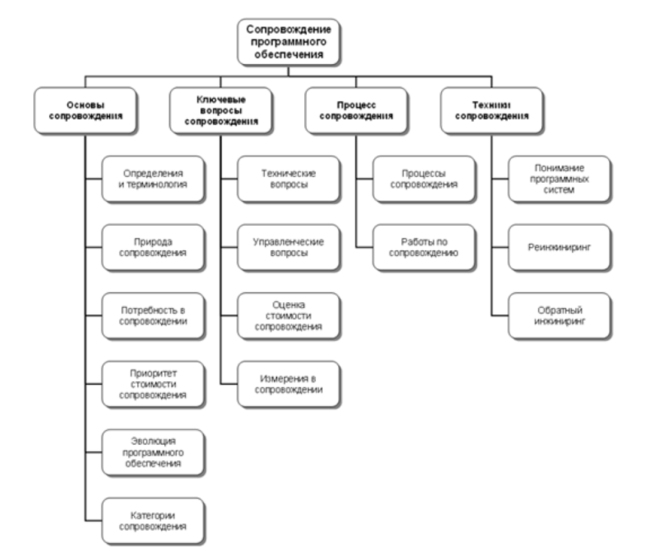

***Практическая работа № 4***

**Выявление факторов, определяющих потребность в сопровождении программного обеспечения.**

*Цель работы:* научиться выявлять факторы, определяющие потребность в сопровождении ПО

*Теоретическое обоснование*

Область знаний “Сопровождение программного обеспечения” связана с другими аспектами программной инженерии. По сути, описание этой области знаний непосредственно пересекается со всеми другими дисциплинами (рис.5).

Сопровождение необходимо для обеспечения того, чтобы программный продукт на протяжении всего периода эксплуатации удовлетворяет требованиям пользователей. Деятельность по сопровождению применима для программного обеспечения, созданного с использованием любой модели жизненного цикла и методологии разработки. Изменения программной системы могут быть обусловлены как действиями по корректировке ее поведения или несвязанные с необходимостью корректировки.

Рис. 5. Область знаний “Сопровождение программного обеспечения”

В общем случае, работы по сопровождению должны проводиться для решения следующих задач:

|
·         устранение сбоев,

·         улучшение дизайна,

·         реализация расширений <функциональных возможностей>,

·         создание интерфейсов взаимодействия с другими (внешними) системами,

·         адаптация для возможности работы на другой или обновленной аппаратной платформе,
|
·         применения новых системных возможностей, функционирования в среде обновленной телекоммуникационной инфраструктуры и т.п.

·         миграции унаследованного (legacy) программного обеспечения,

·         вывода программного обеспечения из эксплуатации.
|
| - | - |
Деятельность персонала сопровождения включает четыре ключевых аспекта:

|
·         поддержка контроля (управляемости) программного обеспечения в течение всего цикла эксплуатации:

·         поддержка модификаций программных систем,
|
·         совершенствование существующих функций,

·         предотвращение падения производительности программной системы до неприемлемого уровня.
|
| - | - |
На основе анализа и оценивания рассчитанных характеристик ресурсов для сопровождения следует выполнять заключительное технико-экономическое обоснование необходимости сопровождения конкретного программного продукта и определять:

- целесообразно ли продолжать работы по сопровождению и управлению конфигурацией конкретного программного продукта ;
- следует ли провести маркетинговые исследования;
- достаточно ли полно и корректно формализованы концепция и требования к модификациям версий программного продукта;
- есть ли возможность применить готовые повторно используемые компоненты ПС.

*Методические указания*

Для выполнения заданий вам потребуется теоретический материал, при анализе факторов, определяющих потребность в сопровождении ПО, систематизируйте данные в виде таблицы

*Задания*

- Изучите теоретический материал, частично законспектируйте
- Зарисуйте схему в тетрадь
- Для своего программного продукта разработайте технико-экономическое обоснованное заключение о необходимости его сопровождения. Для этого ответьте на вопросы:
- Целесообразно ли продолжать работы по сопровождению и управлению конфигурацией конкретного программного продукта или следует его прекратить, вследствие недостаточных ресурсов специалистов, времени или большой трудоемкости разработки модификаций?
- При наличии достаточных ресурсов, следует ли провести маркетинговые исследования для определения рентабельности создания очередной версии программного продукта и поставки её на рынок?
- Достаточно ли полно и корректно формализованы концепция и требования к модификациям версий программного продукта, на основе которых проводились экспертные оценки и расчеты затрат, или их следует откорректировать и выполнить повторный анализ с уточненными исходными данными?
- Есть ли возможность применить готовые повторно используемые компоненты ПС, в каком объеме относительно размера комплекса программ и рентабельно ли их применять в конкретной версии программного продукта или весь проект целесообразно разрабатывать как полностью новый?

*Контрольные вопросы*

- Что такое сопровождение ПО? Для чего оно нужно?
- Для решения каких задач проводятся работы по сопровождению?
- В чем заключается деятельность персонала сопровождения?
- Что определятся при составлении технико-экономического обоснования необходимости сопровождения ПО?

*Форма отчёта*

Конспект, схема, разработанное технико-экономическое обоснование ответы на вопросы.

