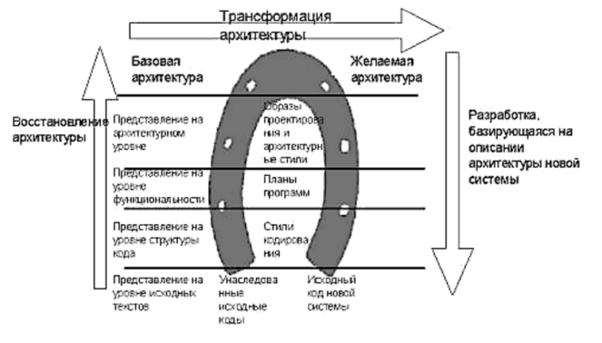

***Практическая работа № 8***

**Работа по сопровождению программного обеспечения: реинжиниринг**

*Цель работы:* научиться осуществлять реинжиниринг

*Теоретическое обоснование*

|
·         Прямой

инжиниринг
|direct engineering|
Процесс построения программного продукта «с нуля», исходя из проектной документации к нему.

 
|
| - | - | - |
|
·         Обратный

инжиниринг
|reverse engineering|
Процесс написания документации к программе и затем — восстановление копии программного продукта, уже имеющегося в распоряжении инженера. Эта задача не менее сложная, чем «прямой инжиниринг».

 
|
|·         Реинжиниринг|re engineering|Создание изделия, товара, программного продукта и т.п. по оригиналу и написание документации к нему. Реинжиниринг культурных ценностей называется реставрацией. Реинжиниринг «практически» является синонимом термина: «обратный инжиниринг».|
В случае если разработчик продукта более не поддерживает установленное у клиента программное обеспечение, переход на новое проблематичен, и поддержка существующей системы обходится слишком дорого, при наличии технической возможности производится [реинжиниринг](http://www.edsd.ru/ru/uslugi/podderzhka-i-reengineering) — то есть создание перепроектированной версии старого ПО с учетом новых требований. Миграция происходит постепенно, что позволяет избежать рисков. Это позволит сэкономить как на переходе на новые технологии, так и на сопровождении устаревшего программного обеспечения.

` `Смысл реинжиниринга заключается в перепроектировании. Начиная проектирование ПО, досконально изучаются новые потребности заказчика и требования, которые предъявлялись к устаревшему продукту. Документируя программное обеспечение, даётся гарантия возможности отслеживать действия и всегда быть в курсе хода работы. Все изменения, вносимые в действующую систему, проходят тщательное тестирование. В результате, конечный продукт удовлетворяет запросам и представляет собой современное программное обеспечение.

Реинжиниринг определяется как детальная оценка (examination) и перестройка программного обеспечения для формирования понимания, воссоздания (на уровне модели и, в ряде случаев, требований) и дальнейшей реализации его <функций> в новой форме (например, с использованием новых технологий и платформ, при сохранении существующей и расширением и облегчением возможностей добавлений новой функциональности).

В настоящее время существует много различных определений реинжиниринга (англ. reengineering) информационных систем (ИС). В том числе – много сходных и смежных понятий. Общепринятого определения пока не существует.

Главной причиной реинжиниринга информационной системы является расхождение между требованиями к информационной системе со стороны предприятия и ее действительными характеристиками. Такое расхождение имеет тенденцию к нарастанию со временем. Относительно небольшое расхождение позволяет говорить о необходимости модернизации ИС, сильное – о необходимости реинжиниринга информационной системы.

Основными причинами, также приводящими к реинжинирингу информационных систем, являются:

|·         моральное устаревание информационной системы (информационных технологий, пользовательских и программных интерфейсов, используемых в составе ИС);|
·         физическое устаревание информационной системы (износ ее аппаратных компонентов);

·         причины организационного характера (связанные с окружением информационной системы, бизнес-процессами предприятия, пользователями системы).
|
| - | - |
По мере разработки новой версии продукта, предыдущая система остается вполне функциональной и переход от одной к другой производится только после тщательной апробации. Хорошей практикой реинжиниринга является параллельное функционирование: обновляется серверное программное обеспечение, которое какое-то время поддерживает два интерфейса пользователя: устаревший для совместимости и новый для опытной эксплуатации.

Рис. 9. Модель «подковы»

На сегодняшний день известны следующие основные пути реинжиниринга ИС:

- создание новой ИС («с чистого листа») взамен существующей;
- модификация существующей ИС;
- адаптация готовой ИС стороннего разработчика.

В общем виде процесс реинжиниринга информационной системы можно изобразить в виде схемы, получившей название модель «подковы» (рис.9).

В рамках процесса реинжиниринга ИС (в не зависимости от методологии) принято выделять следующие наиболее существенные этапы:

|
·         формирование команды реинжиниринга;

·         сбор претензий к системе;

·         создание спецификации требований к системе;

·         актуализация структурных моделей системы;
|
·         генерация альтернатив реинжиниринга системы;

·         выбор оптимальной альтернативы;

·         реализации выбранной альтернативы.

 
|
| - | - |
*Методические указания*

Для выполнения заданий вам потребуется

*Задания*

- Изучите и законспектируйте теоретический материал
- Дополнительный материал изучите на сайтах

Реинжиниринг информационных систем –  <http://5fan.ru/wievjob.php?id=19283>

Реинжиниринг программных систем — <http://www.informicus.ru/default.aspx?id=73&SECTION=6&subdivisionid=10>

- Определите, какое ПО из устаревших на сегодняшний день вы будете рассматривать
- Заполните таблицу

|Этапы реинжиниринга|Виды работ реинжиниринга|
| - | - |
|·         формирование команды реинжиниринга;||
|·         сбор претензий к системе;||
|·         ….|….|
\* 

*Контрольные вопросы*

|
·        Что такое инжиниринг?

·        Какие виды инжиниринга вы знаете?

·        Что такое реинжиниринг?

·         В каких случаях применяется реинжиниринг?
|
·        Какие пути реинжиниринга вы знаете?

·        Расскажите о модели «подковы»

·        Назовите этапы реинжиниринга

 
|
| - | - |
*Форма отчёта*

Конспект, таблицы, ответы на вопросы

