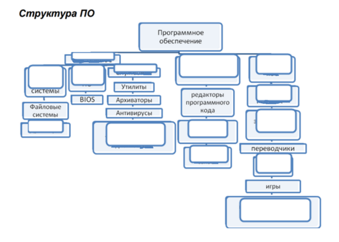
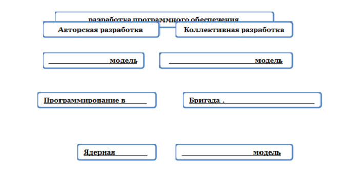
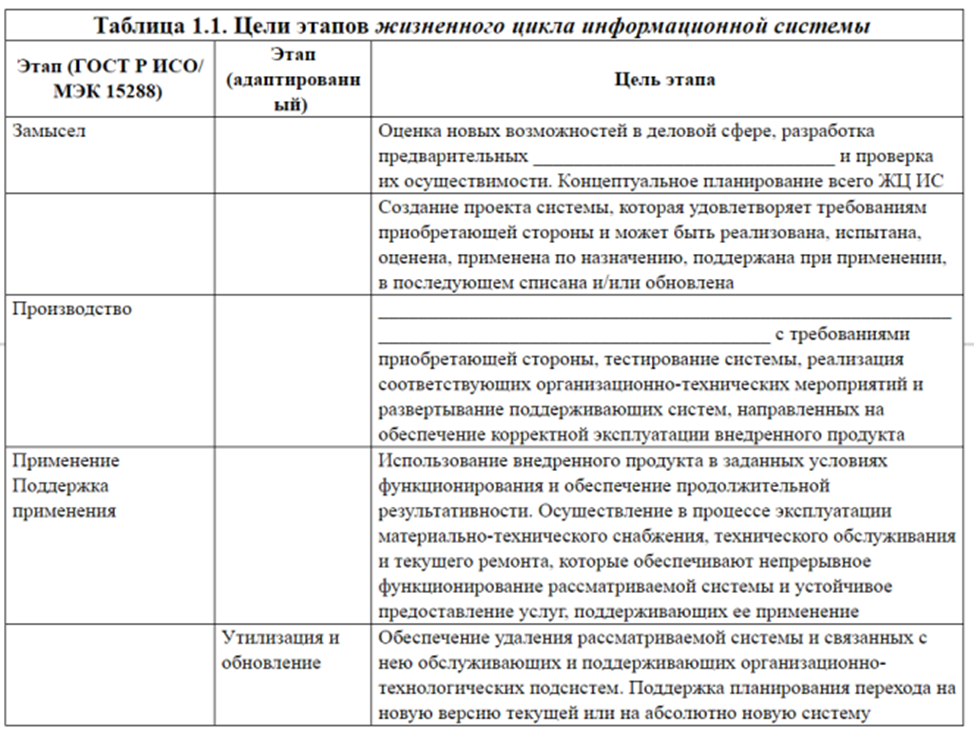
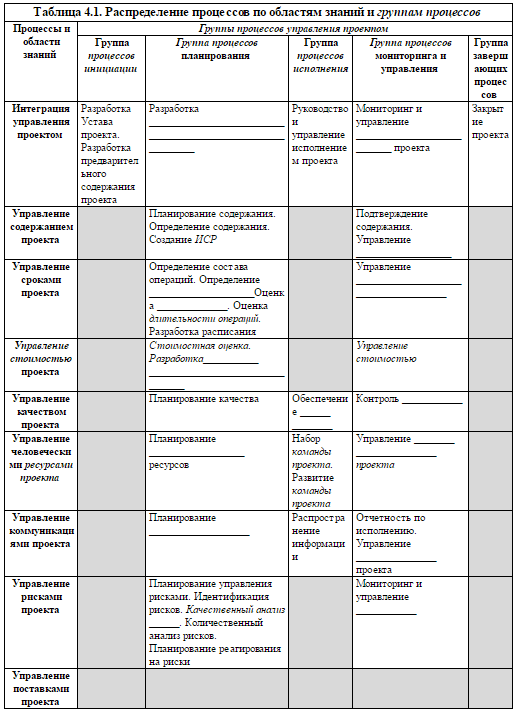

***Проверочная работа по 1 разделу***

**Обобщение материала по разделу 1.**

*Цель:* обобщить знания, полученные при изучении, раздела 1.

***Методические указания***

Для выполнения заданий вам потребуется вспомнить теоретический материал раздела 1.

***Задания***

Выполните тест:

1. **Выберите верный ответ:**

Инструментарий технологии программирования это —

1. локальные средства, обеспечивающие выполнение отдельных работ по созданию программ;
1. технология разработки, отладки, верификации и внедрения программного обеспечения
1. совокупность программ и программных комплексов, обеспечивающих технологию разработки, отладки и внедрения создаваемых программных продуктов.

**2.Заполните схему:**

3. **Расставьте этапы процесса разработки (создания) программы в правильном порядке**:

Этап кодирования.

Этап проектирования.

Этап эксплуатации и сопровождения

Этап постановки и формулировки задачи.

Этап отладки и тестирования

1. **Заполните пробелы в схеме, нарисуйте связи**

` `**

5. **Заполните таблицу**

6. *
   ` `**Опишите задачи рабочих групп на этапе внедрения.**
1. Менеджер (руководитель) проекта (Project Manager) — лицо, отвечающее за \_\_\_\_\_\_\_\_\_\_\_\_\_\_\_\_\_\_\_\_\_\_\_\_\_\_\_\_\_\_\_\_\_\_\_\_\_\_\_\_\_\_\_\_\_\_\_\_\_\_\_\_\_\_\_\_\_\_\_\_\_\_\_\_\_\_\_\_\_\_\_\_\_\_\_\_\_;
1. Спонсор (куратор) проекта (Project Sponsor) — лицо, обеспечивающее
   \_\_\_\_\_\_\_\_\_\_\_\_\_\_\_\_\_\_\_\_\_\_\_\_\_\_\_\_\_\_\_\_\_\_\_\_\_\_\_\_\_\_\_\_\_\_\_\_\_\_\_\_\_\_\_\_\_\_\_\_\_\_\_\_\_\_\_\_\_\_\_\_\_\_\_\_\_; обеспечивает взаимодействие с \_\_\_\_\_\_\_\_\_\_\_\_\_\_\_\_\_\_\_\_\_\_\_\_\_\_\_\_\_\_\_\_\_\_\_\_\_\_\_\_\_\_\_\_\_\_\_\_\_, утверждает \_\_\_\_\_\_\_\_\_\_\_\_\_\_\_\_\_\_\_\_\_\_\_\_\_\_\_\_; во внутренних проектах обычно несет ответственность за \_\_\_\_\_\_\_\_\_\_\_\_\_\_\_\_\_\_\_\_\_\_\_\_\_\_\_\_\_\_\_\_\_\_\_\_\_\_\_\_\_\_\_\_\_\_\_\_\_\_\_\_\_\_\_\_\_\_\_\_\_\_\_\_;
1. Заказчик (потребитель) проекта (Project Customer) — лицо внутри
   или вне организации, которое \_\_\_\_\_\_\_\_\_\_\_\_\_\_\_\_\_\_\_\_\_\_\_\_\_\_\_\_\_\_\_\_\_\_\_\_\_\_\_\_\_\_\_\_\_\_\_\_\_\_\_;
1. Руководитель функционального подразделения — направляет ресурсы в \_\_\_\_\_\_\_\_\_\_\_\_\_\_\_\_\_\_\_\_\_\_\_\_\_\_\_\_\_\_\_\_\_\_\_\_\_\_\_\_\_\_\_\_\_\_\_\_\_\_\_\_\_\_\_\_\_\_\_\_\_\_\_\_\_\_\_\_\_\_\_\_\_\_\_\_;
1. Функциональный лидер проекта — объединяет \_\_\_\_\_\_\_\_\_\_\_\_\_\_\_\_\_\_\_\_\_\_\_\_\_\_ \_\_\_\_\_\_\_\_\_\_\_\_\_\_\_\_\_\_\_\_\_\_\_\_\_\_\_\_ (именно с ним взаимодействует менеджер проекта);
1. Лидер пакета работ — объединяет \_\_\_\_\_\_\_\_\_\_\_\_\_\_\_\_\_\_\_\_\_\_\_\_\_\_\_\_\_\_\_\_\_\_\_\_\_\_\_\_

\_\_\_\_\_\_\_\_\_\_\_\_\_\_\_\_\_\_\_\_\_\_\_\_\_\_\_\_\_\_\_\_\_\_\_\_\_\_\_\_\_\_\_\_\_\_\_\_\_\_\_\_\_\_\_\_\_\_\_\_\_\_\_\_\_\_\_\_\_\_\_\_\_\_\_\_\_.

1. **Расставьте в правильном порядке**

Основные этапы внедрения программного продукта:

|
·        Опытная эксплуатация

·        Тестирование системы

·         Промышленная эксплуатация
|
·        Настройка системы (программного продукта)

·        Обследование

·         Разработка технического задания
|
| :- | :- |
1. **Заполните таблицу (только не закрашенные ячейки)**

* 

1. Дайте названия вариантам установки:

**Возможные варианты установки.**

1. \_\_\_\_\_\_\_\_\_\_\_\_\_\_\_\_\_\_\_\_\_\_\_\_\_\_\_\_\_\_\_\_\_\_\_\_ — установка выполняется без установщика или со значительным количеством операций, вручную выполняемых пользователем.
1. \_\_\_\_\_\_\_\_\_\_\_\_\_\_\_\_\_\_\_\_\_\_\_\_\_\_\_\_\_\_\_\_\_\_\_\_ — установка, в процессе которой не отображаются сообщения или окна.
1. \_\_\_\_\_\_\_\_\_\_\_\_\_\_\_\_\_\_\_\_\_\_\_\_\_\_\_\_\_\_\_\_\_\_\_\_\_\_ — установка, которая выполняется без вмешательства со стороны пользователя, исключая, конечно, сам процесс её запуска.
1. \_\_\_\_\_\_\_\_\_\_\_\_\_\_\_\_\_\_\_\_\_\_\_\_\_\_\_\_\_\_\_\_\_\_\_\_\_ — установка, которая не требует начального запуска процесса.
1. \_\_\_\_\_\_\_\_\_\_\_\_\_\_\_\_\_\_\_\_\_\_\_\_\_\_\_\_\_\_\_\_\_\_\_\_ — установка, которая выполняется без использования монитора, подсоединённого к компьютеру пользователя (в частности, выполняемая на компьютере без видеовыхода вообще).
1. \_\_\_\_\_\_\_\_\_\_\_\_\_\_\_\_\_\_\_\_\_\_\_\_\_\_\_\_\_\_\_\_\_\_\_\_\_ — установка, выполняемая в отсутствие таких факторов, которые могут изменяться от программы к программе.
1. \_\_\_\_\_\_\_\_\_\_\_\_\_\_\_\_\_\_\_\_\_\_\_\_\_\_\_\_\_\_\_\_\_\_\_\_\_ — установка программы, выполняемая с её копии на жестком диске (называемой flat copy), а не с самого оригинального носителя (обычно компакт- или DVD-диск).
1. **Заполните пробелы:**

Две основные задачи в конфигурационном управлении – управление \_\_\_\_\_\_\_\_\_\_\_\_\_\_\_\_\_\_\_\_\_\_\_\_\_\_\_\_\_\_\_\_  и управление \_\_\_\_\_\_\_\_\_\_\_\_\_\_\_\_\_\_\_\_\_\_\_\_\_\_.

- Заполните пробелы:

К работам по администрированию программного обеспечения (ПО) относятся:

\_\_\_\_\_\_\_\_\_\_\_\_\_\_\_\_\_\_\_\_\_\_\_\_\_\_\_\_\_\_\_\_\_\_\_\_\_\_\_\_\_ операционной системы и \_\_\_\_\_\_\_\_\_\_\_\_\_\_\_\_\_\_\_\_\_\_\_\_\_\_\_\_\_\_\_\_\_\_\_\_\_\_\_\_\_\_\_\_ на рабочих станциях;

\_\_\_\_\_\_\_\_\_\_\_\_\_\_\_\_\_\_, \_\_\_\_\_\_\_\_\_\_\_\_\_\_\_\_\_\_\_\_\_\_\_\_\_ и \_\_\_\_\_\_\_\_\_\_\_\_\_\_\_\_\_\_\_ серверных служб (терминальные, почтовые, прокси, веб, VPN серверы, контроллеры доменов, шлюзы и пр.);

наладка и поддержка \_\_\_\_\_\_\_\_\_\_\_\_\_\_\_\_\_\_\_\_\_\_\_\_\_\_\_\_\_\_\_\_\_\_\_\_\_\_\_\_\_\_\_\_\_;

настройка \_\_\_\_\_\_\_\_\_\_\_\_\_\_\_\_\_\_\_\_\_\_\_\_\_\_\_\_\_\_\_\_\_\_\_\_\_\_\_\_\_\_\_\_\_\_\_\_под решение конкретных бизнес задач;

определение и настройка \_\_\_\_\_\_\_\_\_\_\_\_\_\_\_\_\_\_\_\_\_\_\_\_\_\_\_\_\_\_\_\_\_\_\_\_\_\_\_\_\_\_\_;

поиск и удаление \_\_\_\_\_\_\_\_\_\_\_\_\_\_\_\_\_, установка \_\_\_\_\_\_\_\_\_\_\_\_\_\_\_\_\_\_\_\_\_\_\_;

\_\_\_\_\_\_\_\_\_\_\_\_\_\_\_\_\_\_\_\_\_\_\_ и \_\_\_\_\_\_\_\_\_\_\_\_\_\_\_\_ работы ПО и оборудования;

поддержка \_\_\_\_\_\_\_\_\_\_\_\_\_\_\_\_\_\_\_\_\_\_\_\_\_\_\_\_\_ прикладного и системного ПО;

1. **Дайте названия определениям:**
1. \_\_\_\_\_\_\_\_\_\_\_\_\_\_\_\_\_\_\_\_\_\_\_\_\_\_\_\_\_\_\_\_\_\_\_ — это приведение программного обеспечения в соответствие с целями и задачами, для которых оно предназначено.
1. \_\_\_\_\_\_\_\_\_\_\_\_\_\_\_\_\_\_\_\_\_\_\_\_\_\_\_\_\_\_\_\_\_\_\_\_\_\_\_\_\_\_\_\_\_\_ — это дополнения к программному обеспечению, предотвращающие или устраняющие неполадки, повышающие безопасность либо улучшающие производительность компьютера.
1. \_\_\_\_\_\_\_\_\_\_\_\_\_\_\_\_\_\_\_\_\_\_\_\_\_\_\_\_\_\_ — набор обновлений, исправлений и/или улучшений компьютерной программы, поставляемый в виде единого установочного пакета.
1. \_\_\_\_\_\_\_\_\_\_\_\_\_\_\_\_\_\_\_\_\_\_\_\_\_\_ — это процедура удаления файлов и папок программы с жесткого диска и соответствующих данных из системного реестра.
1. \_\_\_\_\_\_\_\_\_\_\_\_\_\_\_\_\_\_\_\_\_\_\_\_\_\_\_\_\_\_\_\_\_\_\_\_\_\_\_\_\_\_ — это безвозмездное устранение изготовителем или продавцом неисправностей путем диагностики, настройки и ремонта его составных частей или Устройства в целом в течение гарантийного срока, либо замену на аналогичные отремонтированные при соблюдении пользователем условий гарантии и при условии, что дефект возник по вине производителя данного устройства.
1. \_\_\_\_\_\_\_\_\_\_\_\_\_\_\_\_\_\_\_\_\_\_\_\_\_\_\_\_\_\_\_\_\_\_- оказываемые услуги по настройке, обслуживанию, адаптации и модификации Продуктов или устранению имеющихся в них ошибок, а также предоставлению обновлений и дополнительных программных модулей.
1. **Заполните таблицу**

||**Гарантия**|**Техническая поддержка**|
| :- | :- | :- |
|Стоимость услуги|Гарантия на год составляет в среднем \_\_\_\_\_\_\_\_\_% стоимости разработки.|
Оплачивается \_\_\_\_\_\_\_\_\_\_\_ исходя из \_\_\_\_\_\_\_\_\_\_\_\_\_\_

\_\_\_\_\_\_\_\_\_\_\_\_\_\_\_\_\_\_\_\_\_\_\_.
|
|Устранение недочетов|
Возникших \_\_\_\_\_\_\_\_\_\_\_\_\_\_\_\_\_\_\_

\_\_\_\_\_\_\_\_\_\_\_\_\_\_\_\_\_\_ в соответствии с техническим заданием.
|Любых.|
|Сроки реагирования на заявку клиента|От \_\_\_\_\_\_\_\_\_ до \_\_\_\_\_\_\_\_\_\_\_\_\_ после получения претензии и проведения экспертизы.|\_\_\_\_\_\_\_\_\_\_\_\_\_\_\_\_ реакция. \_\_\_\_\_\_\_\_\_\_\_\_\_\_\_\_\_\_\_\_\_\_\_ исправление. Возможна \_\_\_\_\_\_\_\_\_\_\_\_\_\_\_\_\_ работа.|
|Персонализация продукта|
Предоставляется продукт с характеристиками, \_\_\_\_\_\_\_\_\_\_\_\_\_\_\_\_\_\_

\_\_\_\_\_\_\_\_\_\_\_\_\_\_\_\_\_\_\_\_\_\_\_\_\_.
|
Продукт дорабатывается для \_\_\_\_\_\_\_\_\_\_\_\_\_\_\_\_\_\_\_\_

\_\_\_\_\_\_\_\_\_\_\_\_\_\_\_\_\_\_\_\_\_\_\_ по ходу эксплуатации.
|
|Консультации|В соответствии с \_\_\_\_\_\_\_\_\_\_\_\_\_\_\_.|Предоставляются.|
|Возможность модернизации продукта, расширение его функциональности|Не предусмотрена.|
Выполняется по \_\_\_\_\_\_\_\_\_

\_\_\_\_\_\_\_\_\_\_\_\_\_\_\_\_\_\_\_\_\_\_\_\_. Предусмотрена.
|
*Форма отчёта*

Конспекты тем первого раздела №№ 1-8, выполненные практические работы №№1-3, Выполненный тест.

