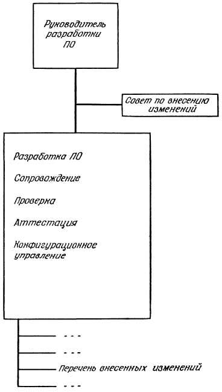

## ` `**Процесс сопровождения программного обеспечения компьютерных систем**
## **Процессы сопровождения.** 
`	`Вопросы организации процесса сопровождения напрямую связаны с соответствующими  стандартами и de facto практиками реализации такого процесса. Тема “Работы по сопровождению” (Maintenance Activities) различает вопросы сопровождения и разработки и показывает взаимосвязь c другими аспектами деятельности программной инженерии.

Типичные и распространенные потребности в процессах программной инженерии подробно описаны и документированы в различных источниках. Одна из наиболее детально проработанных и распространенных (на уровне стандарта de facto) процессных моделей, изначально созданных с ориентацией на программное обеспечение – CMMI (Capability Maturity Model Integration – интегрированная модель зрелости), разработанная в Институте программной инженерии университета Карнеги-Меллон (SEI CMU). CMMI, в частности, уделяет специальное внимание процессам сопровождения. Существуют и другие, менее распространенные, но тем не менее развивающиеся модели.

1 **Процессы сопровождения (Maintenance Processes)**

Процессы сопровождения описывают необходимые работы и детальные входы/выходы этих работ.

Эти процессы рассматриваются в стандартах IEEE 1219 (Standard for Software Maintenance) и ISO/IEC 14764 (Standard for Software Engineering - Software Maintenance).

Процесс сопровождения начинается по стандарту IEEE 1219 с момента передачи программной системы в эксплуатацию (post-delivery stage) и касается таких вопросов, как планирование деятельности по сопровождению (см. рисунок 2).

Рисунок 2. Работы в процессе сопровождения по стандарту IEEE 1219.

Стандарт ISO/IEC 14764 уточняет положения, связанные с процессом сопровождения, стандарта жизненного цикла 12207. Работы по сопровождению, описанные в этом стандарте аналогичны работам в IEEE 1219, за исключением того, что сгруппированы несколько иначе (см. рисунок 3).

**Работы по сопровождению в стандарте 14764 разбиты на задачи:**

• Process Implementation – реализация процесса

• Problem and Modification Analysis – анализ проблем и <необходимых> модификаций

•   –проведение модификаций (реализация изменений)

• Maintenance Review/Acceptance – оценка и принятие <проведенных работ> при

сопровождении

• Migration – миграция (на модифицированную или новую версию программного обеспечения)

• Software Retirement – вывод из эксплуатации (прекращение эксплуатации программного обеспечения)

В представленных в SWEBOK источниках можно найти описание истории эволюции соответствующих процессных моделей упоминаемых стандартов ISO/IEC и IEEE. Кроме того, существует и общая (обобщенная) модель процессов сопровождения. Agile-методологии, активно развивающиеся в последние годы, предлагают “облегченные” (light или lightweight) процессы, в том числе, и для организации деятельности по сопровождению, например, Extreme maintenance 
##
## **Этапы процесса сопровождения: подготовка,  анализ проблем и изменений,  внесение изменений,  проверка и приемка при сопровождении,  перенос,  снятие с эксплуатации.** 
**Этапы процесса сопровождения**

Этапы процесса сопровождения основаны на цикле Деминга PDCA (Plan — Do — Check —Analyze) или «планируй — делай — проверяй — анализируй» (см. рис. 3).

Рис. 3 Общая структура процесса сопровождения

(по стандарту ГОСТ Р ИСО/МЭК 14764—2002)

Формирование процесса сопровождения начинается с разработки концепции сопровождения. Такой документ, например, по стандарту ISO/IEC 14764 (Standard for Software Engineering— Software Maintenance), должен содержать следующие разделы:

\1. Область сопровождения программного средства.

1.1. Типы выполняемого сопровождения.

1.2. Сопровождаемый уровень документов.

1.3. Реакция (чувствительность) на сопровождение (определение ожиданий к

сопровождению заказчика).

1.4. Обеспечиваемый уровень обучения персонала.

1.5. Обеспечение поставки продукта.

1.6. Организация справочной службы («горячей линии»).

\2. Практическое применение (адаптация) данного процесса.

\3. Определение организаций (лиц), ответственных за сопровождение.

\4. Оценка стоимости сопровождения:

4.1. Проезд до места расположения пользователя.

4.2. Обучение как сопроводителей, так и пользователей.

4.3. СПИ (среда программной инженерии) и СТПС (среда тестирования программного средства) и их ежегодное сопровождение.

4.4. Персонал (зарплата и премии).

Должен быть сформирован соответствующий план сопровождения. Этот план должен подготавливаться одновременно с разработкой программной системы. План должен определять, как пользователи будут размещать свои запросы на модификацию (изменения) или сообщать об ошибках, сбоях и проблемах.

Стандарт ГОСТ Р ИСО/МЭК 14764—2002 предлагает следующий состав такого плана:

a). Введение:

\1) описание сопровождаемой системы;

\2) определение исходных состояний программного средства;

\3) описание уровня требуемой поддержки;

\4) определение организаций, осуществляющих сопровождение;

\5) описание любых условий (протоколов), согласованных между заказчиком и

поставщиками;

b). Концепция сопровождения (уже кратко описанная выше):

\1) описание концепции;

\2) описание уровня поддержки системы;

\3) установление периода поддержки;

\4) адаптация (практическое применение) процесса сопровождения;

c). Организационные работы и работы по сопровождению:

\1) роли и обязанности сопроводителя до поставки программного продукта:

I) реализация процесса;

II) определение инфраструктуры процесса;

III) установление процесса обучения;

IV) установление процесса сопровождения;

\2) роли и обязанности сопроводителя после поставки программного продукта:

I) реализация процесса;

II) анализы проблем и модификаций (изменений);

III) реализация (внесение) модификаций (изменений); 

IV) рассмотрение и принятие модификаций (изменений);

V) перенос программного средства в новую среду;

VI) снятие программного средства с эксплуатации;

VII) решение проблем (включая справочную службу);

VIII) при необходимости — обучение персонала

(сопроводителя и пользователя);

IX) усовершенствование процесса;

\3) роль пользователя:

I) приемочные испытания;

II) взаимосвязи (интерфейсы) с другими организациями;

d). Ресурсы:

\1) персонал:

I) состав персонала для конкретного проекта;

Структура, отвечающая за сопровождение, должна проводить общую деятельность по бизнес-планированию, касающуюся бюджетирования, финансового менеджмента и управления человеческими ресурсами в области сопровождения.

\2) программные средства:

I) определение программных средств, необходимых для поддержки эксплуатации системы (с учетом системных требований и требований к СПИ, СТПС и инструментальным средствам);

\3) технические средства:

I) определение технических средств, необходимых для поддержки эксплуатации системы (с учетом системных требований и требований к СПИ,

СТПС и инструментальным средствам);

\4) оборудование (аппаратура):

I) определение требований к оборудованию (аппаратуре) системы (помимо технических средств вычислительной техники);

\5) документы:

I) план обеспечения качества;

II) план управления проектом;

III) план управления конфигурацией;

IV) документы разработки;

V) руководства по сопровождению;

VI) план проведения верификации;

VII) план проведения аттестации (валидации);

VIII) план тестирования, процедуры тестирования и отчеты

о тестировании;

IX) план обучения;

X) руководство (а) пользователя;

\6) данные;

\7) другие требования к ресурсам (при необходимости);

e). Процесс (как должна быть выполнена конкретная деятельность):

\1) процесс, выполняемый сопроводителем (приводят общее описание процесса без детализации в плане сопровождения всего процесса);

\2) процесс адаптации (практического применения сопровождения к условиям

проекта);

f). Обучение:

\1) определение уровня обучения, необходимого для сопроводителя и пользователей;

g). Протоколы и отчеты по сопровождению:

\1) перечень запросов пользователя на оказание услуг по сопровождению,

предложение о модификациях или отчеты о проблемах;

\2) состояния запросов (предложений, отчетов) по категориям;

\3) приоритеты запросов (предложений, отчетов);

\4) контрольные данные, собранные при работах по сопровождению.

Таблица 2. Этапы процесса сопровождения информационной системы

|` `**Входные данные**|**Этап сопровождения**|**Выходные данные**|**Выход в параграфе**|
| - | - | - | - |
|
Базовая версия АС,

сообщения об ошибках от пользователей
|**Анализ дефектов и модификаций**|Подтверждение (не подтверждение) ошибки или дефекта, пример модификации|Выдержки из отчётов пользователей о выявленных дефектах и предложения по корректировке.|
|Принятые предложения о модификации, задокументированные в Журнале выявленных дефектов|**Реализация модификации**|Реализованные и задокументированные изменения|Определение того, что подлежит модификации (анализ журнала выявленных дефектов и предложений по корректировке).|
|Проведённые модификации, задокументированные в журнале подготовленных и утвержденных корректировок|**Оценка и принятие результатов сопровождения**|Утверждение на удовлетворительное завершение модификации, как определено в контракте на сопровождение|Подготовленное извещение пользователям о выпуске новой версии АС|
|Миграционный план|**Перенос на иную платформу (в иную среду)**|Выполненный миграционный план, уведомление пользователей о переносе|Описание миграционного плана. Уведомление пользователя о планах и действиях по перемещению.|

## **Работы по сопровождению.** 
Как уже отмечалось, многие работы по сопровождению похожи на аспекты деятельности по разработке. В обоих случаях необходимо проводить анализ, проектирование, кодирование, тестирование и документирование. Специалисты по сопровождению должны отслеживать требования так же, как и инженеры-разработчики и обновлять документацию по мере разработки и/или выпуска обновленных или новых релизов продукта. Стандарт ISO/IEC 14764 рекомендует, чтобы персонал или организации, отвечающие за сопровождение, в случае использования элементов процессов разработки в своей деятельности, адаптировали эти процессы <целиком> в соответствии со своими потребностями. В то же время, деятельность по сопровождению обладает и определенными уникальными чертами, что приводит к необходимости использования специализированных процессов.

3.2.1 Уникальные работы (Unique activities)

Существует ряд процессов, работ и практик, уникальных для деятельности по сопровождению.

SWEBOK приводит следующие примеры такого рода уникальных характеристик:

• Передача (Transition): контролируемая и координируемая деятельность по передаче программного обеспечения от разработчиков группе, службе или организации, отвечающей за дальнейшую поддержку;

• Принятие/отклонение запросов на модификацию (Modification Request Acceptance/Rejection):

запросы на изменения могут как приниматься и передаваться в работу, так и отклоняться по различным обоснованным причинам – объему и/или сложности требуемых изменений, а также необходимых для этого усилий. По мнению автора, соответствующие решения могут также приниматься на основе приоритетности, оценке обоснованности, отсутствии ресурсов (в том числе, отсутствия возможности привлечения разработчиков к решению задач по модификации, при реальном наличии такой потребности), утвержденной запланированной

к реализации в следующем релизе и т.п..

• Средства извещения персонала сопровождения и отслеживания статуса запросов на модификацию и отчетов об ошибках (Modification Request and Problem Report Help Desk):

функция поддержки конечных пользователей, инициирующая работы по оценке (assessment, подразумевая в том числе оценку необходимости), анализу приоритетности и стоимости модификаций, связанных с поступившим запросом или сообщенной проблемой.

• Анализ влияния (Impact Analysis): анализ возможных последствий изменений, вносимых в существующую систему 

• Поддержка программного обеспечения (Software Support): работы по консультированию пользователей, проводимые в ответ на их информационные запросы (request for information), например, касающиеся соответствующих бизнес-правил (см. область знаний “Требования к программному обеспечению”, прим. автора), проверки, содержания данных и специфических (ad hoc) вопросов пользователей и их сообщений о проблемах (ошибках, сбоях, непредусмотренному поведению, непониманию аспектов работы с системой и т.п.).

• Контракты и обязательства: к ним относятся классическое соглашение об уровне предоставляемого сервиса - Service Level Agreement (SLA), а также другие договорные аспекты, на основании которых, группа/служба/организация по сопровождению выполняет соответствующие работы.

С точки зрения автора, на практике сложно провести грань между разделяемыми в SWEBOK функциями Help Desk и Software Support –эти функции, обычно, совмещены с процессной точки зрения.

3.2.2 Дополнительные работы, поддерживающие процесс сопровождения (Support activities)

Столь длинный перевод названия данной темы связан с содержанием соответствующих работ, описываемых SWEBOK, как работы персонала сопровождения, не включающие явного взаимодействия с пользователями, но необходимые для осуществления соответствующей деятельности. К таким работам относятся: планирование сопровождения. Конфигурационное управление (softwareconfigurationmanagement), проверка и аттестация (V&V – verificationand validation), оценка качества программного обеспечения (software quality assessment), различные аспекты обзора, анализа и оценки (reviews), аудит (audit) и обучение (training) пользователей.

Также, к таким специальным (внутренним) работам относится обучение персонала сопровождения.

В силу особой значимости (с точки зрения автора - обязательности) ряда упомянутых работ, им посвящены следующие под-темы данной секции области знаний по сопровождению программного обеспечения.
## **«Проактивный» подход. «Реактивный» подход.** 
реактивное действие: *возникает проблема → нам звонят, требуют решение → мы отправляемся ее решать?*

И гораздо реже мы занимаем проактивную позицию:

*ЗАРАНЕЕ готовимся к возникновению проблемы → думаем, что можно сделать → выполняем грамотную «профилактику».*

**Проактивный подход:**

1. Предвидим проблему (в меру возможностей).
1. Готовимся ее предотвратить (т.е. «работаем на опережение»).
1. Получаем не более 10% срочных заданий, поскольку 90% мы уже нивелировали подготовкой.

**Реактивный подход:**

1. Игнорируем предвидение.
1. Ни к чему заранее не готовимся (решаем проблемы по мере поступления).
1. Получаем 100% срочных заданий в духе «нужно вчера».

## **Иерархия подготовки и внесения изменений в систему**
В процессе эксплуатации и сопровождения сложных комплексов программ применяются методы конфигурационного управления. Такой подход особенно эффективен при сопровождении широко тиражируемых очень сложных программных средств, используемых одновременно в нескольких версиях.

Пусть сопровождаемый комплекс программ имеет объем равный 105 . . 107  команд и имеющий *n*-ю версию. Схема конфигурационного управления при сопровождении между *n*-й и *(n+1)*-й версиями с учетом тиражирования представляется следующим образом.

Ошибки и предложения изменений первоначально селектируются специалистами по компонентам и анализируются советом конфигурационного управления по их влиянию на качество функционирования программ и затратам на осуществление изменений.

**Каждое предлагаемое изменение программ оценивается по следующим критериям:**

1. насколько данное изменение может улучшить эксплутационные характеристики программного средства в целом;
1. каковы затраты на выполнение корректировок в новой версии и их распространение пользователям;
1. возможно ли и насколько сильно влияние изменения на функциональные характеристики остальных компонент данного программного средства.
1. какова срочность извещения пользователей о разработанной корректировке и целесообразно ее распространять до подготовки очередной версии;
1. для какого числа пользователей может быть полезным данное изменение;
1. как данное изменение отразится на эксплуатации пользователями предыдущих версий;
1. насколько подготовка данного изменения может отразится на сроках создания очередной версии.

В результате анализа часть предлагаемых изменений отвергается, а для тех, которые отобраны для реализации, разрабатываются корректировки.

Далее наступает тестирование на корректность каждой выполненной корректировки программ и на качество функционирования испытываемой эталонной версии.

В процессе эксплуатации *n-*й версии программного средства у каждого *(m-го)* пользователя выявляются претензии к функционированию программ, которые квалифицируются как ошибки. (которые, однако, могут быть обусловлены недостаточной квалификацией пользователя).

Установление достоверности ошибок начинается с тестирования эталонной версии ПС при исходных данных *(m-го)* пользователя. Если проявляется ошибка, то она регистрируется как подтвержденная при зафиксированных тестовых данных.

При отсутствии проявления ошибки на эталонной версии целесообразно протестировать копию версии, адаптированную к условиям *(m-го)* пользователя.

Если и при этом ошибка не проявляется, то регистрируется ее не подтверждение, о чем сообщается пользователю и ошибка снимается с учета.

Если ошибка подтверждена на версии пользователя, то, возможно, что эта версия была неправильно адаптирована к условиям применения. Подготовка и тестирование новой адаптированной версии может подтвердить проявление ошибки, о которой информировал пользователь, тогда она регистрируется для последующего анализа.

Если ошибка не подтверждается, то регистрируется неправильная адаптация версии пользователем.

**В процессе анализа предполагаемые изменения распределяются по группам:**

Ø  Срочные изменения, которые должны не только быть внесены в очередную (n+1)-ю версию ПС, но и сообщены пользователю для оперативной корректировки программ до внедрения официальной версии.

Ø  Изменения, которые целесообразно внести в (n+1)-ю версию с учетом затрат на их реализацию и улучшение эффективности ПС.

Ø  Изменения, которые требуют дополнительного анализа целесообразности и эффективности их реализации в последующих версиях и может не внедряться в (n+1)-ю версию ПС.

Ø  Изменения, которые не оправдывают затрат на разработку и выполнение корректировок или практически не влияют на эффективность ПС, в следствии чего не подлежат реализации.

***ВОЗМОЖНЫЕ ОРГАНИЗАЦИОННЫЕ СТРУКТУРЫ СОПРОВОЖДЕНИЯ***

`       `В предыдущих разделах мы преимущественно уделили внимание обеспечению функциональных возможностей сопровождения, а не его организационной структуре. Очевидно, что разные руководители являются горячими сторонниками (или противниками) различных, часто противоположных организационных структур обеспечения. Нередко случается, что в дневнике одного руководителя содержатся самые лестные отзывы о программно-ориентированной организации сопровождения, а с другой с еще большим жаром отстаивает достоинства его функциональной организации. На самом же деле все зависит от особенностей характера и индивидуального стиля работы данного руководителя.

Рис. 4.2.5-1. Организационная структура работы в режиме разделения времени: СПО производится той же организацией, которая проводит разработку программного обеспечения. Нередко эта работа делается одними и теми же сотрудниками.

Рис. 4.2.5-2. Организационная структура “Двуглавый Дракон”: СПО производится в другой организации, независимой от той, где было разработано ПО.

Рис. 4.2.5-3. Организационная структура “Зонтик”: СПО подчинено тому же руководителю, что и разработка ПО, но производится одной или более независимыми организациями.

`       `Задача этого раздела состоит в том, чтобы предложить читателю несколько возможных способов организации процесса сопровождения программного обеспечения. Мы не претендуем на то, что эти способы наилучшие. И с учетом этой оговорки предлагаем вниманию читателей рис. 4.2.5-1 — 4.2.5-3.

