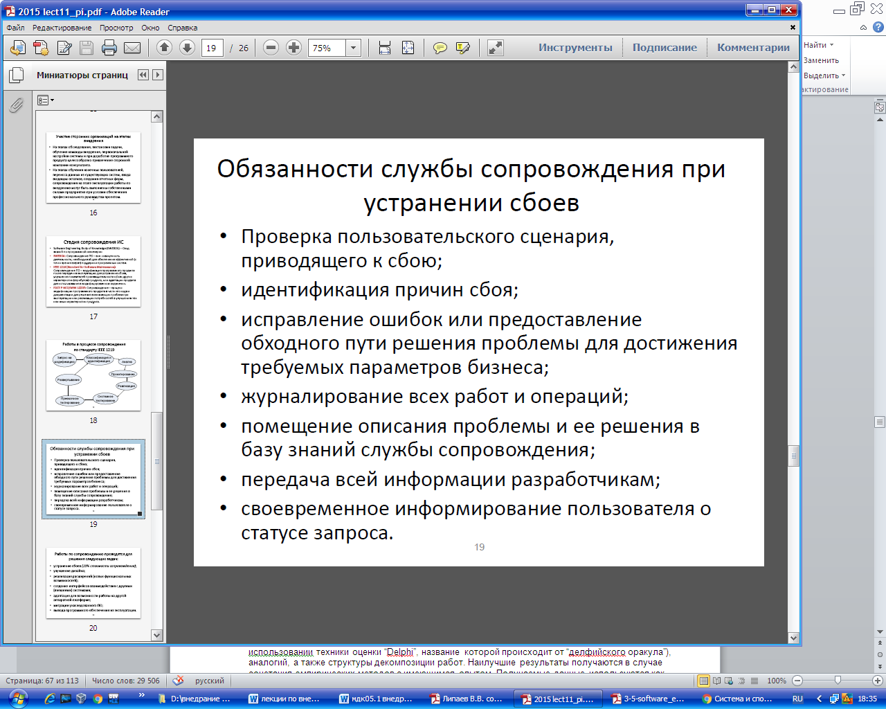

**Ключевые вопросы сопровождения программного обеспечения компьютерных систем**

Для обеспечения эффективного сопровождения программных систем необходимо решать целый комплекс вопросов и проблем, связанных с соответствующими работами. Необходимо понимать, что процесс сопровождения предъявляет уникальные технические и управленческие требования к персоналу, занимающемуся сопровождениям и, в первую очередь, специалистам-инженерам.

Попытка найти дефект в продукте, содержащем 500 тысяч строк кода, написанных другими инженерами – яркий пример сложностей, с которыми приходится сталкиваться инженерам по сопровождению. Другой пример, уже организационный, постоянная борьба за ресурсы с разработчиками (с моей точки зрения, это чаще всего проявляется в вопросах отвлечения разработчиков от текущей работы для помощи в решении проблем сопровождения, а также в

конкуренции за приоритеты финансирование разработки новой системы или сопровождения существующей). Одновременное планирование перспективной версии системы, реализация следующей версии и подготовка критических патчей для текущей версии – еще один классический пример проблем, с которыми приходится сталкиваться в процессе эксплуатации программного обеспечения.

Данная секция представляет некоторые технические и управленческие вопросы, связанные с сопровождением программных систем. Эти вопросы и проблемы сгруппированы в набор тем:

• Технические вопросы

• Управленческие вопросы

• Оценка стоимости

• Измерения
## **Технические вопросы сопровождения  программного обеспечения компьютерных систем.** 
**2.1.1 Ограниченное понимание (Limited understanding)**

Ограниченное понимание подразумевает как быстро инженер по сопровождению может понять где необходимо внести исправления или изменения в код системы, которую он не разрабатывал.

Исследования показывают, что от 40 до 60 процентов усилий по сопровождению тратится на анализ и понимание сопровождаемого программного обеспечения. Формирование целостного взгляда о системе представляет большое значение для инженеров. Этот процесс более сложен в случае анализа текстового представления системы – ее исходного кода, особенно, когда процесс эволюции системы от сборки к сборки, от релиза к релизу, в нем никак не отмечен, не документирован и когда разработчики не могут объяснить историю и структуру изменений, что, к сожалению, случается достаточно часто.

Практика автора показывает, что для объектно-ориентированных программ качественно упрощает задачу понимания кода использование UML-инструментария, способного на основе кода восстановить не только модель классов, но и их взаимодействия в форме диаграмм классов (class diagram), коммуникаций или сотрудничества (collaboration в UML1.x, переименованная в communication в UML 2.0) и, особенно, последовательностей (sequence diagram), демонстрирующая структуру взаимных вызовов во времени. Если соответствующий инструментарий предоставляет

одновременную визуализацию кода и диаграммы и обеспечивает взаимную синхронизацию их с точки зрения навигации (выбор метода в любой из представленных диаграмм автоматически позиционирует соответствующим образом редактор кода и, наоборот) – такие средства автоматизации могут качественно сократить время, необходимое для формирования представления о системе, иногда – даже не в разы, а на порядок (конечно, при достаточном уровне знания используемых технологий со стороны инженера по сопровождению). Если к этому добавить

документированность (и доступность соответствующих активов –спецификаций, моделей) архитектуры и ключевых технологических решений со стороны разработчиков системы – обсуждаемый вопрос, конечно, не становится тривиальным, однако, превращается во вполне решаемую задачу. Вообще говоря, использование соответствующих средств автоматизации построения моделей по коду (задача обратного инжиниринга – rerverse engineering) является обоснованной практикой изучения любой системы или фреймворка. Опыт показывает, что при достаточной квалификации инженера, формирование общего архитектурного представления о системе (или фреймворке), понимания того, какие технологические и структурные подходы и шаблоны использовались при ее построении, позволяет решать возникающие вопросы корректировки кода и расширения функциональности системы, не нарушая общие принципы ее построения, естественным образом обеспечивая ее эволюцию, без ущерба ее целостности. При таком понимании, даже не заглядывая в код системы или фреймворка, инженер способен с очень большой вероятностью предположить возможные причины сбоя, а, в общем случае, и любых аспектов поведения системы. Тема обратного инжиниринга освещается SWEBOK как самостоятельная техника сопровождения, однако, автору показалось важным особо

акцентировать на ней внимание именно в этой части обсуждения вопросов сопровождения.

**2.1.2 Тестирование (Testing)**

Стоимость повторения полного набора тестов для основных модулей системы может быть существенным как по времени, так и по стоимости. Для сопровождения системы особо значимым является выборочное регрессионное тестирование системы или его компонент для проверки того, что внесенные изменения для привели к непреднамеренному изменению поведения программного обеспечения.

Вопрос состоит в том, что часто сложно найти время для необходимого тестирования. Не меньшей проблемой является и координации в проведении тестов различными членами группы сопровождения, занимающимися решением различных задач. Если же система выполняет критичные <для бизнеса> функции, временный вывод системы из эксплуатации (как говорят, перевод системы в offline) для выполнения тестов часто оказывается просто невозможен.

Таким образом, с точки зрения автора, одним из ключевых вопросов сопровождения является организация работ по тестированию модификаций эксплуатируемых систем, вплоть до предварительного планирования и разработки регламентов, в соответствии с которыми, например, основываясь на оценке критичности запросов на изменения (как дефектов, так и важных расширений

– будь то новая функциональность или необходимое расширение интеграционных возможностей),

затрагиваемых модулях, персоналом сопровождения будут проводиться стандартные процедуры. К таким процедурам, наравне с журналированием запросов и проводимых работ, могут и, скорее, должны относиться: 

анализ влияния <изменений> (impact analysis – см. ниже), оценка рисков,

тестирование (различными методами, в различном объеме), выпуск предварительных версий патчей/обновлений в ограниченное использование (если это позволяет спецификация системы),

использование “клона” системы (развертывание ее на идентичном оборудовании в идентичной конфигурации) и т.п.

**2.1.3 Анализ влияния (Impact analysis)**

Анализ влияния описывает как проводить (в частности, с точки зрения эффективности затрат) полный анализ возможных последствий и влияний изменений, вносимых в существующую систему.

Персонал сопровождения должен обладать необходимыми знаниями о специфике системы (в идеальном случае, иметь полное представление о системе на уровне ее разработчиков) – ее содержании и структуре. Инженеры используют эти знания для выполнения работ по анализу влияния, идентифицируя все системы\* и программные продукты, на которые могут повлиять изменения, вносимые в обслуживаемую программную систему. При этом, должны быть определены риски, связанные с внесением обсуждаемых изменений.

\* Как мы видим из описания данных работ в SWEBOK, речь идет не только о компонентах системы, но и о ее окружении, включая другие системы, функционирующие в том же операционном/системном окружении.

Запросы на изменения\*\* (change requests - CR), иногда упоминаемые как запросы на модификацию (modification request - MR), часто также называемые отчетами о проблемах (problem report - PR), должны анализироваться и трансформироваться в термины программной системы. Эти шаги выполняются после того, как соответствующий запрос на изменение начинает обрабатываться в рамках процесса управления изменениями или, как принято называть, конфигурационного управления, и фиксируется в системе конфигурационного управления 

\*\* Обычно запросы на изменения разделяют на две категории – “пожелания” (suggestions), относящиеся к расширению системы, и “отчеты об ошибках” (defect или bug report), направляемые пользователями в службу сопровождения или инженерами по тестированию разработчикам.

Цели анализа влияния могут быть сформулированы следующим образом:

• Получение максимально возможной оценки ресурсов, необходимых для проведения соответствующих работ

• Анализ стоимости и выгоды от внесения запрошенных изменений (обычно касается пожеланий, запросов на расширение системы)

• Обсуждение сложности вопросов, связанных с внесением соответствующих изменений

Сложность решения вопроса, поставленного соответствующим запросом на изменения, часто является основным фактором определения того, когда и как будет решена проблема. Инженеры идентифицирую компоненты, в которые необходимо внести изменения. Обычно рассматривается несколько вариантов решения проблемы и вырабатывается (также, обязательно, фиксируются в соответствующей системе обработки запросов на изменения) наиболее оптимальный путь ее решения.

С точки зрения автора, оптимальность пути не всегда означает наиболее ”красивое” технологическое решение. Иногда это может быть временное решение, может быть даже нарушающее архитектурные шаблоны системы, однако, обоснованное с точки зрения сроков и стоимости его реализации. В то же самое время, результаты анализа направляются разработчикам системы, обычно работающим над

следующей версией, для включения соответствующего изменения уже в рамках принятого стиля кодирования, соглашений, архитектурных шаблонов и т.п. Безусловно, такой путь многим может показаться просто неэтичным, с точки зрения “настоящего” инженерного подхода. Однако, если разработчики готовят следующую версию системы, затрагивая модуль, модифицируемый службой сопровождения, с точки зрения бизнес-решений, “некрасивый”, но быстрый путь достижения требуемого поведения системы, в большинстве случаев, будет выглядеть более обоснованным, чем

принятие на себя персоналом сопровождения функций разработчиков системы. Иногда, если требуемое изменение не столь критично, чтобы решение было предоставлено “вчера” (хотя пользователи, практически всегда, именно так характеризуют свои запросы в терминах приоритета), логичным выглядит откладывание проведения соответствующих модификаций и передача этих работ непосредственно разработчикам. 

Если программное обеспечение изначально разрабатывалось с учетом дальнейшей поддержки, это может существенно облегчить анализ влияний, как одной из ключевых работ по сопровождению.

**2.1.4 Возможность сопровождения (Maintainability)**

Возможность сопровождения или сопровождаемость программной системы определяется, например, глоссарием IEEE (стандарт 610.12-90 Standard Glossary for Software Engineering Terminology, обновление 2002 года) как легкость сопровождения, расширения, адаптации и корректировки для удовлетворения заданных требований. Стандарт ISO/IEC 9126-01 (Software Engineering – Product Quality – Part 1: Quality Model, 2001 г.) определяет возможность сопровождения как одну из характеристик качества.

Для уменьшения стоимости дальнейшего сопровождения, на протяжении всего процесса разработки необходимо специфицировать, оценивать и контролировать характеристики, влияющие на возможность сопровождения. Если такие работы проводятся регулярно, это облегчает дальнейшее сопровождение, повышая его сопровождаемость (в частности, как характеристику качества). Часто этого сложно добиться, потому, что, к сожалению, такого рода характеристики игнорируются при

разработки. Разработчики заняты другими запланированными работами и также часто пренебрегают требованиями, предъявляемыми к сопровождаемости системы.

Одной из ключевых проблем сопровождения является отсутствие системной документации, мешающее формированию понимания системы и, как следствие, невозможности адекватного анализа влияния. Эта и другие проблемы могут быть решены при использовании систематического подхода к построению зрелых процессов, применению соответствующих техник и автоматизации необходимых задач по поддержке жизненного цикла с помощью специализированных
## **Управленческие вопросы сопровождения  программного обеспечения компьютерных систем.** 
**2.2.1 Согласование с организационными целями (Alignment with organizational objectivies)**

Организационные цели описывают как продемонстрировать возврат инвестиций от деятельности по сопровождению программного обеспечения. Обычно, разработка ведется на проектной основе, с определенными временными и бюджетными ограничениями. Главный акцент, при этом, делается на выпуске системы, отвечающей потребностям пользователей, в заданные сроки и в рамках бюджета.

В отличие от этого, сопровождение системы преследует цели максимального продления срока эксплуатации программного обеспечения. Такой подход может основываться на необходимости обновления и расширения программного обеспечения, как отклика на изменяющиеся потребности пользователей. При этом, оценка возврата инвестиций становится более сложной и приводит к формированию точки зрения старшего менеджмента, что деятельность по сопровождению потребляет значительную часть ресурсов без явно выраженной и количественно определяемой отдачи для организации.

**2.2.2 Проблемы кадрового обеспечения\* (Staffing)**

Данная тема касается вопросов привлечения и удержания квалифицированного персонала по сопровождению. Часто, работа по сопровождению не выглядит привлекательной, инженеры по поддержке воспринимаются как специалисты “второго класса” (в SWEBOK используется устойчивое выражение “second-class citizens”), что приводит к безусловному падению духа коллектива, отвечающего за поддержку систем.

По мнению автора, это серьезный вызов для менеджеров, отвечающих за вопросы сопровождения и, вообще говоря, является классической задачей общего менеджмента. Решение этой задачи, в первую очередь, находится в руках старшего менеджмента, формирующего соответствующий стиль отношений между функциональными и вспомогательными подразделениями. На более высоком уровне, для организаций и бизнесов - потребителей информационных технологий, эта задача

связана с внутрикорпоративными департаментами автоматизации, в целом, которые слишком часто воспринимаются только как центры затрат, а информационные технологии не рассматриваются как актив. В результате, такая позиция приводит к снижению эффективности работы подразделений автоматизации, а, следовательно, и падению качества информационного обеспечения бизнеса, что

сказывается, в подавляющем большинстве случаев, и на бизнесе, как таковом.

\* такой перевод, вместо просто “кадрового обеспечения”, в большей степени соответствует принятому использованию термина staffing. Часто, staffing подразумевает и высокую текучесть кадров.

**2.2.3 Процесс (Process)**

Процесс (в общем случае, жизненный цикл, прим. автора) является набором работ (activities), методов, практик и, своего рода, трансформаций, которые используются людьми для разработки и сопровождения программных систем и ассоциированных с ними продуктов. На уровне процесса, деятельность по сопровождению программного обеспечения имеет очень много общего с разработкой, например, в части конфигурационного управления, являющегося критически важной составляющей обоих видов деятельности. В то же время, сопровождение включает работы, не представленные в процессе разработки.

**2.2.4 Организационные аспекты сопровождения (Organizational aspects of maintenance)**

В первую очередь, организационные вопросы подразумевают какая организация будет отвечать и/или какие функции необходимо выполнять для обеспечения деятельности по сопровождению.

Команда, разрабатывавшая программный продукт, далеко не всегда отвечает за его сопровождение.

Это не только стандартное управленческое решение независимых поставщиков программного обеспечения, но, также, часто встречается в организациях, использующих программные продукты в целях автоматизации своих бизнес-функций.

При решении вопроса, где (кем) будут осуществляться функции по сопровождению, может быть принято решение оставить их непосредственно тем, кто разрабатывал систему (как в терминах организации/компании, так и подразумевая непосредственно коллектив разработчиков), или передать другой команде или стороне (maintaner). Часто, выбор сопровождающей организации осуществляется исходя из тех соображений, которые выглядят обоснованными для обеспечения адекватной поддержки системы и возможности ее эволюционирования для удовлетворения меняющихся потребностей пользователей. К сожалению (чего, в принципе, и следовало ожидать), универсальных подходов в решении данного вопроса, кем будет сопровождаться система – нет.

Соответствующие решения принимаются в каждом конкретном случае, с учетом его специфики (case-by-case). Но, что действительно важно отметить, делегирование или назначение полномочий и ответственности по сопровождению должно быть произведено по отношению только к одной организации или лицу (менеджеру соответствующей команды поддержки). Все, так или иначе, зависит от организационной структуры организации/компании, эксплуатирующей программное

обеспечение.

**2.2.5 Аутсоурсинг (Outsourcing)**

Заимствованный термин “аутсоурсинг” уже прижился не только в среде ИТ-менеджеров, он стал частью современного бизнеса и управленческих практик. Суть его заключается в передаче работ, в первую очередь, вспомогательных (непрофильных для организации) “на сторону”. Крупные корпорации передают в управление другим организациям целые портфели программных систем, а, иногда, и целиком всю ИТ-инфраструктуру. В то же время, существенно более часто, сопровождение передается другим организациям только для “второстепенных” программных систем (или, как

минимум, не критичных для выполнения бизнес-функций), так как владельцы таких систем не желают терять контроль над ассоциированными с этими системами данными и/или функциональностью. Отмечается, что некоторые передают работы по сопровождению “в аутсоурсинг” только в тех случаях, если убеждены в стратегическом контроле над сопровождением.

Автор не раз наблюдал, когда для решения вопросов сопровождения (при сохранении

“стратегического контроля”), компании, для которых информационные технологии не являются профильными, но воспринимаются в качестве актива, формируют специализированные дочерние бизнес-структуры, которым и передаются функции сопровождения, а также и непосредственно разработки программных систем и, более того, поддержки и развития всей ИТ-инфраструктуры. Это делается с тем, чтобы функционируя в качестве самостоятельной бизнес-сущности, уже бывшие внутрикорпоративные подразделения автоматизации, могли обеспечить большую прозрачность финансовых потоков, затрат, связанных с информационным технологиями. Но, это тема уже относится к общим вопросам управления и, безусловно, требует самостоятельного обсуждения, в контексте, опять-таки, конкретной организации или бизнес-структуры. Однако, нельзя было не обозначить важность обсуждаемого вопроса в данном контексте, ведь именно деятельность по сопровождению часто подвигает организации-потребители ИТ к принятию столь серьезных организационных и бизнес-решений.

При этом, подчеркивает SWEBOK, контроль сложно измерить. В свою очередь, перед аутсоурсером (организацией, принимающей на себя ответственность по сопровождению) стоит серьезная проблема по определению содержания соответствующих работ, в том числе, для описания содержания соответствующего контракта. Отмечается, что около 50% сервисов, предоставляемых аутсоурсером, проводятся без соответствующего детального и однозначно интерпретируемого соглашения (service level agreement, SLA). Компании, занимающиеся аутсоурсингом, обычно затрачивают несколько месяцев на оценку программного обеспечения прежде, чем заключают соответствующий контракт. Еще один вопрос, требующий специального внимания, заключается в необходимости определения процесса и процедур передачи программного обеспечения на внешнее сопровождение.
## **Обязанности службы сопровождения при устранении сбоев.** 

## **Оценка стоимости сопровождения программного обеспечения компьютерных систем.** 
Как уже отмечалось, инженеры должны понимать разницу в различных категориях сопровождения.

Это, в большой степени, необходимо для оценки соответствующих затрат. С точки зрения планирования, как составной части проектной и управленческой деятельности, оценка стоимости является важным аспектом деятельности по сопровождению программного обеспечения.

На стоимость работ по сопровождению оказывает влияние множество различных факторов. ISO/IEC 14764  определяет, что «существует два наиболее популярных метода оценки стоимости сопровождения: – параметрическая модель и использование опыта». Чаще всего, оба этих подхода комбинируются для повышения точности оценки.

**2.3.1 Оценка стоимости (Cost Estimation)**

При обсуждении анализа влияния (см. 2.1.3 Impact Analysis) говорилось о том, что такой анализ помогает в оценке стоимости работ по сопровождению. На эти затраты оказывает влияние Software Maintenance) определяет, что “существует два наиболее популярных метода оценки стоимости сопровождения – параметрическая модель и использование опыта”. Чаще всего, оба этих подхода комбинируются для повышения точности оценки.

**2.3.2 Параметрические модели (Parametric models)**

SWEBOK приводит ряд источников, подробно рассматривающих вопросы оценки стоимости сопровождения и, в частности, параметрические модели. Для использования таких моделей используются данные предыдущих проектов. Наравне с историческими данными используется метод функциональных точек (см. стандарт IEEE 14143.1-00).

**2.3.3 Опыт (Experience)**

Среди тех подходов, которые позволяют повысить точность оценок, полученных при использовании параметрических моделей – применение опыта (в форме экспертного мнения, например, при использовании техники оценки “Delphi”, название которой происходит от “делфийского оракула”), аналогий, а также структуры декомпозиции работ. Наилучшие результаты получаются в случае сочетания эмпирических методов с имеющимся опытом. Получаемые данные используются как

результат программы измерения аспектов сопровождения.

