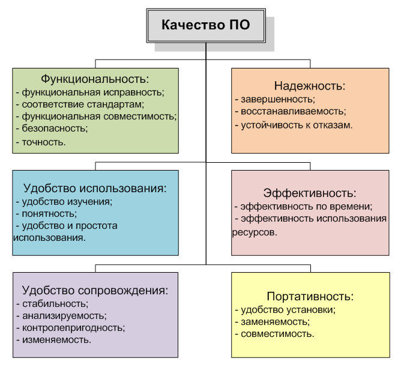
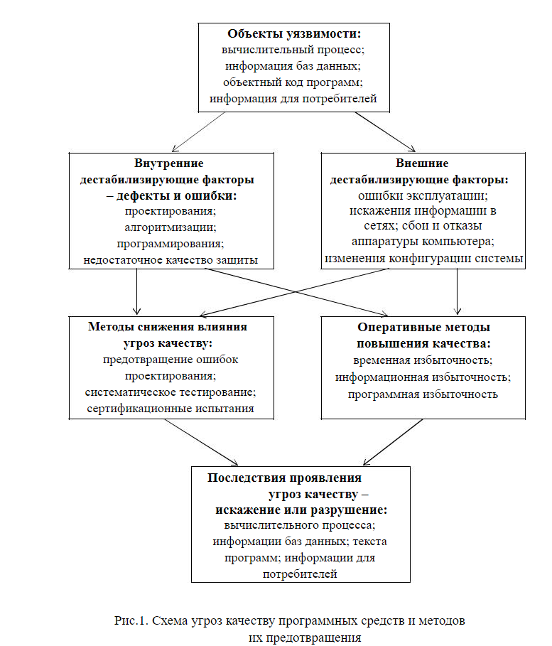
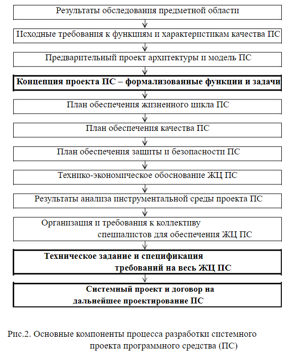

**ТЕМА 2. ОБЕСПЕЧЕНИЕ КАЧЕСТВА ПРОГРАММНЫХ СРЕДСТВ**

|1.1. Основные понятия и определения.........................................................|
| :- |
|1.2. Представления о качестве программных средств в течение|
|жизненного цикла........................................................................................................|
|1.3. Факторы, определяющие качество программных средств.................|
|1.4. Методы обеспечения качества программных средств......................|
|1.5. Ресурсы, влияющие на качество ПС...................................................|
|1.6. Системное проектирование программных средств...........................|
|1.7. Статистические характеристики проявления ошибок в программах.|
## **1.1. ОСНОВНЫЕ ПОНЯТИЯ И ОПРЕДЕЛЕНИЯ**
Накопленный мировой опыт в области обеспечения качества ПС обобщен в международных и национальных стандартах. За рубежом требования стандартов к ЖЦ информационных систем (ИС) и ПС во многих случаях являются обязательными и определяют конкурентоспособность продукции. Пренебрежение стандартами, наблюдаемое среди отечественных специалистов, резко снижает конкурентоспособность отечественных ПС за рубежом, созданных даже на отличной алгоритмической базе.

Можно выделить следующие основные *цели применения стандартов* при создании ПС:

1)снижение трудоемкости, длительности, стоимости и улучшение других технико-экономических показателей проектов ПС;

2)повышение качества разрабатываемых или покупных компонентов и ПС в целом при их приобретении, разработке, эксплуатации и сопровождении;

3)обеспечение возможности расширять программное средство по набору прикладных функций и масштабировать в зависимости от размерности решаемых задач;

4)поддержка функциональной интеграции в ПС задач, ранее решавшихся раздельно;

5)обеспечение переносимости прикладных программ и данных между разными аппаратно-программными платформами.

Применение стандартов позволяет ориентироваться на построение систем из крупных функциональных узлов, отвечающих требованиям стандартов, применять отработанные и проверенные проектные решения Стандарты определяют унифицированные интерфейсы и протоколы взаимодействия компонентов системы, облегчают повторное использование в новых системах готовых и проверенных прикладных программ. Таким образом, разработка ПС в значительной степени может сводиться к ее компоновке из стандартных узлов.

В настоящее время компьютеры находят все более широкое применение во всех сферах жизнедеятельности человека. От правильности их работы во многом зависят результаты труда и безопасность тысяч людей. В этой связи в последние годы во всем мире особое внимание уделяется стандартизации программных средств (ПС) и процессов их разработки, прогнозированию, оценке и управлению качеством программных средств на протяжении всего их жизненного цикла.

На процессы разработки и оценки качества ПС оказывают влияние следующие *обобщенные показатели ПС*:

\1. область применения и назначение ПС;

\2. тип решаемых функциональных задач;

\3. объем и сложность ПС;

\4. необходимый состав и требуемые значения характеристик качества ПС, и величина допустимого ущерба из-за недостаточного их качества;

\5. степень связи решаемых задач с реальным масштабом времени или допустимой длительностью ожидания результатов решения задачи;

\6. прогнозируемые значения длительности эксплуатации и перспектива создания множества версий ПС;

\7. предполагаемый тираж производства и применения ПС;

\8. степень необходимой документированности ПС.

Существует ряд национальных, государственных и международных стандартов, посвященных вопросам стандартизации, оценки качества и сертификации программных средств и систем качества предприятия.

В данных стандартах используются следующие понятия и определения. 

***Программы*** – это данные, предназначенные для управления конкретными

компонентами системы обработки информации в целях реализации определенного алгоритма.

***Программное средство*** – объект, состоящий из программ, процедур, правил и документов, относящихся к функционированию системы обработки информации.

***Программный продукт*** – это программное средство, предназначенное для поставки, передачи, продажи пользователю.

***Жизненный цикл (ЖЦ) программного средства или системы –*** это совокупность процессов, работ и задач, включающая в себя разработку, эксплуатацию и сопровождение ПС или системы, охватывающая жизнь ПС или системы от*** установления требований к ним до прекращения их использования.

Под ***качеством*** любого изделия понимается совокупность свойств и характеристик изделия, относящихся к его способности удовлетворять установленные или предполагаемые потребности.

С учетом данного определения ***качество программного средства*** определяется как совокупность свойств программного средства, обуславливающая его пригодность удовлетворять заданные или подразумеваемые потребности в соответствии с его назначением.

В литературе часто используется следующее определение качества ПС:

***качество программного продукта –*** это совокупность его свойств***,*** обеспечивающая возможность достижения его целей без излишних затрат средств и труда со стороны пользователя; ***качество функционирования ПС*** – множество свойств, обусловливающих пригодность ПС обеспечивать надежное*** и своевременное представление требуемой информации потребителю для ее дальнейшего использования по назначению.

***Атрибут*** – измеримое физическое или абстрактное свойство ПС. Атрибуты могут быть внутренними и внешними.

Атрибут рассматривается как ***свойство программного средства*** – отличительная особенность программного средства, которая может проявляться при его создании, испытании, анализе или изменении.

***Критерий оценки*** – это совокупность принятых в установленном порядке правил и условий, с помощью которых устанавливается приемлемость в целом качества программного средства.

***Характеристика качества ПС*** – набор свойств программного средства, посредством которых описывается и оценивается его качество.

***Подхарактеристика качества ПС –*** это характеристика качества программного средства, входящая в состав другой характеристики качества***.***

***Метрика*** – определенные метод и шкала измерения подхарактеристики качества. Метрики качества ПС базируются на внутренних атрибутах ПС и внешнем поведении вычислительной системы (ВС), в состав которой входит ПС.

***Показатель качества ПС*** –характеристика качества программного средства, обладающая количественным значением.

***Уровень пригодности ПС (уровень качества функционирования ПС) –*** это степень удовлетворения потребности, представленная посредством конкретного набора значений характеристик качества программного средства.

***Мера (measure)*** – это число или категория, присвоенная атрибуту объекта путем измерения.

***Измерение* (*measurement)*** – это использование метрики для присвоения атрибуту значения (числа или категории) из шкалы.

Каждый показатель качества может использоваться, если определена его метрика, способы измерения и сопоставления с требующимся значением.

***Шкала*** – набор значений с определенными свойствами.

При оценке качества используются следующие ***типы шкал***:

1)*номинальная* – соответствует набору категорий;

2)*упорядоченная* – соответствует упорядоченному набору делений шкалы;

3)*интервальная* – соответствует упорядоченной шкале с равноудаленными делениями;

4)*относительная* – соответствует упорядоченной шкале с равноудаленными делениями, оцененными в относительных единицах

(относительно некоторой абсолютной величины).

Метрики, использующие номинальную и упорядоченную шкалы, применяются для оценки качественных показателей, которые нельзя измерить количественно. Метрики, использующие интервальную и относительную шкалы, применяются для оценки количественных показателей.

**1.2.ПРЕДСТАВЛЕНИЯ О КАЧЕСТВЕ ПРОГРАММНЫХ СРЕДСТВ В ТЕЧЕНИЕ ЖИЗНЕННОГО ЦИКЛА**

*Качество программного обеспечения* — характеристика программного обеспечения (ПО) как степени его соответствия требованиям. При этом требования могут трактоваться довольно широко, что порождает целый ряд независимых определений понятия. Чаще всего используется определение ISO 9001, согласно которому качество есть «степень соответствия присущих характеристик требованиям».

**Может определяться следующими критериями: Качество исходного кода**

Основными критериями качества ПО (criteria of software quality) являются:

-функциональность (Способность ПО выполнять набор функций (действий), удовлетворяющих заданным или подразумеваемым потребностям пользователей.Набор указанных функций определяется во внешнем описании ПО)

-надежность (это его способность с достаточно большой вероятностью безотказно выполнять определенные функции при заданных условиях и в течение заданного периода времени)

-эффективность (Соотношение уровня услуг, предоставляемых ПО пользователю при заданных условиях, и объема используемых для этого ресурсов. К числу таких ресурсов могут относиться требуемые аппаратные средства, время выполнения программ, затраты на подготовку данных и интерпретацию результатов)

-эргономичность (Характеристики ПО, которые позволяют минимизировать усилия пользователя по подготовке исходных данных, применению ПО и оценке полученных результатов, а также вызывать положительные эмоции определенного или подразумеваемого пользователя)

-модифицируемость (Характеристики ПО, которые позволяют минимизировать усилия по внесению изменений для устранения ошибок и по его модификации в соответствии с изменяющимися потребностями пользователей. Модифицируемость ПО существенно зависит от степени и качества его документированности)

-мобильность (Способность ПО быть перенесенным из одной среды (окружения) в другую, в частности, с одной аппаратной платформы на другую)

Качество кода может определяться различными критериями. Некоторые из них имеют значение только сточки зрения человека. Например, то, как отформатирован текст программы, совершенно не важно для компьютера, но может иметь серьёзное значение для последующего сопровождения.

- Читаемость кода
- Лёгкость поддержки, тестирования, отладки, исправления ошибок, изменения ипортируемости
- Низкая сложность кода
- Низкое использование ресурсов: памяти и процессорного времени
- Корректная обработка исключительных ситуаций
- Малое число предупреждений при компиляцииилинковке

**Факторы качества**

Фактор качества ПО — это нефункциональное требование к программе, которое обычно не описывается в договоре с заказчиком, но, тем не менее, является желательным требованием, повышающим качество программы.

Некоторые из факторов качества:

*Понятность.*** 

Назначение ПО должно быть понятным, из самой программы и документации.

*Полнота.*** 

Все необходимые части программы должны быть представлены и полностью реализованы.

*Краткость.*** 

Отсутствие лишней, дублирующейся информации. Повторяющиеся части кода должны быть преобразованы в вызов общей процедуры. То же касается и документации.

*Портируемость.*
**
` `Лёгкость в адаптации программы к другому окружению: другой архитектуре, платформе, операционной системе или её версии.

*Согласованность.*** 

По всей программе и в документации должны использоваться одни и те же соглашения, форматы и обозначения.

*Сопровождаемость.*** 

Насколько сложно изменить программу для удовлетворения новых требований. Это требование также указывает, что программа должна быть хорошо документирована, не слишком запутана, и иметь резервноста по использованию ресурсов (память, процессор).

*Тестируемость.*** 

Позволяет ли программа выполнить проверку приёмочных характеристик, поддерживается ли возможность измерения производительности.

*Удобство использования.*** 

Простота и удобство использования программы. Это требование относится, прежде всего,к интерфейсу пользователя.

*Надёжность.*** 

Отсутствие отказов и сбоев в работе программ, а также простота исправления дефектов и ошибок:

*Структурированность*

*Эффективность.*** Насколько рационально программа относится к ресурсам (память, процессор) при выполнении своих задач.

*Безопасность.*** Поддержка внештатной ситуации.

С точки зрения пользователя

Помимо технического взгляда на качество ПО, существует и оценка качества с позиции пользователя. Для этого аспекта качества иногда используют термин «юзабилити». Довольно сложно получить оценку юзабилити для заданного программного продукта. Наиболее важные из вопросов, влияющий на оценку:

- Является ли пользовательский интерфейс интуитивно понятным?
- Насколько просто выполнять простые, частые операции?
- Насколько легко выполняются сложные операции?
- Выдаёт ли программа понятные сообщения об ошибках?
- Всегда ли программа ведёт себя так как ожидается?
- Имеется ли документация и насколько она полна?
- Является ли интерфейс пользователя само-описательным/само-документирующим?
- Всегда ли задержки с ответом программы являются приемлемыми?

**1 Модель качества программного обеспечения**

На данный момент наиболее распространена и используется многоуровневая модель качества программного обеспечения, представленная в наборе стандартов ISO 9126. На верхнем уровне выделено 6 основных характеристик качества ПО, каждую из которых определяют набором атрибутов, имеющих соответствующие метрики для последующей оценки

**2 Основные черты качественного по.**

Программно-технические факторы качества - это нефункциональные требования к программе, которые обычно не описываются в договоре с заказчиком, но тем не менее являются желательным требованием, повышающим качество программы. Некоторые из факторов: понятность(назначение ПО должно быть понятным из самой программы и документации), полнота(все необходимые части программы должны быть представлены и полностью реализованы), правильность(все функции должны быть реализованы в соответствии со спецификацией), краткость(отсутствие лишней, дублирующей информации, повторяющиеся части должны быть преобразованы в функции, модули, библиотеки), то же касается и документации, портируемость (мобильность), лёгкость в адаптации программы к другому окружению: другой архитектуре, платформе, операционной системе, согласованность(во всей программе и в документации должны использоваться одни и те же соглашения, идентификаторы, форматы, обозначения), сопровождаемость (насколько сложно изменить программу для удовлетворения новых требований(модифицируемость). Это требование так же указывает, что программа должна быть хорошо документирована, не слишком запутана и иметь резерв роста по использованию ресурсов(память и процессор)), тестируемость(позволяет ли программа выполнить проверку приёмочных характеристик, поддерживается ли возможность измерения производительности), удобство использования(простота и удобство использования программы), надёжность(отсутствие отказов и сбоев в работе программы, а так же простота исправления дефектов, ошибок, поддержка рестара), эффективность(насколько рационально программа относится к ресурсам), безопасность(поддержка внештатных ситуаций).

**3 . Качество по: мобильность и модифицируемость**.

Одними из требований к качественному ПО являются мобильность и модифицируемость.

Мобильность программного обеспечения - это способность программного обеспечения работать на различных аппаратных платформах или под управлением различных операционных систем.

Программный продукт обладает свойством *модифицируемости,* если он имеет структуру, позволяющую легко вносить требуемые изменения.

Модифицируемость ПО- это такое качество ПО, при котором ПО имеет структуру, позволяющую легко вносить изменения.

**4. Качество по: правильность и надёжность.**

Одними из требований к качественному ПО являются правильность и надёжность.

Программный продукт обладает свойством *надежности,* если можно ожидать, что он будет удовлетворительно выполнять необходимые функции в течение определенного времени.

Существуют следующие подходы по обеспечению надежности:

- предупреждение ошибок;
- самообнаружение ошибок;
- самоисправление ошибок;
- обеспечение устойчивости к ошибкам.

Правильность ПО – это качество ПО отвечать поставленным задачам и требованиям.

В течение жизненного цикла (ЖЦ) ПС его качество изменяется. Для различных стадий ЖЦ стандартами определены следующие ***представления о качестве ПС***:

1.*целевое качество* (ЦК) – необходимое и достаточное качество, отражающее *реальные* потребности заказчика или пользователя; ЦК не может быть полностью определено в начале проектирования ПС, поскольку заказчик не всегда может его четко определить, однако разработчики должны стремиться к достижению ЦК;

2.*требуемое качество продукта* (ТКП) – значения характеристик, фактически установленные в спецификации требований к качеству; ТКП используется как цель для начального утверждения в спецификации; должны фиксироваться оптимальные и допустимые минимальные требования;

3.*качество проекта* (КП) – характеристики, представленные в основных компонентах проекта ПС (архитектуре, структуре программ, проектировании пользовательских интерфейсов); КП отражает концепцию и стратегию проекта;

*4.оценочное (или прогнозируемое) качество продукта (ОКП) –* оцененное или предсказанное качество для конечного ПС на каждой стадии ЖЦ; ОКП основано на качестве процессов и технологии его обеспечения; ОКП может оцениваться и предсказываться в процессе разработки для каждой характеристики качества, определенной в требованиях к ПС;

*5.качество поставленного продукта (КПП) – набор характеристик качества поставленного заказчику и готового к применению ПП, прошедшего испытания в моделированной среде с имитированными или реальными данными;*

6.*качество в использовании* (КВИ) – качество системы, содержащей ПП, с точки зрения пользователя; КВИ измеряется в терминах результата использования программ, а не внутренних свойств ПС.

***Качество ПС отражается тремя группами показателей,*** характеризующими:

•*внутреннее качество*, проявляющееся в процессе разработки;

•*внешнее качество*, заданное требованиями заказчика;

•*качество при использовании* в процессе нормальной эксплуатации и результативность достижения потребностей пользователей с учетом затрат.

Особым показателем качества ПС является ***стоимость*** (*затраты на приобретение, создание, модификацию, эксплуатацию ПС).* Данный показатель качества непосредственно влияет на все остальные показатели качества и определяет выбор пользователя в пользу покупки или разработки ПС. При этом потенциальный потребитель должен иметь механизм сравнения предлагаемых показателей качества и стоимости ПП для выбора поставщика или разработчика.

**1.3.ФАКТОРЫ, ОПРЕДЕЛЯЮЩИЕ КАЧЕСТВО ПРОГРАММНЫХ СРЕДСТВ**

Очевидно, что на качество программных средств существенно влияют ***ошибки*** (fault), выражающиеся в дефектах, погрешностях или неумышленных искажениях объекта или процесса. Определение ошибки основано на предположении, что известно правильное эталонное состояние объекта, по отношению к которому определяется наличие ошибки.

Для организации эффективной борьбы с ошибками необходимо исследование факторов, влияющих на качество ПС со стороны различных ошибок ПС. Такое исследование позволит целенаправленно разрабатывать комплексы методов и средств обеспечения качества сложных ПС различного назначения при реально достижимом снижении уровня ошибок проектирования и разработки.

На рис.1 приведена схема угроз качеству ПС и методов их предотвращения. Модель взаимодействия основных компонентов, приведенных на рис.1, является базой для дальнейшего анализа качества ПС.

Полностью устранить перечисленные на рис.1 негативные воздействия на качество ПС невозможно. Поэтому необходимо разрабатывать методы и средства, уменьшающие их влияние на ПС.

Очевидно, что степень влияния на качество ПС всех внутренних и некоторых внешних дестабилизирующих факторов определяется *качеством технологий проектирования, разработки, сопровождения и документирования ПС*.

9

При ограниченных ресурсах на разработку ПС для достижения заданных требований к качеству необходимо управление обеспечением качества в течение всего ЖЦ программ и данных. Попытки создания сложных ПС без использования эффективных технологий и средств автоматизации проектирования связаны с высоким риском провала проектов вследствие трудностей обеспечения необходимого качества функционирования и взаимодействия компонентов ПС.

**1.4.МЕТОДЫ ОБЕСПЕЧЕНИЯ КАЧЕСТВА ПРОГРАММНЫХ СРЕДСТВ**

Современные технологии поддержки ЖЦ ПС в обязательном порядке включают ***методы и средства обеспечения качества ПС***. По способам обеспечения заданного качества данные методы и средства можно подразделить на следующие *группы*:

*1). методы и средства создания ПС высокого, гарантированного качества;*

*2). методы и средства предотвращения ошибок проектирования за счет систем обеспечения качества, эффективных технологий и средств автоматизации всего ЖЦ комплексов программ и баз данных;*

*3). методы и средства обнаружения и устранения различных ошибок*

проектирования, разработки и сопровождения ПС путем верификации и систематического автоматизированного тестирования на всех этапах жизненного цикла ПС;

*4). методы и средства удостоверения достигнутых значений качества ПС в процессе их испытаний и сертификации перед передачей в эксплуатацию;* 

*5). методы и средства оперативного выявления последствий ошибок программ и данных и автоматизированного восстановления качества и* нормального функционирования ПС.

Методы первой и второй групп базируются на применении *современных* *CASE-технологий и систем автоматизированного проектирования. Их применение является одним из самых эффективных современных путей повышения качества ПС. CASE-средства поддерживают коллективную разработку сложных проектов, используются на этапе системного анализа, разработки технического задания и спецификаций, проектирования концептуальной и логической структур ПС и баз данных (БД), поддерживают автоматическую кодогенерацию и позволяют значительно снижать уровень системных, алгоритмических и программных ошибок при разработке ПО.*

*Тестирование* является основным методом измерения качества, определения корректности, реальной надежности и безопасности функционирования программ на всех этапах ЖЦ ПС. Однако процесс тестирования программ имеет свои *особенности* по сравнению с тестированием аппаратуры:

1). отсутствие эталонной программы, которой должны точно соответствовать все результаты тестирования;

2). принципиальная невозможность использования полных тестовых наборов для исчерпывающей проверки функционирования сложных ПС;

3). относительно невысокая степень формализации критериев качества результатов тестирования и достигаемых при этом корректности и надежности функционирования испытуемых ПС.

Модели внешней среды и наборы тестов по сложности соизмеримы с тестируемыми объектами и не гарантированы от ошибок. В результате в программах и данных всегда остаются ошибки. Часть из них выявляется в процессе эксплуатации ПС в реальной среде.

*Целью сертификации* ПС является удостоверение их качества, надежности и безопасности применения. Сертификация проводится специальными аттестованными проблемно-ориентированными испытательными лабораториями в наиболее жестких условиях тестирования с возможностью создания критических и стрессовых ситуаций в пределах, заданных эксплуатационной и нормативной документацией.

При успешном завершении испытаний на ПС выдается документ – ***сертификат соответствия***. Он официально подтверждает соответствие функций и характеристик ПС стандартам, эксплуатационным и нормативным документам, допустимость его применения в определенной области.

# **1.5. РЕСУРСЫ, ВЛИЯЮЩИЕ НА КАЧЕСТВО ПС**

На выбор методов разработки ПС влияют доступные ресурсы. Следовательно, они являются *косвенными факторами*, влияющими на качество ПС.

*Виды ресурсов*, используемых в жизненном цикле ПС:

1). допустимые финансово-экономические затраты (с учетом затрат на разработку, закупку и эксплуатацию системы качества, закупку и эксплуатацию систем автоматизации проектирования ПС);

2). допустимая длительность разработки (ограничивает возможности тестирования);

3). кадры специалистов (оцениваются численностью, тематической и технологической квалификацией);

4). доступные разработчикам вычислительные ресурсы (аппаратурная оснащенность технологического процесса).

**1.6.СИСТЕМНОЕ ПРОЕКТИРОВАНИЕ ПРОГРАММНЫХ СРЕДСТВ**

Системное проектирование является основой высокого качества жизненного цикла ПС.

В середине 80-х годов произошел перелом в технологиях проектирования сложных ПС, трудоемкость разработки которых составляет десятки и сотни человеко-лет.

Основная *цель современных технологий* создания ПС – повышение экономической эффективности всего ЖЦ ПС. Для этого используются наиболее эффективные методы проектирования и проводится комплексная автоматизация технологий обеспечения всего ЖЦ ПС.

*Понятие современной технологии* включает совокупность методов и инструментальных средств автоматизации технологического процесса разработки и всего ЖЦ ПС. *Технологический процесс* регламентирует порядок организации и проведения работ неавтоматизированного и автоматизированного выполнения технологических операций, направленных на получение в имеющихся организационно-технических условиях готового программного средства с заданными функциями и качеством.

Методологической основой любой технологии является *типовой технологический процесс*. Он отражается набором этапов, операций и используемых методических средств, обеспечивающих ведение разработки на всех стадиях от инициирования проекта и подготовки технического задания до завершения испытаний ПС [4].

В современных технологиях объединены методы непосредственной разработки программ и данных с методами обеспечения качества и организации управления их созданием с учетом технологических и человеческих факторов. Индустриализация технологий создания ПС базируется на стандартизации работ процесса разработки программ, их структурного построения и интерфейсов с операционной и внешней средой. Для этого должны быть определены необходимые для достижения конечной цели состав и этапы работ, а также требуемые для их выполнения ресурсы.

Требуемое качество ПС должно анализироваться и формулироваться в начале их жизненного цикла и обеспечить эффективность всех последующих процессов.
## *Системное проектирование* сложных программ охватывает период их ЖЦ, начиная от формулирования первичного замысла на создание или модернизацию ПС и до начала детального проектирования и разработки ПС. На рис.2 представлены основные компоненты системного проектирования.
Для системного анализа и проектирования требуются специалисты особенно высокой квалификации – системные аналитики, так как их возможные ошибки наиболее сильно отражаются на эффективности и качестве всего ЖЦ ПС.

Поэтому в современных технологиях особое внимание уделяется анализу и развитию методов и средств автоматизации начальных этапов проектирования.

*Основная цель системного проектирования – обоснование необходимости, направлений и концепций создания или модернизации ПС или изменений его качества.*

В настоящее время на этапе системного проектирования широко используются *CASE-средства (Computer Aided Software (System) Engineering).*

Современные CASE-средства обеспечивают широкие возможности выбора процессов моделирования предметной области, автоматизированного анализа системных требований и выработки первичных требований к проекту ПС. Для этого разработаны специальные методы и средства описания систем на различных уровнях детализации функций, качества и архитектуры ПС (диаграммы потоков данных, потоков управления, сущность-связь и др.).

CASE-средства позволяют также выполнять стратегическое планирование проекта ПС, обеспечивают наглядное представление каждого плана, оценку возможной трудоемкости и длительности разработки, необходимого числа специалистов и других ресурсов для их реализации.

Проведенные оценки проекта позволяют осуществить предварительный выбор основных CASE-методов и инструментальных средств для проведения последующего рабочего проектирования и поддержки всего ЖЦ.

*Результатами системного проектирования является системный проект,* техническое задание (ТЗ) и договор на продолжение проектирования или решение о его нецелесообразности и прекращении.

**1.7.СТАТИСТИЧЕСКИЕ ХАРАКТЕРИСТИКИ ПРОЯВЛЕНИЯ ОШИБОК В ПРОГРАММАХ**

Особенность выявления ошибок в программах и данных ПС – отсутствие полностью определенного эталона. Поэтому при тестировании сначала обнаруживаются *вторичные ошибки* – результаты проявления некоторых исходных дефектов, называемых *первичными ошибками*.

Вторичные ошибки делятся на *три категории:*

•сбои, не отражающиеся существенно на работоспособности ПС, и приносящие ущерб, которым можно пренебречь;

•ординарные отказы, ущерб от которых находится в некоторых допустимых пределах, отражающиеся на показателях качества ПС;

•катастрофические отказы, ущерб от которых влияет на безопасность применения ПС.

В общем случае по типу первичных ошибок невозможно предсказать категорию вторичной ошибки. Поэтому невозможно ранжировать типы первичных ошибок по степени их влияния на качество ПС.

Наиболее существенными *факторами*, влияющими на статистические характеристики первичных ошибок, являются:

•методология, технология и уровень автоматизации обеспечения ЖЦ ПС и программирования его компонентов;

•длительность с начала процесса тестирования и текущий этап разработки программ;

•класс ПС, размер и типы тестируемых программных компонентов;

•методы, виды, уровень автоматизации и адекватность тестирования;

•виды и достоверность эталонов.

Первичные ошибки, в порядке усложнения их обнаружения и увеличения ресурсов, необходимых для их устранения, разделяются на следующие *виды*:

• технологические ошибки подготовки машинных носителей и документации, ввода программ в память компьютера и их вывода на  отображающие средства;

•программные ошибки, вследствие неправильной записи исходного текста программ на языке программирования и ошибок трансляции программ в объектный код;

•алгоритмические ошибки, связанные с неполным формированием необходимых условий решения, некорректной постановкой и спецификацией задач;

•системные ошибки, обусловленные отклонением функционирования ПС в реальной системе и характеристик внешних объектов от предполагавшихся при проектировании.

В настоящее время существуют математические модели, описывающие основные закономерности изменения суммарного числа обнаруживаемых вторичных ошибок в программах. Модели имеют вероятностный характер и дают удовлетворительные результаты при высоких уровнях интенсивности проявления ошибок (т.е. при невысоком качестве ПС). Данные модели предназначены для приближенной оценки:

•потенциально возможной надежности функционирования комплексов программ в процессе испытаний и эксплуатации;

•числа случайных ошибок, оставшихся не выявленными в анализируемых программах;

•времени тестирования, требующегося для обнаружения следующей ошибки в функционирующей программе;

•времени, необходимого для выявления всех имеющихся ошибок в ПС с заданной вероятностью.

