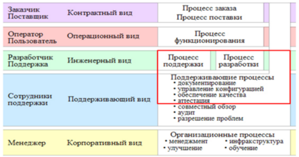

***Практическая работа № 2***

**Выполнение заданий по группам в соответствии с ЖЦПО**

*Цель работы:* научиться выполнять разработку программного продукта в команде на различных этапах жизненного цикла программного обеспечения

*Содержание работы*

1. Рассмотрение теоретической части: этапы и последовательность разработки программ, понятие ЖЦПО.
1. Выполнение заданий по работе в командах в соответствии с ЖЦПО

*Теоретическое обоснование*

В реальности разработчику, кроме выполнения своих прямых обязанностей, приходится заниматься также участием в других процессах, которые, по стандарту, должна принимать на себя другой участник жизненного цикла ПО. Чаще всего это документирование  и аттестация, реже – обеспечение качества и управление конфигурацией.

Документирование. Разработчик создает руководство пользователя по работе с разрабатываемым программным средством и техническое задание на разработку программного средства. Другие программные документы от разработчика требуются реже.

Аттестация. — определение полноты соответствия установленных требований, созданной системы или программного продукта их функциональному назначению. Аттестация не является обязательным процессом ЖЦПО и выполняется, как правило, только по требованию заказчика или для соответствия стандартам на определенные виды программного обеспечения. Обычно аттестация выполняется с помощью испытаний, для которых должна быть разработана программа и методика испытаний. которые создаются разработчиком.

Обеспечение качества — тестирование разрабатываемого средства. В крупных организациях тестированием занимаются квалифицированные специалисты – тестеры, но в мелких организациях тестированием часто приходится заниматься самим программистам.

Управление конфигурацией  —  производится  по собственной инициативе разработчика, для обозначения, определения и установления состояния программных объектов в системе; управления изменениями и выпуском объектов; описания и сообщения о состояниях объектов и заявок на внесение изменений в них; обеспечения полноты, совместимости и правильности объектов; управления хранением, обращением и поставкой объектов. Часто средства управления конфигурацией входят в состав интегрированных средств разработки.

Рис.2. Процессы, которые могут попасть в область компетенции разработчика

*Методические указания*

Для выполнения практической работы вам понадобиться вспомнить основные модели ЖЦПО, их этапы, а также практическая работа №1

*Задания*

- Вспомните основные процессы ЖЦПО.
- Рассмотрите и проанализируйте их
- В соответствии с распределёнными ранее функциональными ролями распределите свои функции по процессам ЖЦПО
- Составьте план работ по созданию программного продукта и оформите его в электронном виде.

*Контрольные вопросы*

- Назовите этапы и последовательность разработки программ
- Дайте определение жизненному циклу программного обеспечения
- Назовите основные процессы ЖЦПО

*Форма отчёта*

Конспект, электронный документ с планом создания программного продукта и распределёнными функциональными ролями. Ответы на вопросы.

