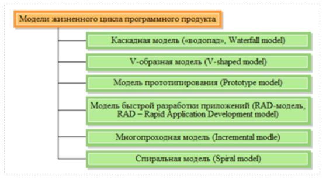

*Практическая работа № 3*

**Разработка программного продукта с различным ЖЦПО**

*Цель работы:* научиться выполнять разработку программного продукта в команде с различным жизненным циклом

*Содержание работы*

Составление планов работ по созданию программного обеспечения с различным жизненным циклом

*Теоретическое обоснование*

Модель жизненного цикла программного продукта – структура, определяющая последовательность выполнения процессов, действие и задач, выполняемых на протяжении жизненного цикла программного продукта (ПП), и взаимосвязь между ними.

Рис.3. Наиболее распространённые модели жизненного цикла ПП

Модель жизненного цикла зависит от специфики и сложности выполняемого проекта и от условий, в которых создается и будет функционировать программный продукт.

*Методические указания*

Для выполнения практической работы вам понадобиться вспомнить основные модели ЖЦПО, их этапы, а также практические работы № 1 и 2

*Задания*

- Вспомните основные модели ЖЦПО.
2. Выберите для вашей группы одну из моделей и обсудите перечень работ по созданию программного обеспечения для своего варианта ПП.
2. Распределите работы между участниками группы
2. Составьте план работ по созданию ПП и оформите его в электронном виде.

*Контрольные вопросы*

- Перечислите модели ЖЦПО
- Дайте сравнительную характеристику каждому виду.

*Форма отчёта*

Конспект, электронный документ с планом создания программного продукта и распределёнными функциональными ролями. Ответы на вопросы.

